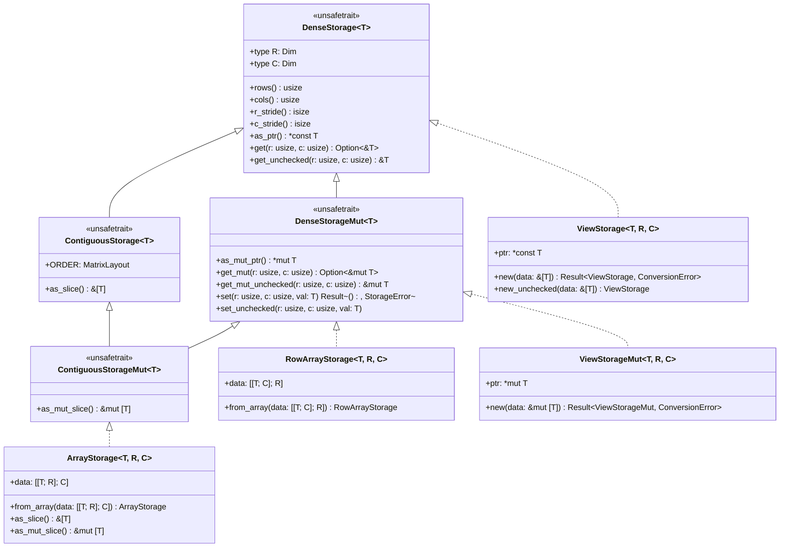
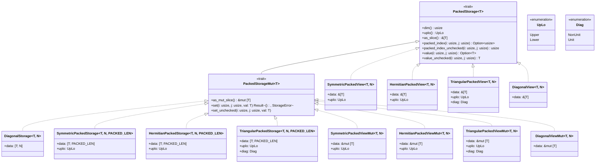

# Storage Backends & Data Layouts (Design Document)

---

### 1. Introduction

`src/math/storage.rs`
establishes the foundation for linear algebra in `control-rs`, providing a
unified
storage hierarchy across dense strided arrays, packed structured matrices (
symmetric,
Hermitian, triangular, diagonal), and sparse graph representations (CSR, CSC,
COO, 1-D sparse vectors) (dimforge, 2026a; sparsemat, 2026a; Netlib, 2026).

The storage architecture supports **primitive integers** (`u8`–`u64`, `i8`–
`i64`),
**fixed-point numbers** (`fixed-num`), **floating-point scalars** (`f32`,
`f64`),
and **complex numbers** (`Complex<T>`). All storage contracts provide dual
**checked** (returning `Option<&T>` / `Option<T>`) and **unchecked** (calling
`unsafe`
pointer arithmetic) accessors, ensuring safety at boundary interfaces and
branchless, zero-overhead execution in inner subprogram loops (dimforge, 2026a;
sarah-quinones, 2026b).

---

### 2. Requirements

#### 2.1 Functional Requirements

- **FR-1 — Dense Strided Storage**: `unsafe trait DenseStorage<T>` provides
  type-level dimensions via associated types `type R: Dim; type C: Dim;`,
  dimension projections `rows() -> usize { Self::R::USIZE }`,
  `cols() -> usize { Self::C::USIZE }`, strides `r_stride() -> isize`,
  `c_stride() -> isize`,
  base data pointer `as_ptr() -> *const T`, safe checked
  `get(r, c) -> Option<&T>`,
  and `unsafe get_unchecked(r, c) -> &T` (dimforge, 2026a; NumPy Developers,
  2026).
- **FR-2 — Dense Mutable Storage**:
  `unsafe trait DenseStorageMut<T>: DenseStorage<T>` provides base mutable
  pointer
  `as_mut_ptr() -> *mut T`, safe `get_mut(r, c) -> Option<&mut T>`,
  `set(r, c, val) -> Result<(), StorageError>`, and `unsafe` variants
  `get_mut_unchecked(r, c) -> &mut T`, `set_unchecked(r, c, val)`
  (dimforge, 2026a; sarah-quinones, 2026b).
- **FR-3 — Contiguous Memory Markers**:
  `unsafe trait ContiguousStorage<T>: DenseStorage<T>` (`as_slice() -> &[T]`,
  `const ORDER: MatrixLayout`)
  and
  `unsafe trait ContiguousStorageMut<T>: ContiguousStorage<T> + DenseStorageMut<T>` (
  `as_mut_slice() -> &mut [T]`)
  guarantee contiguous memory without padding (dimforge, 2026a).
- **FR-4 — Owned Dense Storage**:
  `ArrayStorage<T, const R: usize, const C: usize>` (column-major) and
  `RowArrayStorage<T, const R: usize, const C: usize>` (row-major) provide
  stack-allocated inline nested
  arrays `[[T; R]; C]` and `[[T; C]; R]`, avoiding unstable
  `generic_const_exprs`.
  Each implements `DenseStorage<T>` with associated types
  `type R = Const<R>; type C = Const<C>;`
  (dimforge, 2026b; rust-embedded, 2026a).
- **FR-5 — Non-Owning Strided Views**: `ViewStorage<'a, T, R: Dim, C: Dim>` and
  `ViewStorageMut<'a, T, R: Dim, C: Dim>` borrow slices with arbitrary `isize`
  strides
  without allocation, implementing `DenseStorage<T>` / `DenseStorageMut<T>` (
  dimforge, 2026c; Eigen, 2026a, 2026b).
- **FR-6 — Zero-Cost Transpose & Reverse Views**: Slicing methods provide
  zero-copy transposition (`transpose_view()`, strides swapped) and vector
  reversal (`reverse_view()`, negative row stride) (rust-ndarray, 2026a;
  NumPy Developers, 2026; sarah-quinones, 2026b).
- **FR-7 — Packed Structured Storage**: `unsafe trait PackedStorage<T>`
  decouples physical
  element lookup `packed_index(i, j) -> Option<usize>` from algebraic evaluation
  `value(i, j) -> Option<T>`, providing `type N: Dim;`, `dim()`, `uplo()`,
  `as_slice()`,
  `packed_index_unchecked()`, and `value_unchecked()` (Anderson et al., 1999;
  Netlib, 2026).
- **FR-8 — Packed Mutation**:
  `unsafe trait PackedStorageMut<T>: PackedStorage<T>` provides
  `as_mut_slice()`, safe `set(i, j, val)`, and `unsafe set_unchecked(i, j, val)`
  for physical storage slots (Netlib, 2026).
- **FR-9 — Packed Leaf Implementations**: Provide
  `SymmetricPackedStorage<T, N, L>` (SP), `HermitianPackedStorage<T, N, L>` (
  HP),
  `TriangularPackedStorage<T, N, L>` (TP), and `DiagonalStorage<T, N>` with
  $N(N+1)/2$ and $N$ elements (Lawson et al., 1979; Dongarra et al., 1988;
  Anderson et al., 1999).
- **FR-10 — Non-Owning Packed Views**: `SymmetricPackedView`,
  `HermitianPackedView`,
  `TriangularPackedView`, and `DiagonalView` (and their `...Mut` counterparts)
  borrow packed slices without data copies (Anderson et al., 1999; Netlib,
  2026).
- **FR-11 — Sparse Storage Contract**: `unsafe trait SparseStorage<T>` provides
  `type R: Dim; type C: Dim;`, non-zero traversal (`nnz()`, `row_indices()`,
  `col_indices()`, `values()`),
  and entry query `get(r, c) -> Option<T>` (SciPy Developers, 2026; sparsemat,
  2026a).
- **FR-12 — Mutable Sparse Entry Modification**:
  `unsafe trait SparseStorageMut<T>: SparseStorage<T>` provides in-place
  mutation of existing
  non-zeros (`values_mut()`, `get_mut(r, c)`, `set(r, c, val)`) without
  structural reallocation (sparsemat, 2026a; Eigen, 2026c).
- **FR-13 — Compressed Sparse Formats**: `CsrStorage<T>` and `CscStorage<T>`
  provide row/column offset slicing with defensive bounds checks (SciPy
  Developers, 2026;
  Eigen, 2026c; sparsemat, 2026a).
- **FR-14 — Fixed-Capacity Stack Sparse Leaves**: `ArrayCsrStorage`,
  `ArrayCscStorage`, and `ArrayCooStorage` manage fixed capacities `MAX_NNZ` on
  `#![no_std]` stacks (rust-embedded, 2026a; sparsemat, 2026a).
- **FR-15 — 1-D Sparse Vector Abstraction**: `SparseVectorStorage<T>`,
  `ArraySparseVector<T, N, MAX_NNZ>`, and `ViewSparseVector<'a, T, N>` support
  sparse vector-vector BLAS routines (Lawson et al., 1979; sparsemat, 2026b).
- **FR-16 — Layout Conversions**: Provide conversion traits (`ToDenseStorage`,
  `FromDenseStorage`, `ToCsrStorage`, `ToCscStorage`) between dense, packed,
  and sparse formats (sparsemat, 2026a).
- **FR-17 — Complex & Hermitian Support**: `HermitianPackedStorage<T, N, L>`
  enforces conjugate reflection ($A_{i,j} = \overline{A_{j,i}}$) and validates
  real diagonals ($\text{Im}(A_{i,i}) = 0$) on write (Anderson et al., 1999;
  Netlib, 2026). Adjoint / conjugate transposition is resolved in subprograms
  via `Trans::ConjTrans`.

#### 2.2 Non-Functional Requirements & Constraints

- **NFR-1 — `#![no_std]` Compatibility**: Core storage executes with zero
  dynamic heap allocation (rust-embedded, 2026a).
- **NFR-2 — Compile-Time Verification**: Fixed capacities and array lengths are
  checked statically at compile time without unstable `generic_const_exprs`.
- **NFR-3 — Zero-Branch Codegen**: Unchecked pointer indexing compiles to
  branchless instructions with 0 panic paths at `opt-level=3`.
- **C-1 — Strided Index Arithmetic**: Pointer offset
  is $r \cdot RS + c \cdot CS$ using `isize` arithmetic (NumPy Developers, 2026;
  sarah-quinones, 2026b).
- **C-2 — Const Bounds Invariant**: Packed array lengths require $L = N(N+1)/2$
  enforced via const assertions (Anderson et al., 1999).
- **C-3 — Defensive & Unchecked Safety Contract**: Safe accessors validate
  bounds; `unsafe` accessors require caller-proven bounds. `DenseStorage` and
  `DenseStorageMut` are `unsafe trait`s to guarantee backing pointer validity
  (vbarrielle, 2015; dimforge, 2026a).
- **C-4 — Dim Call Site**: `DenseStorage<T>` associated types
  `type R: Dim; type C: Dim;`
  consume `num-types-design.md`. `Const<N>: Dim` follows num-types C-1 (
  `0..=1024`
  plus extra powers of two through `16384`). Named `U*` aliases are a
  convenience subset (num-types FR-4); a C-1 value without an alias is
  `<Const<N> as Dim>::TypeNum`. Owning array leaves bind
  `const R: usize, const C: usize`
  and implement `DenseStorage<T>` with `type R = Const<R>; type C = Const<C>;` (
  rust-embedded, 2026a).

---

### 3. Technical Overview

The storage architecture is organized into three distinct, decoupled storage
subsystems: **Strided & Dense Storage**, **Packed Structured Storage**, and
**Sparse & Sparse Vector Storage**.

_Figure 1: UML hierarchy for Dense Storage (`DenseStorage<T>`), Contiguous
Storage markers, stack backends, and non-owning views._

#### 3.2 Packed Structured Storage Hierarchy

_Figure 2: UML hierarchy for packed structured storage traits, structured matrix
leaves, views, and structural enums._

#### 3.3 Sparse & Sparse Vector Storage Hierarchy

```mermaid
classDiagram
    direction TB

    class SparseStorage~T~ {
        <<trait>>
        +rows() usize
        +cols() usize
        +nnz() usize
        +get(r: usize, c: usize) Option~T~
    }

    class SparseStorageMut~T~ {
        <<trait>>
        +values_mut() &mut [T]
        +get_mut(r: usize, c: usize) Option~&mut T~
        +set(r: usize, c: usize, val: T) Result~(), StorageError~
        +set_unchecked(r: usize, c: usize, val: T)
    }

    class CsrStorage~T~ {
        <<trait>>
        +row_offsets() &[usize]
        +col_indices() &[usize]
        +values() &[T]
        +row_slice(r: usize) Option~(&[usize], &[T])~
        +row_slice_unchecked(r: usize)(&[usize], &[T])
    }

    class CscStorage~T~ {
        <<trait>>
        +col_offsets() &[usize]
        +row_indices() &[usize]
        +values() &[T]
    }

    class SparseVectorStorage~T~ {
        <<trait>>
        +len() usize
        +nnz() usize
        +indices() &[usize]
        +values() &[T]
    }

    class ArrayCsrStorage~T, R, C, MAX_NNZ, R1~ {
+values: [T; MAX_NNZ]
+col_indices: [usize; MAX_NNZ]
+row_offsets: [usize; R1]
+nnz: usize
+from_coo(coo: &ArrayCooStorage) Result~ArrayCsrStorage, StorageError~
}

class ArrayCscStorage~T, R, C, MAX_NNZ, C1~ {
+values: [T; MAX_NNZ]
+row_indices: [usize; MAX_NNZ]
+col_offsets: [usize; C1]
+nnz: usize
}

class ArrayCooStorage~T, R, C, MAX_NNZ~ {
+row_indices: [usize; MAX_NNZ]
+col_indices: [usize; MAX_NNZ]
+values: [T; MAX_NNZ]
+nnz: usize
+push(r: usize, c: usize, val: T) Result~(), StorageError~
}

class ArraySparseVector~T, N, MAX_NNZ~ {
+indices: [usize; MAX_NNZ]
+values: [T; MAX_NNZ]
+nnz: usize
}

class ViewSparseVector~T, N~ {
+indices: &[usize]
+values: &[T]
}

class Side {
<<enumeration>>
Left
Right
}

class Trans {
<<enumeration>>
NoTrans
Trans
ConjTrans
 }

class StorageError {
<<enumeration>>
OutOfBounds
CapacityExceeded
ImmutableUnitDiagonal
InvalidStructuralInvariant
InvalidHermitianDiagonal
}

class ToDenseStorage~Dense~ {
<<trait>>
+to_dense() Result~Dense, StorageError~
}

class FromDenseStorage~Dense~ {
<<trait>>
+from_dense(dense: &Dense) Result~Self, StorageError~
}

%% Inheritance & Realizations
SparseStorage~T~ <|-- SparseStorageMut~T~
SparseStorage~T~ <|-- CsrStorage~T~
SparseStorage~T~ <|-- CscStorage~T~

CsrStorage~T~ <|.. ArrayCsrStorage~T, R, C, MAX_NNZ, R1~
SparseStorageMut~T~ <|.. ArrayCsrStorage~T, R, C, MAX_NNZ, R1~
CscStorage~T~ <|.. ArrayCscStorage~T, R, C, MAX_NNZ, C1~
SparseStorageMut~T~ <|.. ArrayCscStorage~T, R, C, MAX_NNZ, C1~
SparseStorage~T~ <|.. ArrayCooStorage~T, R, C, MAX_NNZ~

SparseVectorStorage~T~ <|.. ArraySparseVector~T, N, MAX_NNZ~
SparseVectorStorage~T~ <|.. ViewSparseVector~T, N~
```

_Figure 3: UML hierarchy for compressed sparse matrix formats, coordinate
assembly buffers, 1-D sparse vectors, layout conversions, and storage error
enums._

---

### 4. Architecture

#### 4.1 Strided Contract & Memory Addressing

The strided storage contract abstracts 2-D memory buffers through uniform stride
arithmetic (dimforge, 2026a; NumPy Developers, 2026). The address of an entry at
logical coordinate $(r, c)$ is computed via pointer arithmetic as:

$$\text{offset}(r, c) = r \cdot RS + c \cdot CS$$

where $RS$ is the row stride and $CS$ is the column stride in units of element
count (Eigen, 2026b; sarah-quinones, 2026b). Using signed `isize` strides
enables
zero-copy representation of reversed vectors, flipped axes, and transposed views
(NumPy Developers, 2026).

Because default `get_unchecked` performs raw pointer arithmetic (
`self.as_ptr().offset(...)`),
`DenseStorage<T>` and `DenseStorageMut<T>` are declared as
`pub unsafe trait` (vbarrielle, 2015; dimforge, 2026a): implementors guarantee
that `as_ptr()` points to an addressable buffer and that `r * RS + c * CS`
produces a valid in-bounds pointer for all $0 \le r < R$ and $0 \le c < C$.
`rows()` and `cols()` project `R::USIZE` and `C::USIZE`; they are not stored
fields. `T` remains a free scalar parameter — `Dim` parameterizes shape only
(`num-types-design.md` Phase 3).

Every strided backend enforces a dual-accessor contract (dimforge, 2026a;
sarah-quinones, 2026b):

- **Checked Accessors (`get`, `get_mut`, `set`)**: Perform runtime bounds checks
  against `rows()` and `cols()`, returning `Option<&T>`, `Option<&mut T>`, or
  `Result<(), StorageError>`. These provide safe interfaces at library
  boundaries.
- **Unchecked Accessors (`get_unchecked`, `get_mut_unchecked`, `set_unchecked`)
  **:
  Execute branchless pointer offset arithmetic directly without branch paths or
  panic handlers, enabling maximum throughput inside inner BLAS and solver
  loops.

Backends that guarantee flat, contiguous column-major memory without padding
implement the unsafe marker traits `ContiguousStorage<T>` and
`ContiguousStorageMut<T>`
(dimforge, 2026a), exposing direct slice access (`as_slice()`, `as_mut_slice()`)
required for standard C-ABI and BLAS subprogram interop (Netlib, 2026;
Arm Limited, 2022).

Scalar conjugation is integrated via the `Conjugate` trait (
`src/math/num_traits.rs`),
which acts as the reflexive identity operation for real primitives (`f32`,
`f64`,
integers, fixed-point) and evaluates imaginary negation for `Complex<T>`.

#### 4.2 Strided Leaves, Views & Conjugate Layouts

Stack-allocated dense storage is provided by `ArrayStorage<T, R, C>` (
column-major,
$RS=1, CS=R$) and `RowArrayStorage<T, R, C>` (row-major, $RS=C, CS=1$) backed by
nested inline arrays `[[T; R]; C]` and `[[T; C]; R]` (dimforge, 2026b). Using
nested arrays avoids requiring `#![feature(generic_const_exprs)]` on stable Rust
while preserving zero-padding flat memory layouts (accessible via `as_slice()` /
`as_mut_slice()`) (rust-embedded, 2026a). Array lengths require `const R: usize,
const C: usize`; the leaves implement `DenseStorage<T>` with `type R = Const<R>; type C = Const<C>;` via the
const-generic bridge in `num-types-design.md` FR-3 (C-4). `Const<N>: Dim`
follows num-types C-1; a missing `U*` name is `<Const<N> as Dim>::TypeNum`
(FR-4). Products may exceed both (C-2).

Non-owning slices are wrapped by `ViewStorage` and `ViewStorageMut`,
parameterizing
arbitrary `isize` strides without memory allocation (dimforge, 2026c; Eigen,
2026a):

- **Transposition Views**: Formed by swapping strides ($RS \leftrightarrow CS$)
  and dimensions ($R \leftrightarrow C$) with zero memory copying (rust-ndarray,
  2026a;
  sarah-quinones, 2026b).
- **Reversed Vector Views**: Formed by passing a negative row stride ($RS = -1$)
  and an offset pointer pointing to the tail element (Netlib, 2026; NumPy
  Developers, 2026).
- **Conjugate Transpose (Adjoint)**: Evaluated in subprogram kernels via
  `Trans::ConjTrans` by reading transposed coordinates and applying scalar
  `.conj()` without requiring a separate view type that falsifies reference
  returns.

| Type                               | Dimensions | Row Stride ($RS$) | Col Stride ($CS$) | Backing Memory Layout | Entry Access Formula           | Citation Reference                                     |
|:-----------------------------------|:----------:|:-----------------:|:-----------------:|:---------------------:|:-------------------------------|:-------------------------------------------------------|
| `ArrayStorage<T, R, C>`    |  $(R, C)$  |        $1$        |        $R$        |     `[[T; R]; C]`     | `data[c][r]`                   | (dimforge, 2026b; rust-embedded, 2026a)                |
| `RowArrayStorage<T, R, C>` |  $(R, C)$  |        $C$        |        $1$        |     `[[T; C]; R]`     | `data[r][c]`                   | (dimforge, 2026b; Arm Limited, 2022)                   |
| `ViewStorage<'a, T, R, C>` |  $(R, C)$  |       $RS$        |       $CS$        |       `&'a [T]`       | `*ptr.offset(r * RS + c * CS)` | (dimforge, 2026c; Eigen, 2026a; sarah-quinones, 2026b) |

#### 4.3 Packed Storage Architecture

Packed storage structures store structured matrices (symmetric, Hermitian,
triangular, diagonal) in compact 1-D buffers of length $L = N(N+1)/2$ or $L = N$
(Lawson et al., 1979; Dongarra et al., 1988; Anderson et al., 1999; Netlib,
2026).
Because packed coordinate maps are quadratic triangular number series rather
than
linear $(r \cdot RS + c \cdot CS)$ combinations, packed storage decouples
physical
memory lookup from algebraic entry evaluation:

- **Physical Slot Lookup (`packed_index(i, j)`)**: Returns `Some(index)` if the
  coordinate $(i, j)$ corresponds to a physically stored element within the
  chosen triangular half (`UpLo::Upper` or `UpLo::Lower`), or `None` if the
  coordinate lies in the implicit half or out of bounds (Anderson et al., 1999).
- **Unchecked Slot Lookup (`packed_index_unchecked(i, j)`)**: Directly computes
  the quadratic index mapping formula without bounds checking or fallback
  branches.
  The caller guarantees $(i, j)$ is within the physical half (Netlib, 2026).
- **Algebraic Entry Evaluation (`value(i, j)`)**: Evaluates the mathematical
  entry $A_{i,j}$ for any coordinate $0 \le i, j < N$, automatically applying
  structural invariants (reflection, conjugation, unit diagonals, or zeros)
  (Dongarra et al., 1988; Anderson et al., 1999).
- **Physical Mutation (`set(i, j, val)`)**: Restricted strictly to stored
  physical slots, preventing invalid or asymmetric writes to implicit entries.

#### 4.4 Packed Leaves, Symmetries & Mathematical Invariants

Concrete packed structures manage fixed-size stack arrays without heap overhead
(rust-embedded, 2026a):

1. **Diagonal Storage (`DiagonalStorage<T, N>`)**: Stores $N$ diagonal elements.
   Off-diagonal coordinates evaluate algebraically to `T::ZERO`.
2. **Symmetric Packed Storage (`SymmetricPackedStorage<T, N, L>`)**: Stores
   $N(N+1)/2$ elements in packed upper or lower format (Anderson et al., 1999).
   Implicit coordinates reflect across the main
   diagonal: $\text{value}(i, j) = \text{value}(j, i)$.
3. **Hermitian Packed Storage (`HermitianPackedStorage<T, N, L>`)**: Stores
   $N(N+1)/2$ complex elements (Anderson et al., 1999; Netlib, 2026). Implicit
   coordinates evaluate to the complex conjugate of the transpose:
   $\text{value}(i, j) = \text{value}(j, i).\text{conj}()$. Diagonal elements
   enforce $\text{Im}(A_{i,i}) = 0$. Writing a non-zero imaginary part to a
   diagonal
   entry via `set(i, i, val)` returns
   `Err(StorageError::InvalidHermitianDiagonal)`.
4. **Triangular Packed Storage (`TriangularPackedStorage<T, N, L>`)**: Stores
   $N(N+1)/2$ elements with explicit unit diagonal configuration (`Diag::Unit`
   or `Diag::NonUnit`) (Netlib, 2026). Off-triangle elements evaluate to
   `T::ZERO`.
   Unit diagonals evaluate to `T::ONE` and reject mutation attempts with
   `Err(StorageError::ImmutableUnitDiagonal)`.
5. **Specialized Packed Views**: `SymmetricPackedView`, `HermitianPackedView`,
   `TriangularPackedView`, and `DiagonalView` (and their `...Mut` counterparts)
   borrow packed 1-D slices with explicit structural tagging without data copies
   (Anderson et al., 1999).

| Type                |  Physical Length   | Physical `packed_index(i, j)` (Upper / Lower)                                                           | Algebraic `value(i, j)` Invariant                                                                  | Standard Specification                         |
|:--------------------|:------------------:|:--------------------------------------------------------------------------------------------------------|:---------------------------------------------------------------------------------------------------|:-----------------------------------------------|
| **Diagonal**        |        $N$         | `i == j ? Some(i) : None`                                                                               | `i == j ? data[i] : T::ZERO`                                                                       | (Lawson et al., 1979)                          |
| **Symmetric (SP)**  | $\frac{N(N+1)}{2}$ | Upper: $i \le j \implies i + \frac{j(j+1)}{2}$ Lower: $i \ge j \implies i - j + \frac{j(2N-j+1)}{2}$ | Transpose reflection: $i > j \implies \text{value}(j, i)$                                       | (Dongarra et al., 1988; Anderson et al., 1999) |
| **Hermitian (HP)**  | $\frac{N(N+1)}{2}$ | Upper: $i \le j \implies i + \frac{j(j+1)}{2}$ Lower: $i \ge j \implies i - j + \frac{j(2N-j+1)}{2}$ | Conjugate reflection: $i > j \implies \text{value}(j, i).\text{conj}()$; $\text{Im}(A_{i,i})=0$ | (Anderson et al., 1999; Netlib, 2026)          |
| **Triangular (TP)** | $\frac{N(N+1)}{2}$ | Upper: $i \le j \implies i + \frac{j(j+1)}{2}$ Lower: $i \ge j \implies i - j + \frac{j(2N-j+1)}{2}$ | Unit diag: $i=j \implies \text{T::ONE}$; Off-triangle: $\text{T::ZERO}$                            | (Lawson et al., 1979; Netlib, 2026)            |

#### 4.5 Sparse Compressed Formats, Mutation & In-Place Assembly

Sparse matrices are organized across three canonical representations:

- **Compressed Sparse Row (`CsrStorage<T>`, `ArrayCsrStorage`)**: Stores
  non-zero
  values ordered by rows, indexed through row offsets of length $R + 1$ and
  column indices of length $\text{nnz}$ (SciPy Developers, 2026; Eigen, 2026c;
  sparsemat, 2026a). Exposes zero-cost row slicing (`row_slice`,
  `row_slice_unchecked`)
  for high-performance $A x$ matrix-vector multiplication kernels.
- **Compressed Sparse Column (`CscStorage<T>`, `ArrayCscStorage`)**: Dual
  column-major
  compressed format indexed through column offsets of length $C + 1$ and row
  indices of length $\text{nnz}$ (SciPy Developers, 2026; sparsemat, 2026a).
- **Coordinate List (`ArrayCooStorage`)**: Dynamic triplet buffer
  `(row, col, value)`
  used for incremental assembly via `push(r, c, val)` (sparsemat, 2026a).

##### In-Place Mutation Contract (`SparseStorageMut<T>`)

`SparseStorageMut<T>` provides safe and unchecked in-place modification of
existing
non-zero values without structural reallocation (sparsemat, 2026a; vbarrielle,
2015):

- `values_mut() -> &mut [T]`: Exposes direct mutable access to the backing
  non-zero value buffer.
- `get_mut(r, c) -> Option<&mut T>`: Returns a mutable reference to the non-zero
  entry at $(r, c)$ if present.
- `set(r, c, val) -> Result<(), StorageError>`: Updates existing non-zero
  at $(r, c)$ or returns `Err(StorageError::InvalidStructuralInvariant)`
  if $(r, c)$ is not allocated in the sparse pattern.
- `unsafe set_unchecked(r, c, val)`: Unchecked in-place update for hot solver
  loops.

##### In-Place Stack COO-to-CSR Compression

`ArrayCsrStorage::from_coo` transforms unordered COO triplets into canonical
sorted CSR format entirely on the stack in $O(\text{nnz} + R)$ time without heap
allocation (SciPy Developers, 2026; sparsemat, 2026a):

1. **Pass 1 — Histogram & Prefix Sum**: Iterates over COO
   triplets $0..\text{nnz}$,
   validates bounds $(r < R, c < C)$, counts entries per row into
   `row_counts[r]`,
   and computes the cumulative prefix sum into
   `row_offsets[i+1] = row_offsets[i] + row_counts[i]`.
2. **Pass 2 — Bucket Distribution**: Distributes COO values and column indices
   into
   their corresponding row intervals in temporary working arrays.
3. **Pass 3 — Row Sorting & Duplicate Accumulation**: Within each row interval
   `row_offsets[i]..row_offsets[i+1]`, performs an in-place insertion sort on
   column
   indices. If duplicate coordinates $(i, c)$ appear, sums their
   values ($v_1 + v_2$)
   and shifts subsequent entries down. Updates `row_offsets` to reflect
   compacted
   row lengths and sets `self.nnz = compressed_nnz`.

##### Layout Conversion Traits (FR-17)

- `ToDenseStorage<Dense>`: Converts packed or sparse representations to dense
  `ArrayStorage` (sparsemat, 2026a).
- `FromDenseStorage<Dense>`: Extracts packed or sparse structures from dense
  matrices.
- `ToCsrStorage` / `ToCscStorage`: Inter-converts between CSR, CSC, and COO
  layouts (SciPy Developers, 2026; sparsemat, 2026a).

#### 4.6 1-D Sparse Vectors & Operational Types

For Level-1 SpBLAS operations (`SpDot`, `SpAxpy`), 2-D CSR/CSC indexing
introduces
unnecessary offset indirection (Lawson et al., 1979; sparsemat, 2026b). The
storage
system provides dedicated 1-D sparse vector representations:

- **`SparseVectorStorage<T>`**: Trait abstracting indexed 1-D non-zero arrays
  via `indices()` and `values()`.
- **`ArraySparseVector<T, N, MAX_NNZ>`**: Stack-allocated sparse vector holding
  up to `MAX_NNZ` non-zero coordinates within a logical length $N$ (
  rust-embedded, 2026a).
- **`ViewSparseVector<'a, T, N>`**: Zero-copy borrowed view over parallel index
  and value slices (sarah-quinones, 2026b).

Operational settings and matrix attributes are parameterized through standard
C-compatible enumerations (Netlib, 2026):

- `UpLo`: `Upper` / `Lower` triangular storage selection.
- `Diag`: `NonUnit` / `Unit` diagonal specification.
- `Side`: `Left` / `Right` matrix multiplication position.
- `Trans`: `NoTrans` / `Trans` / `ConjTrans` transpose and adjoint operation
  selector.

##### Error Model & Boundary Separation

- **`ConversionError`** (defined in `src/math/mod.rs` per `error-design.md`):
  Governs fallible slice wrapping and dimension conversions (
  `DimensionMismatch`,
  `NonMonicPolynomial`).
- **`StorageError`**: Governs indexing, mutation, and structural invariant
  violations (`error-design.md` FR-3). Shape conditions already pinned by
  `Dim` parameters are compile errors. Erased-length wrapping
  (`ViewStorage::new`) and DSP convolution against a runtime slice stay on
  `ConversionError::DimensionMismatch`. `StorageError` does not duplicate
  that arm.
    - `OutOfBounds`: Index exceeds logical row/column bounds.
    - `CapacityExceeded`: Maximum non-zero capacity `MAX_NNZ` exceeded in
      COO/CSR push.
    - `ImmutableUnitDiagonal`: Attempted write to a unit diagonal slot in
      `TriangularPackedStorage`.
    - `InvalidHermitianDiagonal`: Attempted write of non-zero imaginary
      component to a Hermitian diagonal slot.
    - `InvalidStructuralInvariant`: Attempted write to an unallocated non-zero
      slot in `SparseStorageMut`.

- Array initialization: `try_array_from_iterator` for safe, `#![no_std]`
  uninitialized buffer initialization without requiring `T: Default` (
  rust-embedded, 2026a).

---

### 5. Alternatives

| Alternative                                                                  | Rejected Because                                                                                                                                    | Reference                                                  |
|:-----------------------------------------------------------------------------|:----------------------------------------------------------------------------------------------------------------------------------------------------|:-----------------------------------------------------------|
| **`usize` only strides**                                                     | Cannot represent negative increments ($INCX < 0$) or zero-copy reversed vector views required by BLAS standards.                                    | §4.1, §4.2 (Netlib, 2026; NumPy Developers, 2026)          |
| **Checked-only queries**                                                     | Introduces 20–40 branches in tight BLAS loops, destroying bare-metal DSP throughput.                                                                | §4.1, §7 (Arm Limited, 2022; sarah-quinones, 2026a)        |
| **Unchecked-only queries**                                                   | Violates C-3 and creates undefined behavior risks for external inputs and malformed slices.                                                         | §4.1, §4.5 (vbarrielle, 2015)                              |
| **Dynamic sparse vector via 2D CSR**                                         | Inflates metadata and indexing overhead for 1-D vector operations (`SpDot`, `SpAxpy`).                                                              | §4.6 (Lawson et al., 1979; sparsemat, 2026b)               |
| **One `Storage<T>` for packed & sparse**                                     | Offset is $r\cdot RS+c\cdot CS$. Packed and CSR index maps are non-linear; forcing them onto `Storage` destroys compiler optimizations.             | §4.1, §4.3, §4.5 (Anderson et al., 1999; sparsemat, 2026a) |
| **Generic const expression (`Self::ROWS * Self::COLS`) for capacity**        | Direct const-generic arithmetic on traits is unstable (`generic parameters may not be used in const operations`). Nested `[[T; R]; C]` avoids that. | §4.2, C-4, NFR-2 (rust-embedded, 2026a)                    |
| **Capacity from `DimMul` associated type multiplication (`R as DimMul<C>`)** | Projecting type-level multiplication into an array length is still a parameter-dependent const expression and needs `generic_const_exprs`.          | §4.2, C-4, NFR-2 (rust-embedded, 2026a)                    |
| **Flattened `as_array() -> &[T; R * C]`**                                    | `R * C` in array-length position requires unstable `generic_const_exprs`. `as_slice()` on nested arrays is the stable contiguous view.              | §4.2, NFR-2 (rust-embedded, 2026a)                         |

---

### 6. Verification & Validation Plan

#### 6.1 Verification Plan (Specification Conformance)

- **Level 1 (Static & Memory)**: Verify `size_of` formulas for dense
  arrays ($R \cdot C \cdot \text{size\_of}(T)$), packed
  structures ($\frac{N(N+1)}{2}\text{size\_of}(T) + \text{align}$), and sparse
  structures ($MAX\_NNZ \cdot (\text{size\_of}(T) + \text{size\_of}(\text{usize})) + \dots$).
  Assert stride invariants ($RS=1, CS=R$ for col-major).
- **Level 2 (Unit Layout & Coordinates)**: Assert
  `storage.get(r, c).unwrap() == storage.get_unchecked(r, c)`.
  Validate $(A^H)^H == A$, Hermitian reflection $A_{i,j} == \overline{A_{j,i}}$
  with real diagonals $\text{Im}(A_{i,i}) = 0$, and negative stride reverse
  views (Anderson et al., 1999; Netlib, 2026).
- **Level 3 (Conversions & Infallibility)**: Validate round-trip conversions
  between Dense $\leftrightarrow$ Packed $\leftrightarrow$ Sparse
  representations for real and complex scalars (sparsemat, 2026a).
- **Level 4 (Codegen & Panic Audit)**: Monomorphized pointer math
  `r * RS + c * CS` must compile to direct FMA/LEA instructions with **0
  branches** and **0 panic paths** at `opt-level=3`.
- **Level 5 (Stack Budget & HIL Target)**: Verify stack allocations on ARM
  Cortex-M7 and RISC-V32 targets within MCU RAM limits (Arm Limited, 2022).

#### 6.2 Validation Plan (Control Engineering Applications)

- **Val-1: Multi-Layout State Estimation**: Kalman filter covariance matrices
  stored in packed symmetric format ($P$) alongside dense state vectors ($x$).
- **Val-2: Fixed-Capacity Sparse MPC**: Condensed horizon state-space trajectory
  optimizer with sparse dynamics constraints on stack (sparsemat, 2026a).
- **Val-3: Zero-Copy Windowing**: Submatrix extraction of subsystem state
  transitions $A_{11}$ from large coupled block model $A$ with zero copies (
  Eigen, 2026a).
- **Val-4: Complex Frequency Response**: Multi-channel MIMO frequency response
  matrix evaluations $G(j\omega)$ stored across discrete frequency grids with
  zero allocation.

---

### 7. Performance & Resource Considerations

Memory footprints across $N \times N$ matrix representations ($T = \text{f32}$,
4 bytes; $T = \text{Complex32}$, 8 bytes, 32/64-bit platforms) grounded in
standard structured and sparse storage layouts (Anderson et al., 1999;
SciPy Developers, 2026; sparsemat, 2026a):

| Layout                                            | $N=4$ (Bytes, f32) | $N=16$ (Bytes, f32) | $N=64$ (Bytes, f32) | $N=16$ (Bytes, Complex32) |                                            Memory Scaling                                            |
|:--------------------------------------------------|:------------------:|:-------------------:|:-------------------:|:-------------------------:|:----------------------------------------------------------------------------------------------------:|
| **Dense (`ArrayStorage`)**                        |         64         |        1,024        |       16,384        |           2,048           |                                     $N^2 \cdot \text{sizeof}(T)$                                     |
| **Packed Symmetric (`SymmetricPackedStorage`)**   |         44         |         548         |        8,324        |           1,092           |                       $\frac{N(N+1)}{2} \cdot \text{sizeof}(T) + \text{align}$                       |
| **Packed Hermitian (`HermitianPackedStorage`)**   |         44         |         548         |        8,324        |           1,092           |                       $\frac{N(N+1)}{2} \cdot \text{sizeof}(T) + \text{align}$                       |
| **Packed Triangular (`TriangularPackedStorage`)** |         44         |         548         |        8,324        |           1,092           |                       $\frac{N(N+1)}{2} \cdot \text{sizeof}(T) + \text{align}$                       |
| **Diagonal (`DiagonalStorage`)**                  |         16         |         64          |         256         |            128            |                                      $N \cdot \text{sizeof}(T)$                                      |
| **CSR Sparse ($MAX\_NNZ = 3N$)**                  |        184         |         688         |        2,704        |           1,072           | $MAX\_NNZ \cdot (\text{sizeof}(T) + \text{sizeof}(\text{usize})) + (N+2)\text{sizeof}(\text{usize})$ |
| **Sparse Vector ($MAX\_NNZ = N/2$)**              |         32         |         104         |         392         |            168            |   $MAX\_NNZ \cdot (\text{sizeof}(T) + \text{sizeof}(\text{usize})) + \text{sizeof}(\text{usize})$    |

---

### 8. Risks & Open Questions

- **`PACKED_LEN` Proof**: Constructors const-assert $L = N(N+1)/2$ without
  `generic_const_exprs` (C-2; rust-embedded, 2026a). A failed assertion is a
  compile error at the leaf constructor, not a `StorageError`.
- **Sparse Capacity vs. Count**: In `#![no_std]` stack structs, `MAX_NNZ` is
  fixed at compile time while live `nnz <= MAX_NNZ` is data
  (rust-embedded, 2026a). `CapacityExceeded` is the runtime arm.
- **Error-enum alignment (closed, this revision)**: `StorageError` matches
  `error-design.md` FR-3. `DimensionMismatch` is not an arm of this enum.
- **Numerical-model consumers (assumption)**: `matrix-design.md`,
  `polynomial-design.md`, `state-space-design.md`,
  `transfer-function-design.md`, and `tensor-design.md` still describe the
  pre-split storage hierarchy. Those documents stay Draft until a dedicated
  retarget pass; this spec does not silently rename `MatrixStorage` /
  `BlasStorage` onto `DenseStorage<T>`.

### 9. Development Plan

| Phase                                 | Description                                                                                                                                                             | Effort |
|:--------------------------------------|:------------------------------------------------------------------------------------------------------------------------------------------------------------------------|:------:|
| **Phase 1: Strided Storage**          | `DenseStorage<T>` / `DenseStorageMut<T>` with `isize` strides, checked/unchecked methods, `ContiguousStorage`, `ArrayStorage` via `Const<R>`/`Const<C>`, `ViewStorage`. |   M    |
| **Phase 2: Packed Storage**           | `PackedStorage` / `PackedStorageMut`, `DiagonalStorage`, SP, HP, TP, specialized typed views, checked/unchecked accessors.                                              |   M    |
| **Phase 3: Sparse Storage & Vectors** | `SparseStorage`, `CsrStorage`, `CscStorage`, `CooStorage`, `SparseVectorStorage`, stack leaves, COO assembly & compression.                                             |   L    |
| **Phase 4: Layout Conversions**       | Dense $\leftrightarrow$ Packed $\leftrightarrow$ Sparse conversion traits and implementations across real and complex scalars.                                          |   M    |

---

## References

[1] rust-embedded, _heapless: `static` friendly data structures_, Version 0.9.3,

2026. [Online]. Available: https://docs.rs/heapless/latest/heapless/. Accessed:
      Aug. 6, 2026.

[2] dimforge, "src/base/storage.rs," in _dimforge/nalgebra_, 2026. [Online].
Available: https://raw.githubusercontent.com/dimforge/nalgebra/main/src/base/storage.rs.
Accessed: Aug. 6, 2026.

[3] sparsemat, "sprs/src/sparse/csmat.rs," in _sparsemat/sprs_, 2026. [Online].
Available: https://raw.githubusercontent.com/sparsemat/sprs/master/sprs/src/sparse/csmat.rs.
Accessed: Aug. 21, 2026.

[4] Netlib, "cblas.h," _Netlib_, 2026. [Online].
Available: https://www.netlib.org/blas/cblas.h. Accessed: Aug. 11, 2026.

[5] sarah-quinones, "src/faer/mat/matref.rs," in _faer_, 2026. [Online].
Available: https://docs.rs/faer/latest/src/faer/mat/matref.rs.html. Accessed:
Aug. 18, 2026.

[6] NumPy Developers, "numpy.ndarray.strides," _NumPy Manual_, 2026. [Online].
Available: https://numpy.org/doc/stable/reference/generated/numpy.ndarray.strides.html.
Accessed: Aug. 18, 2026.

[7] dimforge, "src/base/array_storage.rs," in _dimforge/nalgebra_,

2026. [Online].
      Available: https://raw.githubusercontent.com/dimforge/nalgebra/main/src/base/array_storage.rs.
      Accessed: Aug. 6, 2026.

[8] dimforge, "src/base/matrix_view.rs," in _dimforge/nalgebra_, 2026. [Online].
Available: https://raw.githubusercontent.com/dimforge/nalgebra/main/src/base/matrix_view.rs.
Accessed: Aug. 18, 2026.

[9] Eigen, "Eigen::Map class reference," _Eigen documentation_, 2026. [Online].
Available: https://libeigen.gitlab.io/eigen/docs-nightly/classEigen_1_1Map.html.
Accessed: Aug. 18, 2026.

[10] Eigen, "Eigen::Stride class reference," _Eigen documentation_,

2026. [Online].
      Available: https://libeigen.gitlab.io/eigen/docs-nightly/classEigen_1_1Stride.html.
      Accessed: Aug. 18, 2026.

[11] rust-ndarray, "src/lib.rs," in _rust-ndarray/ndarray_, 2026. [Online].
Available: https://raw.githubusercontent.com/rust-ndarray/ndarray/master/src/lib.rs.
Accessed: Aug. 18, 2026.

[12] E. Anderson, Z. Bai, C. Bischof, S. Blackford, J. Demmel, J. Dongarra, J.
Du Croz, A. Greenbaum, S. Hammarling, A. McKenney, and D. Sorensen, "Band
Storage," in _LAPACK Users' Guide_, Philadelphia, PA: SIAM, 1999. [Online].
Available: https://www.netlib.org/lapack/lug/node124.html. Accessed: Aug. 21,

2026.

[13] C. L. Lawson, R. J. Hanson, D. R. Kincaid, and F. T. Krogh, "Basic Linear
Algebra Subprograms for Fortran Usage," _ACM Trans. Math. Softw._, vol. 5, no.
3, pp. 308–323, Sep. 1979, doi: 10.1145/355841.355847.

[14] J. J. Dongarra, J. Du Croz, S. Hammarling, and R. J. Hanson, "An Extended
Set of FORTRAN Basic Linear Algebra Subprograms," _ACM Trans. Math. Softw._,
vol. 14, no. 1, pp. 1–17, Mar. 1988, doi: 10.1145/42288.42291.

[15] SciPy Developers, "scipy.sparse.csr_array," in _SciPy v1.18.0 Manual_,

2026. [Online].
      Available: https://docs.scipy.org/doc/scipy/reference/generated/scipy.sparse.csr_array.html.
      Accessed: Aug. 21, 2026.

[16] Eigen, "Eigen/src/SparseCore/SparseMatrix.h," in _libigl/eigen_,

2026. [Online].
      Available: https://raw.githubusercontent.com/libigl/eigen/master/Eigen/src/SparseCore/SparseMatrix.h.
      Accessed: Aug. 21, 2026.

[17] sparsemat, "sprs/src/sparse.rs," in _sparsemat/sprs_, 2026. [Online].
Available: https://raw.githubusercontent.com/sparsemat/sprs/master/sprs/src/sparse.rs.
Accessed: Aug. 21, 2026.

[18] vbarrielle, "Issue #39: Storage should be implemented as an unsafe trait,"
in _sparsemat/sprs_, 2015. [Online].
Available: https://github.com/sparsemat/sprs/issues/39. Accessed: Aug. 21, 2026.

[19] Arm Limited, "Include/dsp/matrix_functions.h," in _ARM-software/CMSIS-DSP_,
Version V1.10.1, 2022. [Online].
Available: https://raw.githubusercontent.com/ARM-software/CMSIS-DSP/main/Include/dsp/matrix_functions.h.
Accessed: Aug. 6, 2026.

[20] sarah-quinones, "paper.md," in _sarah-quinones/faer-rs_, 2026. [Online].
Available: https://raw.githubusercontent.com/sarah-quinones/faer-rs/main/paper.md.
Accessed: Aug. 18, 2026.

---

### 10. Revision History

| Revision | Date            | Author          | Description                                                                                                                                                                                                                                                                                                                                                                                                                                                                                                         |
|:---------|:----------------|:----------------|:--------------------------------------------------------------------------------------------------------------------------------------------------------------------------------------------------------------------------------------------------------------------------------------------------------------------------------------------------------------------------------------------------------------------------------------------------------------------------------------------------------------------|
| 1.0      | August 21, 2026 | @MitchellDScott | Extracted storage backend designs from consolidated `storage-subprograms-design.md` into dedicated closed document.                                                                                                                                                                                                                                                                                                                                                                                                 |
| 1.1      | August 21, 2026 | @MitchellDScott | Addressed review feedback: added `isize` strides, dual checked/unchecked accessors, `ContiguousStorage`, `SparseVectorStorage`, COO assembly/compression, and fixed memory assertions.                                                                                                                                                                                                                                                                                                                              |
| 1.2      | August 21, 2026 | @MitchellDScott | Added full Complex scalar and Hermitian support (`HermitianPackedStorage`, `AdjointView`, `Trans::ConjTrans`, `Conjugate` trait, and complex memory footprints).                                                                                                                                                                                                                                                                                                                                                    |
| 1.3      | August 21, 2026 | @MitchellDScott | Streamlined document structure to high-density target (~400 lines) by removing repetitive boilerplate `impl` blocks while preserving 100% of architectural specifications and invariants.                                                                                                                                                                                                                                                                                                                           |
| 1.4      | August 21, 2026 | @MitchellDScott | Addressed review findings (N1–N3 & Majors): restored nested arrays `[[T; R]; C]`/`[[T; C]; R]` for `ArrayStorage` (N1); removed `AdjointView` from `Storage` implementors in favor of `Trans::ConjTrans` (N2); corrected lower packed index formula (N3); restored `unsafe trait Storage`; split `PackedView` into specialized typed views; specified `from_coo` 3-pass sort & `nnz` update; defined `SparseStorageMut` and conversion traits; added Hermitian diagonal check and `InvalidHermitianDiagonal` error. |
| 1.5      | August 21, 2026 | @MitchellDScott | Comprehensive citation grounding: added scientific author–year citations across all architectural claims, equations, and structures; updated IEEE references list with 20 primary sources.                                                                                                                                                                                                                                                                                                                          |
| 1.6      | August 22, 2026 | @MitchellDScott | Restored `R: Dim, C: Dim` on `Storage` / `StorageMut` / `ContiguousStorage` / `ContiguousStorageMut` (Figure 1, FR-1–FR-4, C-4, §4.1), matching `num-types-design.md` Phase 3. Array leaves remain `const R, const C` and implement the trait at `Const<R>` / `Const<C>`.                                                                                                                                                                                                                                           |
| 1.7      | August 22, 2026 | @MitchellDScott | Removed `StorageError::DimensionMismatch` (Figure 3, §4.6) per `error-design.md` FR-3; split §8 Risks from §9 Development Plan; dropped leftover alternatives that cited deleted §4.1.1 / §5.1 / §5.2.                                                                                                                                                                                                                                                                                                              |
| 1.8      | August 22, 2026 | @MitchellDScott | Retargeted C-4 / §4.2 onto `num-types-design.md` Rev 1.7: `Const<N>: Dim` is the capacity bound; missing `U*` names are `<Const<N> as Dim>::TypeNum`.                                                                                                                                                                                                                                                                                                                                                               |
