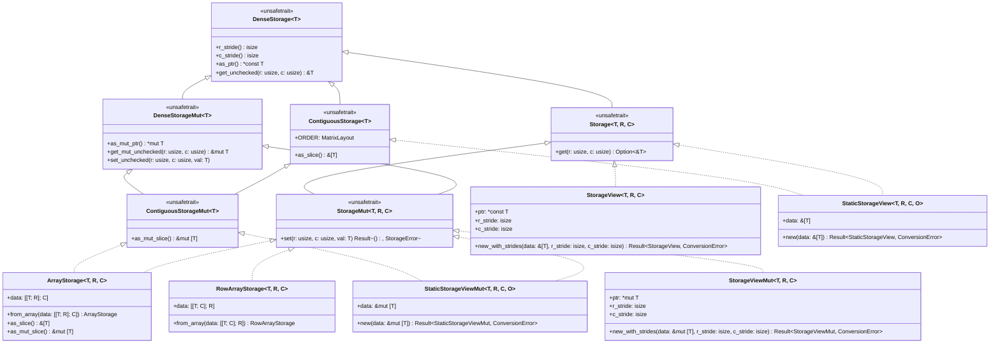

# Storage Backends & Data Layouts (Design Document)

---

### 1. Introduction

`src/math/storage.rs` provides a unified storage hierarchy covering dense
strided arrays, packed structured matrices and sparse representations.

The storage architecture supports **primitive integers** (`u8`–`u64`, `i8`
– `i64`), **fixed-point numbers** (`fixed-num`), **floating-point scalars**
(`f32`, `f64`) and **complex numbers** (`Complex<T>`). All storage contracts
provide **checked** (returning `Option<&T>` / `Option<T>`) and **unchecked**
(calling `unsafe` pointer arithmetic) accessors.

---

### 2. Requirements

#### 2.1 Functional Requirements

- **FR-1 — Decoupled Storage Subsystems Architecture**: Provide distinct,
  zero-cost storage subsystem contracts across dense strided arrays (
  `DenseStorage<T>` / `Storage<T, R, C>`), packed structured matrices (
  `PackedStorage<T>`), and compressed sparse backends (`SparseStorage<T>`).
  Subsystems share no common raw supertrait, preserving zero-cost abstraction
  without forcing artificial unification between dense contiguous indexing,
  packed triangular layout math, and CSR/CSC compressed buffers. Each
  subsystem exposes type-level or runtime dimension queries (`R: Dim, C: Dim`
  / `rows()`, `cols()`), safe element retrieval (`Option<&T>` / `Option<T>`),
  and safe modification (`Result<(), StorageError>`).
- **FR-2 — Dense Strided Storage & Views**:
    - Unsafe immutable and mutable base pointer traits with signed `isize`
      strides and checked/unchecked accessors.
    - Zero-copy strided views supporting runtime strides, compile-time layouts (
      `LayoutMarker`), transposition ($RS \leftrightarrow CS$), and vector
      reversal.
    - Unsafe contiguity markers (`ContiguousStorage`, `ContiguousStorageMut`)
      exposing direct continuous slice access (`&[T]`, `&mut [T]`) for
      C-ABI/BLAS interop.
    - Fixed-capacity stack backends (`ArrayStorage`, `RowArrayStorage`) backed
      by nested inline arrays (`[[T; R]; C]`, `[[T; C]; R]`).
- **FR-3 — Packed Structured Storage**:
    - Decouple physical slot lookup (`packed_index`) from algebraic entry
      evaluation (`value`).
    - Fixed stack leaves and zero-copy non-owning views for Symmetric (SP),
      Hermitian (HP), Triangular (TP with Unit/NonUnit diagonal), and Diagonal
      structures.
    - In-place mutation restricted to physical stored slots, rejecting implicit
      writes with `StorageError`.
- **FR-4 — Compressed Sparse Storage & In-Place Modification**:
    - Abstract sparse matrix traits for row-compressed (CSR) and
      column-compressed (CSC) formats with zero-copy row/column slicing.
    - Safe and unchecked in-place value modification of existing non-zeros
      without structural reallocation.
- **FR-5 — Incremental Sparse Assembly & Stack Compression**:
    - Fixed-capacity Coordinate (COO) assembly buffer supporting incremental
      `push`.
    - Stack-allocated $O(\text{nnz} + R)$ 3-pass sorting and duplicate
      accumulation compressing COO triplets into canonical sorted CSR/CSC
      storage without dynamic heap allocation.
- **FR-6 — 1-D Sparse Vectors**: Dedicated trait (`SparseVectorStorage`),
  fixed-capacity stack leaf (`ArraySparseVector`), and borrowed view (
  `ViewSparseVector`) over parallel index and value slices for Level-1 SpBLAS
  operations.
- **FR-7 — Layout Conversions & Numeric Support**:
    - Conversion to dense (`ToDenseStorage`) and between compressed layouts
      (`ToCsrStorage`, `ToCscStorage`) across dense, packed, and sparse
      backends. Recovering a structured layout from a dense operand is a
      projection, not a conversion: it selects a part and discards the rest,
      so the caller names the part. Projecting then converting back to dense
      reproduces the selected part and the layout tags that named it.
    - Generic scalar support (`T: Scalar`) across real primitives, fixed-point (
      `Quantized`), and complex numbers (`Complex<T>`), enforcing conjugate
      reflection and validating real diagonals on write.

#### 2.2 Non-Functional Requirements

- **NFR-1 — `#![no_std]` Compatibility**: Core storage executes with zero
  dynamic heap allocation.
- **NFR-2 — Compile-Time Verification**: Fixed capacities and array lengths are
  checked statically at compile time without unstable `generic_const_exprs`.
- **NFR-3 — Zero-Branch Codegen**: Unchecked pointer indexing compiles to
  branchless instructions with 0 panic paths at `opt-level=3`.

#### 2.3 Constraints

- **C-1 — Strided Index Arithmetic**: Pointer offset
  is $r \cdot RS + c \cdot CS$ using `isize` arithmetic.
- **C-2 — Const Bounds Invariant**: Packed array lengths require $L = N(N+1)/2$
  enforced via const assertions.
- **C-3 — Defensive & Unchecked Safety Contract**: Safe accessors validate
  bounds; `unsafe` accessors require caller-proven bounds. `DenseStorage` and
  `DenseStorageMut` are `unsafe trait`s to guarantee backing pointer validity.
- **C-4 — Dim Call Site**: Dimension types come from `num-types-design.md`'s
  `Dim` trait; this document does not define its own dimension representation.
- **C-5 — Error Invariant Boundary**: Fallible indexing and structural
  violations return `StorageError`; shape mismatches against runtime slices
  return `ConversionError::DimensionMismatch` per `error-design.md`.

---

### 3. Technical Overview

The storage architecture is organized into three distinct, decoupled storage
subsystems: **Strided & Dense Storage**, **Packed Structured Storage**, and
**Sparse & Sparse Vector Storage**.

_Figure 1: UML hierarchy for Dense Storage (`DenseStorage<T>`), Contiguous
Storage markers, stack backends, runtime-stride views (`StorageView<T, R, C>`),
and
`LayoutMarker`-tagged views (`StaticStorageView<T, R, C, O>`)._

#### 3.2 Packed Structured Storage Hierarchy

_Figure 2: UML hierarchy for packed structured storage traits, structured matrix
leaves, views, and structural enums._

#### 3.3 Sparse & Sparse Vector Storage Hierarchy

_Figure 3: UML hierarchy for compressed sparse matrix formats, coordinate
assembly buffers, 1-D sparse vectors, layout conversions, and storage error
enums._

#### 3.4 Decoupled Storage Subsystems & Safe Access Contracts

The storage architecture explicitly avoids a monolithic raw storage supertrait
unifying dense, packed, and sparse layouts. Unifying those layouts behind a
single raw accessor trait would introduce branch overhead, dynamic dispatch, or
awkward default methods that cannot be implemented efficiently across dense
strided pointers, triangular packed arrays, and CSR/CSC compressed structures
(sarah-quinones, 2026b; vbarrielle, 2015).

Instead, storage backends are partitioned into three dedicated subsystems:

1. **Dense Strided Storage (`DenseStorage<T>`, `DenseStorageMut<T>`)**:
   Provides low-level unsafe pointer and stride access (`as_ptr`, `r_stride`,
   `c_stride`, `get_unchecked`). For type-level shaped buffers,
   `Storage<T, R, C>`
   and `StorageMut<T, R, C>` extend dense storage to provide safe,
   bounds-checked element retrieval (`get(r, c) -> Option<&T>`) and mutation
   (`set(r, c, val) -> Result<(), StorageError>`).
2. **Packed Structured Storage (`PackedStorage<T>`, `PackedStorageMut<T>`)**:
   Provides packed slot mapping (`packed_index`), algebraic element evaluation
   (`value(i, j) -> Option<T>`), and in-place slot modification (
   `set(i, j, val)`),
   handling triangular, symmetric, Hermitian, and diagonal symmetries.
3. **Compressed Sparse Storage (`SparseStorage<T>`, `SparseStorageMut<T>`)**:
   Provides indexed access (`get(r, c) -> Option<T>`), non-zero values slice
   inspection (`values()`), and in-place existing non-zero mutation (
   `set(r, c, val)`).

Higher-level abstractions (such as `Matrix<T, R, C, S>`,
`PackedMatrix<T, N, S>`,
and `SparseMatrix<T, R, C, S>`) wrap their respective storage subsystem traits
directly without forcing cross-subsystem trait inheritance.

---

### 4. Architecture

#### 4.1 Strided Contract & Memory Addressing

The strided storage contract abstracts 2-D memory buffers through uniform stride
arithmetic (dimforge, 2026a; NumPy Developers, 2026). The address of an entry at
logical coordinate $(r, c)$ is computed via pointer arithmetic as:

$$\text{offset}(r, c) = r \cdot RS + c \cdot CS$$

where $RS$ is the row stride and $CS$ is the column stride in units of element
count (Eigen, 2026b; sarah-quinones, 2026b). Using signed `isize` strides
enables
zero-copy representation of reversed vectors, flipped axes, and transposed views
(NumPy Developers, 2026).

Because default `get_unchecked` performs raw pointer arithmetic (
`self.as_ptr().offset(...)`),
`DenseStorage<T>` and `DenseStorageMut<T>` are declared as
`pub unsafe trait` (vbarrielle, 2015; dimforge, 2026a): implementors guarantee
that `as_ptr()` points to an addressable buffer and that `r * RS + c * CS`
produces a valid in-bounds pointer for all $0 \le r < R$ and $0 \le c < C$.
`rows()` and `cols()` project `R::USIZE` and `C::USIZE`; they are not stored
fields. `T` remains a free scalar parameter — `Dim` parameterizes shape only
(`num-types-design.md` Phase 3).

Every strided backend enforces a dual-accessor contract (dimforge, 2026a;
sarah-quinones, 2026b):

- **Checked Accessors (`get`, `get_mut`, `set`)**: Perform runtime bounds checks
  against `rows()` and `cols()`, returning `Option<&T>`, `Option<&mut T>`, or
  `Result<(), StorageError>`. These provide safe interfaces at library
  boundaries.
- **Unchecked Accessors (`get_unchecked`, `get_mut_unchecked`, `set_unchecked`)
  **:
  Execute branchless pointer offset arithmetic directly without branch paths or
  panic handlers, enabling maximum throughput inside inner BLAS and solver
  loops.

Backends that guarantee a flat, contiguous `R · C` region starting at
`as_ptr()` implement the unsafe marker traits `ContiguousStorage<T>` and
`ContiguousStorageMut<T>`
(dimforge, 2026a), exposing direct slice access (`as_slice()`, `as_mut_slice()`)
required for standard C-ABI and BLAS subprogram interop (Netlib, 2026;
Arm Limited, 2022). Owning col-major leaves (`ArrayStorage`) and
`LayoutMarker`-tagged `StaticStorageView` / `StaticStorageViewMut` qualify when
the marker matches the physical layout. Runtime-stride `StorageView` /
`StorageViewMut` do **not**: arbitrary `isize` strides, including a reverse
view whose pointer is the last element, are not a contiguous
`from_raw_parts(ptr, R·C)` region. Implementing the marker on those types is
unsound.

Scalar conjugation is integrated via the `Conjugate` trait (
`src/math/num_traits.rs`),
which acts as the reflexive identity operation for real primitives (`f32`,
`f64`,
integers, fixed-point) and evaluates imaginary negation for `Complex<T>`.

#### 4.2 Strided Leaves, Views & Conjugate Layouts

Stack-allocated dense storage is provided by `ArrayStorage<T, R, C>` (
column-major,
$RS=1, CS=R$) and `RowArrayStorage<T, R, C>` (row-major, $RS=C, CS=1$) backed by
nested inline arrays `[[T; R]; C]` and `[[T; C]; R]`. Using
nested arrays avoids requiring `#![feature(generic_const_exprs)]` on stable Rust
while preserving zero-padding flat memory layouts (accessible via `as_slice()` /
`as_mut_slice()`) (rust-embedded, 2026a). Array lengths require `const R: usize,
const C: usize`; the leaves implement `DenseStorage<T>` with
`type R = Const<R>; type C = Const<C>;` via the
const-generic bridge in `num-types-design.md` FR-3 (C-4). `Const<N>: Dim`
follows num-types C-1; a missing `U*` name is `<Const<N> as Dim>::TypeNum`
(FR-4). Products may exceed both (C-2). Owning array leaves bind
`const R: usize, const C: usize` and do not define a parallel dimension
representation.

Non-owning slices come in two distinct families with specialized constructor
interfaces:

- **`StorageView<T, R, C>` / `StorageViewMut<T, R, C>`** (FR-2, runtime stride):
  wrap a borrowed slice with arbitrary `isize` strides without allocation
  (dimforge, 2026c; Eigen, 2026a). To enforce explicit stride specification and
  eliminate overlap with compile-time layout views, `StorageView` provides *
  *only**
  runtime-stride constructors (`new_with_strides`, `new_with_strides_unchecked`)
  taking explicit `r_stride` and `c_stride`. Transposition swaps strides
  ($RS \leftrightarrow CS$) and dimensions; reversal uses a negative row
  stride and a tail pointer (Netlib, 2026; NumPy Developers, 2026).
- **`StaticStorageView<T, R, C, O>` / `StaticStorageViewMut<T, R, C, O>`** (
  FR-2, compile-time layout):
  wrap a borrowed slice whose length equals $R \cdot C$, tagged by a
  `LayoutMarker` (`ColMajor` / `RowMajor`). `StaticStorageView` provides **only
  **
  const-stride constructors (`new`, `new_unchecked`), where strides are
  statically
  fixed by the marker (`ColMajor`: $RS=1, CS=R$; `RowMajor`: $RS=C, CS=1$). This
  pair
  does **not** accept runtime strides; runtime-strided `StorageView` does.

`ndarray`'s `ArrayBase` keeps dimension and stride in a shared `ArrayParts`
struct; `swap_axes` permutes both without copying (ndarray, 2026a, 2026b).
`nalgebra`'s plain `transpose()` returns an owning `OMatrix`, not a strided
view—zero-copy transposition stays on `StorageView` / stride-swapped views (
nalgebra, 2026c; faer, 2026b). Eigen's `Block` expression stores parent
reference plus `(startRow, startCol, blockRows, blockCols)` for zero-copy
submatrix windows (Eigen, 2026d). **Proposal (not in evidence)**: a
`BlockView` over `DenseStorage` mirroring Eigen's pattern.

Conjugate transpose (adjoint) is evaluated in subprogram kernels via
`Trans::ConjTrans` by reading transposed coordinates and applying scalar
`.conj()` without a separate view type that falsifies reference returns.

| Type                                | Dimensions | Row Stride ($RS$) | Col Stride ($CS$) | Backing Memory Layout | Constructor Interface                      | Entry Access Formula           | Citation Reference                                     |
|:------------------------------------|:----------:|:-----------------:|:-----------------:|:---------------------:|:-------------------------------------------|:-------------------------------|:-------------------------------------------------------|
| `ArrayStorage<T, R, C>`             |  $(R, C)$  |        $1$        |        $R$        |     `[[T; R]; C]`     | `from_array([[T; R]; C])`                  | `data[c][r]`                   | (dimforge, 2026b; rust-embedded, 2026a)                |
| `RowArrayStorage<T, R, C>`          |  $(R, C)$  |        $C$        |        $1$        |     `[[T; C]; R]`     | `from_array([[T; C]; R])`                  | `data[r][c]`                   | (dimforge, 2026b; Arm Limited, 2022)                   |
| `StorageView<'a, T, R, C>`          |  $(R, C)$  |       $RS$        |       $CS$        |       `&'a [T]`       | `new_with_strides(&[T], RS, CS)` (runtime) | `*ptr.offset(r * RS + c * CS)` | (dimforge, 2026c; Eigen, 2026a; sarah-quinones, 2026b) |
| `StaticStorageView<'a, T, R, C, O>` |  $(R, C)$  |   marker-fixed    |   marker-fixed    |       `&'a [T]`       | `new(&[T])` (const marker-fixed)           | `O::offset(R, C, r, c)`        | (`LayoutMarker`; not arbitrary stride)                 |

#### 4.3 Packed Storage Architecture

Packed storage structures store structured matrices (symmetric, Hermitian,
triangular, diagonal) in compact 1-D buffers of length $L = N(N+1)/2$ or $L = N$
(Lawson et al., 1979; Dongarra et al., 1988; Anderson et al., 1999; Netlib,
2026).
Because packed coordinate maps are quadratic triangular number series rather
than
linear $(r \cdot RS + c \cdot CS)$ combinations, packed storage decouples
physical
memory lookup from algebraic entry evaluation:

- **Physical Slot Lookup (`packed_index(i, j)`)**: Returns `Some(index)` if the
  coordinate $(i, j)$ corresponds to a physically stored element within the
  chosen triangular half (`UpLo::Upper` or `UpLo::Lower`), or `None` if the
  coordinate lies in the implicit half or out of bounds (Anderson et al., 1999).
- **Unchecked Slot Lookup (`packed_index_unchecked(i, j)`)**: Directly computes
  the quadratic index mapping formula without bounds checking or fallback
  branches.
  The caller guarantees $(i, j)$ is within the physical half (Netlib, 2026).
- **Algebraic Entry Evaluation (`value(i, j)`)**: Evaluates the mathematical
  entry $A_{i,j}$ for any coordinate $0 \le i, j < N$, automatically applying
  structural invariants (reflection, conjugation, unit diagonals, or zeros)
  (Dongarra et al., 1988; Anderson et al., 1999).
- **Physical Mutation (`set(i, j, val)`)**: Restricted strictly to stored
  physical slots, preventing invalid or asymmetric writes to implicit entries.

#### 4.4 Packed Leaves, Symmetries & Mathematical Invariants

Concrete packed structures manage fixed-size stack arrays without heap overhead
(rust-embedded, 2026a):

1. **Diagonal Storage (`DiagonalStorage<T, N>`)**: Stores $N$ diagonal elements.
   Off-diagonal coordinates evaluate algebraically to `T::ZERO`.
2. **Symmetric Packed Storage (`SymmetricPackedStorage<T, N, L>`)**: Stores
   $N(N+1)/2$ elements in packed upper or lower format (Anderson et al., 1999).
   Implicit coordinates reflect across the main
   diagonal: $\text{value}(i, j) = \text{value}(j, i)$.
3. **Hermitian Packed Storage (`HermitianPackedStorage<T, N, L>`)**: Stores
   $N(N+1)/2$ complex elements (Anderson et al., 1999; Netlib, 2026). Implicit
   coordinates evaluate to the complex conjugate of the transpose:
   $\text{value}(i, j) = \text{value}(j, i).\text{conj}()$. Diagonal elements
   enforce $\text{Im}(A_{i,i}) = 0$. Writing a non-zero imaginary part to a
   diagonal
   entry via `set(i, i, val)` returns
   `Err(StorageError::InvalidHermitianDiagonal)`.
4. **Triangular Packed Storage (`TriangularPackedStorage<T, N, L>`)**: Stores
   $N(N+1)/2$ elements with explicit unit diagonal configuration (`Diag::Unit`
   or `Diag::NonUnit`) (Netlib, 2026). Off-triangle elements evaluate to
   `T::ZERO`.
   Unit diagonals evaluate to `T::ONE` and reject mutation attempts with
   `Err(StorageError::ImmutableUnitDiagonal)`.
5. **Specialized Packed Views**: `SymmetricPackedView`, `HermitianPackedView`,
   `TriangularPackedView`, and `DiagonalView` (and their `...Mut` counterparts)
   borrow packed 1-D slices with explicit structural tagging without data copies
   (Anderson et al., 1999).

| Type                |  Physical Length   | Physical `packed_index(i, j)` (Upper / Lower)                                                           | Algebraic `value(i, j)` Invariant                                                                  | Standard Specification                         |
|:--------------------|:------------------:|:--------------------------------------------------------------------------------------------------------|:---------------------------------------------------------------------------------------------------|:-----------------------------------------------|
| **Diagonal**        |        $N$         | `i == j ? Some(i) : None`                                                                               | `i == j ? data[i] : T::ZERO`                                                                       | (Lawson et al., 1979)                          |
| **Symmetric (SP)**  | $\frac{N(N+1)}{2}$ | Upper: $i \le j \implies i + \frac{j(j+1)}{2}$ Lower: $i \ge j \implies i - j + \frac{j(2N-j+1)}{2}$ | Transpose reflection: $i > j \implies \text{value}(j, i)$                                       | (Dongarra et al., 1988; Anderson et al., 1999) |
| **Hermitian (HP)**  | $\frac{N(N+1)}{2}$ | Upper: $i \le j \implies i + \frac{j(j+1)}{2}$ Lower: $i \ge j \implies i - j + \frac{j(2N-j+1)}{2}$ | Conjugate reflection: $i > j \implies \text{value}(j, i).\text{conj}()$; $\text{Im}(A_{i,i})=0$ | (Anderson et al., 1999; Netlib, 2026)          |
| **Triangular (TP)** | $\frac{N(N+1)}{2}$ | Upper: $i \le j \implies i + \frac{j(j+1)}{2}$ Lower: $i \ge j \implies i - j + \frac{j(2N-j+1)}{2}$ | Unit diag: $i=j \implies \text{T::ONE}$; Off-triangle: $\text{T::ZERO}$                            | (Lawson et al., 1979; Netlib, 2026)            |

#### 4.5 Sparse Compressed Formats, Mutation & In-Place Assembly

Sparse matrices are organized across three canonical representations:

- **Compressed Sparse Row (`CsrStorage<T>`, `ArrayCsrStorage`)**: Stores
  non-zero
  values ordered by rows, indexed through row offsets of length $R + 1$ and
  column indices of length $\text{nnz}$ (SciPy Developers, 2026; Eigen, 2026c;
  sparsemat, 2026a). Exposes zero-cost row slicing (`row_slice`,
  `row_slice_unchecked`)
  for high-performance $A x$ matrix-vector multiplication kernels.
- **Compressed Sparse Column (`CscStorage<T>`, `ArrayCscStorage`)**: Dual
  column-major
  compressed format indexed through column offsets of length $C + 1$ and row
  indices of length $\text{nnz}$ (SciPy Developers, 2026; sparsemat, 2026a).
- **Coordinate List (`ArrayCooStorage`)**: Dynamic triplet buffer
  `(row, col, value)`
  used for incremental assembly via `push(r, c, val)` (sparsemat, 2026a).

##### In-Place Mutation Contract (`SparseStorageMut<T>`)

`SparseStorageMut<T>` provides safe and unchecked in-place modification of
existing
non-zero values without structural reallocation (sparsemat, 2026a; vbarrielle,
2015). `ArrayCsrStorage` and `ArrayCscStorage` both implement it.

- `values_mut() -> &mut [T]`: Exposes direct mutable access to the backing
  non-zero value buffer.
- `get_mut(r, c) -> Option<&mut T>`: Returns a mutable reference to the non-zero
  entry at $(r, c)$ if present.
- `set(r, c, val) -> Result<(), StorageError>`: Updates existing non-zero
  at $(r, c)$ or returns `Err(StorageError::InvalidStructuralInvariant)`
  if $(r, c)$ is not allocated in the sparse pattern.
- `unsafe set_unchecked(r, c, val)`: Unchecked in-place update for hot solver
  loops.

##### In-Place Stack COO-to-CSR Compression

`ArrayCsrStorage::from_coo` transforms unordered COO triplets into canonical
sorted CSR format entirely on the stack in worst-case $O(R + \sum_{i=0}^{R-1} k_i^2) \le O(R + \text{nnz}^2)$ time ($O(\text{nnz} + R)$ under bounded row density) without heap
allocation (SciPy Developers, 2026; sparsemat, 2026a):

1. **Pass 1 — Histogram & Prefix Sum**: Iterates over COO
   triplets $0..\text{nnz}$,
   validates bounds $(r < R, c < C)$, counts entries per row into
   `row_counts[r]`,
   and computes the cumulative prefix sum into
   `row_offsets[i+1] = row_offsets[i] + row_counts[i]`.
2. **Pass 2 — Bucket Distribution**: Distributes COO values and column indices
   into
   their corresponding row intervals in temporary working arrays.
3. **Pass 3 — Row Sorting & Duplicate Accumulation**: Within each row interval
   `row_offsets[i]..row_offsets[i+1]`, performs an in-place insertion sort on
   column
   indices. If duplicate coordinates $(i, c)$ appear, sums their
   values ($v_1 + v_2$)
   and shifts subsequent entries down. Updates `row_offsets` to reflect
   compacted
   row lengths and sets `self.nnz = compressed_nnz`. A summed slot whose
   value is `T::ZERO` remains allocated; this pass does not prune explicit
   zeros. `ArrayCscStorage::from_coo` uses the same three passes on columns
   with worst-case $O(C + \sum_{j=0}^{C-1} k_j^2) \le O(C + \text{nnz}^2)$ time.
   CSR and CSC produced from one COO have equal `nnz` and the same coordinate
   set (sparsemat, 2026a; SciPy Developers, 2026).

##### Layout Conversions (FR-7)

- `ToDenseStorage<Dense>`: Converts packed or sparse representations to dense
  `ArrayStorage` (sparsemat, 2026a).
- **Dense-to-structured projections**: inherent constructors on the four
  targets that admit one, not a trait. Recovering a structured layout from a
  dense operand selects a part and discards the rest, and which part is a
  free parameter the operand does not carry: a dense `ArrayStorage<T, N, N>`
  has no `UpLo` and no `Diag`. The caller names the part, matching the
  reference convention in which `UPLO` and `DIAG` are enumerated parameters of
  every packed routine rather than properties recovered from the data
  (Netlib, 2026; Anderson et al., 1999).

  | Target                    | Constructor                                     | Part selected            |
    |:--------------------------|:------------------------------------------------|:-------------------------|
  | `DiagonalStorage`         | `from_dense_diagonal(dense)`                    | the diagonal             |
  | `SymmetricPackedStorage`  | `from_dense_triangle(dense, uplo)`              | one triangle, mirrored   |
  | `HermitianPackedStorage`  | `from_dense_triangle(dense, uplo)`              | one triangle, conjugate-mirrored; a non-real diagonal returns `InvalidHermitianDiagonal` |
  | `TriangularPackedStorage` | `from_dense_triangle(dense, uplo, diag)`        | one triangle             |

  The reverse direction is not a trait because it is not uniform and has no
  generic consumer. `ToDenseStorage` is total: every layout produces a dense
  array from itself alone, which is why seven leaves implement it. The
  projections are partial, lossy, and take a different parameter set per
  target, so a shared signature would either fix the tags internally (which
  cannot preserve a Lower operand, because nothing at the call boundary says
  the operand was Lower) or force meaningless parameters on
  `DiagonalStorage`. CSR, CSC and COO admit no projection at all: dense to
  sparse goes through `ArrayCooStorage::push` and then `to_csr` / `to_csc`
  (§4.3).

  The names carry the operation. `from_dense` would imply a total, lossless
  conversion, and all four discard data.
- `ToCsrStorage` / `ToCscStorage`: Inter-converts between CSR, CSC, and COO
  layouts (SciPy Developers, 2026; sparsemat, 2026a).

#### 4.6 1-D Sparse Vectors & Operational Types

For Level-1 SpBLAS operations (`SpDot`, `SpAxpy`), 2-D CSR/CSC indexing
introduces
unnecessary offset indirection (Lawson et al., 1979; sparsemat, 2026b). The
storage
system provides dedicated 1-D sparse vector representations:

- **`SparseVectorStorage<T>`**: Trait abstracting indexed 1-D non-zero arrays
  via `indices()` and `values()`.
- **`ArraySparseVector<T, N, MAX_NNZ>`**: Stack-allocated sparse vector holding
  up to `MAX_NNZ` non-zero coordinates within a logical length $N$ (
  rust-embedded, 2026a).
- **`ViewSparseVector<'a, T, N>`**: Zero-copy borrowed view over parallel index
  and value slices (sarah-quinones, 2026b).

Operational settings and matrix attributes are parameterized through standard
C-compatible enumerations (Netlib, 2026):

- `UpLo`: `Upper` / `Lower` triangular storage selection.
- `Diag`: `NonUnit` / `Unit` diagonal specification.
- `Side`: `Left` / `Right` matrix multiplication position.
- `Trans`: `NoTrans` / `Trans` / `ConjTrans` transpose and adjoint operation
  selector.

##### Error Model & Boundary Separation

- **`ConversionError`** (defined in `src/math/mod.rs` per `error-design.md`):
  Governs fallible slice wrapping and dimension conversions (
  `DimensionMismatch`,
  `NonMonicPolynomial`).
- **`StorageError`**: Governs indexing, mutation, and structural invariant
  violations (`error-design.md` FR-3, C-5). Shape conditions already pinned by
  `Dim` parameters are compile errors. Erased-length wrapping
  (`StorageView::new_with_strides` and `StaticStorageView::new`) and DSP
  convolution against a runtime slice stay on
  `ConversionError::DimensionMismatch`. `StorageError` does not duplicate
  that arm.
    - `OutOfBounds`: Index exceeds logical row/column bounds.
    - `CapacityExceeded`: Maximum non-zero capacity `MAX_NNZ` exceeded in
      COO/CSR push.
    - `ImmutableUnitDiagonal`: Attempted write to a unit diagonal slot in
      `TriangularPackedStorage`.
    - `InvalidHermitianDiagonal`: Attempted write of non-zero imaginary
      component to a Hermitian diagonal slot.
    - `InvalidStructuralInvariant`: Attempted write to an unallocated non-zero
      slot in `SparseStorageMut` (CSR **and** CSC).
    - `OutOfBounds` is classified before `ImmutableUnitDiagonal` /
      `InvalidHermitianDiagonal` when \(i \ge N\) or \(j \ge N\).

- Array initialization: `try_array_from_iterator` for safe, `#![no_std]`
  uninitialized buffer initialization without requiring `T: Default` (
  rust-embedded, 2026a).

#### 4.7 Device-Resident Storage Boundary (Extension, Not MVP)

Host leaves (`ArrayStorage`, packed arrays, stack CSR) remain the only
implemented backends. Prior art separates device memory from host slices at
the type level:

| Ecosystem            | Host vs device split                                                                                                          | Layout exposure                            | Citation                                          |
|:---------------------|:------------------------------------------------------------------------------------------------------------------------------|:-------------------------------------------|:--------------------------------------------------|
| **Rust-CUDA `cust`** | `DeviceBuffer<T>` / `DeviceSlice<T>` distinct from host `Box<[T]>`                                                            | Typed element `T` on device                | (Rust-CUDA, 2026a, 2026b)                         |
| **candle-core**      | `Storage` enum (`Cpu` / `Cuda` / `Metal`); `BackendStorage` + `BackendDevice` traits with mutually recursive associated types | Layout via separate `Layout` type          | (candle, 2026a, 2026b)                            |
| **wgpu**             | `Buffer` holds GPU-accessible untyped bytes; `MAP_READ` / `MAP_WRITE` flag host-mappable buffers vs device-local usage        | Interpretation deferred to bind/read calls | (wgpu, 2026a, 2026b)                              |
| **PJRT / XLA**       | Opaque `PJRT_Buffer` C handle; `PjRtBuffer` abstract base with `on_device_shape()`                                            | Internal layout opaque; shape via vtable   | (OpenXLA, 2026a, 2026b, 2026c; PyTorch/XLA, 2026) |

PJRT targets a uniform device API across CPU, TPU, and CUDA selectable via
`PJRT_DEVICE` (PyTorch/XLA, 2026). No Rust PJRT crate appears in the
research corpus; integration would be FFI-first.

**Adoption decision (this design)**: `control-rs` does **not** depend on
`cust`, `wgpu`, `candle-core`, or PJRT for the storage MVP. Mandatory
transitive deps conflict with crate-local minimize-dependencies policy (
`CLAUDE.md`): `cust` pulls `cust_core`, `cust_raw`, and `bitflags`; `wgpu`
default features enable `wgpu-core` plus DX12/Metal/Vulkan/GLES/WebGPU
backends; `candle-core` pulls `gemm`, `half`, `rayon`, and optional
`cudarc`/Metal stacks. Device-resident layouts stay an documented extension
boundary for future `subprograms-design.md` accelerator backends.

**Proposal (not in evidence)**: an optional `DeviceDenseStorage` unsafe trait
with opaque handle + shape metadata, host `ContiguousStorage` leaves
unchanged.

#### 4.8 Band Storage (LAPACK Scheme, Out of MVP Scope)

LAPACK band storage maps an $m \times n$ matrix with $k_l$ subdiagonals and
$k_u$ superdiagonals into a $(k_l + k_u + 1) \times n$ compact array when
$k_l, k_u \ll \min(m,n)$ (Anderson et al., 1999). GPU LAPACK libraries
factor band batches with LU partial pivoting on band-structured systems (
Abdelfattah et al., 2023). RISC-V vector work optimizes BLAS on band matrices (
Pirova et al., 2025).

Phases 1–4 implement dense, packed (symmetric/Hermitian/triangular/diagonal),
and CSR/CSC/COO formats only. Band indexing uses a non-linear slot map
distinct from FR-2 stride arithmetic and from packed triangular indexing—
forcing it onto `DenseStorage` would forfeit the same optimization separation
cited in §5 for packed/sparse splits.

**Proposal (not in evidence)**: a dedicated `BandStorage<T, N, KL, KU>` leaf
and matching `PackedStorage`-style slot lookup, deferred until a numerical-model
consumer requires `?GBTRF` / `?GBMV` band kernels.

#### 4.9 Mixed-Precision & Accelerator Scalar Layouts

Scalar type `T` on every leaf remains a free type parameter (`f32`, `f64`,
integers, `fixed-num`, `Complex<T>`). Mixed-precision algorithms exploit
hardware that is faster at lower precision while higher precision remains
available in software (Higham and Mary, 2022). Tensor-core LU can store the
working matrix in half precision but state-of-the-art mixed half/single LU
still requires single-precision resident storage for data-movement reasons (
Lopez and Mary, 2023). Dongarra et al. (2025) tie mixed-precision algorithms
and floating-point emulation to Tensor Core evolution on GPUs. MAGMA exposes
roughly 750 routines across four precisions on diverse GPU vendors (
Abdelfattah et al., 2024). Embedded TinyML accelerators such as RedMulE target
mixed-precision GEMM on RISC-V SoCs (Tortorella et al., 2023). RISC-V vector
GEMM micro-kernel generators (Igual et al., 2023) and OpenBLAS productization
issues on RISC-V (Zaytseva et al., 2023) inform host-side layout choices for
future bare-metal backends without changing the MVP trait surface. GPU adaptive
batching for small matrix multiplies (Zhang et al., 2022) is a subprogram
scheduling concern (`subprograms-design.md`), not a storage-layout invariant.

Storage does not fix precision at compile time beyond monomorphizing `T`.
**Proposal (not in evidence)**: typed aliases `ArrayStorage<f16, R, C>` or
dual-buffer mixed-precision leaves paired with `subprograms-design.md`
accelerator backends once `num-traits-design.md` admits half-width scalars.

---

### 5. Alternatives

| Alternative                                                                  | Rejected Because                                                                                                                                                                                                                                                                                                 | Reference                                                                         |
|:-----------------------------------------------------------------------------|:-----------------------------------------------------------------------------------------------------------------------------------------------------------------------------------------------------------------------------------------------------------------------------------------------------------------|:----------------------------------------------------------------------------------|
| **`usize` only strides**                                                     | Cannot represent negative increments ($INCX < 0$) or zero-copy reversed vector views required by BLAS standards.                                                                                                                                                                                                 | §4.1, §4.2 (Netlib, 2026; NumPy Developers, 2026)                                 |
| **Checked-only queries**                                                     | Introduces 20–40 branches in tight BLAS loops, destroying bare-metal DSP throughput.                                                                                                                                                                                                                             | §4.1, §7 (Arm Limited, 2022; sarah-quinones, 2026a)                               |
| **Unchecked-only queries**                                                   | Violates C-3 and creates undefined behavior risks for external inputs and malformed slices.                                                                                                                                                                                                                      | §4.1, §4.5 (vbarrielle, 2015)                                                     |
| **Dynamic sparse vector via 2D CSR**                                         | Inflates metadata and indexing overhead for 1-D vector operations (`SpDot`, `SpAxpy`).                                                                                                                                                                                                                           | §4.6 (Lawson et al., 1979; sparsemat, 2026b)                                      |
| **One `Storage<T>` for packed & sparse**                                     | Offset is $r\cdot RS+c\cdot CS$. Packed and CSR index maps are non-linear; forcing them onto `Storage` destroys compiler optimizations.                                                                                                                                                                          | §4.1, §4.3, §4.5 (Anderson et al., 1999; sparsemat, 2026a)                        |
| **Generic const expression (`Self::ROWS * Self::COLS`) for capacity**        | Direct const-generic arithmetic on traits is unstable (`generic parameters may not be used in const operations`). Nested `[[T; R]; C]` avoids that.                                                                                                                                                              | §4.2, C-4, NFR-2 (rust-embedded, 2026a)                                           |
| **Capacity from `DimMul` associated type multiplication (`R as DimMul<C>`)** | Projecting type-level multiplication into an array length is still a parameter-dependent const expression and needs `generic_const_exprs`.                                                                                                                                                                       | §4.2, C-4, NFR-2 (rust-embedded, 2026a)                                           |
| **Flattened `as_array() -> &[T; R * C]`**                                    | `R * C` in array-length position requires unstable `generic_const_exprs`. `as_slice()` on nested arrays is the stable contiguous view.                                                                                                                                                                           | §4.2, NFR-2 (rust-embedded, 2026a)                                                |
| **`nalgebra`-style owning `transpose()`**                                    | Returns `OMatrix` by value; violates FR-2 zero-copy transpose on views. Stride-swapped `StorageView` matches `faer`/`ndarray`/`NumPy` prior art.                                                                                                                                                                 | §4.2, FR-2 (nalgebra, 2026c; faer, 2026b; ndarray, 2026b; NumPy Developers, 2026) |
| **Strideless default constructor on `StorageView`**                          | Redundant with `StaticStorageView::new`; obscures whether layout assumptions are compile-time static invariants or runtime strided configurations.                                                                                                                                                               | §4.2 (Eigen, 2026a; NumPy Developers, 2026)                                       |
| **Third-party GPU storage crates (`cust`, `wgpu`, `candle-core`)**           | Large mandatory transitive graphs (CUDA driver stack, multi-backend `wgpu-core`, ML framework deps) violate minimize-dependencies; host `#![no_std]` MVP needs no GPU buffer type.                                                                                                                               | §4.7 (`CLAUDE.md`; Rust-CUDA, 2026; wgpu, 2026; candle, 2026)                     |
| **PJRT / XLA buffer adoption**                                               | Uniform CPU/TPU/CUDA API exists (OpenXLA, 2026; PyTorch/XLA, 2026) but no Rust crate in evidence; FFI surface and opaque layouts defer to `subprograms-design.md`.                                                                                                                                               | §4.7 (OpenXLA, 2026a, 2026b, 2026c)                                               |
| **`candle`-style `Storage` enum for host+device**                            | Enum dispatch couples CPU leaves to CUDA/Metal variants at every call site; trait hierarchy keeps host subprograms monomorphic.                                                                                                                                                                                  | §4.7 (candle, 2026a, 2026b)                                                       |
| **A `FromDenseStorage` trait over the reverse direction**                    | Only four leaves admit a dense projection (Diagonal, SP, HP, TP); CSR, CSC and COO do not, and no code in `src/` is bounded on such a trait. A shared signature must either fix `UpLo`/`Diag` internally, which cannot preserve a Lower operand, or put parameters on `DiagonalStorage` that mean nothing to it. | §4.5 (Netlib, 2026; Anderson et al., 1999)                                        |
| **Splitting the reverse direction across two traits**                        | Moving the three packed leaves to a second trait leaves the first with one implementor, `DiagonalStorage`. A one-implementor, one-method trait states no shared contract and no generic consumer exists to use it.                                                                                               | §4.5 (control-rs, 2026)                                                           |
| **An associated `Part` type carrying each target's tags**                    | Reaches one uniform trait with no meaningless parameters, and would extend to a band leaf's `KL`/`KU` (§4.8). Rejected as speculative: nothing in `src/` consumes the reverse direction generically, so the associated type buys vocabulary rather than reuse. Reconsider if a generic consumer appears.         | §4.5, §4.8 (control-rs, 2026)                                                     |
| **Fixing `UpLo::Upper` inside the projection**                               | Returns `Ok` on a lossy conversion: a Lower triangular operand loses its subdiagonal and is retagged Upper, so the §6.1 L3 round-trip cannot be written and a suite exercising only Upper passes vacuously.                                                                                                      | §4.5, §6.1 (Anderson et al., 1999)                                                |
| **Canonicalize to Upper and error on a lossy source**                        | Keeps one signature and converts silent truncation into `StorageError`. Rejected because a Lower operand is exactly representable in the target, so refusing it is a gap in FR-7, not a safety property.                                                                                                         | §4.5, FR-7 (Anderson et al., 1999)                                                |
| **`UpLo` / `Diag` as type parameters on the packed leaves**                  | Makes the triangle a compile-time property and the round-trip total by construction. Rejected for this revision: `UpLo` is a runtime field across the packed accessors (§4.3), so lifting it multiplies every packed leaf and view by four instantiations for a property the BLAS convention keeps at runtime.   | §4.3, §4.5 (Netlib, 2026)                                                         |
| **Band matrix on `DenseStorage` or packed traits**                           | Band slot map is neither $r \cdot RS + c \cdot CS$ nor triangular packed indexing; LAPACK uses a dedicated $(k_l+k_u+1) \times n$ scheme.                                                                                                                                                                        | §4.8 (Anderson et al., 1999; Abdelfattah et al., 2023)                            |
| **Fixed `f64`-only storage leaves**                                          | Mixed-precision algorithms and embedded `fixed-num` / integer paths require `T` as a free parameter; half/single LU literature shows precision is a kernel policy, not a layout field.                                                                                                                           | §4.9 (Higham and Mary, 2022; Lopez and Mary, 2023)                                |

---

### 6. Verification & Validation Plan

#### 6.1 Verification Plan (Specification Conformance)

- **Level 1 (Static & Memory)**: Assert `size_of` formulas in
  `size_of::<T>()` and `size_of::<usize>()`. Dense arrays:
  $R \cdot C \cdot \mathrm{size\_of}(T)$. Packed:
  $\frac{N(N+1)}{2}\mathrm{size\_of}(T) + \mathrm{align}$. For
  `SymmetricPackedStorage<f32, 4, 10>` the concrete layout is
  `[f32; 10]` plus `UpLo`, so `align_of::<f32>() == 4` yields **44** on both
  32-bit and 64-bit; do not gate that leaf on a 48-byte 8-align column.
  CSR (`ArrayCsrStorage`, `MAX_NNZ = 3N`, `R1 = N+1`):
  $MAX\_NNZ \cdot (\mathrm{size\_of}(T) + \mathrm{size\_of}(\mathrm{usize})) + (N+2)\mathrm{size\_of}(\mathrm{usize})$.
  For $N=4$, $T=\mathrm{f32}$ that is $120$ bytes on 32-bit and $192$ bytes
  on 64-bit. Do not gate CSR on a single-width absolute table. Assert stride
  invariants ($RS=1, CS=R$ for col-major). Owning packed constructors
  const-assert $L = N(N+1)/2$ (C-2); a rustdoc `compile_fail` with a wrong
  `PACKED_LEN` is the oracle.
- **Level 2 (Unit Layout & Coordinates)**: Required equalities, for dense,
  packed, and both view families (`StorageView<T, R, C>` runtime strides and
  `StaticStorageView<T, R, C, O>` at `ColMajor` and `RowMajor`):
  `get(r,c).unwrap() == *get_unchecked(r,c)` on the interior; `get` is `None`
  outside. Hermitian: $(A^H)^H = A$ entrywise, $A_{i,j} == \overline{A_{j,i}}$,
  real diagonals $\text{Im}(A_{i,i}) = 0$, and negative-stride reverse views (
  Anderson et al., 1999; Netlib, 2026). Reverse-view `get` matches
  `get_unchecked`. `StorageView` after `reverse_view` does **not** implement
  `ContiguousStorage`; a helper bounded on that marker must not accept the
  reverse view. `StorageView::new_with_strides` on a slice whose length cannot
  cover the strided `R × C` window returns
  `ConversionError::DimensionMismatch` (`error-design.md` C-5). Unit-diag and
  Hermitian `set(i, i, …)` with \(i \ge N\) return `OutOfBounds`, not
  `ImmutableUnitDiagonal` / `InvalidHermitianDiagonal`.
- **Level 3 (Conversions & Infallibility)**: Round-trip conversions between
  Dense $\leftrightarrow$ Packed $\leftrightarrow$ Sparse for real and
  complex scalars (sparsemat, 2026a). Complex
  `HermitianPackedStorage` $\leftrightarrow$ `ArrayStorage<Complex<T>, N, N>`
  round-trips. `from_dense_triangle` with a non-real diagonal returns
  `InvalidHermitianDiagonal`. **Tag round-trip**: for each packed family and
  each `UpLo`, `to_dense` then `from_dense_triangle` with the *same* `uplo`
  reproduces the operand entrywise and preserves the tag. The Lower
  triangular case is the load-bearing one: it pins both `UpLo::Lower` and the
  subdiagonal, and a constructor that fixes `UpLo::Upper` internally
  returns `Ok` with the subdiagonal dropped, so a test that exercises only
  `UpLo::Upper` passes vacuously and does not discharge this item.
  `Diag::Unit` round-trips to `Diag::Unit`: `to_dense` materializes the
  implicit diagonal, and `from_dense_triangle` called with `Diag::Unit` must
  restore the implicit form rather than storing explicit ones and retagging
  `NonUnit`, which would defeat `ImmutableUnitDiagonal` (§4.3).
  `DiagonalStorage::from_dense_diagonal` then `to_dense` reproduces the
  operand's diagonal with zeros elsewhere. Passing a `uplo` that disagrees
  with the operand is a caller error, not a checked arm; the oracle is
  same-tag round-trip. COO
  `push(r, c, T::ZERO)` then `from_coo` keeps that slot in **both** CSR and
  CSC with equal `nnz`. `SparseStorageMut::set` on an unallocated in-bounds
  coordinate returns `InvalidStructuralInvariant` for CSR **and** CSC.
- **Level 4 (Codegen)**: Zero-branch / zero-panic claims are measured in
  §7; they are not a CI gate.
- **Level 5 (ETS `size_of`)**: Assert the 32-bit column of §7 via
  `size_of` on RV32 and/or Thumb ETS. Stack-watermark telemetry stays an
  Open Question unless `control-rs-ets` already exposes it.

#### 6.2 Validation Plan (Control Engineering Applications)

Deferred until numerical-model designs (`matrix`, `state-space`, …) are
Approved and implemented. The cases below are requirements for that future
suite; present kernel smoke tests must not use Val-\* names as success
criteria.

- **Val-1: Multi-Layout State Estimation**: Kalman filter covariance matrices
  stored in packed symmetric format ($P$) alongside dense state vectors ($x$).
- **Val-2: Fixed-Capacity Sparse MPC**: Condensed horizon state-space trajectory
  optimizer with sparse dynamics constraints on stack (sparsemat, 2026a).
- **Val-3: Zero-Copy Windowing**: Submatrix extraction of subsystem state
  transitions $A_{11}$ from large coupled block model $A$ with zero copies (
  Eigen, 2026a).
- **Val-4: Complex Frequency Response**: Multi-channel MIMO frequency response
  matrix evaluations $G(j\omega)$ stored across discrete frequency grids with
  zero allocation.

---

### 7. Performance & Resource Considerations

Memory footprints across $N \times N$ matrix representations ($T = \text{f32}$,
4 bytes; $T = \text{Complex32}$, 8 bytes). Dense and packed sizes are
independent of `usize` width except alignment. CSR and sparse-vector sizes
depend on `size_of::<usize>()`; both 32-bit and 64-bit columns are required.
Host tests using `size_of::<usize>()` cannot validate a 64-bit-only table on
Cortex-M7 / RV32.

CSR formula (`ArrayCsrStorage`, `MAX_NNZ = 3N`, `R1 = N+1`):
$MAX\_NNZ \cdot (\mathrm{size\_of}(T) + \mathrm{size\_of}(\mathrm{usize})) + (N+2)\mathrm{size\_of}(\mathrm{usize})$.
Sparse-vector formula (`MAX_NNZ = N/2`):
$MAX\_NNZ \cdot (\mathrm{size\_of}(T) + \mathrm{size\_of}(\mathrm{usize})) + \mathrm{size\_of}(\mathrm{usize})$.

| Layout                                        | $N=4$ f32 32-bit | $N=4$ f32 64-bit | $N=16$ f32 32-bit | $N=16$ f32 64-bit |                                                    Memory Scaling                                                     |
|:----------------------------------------------|:----------------:|:----------------:|:-----------------:|:-----------------:|:---------------------------------------------------------------------------------------------------------------------:|
| **Dense (`ArrayStorage`)**                    |        64        |        64        |       1,024       |       1,024       |                                           $N^2 \cdot \mathrm{size\_of}(T)$                                            |
| **Packed Symmetric / Hermitian / Triangular** |        44        |        44        |        548        |        548        | $\frac{N(N+1)}{2} \cdot \mathrm{size\_of}(T) + \mathrm{align}$; `f32` leaves align 4, so \(N=4\) is 44 on both widths |
| **Diagonal (`DiagonalStorage`)**              |        16        |        16        |        64         |        64         |                                            $N \cdot \mathrm{size\_of}(T)$                                             |
| **CSR Sparse ($MAX\_NNZ = 3N$)**              |       120        |       192        |        456        |        720        |                                                     formula above                                                     |
| **Sparse Vector ($MAX\_NNZ = N/2$)**          |        20        |        32        |        68         |        104        |                                                     formula above                                                     |

---

### 8. Risks & Open Questions

- **`PACKED_LEN` Proof**: Constructors const-assert $L = N(N+1)/2$ without
  `generic_const_exprs` (C-2; rust-embedded, 2026a). A failed assertion is a
  compile error at the leaf constructor, not a `StorageError`.
- **Sparse Capacity vs. Count**: In `#![no_std]` stack structs, `MAX_NNZ` is
  fixed at compile time while live `nnz <= MAX_NNZ` is data
  (rust-embedded, 2026a). `CapacityExceeded` is the runtime arm.
- **Error-enum alignment (closed, this revision)**: `StorageError` matches
  `error-design.md` FR-3 and C-5. `DimensionMismatch` is not an arm of this
  enum.
- **Numerical-model consumers (assumption)**: `matrix-design.md`,
  `polynomial-design.md`, `state-space-design.md`,
  `transfer-function-design.md`, and `tensor-design.md` still describe the
  pre-split storage hierarchy. Those documents stay Draft until a dedicated
  retarget pass; this spec does not silently rename `MatrixStorage` /
  `BlasStorage` onto `DenseStorage<T>`.
- **`StaticStorageView<T, R, C, O>` stride contract**:
  `StaticStorageView<T, R, C, O>` /
  `StaticStorageViewMut<T, R, C, O>` strides
  are fixed by `LayoutMarker`. They do not inherit runtime-strided
  `StorageView`'s
  arbitrary `isize` stride guarantee. Stack-watermark ETS remains Open unless
  `control-rs-ets` already exposes painted-stack telemetry.
- **Reverse direction is untraited (this revision)**: the four dense
  projections are inherent constructors. If a consumer later needs to be
  generic over "any structured leaf projected from dense", the associated-
  `Part` trait in §5 is the form to adopt; a band leaf (§4.8) would be the
  likely trigger, taking `KL`/`KU` as its part.
- **`uplo` disagreement is unchecked**: `from_dense_triangle` reads the triangle
  the caller names. A caller naming `UpLo::Upper` on a matrix populated below
  the diagonal gets a well-formed packed value holding that operand's upper
  triangle. Detecting the mismatch would require scanning the untouched
  triangle on every conversion, which is $O(N^2)$ against a conversion that is
  otherwise $O(N(N+1)/2)$. Left unchecked and documented; revisit if a
  consumer reports it as a defect source.
- **Symmetric and Hermitian degrade differently from triangular**: their
  accessors mirror across the diagonal (§4.3), so a fixed-Upper constructor
  preserves every value and loses only the tag, while triangular loses the
  subdiagonal outright. The oracle covers all three uniformly; the risk
  profile is not uniform.
- **Device-resident backends**: §4.7 documents PJRT, wgpu, CUDA (`cust`), and
  candle patterns but adopts none. **Proposal (not in evidence)**: optional
  `DeviceDenseStorage` trait behind a feature gate once
  `subprograms-design.md` defines accelerator dispatch.
- **Band storage leaf**: LAPACK band layout and GPU band-LU literature (
  Anderson et al., 1999; Abdelfattah et al., 2023) are uncorroborated for
  Rust embedded use. **Proposal (not in evidence)**:
  `BandStorage<T, N, KL, KU>`.
- **Block / submatrix views**: Eigen `Block` stores offset + extent without
  copy (Eigen, 2026d). **Proposal (not in evidence)**: `BlockView` over
  `DenseStorage`.
- **Half-precision leaves**: Mixed-precision survey and Tensor Core LU work (
  Higham and Mary, 2022; Lopez and Mary, 2023) cite `f16` storage benefits but
  `num-traits-design.md` does not yet admit half-width scalars. **Proposal (
  not in evidence)**: `ArrayStorage<f16, R, C>` once traits land.
- **RISC-V host BLAS productization**: OpenBLAS-on-RISC-V pitfalls (Zaytseva
  et al., 2023) and vector GEMM generators (Igual et al., 2023) inform future
  contiguous-layout requirements for CMSIS/NMSIS-style FFI; no storage change
  until those backends are specified in `subprograms-design.md`.

---

### 9. Development Plan

| Phase                                 | Description                                                                                                                                                                                                                                             | Effort |
|:--------------------------------------|:--------------------------------------------------------------------------------------------------------------------------------------------------------------------------------------------------------------------------------------------------------|:------:|
| **Phase 1: Strided Storage**          | `DenseStorage<T>` / `DenseStorageMut<T>` with `isize` strides, checked/unchecked methods, `ContiguousStorage`, `ArrayStorage` via `Const<R>`/`Const<C>`, `StorageView`.                                                                                 |   M    |
| **Phase 2: Packed Storage**           | `PackedStorage` / `PackedStorageMut`, `DiagonalStorage`, SP, HP, TP, specialized typed views, checked/unchecked accessors.                                                                                                                              |   M    |
| **Phase 3: Sparse Storage & Vectors** | `SparseStorage`, `CsrStorage`, `CscStorage`, `CooStorage`, `SparseVectorStorage`, stack leaves, COO assembly & compression.                                                                                                                             |   L    |
| **Phase 4: Layout Conversions**       | `ToDenseStorage` and the CSR/CSC/COO inter-conversions as traits; the four dense projections as inherent constructors (`from_dense_diagonal`, `from_dense_triangle`) across real and complex scalars, with the §6.1 L3 same-tag round-trip as the gate. |   M    |

---

## References

[1] rust-embedded, _heapless: `static` friendly data structures_, Version 0.9.3,

2026. [Online]. Available: https://docs.rs/heapless/latest/heapless/. Accessed:
      Aug. 6, 2026.

[2] dimforge, "src/base/storage.rs," in _dimforge/nalgebra_, 2026. [Online].
Available: https://raw.githubusercontent.com/dimforge/nalgebra/main/src/base/storage.rs.
Accessed: Aug. 6, 2026.

[3] sparsemat, "sprs/src/sparse/csmat.rs," in _sparsemat/sprs_, 2026. [Online].
Available: https://raw.githubusercontent.com/sparsemat/sprs/master/sprs/src/sparse/csmat.rs.
Accessed: Aug. 21, 2026.

[4] Netlib, "cblas.h," _Netlib_, 2026. [Online].
Available: https://www.netlib.org/blas/cblas.h. Accessed: Aug. 11, 2026.

[5] sarah-quinones, "src/faer/mat/matref.rs," in _faer_, 2026. [Online].
Available: https://docs.rs/faer/latest/src/faer/mat/matref.rs.html. Accessed:
Aug. 18, 2026.

[6] NumPy Developers, "numpy.ndarray.strides," _NumPy Manual_, 2026. [Online].
Available: https://numpy.org/doc/stable/reference/generated/numpy.ndarray.strides.html.
Accessed: Aug. 18, 2026.

[7] dimforge, "src/base/array*storage.rs," in \_dimforge/nalgebra*,

2026. [Online].
      Available: https://raw.githubusercontent.com/dimforge/nalgebra/main/src/base/array_storage.rs.
      Accessed: Aug. 6, 2026.

[8] dimforge, "src/base/matrix*view.rs," in \_dimforge/nalgebra*,

2026. [Online].
      Available: https://raw.githubusercontent.com/dimforge/nalgebra/main/src/base/matrix_view.rs.
      Accessed: Aug. 18, 2026.

[9] Eigen, "Eigen::Map class reference," _Eigen documentation_, 2026. [Online].
Available: https://libeigen.gitlab.io/eigen/docs-nightly/classEigen_1_1Map.html.
Accessed: Aug. 18, 2026.

[10] Eigen, "Eigen::Stride class reference," _Eigen documentation_,

2026. [Online].
      Available: https://libeigen.gitlab.io/eigen/docs-nightly/classEigen_1_1Stride.html.
      Accessed: Aug. 18, 2026.

[11] rust-ndarray, "src/lib.rs," in _rust-ndarray/ndarray_, 2026. [Online].
Available: https://raw.githubusercontent.com/rust-ndarray/ndarray/master/src/lib.rs.
Accessed: Aug. 18, 2026.

[12] E. Anderson, Z. Bai, C. Bischof, S. Blackford, J. Demmel, J. Dongarra, J.
Du Croz, A. Greenbaum, S. Hammarling, A. McKenney, and D. Sorensen, "Band
Storage," in _LAPACK Users' Guide_, Philadelphia, PA: SIAM, 1999. [Online].
Available: https://www.netlib.org/lapack/lug/node124.html. Accessed: Aug. 21,

2026.

[13] C. L. Lawson, R. J. Hanson, D. R. Kincaid, and F. T. Krogh, "Basic Linear
Algebra Subprograms for Fortran Usage," _ACM Trans. Math. Softw._, vol. 5, no.
3, pp. 308–323, Sep. 1979, doi: 10.1145/355841.355847.

[14] J. J. Dongarra, J. Du Croz, S. Hammarling, and R. J. Hanson, "An Extended
Set of FORTRAN Basic Linear Algebra Subprograms," _ACM Trans. Math. Softw._,
vol. 14, no. 1, pp. 1–17, Mar. 1988, doi: 10.1145/42288.42291.

[15] SciPy Developers, "scipy.sparse.csr*array," in \_SciPy v1.18.0 Manual*,

2026. [Online].
      Available: https://docs.scipy.org/doc/scipy/reference/generated/scipy.sparse.csr_array.html.
      Accessed: Aug. 21, 2026.

[16] Eigen, "Eigen/src/SparseCore/SparseMatrix.h," in _libigl/eigen_,

2026. [Online].
      Available: https://raw.githubusercontent.com/libigl/eigen/master/Eigen/src/SparseCore/SparseMatrix.h.
      Accessed: Aug. 21, 2026.

[17] sparsemat, "sprs/src/sparse.rs," in _sparsemat/sprs_, 2026. [Online].
Available: https://raw.githubusercontent.com/sparsemat/sprs/master/sprs/src/sparse.rs.
Accessed: Aug. 21, 2026.

[18] vbarrielle, "Issue #39: Storage should be implemented as an unsafe trait,"
in _sparsemat/sprs_, 2015. [Online].
Available: https://github.com/sparsemat/sprs/issues/39. Accessed: Aug. 21, 2026.

[19] Arm Limited, "Include/dsp/matrix*functions.h," in
\_ARM-software/CMSIS-DSP*,
Version V1.10.1, 2022. [Online].
Available: https://raw.githubusercontent.com/ARM-software/CMSIS-DSP/main/Include/dsp/matrix_functions.h.
Accessed: Aug. 6, 2026.

[20] sarah-quinones, "paper.md," in _sarah-quinones/faer-rs_, 2026. [Online].
Available: https://raw.githubusercontent.com/sarah-quinones/faer-rs/main/paper.md.
Accessed: Aug. 18, 2026.

[21] dimforge, "src/base/matrix.rs," in _dimforge/nalgebra_, 2026. [Online].
Available: https://raw.githubusercontent.com/dimforge/nalgebra/main/src/base/matrix.rs.
Accessed: Aug. 24, 2026.

[22] Eigen, "Eigen/src/Core/Block.h," in _libigl/eigen_, 2026. [Online].
Available: https://raw.githubusercontent.com/libigl/eigen/master/Eigen/src/Core/Block.h.
Accessed: Aug. 21, 2026.

[23] Rust-GPU, "crates/cust/src/memory/device/device*buffer.rs," in
\_Rust-GPU/Rust-CUDA*, 2026. [Online].
Available: https://raw.githubusercontent.com/Rust-GPU/Rust-CUDA/main/crates/cust/src/memory/device/device_buffer.rs.
Accessed: Aug. 21, 2026.

[24] Rust-GPU, "crates/cust/src/memory/device/device*slice.rs," in
\_Rust-GPU/Rust-CUDA*, 2026. [Online].
Available: https://raw.githubusercontent.com/Rust-GPU/Rust-CUDA/main/crates/cust/src/memory/device/device_slice.rs.
Accessed: Aug. 21, 2026.

[25] huggingface, "candle-core/src/storage.rs," in _huggingface/candle_, 2026.
[Online].
Available: https://raw.githubusercontent.com/huggingface/candle/main/candle-core/src/storage.rs.
Accessed: Aug. 21, 2026.

[26] huggingface, "candle-core/src/backend.rs," in _huggingface/candle_, 2026.
[Online].
Available: https://raw.githubusercontent.com/huggingface/candle/main/candle-core/src/backend.rs.
Accessed: Aug. 21, 2026.

[27] gfx-rs, "wgpu/src/api/buffer.rs," in _gfx-rs/wgpu_, 2026. [Online].
Available: https://raw.githubusercontent.com/gfx-rs/wgpu/trunk/wgpu/src/api/buffer.rs.
Accessed: Aug. 21, 2026.

[28] gfx-rs, "wgpu-types/src/buffer.rs," in _gfx-rs/wgpu_, 2026. [Online].
Available: https://raw.githubusercontent.com/gfx-rs/wgpu/trunk/wgpu-types/src/buffer.rs.
Accessed: Aug. 21, 2026.

[29] OpenXLA Project, "PJRT - Uniform Device API," _openxla.org_, 2026.
[Online]. Available: https://openxla.org/xla/pjrt. Accessed: Aug. 21, 2026.

[30] openxla, "xla/pjrt/c/pjrt*c_api.h," in \_openxla/xla*, 2026. [Online].
Available: https://raw.githubusercontent.com/openxla/xla/main/xla/pjrt/c/pjrt_c_api.h.
Accessed: Aug. 21, 2026.

[31] openxla, "xla/pjrt/pjrt*client.h," in \_openxla/xla*, 2026. [Online].
Available: https://raw.githubusercontent.com/openxla/xla/main/xla/pjrt/pjrt_client.h.
Accessed: Aug. 21, 2026.

[32] PyTorch/XLA, "PJRT Runtime," _docs.pytorch.org_, 2026. [Online].
Available: https://docs.pytorch.org/xla/release/r2.6/learn/pjrt.html.
Accessed: Aug. 21, 2026.

[33] N. J. Higham and T. Mary, "Mixed precision algorithms in numerical linear
algebra," _Acta Numerica_, vol. 31, pp. 347–414, 2022, doi:
10.1017/S0962492922000022.

[34] J. J. Dongarra, J. Gunnels, H. Bayraktar, A. Haidar, and D. Ernst,
"Accelerating Supercomputing: AI-Hardware-Driven Innovation for Speed and
Efficiency," in _2025 IEEE High Performance Extreme Computing Conference (
HPEC)_, Wakefield, MA, USA, 2025, doi: 10.1109/HPEC67600.2025.11196413.

[35] F. Lopez and T. Mary, "Mixed precision LU factorization on GPU tensor
cores: reducing data movement and memory footprint," _Int. J. High Perform.
Comput. Appl._, vol. 37, no. 2, pp. 165–179, 2023, doi:
10.1177/10943420221136848.

[36] A. Abdelfattah et al., "MAGMA: Enabling exascale performance with
accelerated BLAS and LAPACK for diverse GPU architectures," _Int. J. High
Perform. Comput. Appl._, vol. 38, no. 5, pp. 468–490, 2024, doi:
10.1177/10943420241261960.

[37] A. Abdelfattah et al., "GPU-based LU Factorization and Solve on Batches of
Matrices with Band Structure," in _Proc. SC '23 Workshops_, Denver, CO, USA,
2023, pp. 1672–1679, doi: 10.1145/3624062.3624247.

[38] A. Pirova et al., "Performance optimization of BLAS algorithms with band
matrices for RISC-V processors," arXiv:2502.13839, 2025. [Online].
Available: https://arxiv.org/abs/2502.13839. Accessed: Aug. 21, 2026.

[39] Y. Tortorella et al., "RedMulE: A Mixed-Precision Matrix-Matrix Operation
Engine for Flexible and Energy-Efficient On-Chip Linear Algebra and TinyML
Training Acceleration," arXiv:2301.03904, 2023. [Online].
Available: https://arxiv.org/abs/2301.03904. Accessed: Aug. 21, 2026.

[40] K. A. Zaytseva, V. V. Puzikova, and A. D. Sokolov, "On Problems in
OpenBLAS Library Usage in Productized Code on RISC-V," _Proc. ISP RAS_, vol.
35, no. 5, pp. 91–106, 2023, doi: 10.15514/ISPRAS-2022-35(5)-7.

[41] F. Igual et al., "Automatic Generation of Micro-kernels for Performance
Portability of Matrix Multiplication on RISC-V Vector Processors," in _Proc.
SC '23 Workshops_, 2023, doi: 10.1145/3624062.3624229.

[42] Y. Zhang et al., "Accelerating small matrix multiplications by adaptive
batching strategy on GPU," in _2022 IEEE HPCC/DSS/SmartCity/DependSys_, 2022,
doi: 10.1109/hpcc-dss-smartcity-dependsys57074.2022.00143.

[43] rust-ndarray, "src/impl*methods.rs," in \_rust-ndarray/ndarray*, 2026.
[Online].
Available: https://raw.githubusercontent.com/rust-ndarray/ndarray/master/src/impl_methods.rs.
Accessed: Aug. 18, 2026.

[44] Dyse Industries, "src/math/storage.rs," in *control-rs*. [Online].
Available: https://github.com/Dyse-Industries/control-rs. Accessed: Aug. 25,

2026.

---

### 10. Revision History

| Revision | Date            | Author          | Description                                                                                                                                           |
|:---------|:----------------|:----------------|:------------------------------------------------------------------------------------------------------------------------------------------------------|
| 1.0      | August 21, 2026 | @MitchellDScott | Extracted storage backend designs into dedicated modular specification.                                                                               |
| 1.1      | August 21, 2026 | @MitchellDScott | Backend expansions: added strided views, complex/Hermitian storage (`HermitianPackedStorage`), and sparse backends (COO/CSR/CSC).                    |
| 1.2      | August 22, 2026 | @MitchellDScott | Dimension parameterization: bound storage traits to type-level dimensions (`R: Dim, C: Dim`).                                                         |
| 2.0      | August 24, 2026 | @MitchellDScott | Decoupled storage subsystems: established distinct `DenseStorage`, `PackedStorage`, and `SparseStorage` architectures without cross-subsystem inheritance. |
| 2.1      | August 24, 2026 | @MitchellDScott | Strided view refinement: separated runtime strided views (`StorageView` / `StorageViewMut`) from compile-time marker views (`StaticStorageView`).    |
| 2.2      | August 25, 2026 | @MitchellDScott | Inherent structured projections: replaced `FromDenseStorage` with inherent projection constructors (`from_dense_diagonal`, `from_dense_triangle`).    |
