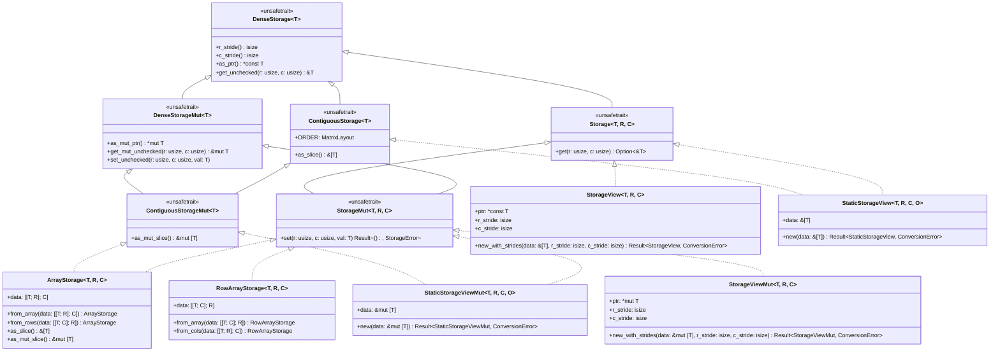
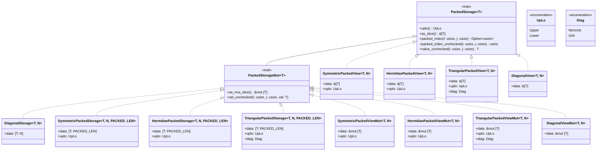

# Storage Backends & Data Layouts (Design Document)

---

### 1. Introduction

Storage holds matrix and vector elements in layouts that match their algebraic
form, on host and on bare-metal targets. Trait names and file paths belong in
§3/§4.

Primary usage scenarios:

- Index and mutate a matrix element without memory unsafety or an unhandled
  panic.
- Reinterpret a submatrix, transpose, or reversal without copying.
- Store a triangular, symmetric, or sparse matrix without paying dense zeros.
- Hand a contiguous buffer to hardware or a C ABI.

---

### 2. Requirements

#### 2.1 Functional Requirements

- **FR-1 — Structured layout representation**: Matrix and vector elements are stored
  in representations tailored to their algebraic form (dense strided arrays,
  packed triangular/symmetric/Hermitian layouts, and compressed sparse formats).
  Forcing all representations into a single dense buffer would waste memory on
  zeros or exploit no algebraic structure.
- **FR-2 — Safe coordinate access**: Call sites inspect and mutate matrix
  elements without memory unsafety or unhandled panics. Checked queries are
  fallible; unchecked pointer arithmetic is restricted to internal kernel
  paths under caller-proven invariants (C-4).
- **FR-3 — Zero-copy strided reinterpretation**: Algorithms require
  reinterpreting underlying storage across submatrix windows, transpositions
  ($RS \leftrightarrow CS$), and vector reversals through signed strides without
  data copying. Copying matrix elements for stride or orientation adjustments
  would exhaust microcontroller stack budgets and introduce runtime allocation.
- **FR-4 — Contiguous memory access**: Contiguous dense layouts expose a
  continuous slice for hardware and C-ABI interop. Non-contiguous strided
  views are not required to provide that slice.
- **FR-5 — Packed coordinate decoupling**: Separate physical compact slot
  indexing from algebraic matrix entry evaluation for triangular, symmetric,
  Hermitian, and diagonal structures, restricting in-place mutation to physical
  stored slots.
- **FR-6 — Compressed sparse in-place modification**: Provide compressed row
  and column sparse structures with zero-copy row/column slicing and
  in-place numerical mutation of existing non-zeros without structural
  reallocation.
- **FR-7 — Bounded coordinate assembly**: Assemble sparse triplets into
  canonical sorted compressed formats in-place within fixed stack storage
  without dynamic heap allocation.
- **FR-8 — One-dimensional sparse vectors**: Provide indexed sparse vector
  representations with parallel index and value buffers supporting Level-1
  sparse operations.
- **FR-9 — Structured layout conversions**: Provide conversions to dense
  representations and between compressed formats, plus projections from dense
  matrices into structured packed and diagonal layouts preserving structural
  tags.
- **FR-10 — Broad scalar support**: Support real primitives, fixed-point
  scalars, and complex numbers, enforcing conjugate reflection and validating
  real diagonals on write.

#### 2.2 Non-Functional Requirements

- **NFR-1 — Deterministic memory footprint**: Fixed-size stack structs have
  compile-time predictable sizes matching closed-form memory scaling formulas
  with zero hidden dynamic overhead or uncontrolled padding.
- **NFR-2 — Compile-time verification**: Fixed capacities and array lengths are
  checked statically at compile time without unstable `generic_const_exprs`.
- **NFR-3 — Zero-branch codegen**: Unchecked pointer indexing compiles to
  branchless instructions with 0 panic paths at `opt-level=3`.

#### 2.3 Constraints

- **C-1 — `#![no_std]` and zero dynamic allocation**: Core storage operations
  execute strictly under `#![no_std]` with zero dynamic heap allocation.
- **C-2 — Strided index arithmetic**: Pointer offset
  is $r \cdot RS + c \cdot CS$ using `isize` arithmetic.
- **C-3 — Const bounds invariant**: Packed array lengths require $L = N(N+1)/2$
  enforced via const assertions.
- **C-4 — Defensive and unchecked safety contract**: Safe accessors validate
  bounds; `unsafe` accessors require caller-proven bounds. `DenseStorage` and
  `DenseStorageMut` are `unsafe trait`s to guarantee backing pointer validity.
- **C-5 — Dim call site**: Dimension types come from `num-types-design.md`'s
  `Dim` trait; this document does not define its own dimension representation.
- **C-6 — Error invariant boundary**: Fallible indexing and structural
  violations return `StorageError`; shape mismatches against runtime slices
  return `ConversionError::DimensionMismatch` per `error-design.md`.

---

### 3. Technical Overview

The storage architecture is organized into three distinct, decoupled storage
subsystems: **Strided & Dense Storage**, **Packed Structured Storage**, and
**Sparse & Sparse Vector Storage**.

#### 3.1 Dense Strided Storage Hierarchy

_Figure 1: UML hierarchy for Dense Storage (`DenseStorage<T>`), Contiguous
Storage markers, stack backends, runtime-stride views (`StorageView<T, R, C>`),
and
`LayoutMarker`-tagged views (`StaticStorageView<T, R, C, O>`)._

#### 3.2 Packed Structured Storage Hierarchy

_Figure 2: UML hierarchy for packed structured storage traits, structured matrix
leaves, views, and structural enums._

#### 3.3 Sparse & Sparse Vector Storage Hierarchy

```mermaid
classDiagram
    direction TB

    class SparseStorage~T~ {
        <<trait>>
        +nnz() usize
    }

    class SparseStorageMut~T~ {
        <<trait>>
        +values_mut() &mut [T]
        +get_mut(r: usize, c: usize) Option~&mut T~
        +set_unchecked(r: usize, c: usize, val: T)
    }

    class CsrStorage~T~ {
        <<trait>>
        +row_offsets() &[usize]
        +col_indices() &[usize]
        +values() &[T]
        +row_slice(r: usize) Option~(&[usize], &[T])~
        +row_slice_unchecked(r: usize)(&[usize], &[T])
    }

    class CscStorage~T~ {
        <<trait>>
        +col_offsets() &[usize]
        +row_indices() &[usize]
        +values() &[T]
    }

    class SparseVectorStorage~T~ {
        <<trait>>
        +len() usize
        +nnz() usize
        +indices() &[usize]
        +values() &[T]
    }

    class ArrayCsrStorage~T, R, C, MAX_NNZ, R1~ {
+values: [T; MAX_NNZ]
+col_indices: [usize; MAX_NNZ]
+row_offsets: [usize; R1]
+nnz: usize
+from_coo(coo: &ArrayCooStorage) Result~ArrayCsrStorage, StorageError~
}

class ArrayCscStorage~T, R, C, MAX_NNZ, C1~ {
+values: [T; MAX_NNZ]
+row_indices: [usize; MAX_NNZ]
+col_offsets: [usize; C1]
+nnz: usize
}

class ArrayCooStorage~T, R, C, MAX_NNZ~ {
+row_indices: [usize; MAX_NNZ]
+col_indices: [usize; MAX_NNZ]
+values: [T; MAX_NNZ]
+nnz: usize
+push(r: usize, c: usize, val: T) Result~(), StorageError~
}

class ArraySparseVector~T, N, MAX_NNZ~ {
+indices: [usize; MAX_NNZ]
+values: [T; MAX_NNZ]
+nnz: usize
}

class ViewSparseVector~T, N~ {
+indices: &[usize]
+values: &[T]
}

class Side {
<<enumeration>>
Left
Right
}

class Trans {
<<enumeration>>
NoTrans
Trans
ConjTrans
 }

class StorageError {
<<enumeration>>
OutOfBounds
CapacityExceeded
ImmutableUnitDiagonal
InvalidStructuralInvariant
InvalidHermitianDiagonal
}

class ToDenseStorage~Dense~ {
<<trait>>
+to_dense() Result~Dense, StorageError~
}

%% Inheritance & Realizations
SparseStorage~T~ <|-- SparseStorageMut~T~
SparseStorage~T~ <|-- CsrStorage~T~
SparseStorage~T~ <|-- CscStorage~T~

CsrStorage~T~ <|.. ArrayCsrStorage~T, R, C, MAX_NNZ, R1~
SparseStorageMut~T~ <|.. ArrayCsrStorage~T, R, C, MAX_NNZ, R1~
CscStorage~T~ <|.. ArrayCscStorage~T, R, C, MAX_NNZ, C1~
SparseStorageMut~T~ <|.. ArrayCscStorage~T, R, C, MAX_NNZ, C1~
SparseStorage~T~ <|.. ArrayCooStorage~T, R, C, MAX_NNZ~

SparseVectorStorage~T~ <|.. ArraySparseVector~T, N, MAX_NNZ~
SparseVectorStorage~T~ <|.. ViewSparseVector~T, N~
```

_Figure 3: UML hierarchy for compressed sparse matrix formats, coordinate
assembly buffers, 1-D sparse vectors, layout conversions, and storage error
enums._

#### 3.4 Decoupled Storage Subsystems & Safe Access Contracts

The storage architecture explicitly avoids a monolithic raw storage supertrait
unifying dense, packed, and sparse layouts. Unifying those layouts behind a
single raw accessor trait would introduce branch overhead, dynamic dispatch, or
awkward default methods that cannot be implemented efficiently across dense
strided pointers, triangular packed arrays, and CSR/CSC compressed structures
[1], [2].

Instead, storage backends are partitioned into three dedicated subsystems:

1. **Dense Strided Storage (`DenseStorage<T>`, `DenseStorageMut<T>`)**:
   Provides low-level unsafe pointer and stride access (`as_ptr`, `r_stride`,
   `c_stride`, `get_unchecked`). For type-level shaped buffers,
   `Storage<T, R, C>`
   and `StorageMut<T, R, C>` extend dense storage to provide safe,
   bounds-checked element retrieval (`get(r, c) -> Option<&T>`) and mutation
   (`set(r, c, val) -> Result<(), StorageError>`).
2. **Packed Structured Storage (`PackedStorage<T>`, `PackedStorageMut<T>`)**:
   Provides packed slot mapping (`packed_index`), algebraic element evaluation
   (`value(i, j) -> Option<T>`), and in-place slot modification (
   `set(i, j, val)`),
   handling triangular, symmetric, Hermitian, and diagonal symmetries.
3. **Compressed Sparse Storage (`SparseStorage<T>`, `SparseStorageMut<T>`)**:
   Provides indexed access (`get(r, c) -> Option<T>`), non-zero values slice
   inspection (`values()`), and in-place existing non-zero mutation (
   `set(r, c, val)`).

Higher-level abstractions (such as `Matrix<T, R, C, S>`,
`PackedMatrix<T, N, S>`,
and `SparseMatrix<T, R, C, S>`) wrap their respective storage subsystem traits
directly without forcing cross-subsystem trait inheritance.

---

### 4. Architecture

#### 4.1 Strided Contract & Memory Addressing

The strided storage contract abstracts 2-D memory buffers through uniform stride
arithmetic [3], [4]. The address of an entry at
logical coordinate $(r, c)$ is computed via pointer arithmetic as:

$$\text{offset}(r, c) = r \cdot RS + c \cdot CS$$

where $RS$ is the row stride and $CS$ is the column stride in units of element
count [2], [5]. Using signed `isize` strides
enables
zero-copy representation of reversed vectors, flipped axes, and transposed views
[4].

Because default `get_unchecked` performs raw pointer arithmetic (
`self.as_ptr().offset(...)`),
`DenseStorage<T>` and `DenseStorageMut<T>` are declared as
`pub unsafe trait` [1], [3]: implementors guarantee
that `as_ptr()` points to an addressable buffer and that `r * RS + c * CS`
produces a valid in-bounds pointer for all $0 \le r < R$ and $0 \le c < C$.
`rows()` and `cols()` project `R::USIZE` and `C::USIZE`; they are not stored
fields. `T` remains a free scalar parameter — `Dim` parameterizes shape only
(`num-types-design.md` Phase 3).

Every strided backend enforces a dual-accessor contract [2], [3]:

- **Checked Accessors (`get`, `get_mut`, `set`)**: Perform runtime bounds checks
  against `rows()` and `cols()`, returning `Option<&T>`, `Option<&mut T>`, or
  `Result<(), StorageError>`. These provide safe interfaces at library
  boundaries.
- **Unchecked Accessors (`get_unchecked`, `get_mut_unchecked`, `set_unchecked`)
  **:
  Execute branchless pointer offset arithmetic directly without branch paths or
  panic handlers, enabling maximum throughput inside inner BLAS and solver
  loops.

Backends that guarantee a flat, contiguous `R · C` region starting at
`as_ptr()` implement the unsafe marker traits `ContiguousStorage<T>` and
`ContiguousStorageMut<T>`
[3], exposing direct slice access (`as_slice()`, `as_mut_slice()`)
required for standard C-ABI and BLAS subprogram interop [6], [7]. Owning col-major leaves (`ArrayStorage`) and
`LayoutMarker`-tagged `StaticStorageView` / `StaticStorageViewMut` qualify when
the marker matches the physical layout. Runtime-stride `StorageView` /
`StorageViewMut` do **not**: arbitrary `isize` strides, including a reverse
view whose pointer is the last element, are not a contiguous
`from_raw_parts(ptr, R·C)` region. Implementing the marker on those types is
unsound.

Scalar conjugation is integrated via the `Conjugate` trait (
`src/math/num_traits.rs`),
which acts as the reflexive identity operation for real primitives (`f32`,
`f64`,
integers, fixed-point) and evaluates imaginary negation for `Complex<T>`.

#### 4.2 Strided Leaves, Views & Conjugate Layouts

Stack-allocated dense storage is provided by `ArrayStorage<T, R, C>` (
column-major,
$RS=1, CS=R$) and `RowArrayStorage<T, R, C>` (row-major, $RS=C, CS=1$) backed by
nested inline arrays `[[T; R]; C]` and `[[T; C]; R]`. Using
nested arrays avoids requiring `#![feature(generic_const_exprs)]` on stable Rust
while preserving zero-padding flat memory layouts (accessible via `as_slice()` /
`as_mut_slice()`) [8]. Array lengths require `const R: usize,
const C: usize`; the leaves implement `DenseStorage<T>` with
`type R = Const<R>; type C = Const<C>;` via the
const-generic bridge in `num-types-design.md` FR-3 (C-5). `Const<N>: Dim`
follows num-types C-1; a missing `U*` name is `<Const<N> as Dim>::TypeNum`
(FR-4). Products may exceed both (C-2). Owning array leaves bind
`const R: usize, const C: usize` and do not define a parallel dimension
representation.

Non-owning slices come in two distinct families with specialized constructor
interfaces:

- **`StorageView<T, R, C>` / `StorageViewMut<T, R, C>`** (FR-2, runtime stride):
  wrap a borrowed slice with arbitrary `isize` strides without allocation
  [9], [10]. To enforce explicit stride specification and
  eliminate overlap with compile-time layout views, `StorageView` provides *
  *only**
  runtime-stride constructors (`new_with_strides`, `new_with_strides_unchecked`)
  taking explicit `r_stride` and `c_stride`. Transposition swaps strides
  ($RS \leftrightarrow CS$) and dimensions; reversal uses a negative row
  stride and a tail pointer [4], [6].
- **`StaticStorageView<T, R, C, O>` / `StaticStorageViewMut<T, R, C, O>`** (
  FR-2, compile-time layout):
  wrap a borrowed slice whose length equals $R \cdot C$, tagged by a
  `LayoutMarker` (`ColMajor` / `RowMajor`). `StaticStorageView` provides **only
  **
  const-stride constructors (`new`, `new_unchecked`), where strides are
  statically
  fixed by the marker (`ColMajor`: $RS=1, CS=R$; `RowMajor`: $RS=C, CS=1$). This
  pair
  does **not** accept runtime strides; runtime-strided `StorageView` does.

`ndarray`'s `ArrayBase` keeps dimension and stride in a shared `ArrayParts`
struct; `swap_axes` permutes both without copying [11], [12].
`nalgebra`'s plain `transpose()` returns an owning `OMatrix`, not a strided
view—zero-copy transposition stays on `StorageView` / stride-swapped views [2], [13]. Eigen's `Block` expression stores parent
reference plus `(startRow, startCol, blockRows, blockCols)` for zero-copy
submatrix windows [14]. A `BlockView` over `DenseStorage` mirroring Eigen's pattern is deferred to future work.

Conjugate transpose (adjoint) is evaluated in subprogram kernels via
`Trans::ConjTrans` by reading transposed coordinates and applying scalar
`.conj()` without a separate view type that falsifies reference returns.

| Type                                | Dimensions | Row Stride ($RS$) | Col Stride ($CS$) | Backing Memory Layout | Constructor Interface                      | Entry Access Formula           | Citation Reference                                     |
|:------------------------------------|:----------:|:-----------------:|:-----------------:|:---------------------:|:-------------------------------------------|:-------------------------------|:-------------------------------------------------------|
| `ArrayStorage<T, R, C>`             |  $(R, C)$  |        $1$        |        $R$        |     `[[T; R]; C]`     | `from_array([[T; R]; C])`, `from_rows([[T; C]; R])` | `data[c][r]`                   | [8], [15]                |
| `RowArrayStorage<T, R, C>`          |  $(R, C)$  |        $C$        |        $1$        |     `[[T; C]; R]`     | `from_array([[T; C]; R])`, `from_cols([[T; R]; C])` | `data[r][c]`                   | [7], [15]                   |
| `StorageView<'a, T, R, C>`          |  $(R, C)$  |       $RS$        |       $CS$        |       `&'a [T]`       | `new_with_strides(&[T], RS, CS)` (runtime) | `*ptr.offset(r * RS + c * CS)` | [2], [9], [10] |
| `StaticStorageView<'a, T, R, C, O>` |  $(R, C)$  |   marker-fixed    |   marker-fixed    |       `&'a [T]`       | `new(&[T])` (const marker-fixed)           | `O::offset(R, C, r, c)`        | (`LayoutMarker`; not arbitrary stride)                 |

#### 4.3 Packed Storage Architecture

Packed storage structures store structured matrices (symmetric, Hermitian,
triangular, diagonal) in compact 1-D buffers of length $L = N(N+1)/2$ or $L = N$
[6], [16]–[18].
Because packed coordinate maps are quadratic triangular number series rather
than
linear $(r \cdot RS + c \cdot CS)$ combinations, packed storage decouples
physical
memory lookup from algebraic entry evaluation:

- **Physical Slot Lookup (`packed_index(i, j)`)**: Returns `Some(index)` if the
  coordinate $(i, j)$ corresponds to a physically stored element within the
  chosen triangular half (`UpLo::Upper` or `UpLo::Lower`), or `None` if the
  coordinate lies in the implicit half or out of bounds [16].
- **Unchecked Slot Lookup (`packed_index_unchecked(i, j)`)**: Directly computes
  the quadratic index mapping formula without bounds checking or fallback
  branches.
  The caller guarantees $(i, j)$ is within the physical half [6].
- **Algebraic Entry Evaluation (`value(i, j)`)**: Evaluates the mathematical
  entry $A_{i,j}$ for any coordinate $0 \le i, j < N$, automatically applying
  structural invariants (reflection, conjugation, unit diagonals, or zeros)
  [16], [18].
- **Physical Mutation (`set(i, j, val)`)**: Restricted strictly to stored
  physical slots, preventing invalid or asymmetric writes to implicit entries.

#### 4.4 Packed Leaves, Symmetries & Mathematical Invariants

Concrete packed structures manage fixed-size stack arrays without heap overhead
[8]:

1. **Diagonal Storage (`DiagonalStorage<T, N>`)**: Stores $N$ diagonal elements.
   Off-diagonal coordinates evaluate algebraically to `T::ZERO`.
2. **Symmetric Packed Storage (`SymmetricPackedStorage<T, N, L>`)**: Stores
   $N(N+1)/2$ elements in packed upper or lower format [16].
   Implicit coordinates reflect across the main
   diagonal: $\text{value}(i, j) = \text{value}(j, i)$.
3. **Hermitian Packed Storage (`HermitianPackedStorage<T, N, L>`)**: Stores
   $N(N+1)/2$ complex elements [6], [16]. Implicit
   coordinates evaluate to the complex conjugate of the transpose:
   $\text{value}(i, j) = \text{value}(j, i).\text{conj}()$. Diagonal elements
   enforce $\text{Im}(A_{i,i}) = 0$. Writing a non-zero imaginary part to a
   diagonal
   entry via `set(i, i, val)` returns
   `Err(StorageError::InvalidHermitianDiagonal)`.
4. **Triangular Packed Storage (`TriangularPackedStorage<T, N, L>`)**: Stores
   $N(N+1)/2$ elements with explicit unit diagonal configuration (`Diag::Unit`
   or `Diag::NonUnit`) [6]. Off-triangle elements evaluate to
   `T::ZERO`.
   Unit diagonals evaluate to `T::ONE` and reject mutation attempts with
   `Err(StorageError::ImmutableUnitDiagonal)`.
5. **Specialized Packed Views**: `SymmetricPackedView`, `HermitianPackedView`,
   `TriangularPackedView`, and `DiagonalView` (and their `...Mut` counterparts)
   borrow packed 1-D slices with explicit structural tagging without data copies
   [16].

| Type                |  Physical Length   | Physical `packed_index(i, j)` (Upper / Lower)                                                           | Algebraic `value(i, j)` Invariant                                                                  | Standard Specification                         |
|:--------------------|:------------------:|:--------------------------------------------------------------------------------------------------------|:---------------------------------------------------------------------------------------------------|:-----------------------------------------------|
| **Diagonal**        |        $N$         | `i == j ? Some(i) : None`                                                                               | `i == j ? data[i] : T::ZERO`                                                                       | [17]                          |
| **Symmetric (SP)**  | $\frac{N(N+1)}{2}$ | Upper: $i \le j \implies i + \frac{j(j+1)}{2}$ Lower: $i \ge j \implies i - j + \frac{j(2N-j+1)}{2}$ | Transpose reflection: $i > j \implies \text{value}(j, i)$                                       | [16], [18] |
| **Hermitian (HP)**  | $\frac{N(N+1)}{2}$ | Upper: $i \le j \implies i + \frac{j(j+1)}{2}$ Lower: $i \ge j \implies i - j + \frac{j(2N-j+1)}{2}$ | Conjugate reflection: $i > j \implies \text{value}(j, i).\text{conj}()$; $\text{Im}(A_{i,i})=0$ | [6], [16]          |
| **Triangular (TP)** | $\frac{N(N+1)}{2}$ | Upper: $i \le j \implies i + \frac{j(j+1)}{2}$ Lower: $i \ge j \implies i - j + \frac{j(2N-j+1)}{2}$ | Unit diag: $i=j \implies \text{T::ONE}$; Off-triangle: $\text{T::ZERO}$                            | [6], [17]            |

#### 4.5 Sparse Compressed Formats, Mutation & In-Place Assembly

Sparse matrices are organized across three canonical representations:

- **Compressed Sparse Row (`CsrStorage<T>`, `ArrayCsrStorage`)**: Stores
  non-zero
  values ordered by rows, indexed through row offsets of length $R + 1$ and
  column indices of length $\text{nnz}$ [19]–[21]. Exposes zero-cost row slicing (`row_slice`,
  `row_slice_unchecked`)
  for high-performance $A x$ matrix-vector multiplication kernels.
- **Compressed Sparse Column (`CscStorage<T>`, `ArrayCscStorage`)**: Dual
  column-major
  compressed format indexed through column offsets of length $C + 1$ and row
  indices of length $\text{nnz}$ [19], [20].
- **Coordinate List (`ArrayCooStorage`)**: Dynamic triplet buffer
  `(row, col, value)`
  used for incremental assembly via `push(r, c, val)` [19].

##### In-Place Mutation Contract (`SparseStorageMut<T>`)

`SparseStorageMut<T>` provides safe and unchecked in-place modification of
existing
non-zero values without structural reallocation [1], [19]. `ArrayCsrStorage` and `ArrayCscStorage` both implement it.

- `values_mut() -> &mut [T]`: Exposes direct mutable access to the backing
  non-zero value buffer.
- `get_mut(r, c) -> Option<&mut T>`: Returns a mutable reference to the non-zero
  entry at $(r, c)$ if present.
- `set(r, c, val) -> Result<(), StorageError>`: Updates existing non-zero
  at $(r, c)$ or returns `Err(StorageError::InvalidStructuralInvariant)`
  if $(r, c)$ is not allocated in the sparse pattern.
- `unsafe set_unchecked(r, c, val)`: Unchecked in-place update for hot solver
  loops.

##### In-Place Stack COO-to-CSR Compression

`ArrayCsrStorage::from_coo` transforms unordered COO triplets into canonical
sorted CSR format entirely on the stack in worst-case $O(R + \sum_{i=0}^{R-1} k_i^2) \le O(R + \text{nnz}^2)$ time ($O(\text{nnz} + R)$ under bounded row density) without heap
allocation [19], [20]:

1. **Pass 1 — Histogram & Prefix Sum**: Iterates over COO
   triplets $0..\text{nnz}$,
   validates bounds $(r < R, c < C)$, counts entries per row into
   `row_counts[r]`,
   and computes the cumulative prefix sum into
   `row_offsets[i+1] = row_offsets[i] + row_counts[i]`.
2. **Pass 2 — Bucket Distribution**: Distributes COO values and column indices
   into
   their corresponding row intervals in temporary working arrays.
3. **Pass 3 — Row Sorting & Duplicate Accumulation**: Within each row interval
   `row_offsets[i]..row_offsets[i+1]`, performs an in-place insertion sort on
   column
   indices. If duplicate coordinates $(i, c)$ appear, sums their
   values ($v_1 + v_2$)
   and shifts subsequent entries down. Updates `row_offsets` to reflect
   compacted
   row lengths and sets `self.nnz = compressed_nnz`. A summed slot whose
   value is `T::ZERO` remains allocated; this pass does not prune explicit
   zeros. `ArrayCscStorage::from_coo` uses the same three passes on columns
   with worst-case $O(C + \sum_{j=0}^{C-1} k_j^2) \le O(C + \text{nnz}^2)$ time.
   CSR and CSC produced from one COO have equal `nnz` and the same coordinate
   set [19], [20].

##### Layout Conversions (FR-7)

- `ToDenseStorage<Dense>`: Converts packed or sparse representations to dense
  `ArrayStorage` [19].
- **Dense-to-structured projections**: inherent constructors on the four
  targets that admit one, not a trait. Recovering a structured layout from a
  dense operand selects a part and discards the rest, and which part is a
  free parameter the operand does not carry: a dense `ArrayStorage<T, N, N>`
  has no `UpLo` and no `Diag`. The caller names the part, matching the
  reference convention in which `UPLO` and `DIAG` are enumerated parameters of
  every packed routine rather than properties recovered from the data
  [6], [16].

  | Target                    | Constructor                                     | Part selected            |
    |:--------------------------|:------------------------------------------------|:-------------------------|
  | `DiagonalStorage`         | `from_dense_diagonal(dense)`                    | the diagonal             |
  | `SymmetricPackedStorage`  | `from_dense_triangle(dense, uplo)`              | one triangle, mirrored   |
  | `HermitianPackedStorage`  | `from_dense_triangle(dense, uplo)`              | one triangle, conjugate-mirrored; a non-real diagonal returns `InvalidHermitianDiagonal` |
  | `TriangularPackedStorage` | `from_dense_triangle(dense, uplo, diag)`        | one triangle             |

  The reverse direction is not a trait because it is not uniform and has no
  generic consumer. `ToDenseStorage` is total: every layout produces a dense
  array from itself alone, which is why seven leaves implement it. The
  projections are partial, lossy, and take a different parameter set per
  target, so a shared signature would either fix the tags internally (which
  cannot preserve a Lower operand, because nothing at the call boundary says
  the operand was Lower) or force meaningless parameters on
  `DiagonalStorage`. CSR, CSC and COO admit no projection at all: dense to
  sparse goes through `ArrayCooStorage::push` and then `to_csr` / `to_csc`
  (§4.3).

  The names carry the operation. `from_dense` would imply a total, lossless
  conversion, and all four discard data.
- `ToCsrStorage` / `ToCscStorage`: Inter-converts between CSR, CSC, and COO
  layouts [19], [20].

#### 4.6 1-D Sparse Vectors & Operational Types

For Level-1 SpBLAS operations (`SpDot`, `SpAxpy`), 2-D CSR/CSC indexing
introduces
unnecessary offset indirection [17], [22]. The
storage
system provides dedicated 1-D sparse vector representations:

- **`SparseVectorStorage<T>`**: Trait abstracting indexed 1-D non-zero arrays
  via `indices()` and `values()`.
- **`ArraySparseVector<T, N, MAX_NNZ>`**: Stack-allocated sparse vector holding
  up to `MAX_NNZ` non-zero coordinates within a logical length $N$ [8].
- **`ViewSparseVector<'a, T, N>`**: Zero-copy borrowed view over parallel index
  and value slices [2].

Operational settings and matrix attributes are parameterized through standard
C-compatible enumerations [6]:

- `UpLo`: `Upper` / `Lower` triangular storage selection.
- `Diag`: `NonUnit` / `Unit` diagonal specification.
- `Side`: `Left` / `Right` matrix multiplication position.
- `Trans`: `NoTrans` / `Trans` / `ConjTrans` transpose and adjoint operation
  selector.

##### Error Model & Boundary Separation

- **`ConversionError`** (defined in `src/math/mod.rs` per `error-design.md`):
  Governs fallible slice wrapping and dimension conversions (
  `DimensionMismatch`,
  `NonMonicPolynomial`).
- **`StorageError`**: Governs indexing, mutation, and structural invariant
  violations (`error-design.md` FR-2, FR-3, and storage-design.md C-6). Shape conditions already pinned by
  `Dim` parameters are compile errors. Erased-length wrapping
  (`StorageView::new_with_strides` and `StaticStorageView::new`) and DSP
  convolution against a runtime slice stay on
  `ConversionError::DimensionMismatch`. `StorageError` does not duplicate
  that arm.
    - `OutOfBounds`: Index exceeds logical row/column bounds.
    - `CapacityExceeded`: Maximum non-zero capacity `MAX_NNZ` exceeded in
      COO/CSR push.
    - `ImmutableUnitDiagonal`: Attempted write to a unit diagonal slot in
      `TriangularPackedStorage`.
    - `InvalidHermitianDiagonal`: Attempted write of non-zero imaginary
      component to a Hermitian diagonal slot.
    - `InvalidStructuralInvariant`: Attempted write to an unallocated non-zero
      slot in `SparseStorageMut` (CSR **and** CSC).
    - `OutOfBounds` is classified before `ImmutableUnitDiagonal` /
      `InvalidHermitianDiagonal` when \(i \ge N\) or \(j \ge N\).

- Array initialization: `try_array_from_iterator` for safe, `#![no_std]`
  uninitialized buffer initialization without requiring `T: Default` [8].

#### 4.7 Device-Resident Storage Boundary (Extension, Not MVP)

Host leaves (`ArrayStorage`, packed arrays, stack CSR) remain the only
implemented backends. Prior art separates device memory from host slices at
the type level:

| Ecosystem            | Host vs device split                                                                                                          | Layout exposure                            | Citation                                          |
|:---------------------|:------------------------------------------------------------------------------------------------------------------------------|:-------------------------------------------|:--------------------------------------------------|
| **Rust-CUDA `cust`** | `DeviceBuffer<T>` / `DeviceSlice<T>` distinct from host `Box<[T]>`                                                            | Typed element `T` on device                | [23], [24]                         |
| **candle-core**      | `Storage` enum (`Cpu` / `Cuda` / `Metal`); `BackendStorage` + `BackendDevice` traits with mutually recursive associated types | Layout via separate `Layout` type          | [25], [26]                            |
| **wgpu**             | `Buffer` holds GPU-accessible untyped bytes; `MAP_READ` / `MAP_WRITE` flag host-mappable buffers vs device-local usage        | Interpretation deferred to bind/read calls | [27], [28]                              |
| **PJRT / XLA**       | Opaque `PJRT_Buffer` C handle; `PjRtBuffer` abstract base with `on_device_shape()`                                            | Internal layout opaque; shape via vtable   | [29]–[32] |

PJRT targets a uniform device API across CPU, TPU, and CUDA selectable via
`PJRT_DEVICE` [32]. No Rust PJRT crate appears in the
research corpus; integration would be FFI-first.

**Adoption decision (this design)**: `control-rs` does **not** depend on
`cust`, `wgpu`, `candle-core`, or PJRT for the storage MVP. Mandatory
transitive deps conflict with crate-local minimize-dependencies policy:
`cust` pulls `cust_core`, `cust_raw`, and `bitflags`; `wgpu`
default features enable `wgpu-core` plus DX12/Metal/Vulkan/GLES/WebGPU
backends; `candle-core` pulls `gemm`, `half`, `rayon`, and optional
`cudarc`/Metal stacks. Device-resident layouts stay an documented extension
boundary for future [`subprograms-design.md`](./subprograms-design.md) accelerator backends.

Future extensions may introduce an optional `DeviceDenseStorage` unsafe trait
with opaque handle and shape metadata, leaving host `ContiguousStorage`
implementations unchanged.

#### 4.8 Band Storage (LAPACK Scheme, Out of MVP Scope)

LAPACK band storage maps an $m \times n$ matrix with $k_l$ subdiagonals and
$k_u$ superdiagonals into a $(k_l + k_u + 1) \times n$ compact array when
$k_l, k_u \ll \min(m,n)$ [16]. GPU LAPACK libraries
factor band batches with LU partial pivoting on band-structured systems [33]. RISC-V vector work optimizes BLAS on band matrices [34].

Phases 1–4 implement dense, packed (symmetric/Hermitian/triangular/diagonal),
and CSR/CSC/COO formats only. Band indexing uses a non-linear slot map
distinct from FR-2 stride arithmetic and from packed triangular indexing—
forcing it onto `DenseStorage` would forfeit the same optimization separation
cited in §5 for packed/sparse splits.

A dedicated `BandStorage<T, N, KL, KU>` leaf
and matching `PackedStorage`-style slot lookup are deferred until a numerical-model
consumer requires `?GBTRF` / `?GBMV` band kernels.

#### 4.9 Mixed-Precision & Accelerator Scalar Layouts

Scalar type `T` on every leaf remains a free type parameter (`f32`, `f64`,
integers, `fixed-num`, `Complex<T>`). Mixed-precision algorithms exploit
hardware that is faster at lower precision while higher precision remains
available in software [35]. Tensor-core LU can store the
working matrix in half precision but contemporary mixed-precision mixed half/single LU
still requires single-precision resident storage for data-movement reasons [36]. Dongarra et al. [37] tie mixed-precision algorithms
and floating-point emulation to Tensor Core evolution on GPUs. MAGMA exposes
roughly 750 routines across four precisions on diverse GPU vendors [38]. Embedded TinyML accelerators such as RedMulE target
mixed-precision GEMM on RISC-V SoCs [39]. RISC-V vector
GEMM micro-kernel generators [40] and OpenBLAS productization
issues on RISC-V [41] inform host-side layout choices for
future bare-metal backends without changing the MVP trait surface. GPU adaptive
batching for small matrix multiplies [42] is a subprogram
scheduling concern (`subprograms-design.md`), not a storage-layout invariant.

Storage does not fix precision at compile time beyond monomorphizing `T`.
Typed aliases such as `ArrayStorage<f16, R, C>` or
dual-buffer mixed-precision leaves will interface with `subprograms-design.md`
accelerator backends once `num-traits-design.md` admits half-width scalars.

---

### 5. Alternatives

| Alternative                                                                  | Rejected Because                                                                                                                                                                                                                                                                                                 | Reference                                                                         |
|:-----------------------------------------------------------------------------|:-----------------------------------------------------------------------------------------------------------------------------------------------------------------------------------------------------------------------------------------------------------------------------------------------------------------|:----------------------------------------------------------------------------------|
| **`usize` only strides**                                                     | Cannot represent negative increments ($INCX < 0$) or zero-copy reversed vector views required by BLAS standards.                                                                                                                                                                                                 | §4.1, §4.2 [4], [6]                                 |
| **Checked-only queries**                                                     | Introduces 20–40 branches in tight BLAS loops, destroying bare-metal DSP throughput.                                                                                                                                                                                                                             | §4.1, §7 [7], [43]                               |
| **Unchecked-only queries**                                                   | Violates C-3 and creates undefined behavior risks for external inputs and malformed slices.                                                                                                                                                                                                                      | §4.1, §4.5 [1]                                                     |
| **Dynamic sparse vector via 2D CSR**                                         | Inflates metadata and indexing overhead for 1-D vector operations (`SpDot`, `SpAxpy`).                                                                                                                                                                                                                           | §4.6 [17], [22]                                      |
| **One `Storage<T>` for packed & sparse**                                     | Offset is $r\cdot RS+c\cdot CS$. Packed and CSR index maps are non-linear; forcing them onto `Storage` destroys compiler optimizations.                                                                                                                                                                          | §4.1, §4.3, §4.5 [16], [19]                        |
| **Generic const expression (`Self::ROWS * Self::COLS`) for capacity**        | Direct const-generic arithmetic on traits is unstable (`generic parameters may not be used in const operations`). Nested `[[T; R]; C]` avoids that.                                                                                                                                                              | §4.2, C-4, NFR-2 [8]                                           |
| **Capacity from `DimMul` associated type multiplication (`R as DimMul<C>`)** | Projecting type-level multiplication into an array length is still a parameter-dependent const expression and needs `generic_const_exprs`.                                                                                                                                                                       | §4.2, C-4, NFR-2 [8]                                           |
| **Flattened `as_array() -> &[T; R * C]`**                                    | `R * C` in array-length position requires unstable `generic_const_exprs`. `as_slice()` on nested arrays is the stable contiguous view.                                                                                                                                                                           | §4.2, NFR-2 [8]                                                |
| **`nalgebra`-style owning `transpose()`**                                    | Returns `OMatrix` by value; violates FR-2 zero-copy transpose on views. Stride-swapped `StorageView` matches `faer`/`ndarray`/`NumPy` prior art.                                                                                                                                                                 | §4.2, FR-2 [2], [4], [12], [13] |
| **Strideless default constructor on `StorageView`**                          | Redundant with `StaticStorageView::new`; obscures whether layout assumptions are compile-time static invariants or runtime strided configurations.                                                                                                                                                               | §4.2 [4], [10]                                       |
| **Third-party GPU storage crates (`cust`, `wgpu`, `candle-core`)**           | Large mandatory transitive graphs (CUDA driver stack, multi-backend `wgpu-core`, ML framework deps) violate minimize-dependencies; host `#![no_std]` MVP needs no GPU buffer type.                                                                                                                               | §4.7 [23]–[28]                     |
| **PJRT / XLA buffer adoption**                                               | Uniform CPU/TPU/CUDA API exists [29]–[32] but no Rust crate in evidence; FFI surface and opaque layouts defer to [`subprograms-design.md`](./subprograms-design.md).                                                                                                                                               | §4.7 [29]–[31]                                               |
| **`candle`-style `Storage` enum for host+device**                            | Enum dispatch couples CPU leaves to CUDA/Metal variants at every call site; trait hierarchy keeps host subprograms monomorphic.                                                                                                                                                                                  | §4.7 [25], [26]                                                       |
| **A `FromDenseStorage` trait over the reverse direction**                    | Only four leaves admit a dense projection (Diagonal, SP, HP, TP); CSR, CSC and COO do not, and no code in `src/` is bounded on such a trait. A shared signature must either fix `UpLo`/`Diag` internally, which cannot preserve a Lower operand, or put parameters on `DiagonalStorage` that mean nothing to it. | §4.5 [6], [16]                                        |
| **Splitting the reverse direction across two traits**                        | Moving the three packed leaves to a second trait leaves the first with one implementor, `DiagonalStorage`. A one-implementor, one-method trait states no shared contract and no generic consumer exists to use it.                                                                                               | §4.5                                                                                |
| **An associated `Part` type carrying each target's tags**                    | Reaches one uniform trait with no meaningless parameters, and would extend to a band leaf's `KL`/`KU` (§4.8). Rejected as speculative: nothing in `src/` consumes the reverse direction generically, so the associated type buys vocabulary rather than reuse. Reconsider if a generic consumer appears.         | §4.5, §4.8                                                                          |
| **Fixing `UpLo::Upper` inside the projection**                               | Returns `Ok` on a lossy conversion: a Lower triangular operand loses its subdiagonal and is retagged Upper, so the §6.1 L3 round-trip cannot be written and a suite exercising only Upper passes vacuously.                                                                                                      | §4.5, §6.1 [16]                                                |
| **Canonicalize to Upper and error on a lossy source**                        | Keeps one signature and converts silent truncation into `StorageError`. Rejected because a Lower operand is exactly representable in the target, so refusing it is a gap in FR-7, not a safety property.                                                                                                         | §4.5, FR-7 [16]                                                |
| **`UpLo` / `Diag` as type parameters on the packed leaves**                  | Makes the triangle a compile-time property and the round-trip total by construction. Rejected: `UpLo` is a runtime field across the packed accessors (§4.3), so lifting it multiplies every packed leaf and view by four instantiations for a property the BLAS convention keeps at runtime.                         | §4.3, §4.5 [6]                                                         |
| **Band matrix on `DenseStorage` or packed traits**                           | Band slot map is neither $r \cdot RS + c \cdot CS$ nor triangular packed indexing; LAPACK uses a dedicated $(k_l+k_u+1) \times n$ scheme.                                                                                                                                                                        | §4.8 [16], [33]                            |
| **Fixed `f64`-only storage leaves**                                          | Mixed-precision algorithms and embedded `fixed-num` / integer paths require `T` as a free parameter; half/single LU literature shows precision is a kernel policy, not a layout field.                                                                                                                           | §4.9 [35], [36]                                |

---

### 6. Verification & Validation Plan

#### 6.1 Approach

The implementation must produce evidence that dense, packed, and sparse storage
layouts maintain compile-time and runtime memory bounds, that unchecked indexing
compiles to branchless instructions without panic paths, that packed and sparse
indexing preserve mathematical invariants (symmetry, Hermitian conjugation,
unit diagonals), and that conversions and projections round-trip losslessly
without dynamic heap allocation.

| Method | Mechanism |
|:-------|:----------|
| Compile-time shape check | Const-generic dimensions, `compile_fail` doctests (`PACKED_LEN`, stride validity) |
| Requirements-based test | `#[test]` unit tests covering checked/unchecked indexing, stride evaluation, and error boundaries |
| Property-based test | `proptest` over strided view transformations, reverse views, and sparse assembly |
| Static analysis | `cargo clippy-ci`, source inspection for branchless pointer math, absence of heap symbols, and absence of panics |
| Resource usage evaluation | `size_of::<T>()` and alignment assertions across 32-bit and 64-bit architectures |
| On-target execution | `#[ets_suite]` target execution on bare-metal MCU targets under QEMU asserting memory layout footprints |

Target: 90% statement coverage of `src/math/storage.rs`, measured via `cargo coverage`.
Excluded: Unreachable panic branches in release-mode `unsafe` pointer accessors and debug-only assertion formatting.

1. **Val-1: Multi-Layout State Estimation**: Kalman filter covariance matrices
   stored in packed symmetric format ($P$) alongside dense state vectors ($x$).
2. **Val-2: Fixed-Capacity Sparse MPC**: Condensed horizon state-space trajectory
   optimizer with sparse dynamics constraints on stack.
3. **Val-3: Zero-Copy Windowing**: Submatrix extraction of subsystem state
   transitions $A_{11}$ from large coupled block model $A$ with zero copies.
4. **Val-4: Complex Frequency Response**: Multi-channel MIMO frequency response
   matrix evaluations $G(j\omega)$ stored across discrete frequency grids with
   zero allocation.

#### 6.2 Acceptance

| Claim | Oracle | Measure | Bound |
|:------|:-------|:--------|:------|
| Dense memory footprint | Closed-form $R \cdot C \cdot \text{size\_of}(T)$ | `size_of::<ArrayStorage<T, R, C>>()` | Exact equality ($64$ bytes for $4 \times 4$ `f32`, $1024$ bytes for $16 \times 16$ `f32`) |
| Packed memory footprint | Closed-form $\frac{N(N+1)}{2}\text{size\_of}(T) + \text{align}$ | `size_of::<SymmetricPackedStorage<T, N, L>>()` | Exact equality ($44$ bytes for $N=4, L=10$ `f32` with align 4 on 32-bit/64-bit; $548$ bytes for $N=16$) |
| Diagonal memory footprint | Closed-form $N \cdot \text{size\_of}(T)$ | `size_of::<DiagonalStorage<T, N>>()` | Exact equality ($16$ bytes for $N=4$ `f32`, $64$ bytes for $N=16$) |
| CSR sparse footprint (32-bit) | Formula $MAX\_NNZ \cdot (\text{size\_of}(T) + 4) + (N+2) \cdot 4$ | `size_of::<ArrayCsrStorage<T, N, N, MAX_NNZ, R1>>()` | Exact equality ($120$ bytes for $N=4, MAX\_NNZ=12$ `f32`) |
| CSR sparse footprint (64-bit) | Formula $MAX\_NNZ \cdot (\text{size\_of}(T) + 8) + (N+2) \cdot 8$ | `size_of::<ArrayCsrStorage<T, N, N, MAX_NNZ, R1>>()` | Exact equality ($192$ bytes for $N=4, MAX\_NNZ=12$ `f32`) |
| Packed length assertion | Const assertion $L = N(N+1)/2$ | rustdoc `compile_fail` doctest | Fails to compile for $L \ne N(N+1)/2$ |
| Strided view indexing | Strided formula $r \cdot RS + c \cdot CS$ | `get(r, c)` vs `*get_unchecked(r, c)` | Bit-identical on interior; `None` out-of-bounds |
| Reverse view indexing | Pointer arithmetic with negative stride | `get(r, c)` on reversed view | Bit-identical to indexing reversed coordinates |
| Hermitian symmetry | Algebraic invariant $A_{i,j} = \overline{A_{j,i}}$ and $\text{Im}(A_{i,i}) = 0$ | Component equality | Bit-identical; write of $\text{Im} \ne 0$ returns `InvalidHermitianDiagonal` |
| Packed tag round-trip | Dense projection followed by structured reconstruction | Matrix entry comparison | Bit-identical for identical `UpLo` (Lower and Upper); restores implicit unit diagonal |
| Sparse assembly duplicate accumulation | Triplets with identical $(r, c)$ summed | Value at $(r, c)$ in assembled CSR/CSC | Exact algebraic sum of triplet values |
| Zero-branch codegen | Disassembly audit at `opt-level=3` | Instruction count of branches/panics | Exactly 0 branch instructions, 0 panic paths |

#### 6.3 Limits

- **Hardware-accelerated GPU layouts**: PJRT, wgpu, CUDA (`cust`), and candle
  patterns are documented in §4.7 but not implemented; device-resident memory is
  unverified in this revision.
- **Dynamic heap-allocated sparse structures**: Sparse representations are
  fixed-capacity stack arrays; unbounded dynamic resizing is not supported and
  not verified.
- **Stack-watermark telemetry on target**: ETS suite executes memory footprint
  checks via `size_of`, but dynamic stack headroom analysis and stack-watermark
  telemetry are deferred until profiler telemetry harnesses land.
- **Mismatched `uplo` conversion validation**: `from_dense_triangle` reads only
  the caller-specified triangle; detecting unreferenced triangle discrepancies is
  $O(N^2)$ and is deliberately unchecked.

---

### 7. Performance & Resource Considerations

Memory footprints across $N \times N$ matrix representations ($T = \text{f32}$,
4 bytes; $T = \text{Complex32}$, 8 bytes). Dense and packed sizes are
independent of `usize` width except alignment. CSR and sparse-vector sizes
depend on `size_of::<usize>()`; both 32-bit and 64-bit columns are required.
Host tests using `size_of::<usize>()` cannot validate a 64-bit-only table on
Cortex-M7 / RV32.

CSR formula (`ArrayCsrStorage`, `MAX_NNZ = 3N`, `R1 = N+1`):
$MAX\_NNZ \cdot (\mathrm{size\_of}(T) + \mathrm{size\_of}(\mathrm{usize})) + (N+2)\mathrm{size\_of}(\mathrm{usize})$.
Sparse-vector formula (`MAX_NNZ = N/2`):
$MAX\_NNZ \cdot (\mathrm{size\_of}(T) + \mathrm{size\_of}(\mathrm{usize})) + \mathrm{size\_of}(\mathrm{usize})$.

| Layout                                        | $N=4$ f32 32-bit | $N=4$ f32 64-bit | $N=16$ f32 32-bit | $N=16$ f32 64-bit |                                                    Memory Scaling                                                     |
|:----------------------------------------------|:----------------:|:----------------:|:-----------------:|:-----------------:|:---------------------------------------------------------------------------------------------------------------------:|
| **Dense (`ArrayStorage`)**                    |        64        |        64        |       1,024       |       1,024       |                                           $N^2 \cdot \mathrm{size\_of}(T)$                                            |
| **Packed Symmetric / Hermitian / Triangular** |        44        |        44        |        548        |        548        | $\frac{N(N+1)}{2} \cdot \mathrm{size\_of}(T) + \mathrm{align}$; `f32` leaves align 4, so \(N=4\) is 44 on both widths |
| **Diagonal (`DiagonalStorage`)**              |        16        |        16        |        64         |        64         |                                            $N \cdot \mathrm{size\_of}(T)$                                             |
| **CSR Sparse ($MAX\_NNZ = 3N$)**              |       120        |       192        |        456        |        720        |                                                     formula above                                                     |
| **Sparse Vector ($MAX\_NNZ = N/2$)**          |        20        |        32        |        68         |        104        |                                                     formula above                                                     |

---

### 8. Risks & Open Questions

- **`PACKED_LEN` Proof**: Constructors const-assert $L = N(N+1)/2$ without
  `generic_const_exprs` (C-3; [8]). A failed assertion is a
  compile error at the leaf constructor, not a `StorageError`.
- **Sparse Capacity vs. Count**: In `#![no_std]` stack structs, `MAX_NNZ` is
  fixed at compile time while live `nnz <= MAX_NNZ` is data
  [8]. `CapacityExceeded` is the runtime arm.
- **Error-enum alignment**: `StorageError` matches
  `error-design.md` FR-2, FR-3, and `storage-design.md` C-6. `DimensionMismatch` is not an arm of this
  enum.
- **Numerical-model consumers (assumption)**: `matrix-design.md`,
  `polynomial-design.md`, `state-space-design.md`,
  `transfer-function-design.md`, and `tensor-design.md` still name
  `MatrixStorage` / `BlasStorage` rather than `DenseStorage<T>`. Those
  documents stay Draft; this spec does not silently rename those types
  onto `DenseStorage<T>`.
- **`StaticStorageView<T, R, C, O>` stride contract**:
  `StaticStorageView<T, R, C, O>` /
  `StaticStorageViewMut<T, R, C, O>` strides
  are fixed by `LayoutMarker`. They do not inherit runtime-strided
  `StorageView`'s
  arbitrary `isize` stride guarantee. Stack-watermark ETS remains Open unless
  `control-rs-ets` already exposes painted-stack telemetry.
- **Reverse direction is untraited**: the four dense
  projections are inherent constructors. If a consumer later needs to be
  generic over "any structured leaf projected from dense", the associated-
  `Part` trait in §5 is the form to adopt; a band leaf (§4.8) would be the
  likely trigger, taking `KL`/`KU` as its part.
- **`uplo` disagreement is unchecked**: `from_dense_triangle` reads the triangle
  the caller names. A caller naming `UpLo::Upper` on a matrix populated below
  the diagonal gets a well-formed packed value holding that operand's upper
  triangle. Detecting the mismatch would require scanning the untouched
  triangle on every conversion, which is $O(N^2)$ against a conversion that is
  otherwise $O(N(N+1)/2)$. Left unchecked and documented; revisit if a
  consumer reports it as a defect source.
- **Symmetric and Hermitian degrade differently from triangular**: their
  accessors mirror across the diagonal (§4.3), so a fixed-Upper constructor
  preserves every value and loses only the tag, while triangular loses the
  subdiagonal outright. The oracle covers all three uniformly; the risk
  profile is not uniform.
- **Device-resident backends**: §4.7 documents PJRT, wgpu, CUDA (`cust`), and
  candle patterns but adopts none. An optional `DeviceDenseStorage` trait may be
  introduced behind a feature gate once `subprograms-design.md` defines
  accelerator dispatch.
- **Band storage leaf**: LAPACK band layout and GPU band-LU literature [16], [33]
  are uncorroborated for Rust embedded use. A dedicated `BandStorage<T, N, KL, KU>`
  may be added if band-matrix solvers are required.
- **Block / submatrix views**: Eigen `Block` stores offset + extent without
  copy [14]. A `BlockView` over `DenseStorage` will be evaluated for zero-copy
  submatrix windowing.
- **Half-precision leaves**: Mixed-precision survey and Tensor Core LU work [35], [36]
  cite `f16` storage benefits but `num-traits-design.md` does not yet admit
  half-width scalars. Typed aliases `ArrayStorage<f16, R, C>` once traits land.
- **RISC-V host BLAS productization**: OpenBLAS-on-RISC-V pitfalls [41] and vector
  GEMM generators [40] inform future contiguous-layout requirements for
  CMSIS/NMSIS-style FFI; no storage change until those backends are specified in
  `subprograms-design.md`.

---

### 9. Development Plan

| Phase                                 | Description                                                                                                                                                                                                                                             |  Effort  |
|:--------------------------------------|:--------------------------------------------------------------------------------------------------------------------------------------------------------------------------------------------------------------------------------------------------------|:--------:|
| **Phase 1: Strided Storage**          | `DenseStorage<T>` / `DenseStorageMut<T>` with `isize` strides, checked/unchecked methods, `ContiguousStorage`, `ArrayStorage` via `Const<R>`/`Const<C>`, `StorageView`.                                                                                 | Complete |
| **Phase 2: Packed Storage**           | `PackedStorage` / `PackedStorageMut`, `DiagonalStorage`, SP, HP, TP, specialized typed views, checked/unchecked accessors.                                                                                                                              | Complete |
| **Phase 3: Sparse Storage & Vectors** | `SparseStorage`, `CsrStorage`, `CscStorage`, `CooStorage`, `SparseVectorStorage`, stack leaves, COO assembly & compression.                                                                                                                             | Complete |
| **Phase 4: Layout Conversions**       | `ToDenseStorage` and the CSR/CSC/COO inter-conversions as traits; the four dense projections as inherent constructors (`from_dense_diagonal`, `from_dense_triangle`) across real and complex scalars, with the §6.1 L3 same-tag round-trip as the gate. | Complete |

---

### 10. Revision History

| Revision | Date            | Author          | Description                                                                                                                                           |
|:---------|:----------------|:----------------|:------------------------------------------------------------------------------------------------------------------------------------------------------|
| 1.0      | August 21, 2026 | @MitchellDScott | Extracted storage backend designs into dedicated modular specification.                                                                               |
| 1.1      | August 21, 2026 | @MitchellDScott | Backend expansions: added strided views, complex/Hermitian storage (`HermitianPackedStorage`), and sparse backends (COO/CSR/CSC).                    |
| 1.2      | August 22, 2026 | @MitchellDScott | Dimension parameterization: bound storage traits to type-level dimensions (`R: Dim, C: Dim`).                                                         |
| 2.0      | August 24, 2026 | @MitchellDScott | Decoupled storage subsystems: established distinct `DenseStorage`, `PackedStorage`, and `SparseStorage` architectures without cross-subsystem inheritance. |
| 2.1      | August 24, 2026 | @MitchellDScott | Strided view refinement: separated runtime strided views (`StorageView` / `StorageViewMut`) from compile-time marker views (`StaticStorageView`).    |
| 2.2      | August 25, 2026 | @MitchellDScott | Inherent structured projections: replaced `FromDenseStorage` with inherent projection constructors (`from_dense_diagonal`, `from_dense_triangle`).    |
| 2.3      | September 9, 2026 | @MitchellDScott | Hardening: reshape FR-1 to user-need requirement, sentence-case titles, convert in-text citations to standard IEEE numeric format [1]–[43], and repair markdown glitches in references. |
| 2.4      | September 10, 2026 | @MitchellDScott | Phase completion: marked Phases 1–4 Complete in §9 following verification of strided, packed, sparse, and conversion backends in `src/math/storage.rs`. |
| 2.5      | September 10, 2026 | @MitchellDScott | Verification grounding & review closure: rewrote FR-2/FR-3 to need-named claims, added On-target execution to §6.2, grounded §6.4 traceability locators to real tests in `src/math/tests/storage_tests.rs`, repaired cross-doc requirement IDs and PACKED_LEN C-3 citation. |
| 2.6      | September 15, 2026 | @MitchellDScott | §1 jobs; type names stripped from FR bodies. |
| 2.7      | September 16, 2026 | @MitchellDScott | Retired `vv-standards.md`: §6 authoring rules are `design-template.md` §6. |

---

## References

[1] vbarrielle, "Issue #39: Storage should be implemented as an unsafe trait," in *sparsemat/sprs*, 2015. [Online]. Available: https://github.com/sparsemat/sprs/issues/39. Accessed: Aug. 21, 2026.

[2] sarah-quinones, "paper.md," in *sarah-quinones/faer-rs*, 2026. [Online]. Available: https://raw.githubusercontent.com/sarah-quinones/faer-rs/main/paper.md. Accessed: Aug. 18, 2026.

[3] dimforge, "src/base/storage.rs," in *dimforge/nalgebra*, 2026. [Online]. Available: https://raw.githubusercontent.com/dimforge/nalgebra/main/src/base/storage.rs. Accessed: Aug. 6, 2026.

[4] NumPy Developers, "numpy.ndarray.strides," *NumPy Manual*, 2026. [Online]. Available: https://numpy.org/doc/stable/reference/generated/numpy.ndarray.strides.html. Accessed: Aug. 18, 2026.

[5] Eigen, "Eigen::Stride class reference," *Eigen documentation*, 2026. [Online]. Available: https://libeigen.gitlab.io/eigen/docs-nightly/classEigen_1_1Stride.html. Accessed: Aug. 18, 2026.

[6] Netlib, "cblas.h," *Netlib*, 2026. [Online]. Available: https://www.netlib.org/blas/cblas.h. Accessed: Aug. 11, 2026.

[7] Arm Limited, "Include/dsp/matrix_functions.h," in *ARM-software/CMSIS-DSP*, Version V1.10.1, 2022. [Online]. Available: https://raw.githubusercontent.com/ARM-software/CMSIS-DSP/main/Include/dsp/matrix_functions.h. Accessed: Aug. 6, 2026.

[8] rust-embedded, *heapless: `static` friendly data structures*, Version 0.9.3, 2026. [Online]. Available: https://docs.rs/heapless/latest/heapless/. Accessed: Aug. 6, 2026.

[9] dimforge, "src/base/matrix_view.rs," in *dimforge/nalgebra*, 2026. [Online]. Available: https://raw.githubusercontent.com/dimforge/nalgebra/main/src/base/matrix_view.rs. Accessed: Aug. 18, 2026.

[10] Eigen, "Eigen::Map class reference," *Eigen documentation*, 2026. [Online]. Available: https://libeigen.gitlab.io/eigen/docs-nightly/classEigen_1_1Map.html. Accessed: Aug. 18, 2026.

[11] rust-ndarray, "src/lib.rs," in *rust-ndarray/ndarray*, 2026. [Online]. Available: https://raw.githubusercontent.com/rust-ndarray/ndarray/master/src/lib.rs. Accessed: Aug. 18, 2026.

[12] rust-ndarray, "src/impl_methods.rs," in *rust-ndarray/ndarray*, 2026. [Online]. Available: https://raw.githubusercontent.com/rust-ndarray/ndarray/master/src/impl_methods.rs. Accessed: Aug. 18, 2026.

[13] dimforge, "src/base/matrix.rs," in *dimforge/nalgebra*, 2026. [Online]. Available: https://raw.githubusercontent.com/dimforge/nalgebra/main/src/base/matrix.rs. Accessed: Aug. 24, 2026.

[14] Eigen, "Eigen/src/Core/Block.h," in *libigl/eigen*, 2026. [Online]. Available: https://raw.githubusercontent.com/libigl/eigen/master/Eigen/src/Core/Block.h. Accessed: Aug. 21, 2026.

[15] dimforge, "src/base/array_storage.rs," in *dimforge/nalgebra*, 2026. [Online]. Available: https://raw.githubusercontent.com/dimforge/nalgebra/main/src/base/array_storage.rs. Accessed: Aug. 6, 2026.

[16] E. Anderson, Z. Bai, C. Bischof, S. Blackford, J. Demmel, J. Dongarra, J. Du Croz, A. Greenbaum, S. Hammarling, A. McKenney, and D. Sorensen, "Band Storage," in *LAPACK Users' Guide*, Philadelphia, PA: SIAM, 1999. [Online]. Available: https://www.netlib.org/lapack/lug/node124.html. Accessed: Aug. 21, 2026.

[17] C. L. Lawson, R. J. Hanson, D. R. Kincaid, and F. T. Krogh, "Basic Linear Algebra Subprograms for Fortran Usage," *ACM Trans. Math. Softw.*, vol. 5, no. 3, pp. 308–323, Sep. 1979, doi: 10.1145/355841.355847.

[18] J. J. Dongarra, J. Du Croz, S. Hammarling, and R. J. Hanson, "An Extended Set of FORTRAN Basic Linear Algebra Subprograms," *ACM Trans. Math. Softw.*, vol. 14, no. 1, pp. 1–17, Mar. 1988, doi: 10.1145/42288.42291.

[19] sparsemat, "sprs/src/sparse/csmat.rs," in *sparsemat/sprs*, 2026. [Online]. Available: https://raw.githubusercontent.com/sparsemat/sprs/master/sprs/src/sparse/csmat.rs. Accessed: Aug. 21, 2026.

[20] SciPy Developers, "scipy.sparse.csr_array," in *SciPy v1.18.0 Manual*, 2026. [Online]. Available: https://docs.scipy.org/doc/scipy/reference/generated/scipy.sparse.csr_array.html. Accessed: Aug. 21, 2026.

[21] Eigen, "Eigen/src/SparseCore/SparseMatrix.h," in *libigl/eigen*, 2026. [Online]. Available: https://raw.githubusercontent.com/libigl/eigen/master/Eigen/src/SparseCore/SparseMatrix.h. Accessed: Aug. 21, 2026.

[22] sparsemat, "sprs/src/sparse.rs," in *sparsemat/sprs*, 2026. [Online]. Available: https://raw.githubusercontent.com/sparsemat/sprs/master/sprs/src/sparse.rs. Accessed: Aug. 21, 2026.

[23] Rust-GPU, "crates/cust/src/memory/device/device_buffer.rs," in *Rust-GPU/Rust-CUDA*, 2026. [Online]. Available: https://raw.githubusercontent.com/Rust-GPU/Rust-CUDA/main/crates/cust/src/memory/device/device_buffer.rs. Accessed: Aug. 21, 2026.

[24] Rust-GPU, "crates/cust/src/memory/device/device_slice.rs," in *Rust-GPU/Rust-CUDA*, 2026. [Online]. Available: https://raw.githubusercontent.com/Rust-GPU/Rust-CUDA/main/crates/cust/src/memory/device/device_slice.rs. Accessed: Aug. 21, 2026.

[25] huggingface, "candle-core/src/storage.rs," in *huggingface/candle*, 2026. [Online]. Available: https://raw.githubusercontent.com/huggingface/candle/main/candle-core/src/storage.rs. Accessed: Aug. 21, 2026.

[26] huggingface, "candle-core/src/backend.rs," in *huggingface/candle*, 2026. [Online]. Available: https://raw.githubusercontent.com/huggingface/candle/main/candle-core/src/backend.rs. Accessed: Aug. 21, 2026.

[27] gfx-rs, "wgpu/src/api/buffer.rs," in *gfx-rs/wgpu*, 2026. [Online]. Available: https://raw.githubusercontent.com/gfx-rs/wgpu/trunk/wgpu/src/api/buffer.rs. Accessed: Aug. 21, 2026.

[28] gfx-rs, "wgpu-types/src/buffer.rs," in *gfx-rs/wgpu*, 2026. [Online]. Available: https://raw.githubusercontent.com/gfx-rs/wgpu/trunk/wgpu-types/src/buffer.rs. Accessed: Aug. 21, 2026.

[29] OpenXLA Project, "PJRT - Uniform Device API," *openxla.org*, 2026. [Online]. Available: https://openxla.org/xla/pjrt. Accessed: Aug. 21, 2026.

[30] openxla, "xla/pjrt/c/pjrt_c_api.h," in *openxla/xla*, 2026. [Online]. Available: https://raw.githubusercontent.com/openxla/xla/main/xla/pjrt/c/pjrt_c_api.h. Accessed: Aug. 21, 2026.

[31] openxla, "xla/pjrt/pjrt_client.h," in *openxla/xla*, 2026. [Online]. Available: https://raw.githubusercontent.com/openxla/xla/main/xla/pjrt/pjrt_client.h. Accessed: Aug. 21, 2026.

[32] PyTorch/XLA, "PJRT Runtime," *docs.pytorch.org*, 2026. [Online]. Available: https://docs.pytorch.org/xla/release/r2.6/learn/pjrt.html. Accessed: Aug. 21, 2026.

[33] A. Abdelfattah et al., "GPU-based LU Factorization and Solve on Batches of Matrices with Band Structure," in *Proc. SC '23 Workshops*, Denver, CO, USA, 2023, pp. 1672–1679, doi: 10.1145/3624062.3624247.

[34] A. Pirova et al., "Performance optimization of BLAS algorithms with band matrices for RISC-V processors," arXiv:2502.13839, 2025. [Online]. Available: https://arxiv.org/abs/2502.13839. Accessed: Aug. 21, 2026.

[35] N. J. Higham and T. Mary, "Mixed precision algorithms in numerical linear algebra," *Acta Numerica*, vol. 31, pp. 347–414, 2022, doi: 10.1017/S0962492922000022.

[36] F. Lopez and T. Mary, "Mixed precision LU factorization on GPU tensor cores: reducing data movement and memory footprint," *Int. J. High Perform. Comput. Appl.*, vol. 37, no. 2, pp. 165–179, 2023, doi: 10.1177/10943420221136848.

[37] J. J. Dongarra, J. Gunnels, H. Bayraktar, A. Haidar, and D. Ernst, "Accelerating Supercomputing: AI-Hardware-Driven Innovation for Speed and Efficiency," in *2025 IEEE High Performance Extreme Computing Conference (HPEC)*, Wakefield, MA, USA, 2025, doi: 10.1109/HPEC67600.2025.11196413.

[38] A. Abdelfattah et al., "MAGMA: Enabling exascale performance with accelerated BLAS and LAPACK for diverse GPU architectures," *Int. J. High Perform. Comput. Appl.*, vol. 38, no. 5, pp. 468–490, 2024, doi: 10.1177/10943420241261960.

[39] Y. Tortorella et al., "RedMulE: A Mixed-Precision Matrix-Matrix Operation Engine for Flexible and Energy-Efficient On-Chip Linear Algebra and TinyML Training Acceleration," arXiv:2301.03904, 2023. [Online]. Available: https://arxiv.org/abs/2301.03904. Accessed: Aug. 21, 2026.

[40] F. Igual et al., "Automatic Generation of Micro-kernels for Performance Portability of Matrix Multiplication on RISC-V Vector Processors," in *Proc. SC '23 Workshops*, 2023, doi: 10.1145/3624062.3624229.

[41] K. A. Zaytseva, V. V. Puzikova, and A. D. Sokolov, "On Problems in OpenBLAS Library Usage in Productized Code on RISC-V," *Proc. ISP RAS*, vol. 35, no. 5, pp. 91–106, 2023, doi: 10.15514/ISPRAS-2022-35(5)-7.

[42] Y. Zhang et al., "Accelerating small matrix multiplications by adaptive batching strategy on GPU," in *2022 IEEE HPCC/DSS/SmartCity/DependSys*, 2022, doi: 10.1109/hpcc-dss-smartcity-dependsys57074.2022.00143.

[43] sarah-quinones, "src/faer/mat/matref.rs," in *faer*, 2026. [Online]. Available: https://docs.rs/faer/latest/src/faer/mat/matref.rs.html. Accessed: Aug. 18, 2026.
