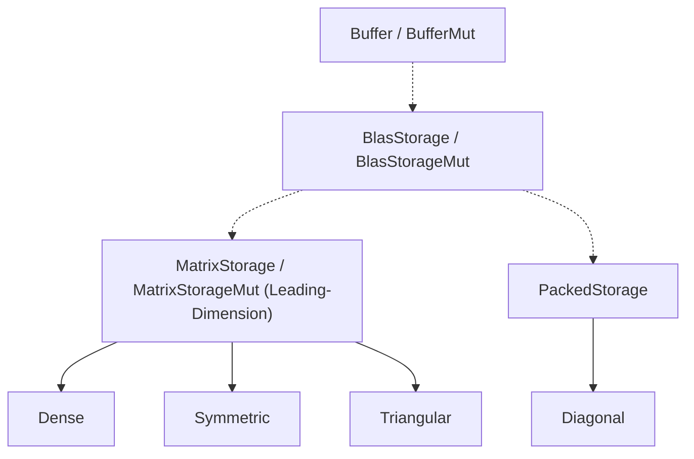
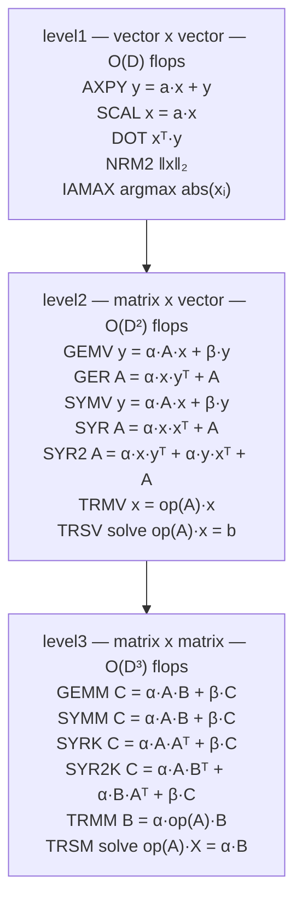

# Storage & Subprograms (Design Document)


---

### 1. Introduction

Numerical models and algorithms use generic dimensions (`Dim`) to check sizes
at compile time. `src/math/storage.rs`'s storage trait hierarchy ties `Dim`
(`R: Dim`, `C: Dim`) to physical memory, giving each backend a buffer, shape,
and addressing scheme (§4.1). This design does not select a BLAS library to
integrate; it defines the storage contract and the subprogram operand contract
separately, and what any future subprogram backend implementation must provide
against each.

---

### 2. Requirements

#### 2.1 Storage

##### 2.1.1 Functional Requirements

- **FR-1 — Dimension-Bound Storage**: Storage backends bind compile-time matrix
  dimensions ($R: \text{Dim}, C: \text{Dim}$) to physical memory.
- **FR-2 — Storage Provenance**: Distinguish owning stack buffers from
  borrowed read-only or mutable nested-array views.
- **FR-3 — Single Address-Model Branching**: Every storage backend implements
  either: leading-dimension ($lda$, $order$) or packed ($packed\_index$,
  `IMPLICIT`) addressing, matching the addressing models BLAS/LAPACK themselves
  expose (§5.1).
- **FR-4 — Packed Implicit Element**: Packed storage backends expose a constant
  `IMPLICIT` (zero or unit) for unstored coordinates $(i, j)$.
- **FR-5 — Composable Zero-Copy Views**: Any buffer (owned/ref/refmut) can
  create a ref to itself, but only owned storage can create a `RefMut`.
- **FR-6 — Borrowed-Buffer Shape Provenance**: A safe constructor producing a
  `Ref`/`RefMut`-backed storage instance takes its shape from an array
  type that already proves the shape-to-length relationship (`[[T; R]; C]` or
  `[T; N]`), or from caller-supplied `R2`/`C2`/`LDA` checked against an existing
  buffer. No safe constructor accepts a `Dim` shape and a raw slice/pointer
  independently (§4.1.1).

##### 2.1.2 Non-Functional Requirements

- **NFR-1 — `#![no_std]` Allocation Isolation**: Storage operations execute
  entirely without heap allocation or standard library dependencies.
- **NFR-2 — Compile Time Checks**: Storage and subprograms enforce
  constraints at compile time, without significant compilation time bloat.
- **NFR-3 — Backend flexibility**: The API allows higher level code to swap
  the linked BLAS library.

##### 2.1.3 Constraints

- **C-1 — Stack Budget Limit**: Single array storage allocations must comply
  with Clippy `large_stack_arrays` limits.
- **C-2 — BLAS Matrix Layout Scope**: Storage models are constrained to dense
  and packed matrix layouts; non-contiguous block-partitioned or arbitrary
  sparse matrix formats (CSR/CSC) are excluded.
- **C-3 — Block-Partitioned Operand Exclusion**: Non-contiguous
  block-partitioned operands cannot implement contiguous `as_slice()` and are
  excluded from `BlasStorage` leaves.

#### 2.2 Subprograms

##### 2.2.1 Functional Requirements

- **FR-7 — Complete Model Kernel Coverage**: Subprogram signatures cover
  Level-1 (scaling, dot, axpy, norm), Level-2 (matrix-vector multiplication,
  triangular solve, rank-1 update), and Level-3 (matrix-matrix multiplication,
  symmetric rank-k update, triangular matrix solve) numerical kernels required
  by `Matrix` and `Polynomial`.
- **FR-8 — Nested-Array Operands**: Level-1 routines consume 1-D arrays
  (`&[T; N]`, `&mut [T; N]`). Level-2/3 matrix operands consume nested
  column-major arrays (`&[[T; LDA]; COLS]`, `&mut [[T; LDA]; COLS]`), matching
  `Array2`'s `[[T; R]; C]`. No kernel returns or accepts a flattened
  `&[T; R * C]`. `LDA`/`LDB`/`LDC`/`INC_X` are compile-time const generics
  read from the operand's nested type, never runtime scalars (§4.2.1, §4.2.2).
- **FR-9 — Mandatory Inlining**: All subprogram default trait methods and
  entry-point wrappers carry `#[inline(always)]` to prevent call trampolines and
  ensure cross-crate optimization at all profile opt-levels.

##### 2.2.2 Non-Functional Requirements

- **NFR-4 — Zero-Panic-Path Release Codegen**: Monomorphized subprogram
  invocations over compile-time array storage compile to zero branch
  instructions, zero function call trampolines, and zero panic paths under
  release optimization (`opt-level=3`).
- **NFR-5 — Backend flexibility**: The API allows higher level code to swap
  the linked BLAS library.
- **NFR-6 — Per-Backend License Clearance**: FFI or external subprogram backends
  must undergo open-source license clearance (Apache-2.0, BSD-2-Clause,
  BSD-3-Clause) prior to adoption.

##### 2.2.3 Constraints

- **C-4 — Unsafe FFI Boundary**: Subprogram trait interfaces represent low-level
  `unsafe` execution boundaries; memory safety guarantees are enforced upstream
  by higher-level model abstractions.
- **C-5 — Source-Breaking Signature Stability**: Default subprogram method
  contracts form the reference execution backend; modifying signatures breaks
  implementor compatibility.

---

### 3. Technical Overview

Instead of a single flat trait chain, the storage trait hierarchy (§4.1)
connects Dim to physical memory using three distinct tiers:



1. **Buffer**: Separates provenance (owning vs. borrowed) entirely from
   shape and addressing (FR-2).
2. **Blas**: Equips every backend with only a logical shape and
   one addressable run of T.
3. **Address-model**: Branches into the specific cases a kernel class
   actually needs, leading-dimension or packed (FR-3), matching BLAS/LAPACK's
   own two addressing conventions (§5.1) rather than a third, more general
   model no cited consumer needs. This ensures a diagonal or packed backend
   is never queried for a leading dimension it cannot support.

The traits in `subprograms.rs` are sorted into the same three levels that
BLAS defines.



§4.1's storage hierarchy and §4.2's subprogram levels are independent
artifacts of this design: no shared type or method connects a
`MatrixStorage` value to a kernel call.

---

### 4. Architecture

#### 4.1 Storage

##### 4.1.1 Tiers & Addressing Model

**Tier 0 — `Buffer`/`BufferMut`.** Owning-vs-borrowed is a buffer property,
not a storage-shape property. Isolating it here (FR-2) is what keeps the
leaf set at four (§4.1.2) instead of doubling into `Dense`/`DenseView`/
`SymmetricView`/…: `Dense<T, Const<R>, Const<C>, Ref<'a, T, R, C>>` is the
view, not a distinct type.

```rust
/// # Safety
/// `as_ptr()` must address `as_slice().len()` initialized, contiguous `T`.
pub unsafe trait Buffer<T> {
    fn as_ptr(&self) -> *const T;
    fn as_slice(&self) -> &[T];
}
/// # Safety
/// `as_mut_ptr()` addresses the same memory as `as_ptr()`, exclusively for
/// the duration of the borrow.
pub unsafe trait BufferMut<T>: Buffer<T> {
    fn as_mut_ptr(&mut self) -> *mut T;
    fn as_mut_slice(&mut self) -> &mut [T];
}
```

`Array<T, const N: usize>` (owning, over `[T; N]`), `Array2<T, const R:
usize, const C: usize>` (owning, over `[[T; R]; C]`), `Ref<'a, T, const R:
usize, const C: usize>` (borrowed, over `&'a [[T; R]; C]`), `RefMut<'a,
T, const R: usize, const C: usize>` (borrowed, mutable), and the 1-D
borrowed pair `VectorRef<'a, T, const N: usize>` / `VectorRefMut<'a, T,
const N: usize>` (over `&'a [T; N]`) are the six provided implementors
(FR-2). `Buffer` is public rather than sealed, so a caller can back a leaf
with a buffer this design does not anticipate (§4.1.4).

```rust
/// Owning, nested-array backing for a 2D leaf. Both dimensions are the
/// type's own bare const generics, so no array length is ever computed
/// from a `Dim`-typed parameter's associated `USIZE` (§4.1.3, §5.1) — the
/// same shape shipped `ArrayStorage` already uses.
pub struct Array2<T, const R: usize, const C: usize> {
    data: [[T; R]; C],
}
// Safety: `data` is `R * C` initialized, contiguous `T` by construction;
// `as_flattened()` is a zero-cost reinterpretation of `[[T; R]; C]` as
// `&[T]`, the same operation shipped `ArrayStorage` already relies on.
unsafe impl<T, const R: usize, const C: usize> Buffer<T> for Array2<T, R, C> {
    fn as_ptr(&self) -> *const T {
        self.data.as_ptr().cast()
    }
    fn as_slice(&self) -> &[T] {
        self.data.as_flattened()
    }
}
// Safety: `as_mut_ptr()` addresses the same memory as `as_ptr()`, with
// exclusive access for the duration of the `&mut self` borrow.
unsafe impl<T, const R: usize, const C: usize> BufferMut<T> for Array2<T, R, C> {
    fn as_mut_ptr(&mut self) -> *mut T {
        self.data.as_mut_ptr().cast()
    }
    fn as_mut_slice(&mut self) -> &mut [T] {
        self.data.as_flattened_mut()
    }
}
```

`Array`/`Array2` get their safety from the struct's own const generics:
`data.len()` equals `N` or the nested `[[T; R]; C]` is `R` by `C` by
construction. `Ref`/`RefMut` get the same guarantee: they borrow
`[[T; R]; C]`, so shape and length are the nested type, not a `Dim` paired
with a slice. Two constructor families (FR-6):

```rust
impl<T, const R: usize, const C: usize> DenseArray<T, R, C> {
    /// Shape copied from `Self`'s own const generics.
    pub fn view(&self) -> DenseRef<'_, T, R, C> { .. }
    pub fn view_mut(&mut self) -> DenseRefMut<'_, T, R, C> { .. }

    /// Flattened operand. `N` is a method const generic, not an impl
    /// parameter: `&[T; R * C]` is unrepresentable (§5.1). `DimMul` proves
    /// `N = R·C`; assigning a wrong length is E0271.
    pub fn as_array<const N: usize>(&self) -> &[T; N]
    where
        Const<R>: DimMul<Const<C>, Output=<Const<N> as Dim>::PeanoTypeNum>,
        Const<N>: Dim,
    { .. }

    /// Caller supplies logical shape `R2`/`C2` and physical inner dimension
    /// `LDA`. Runtime-checks `origin` against `self`. Nested operand of the
    /// result is `&[[T; LDA]; C2]` with `const { assert!(LDA >= R2) }`.
    /// Constructible as a column panel when `origin.0 == 0` and `LDA == R`
    /// (outer-array split of `[[T; R]; C]`). A nonzero row origin has no
    /// nested `[[T; LDA]; C2]` representation in this buffer.
    pub fn try_submatrix<const R2: usize, const C2: usize, const LDA: usize>(
        &self,
        origin: (usize, usize),
    ) -> Option<Dense<T, Const<R2>, Const<C2>, Ref<'_, T, LDA, C2>>> { .. }
}
```

No public constructor takes an arbitrary `&[T]`/`&mut [T]` plus an
independently-chosen `R: Dim`/`C: Dim`; that pairing is exactly what
`MatrixStorage`'s and `BlasStorage`'s `# Safety` contracts forbid (§5.1).

**Tier 1 — `BlasStorage`/`BlasStorageMut`.** The universal
floor: generic shape parameters (`R: Dim`, `C: Dim`) and a contiguous run of
stored elements (FR-1). One storage implementor can implement `BlasStorage`
for any `R`, `C`.

```rust
/// # Safety
/// The implementor must fully initialize all physically stored elements for 
/// `as_ptr()` and `as_slice()` to be valid.
pub unsafe trait BlasStorage<T, R: Dim, C: Dim> {
    const ROWS: R;
    const COLS: C;
    fn shape(&self) -> (usize, usize) { (ROWS, COLS) }
    fn as_ptr(&self) -> *const T;
    fn as_slice(&self) -> &[T];
}

pub unsafe trait BlasStorageMut<T, R: Dim, C: Dim>: BlasStorage<T, R, C> {
    fn as_mut_ptr(&mut self) -> *mut T;
    fn as_mut_slice(&mut self) -> &mut [T];
}
```

**Tier 2 — addressing model, two mutually exclusive branches (FR-3).**
Each branch is the exact precondition of a different kernel class, and a
leaf implements exactly one, matching the two addressing models BLAS/LAPACK
themselves expose (§5.1):

| Branch                | Method(s)                                         | Precondition for                                      |
|:----------------------|:--------------------------------------------------|:------------------------------------------------------|
| `MatrixStorage`/`Mut` | `lda()`, `order()`                                | `cblas_*ge/sy/tr*` (§4.2.1, §4.2.3)                   |
| `PackedStorage`       | `packed_index(i, j) -> Option<usize>`, `IMPLICIT` | `cblas_*sp/tp*`-style packed formats, diagonal (FR-4) |

```rust
/// # Safety
/// The buffer spans `lda() * major_len` elements (`major_len` is `cols()`
/// under `ColMajor`, `rows()` under `RowMajor`), and `lda()` is at least
/// the corresponding minor extent.
pub unsafe trait MatrixStorage<T, R: Dim, C: Dim>: BlasStorage<T, R, C> {
    type LDA: Dim;
}
pub unsafe trait MatrixStorageMut<T, R: Dim, C: Dim>: MatrixStorage<T, R, C> + BlasStorageMut<T, R, C> {}

/// # Safety
/// `packed_index(i, j)` returns `Some(k)` only for `k < stored()`, and no
/// two distinct in-bounds `(i, j)` map to the same `k`.
pub unsafe trait PackedStorage<T, D: Dim>: BlasStorage<T, D, D> {
    const IMPLICIT: T;
    fn packed_index(&self, i: usize, j: usize) -> Option<usize>;
}
```

`IMPLICIT` (`T::ZERO` / `T::ONE`, FR-4) is the structural value a packed
backend's unstored positions take; `Diagonal` (§4.1.2) sets `IMPLICIT` to
`T::ZERO`, and a future unit-triangular packed leaf would set `T::ONE`.

`MatrixStorage`/`PackedStorage` share no super-trait beyond `BlasStorage`, by
construction: a third branch, or a leaf needing both branches at once, is
representable without touching the other (§4.1.3). Neither exposes a
bounds-checked `get`/`get_mut`: per-`(i, j)` logical lookup is built from
whichever branch a leaf implements, one level up, and is out of this
design's scope (NFR-1, §8).

##### 4.1.2 Provided Leaves

Each leaf is generic over `T`, its `Dim` shape parameters and a `B:
Buffer<T>` (Tier 0), and implements `BlasStorage` plus exactly one Tier-2
branch (FR-3):

| Leaf         | Tier-2 branch          | Shape-specific inherent data       | CBLAS analogue                                                                             |
|:-------------|:-----------------------|:-----------------------------------|:-------------------------------------------------------------------------------------------|
| `Dense`      | `MatrixStorage`(`Mut`) | none                               | `GE`                                                                                       |
| `Symmetric`  | `MatrixStorage`        | `uplo(): Triangle`                 | `SY`                                                                                       |
| `Triangular` | `MatrixStorage`        | `uplo(): Triangle`, `diag(): Diag` | `TR`                                                                                       |
| `Diagonal`   | `PackedStorage`        | none                               | none — nearest LAPACK precedent is tridiagonal's 1-D array storage (Anderson et al., 1999) |

`uplo()`/`diag()` are inherent methods, never trait methods: they are
per-shape data, not part of what makes a type a valid `MatrixStorage`.
`Triangle` and `Diag` are the enums §4.2.3 already introduces for the
level-2/3 kernel surface, reused here rather than duplicated.

`Diagonal` is the payoff case: it implements `PackedStorage`, never
`MatrixStorage`, so `lda()`/`order()` are not merely unset, they do not
compile at any call site that requires them:

```rust
unsafe impl<T: Zero, D: Dim, B: Buffer<T>> PackedStorage<T, D>
for Diagonal<T, D, B> {
    const IMPLICIT: T = T::ZERO;
    fn packed_index(&self, i: usize, j: usize) -> Option<usize> {
        if i == j && i < D::USIZE { Some(i) } else { None }
    }
}
```

##### 4.1.3 Convenience Storage Aliases

To eliminate verbose generic defaults across numerical model definitions
(`Matrix`, `Polynomial`, `StateSpace`, `TransferFunction`), the storage
architecture exports ergonomic convenience aliases directly inside
`storage.rs`. Every owning alias's capacity is one or two bare `const
usize` parameters on the alias itself — never an expression derived from a
`Dim`-typed parameter's associated `USIZE` (§5.1) — so no array length
anywhere below depends on `generic_const_exprs`, unstable on this crate's
toolchain (`error-design.md` NFR-2). The 2D aliases hand their two bare
consts straight to `Array2` (§4.1.1); the `Dim`-typed shape slots `Dense`/
`Symmetric`/`Triangular` themselves want are filled with `Const<R>`/
`Const<C>`, which is always well-formed once `R`/`C` are concrete:

```rust
// 2D Dense Storage Aliases (R, C are the alias's own bare const generics)
pub type DenseArray<T, const R: usize, const C: usize> =
Dense<T, Const<R>, Const<C>, Array2<T, R, C>>;
pub type DenseRef<'a, T, const R: usize, const C: usize> =
Dense<T, Const<R>, Const<C>, Ref<'a, T, R, C>>;
pub type DenseRefMut<'a, T, const R: usize, const C: usize> =
Dense<T, Const<R>, Const<C>, RefMut<'a, T, R, C>>;

// 1D Single-Column (Vector / Polynomial) Storage Aliases
pub type DenseVectorArray<T, const N: usize> =
Dense<T, Const<N>, U1, Array<T, N>>;
pub type DenseVectorRef<'a, T, const N: usize> =
Dense<T, Const<N>, U1, VectorRef<'a, T, N>>;
pub type DenseVectorRefMut<'a, T, const N: usize> =
Dense<T, Const<N>, U1, VectorRefMut<'a, T, N>>;

// Specialized Structure Owning Storage Aliases
pub type SymmetricArray<T, const N: usize> =
Symmetric<T, Const<N>, Array2<T, N, N>>;
pub type TriangularArray<T, const N: usize> =
Triangular<T, Const<N>, Array2<T, N, N>>;
pub type DiagonalArray<T, const N: usize> =
Diagonal<T, Const<N>, Array<T, N>>;
```

Borrowed aliases carry the same bare `const usize` parameters as the owning
aliases: `Ref`/`VectorRef` embed `[[T; R]; C]` / `[T; N]`, so there is no
`Dim::USIZE` projection and nothing for `generic_const_exprs` to gate.

##### 4.1.4 Custom Storage

The hierarchy is open at every tier: a caller can back a provided leaf with
a `Buffer` implementor this design does not anticipate, add a leaf
implementing an existing Tier-2 branch or, out of this design's scope,
propose a third branch for an addressing model neither of the two covers.

No blanket impl ever bridges two tiers. `MatrixStorage: BlasStorage` is a
super-trait bound, not a base every `BlasStorage` gets for free, and every
leaf writes both impls out by hand: `impl<T, R: Dim, C: Dim, S: MatrixStorage<T, R, C>>
BlasStorage<T, R, C> for S` would collide with the `PackedStorage`
equivalent under E0119, the same coherence hazard a nalgebra-style
`ContiguousStorage` marker bridge hits (§5.1). The two-branch split
turns a single bridging hazard into a two-way one, resolved the same way:
by requiring the explicit impl.

##### 4.1.5 Block-Partitioned Storage: Outside the Hierarchy

A block-diagonal or block-partitioned operand is a container of
sub-storages whose buffers are not one contiguous run, so `BlasStorage::
as_slice()` has no honest implementation, the same failure mode
`Diagonal`'s `lda()` had one tier up (C-3). It is therefore a sibling
trait, not a `BlasStorage` leaf, and any kernel over it is a loop of
per-block kernel calls rather than a single FFI call:

```rust
pub trait BlockStorage<T> {
    type Block: BlasStorage<T>;
    fn shape(&self) -> (usize, usize);
    fn block_origins(&self) -> &[usize];
    fn block(&self, k: usize) -> Option<&Self::Block>;
}
```

`BlockStorage`'s shape here follows directly from C-3's `as_slice()`
argument, not from a cited precedent, and is tracked as an open question pending
a follow-up.

#### 4.2 Subprograms

The subprogram module lives in `math` and holds a thin trait wrapper, a
default implementor and a verification tool.

##### 4.2.1 Subprograms

Each BLAS level maps to one trait per operation, with a single method
parameterized over compile-time array extents. `INC_X`/`INC_Y` (level 1) and
`LDA`/`LDB`/`LDC` (level 2/3) are const generics, not runtime parameters (FR-2).

| Trait                                                                                                                                                                         | Method                                                                                                                                                           | CBLAS Analogue                                        |
|:------------------------------------------------------------------------------------------------------------------------------------------------------------------------------|:-----------------------------------------------------------------------------------------------------------------------------------------------------------------|:------------------------------------------------------|
| `level1::AXPY<T, const N: usize, const INC_X: usize = 1, const INC_Y: usize = 1, const BUF_X: usize = N, const BUF_Y: usize = N>`                                             | `fn axpy(a: T, x: &[T; BUF_X], y: &mut [T; BUF_Y])`                                                                                                              | `cblas_saxpy`/`cblas_daxpy` (Dongarra et al., 1988)   |
| `level1::SCAL<T, const N: usize, const INC_X: usize = 1, const BUF_X: usize = N>`                                                                                             | `fn scal(a: T, x: &mut [T; BUF_X])`                                                                                                                              | `cblas_sscal`/`cblas_dscal` (Dongarra et al., 1988)   |
| `level1::DOT<T, const N: usize, const INC_X: usize = 1, const INC_Y: usize = 1, const BUF_X: usize = N, const BUF_Y: usize = N>`                                              | `fn dot(x: &[T; BUF_X], y: &[T; BUF_Y]) -> T`                                                                                                                    | `cblas_sdot`/`cblas_ddot` (Dongarra et al., 1988)     |
| `level1::NRM2<T, const N: usize, const INC_X: usize = 1, const BUF_X: usize = N>`                                                                                             | `fn nrm2(x: &[T; BUF_X]) -> T`                                                                                                                                   | `cblas_snrm2`/`cblas_dnrm2` (Dongarra et al., 1988)   |
| `level1::IAMAX<T, const N: usize, const INC_X: usize = 1, const BUF_X: usize = N>`                                                                                            | `fn iamax(x: &[T; BUF_X]) -> usize`                                                                                                                              | `cblas_isamax`/`cblas_idamax` (Dongarra et al., 1988) |
| `level2::GEMV<T, const ROWS: usize, const COLS: usize, const N_X: usize, const N_Y: usize, const LDA: usize = ROWS>`                                                          | `fn gemv(alpha: T, a: &[[T; LDA]; COLS], x: &[T; N_X], beta: T, y: &mut [T; N_Y], trans: Transpose, order: MatrixLayout)`                                        | `cblas_sgemv`/`cblas_dgemv` (Dongarra et al., 1988)   |
| `level3::GEMM<T, const M: usize, const N: usize, const K: usize, const COLS_A: usize, const COLS_B: usize, const LDA: usize = M, const LDB: usize = K, const LDC: usize = M>` | `fn gemm(alpha: T, a: &[[T; LDA]; COLS_A], b: &[[T; LDB]; COLS_B], beta: T, c: &mut [[T; LDC]; N], trans_a: Transpose, trans_b: Transpose, order: MatrixLayout)` | `cblas_sgemm`/`cblas_dgemm` (Dongarra et al., 1990)   |

##### 4.2.2 Operand Contract

Level-1 operands are 1-D (`&[T; N]`). Level-2/3 matrix operands are nested
column-major arrays matching `Array2` (`&[[T; LDA]; COLS]`).

- **Flattened access, `N` on the method**: `as_array<const N: usize>() ->
  &[T; N]` where `Const<R>: DimMul<Const<C>, Output = <Const<N> as Dim>::
  PeanoTypeNum>`. The product is a trait-solver bound, not an array length.
  Call sites name `N` by expected type or turbofish (`let a: &[T; 6] =
  m.as_array()`). A padded panel binds `N` to `LDA·C2`, not `R2·C2`.
- **Range-check elimination**: Nested and 1-D array lengths are in the
  signature, so LLVM proves loop bounds in-range (Section 7.1).

##### 4.2.3 Proposed Routines and the Transpose Flag

| Trait                                                                                                                                                  | Method                                                                                                                                                      | CBLAS Analogue                                      |
|:-------------------------------------------------------------------------------------------------------------------------------------------------------|:------------------------------------------------------------------------------------------------------------------------------------------------------------|:----------------------------------------------------|
| `level2::GER<T, const ROWS: usize, const COLS: usize, const LDA: usize = ROWS>`                                                                        | `fn ger(alpha: T, x: &[T; ROWS], y: &[T; COLS], a: &mut [[T; LDA]; COLS], order: MatrixLayout)` — `A = alpha*x*yᵀ + A`                                      | `cblas_sger`/`cblas_dger` (Dongarra et al., 1988)   |
| `level2::SYMV<T, const N: usize, const LDA: usize = N>`                                                                                                | `fn symv(alpha: T, a: &[[T; LDA]; N], x: &[T; N], beta: T, y: &mut [T; N], uplo: Triangle, order: MatrixLayout)`                                            | `cblas_ssymv`/`cblas_dsymv`                         |
| `level2::SYR<T, const N: usize, const LDA: usize = N>`                                                                                                 | `fn syr(alpha: T, x: &[T; N], a: &mut [[T; LDA]; N], uplo: Triangle, order: MatrixLayout)`                                                                  | `cblas_ssyr`/`cblas_dsyr`                           |
| `level2::SYR2<T, const N: usize, const LDA: usize = N>`                                                                                                | `fn syr2(alpha: T, x: &[T; N], y: &[T; N], a: &mut [[T; LDA]; N], uplo: Triangle, order: MatrixLayout)`                                                     | `cblas_ssyr2`/`cblas_dsyr2`                         |
| `level2::TRMV<T, const N: usize, const LDA: usize = N>`                                                                                                | `fn trmv(a: &[[T; LDA]; N], x: &mut [T; N], uplo: Triangle, diag: Diag, trans: Transpose, order: MatrixLayout)`                                             | `cblas_strmv`/`cblas_dtrmv`                         |
| `level2::TRSV<T, const N: usize, const LDA: usize = N>`                                                                                                | `fn trsv(a: &[[T; LDA]; N], x: &mut [T; N], uplo: Triangle, diag: Diag, trans: Transpose, order: MatrixLayout)`                                             | `cblas_strsv`/`cblas_dtrsv` (Dongarra et al., 1988) |
| `level3::SYMM<T, const M: usize, const N: usize, const COLS_A: usize, const COLS_B: usize, const LDA: usize, const LDB: usize, const LDC: usize = M>`  | `fn symm(alpha: T, a: &[[T; LDA]; COLS_A], b: &[[T; LDB]; COLS_B], beta: T, c: &mut [[T; LDC]; N], uplo: Triangle, side: Side, order: MatrixLayout)`        | `cblas_ssymm`/`cblas_dsymm`                         |
| `level3::SYRK<T, const N: usize, const K: usize, const COLS_A: usize, const LDA: usize, const LDC: usize = N>`                                         | `fn syrk(alpha: T, a: &[[T; LDA]; COLS_A], beta: T, c: &mut [[T; LDC]; N], uplo: Triangle, trans: Transpose, order: MatrixLayout)`                          | `cblas_ssyrk`/`cblas_dsyrk` (Dongarra et al., 1990) |
| `level3::SYR2K<T, const N: usize, const K: usize, const COLS_A: usize, const COLS_B: usize, const LDA: usize, const LDB: usize, const LDC: usize = N>` | `fn syr2k(alpha: T, a: &[[T; LDA]; COLS_A], b: &[[T; LDB]; COLS_B], beta: T, c: &mut [[T; LDC]; N], uplo: Triangle, trans: Transpose, order: MatrixLayout)` | `cblas_ssyr2k`/`cblas_dsyr2k`                       |
| `level3::TRMM<T, const M: usize, const N: usize, const COLS_A: usize, const LDA: usize, const LDB: usize>`                                             | `fn trmm(alpha: T, a: &[[T; LDA]; COLS_A], b: &mut [[T; LDB]; N], uplo: Triangle, diag: Diag, side: Side, trans: Transpose, order: MatrixLayout)`           | `cblas_strmm`/`cblas_dtrmm`                         |
| `level3::TRSM<T, const M: usize, const N: usize, const COLS_A: usize, const LDA: usize, const LDB: usize>`                                             | `fn trsm(alpha: T, a: &[[T; LDA]; COLS_A], b: &mut [[T; LDB]; N], uplo: Triangle, diag: Diag, side: Side, trans: Transpose, order: MatrixLayout)`           | `cblas_strsm`/`cblas_dtrsm` (Dongarra et al., 1990) |

- **`GER`** is a vector-vector product (Reference LAPACK, 2026c).
- **`TRSV`** covers triangular solves. `Uplo`/`Diag` select upper/lower and
  unit/non-unit (Reference LAPACK, 2026c).
- **`SYRK`/`TRSM`** are evidenced by LAPACK's recursive Cholesky `DPOTRF2`
  (Reference LAPACK, 2026e).
- **`SYMV`/`SYR`/`SYR2`/`TRMV`/`SYMM`/`SYR2K`/`TRMM`** round out the
  remaining symmetric and triangular Level 2/3 operations.
- **Transpose is a kernel flag only.** `QrDecomposition::solve_mut`'s
  `Qᵀ·b` and reflector applications pass `trans` into `GEMV`/`GEMM`. There
  is no `transpose_view` storage type and no `StridedView` leaf. In-place
  `transpose_mut` (square) and copying `transpose`/`transpose_into` remain
  `Matrix` operations; they do not change the storage hierarchy.

---

### 5. Alternatives

#### 5.1 Storage

**Flat `StorageLayout`/`MatrixStorage` chain spanning every shape
(rejected).** A single `MatrixStorage` trait requiring `ld()`/`lda()` and
`order()` of every leaf, including `Diagonal`. A single-run diagonal has
no consecutive-column distance to report, so either method can only
fabricate a value; a backend selecting on `order()` for that fabrication
indexes off the end of an `N`-element buffer. The trait signature itself
forces fabrication on any addressing model without a genuine leading
dimension. Rejected in favor of the two-branch Tier 2 split (§4.1.1),
which makes the fabrication unrepresentable.

**Contiguity as a marker sub-trait (rejected).** nalgebra 0.26.2 ships
`ContiguousStorage`/`ContiguousStorageMut` as a pair of zero-method
marker sub-traits gating `as_slice()` behind a static, no-padding
guarantee (nalgebra, 2021a). Current `main` collapses the pair into a
single zero-method `IsContiguous` marker (nalgebra, 2026a). Either marker
still sits on a single storage trait whose methods (`lda()`, `order()`)
every leaf must answer. This design splits addressing at the leaf's
trait implementation instead: `MatrixStorage` vs. `PackedStorage`
(§4.1.1). Contiguity is then a consequence of which branch a leaf
implements, not a marker on a shared trait.

**Third addressing branch, `StridedStorage`/`StridedView` (rejected).**
A third Tier-2 branch with independent `row_stride()`/`col_stride()`/
`offset()` (no leading-dimension or packed-index relationship among
them) and a corresponding `StridedView` leaf. Neither is a BLAS/LAPACK
addressing model: CBLAS parameterizes every level-1/2/3 routine on `lda`
and `order` alone (Netlib, cblas.h), and LAPACK's non-leading-dimension
routines use the packed/implicit schemes `PackedStorage` already covers
(Anderson et al., 1999). The crate's cited strided need — `matrix` inner
loops reading a fixed row of column-major storage (§5.2) — is
one-strided, not two-strided, and is served by `level1`'s `INC_X` const
generic (§4.2.1) on a `MatrixStorage`-branch buffer. A plain transpose
of contiguous data is likewise only one-strided after the stride swap
(§5.2). No cited consumer requires independent row/column strides,
foreign-buffer stride mapping, or a reversed-axis view. A `StridedView`
safety contract also has no constructor that can prove independent-stride
invariants against a nested `[[T; LDA]; COLS]` buffer.

**Generic const expression (`Self::ROWS * Self::COLS`) for capacity
(rejected).** Writing `const CAPACITY: usize = Self::ROWS * Self::COLS;`
directly on a trait produces a Rust compiler error (`generic parameters may
not be used in const operations`).

**Capacity from `<R as DimMul<C>>::Output::USIZE` on the convenience
aliases (rejected).** Writing `Array<T, <<R as DimMul<C>>::Output as
Dim>::USIZE>` as an alias capacity. The extra `DimMul`/`Dim` indirection
does not sidestep the error above: `<R as DimMul<C>>::Output::USIZE` is
still an expression over the generic parameters `R`, `C`, used in an
array-length position, which `generic_const_exprs` gates — unstable on
this crate's toolchain (`error-design.md` NFR-1). `Array<T, N::USIZE>`
for the 1-D aliases hits the same gate: a projection through a
`Dim`-typed parameter's associated constant is a generic-parameter-
dependent expression with or without arithmetic. Every numerical-model
alias (`DenseArray`/`SymmetricArray`/`TriangularArray`/`DenseVectorArray`/
`DiagonalArray`) would then be uninstantiatable on stable Rust.

**Adopted: bare `const usize` parameters on the alias itself, backing a
nested-array `Buffer` (§4.1.1, §4.1.3).** `DenseArray<T, const R: usize,
const C: usize>` and its siblings take `R`/`C`/`N` as their own bare
const generics, exactly as `ArrayStorage`  already does
in shipped `src/math/storage.rs`, and hand them straight to `Array`/
`Array2`'s matching bare consts — never through a `Dim`-typed parameter's
associated `USIZE`. `Const<R>`/`Const<C>` fill the `Dim`-typed shape slots
`Dense`/`Symmetric`/`Triangular` want, which is always well-formed once
`R`/`C` are concrete. No array length anywhere in this path depends on
`generic_const_exprs`.

**Flattened `as_array() -> &[T; R * C]` (rejected).** `R * C` in array-length
position requires `generic_const_exprs`.

**Adopted companion: `as_array<const N: usize>() -> &[T; N]` bounded by
`DimMul` (§4.1.1, §4.2.2).** `N` is a method const generic inferred from
the assignment. `Const<R>: DimMul<Const<C>, Output = <Const<N> as Dim>::
PeanoTypeNum>` is the same Const-to-Peano bridge `DimAdd` already uses for
`_concat_static_arrays` (`num_type_tests`). Wrong `N` is E0271.

**Unchecked `Ref::from_raw(ptr, len)` plus a caller-supplied `Dim` (rejected).**
Pushes the shape/length proof onto every call site, the same failure mode
`Array`/`Array2` closed for owned buffers (§4.1.1). Nested `Ref<'a, T, R, C>`
borrows `[[T; R]; C]` instead. An `unsafe fn` pointer variant remains
available for FFI (`ffi_descriptor`, §4.2.2); no safe `Dim`+slice
constructor is exposed (FR-6).

**Dynamic scalar parameters (`lda`, `order`, `rows`, `cols`, `inc_x`) passed at
subprogram entry points (rejected).** Evaluated as Variant A (`gemv_dyn`) in the
`blas-interface` codegen experiment (§7). Passing layout parameters as runtime
function arguments forces stack/register parameter shuffling and prevents LLVM
from proving array bounds at compile time, yielding 123 instructions, 23
branches/calls, and 7 panic paths.

**Type-level associated constants with loose slice indexing (`&[T]` + `a[i]`) (
rejected).** Evaluated as Variant B (`gemv_const_4`). Moving layout info to
trait constants while keeping slice indexing does **not** eliminate bounds
checks across an opaque call boundary (166 instructions, 35 branches/calls, 21
panic paths).

**Raw pointer offset arithmetic (`.add(offset)`) (evaluated; secondary to array
indexing).** Evaluated as Variant D (`gemv_ptr_4`). Raw pointer arithmetic
eliminates panic paths entirely (0 branches/calls, 0 panic paths), but generated
**59 instructions**—more than double Variant C's 28 instructions—because raw
pointers lack explicit type-level array bounds and aliasing hints.

**Explicit runtime `if` checks against generic consts before `get_unchecked` (
rejected).** Evaluated as Variant G (`gemv_checked_4`). Handwritten
`if i >= ROWS || j >= COLS` checks against generic constants do not fold away
automatically (101 instructions, 13 branches/calls, 8 panic paths) because
explicit `if` control flow survives optimization.

#### 5.2 Subprograms

- **Hardcoding one backend now** (e.g. CMSIS-DSP): rejected, since the
  interface's purpose is to remain library-agnostic (§1) and CMSIS-DSP does
  not target RISC-V32IMAC (Arm Software, 2026a).
- **Runtime backend dispatch** (trait objects, or `TypeId`-based selection as
  in ndarray's generic-to-BLAS dispatch; ndarray, 2026): rejected in favor of
  the existing static per-backend-struct pattern. Each
  target triple already fixes which backends are buildable at compile time, so
  a runtime check would test a statically known condition.
- **A single cross-target feature flag**: rejected in favor of
  per-target-triple features, which keep a RISC-V32IMAC
  build from compiling ARM-only FFI bindings and vice versa.
- **CONTIGUOUS-only slices, with `matrix` keeping loops for strided access**:
  rejected. Roughly half of `matrix`'s inner loops read a fixed row of
  column-major storage and are therefore strided; leaving them outside the
  interface caps any backend's reachable speedup at the contiguous `O(D)`
  operations. The trade-off is a wider method signature against coverage;
  CBLAS resolves it the same way (Netlib, 2026).
- **A gather/scatter view type instead of stride parameters**: copying a
  strided row into a contiguous scratch buffer preserves the current
  signatures, at the cost of an `O(D)` copy per call plus stack scratch on
  every kernel. Rejected against the crate's stack-only footprint.
- **Adopted: `INC_X`/`INC_Y`/`LDA`/`LDB`/`LDC` as compile-time const
  generics, not runtime parameters (§4.2.1, §4.2.2)**: runtime scalars
  measured 123 instructions/23 branches/7 panic paths (Variant A, above),
  and copying into a contiguous scratch buffer is rejected on the crate's
  stack-only footprint (previous entry). A compile-time const generic,
  read from the operand's own shape rather than hand-computed (see
  "Hand-computing `lda`/`inc_x` at each call site" below), is consistent
  with both FR-2's zero-runtime-branch goal and `matrix`'s strided-row/
  padded-submatrix requirement.
- **Reinterpreting `order: MatrixLayout` as a transpose flag, or a
  `transpose_view` storage type**: a column-major buffer read as row-major
  is algebraically its transpose. Rejected. Algebraic transpose is a kernel
  `trans`/`trans_a`/`trans_b` flag (§4.2.1, §4.2.3). This design exposes no
  transposed storage view and no `StridedView` leaf. In-place `transpose_mut`
  and copying `transpose`/`transpose_into` remain `Matrix` operations.
- **Leaving `GER`/`TRSV` to caller loops**: `matrix` has working handwritten
  implementations of both, so the interface could omit them. Rejected because
  they are precisely the operations a hardware backend accelerates; excluding
  them concedes the crate's `O(D²)`/`O(D³)` arithmetic to scalar code on every
  target.
- **Hand-computing `lda`/`inc_x` at each call site** instead of sourcing them
  from the operand's own storage type (§4.2.2): rejected because it pushes the
  same computation onto every future call site and backend integrator, with no
  compiler check that a hand-typed `lda` matches the operand's declared layout
  and shape.
- **Two storage traits, one contiguous and one strided, bridged by a blanket
  impl**: rejected on Rust coherence (see §5.1's contiguity-marker
  discussion and §4.1.4's E0119 discussion). Independent row/column
  strides are also not a BLAS addressing model (§5.1), so a strided
  storage trait has no kernel that would consume it.
- **A generic wrapper *type* (e.g. `Operand<S>`) rather than a trait**:
  rejected, since it forces call sites to construct a wrapper per operand, and
  `Matrix` would still decide which storage kinds it can wrap. A trait keeps the
  abstraction at the bound, where `Matrix` already names `S`.
- **A single shared `ld` parameter across `GEMM`'s three matrix operands**
  instead of `lda`/`ldb`/`ldc`: rejected. §4.2.2's own submatrix argument holds
  that an operand's leading dimension is independent of its shape and origin;
  a shared value forces `A`, `B` and `C` to share a stride even when only one
  of the three is a sub-block, which is exactly the case `lda` exists to
  express (Dongarra et al., 1990) and the case `TRSM`'s Cholesky consumer
  (§4.2.3) hits directly, since `DTRSM`'s two operands there have different
  `LDA` values.

---

### 6. Verification & Validation

#### 6.1 Backend-Conformance Tool

Given a candidate backend and the naive marker implementing the same trait for
the same `T`, the tool runs each subprogram in §4.2.1 and §4.2.3 over a fixed
input set and reports, per subprogram, whether the candidate's output matches
the reference within a fixed numeric tolerance (FR-3). The input set covers:

- 0- and 1-element vectors, and non-square `GEMV`/`GEMM`/`GER` operands.
- Both `MatrixLayout` variants; both `Triangle` variants for every routine
  taking `uplo`; both `Diag` variants for every routine taking `diag`; both
  `Side` variants for every routine taking `side`.
- `INC_X` (and `INC_Y` where present) instantiated at 1 and at `D` for every
  level-1 routine (§4.2.1), each a separate monomorphization compared against
  the reference, exercising strided row access against column-major storage.
- `LDA` instantiated at `ROWS`/`M` and at a value greater than `ROWS`/`M` for
  every level-2/3 routine's single matrix operand (§4.2.1) and, for `GEMM`/
  `SYMM`/`SYR2K`/`TRMM`/`TRSM`, `LDB`/`LDC` varied independently from `LDA`
  and from each other, each combination a separate monomorphization. An
  inflated leading dimension case must assert that elements outside the
  operand's logical `ROWS × COLS` window are untouched. At least one case
  is a column panel (`try_submatrix` with `origin.0 == 0`, `LDA` greater
  than `R2`) so the suite exercises padded nested `&[[T; LDA]; C2]` rather
  than an inflated `LDA` on a whole buffer (FR-2).
- For any leaf reached through `PackedStorage` (`Diagonal` and, once added,
  packed triangular/symmetric), an input covering both a stored position
  (`packed_index` returns `Some`) and an unstored one, asserting the
  unstored position reads back as `IMPLICIT` (§4.1.1).

The tool should be invoked from a hil test suite and inside a prop-test harness.

#### 6.2 Validation

The conformance tool must be invoked from an example in
`examples/<target>/src/<board>.rs`. *Automated CI wiring is out
of scope (§8).*

---

### 7. Performance & Resource Considerations

Every backend is feature-gated per target, so a build that selects none of them
carries no added flash, code size or dependency cost. Cost scales with
how many backends a build enables, not how many are supported in principle.

#### 7.1 Codegen Experiment Evidence (`blas-interface`)

Empirical codegen disassembly measurement across target ISAs (
`x86_64-apple-darwin`, `thumbv7em-none-eabihf`,
`riscv32imac-unknown-none-elf`) demonstrates the impact of storage layout info
and buffer access patterns on subprogram code generation (`opt-level=3`, LLVM
22.1.6):

| Variant                  | Strategy                                      |   Instructions   | Branches + Calls | Panic Paths |
|:-------------------------|:----------------------------------------------|:----------------:|:----------------:|:-----------:|
| **A** (`gemv_dyn`)       | Runtime fields, slice indexing                |       123        |        23        |      7      |
| **B** (`gemv_const_4`)   | Assoc consts, slice indexing                  |       166        |        35        |     21      |
| **C** (`gemv_arr_4`)     | **Assoc consts, `[f32; 16]` array indexing**  | **28** (Optimal) |      **0**       |    **0**    |
| **D** (`gemv_ptr_4`)     | Assoc consts, raw pointer `.add()`            |        59        |        0         |      0      |
| **E** (`gemv_ptr_ab_4`)  | Assoc consts, raw pointer, full matvec        |        73        |        0         |      0      |
| **G** (`gemv_checked_4`) | Assoc consts, explicit `if` + `get_unchecked` |       101        |        13        |      8      |

*Key Findings*:

1. **Fixed Array Indexing (`&[T; N]`, Variant C)** achieves optimal codegen
   (**28 instructions, 0 branches, 0 panic paths**) because LLVM's
   induction-variable range-check elimination automatically folds array bounds
   checks when `N` is known at monomorphization time (a bare `const usize`
   on the owning alias itself, §4.1.3).
2. **Raw Pointer Arithmetic (Variant D/E)** eliminates panic paths entirely (0
   branches/calls, 0 panic paths), but produces **59 instructions** (2.1× higher
   than Variant C) due to the absence of type-level array bounds and aliasing
   hints.
3. **Runtime Arguments & Loose Slices (Variant A/B/G)** introduce heavy
   instruction overhead and retain dynamic panic paths (7 to 21 panic paths)
   across all target ISAs.

**A bounds-checked indexed accessor's check is not eliminated by the
optimizer, even when a caller can prove it redundant.** Indexed lookup
is kept off `BlasStorage` for this reason; §4.1.1 places `get()`/
`get_mut()` on no storage trait (§5.1).

**Crossing into a C backend is not inherently more expensive than a
pure-Rust call.** A synthetic `extern "C"` GEMV measured against an
equivalent Rust `GEMV` implementation ran *faster* at `opt-level=3`
(~0.72× the call cost) once the Rust side's own bounds-check overhead
(above) is accounted for
`examples/experiments/blas-interface/c_call_cost`). The gap widens sharply
at low optimization (`opt-level=0`, ~0.06×), so a backend comparison run in
an unoptimized development build overstates a C/intrinsics backend's
advantage relative to a release build.

---

### 8. Risks & Open Questions

- **Non-sliceable backends locked out.** `as_slice()` is mandatory on
  `BlasStorage` (§4.1.1's Tier 1), not gated behind a sub-trait. A backend
  that cannot expose a `&[T]`, for example a register-mapped or
  DMA-streamed source with no addressable buffer, cannot implement
  `BlasStorage` at all, and therefore cannot reach any Tier 2 branch either.
  `BlockStorage` (§4.1.5) sidesteps this for a block-partitioned container
  specifically, by not requiring one contiguous run across blocks; it does
  not help a genuinely non-sliceable single block.
- **RISC-V32IMAC has neither an accelerated backend candidate nor physical HIL
  hardware**; its verification ceiling is QEMU cycle-accuracy, which is
  unverified (Embench, 2026). Highest-priority gap for this target.
- **Per-backend license review (NFR-1) is deferred** until a specific backend
  is proposed. The surveyed licenses are compatible in principle; none has been
  formally cleared.
- **CI integration and cycle-count verification are deferred.**
  `control-rs-hil`'s
  DWT `CYCCNT` register (Arm Software, 2026b) is the natural Cortex-M7 counter
  once an accelerated backend exists; NMSIS's `BENCH_XLEN_MODE` (Nuclei
  Software, 2026c) is the RISC-V analogue. BLIS's published numbers (BLIS,
  2026b) cover no hardware relevant to either target.
- **Column-panel `try_submatrix`, not a two-stride view.** Caller supplies
  `R2`, `C2`, and `LDA`; the runtime check is `origin` against the parent
  (§4.1.1). Nested `&[[T; LDA]; C2]` is a column panel (`origin.0 == 0`,
  `LDA` equal to the parent's inner dimension). Algebraic transpose is a
  kernel flag. `StridedView` and `transpose_view` storage types are out of
  scope.
- **`StorageInit`, `PivotStorage`, and `LayoutMarker` (`ColMajor`/`RowMajor`
  as types) are deprecated.** They remain in shipped `src/math/storage.rs`
  for the current `Matrix` implementation. This design does not migrate
  them. A later pass retires or replaces them once consumers use the
  three-tier leaves and kernel `trans` flags.
- **The stride parameter's element-count convention is unverified.** CBLAS
  `incX` is a signed `int` permitting negative traversal (Netlib, 2026); §4.2.2
  assumes `usize` and forward-only traversal on level-1 `INC_X`. Whether an
  FFI layer can bridge the difference is unresolved.
- **`INC_X`/`INC_Y`/`LDA`/`LDB`/`LDC` are now specified as compile-time const
  generics (§4.2.1, §4.2.2) but not yet implemented.** The naive markers'
  default bodies currently assume unit increment and unpadded nested
  extents and must be rewritten to honor `INC_X`/`LDA`/`LDB`/`LDC` before
  Phase 2 lands (§9). `GEMV`'s `N_X`/`N_Y` split and `GEMM`'s
  `trans_a`/`trans_b` (§4.2.1) are new surface.
- **The tie between a subprogram call and the `MatrixStorage` value backing
  it is a documented precondition, not a type-system guarantee (FR-10).**
  The `const { assert!(...) }` preconditions (§4.2.2) check only that a
  call's own const generics are internally consistent (`BUF ≥ 1 +
  (N-1)·INC`, `LDA >= ROWS`); nothing checks them against a specific
  storage value, and nothing in this design should, given C-4: subprogram
  traits are an unsafe execution boundary whose safety is enforced
  upstream, not internally. The guarantee comes from
  `numerical-models/matrix-design.md`'s call sites, which assemble every
  kernel argument through `MatrixStorage`'s own shape-provenance accessors
  (`as_array()`, FR-6) rather than by hand; that document's §4.5.1 (Aug.
  18, 2026) also settles backend dispatch (`Matrix<T, R, C, S>` carries no
  separate backend type parameter) and enumerates which subprogram each
  `Matrix` operation requires, so FR-1's dimension-to-memory binding and
  FR-7's signature-coverage claim both hold in practice, not only in
  principle. A caller that bypasses `Matrix` and hand-assembles a
  mismatched operand is misusing an unsafe API, the same class of misuse
  C-4 already scopes as this module's own responsibility to document, not
  prevent.
- **`SYRK`/`TRSM` have no `matrix` consumer today.** §4.2.3 evidences them
  through LAPACK's blocked `DPOTRF2`, but `matrix`'s own
  `cholesky_decompose_mut` is unblocked and does not call either. Whether
  `matrix` gains a blocked Cholesky path that would consume them is
  undecided and belongs to a `numerical-models/matrix` pass, not this one.
- **`BlockStorage` (§4.1.5) has no research evidence base.** No source
  extracted for this pass covers a block-diagonal or block-partitioned BLAS
  storage scheme; the trait's shape follows from C-3's `as_slice()`
  argument alone. A follow-up `/cr-research math/storage-subprograms` pass
  should establish whether a comparable scheme exists in LAPACK, a
  block-sparse library, or elsewhere before `BlockStorage` moves from
  proposed to implemented, on the same footing §4.2.3's seven
  no-prototype routines are held to.
- **Mutation is defined for exactly one Tier-2 branch and one leaf.**
  `MatrixStorageMut` is the only Tier-2 `Mut` trait (§4.1.1); `Dense` is the
  only leaf that implements it (§4.1.2). `Symmetric`, `Triangular` and
  `Diagonal` have no in-place write path through the storage hierarchy
  today. This blocks any storage-tier-mediated in-place kernel over those
  shapes, for example `SYR`/`SYR2` on `Symmetric` or `TRMM`/`TRSM` on
  `Triangular` (§4.2.3), from being expressed against a typed operand
  rather than a raw `&mut [T]`. Whether `PackedStorageMut` is added, and
  whether `Symmetric`/`Triangular` gain a `BufferMut`-backed constructor,
  is unresolved and out of scope for this pass.
- **Per-`(i, j)` bounds-checked lookup has no owner yet.** §4.1.1 and
  §5.1 both remove `get`/`get_mut` from the storage hierarchy and defer
  indexed access to a `Matrix`-level type. Until `numerical-models/matrix`
  settles where that lookup lives and how it composes a Tier 2 branch, no
  caller has bounds-checked element access to any of the four leaves
  (NFR-1's raw-slice guarantee is the only safety property storage
  itself now provides).

---

### 9. Development Plan

| Task / Feature                                                            | Description                                                                                                                                                | Estimated Effort |
|:--------------------------------------------------------------------------|:-----------------------------------------------------------------------------------------------------------------------------------------------------------|:-----------------|
| Phase 1: Storage Tier, Subprogram Traits, Naive Marker & Conformance Tool | Migrate `src/math/storage.rs` to the three-tier `Buffer`/`BlasStorage`/{`MatrixStorage`, `PackedStorage`}/leaf hierarchy (§4.1)                            | L                |
| Phase 2: Operand Contract & Proposed Routines                             | Implement kernels against nested `&[[T; LDA]; COLS]` and 1-D `&[T; N]`, including `INC_X`/`LDA`/`LDB`/`LDC` and `const { assert!(...) }` (§4.2.1, §4.2.2). | L                |
| Phase 3: Target-Specific HIL Wiring                                       | Extend control-rs-hil to run the tool per target (Cortex-M7: QEMU + Teensy; RISC-V32IMAC: QEMU only)                                                       | M                |
| Phase 4: Cycle-Count Instrumentation                                      | DWT-based recording for Cortex-M7; `BENCH_XLEN_MODE` pattern reserved for RISC-V32IMAC once a backend exists                                               | S                |
| Phase 5: CI Integration & Docs                                            | Wire into `cargo qemu-ci`/`cargo teensy-ci`; document how a new backend implements the traits and enters the tool                                          | S                |

---

### 10. References

1. nalgebra (dimforge), "src/base/storage.rs," in *dimforge/nalgebra*.
   [Online]. Available:
   https://raw.githubusercontent.com/dimforge/nalgebra/main/src/base/storage.rs.
   Accessed: Aug. 6, 2026.
2. J. J. Dongarra, J. Du Croz, I. S. Duff, and S. Hammarling, "A Set of
   Level 3 Basic Linear Algebra Subprograms," *ACM Trans. Math. Softw.*,
   vol. 16, no. 1, pp. 1-17, 1990, doi: 10.1145/77626.79170.
3. Netlib, "cblas.h," *netlib.org*. [Online]. Available:
   https://www.netlib.org/blas/cblas.h. Accessed: Aug. 11, 2026.
4. nalgebra (dimforge), "src/base/storage.rs," in *dimforge/nalgebra*
   (Version 0.26.2). [Online]. Available:
   https://docs.rs/nalgebra/0.26.2/src/nalgebra/base/storage.rs.html.
   Accessed: Aug. 6, 2026.
5. Arm Software, "CMSIS-DSP: Overview," *arm-software.github.io*. [Online].
   Available: https://arm-software.github.io/CMSIS-DSP/main/. Accessed:
   Aug. 11, 2026.
6. J. J. Dongarra, J. Du Croz, S. Hammarling, and R. J. Hanson, "An Extended
   Set of FORTRAN Basic Linear Algebra Subprograms," *ACM Trans. Math.
   Softw.*, vol. 14, no. 1, pp. 1-17, 1988, doi: 10.1145/42288.42291.
7. E. Anderson, Z. Bai, C. Bischof, S. Blackford, J. Demmel, J. Dongarra,
   J. Du Croz, A. Greenbaum, S. Hammarling, A. McKenney, and D. Sorensen,
   *LAPACK Users' Guide*, 3rd ed. Philadelphia, PA, USA: SIAM, 1999.
   [Online]. Available: https://www.netlib.org/lapack/lug/. Accessed:
   Aug. 12, 2026.
8. Reference LAPACK (Univ. of Tennessee, Univ. of California Berkeley, Univ.
   of Colorado Denver, NAG Ltd.), "SRC/dgetf2.f," in
   *Reference-LAPACK/lapack*. [Online]. Available:
   https://raw.githubusercontent.com/Reference-LAPACK/lapack/master/SRC/dgetf2.f.
   Accessed: Aug. 11, 2026.
9. Reference LAPACK (Univ. of Tennessee, Univ. of California Berkeley, Univ.
   of Colorado Denver, NAG Ltd.), "BLAS/SRC/dtrsv.f," in
   *Reference-LAPACK/lapack*. [Online]. Available:
   https://raw.githubusercontent.com/Reference-LAPACK/lapack/master/BLAS/SRC/dtrsv.f.
   Accessed: Aug. 11, 2026.
10. Reference LAPACK (Univ. of Tennessee, Univ. of California Berkeley, Univ.
    of Colorado Denver, NAG Ltd.), "SRC/dpotrf2.f," in
    *Reference-LAPACK/lapack*. [Online]. Available:
    https://raw.githubusercontent.com/Reference-LAPACK/lapack/master/SRC/dpotrf2.f.
    Accessed: Aug. 11, 2026.
11. ndarray (bluss and ndarray developers), "src/linalg/impl_linalg.rs," in
    *rust-ndarray/ndarray*. [Online]. Available:
    https://raw.githubusercontent.com/rust-ndarray/ndarray/master/src/linalg/impl_linalg.rs.
    Accessed: Aug. 11, 2026.
12. Embench (D. Patterson, J. Bennett, P. Dabbelt, C. Garlati, G. S.
    Madhusudan, T. Mudge), "README.md," in *embench/embench-iot*. [Online].
    Available:
    https://raw.githubusercontent.com/embench/embench-iot/master/README.md.
    Accessed: Aug. 11, 2026.
13. Arm Software, "CMSIS-Core (Cortex-M): DWT_Type Struct Reference,"
    *arm-software.github.io* (CMSIS_6 v6.0.0). [Online]. Available:
    https://arm-software.github.io/CMSIS_6/v6.0.0/Core/structDWT__Type.html.
    Accessed: Aug. 11, 2026.
14. Nuclei Software, "Changelog," *doc.nucleisys.com* (NMSIS 1.6.0). [Online].
    Available: https://doc.nucleisys.com/nmsis/changelog.html. Accessed:
    Aug. 11, 2026.
15. BLIS (Field G. Van Zee et al.), "docs/Performance.md," in *flame/blis*.
    [Online]. Available:
    https://raw.githubusercontent.com/flame/blis/master/docs/Performance.md.
    Accessed: Aug. 11, 2026.

---

### 11. Revision History

| Revision | Date            | Author          | Description                                                                                                                                       |
|:---------|:----------------|:----------------|:--------------------------------------------------------------------------------------------------------------------------------------------------|
| 1.0      | August 14, 2026 | @mitchelldscott | Initial merge of `storage-trait-design.md` (through revision 2.5) and `subprograms-design.md` (through revision 2.7).                             |
| 1.9      | August 16, 2026 | @mitchelldscott | Reconciled internal requirement cross-references in §3, §4, §6, and §9 with standardized §2.1 and §2.2 requirement numbering.                     |
| 1.17     | August 18, 2026 | @mitchelldscott | Citation-integrity and general cleanup.                                                                                                           |
| 1.20     | August 19, 2026 | @mitchelldscott | Restated FR-10 as a documented precondition (C-4), not a type-enforced one; merged §8's two related bullets and §1's cross-reference accordingly. |
