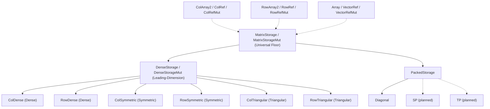

# Storage & Subprograms (Design Document)


---

### 1. Introduction

Numerical models and algorithms use generic dimensions (`Dim`) to check matrix
sizes at compile time. `src/math/storage.rs` binds `Dim` to physical memory,
giving each backend a buffer, shape, and addressing scheme (nalgebra, 2026a;
§4.1).
No shared trait bridges storage and subprograms: the statically sized nested
array (
`&[[T; LDA]; N]` and `&[T; N]`) is the compute ABI (§4.2), and numerical
models/algorithms (`Matrix`, `Polynomial`, decompositions, solvers) are the
single architectural boundary where storage layout is interpreted and bridged to
the compute kernels.

---

### 2. Requirements

- **FR-1 — Dimension-Bound Storage**: Storage backends bind compile-time
  dimensions ($R: \text{Dim}, C: \text{Dim}$) to physical memory.
- **FR-2 — Storage Provenance**: Distinguish owning stack buffers from borrowed
  read-only and mutable nested-array views.
- **FR-3 — Dedicated Row/Col Storage Types & Coordinate Resolution**: Storage
  backends provide distinct, dedicated type hierarchies for Column-Major and
  Row-Major ordering with leading-dimension ($LDA$) addressing and
  coordinate resolution (`get`, `get_mut`), which is branchless for dense
  storage types (`ColDense`, `RowDense`) but inherently branches for
  symmetric/triangular
  layouts to test `uplo()` and `diag()`.
- **FR-4 — Zero-Copy View Conversions**: Views implement standard
  `From<&'a Self>` and `From<&'a mut Self>` conversions from owning buffers.
  Converting a borrowed view to owned storage (`into_owned`) requires
  `T: Clone`.
- **FR-5 — Borrowed-Buffer Shape Provenance**: Safe constructors producing
  `Ref`/`RefMut` views take shapes from array types that prove the
  shape-to-length relationship (`[[T; R]; C]` or `[T; N]`), or from
  caller-supplied dimensions verified against an existing buffer.
- **FR-6 — Complete Model Kernel Coverage**: Subprogram signatures cover
  Level-1 (axpy, scal, dot, nrm2, iamax; Lawson et al., 1979), Level-2 (gemv,
  ger, symv, syr, syr2, trmv, trsv; Dongarra et al., 1988), and Level-3 (gemm,
  symm, syrk, syr2k, trmm, trsm; Dongarra et al., 1990) numerical kernels.
- **FR-7 — Statically Sized Nested-Array Operands**: Level-1 routines consume
  1-D arrays (`&[T; N]`). Level-2/3 matrix operands consume canonical
  column-major nested arrays (`&[[T; LDA]; N]`) parameterized with standard BLAS
  dimensions ($M, N, K$) and leading dimension $LDA$ (Dongarra et al., 1990;
  Netlib, 2026). Level-2 vector operands statically match matrix
  dimensions ($x: \&[T; N]$, $y: \&\text{mut } [T; M]$ for untransposed
  GEMV; $x: \&[T; M]$, $y: \&\text{mut } [T; N]$ for transposed GEMV). Row-major
  matrices execute via compile-time algebraic transposition without runtime
  layout flags.
- **FR-8 — Mandatory Inlining**: All subprogram default methods and entry points
  carry `#[inline(always)]` to ensure cross-crate optimization and zero call
  trampolines.
- **FR-9 — Iterator-Reduced Safe Owning Constructors**: Constructors (`zeros`,
  `ones`, `identity`, `from_element`, `from_fn`, `from_slice`, `from_iter`) live
  on owning storage types and reduce to the foundational
  `UninitBuffer::from_iterator_unchecked` primitive.
- **FR-10 — Fallible Sequence Ingestion**: Sequence-based constructors (
  `from_slice`, `from_iter`) validate input length against compile-time
  capacity ($R \cdot C$), returning `None` on length mismatch or premature
  exhaustion before initializing memory.
- **FR-11 — Packed Addressing Branch**: `PackedStorage` is the addressing
  branch for backends that store a subset of $(i, j)$ coordinates and expose an
  `IMPLICIT` value for the rest. `Diagonal` is the Phase-1 leaf; packed
  symmetric (`SP`) and packed triangular (`TP`) leaves are added on the same
  branch.
- **NFR-1 — `#![no_std]` Stack Allocation & Ingestion**: Storage operations
  execute without heap allocation; ingestion constructors populate stack arrays
  inline using `core::mem::MaybeUninit`.
- **NFR-2 — Compile-Time Verification**: Storage bounds and dimension
  constraints are enforced at compile time without compilation time bloat.
- **NFR-3 — Backend Flexibility**: Numerical models allow swapping linked BLAS
  backends without modifying callers.
- **NFR-4 — Zero-Panic-Path Release Codegen**: Monomorphized subprograms over
  compile-time array storage compile to 0 branches (for kernels without runtime
  topology choices; enums like `uplo`/`diag`/`trans`/`side` introduce layout
  branches unless passed as compile-time constants), 0 call trampolines, and 0
  panic paths under release optimization (`opt-level=3`).
- **NFR-5 — Zero-Cost View Creation**: View conversions (`From<&S>`) execute as
  zero-cost reference reborrows with zero allocation, zero copies, and zero
  runtime branches.
- **NFR-6 — Open-Source License Clearance**: FFI or external subprogram backends
  must undergo open-source license clearance (Apache-2.0, BSD-2-Clause,
  BSD-3-Clause) prior to adoption.
- **C-1 — Stack Budget Limit**: Array allocations must comply with Clippy
  `large_stack_arrays` limits.
- **C-2 — Storage Scope & Exclusions**: Storage models are constrained to dense
  and structured leading-dimension layouts plus the packed branch in FR-11.
  Non-contiguous block-partitioned and arbitrary sparse (CSR/CSC) formats are
  excluded. `SP`/`TP` are PackedStorage leaves added after Phase 1.
- **C-3 — Precondition-Enforced FFI Boundary**: Subprogram trait interfaces
  represent low-level execution boundaries; memory safety preconditions (
  $LDA \ge M$, $LDB \ge K$, $LDC \ge M$,
  $N = 0 \vee BUF_X \ge 1 + (N-1)\cdot INC_X$) conforming to CBLAS standards
  (Netlib, 2026) are enforced upstream by higher-level models.

---

### 3. Technical Overview

The storage trait hierarchy connects `Dim` to physical memory across two
addressing branches over a shared shape floor:



1. **Buffer (Tier 0)**: Unsafe traits `Buffer`/`BufferMut` separate ownership
   provenance (owning vs. borrowed) and nested layout (`ColArray2` =
   `[[T; R]; C]`, `RowArray2` = `[[T; C]; R]`, `Array` = `[T; N]`) from
   mathematical shape, mirroring decoupled storage patterns (nalgebra, 2026a).
   Raw pointer exposure is `unsafe`. `UninitBuffer` provides
   `from_iterator_unchecked` for safe owning constructors.
2. **MatrixStorage (Tier 1)**: Safe universal floor: `ROWS`, `COLS`, and
   `as_slice`. Named on `Matrix`/`Polynomial` so a backend may be
   leading-dimension
   or packed.
3. **Addressing (Tier 2)**: Mutually exclusive safe branches.
   `DenseStorage` adds `LDA` and reference lookup (`get`). `PackedStorage` adds
   `packed_index` and `IMPLICIT` (`Diagonal` now; `SP`/`TP` next).

Storage traits and subprograms share no common trait hierarchy: sized nested
arrays are the compute ABI across Level-1 (Lawson et al., 1979), Level-2
(Dongarra et al., 1988), and Level-3 (Dongarra et al., 1990) routines, and
numerical models/algorithms are the single boundary where layout is interpreted.

---

### 4. Architecture

#### 4.1 Storage

##### 4.1.1 Tiers & Buffer Model

```rust
/// # Safety: `as_slice()` is `len` initialized, contiguous `T`; `as_ptr()`
/// addresses that same run.
pub unsafe trait Buffer<T>: Sized {
    /// # Safety: pointer is valid for `as_slice().len()` reads of `T` for the
    /// lifetime of `&self`.
    unsafe fn as_ptr(&self) -> *const T;
    fn as_slice(&self) -> &[T];
}

pub unsafe trait BufferMut<T>: Buffer<T> {
    /// # Safety: pointer is valid for `as_mut_slice().len()` writes of `T` for
    /// the exclusive lifetime of `&mut self`.
    unsafe fn as_mut_ptr(&mut self) -> *mut T;
    fn as_mut_slice(&mut self) -> &mut [T];
}

/// # Safety: Must fully initialize capacity elements assuming `iter` produces sufficient items.
pub unsafe trait UninitBuffer<T>: BufferMut<T> {
    unsafe fn from_iterator_unchecked<I: IntoIterator<Item=T>>(iter: I) -> Self;
}
```

Nine buffer implementors provide physical storage: `ColArray2`/`ColRef`/
`ColRefMut` (`[[T; R]; C]`), `RowArray2`/`RowRef`/`RowRefMut` (`[[T; C]; R]`),
and `Array`/`VectorRef`/`VectorRefMut` (`[T; N]`), decoupling memory layout from
higher-level mathematical wrappers (nalgebra, 2026a). (`Array2`, `Ref`, and
`RefMut` are retained as transitional type aliases for `ColArray2`, `ColRef`,
and `ColRefMut` and will be retired following Phase 1 migration).

**Owning Constructors (FR-9, FR-10)**: Safe constructors exist exclusively on
owning types and reduce directly to `UninitBuffer::from_iterator_unchecked`:

- `from_element(val)`: Populates all elements with clones of `val` using
  `core::iter::repeat(val)` into `from_iterator_unchecked`. Requires
  `#[inline(always)]` and `T: Clone`.
- `zeros()`: Populates all elements with additive identity (`T::ZERO`) using
  `core::iter::repeat_with(|| T::ZERO)` into `from_iterator_unchecked`. Requires
  `#[inline(always)]` and `T: Zero`.
- `ones()`: Populates all elements with `T::ONE` via `from_element(T::ONE)`
  (`T: One + Clone`), 1-D and 2-D, including rectangular shapes.
- `identity()` (square 2-D `ColArray2`/`RowArray2`, `Diagonal`): Constructs
  $I$ with diagonal `T::ONE` and off-diagonal `T::ZERO` (`T: Zero + One`) via
  `from_fn(|r, c| if r == c { T::ONE } else { T::ZERO })`. Rectangular 2-D
  types do not implement `identity()`.
- `from_fn(f)`: Invokes `f` exactly `capacity` times in storage-major order
  and feeds the resulting iterator to `from_iterator_unchecked`.
- `from_slice(s)`: Validates `s.len() == capacity`, returning
  `Some(unsafe { from_iterator_unchecked(s.cloned()) })` or `None`.
- `from_iter(iter)`: Writes into `MaybeUninit` storage. Returns `None`
  without assuming initialization if the iterator yields fewer or more than
  `capacity` items; returns `Some` only when the count is exact, then
  `assume_init`.
- **Safety Proof**: Infinite iterators (`repeat`, `repeat_with`) cannot
  exhaust. `from_fn` yields exactly `capacity` items. `from_slice` /
  `from_iter` call `from_iterator_unchecked` only on the `Some` path after the
  length check.

**Submatrix Panels and Flattened Slicing (FR-5)**:

- `try_submatrix<const R2: usize, const C2: usize, const LDA: usize>()`: Safely
  constructs submatrix panel views verified at compile time by
  `const { assert!(LDA >= R2) }` (under column-major, `origin.0 == 0`) or
  `const { assert!(LDA >= C2) }` (under row-major, `origin.1 == 0`), returning
  `ColRef<'a, T, LDA, C2>` / `RowRef<'a, T, LDA, R2>` without array copying.
- `as_array<const LEN: usize>() -> &[T; LEN]`: Proves `LEN = R * C` at compile
  time via
  `Const<R>: DimMul<Const<C>, Output = <Const<LEN> as Dim>::PeanoTypeNum>`,
  eliminating unstable `generic_const_exprs`.
- `as_nested() -> &[[T; LDA]; C]` / `as_nested_mut() -> &mut [[T; LDA]; C]` (for
  column-major views/buffers like `ColArray2`, `ColRef`, `ColRefMut`), and
  `as_nested() -> &[[T; LDA]; R]` / `as_nested_mut() -> &mut [[T; LDA]; R]` (for
  row-major views/buffers like `RowArray2`, `RowRef`, `RowRefMut`): Zero-cost
  reference
  reinterpretation of the flat or nested memory layout as the static nested
  array
  compute ABI.

##### 4.1.2 MatrixStorage, DenseStorage, PackedStorage

`MatrixStorage` and both addressing branches are **safe** traits. They expose
slices and coordinate lookup, not raw pointers; pointer projection stays on
`Buffer`.

```rust
pub trait MatrixStorage<T, R: Dim, C: Dim>: Sized {
    const ROWS: R;
    const COLS: C;
    fn shape(&self) -> (R, C) { (Self::ROWS, Self::COLS) }
    fn as_slice(&self) -> &[T];
}

pub trait MatrixStorageMut<T, R: Dim, C: Dim>: MatrixStorage<T, R, C> {
    fn as_mut_slice(&mut self) -> &mut [T];
}

pub trait DenseStorage<T, R: Dim, C: Dim>: MatrixStorage<T, R, C> {
    type LDA: Dim;
    fn get(&self, i: usize, j: usize) -> Option<&T>;
    /// # Safety: `i < ROWS` and `j < COLS`.
    unsafe fn get_unchecked(&self, i: usize, j: usize) -> &T;
}

pub trait DenseStorageMut<T, R: Dim, C: Dim>: DenseStorage<T, R, C> + MatrixStorageMut<T, R, C> {
    fn get_mut(&mut self, i: usize, j: usize) -> Option<&mut T>;
    /// # Safety: `i < ROWS` and `j < COLS`.
    unsafe fn get_unchecked_mut(&mut self, i: usize, j: usize) -> &mut T;
}

pub trait PackedStorage<T, D: Dim>: MatrixStorage<T, D, D> {
    const IMPLICIT: T;
    fn packed_index(&self, i: usize, j: usize) -> Option<usize>;
    fn value(&self, i: usize, j: usize) -> Option<T> where
        T: Clone;
    /// # Safety: `i < D` and `j < D`.
    unsafe fn value_unchecked(&self, i: usize, j: usize) -> T where
        T: Clone;
}
```

`value` returns `T` rather than `&T` because `IMPLICIT` is not a stored cell.
`PackedStorageMut` is not in Phase 1; it is added with the `SP`/`TP` leaves
if packed entries need a typed in-place write.

##### 4.1.3 Storage Leaves, Aliases, and Coordinate Resolution

| Leaf Type                | Owning Alias               | Borrowed View Alias                  | Stored Buffer                          | Coordinate Resolution `(i, j)`                       |
|:-------------------------|:---------------------------|:-------------------------------------|:---------------------------------------|:-----------------------------------------------------|
| `ColDense<T, R, C, B>`   | `DenseColArray<T, R, C>`   | `DenseColRef<'a, T, R, C>`           | `ColArray2` / `ColRef` (`[[T; R]; C]`) | Column-major: `data[j][i]` (offset `j * LDA + i`)    |
| `RowDense<T, R, C, B>`   | `DenseRowArray<T, R, C>`   | `DenseRowRef<'a, T, R, C>`           | `RowArray2` / `RowRef` (`[[T; C]; R]`) | Row-major: `data[i][j]` (offset `i * LDA + j`)       |
| `ColSymmetric<T, N, B>`  | `SymmetricColArray<T, N>`  | `ColSymmetric<T, Const<N>, ColRef>`  | `ColArray2` / `ColRef` (`[[T; N]; N]`) | Transposes `(j, i)` if outside stored `uplo()`       |
| `RowSymmetric<T, N, B>`  | `SymmetricRowArray<T, N>`  | `RowSymmetric<T, Const<N>, RowRef>`  | `RowArray2` / `RowRef` (`[[T; N]; N]`) | Transposes `(j, i)` if outside stored `uplo()`       |
| `ColTriangular<T, N, B>` | `TriangularColArray<T, N>` | `ColTriangular<T, Const<N>, ColRef>` | `ColArray2` / `ColRef` (`[[T; N]; N]`) | Reads stored `uplo()`; unit diag if `diag() == Unit` |
| `RowTriangular<T, N, B>` | `TriangularRowArray<T, N>` | `RowTriangular<T, Const<N>, RowRef>` | `RowArray2` / `RowRef` (`[[T; N]; N]`) | Reads stored `uplo()`; unit diag if `diag() == Unit` |

`DenseVectorArray<T, N>` is a convenience alias for
`ColDense<T, Const<N>, U1, Array<T, N>>` providing 1-D vector indexing (
`data[i]`). `DenseArray`, `DenseRef`, `SymmetricArray`, and `TriangularArray`
alias column-major types by default. Views implement `From<&'a Self>` and
`From<&'a mut Self>`; `.into_owned()` requires `T: Clone`.

##### 4.1.4 Packed Leaves (FR-11)

`Diagonal` is the Phase-1 `PackedStorage` leaf. Packed symmetric (`SP`) and
packed triangular (`TP`) leaves are added on this branch; they are not
Phase 1 deliverables.

```rust
pub struct Diagonal<T, const N: usize, B = Array<T, N>> {
    pub data: B
}
impl<T: One, const N: usize> Diagonal<T, N, Array<T, N>> {
    pub fn identity() -> Self { Self { data: Array::from_element(T::ONE) } }
}
impl<T: Zero + Clone, const N: usize, B: Buffer<T>> PackedStorage<T, Const<N>>
for Diagonal<T, N, B>
{
    const IMPLICIT: T = T::ZERO;
    fn packed_index(&self, i: usize, j: usize) -> Option<usize> {
        if i == j && i < N { Some(i) } else { None }
    }
    fn value(&self, i: usize, j: usize) -> Option<T> {
        if i >= N || j >= N { None } else if i == j { Some(self.data.as_slice()[i].clone()) } else { Some(Self::IMPLICIT) }
    }
    unsafe fn value_unchecked(&self, i: usize, j: usize) -> T { /* value without bounds */ }
}
impl<T, const N: usize, B: Buffer<T>> Diagonal<T, N, B> {
    pub fn diag(&self) -> &[T] { self.data.as_slice() }
    pub fn into_matrix(self) -> DenseColArray<T, N, N> where
        B: Into<Array<T, N>>
    { /* expand */ }
}
```

---

#### 4.2 Subprograms

##### 4.2.1 Level 1 & Level 2 Subprograms

Level 1 routines mirror standard vector BLAS operations (Lawson et al., 1979),
while Level 2 routines implement matrix-vector operations with CBLAS-compatible
argument layouts (Dongarra et al., 1988; Netlib, 2026). In particular,
triangular
solve (`TRSV`) follows the unblocked substitution kernel structure from
reference
LAPACK (Reference LAPACK, 2026a).

| Trait                                                                                                                             | Method Signature                                                                                                                                                  | CBLAS Analogue                |
|:----------------------------------------------------------------------------------------------------------------------------------|:------------------------------------------------------------------------------------------------------------------------------------------------------------------|:------------------------------|
| `level1::AXPY<T, const N: usize, const INC_X: usize = 1, const INC_Y: usize = 1, const BUF_X: usize = N, const BUF_Y: usize = N>` | `fn axpy(a: T, x: &[T; BUF_X], y: &mut [T; BUF_Y])`                                                                                                               | `cblas_saxpy`/`cblas_daxpy`   |
| `level1::SCAL<T, const N: usize, const INC_X: usize = 1, const BUF_X: usize = N>`                                                 | `fn scal(a: T, x: &mut [T; BUF_X])`                                                                                                                               | `cblas_sscal`/`cblas_dscal`   |
| `level1::DOT<T, const N: usize, const INC_X: usize = 1, const INC_Y: usize = 1, const BUF_X: usize = N, const BUF_Y: usize = N>`  | `fn dot(x: &[T; BUF_X], y: &[T; BUF_Y]) -> T`                                                                                                                     | `cblas_sdot`/`cblas_ddot`     |
| `level1::NRM2<T, const N: usize, const INC_X: usize = 1, const BUF_X: usize = N>`                                                 | `fn nrm2(x: &[T; BUF_X]) -> T`                                                                                                                                    | `cblas_snrm2`/`cblas_dnrm2`   |
| `level1::IAMAX<T, const N: usize, const INC_X: usize = 1, const BUF_X: usize = N>`                                                | `fn iamax(x: &[T; BUF_X]) -> usize`                                                                                                                               | `cblas_isamax`/`cblas_idamax` |
| `level2::GEMV<T, const M: usize, const N: usize, const LDA: usize = M>`                                                           | `fn gemv(alpha: T, a: &[[T; LDA]; N], x: &[T; N], beta: T, y: &mut [T; M])`<br/>`fn gemv_trans(alpha: T, a: &[[T; LDA]; N], x: &[T; M], beta: T, y: &mut [T; N])` | `cblas_sgemv`/`cblas_dgemv`   |
| `level2::GER<T, const M: usize, const N: usize, const LDA: usize = M>`                                                            | `fn ger(alpha: T, x: &[T; M], y: &[T; N], a: &mut [[T; LDA]; N])`                                                                                                 | `cblas_sger`/`cblas_dger`     |
| `level2::SYMV<T, const N: usize, const LDA: usize = N>`                                                                           | `fn symv(alpha: T, a: &[[T; LDA]; N], x: &[T; N], beta: T, y: &mut [T; N], uplo: Triangle)`                                                                       | `cblas_ssymv`/`cblas_dsymv`   |
| `level2::SYR<T, const N: usize, const LDA: usize = N>`                                                                            | `fn syr(alpha: T, x: &[T; N], a: &mut [[T; LDA]; N], uplo: Triangle)`                                                                                             | `cblas_ssyr`/`cblas_dsyr`     |
| `level2::SYR2<T, const N: usize, const LDA: usize = N>`                                                                           | `fn syr2(alpha: T, x: &[T; N], y: &[T; N], a: &mut [[T; LDA]; N], uplo: Triangle)`                                                                                | `cblas_ssyr2`/`cblas_dsyr2`   |
| `level2::TRMV<T, const N: usize, const LDA: usize = N>`                                                                           | `fn trmv(a: &[[T; LDA]; N], x: &mut [T; N], uplo: Triangle, diag: Diag, trans: Transpose)`                                                                        | `cblas_strmv`/`cblas_dtrmv`   |
| `level2::TRSV<T, const N: usize, const LDA: usize = N>`                                                                           | `fn trsv(a: &[[T; LDA]; N], x: &mut [T; N], uplo: Triangle, diag: Diag, trans: Transpose)`                                                                        | `cblas_strsv`/`cblas_dtrsv`   |

##### 4.2.2 Level 3 Subprograms & Operand Contract

Level 3 routines provide matrix-matrix subprograms parameterized with standard
BLAS dimensions ($M, N, K$) and operand leading dimensions (Dongarra et al.,
1990;
Netlib, 2026).

| Trait & Method Signature                                                                                                                                                                                                                                                                                                                                                                                                                                                                                                                                             | CBLAS Analogue                  |
|:---------------------------------------------------------------------------------------------------------------------------------------------------------------------------------------------------------------------------------------------------------------------------------------------------------------------------------------------------------------------------------------------------------------------------------------------------------------------------------------------------------------------------------------------------------------------|:--------------------------------|
| **GEMM**<br>`level3::GEMM<T, const M: usize, const N: usize, const K: usize, const LDA: usize = M, const LDB: usize = K, const LDC: usize = M>`<br>• `fn gemm(alpha: T, a: &[[T; LDA]; K], b: &[[T; LDB]; N], beta: T, c: &mut [[T; LDC]; N])`<br>• `fn gemm_trans_a(alpha: T, a: &[[T; LDA]; M], b: &[[T; LDB]; N], beta: T, c: &mut [[T; LDC]; N])`<br>• `fn gemm_trans_b(alpha: T, a: &[[T; LDA]; K], b: &[[T; LDB]; K], beta: T, c: &mut [[T; LDC]; N])`<br>• `fn gemm_trans_ab(alpha: T, a: &[[T; LDA]; M], b: &[[T; LDB]; K], beta: T, c: &mut [[T; LDC]; N])` | `cblas_sgemm` / `cblas_dgemm`   |
| **SYMM**<br>`level3::SYMM<T, const M: usize, const N: usize, const LDA: usize = M, const LDB: usize = M, const LDC: usize = M>`<br>• `fn symm_left(alpha: T, a: &[[T; LDA]; M], b: &[[T; LDB]; N], beta: T, c: &mut [[T; LDC]; N], uplo: Triangle)`<br>• `fn symm_right(alpha: T, a: &[[T; LDA]; N], b: &[[T; LDB]; N], beta: T, c: &mut [[T; LDC]; N], uplo: Triangle)`                                                                                                                                                                                             | `cblas_ssymm` / `cblas_dsymm`   |
| **SYRK**<br>`level3::SYRK<T, const N: usize, const K: usize, const LDA: usize = N, const LDC: usize = N>`<br>• `fn syrk(alpha: T, a: &[[T; LDA]; K], beta: T, c: &mut [[T; LDC]; N], uplo: Triangle)`<br>• `fn syrk_trans(alpha: T, a: &[[T; LDA]; N], beta: T, c: &mut [[T; LDC]; N], uplo: Triangle)`                                                                                                                                                                                                                                                              | `cblas_ssyrk` / `cblas_dsyrk`   |
| **SYR2K**<br>`level3::SYR2K<T, const N: usize, const K: usize, const LDA: usize = N, const LDB: usize = N, const LDC: usize = N>`<br>• `fn syr2k(alpha: T, a: &[[T; LDA]; K], b: &[[T; LDB]; K], beta: T, c: &mut [[T; LDC]; N], uplo: Triangle)`<br>• `fn syr2k_trans(alpha: T, a: &[[T; LDA]; N], b: &[[T; LDB]; N], beta: T, c: &mut [[T; LDC]; N], uplo: Triangle)`                                                                                                                                                                                              | `cblas_ssyr2k` / `cblas_dsyr2k` |
| **TRMM**<br>`level3::TRMM<T, const M: usize, const N: usize, const LDA: usize = M, const LDB: usize = M>`<br>• `fn trmm_left(alpha: T, a: &[[T; LDA]; M], b: &mut [[T; LDB]; N], uplo: Triangle, diag: Diag, trans: Transpose)`<br>• `fn trmm_right(alpha: T, a: &[[T; LDA]; N], b: &mut [[T; LDB]; N], uplo: Triangle, diag: Diag, trans: Transpose)`                                                                                                                                                                                                               | `cblas_strmm` / `cblas_dtrmm`   |
| **TRSM**<br>`level3::TRSM<T, const M: usize, const N: usize, const LDA: usize = M, const LDB: usize = M>`<br>• `fn trsm_left(alpha: T, a: &[[T; LDA]; M], b: &mut [[T; LDB]; N], uplo: Triangle, diag: Diag, trans: Transpose)`<br>• `fn trsm_right(alpha: T, a: &[[T; LDA]; N], b: &mut [[T; LDB]; N], uplo: Triangle, diag: Diag, trans: Transpose)`                                                                                                                                                                                                               | `cblas_strsm` / `cblas_dtrsm`   |

- **Column-Major ABI**: Matrix operands are canonical column-major nested arrays
  `&[[T; LDA]; N]` with outer dimension $N$ and leading dimension $LDA \ge M$.
- **Compile-Time Algebraic Row-Major Mapping**: Row-major matrices (
  `RowArray2<T, M, N>`, stored as `[[T; N]; M]`) execute BLAS routines with 0
  runtime branches by reinterpreting their memory as Column-Major $N \times M$
  buffers:
    - Row-Major GEMV ($y = A_{row} x$): Dispatches to
      `gemv_trans(alpha, B, x, beta, y)` ($y_i = \sum_{j=1}^N A_{i,j} x_j = (B^T x)_i$).
    - Row-Major GEMM ($C_{row} = A_{row} B_{row}$): Dispatches via transpose
      equivalence $C^T_{col} = B^T_{col} A^T_{col}$.
- **Statically Proved Dimensions**: Vector operands enforce exact
  dimensions ($x: \&[T; N]$, $y: \&\text{mut } [T; M]$ for untransposed
  GEMV; $x: \&[T; M]$, $y: \&\text{mut } [T; N]$ for transposed GEMV).
  Mismatches fail to type-check.
- **IAMAX Indexing**: `iamax` returns the **0-based** index of the first
  maximum-magnitude element. $N = 0$ returns `0`. CBLAS `i*amax` is 1-based;
  FFI backends convert with saturating subtract-one.
- **Flattened Access**: `as_array<const LEN: usize>() -> &[T; LEN]` binds `LEN`
  via trait solver bounds (
  `Const<R>: DimMul<Const<C>, Output = <Const<LEN> as Dim>::PeanoTypeNum>`),
  eliminating `generic_const_exprs`.

---

### 5. Alternatives

| Alternative                                          | Rejected Because                                                                                                                       | Reference                                      |
|:-----------------------------------------------------|:---------------------------------------------------------------------------------------------------------------------------------------|:-----------------------------------------------|
| Generic storage parameters on subprograms (`S::arg`) | Re-introduces GATs on storage, creates combinatorial impl explosion ($12^3$ for GEMM), causes flash bloat, and breaks FFI transparency | §3, §4.2                                       |
| Runtime `order: MatrixLayout` in kernel signatures   | Reintroduces runtime matching branches; contradicts compile-time layout safety in `ColDense`/`RowDense`                                | §4.2.2                                         |
| GAT-based storage projections (`View<'a>`)           | Introduces complex associated type lifetime machinery; standard `From<&Self>` provides zero-cost views                                 | (nalgebra, 2026a; §4.1.1)                      |
| Inherent `Diagonal` without `PackedStorage`          | Does not scale to packed `SP`/`TP` leaves; `Matrix` needs a packed addressing bound distinct from `LDA`                                | §4.1.2, §4.1.4                                 |
| Layout generic parameter on single `Dense` struct    | Introduces generic clutter (`Dense<T, R, C, B, L>`); separate types (`ColDense`/`RowDense`) maintain clean arity                       | §4.1.3                                         |
| Flattened `as_array() -> &[T; R * C]`                | `R * C` in return type position requires unstable `generic_const_exprs`; solved via `DimMul` trait bounds                              | §4.1.1, §4.2.2                                 |
| Unchecked `Ref::from_raw(ptr, len)` + caller `Dim`   | Unsoundly pushes shape/length proof onto callers; violates safety invariants (FR-5)                                                    | §4.1.1                                         |
| Single shared `ld` parameter across GEMM operands    | Prevents operating on submatrices with distinct strides (`A`, `B`, `C` independent panels)                                             | (Dongarra et al., 1990; Dongarra et al., 1988) |
| Raw pointers on storage traits                       | Pointer exposure is an `unsafe` `Buffer` operation; slice/`get` keep `MatrixStorage` and `DenseStorage` safe traits                    | §4.1.1, §4.1.2                                 |

---

### 6. Verification & Validation

#### 6.1 Backend-Conformance Tool

A verification test tool compares candidate backends against reference naive
markers within a fixed tolerance across:

- 0- and 1-element vectors, and non-square `GEMV`/`GEMM`/`GER` operands.
- Both `Triangle` (`uplo`), `Diag` (`diag`), and `Side` (`side`) variants for
  structured routines.
- `INC_X`/`INC_Y` instantiated at 1 and at $D$ for Level-1 routines, with
  `BUF_X`/`BUF_Y` satisfying the extent bound; `iamax` returns a 0-based index
  matching the first maximum-magnitude element (including the $N = 0$ → `0`
  case).
- `LDA` instantiated at $M$ and at inflated values ($LDA > M$) for Level-2/3
  routines (asserting elements outside $M \times N$ are untouched), including
  column panels (`try_submatrix` with `origin.0 == 0`, where panel $LDA$ equals
  parent row count $R$, which is $\ge R_2$).
- `PackedStorage::value` / `packed_index` on `Diagonal` (in-bounds unstored
  coordinates read `IMPLICIT`) and `.into_matrix()` expansion.
- Coordinate queries (`get`, `get_mut`) on all `DenseStorage` leaves (
  `ColDense`, `RowDense`, `ColSymmetric`, `RowSymmetric`, `ColTriangular`,
  `RowTriangular`).
- View conversions (`From<&Self>`, `From<&mut Self>`) and `.into_owned()` (
  `T: Clone`).
- Owning constructor reduction to `from_iterator_unchecked` and sequence
  validation (`from_slice`, `from_iter`); `ones()` is all-`T::ONE`,
  `identity()` is $I$ on square types only.

#### 6.2 Validation

The conformance tool must be invoked from an example in
`examples/<target>/src/<board>.rs` to validate pure-Rust numerical results
against hardware-accelerated target backends such as CMSIS-DSP (Arm Software,
2026).

---

### 7. Performance & Resource Considerations

#### 7.1 Codegen Benchmark Evidence (`blas-interface`)

Disassembly measurement across target ISAs (`x86_64-apple-darwin`,
`thumbv7em-none-eabihf`, `riscv32imac-unknown-none-elf`) under `opt-level=3` (
LLVM 22.1.6):

| Variant                  | Strategy                                      |   Instructions   | Branches + Calls | Panic Paths |
|:-------------------------|:----------------------------------------------|:----------------:|:----------------:|:-----------:|
| **A** (`gemv_dyn`)       | Runtime fields, slice indexing                |       123        |        23        |      7      |
| **B** (`gemv_const_4`)   | Assoc consts, slice indexing                  |       166        |        35        |     21      |
| **C** (`gemv_arr_4`)     | **Assoc consts, `[f32; 16]` array indexing**  | **28** (Optimal) |      **0**       |    **0**    |
| **D** (`gemv_ptr_4`)     | Assoc consts, raw pointer `.add()`            |        59        |        0         |      0      |
| **E** (`gemv_ptr_ab_4`)  | Assoc consts, raw pointer, full matvec        |        73        |        0         |      0      |
| **G** (`gemv_checked_4`) | Assoc consts, explicit `if` + `get_unchecked` |       101        |        13        |      8      |

* **Bounds-Checked Indexing Overhead**: An indexed accessor's bounds check is
  not eliminated by LLVM even when a caller proves it redundant; fixed array
  indexing (`&[T; N]`, Variant C) allows induction-variable range-check
  elimination. Kernels and hot-path inner loops access memory directly via
  `as_nested()` / `as_array()`, never through `get()`.
* **Mandatory Inlining (FR-8)**: Subprogram methods require `#[inline(always)]`
  to eliminate call trampolines across crates.
* **C-Call Boundary Cost**: Crossing into a C backend is not inherently slower
  than Rust; an `extern "C"` GEMV conforming to the CBLAS interface (Netlib,
    2026)
  measured at `opt-level=3` ran at ~0.72× the call cost of bounds-checked Rust (
  `examples/experiments/blas-interface/c_call_cost`).

---

### 8. Risks & Open Questions

- **Non-sliceable backends locked out**: `as_slice()` is mandatory on
  `MatrixStorage`. Register-mapped or DMA backends without contiguous
  addressable buffers cannot implement the floor.
- **RISC-V32IMAC HIL verification gap**: RISC-V32IMAC lacks physical HIL
  hardware; verification ceiling is QEMU cycle-accuracy.
- **Column-panel `try_submatrix` restriction**: Safe submatrix extraction is
  restricted to column panels (`origin.0 == 0`, where panel $LDA$ equals parent
  row count $R$, which is $\ge R_2$) over nested `&[[T; LDA]; C2]`; general 2-D
  strided views remain out of scope.
- **Precondition safety contract**: Const generic preconditions ($LDA \ge M$,
  Level-1 `BUF_*` extent) are enforced upstream by higher-level models (C-3).
- **No mutable packed path in Phase 1**: `PackedStorageMut` ships with `SP`/
  `TP`; until then a `Diagonal`-backed matrix has no typed in-place write.

| Deferred Risk                          | Impact                                                                            | Resolution                                              |
|:---------------------------------------|:----------------------------------------------------------------------------------|:--------------------------------------------------------|
| `SP`/`TP` packed leaves                | Packed triangle storage and packed BLAS (`*sp*`/`*tp*`)                           | Add as `PackedStorage` leaves after Phase 1             |
| `BlockStorage` evidence base           | Block-partitioned container lacks cited BLAS precedent                            | Follow-up research pass before implementation           |
| `SYRK`/`TRSM` consumers in `matrix`    | Evidenced via LAPACK blocked Cholesky (`DPOTRF2`) (Reference LAPACK, 2026b)       | Integrated if blocked matrix algorithms are introduced  |
| Stride parameter signedness convention | CBLAS `incX` is signed `int` (Netlib, 2026); trait `INC_X: usize` is forward-only | Verify FFI bridging when external C backends are linked |
| Per-backend license review & CI cycles | Formal open-source license clearance (NFR-6) unexecuted                           | Deferred until specific backends are integrated         |

---

### 9. Development Plan

| Phase                                             | Description                                                                                                               | Effort |
|:--------------------------------------------------|:--------------------------------------------------------------------------------------------------------------------------|:------:|
| **Phase 1: Storage Tiers & Packed Diagonal**      | Migrate `src/math/storage.rs` to `Buffer`/`MatrixStorage`/`DenseStorage`/`PackedStorage` with the `Diagonal` leaf (§4.1). |   L    |
| **Phase 2: Operand Contract & Proposed Routines** | Implement subprograms against nested `&[[T; LDA]; N]` and 1-D `&[T; N]` arrays (§4.2).                                    |   L    |
| **Phase 3: Target-Specific HIL Wiring**           | Extend control-rs-hil to run the conformance tool per target (Cortex-M7, RISC-V32IMAC).                                   |   M    |
| **Phase 4: Cycle-Count Instrumentation**          | DWT-based recording for Cortex-M7; reserve `BENCH_XLEN_MODE` for RISC-V32IMAC.                                            |   S    |
| **Phase 5: CI Integration & Docs**                | Wire into `cargo qemu-ci`/`cargo teensy-ci`; document backend integration.                                                |   S    |

---

## References

[1] dimforge, "src/base/storage.rs," in *dimforge/nalgebra*. [Online].
Available: https://raw.githubusercontent.com/dimforge/nalgebra/main/src/base/storage.rs.
Accessed: Aug. 6, 2026.
[2] C. L. Lawson, R. J. Hanson, D. R. Kincaid, and F. T. Krogh, "Basic Linear
Algebra Subprograms for Fortran Usage," *ACM Trans. Math. Softw.*, vol. 5,
no. 3, pp. 308–323, Sep. 1979, doi: 10.1145/355841.355847.
[3] J. J. Dongarra, J. Du Croz, S. Hammarling, and R. J. Hanson, "An Extended
Set of FORTRAN Basic Linear Algebra Subprograms," *ACM Trans. Math.
Softw.*, vol. 14, no. 1, pp. 1–17, Mar. 1988, doi: 10.1145/42288.42291.
[4] J. J. Dongarra, J. Du Croz, I. S. Duff, and S. Hammarling, "A Set of
Level 3 Basic Linear Algebra Subprograms," *ACM Trans. Math. Softw.*,
vol. 16, no. 1, pp. 1–17, Mar. 1990, doi: 10.1145/77626.79170.
[5] Netlib, "cblas.h," *netlib.org*. [Online]. Available:
https://www.netlib.org/blas/cblas.h. Accessed: Aug. 11, 2026.
[6] Reference LAPACK, "BLAS/SRC/dtrsv.f," in *Reference-LAPACK/lapack*.
[Online]. Available:
https://raw.githubusercontent.com/Reference-LAPACK/lapack/master/BLAS/SRC/dtrsv.f.
Accessed: Aug. 11, 2026.
[7] Arm Software, "CMSIS-DSP: Overview," *arm-software.github.io*. [Online].
Available: https://arm-software.github.io/CMSIS-DSP/main/. Accessed:
Aug. 11, 2026.
[8] Reference LAPACK, "SRC/dpotrf2.f," in *Reference-LAPACK/lapack*.
[Online]. Available:
https://raw.githubusercontent.com/Reference-LAPACK/lapack/master/SRC/dpotrf2.f.
Accessed: Aug. 11, 2026.

---

### 10. Revision History

| Revision | Date            | Author          | Description                                                                                                                                                                                                                                        |
|:---------|:----------------|:----------------|:---------------------------------------------------------------------------------------------------------------------------------------------------------------------------------------------------------------------------------------------------|
| 1.0      | August 14, 2026 | @mitchelldscott | Initial merge of `storage-trait-design.md` and `subprograms-design.md`.                                                                                                                                                                            |
| 1.30     | August 20, 2026 | @mitchelldscott | Condensed design document; standardized on canonical BLAS $(M, N, K)$                                                                                                                                                                              |
| 1.31     | August 20, 2026 | @mitchelldscott | Restored `PackedStorage` (`Diagonal` now; `SP`/`TP` next); unsafe `Buffer` pointers; safe `MatrixStorage`/`DenseStorage`; `ones`/`from_iter`/`BUF_X`/`iamax` fixes; renamed `BlasStorage` -> `MatrixStorage` and `MatrixStorage` -> `DenseStorage` |
| 1.32     | August 20, 2026 | @mitchelldscott | Grounded substantive claims with author-year inline citations; resolved all 8 entries in IEEE `## References` list; aligned `storage-subprograms.bib`                                                                                              |
| 1.33     | August 20, 2026 | @mitchelldscott | Split Level-3 subprogram entry points to resolve compilation issue with nested-array ABI and runtime Transpose/Side                                                                                                                                |
