# Linear Algebra Subprograms (Design Document)


---

### 1. Introduction

Embedded control systems require deterministic, high-performance linear algebra
without dynamic heap allocation (rust-embedded, 2026a).
`src/math/subprograms.rs` defines canonical execution traits mirroring Level
1, 2, and 3 Basic Linear Algebra Subprograms (BLAS) (Lawson et al., 1979;
Dongarra et al., 1988; Dongarra et al., 1990), Sparse BLAS (SpBLAS) (Lawson et
al., 1979; sparsemat, 2026a, 2026b; SciPy Developers, 2026), and LAPACK direct
factorizations, solvers, and spectral decompositions (Anderson et al., 1999;
Reference LAPACK, 2026b).

Subprograms support **primitive integers** (`u8`–`u64`, `i8`–`i64`),
**fixed-point numbers** (`fixed-num`), **floats** (`f32`, `f64`), and **complex
scalars** (`Complex<T>`). Dispatch occurs via associated functions on zero-sized
backend structs (`B::gemv(...)`), fixing the backend at compile time. `src/`
ships a single implementor, `DefaultBlas`. Accelerated backends attach from
outside the crate by implementing the same traits on a local marker type.
Reference implementors for ARM CMSIS-DSP, RISC-V NMSIS-DSP and host SIMD
libraries are provided under `examples/subprograms/` for reuse or reference,
not linked into `src/` (§4.5) (Arm Software, 2026; Arm Limited, 2022; Nuclei
Software, 2026a).

> [!NOTE]
> **Backend Type Support & Compile-Time Enforcement**: Subprogram traits must
> only be implemented by a backend for the scalar types and layouts that the
> backend natively supports. `DefaultBlas` implements ring kernels for
> `T: Scalar` (integers, floats, `Complex<T>` with `T: Neg`, later
> `Quantized`) and field kernels for `T: Scalar + Div` with
> `T::Real: Radical` / `Trig` as required. `T: Float` is `f32` / `f64` only
> and is not a stand-in for `Complex<T>` (`num-traits-design.md` FR-5).
> The example backends (`CmsisDspBlas`, `NmsisDspBlas`) implement traits only
> for hardware-supported types (e.g. `f32`, `Complex32`, `q31`, `q15`).
> Invoking unsupported types fails to compile (`error[E0277]`).

---

### 2. Requirements

#### 2.1 Functional Requirements

- **FR-1 — Dense Level 1 BLAS**: Bounded over `DenseStorage<T>` (read) and
  `DenseStorageMut<T>` (in-place mutation):
  `Axpy` ($y \leftarrow \alpha x + y$),
  `Scal` ($x \leftarrow \alpha x$),
  `RealScal` ($x \leftarrow \alpha_{\mathbb{R}} x$), `Dotu` ($x^T y$),
  `Dotc` ($x^H y$),
  `Asum` ($\sum |\text{Re}| + |\text{Im}|$),
  `Iamax` ($\arg\max |\text{Re}| + |\text{Im}|$),
  `Swap`, `Nrm2` ($\|x\|_2$), and `Rot` (plane Givens rotation) (Lawson et al.,
  1979; Netlib, 2026).
- **FR-2 — Dense Level 2 BLAS**: Bounded over `DenseStorage<T>` (matrices and
  vectors)
  and `DenseStorageMut<T>` (mutated outputs):
  `Gemv` ($y \leftarrow \alpha \text{op}(A) x + \beta y$),
  `Geru` ($A \leftarrow \alpha x y^T + A$),
  `Gerc` ($A \leftarrow \alpha x y^H + A$),
  `Symv` ($y \leftarrow \alpha A_{\text{sym}} x + \beta y$),
  `Hemv` ($y \leftarrow \alpha A_{\text{herm}} x + \beta y$),
  `Syr`/`Syr2`, `Her`/`Her2`, `Trmv` ($x \leftarrow \text{op}(A) x$), and `Trsv`
  ($x \leftarrow \text{op}(A)^{-1} x$) (Dongarra et al., 1988; Netlib, 2026;
  Reference LAPACK, 2026a).
- **FR-3 — Packed Level 2 BLAS**: Bounded over `PackedStorage<T>` /
  `PackedStorageMut<T>`
  and vector `DenseStorage<T>` / `DenseStorageMut<T>` operands:
  `Spmv` (packed symmetric), `Hpmv` (packed Hermitian),
  `Spr`/`Spr2`, `Hpr`/`Hpr2`, `Tpmv`, and `Tpsv` (Dongarra et al., 1988;
  Anderson et al., 1999; Netlib, 2026).
- **FR-4 — Dense Level 3 BLAS**: Bounded over `DenseStorage<T>` and
  `DenseStorageMut<T>`:
  `Gemm` ($C \leftarrow \alpha \text{op}(A)\text{op}(B) + \beta C$),
  `Symm`, `Hemm`, `Syrk`/`Syr2k`,
  `Herk` ($C \leftarrow \alpha A A^H + \beta C$), `Her2k`,
  `Trmm`, and `Trsm` ($B \leftarrow \alpha \text{op}(A)^{-1} B$) (Dongarra et
  al., 1990; Netlib, 2026).
- **FR-5 — Sparse BLAS (SpBLAS)**: Bounded over `CsrStorage<T>` /
  `CscStorage<T>` /
  `SparseVectorStorage<T>` and dense operands `DenseStorage<T>` /
  `DenseStorageMut<T>`:
  `Csrmv`, `Cscmv`, `Csrmm`, `SpDotu` ($x_{\text{sp}}^T y$),
  `SpDotc` ($x_{\text{sp}}^H y$),
  and `SpAxpy` ($y \leftarrow \alpha x_{\text{sp}} + y$) (Lawson et al., 1979;
  sparsemat, 2026a, 2026b; SciPy Developers, 2026; Eigen, 2026c).
- **FR-6 — Direct LAPACK Factorizations**: Bounded over `DenseStorageMut<T>` and
  `PackedStorageMut<T>`: Cholesky `Potrf` ($A = L L^T$ / $L L^H$) / `Pptrf`,
  Householder QR `Geqrf` ($A = Q R$), and LU with partial pivoting
  `Getrf` ($P A = L U$)
  (Anderson et al., 1999; Reference LAPACK, 2026b).
- **FR-7 — Direct LAPACK System Solvers**: `Potrs` / `Pptrs`, `Getrs`, and
  orthogonal/unitary application `Ormqr` /
  `Unmqr` ($C \leftarrow \text{op}(Q) C$)
  (Anderson et al., 1999; Reference LAPACK, 2026a).
- **FR-8 — Eigendecomposition**: Real symmetric `Syev` ($A = V \Lambda V^T$) and
  complex Hermitian `Heev` ($A = U \Lambda U^H$) via Jacobi rotations on MCU
  stack
  (Anderson et al., 1999). Both are iterative and therefore bounded by a Jacobi
  sweep budget; exhausting it returns `Err(LinAlgError::MaxIterationsReached)`
  rather than looping. The budget is part of the operation contract (§4.3), not
  an implementation detail.
- **FR-11 — Pure-Rust Reference Backend**: `DefaultBlas` provides `#![no_std]`
  reference
  implementation for integers, fixed-points, floats, and complex numbers (
  rust-embedded, 2026a;
  Lawson et al., 1979; Dongarra et al., 1988, 1990).

FR-1–FR-7 remain one FR per BLAS/LAPACK level. Each named operation maps to a
§6 oracle in the per-operation table in §6.1.

#### 2.2 Non-Functional Requirements

- **NFR-1 — `#![no_std]` Execution**: Zero heap allocation; stack-allocated
  workspaces (rust-embedded, 2026a). The requirement governs linkage and state,
  not allocation alone. Three sub-clauses, each independently checkable:
    - **NFR-1a — No `std` linkage under `src/`**: no `extern crate std` on any
      `cfg`, including `cfg(test)`. *Assumption to verify*: the host test
      harness
      links without the library itself naming `std`, so `cfg(test)` needs no
      exemption. `src/` carries no `extern crate std`; confirm with
      `cargo test --lib` before the clause is enforced.
    - **NFR-1b — No mutable global state**: no `static mut`, no interior-mutable
      `static` (`AtomicUsize`, `Cell`, `thread_local!`) reachable from kernel
      code. Kernel results are a function of arguments alone, which is what
      makes
      a bit-for-bit ETS oracle meaningful (§6.1.2).
    - **NFR-1c — No `cfg`-conditional public API**: a symbol present in the host
      build and absent in a bare-metal build means the verified binary is not
      the
      deployed binary.

  Allocation-only wording does not imply NFR-1a–NFR-1c: `thread_local!` and
  `AtomicUsize` allocate nothing yet violate both NFR-1a and NFR-1b. The
  sub-clauses are stated so the gate can reject them (§5).
- **NFR-2 — Compile-Time Verification**: High-level matrix containers enforce
  dimensions statically.
- **NFR-3 — Zero-Branch Release Codegen**: Monomorphized kernels over
  `ArrayStorage` compile to
  **0 branches** and **0 panic paths** at `opt-level=3`. Subprogram methods
  are marked `#[inline(always)]` (sarah-quinones, 2026b).

#### 2.3 Constraints

- **C-1 — Precondition Boundary**: Kernels assume valid operand dimensions
  proven by caller (Netlib, 2026).
- **C-2 — Parameterized Operation Flags**: Transposition and
  conjugate-transposition
  dispatch conforms to the CBLAS parameter convention
  (`trans` / `uplo` / `diag` / `side`) (Netlib, 2026; Anderson et al., 1999).
- **C-3 — NaN-Safe Beta Scaling**: When $\beta = 0$, destination memory is
  safely overwritten without
  reading uninitialized $y$ / $C$ (Dongarra et al., 1988, 1990; Netlib, 2026).
  The zeroing loop covers every dest entry the kernel will write (matrix
  row count for `Csrmv`/`Cscmv`/`Gemv`), not `y.rows()` alone when $y$ is a
  row vector.
- **C-4 — No External Library Under `src/`**: `src/` declares the trait
  surface and `DefaultBlas` only. No C or Fortran library is vendored,
  linked or feature-gated inside the crate, and no backend marker is
  admitted under a `cfg` (NFR-1c). Accelerated backends are out of scope for
  `src/` and attach from outside it (§4.5).

---

### 3. Technical Overview

The linear algebra subprogram framework is organized into three decoupled
execution subsystems:
**Dense BLAS (Level 1, 2, 3)**, **Packed BLAS & Sparse BLAS (SpBLAS)**, and
**LAPACK Direct Solvers & Eigendecomposition**. The complete UML specifications
for each
subsystem are shown below in Figures 1–3.

#### 3.1 Dense BLAS 1, 2, and 3 Subprogram Hierarchy & Backends


*Figure 1: UML hierarchy for dense Level 1, Level 2, and Level 3 BLAS execution
traits, backend dispatchers, and configuration enums. `DefaultBlas` is the only
implementor in `src/`. `ExampleBlas` stands for any backend declared outside the
crate, including the implementors under `examples/subprograms/` (§4.5).*

#### 3.2 Packed BLAS & Sparse BLAS (SpBLAS) Hierarchy

```mermaid
classDiagram
    direction TB

    class Spmv~T AP X Y~ {
        <<trait>>
        +spmv(uplo: UpLo, alpha: T, ap: &AP, x: &X, beta: T, y: &mut Y)
    }

    class Hpmv~T HP X Y~ {
        <<trait>>
        +hpmv(uplo: UpLo, alpha: T, hp: &HP, x: &X, beta: T, y: &mut Y)
    }

    class Spr~T AP X~ {
        <<trait>>
        +spr(uplo: UpLo, alpha: T, x: &X, ap: &mut AP)
    }

    class Hpr~T HP X~ {
        <<trait>>
        +hpr(uplo: UpLo, alpha: T:: Real, x: &X, hp: &mut HP)
    }

    class Spr2~T AP X Y~ {
        <<trait>>
        +spr2(uplo: UpLo, alpha: T, x: &X, y: &Y, ap: &mut AP)
    }

    class Hpr2~T HP X Y~ {
        <<trait>>
        +hpr2(uplo: UpLo, alpha: T, x: &X, y: &Y, hp: &mut HP)
    }

    class Tpmv~T TP X~ {
        <<trait>>
        +tpmv(uplo: UpLo, trans: Trans, diag: Diag, tp: &TP, x: &mut X)
    }

    class Tpsv~T TP X~ {
        <<trait>>
        +tpsv(uplo: UpLo, trans: Trans, diag: Diag, tp: &TP, x: &mut X)
    }

    class Csrmv~T A X Y~ {
        <<trait>>
        +csrmv(alpha: T, a: &A, x: &X, beta: T, y: &mut Y)
    }

    class Cscmv~T A X Y~ {
        <<trait>>
        +cscmv(alpha: T, a: &A, x: &X, beta: T, y: &mut Y)
    }

    class Csrmm~T A B C~ {
        <<trait>>
        +csrmm(alpha: T, a: &A, b: &B, beta: T, c: &mut C)
    }

    class SpDotu~T X Y~ {
        <<trait>>
        +sp_dotu(x: &X, y: &Y) T
    }

    class SpDotc~T X Y~ {
        <<trait>>
        +sp_dotc(x: &X, y: &Y) T
    }

    class SpAxpy~T X Y~ {
        <<trait>>
        +sp_axpy(alpha: T, x: &X, y: &mut Y)
    }

    class DefaultBlas {
        <<struct>>
    }

%% Realizations
    Spmv~T AP X Y~ <|.. DefaultBlas
    Hpmv~T HP X Y~ <|.. DefaultBlas
    Spr~T AP X~ <|.. DefaultBlas
    Hpr~T HP X~ <|.. DefaultBlas
    Tpmv~T TP X~ <|.. DefaultBlas
    Tpsv~T TP X~ <|.. DefaultBlas
    Csrmv~T A X Y~ <|.. DefaultBlas
    Cscmv~T A X Y~ <|.. DefaultBlas
    Csrmm~T A B C~ <|.. DefaultBlas
    SpDotu~T X Y~ <|.. DefaultBlas
    SpDotc~T X Y~ <|.. DefaultBlas
    SpAxpy~T X Y~ <|.. DefaultBlas
```



*Figure 2: UML hierarchy for packed structured BLAS routines (symmetric,
Hermitian, triangular) and compressed sparse BLAS operations.*

#### 3.3 LAPACK Direct Solvers, Factorizations & Eigendecompositions

```mermaid
classDiagram
    direction TB

    class Potrf~T A~ {
        <<trait>>
        +potrf(uplo: UpLo, a: &mut A) LinAlgResult~()~
    }

    class Potrs~T A B~ {
        <<trait>>
        +potrs(uplo: UpLo, a: &A, b: &mut B) LinAlgResult~()~
    }

    class Pptrf~T AP~ {
        <<trait>>
        +pptrf(uplo: UpLo, ap: &mut AP) LinAlgResult~()~
    }

    class Pptrs~T AP B~ {
        <<trait>>
        +pptrs(uplo: UpLo, ap: &AP, b: &mut B) LinAlgResult~()~
    }

    class Geqrf~T A~ {
        <<trait>>
        +geqrf(a: &mut A, tau: &mut [T], work: &mut [T]) LinAlgResult~()~
    }

    class Ormqr~T A C~ {
        <<trait>>
        +ormqr(side: Side, trans: Trans, a: &A, tau: &[T], c: &mut C, work: &mut [T]) LinAlgResult~()~
    }

    class Unmqr~T A C~ {
        <<trait>>
        +unmqr(side: Side, trans: Trans, a: &A, tau: &[T], c: &mut C, work: &mut [T]) LinAlgResult~()~
    }

    class Getrf~T A~ {
        <<trait>>
        +getrf(a: &mut A, ipiv: &mut [usize]) LinAlgResult~()~
    }

    class Getrs~T A B~ {
        <<trait>>
        +getrs(trans: Trans, a: &A, ipiv: &[usize], b: &mut B) LinAlgResult~()~
    }

    class Syev~T A~ {
        <<trait>>
        +syev(jobz: JobZ, uplo: UpLo, a: &mut A, w: &mut [T], work: &mut [T]) LinAlgResult~()~
        -syev_impl(jobz: JobZ, uplo: UpLo, a: &mut A, w: &mut [T], work: &mut [T], max_iter: usize) LinAlgResult~()~
    }

    class Heev~T A~ {
        <<trait>>
        +heev(jobz: JobZ, uplo: UpLo, a: &mut A, w: &mut [T], work: &mut [Complex~T~]) LinAlgResult~()~
        -heev_impl(jobz: JobZ, uplo: UpLo, a: &mut A, w: &mut [T], work: &mut [Complex~T~], max_iter: usize) LinAlgResult~()~
    }

    class DefaultBlas {
        <<struct>>
    }

    class ExampleBlas {
        <<struct>>
    }

    class JobZ {
        <<enumeration>>
        NoVectors
        Vectors
    }

    class LinAlgError {
        <<enumeration>>
        NotPositiveDefinite
        SingularMatrix
        WorkspaceTooSmall
        MaxIterationsReached
    }

%% Realizations
    Potrf~T A~ <|.. DefaultBlas
    Potrs~T A B~ <|.. DefaultBlas
    Pptrf~T AP~ <|.. DefaultBlas
    Pptrs~T AP B~ <|.. DefaultBlas
    Geqrf~T A~ <|.. DefaultBlas
    Ormqr~T A C~ <|.. DefaultBlas
    Unmqr~T A C~ <|.. DefaultBlas
    Getrf~T A~ <|.. DefaultBlas
    Getrs~T A B~ <|.. DefaultBlas
    Syev~T A~ <|.. DefaultBlas
    Heev~T A~ <|.. DefaultBlas
    Potrf~T A~ <|.. ExampleBlas
```



*Figure 3: UML hierarchy for direct LAPACK factorizations (Cholesky, QR, LU),
system solvers, Jacobi spectral decompositions, and structured linear algebra
error enums. `syev` / `heev` are the public entry points and carry no budget
argument; each forwards to a crate-private `_impl` (shown `-`) that takes the
Jacobi budget explicitly, defaulting to $50 n^2$ (§4.3). `ExampleBlas` carries
the same meaning as in Figure 1: a backend declared outside `src/`, covering
only the factorizations its library exposes (§4.5).*

---

### 4. Architecture

#### 4.1 Trait Parameterization & Core Subprogram Interfaces

All linear algebra routines are abstracted as zero-sized associated function
traits parameterized over scalar types $T$ and storage generic arguments
(dimforge, 2026a; sarah-quinones, 2026a). Dense operands are
`DenseStorage<T>` / `DenseStorageMut<T>`
(`storage-design.md` FR-1, FR-2). Packed and sparse kernels bind
`PackedStorage<T>` / `SparseStorage<T>` instead. Numeric scalars implement
`Scalar` from `crate::math::num_traits`; `Conjugate` and `type Real` are
`Scalar` supertrait / associated type (`num-traits-design.md` FR-3, FR-4).
Ring kernels require `T: Scalar`. Field kernels (`Nrm2`, `Trsv`, `Potrf`,
`Geqrf`, `Syev`, `Heev`) require `T: Scalar + Div` with
`T::Real: Radical` / `Trig` as the operation needs. `T: Float` is not a
bound that accepts `Complex<T>` (`num-traits-design.md` FR-5).

Trait dispatch is organized as static associated function calls on backend
marker types:

```
// Generic dispatch example:
B::gemv(Trans::NoTrans, T::ONE, & a, & x, T::ZERO, & mut y);
```

`Trans` (`NoTrans`, `Trans`, `ConjTrans`), `UpLo`, `Diag`, and `Side` are the
CBLAS parameter types (C-2). They are defined with the storage operational
enums (`storage-design.md` §4.6).

Parameterizing storage types directly on subprogram traits allows zero-cost
monomorphization
over stack arrays (`ArrayStorage`), strided views (`StorageView`), packed
matrices
(`SymmetricPackedStorage`), and compressed sparse matrices (`CsrStorage`)
without dynamic
dispatch overhead (sarah-quinones, 2026b).

#### 4.2 Subprogram Catalog (BLAS 1, 2, 3 & SpBLAS)

| Category        | Traits                                                                               | Key Mathematical Operations                                                                                                                                                       |                        Bounds                        | Standard Citations                                                     |
|:----------------|:-------------------------------------------------------------------------------------|:----------------------------------------------------------------------------------------------------------------------------------------------------------------------------------|:----------------------------------------------------:|:-----------------------------------------------------------------------|
| **BLAS 1**      | `Axpy`, `Scal`, `RealScal`, `Dotu`, `Dotc`, `Swap`, `Asum`, `Iamax`<br>`Nrm2`, `Rot` | $y \leftarrow \alpha x + y$, $x \leftarrow \alpha_{\mathbb{R}} x$, $x^T y$, $x^H y$, $\arg\max$<br>$\|x\|_2 = \sqrt{\sum \|x_i\|^2}$, Givens rotation                             | `T: Scalar`; `Nrm2`/`Rot`: `T::Real: Radical`/`Trig` | (Lawson et al., 1979; Netlib, 2026)                                    |
| **BLAS 2**      | `Gemv`, `Geru`, `Gerc`, `Symv`, `Hemv`, `Syr`/`Syr2`, `Her`/`Her2`<br>`Trmv`, `Trsv` | $y \leftarrow \alpha \text{op}(A) x + \beta y$, rank updates, Hermitian updates<br>Triangular matrix-vector and solve ($A_{\text{tri}}^{-1} x$)                                   |        `T: Scalar`; `Trsv`: `T: Scalar + Div`        | (Dongarra et al., 1988; Netlib, 2026)                                  |
| **Packed BLAS** | `Spmv`, `Hpmv`, `Spr`/`Spr2`, `Hpr`/`Hpr2`<br>`Tpmv`, `Tpsv`                         | Packed symmetric / Hermitian matvec and rank updates<br>Packed triangular matvec and solve                                                                                        |        `T: Scalar`; `Tpsv`: `T: Scalar + Div`        | (Dongarra et al., 1988; Anderson et al., 1999; Netlib, 2026)           |
| **BLAS 3**      | `Gemm`, `Symm`, `Hemm`, `Syrk`/`Syr2k`, `Herk`/`Her2k`<br>`Trmm`, `Trsm`             | Matrix multiply $C \leftarrow \alpha \text{op}(A)\text{op}(B) + \beta C$, Hermitian updates<br>Triangular matrix multiply and solve ($B \leftarrow \alpha A_{\text{tri}}^{-1} B$) |        `T: Scalar`; `Trsm`: `T: Scalar + Div`        | (Dongarra et al., 1990; Netlib, 2026)                                  |
| **SpBLAS**      | `Csrmv`, `Cscmv`, `Csrmm`, `SpDotu`, `SpDotc`, `SpAxpy`                              | Sparse matrix-vector ($A_{\text{csr}} x$), sparse matrix-matrix, sparse dot                                                                                                       |                     `T: Scalar`                      | (Lawson et al., 1979; sparsemat, 2026a, 2026b; SciPy Developers, 2026) |

#### 4.3 LAPACK Direct Solvers & Factorizations

Direct LAPACK routines operate in-place with stack-allocated workspace buffers
(Anderson et al., 1999; Reference LAPACK, 2026b):

- **Cholesky Factorization (`Potrf`, `Pptrf`)**: Computes $A = L L^T$ (real SPD)
  or
  $A = L L^H$ (complex HPD). Evaluates positive definiteness by
  verifying $L_{k,k} > 0$
  prior to square-root division; returns `Err(LinAlgError::NotPositiveDefinite)`
  if
  a non-positive pivot occurs (Anderson et al., 1999; Reference LAPACK, 2026b).
  `Pptrf` writes the physical triangle selected by `uplo`. `set` of an
  unstored half is not discarded: Upper packed updates \(i \le j\); Lower
  packed updates \(i \ge j\).
- **Cholesky Solver (`Potrs`, `Pptrs`)**: Solves $A X = B$ via forward/back
  substitution
  $L Y = B$ followed by $L^T X = Y$ (or $L^H X = Y$) using Level-3 `Trsm`
  kernels
  (Anderson et al., 1999). `uplo` selects the same triangle `Pptrf` wrote.
- **Householder QR Factorization (`Geqrf`)**: Computes $A = Q R$ where $Q$ is
  represented
  as a product of elementary Householder
  reflectors $H_i = I - \tau_i v_i v_i^H$.
  Reflector scalar factors are stored in `tau: &mut [T]` and temporary
  operations execute
  in `work: &mut [T]` (Anderson et al., 1999).
- **Orthogonal / Unitary Multiplication (`Ormqr`, `Unmqr`)**: Applies $Q$
  or $Q^H$ directly
  to a target matrix $C \leftarrow \text{op}(Q) C$ without forming the
  full $N \times N$
  orthogonal matrix $Q$ explicitly (Anderson et al., 1999).
  \(H = I - \tau v v^H\) and \(H^H = I - \overline{\tau} v v^H\): both
  paths conjugate \(v\) in the inner product \(v^H C\) and apply \(v\) in
  the rank-1 update. `Side::Right` is required, not a no-op.
- **LU Factorization with Partial Pivoting (`Getrf`)**: Computes $P A = L U$
  using row
  swaps recorded in an integer permutation slice `ipiv: &mut [usize]`. Returns
  `Err(LinAlgError::SingularMatrix)` if an exact zero pivot is encountered (
  Anderson et al., 1999).
- **LU Solver (`Getrs`)**: Applies permutations $P$ followed by triangular
  forward/back
  solves $L Y = P B$ and $U X = Y$ (Anderson et al., 1999). `ipiv.len()`
  below `min(m, n)` returns `Err(LinAlgError::WorkspaceTooSmall)`, matching
  `Getrf`.
- **Jacobi Spectral Eigendecomposition (`Syev`, `Heev`)**: Computes
  eigenvalues $\Lambda$
  and eigenvectors ($A = V \Lambda V^T$ / $A = U \Lambda U^H$) using cyclic
  Jacobi 2D plane
  rotations on the MCU stack (Anderson et al., 1999). Converges monotonically
  for symmetric
  and Hermitian matrices without requiring dynamic memory allocations (
  rust-embedded, 2026a).
  Off-diagonal search and plane updates read only the `uplo` triangle and
  reflect (conjugate, for `Heev`) the unstored half, matching LAPACK
  `DSYEV` / `ZHEEV` (Anderson et al., 1999).
- **Workspaces**: `tau`, `work`, and `ipiv` are caller stack slices
  (Anderson et al., 1999; rust-embedded, 2026a). Kernels do not allocate a
  hidden `[T; N]` scratch that silently drops tail entries or panics when
  \(n\) exceeds a fixed cap. Insufficient length returns
  `WorkspaceTooSmall`.
- **Jacobi Sweep Budget**: Convergence is asymptotic, so both routines carry a
  finite iteration budget and return `Err(LinAlgError::MaxIterationsReached)`
  when it is exhausted, matching LAPACK's convention of reporting
  non-convergence
  through the info status rather than looping (Anderson et al., 1999). The
  default is $50 n^2$ for an $n \times n$ operand.

  The budget is a parameter of the computation, not ambient state. Public
  `syev` / `heev` take no budget argument and forward to crate-private
  `syev_impl` / `heev_impl` carrying `max_iter: usize` (Figure 3). This is the
  only supported way to select a budget, and it satisfies NFR-1b: the value
  travels on the call stack, so no `static` participates in a kernel result.

  The seam is crate-private on purpose. Exposing `max_iter` publicly would
  commit the trait signature to a tuning parameter before the worst-case
  execution time analysis that would justify one exists (§8). Callers needing a
  bound today constrain it through operand dimension, which fixes $50 n^2$
  statically.

#### 4.4 Pure-Rust Reference Implementation (`DefaultBlas`)

All subprograms dispatch via associated functions on `DefaultBlas`, supporting
dense, packed, and sparse operands with NaN-safe $\beta=0$ handling and
branchless inner loops (Dongarra et al., 1988; sarah-quinones, 2026b):

```rust
pub struct DefaultBlas;

impl<T, A, X, Y> Gemv<T, A, X, Y> for DefaultBlas
where
    T: Scalar,
    A: DenseStorage<T>,
    X: DenseStorage<T>,
    Y: DenseStorageMut<T>,
{
    #[inline(always)]
    fn gemv(trans: Trans, alpha: T, a: &A, x: &X, beta: T, y: &mut Y) {
        let (m, n) = match trans {
            Trans::NoTrans => (a.rows(), a.cols()),
            Trans::Trans | Trans::ConjTrans => (a.cols(), a.rows()),
        };
        debug_assert_eq!(n, x.rows());
        debug_assert_eq!(m, y.rows());

        unsafe { /* ... */ }
    }
}

impl<T: Scalar, X: DenseStorage<T>, Y: DenseStorage<T>> Dotc<T, X, Y> for DefaultBlas {
    #[inline(always)]
    fn dotc(x: &X, y: &Y) -> T {
        let n = x.rows();
        debug_assert_eq!(n, y.rows());
        let mut acc = T::ZERO;
        unsafe { /* ... **/ }
        acc
    }
}

impl<T: Scalar, A: DenseStorage<T>, X: DenseStorage<T>, Y: DenseStorageMut<T>>
Hemv<T, A, X, Y> for DefaultBlas
{
    #[inline(always)]
    fn hemv(uplo: UpLo, alpha: T, a: &A, x: &X, beta: T, y: &mut Y) {
        let n = a.rows();
        debug_assert_eq!(n, a.cols());
        debug_assert_eq!(n, x.rows());
        debug_assert_eq!(n, y.rows());

        unsafe { /* ... **/ }
    }
}
```

#### 4.5 Backend Extension Point

`src/` ships a single implementor, `DefaultBlas` (§4.4). The subprogram traits
are the extension point: a downstream crate, or an example in this repository,
declares its own zero-sized marker and implements the traits on it. A local
self type satisfies Rust's orphan rule, so attaching an accelerated backend
requires no edit under `src/`, no crate feature and no addition to this crate's
dependency graph.

External C libraries are not vendored, linked or feature-gated under `src/`
(C-4). Three properties make that placement unworkable.

- **Toolchain.** Building OpenBLAS requires GNU Make or CMake, a C compiler
  and, for LAPACK, a Fortran compiler (OpenBLAS, 2026). BLASFEO supplies its
  performance-optimized routines only for Linux, Windows and macOS builds,
  falling back to a target-unspecific reference variant elsewhere (BLASFEO,
  2026). Neither is a dependency a `no_std` crate can carry.
- **Target coupling.** CMSIS-DSP addresses Cortex-M and Cortex-A devices (Arm
  Software, 2026). NMSIS-DSP addresses Nuclei RISC-V cores and its optimized
  paths assume P-ext or V-ext (Nuclei Software, 2026a), while
  `riscv32imac-unknown-none-elf` declares `+m,+a,+c` only (Rust Project,
  2026b). A backend bundled in `src/` is dead weight on every target it does
  not serve, and on `riscv32imac` NMSIS-DSP would bind correctly without
  accelerating anything.
- **NFR-1c.** A marker admitted under one `cfg` and absent under another is a
  `cfg`-conditional public symbol, which §2.2 rejects. Keeping backends
  outside `src/` removes the conflict instead of granting it an exception.

##### 4.5.1 Provided implementors

Reference implementors live under `examples/subprograms/` and exist to be read,
copied or referenced by integrators rather than depended on. Each declares its
own marker and implements the traits directly, which is evidence that the
extension point works from the position an external user occupies.
`subprograms-examples-proposal.md` specifies the set, the feature gating and
the equivalence harness; the evidence for each binding is collected there.

| Implementor      | Environment                     | Attaches via                                                                     |
|:-----------------|:--------------------------------|:---------------------------------------------------------------------------------|
| `AccelerateBlas` | macOS on Apple silicon          | vecLib `cblas.h`, `-framework Accelerate` (Apple Developer, 2026b)               |
| `CblasBlas`      | any host with a Netlib-ABI BLAS | `-lcblas -lblas`; OpenBLAS and BLIS are link-time substitutions (OpenBLAS, 2026) |
| `NeonBlas`       | `aarch64`                       | `core::arch::aarch64` intrinsics, no external library                            |
| `Avx2Blas`       | `x86_64`                        | `core::arch::x86_64` intrinsics, no external library                             |
| `CmsisDspBlas`   | Cortex-M                        | CMSIS-DSP static library, Apache-2.0 (Arm Software, 2026)                        |
| `NmsisDspBlas`   | Nuclei RISC-V                   | NMSIS-DSP static library, Apache-2.0 (Nuclei Software, 2026a)                    |

An implementor attaches without a feature gate, because the marker is local to
the crate that declares it:

```rust
// In an example or a downstream crate, not in src/.
struct CmsisDspBlas;

impl Gemm<f32, ArrayStorage<f32, 4, 4>, ArrayStorage<f32, 4, 4>, ArrayStorage<f32, 4, 4>>
for CmsisDspBlas
{
    #[inline(always)]
    fn gemm(ta: Trans, tb: Trans, alpha: f32, a: &..., b: &..., beta: f32, c: &mut ...) {
        if ta == Trans::NoTrans && tb == Trans::NoTrans && alpha == 1.0 && beta == 0.0 {
            // arm_mat_mult_f32 fast path
        } else {
            DefaultBlas::gemm(ta, tb, alpha, a, b, beta, c);
        }
    }
}
```

The guard is the load-bearing part. CMSIS-DSP and NMSIS-DSP are not BLAS: the
matrix argument is `arm_matrix_instance_f32 { numRows, numCols, pData }` with
`pData[i*numCols + j]`, contiguous row-major only, and there is no `alpha`,
`beta`, `trans` or `lda` (Arm Limited, 2022). NMSIS-DSP mirrors that shape,
being a port of CMSIS (Nuclei Software, 2026b). Every DSP-backed method is
therefore a guarded fast path over a `DefaultBlas` delegate, and the delegate
is what makes partial backend coverage legal.

##### 4.5.2 Closest DSP analogues

The mapping below records the closest entry point each DSP library offers for a
given trait. It is guidance for an implementor, not a claim of equivalence.
Rows marked † are not one-to-one substitutions and need composition or a
`DefaultBlas` delegate rather than a direct call;
`subprograms-examples-proposal.md` §6 records each discrepancy against the same
evidence.

| Subprogram Trait  | ARM CMSIS-DSP (`CmsisDspBlas`)                 | RISC-V NMSIS-DSP (`NmsisDspBlas`)                  | Supported Scalar Types | Hardware Citations                          |
|:------------------|:-----------------------------------------------|:---------------------------------------------------|:----------------------:|:--------------------------------------------|
| `Axpy`† / `Scal`  | `arm_scale_f32`, `arm_scale_q31`               | `riscv_scale_f32`, `riscv_scale_q31`               |  `f32`, `q31`, `q15`   | (Arm Limited, 2022; Nuclei Software, 2026a) |
| `Dotu` / `Dotc`   | `arm_dot_prod_f32`, `arm_cmplx_dot_prod_f32`   | `riscv_dot_prod_f32`, `riscv_cmplx_dot_prod_f32`   |   `f32`, `Complex32`   | (Arm Limited, 2022; Nuclei Software, 2026a) |
| `Gemv` / `Symv`   | `arm_mat_vec_mult_f32`, `arm_mat_vec_mult_q31` | `riscv_mat_vec_mult_f32`, `riscv_mat_vec_mult_q31` |  `f32`, `q31`, `q15`   | (Arm Limited, 2022; Nuclei Software, 2026a) |
| `Gemm` / `Hemm`   | `arm_mat_mult_f32`, `arm_cmplx_mat_mult_f32`   | `riscv_mat_mult_f32`, `riscv_cmplx_mat_mult_f32`   |   `f32`, `Complex32`   | (Arm Limited, 2022; Nuclei Software, 2026a) |
| `Nrm2`†           | `arm_cmplx_mag_f32`                            | `riscv_cmplx_mag_f32`                              |   `f32`, `Complex32`   | (Arm Limited, 2022; Nuclei Software, 2026a) |
| `Potrf`           | `arm_mat_cholesky_f32`                         | `riscv_mat_cholesky_f32`                           |         `f32`          | (Arm Limited, 2022; Nuclei Software, 2026a) |
| `Trsm`† / `Trsv`† | `arm_mat_solve_upper_triangular_f32`           | `riscv_mat_solve_upper_triangular_f32`             |         `f32`          | (Arm Limited, 2022; Nuclei Software, 2026a) |

*(Packed operations `Hemv`/`Hpmv`/`Spmv` have no DSP entry point and delegate
to `DefaultBlas`.)*

---

### 5. Alternatives

| Alternative                                                                                                         | Rejected Because                                                                                                                                                                                                                                                                                                                                                                                                                                                           | Reference                                                                    |
|:--------------------------------------------------------------------------------------------------------------------|:---------------------------------------------------------------------------------------------------------------------------------------------------------------------------------------------------------------------------------------------------------------------------------------------------------------------------------------------------------------------------------------------------------------------------------------------------------------------------|:-----------------------------------------------------------------------------|
| **Float-only BLAS scope**                                                                                           | Prevents bare-metal integer control loops, discrete state observers, and fixed-point DSP filtering from reusing linear algebra infrastructure.                                                                                                                                                                                                                                                                                                                             | §1, §4.1 (Lawson et al., 1979; Arm Limited, 2022)                            |
| **Omitting Complex / Hermitian BLAS**                                                                               | Prevents multi-input multi-output (MIMO) frequency domain analysis ($G(j\omega)$), $\mathcal{H}_\infty$ control, and quantum state estimation.                                                                                                                                                                                                                                                                                                                             | §1, §4.3, §4.6 (Dongarra et al., 1988, 1990; Netlib, 2026)                   |
| **String-based LAPACK errors (`&'static str`)**                                                                     | Disables structured programmatic error recovery in embedded control loops. `LinAlgError` provides typed enum matching.                                                                                                                                                                                                                                                                                                                                                     | §4.3 (Anderson et al., 1999)                                                 |
| **Heap-allocated LAPACK workspace (`Vec<T>`)**                                                                      | Violates `#![no_std]` real-time constraints (NFR-1). Explicit stack slice arguments guarantee zero allocation.                                                                                                                                                                                                                                                                                                                                                             | §4.3 (rust-embedded, 2026a)                                                  |
| **Separate `_trans` / `_conj` function variants**                                                                   | Duplicates the entire BLAS API surface. Zero-cost `Trans` enum plus `Trans::ConjTrans` (scalar `.conj()` in the kernel) resolves transposition and conjugation without an `AdjointView` storage type.                                                                                                                                                                                                                                                                      | §4.1, §4.4 (Netlib, 2026; Anderson et al., 1999; `storage-design.md` FR-3)   |
| **Hardcoding one backend now (e.g. CMSIS-DSP)**                                                                     | The interface's purpose is to remain library-agnostic and CMSIS-DSP does not target RISC-V32IMAC.                                                                                                                                                                                                                                                                                                                                                                          | §1, §4.5 (Arm Software, 2026a)                                               |
| **Runtime backend dispatch**                                                                                        | Target triple fixes the backend at compile time, so runtime dispatch tests a statically known condition and adds execution overhead.                                                                                                                                                                                                                                                                                                                                       | §5.2 (ndarray, 2026)                                                         |
| **Any backend feature flag under `src/` (single cross-target, or one per target triple)**                           | Superseded by C-4. With no backend inside the crate there is no ARM-only or RISC-V-only binding to gate, and a marker admitted under one `cfg` and absent under another violates NFR-1c. The gate moves to the example's own manifest.                                                                                                                                                                                                                                     | §2.3, §4.5 (rust-embedded, 2026a)                                            |
| **Vendoring CMSIS-DSP or NMSIS-DSP under `src/` behind `feature = "cmsis-dsp"` / `"nmsis-dsp"`**                    | Puts a C static library and its build script inside a `no_std` crate's graph, serves one ISA family per flag, and publishes a `cfg`-conditional marker against NFR-1c. Neither library accelerates `riscv32imac-unknown-none-elf`, which declares `+m,+a,+c` only. The same binding as an example costs the integrator one file to copy and the crate nothing.                                                                                                             | §2.3, §4.5 (Arm Software, 2026; Nuclei Software, 2026a; Rust Project, 2026b) |
| **CONTIGUOUS-only slices, with `matrix` keeping loops for strided access**                                          | Roughly half of `matrix`'s inner loops read a fixed row of column-major storage (strided); leaving them outside the interface limits optimization.                                                                                                                                                                                                                                                                                                                         | §5.2 (Netlib, 2026)                                                          |
| **A gather/scatter view type instead of stride parameters**                                                         | Copying a strided row into a contiguous scratch buffer costs an $O(D)$ copy and stack allocation, violating the stack-only footprint.                                                                                                                                                                                                                                                                                                                                      | §5.2 (rust-embedded, 2026a)                                                  |
| **Adopted: `INC_X`/`INC_Y`/`LDA`/`LDB`/`LDC` as compile-time const generics, not runtime parameters**               | Runtime parameters introduce branching and panic paths (evaluated in the experiment). Const generics read from the operand's type are branchless.                                                                                                                                                                                                                                                                                                                          | §4.2.1, §4.2.2 (Netlib, 2026)                                                |
| **Reinterpreting `order: MatrixLayout` as a transpose flag, or a `transpose_view` storage type**                    | Exposes no transposed storage view or `StridedView`. In-place transposition and copying remain `Matrix` operations.                                                                                                                                                                                                                                                                                                                                                        | §4.2.1, §4.2.3 (Anderson et al., 1999)                                       |
| **Leaving `GER`/`TRSV` to caller loops**                                                                            | They are precisely the operations accelerated by hardware; excluding them concedes performance on standard $O(D^2)$ loops.                                                                                                                                                                                                                                                                                                                                                 | §5.2 (Lawson et al., 1979; Netlib, 2026)                                     |
| **Hand-computing `lda`/`inc_x` at each call site**                                                                  | Pushes computation to call sites with no compiler checking that `lda` matches the layout/shape.                                                                                                                                                                                                                                                                                                                                                                            | §4.2.2 (Netlib, 2026)                                                        |
| **Two storage traits, one contiguous and one strided, bridged by a blanket impl**                                   | Violates Rust coherence rules (E0119) and lacks standard strided BLAS/LAPACK models.                                                                                                                                                                                                                                                                                                                                                                                       | §5.1, §5.2 (dimforge, 2026)                                                  |
| **A generic wrapper type (e.g. `Operand<S>`) rather than a trait**                                                  | Forces wrapper construction per operand, whereas traits keep the abstraction at the bound where `Matrix` already names `S`.                                                                                                                                                                                                                                                                                                                                                | §5.2 (dimforge, 2026)                                                        |
| **A single shared `ld` parameter across `GEMM`'s three matrix operands**                                            | Operand leading dimensions are independent of shape and origin (e.g. submatrix views), so different operands require different strides.                                                                                                                                                                                                                                                                                                                                    | §5.2 (Dongarra et al., 1990)                                                 |
| **A `std`-gated test hook for the Jacobi budget (`thread_local!` override, `AtomicUsize` fallback under `no_std`)** | Violates NFR-1a (`extern crate std` under `src/`), NFR-1b (interior-mutable `static` read per kernel entry) and NFR-1c (one public name with two `cfg`-selected implementations). The host build exercises the `thread_local` path and the ETS build the atomic path, so the verified binary is not the deployed binary, which voids the §6.1.2 oracle it was introduced to satisfy. It also publishes a safe setter that forces every subsequent `syev` / `heev` to fail. | §2.2, §4.3, §6.1.2 (rust-embedded, 2026a)                                    |
| **A public `max_iter` argument on the `Syev` / `Heev` trait methods**                                               | Satisfies §6.1.2 and NFR-1 equally well, but commits the public signature to a tuning parameter that no worst-case execution time requirement yet motivates, and diverges from LAPACK's `ssyev` / `cheev` argument lists (Anderson et al., 1999). Deferred to §8, not rejected on principle.                                                                                                                                                                               | §4.3, §8 (Anderson et al., 1999)                                             |

---

### 6. Verification & Validation Plan

#### 6.1 Verification Plan (Specification Conformance)

Verification ensures that the linear algebra subprograms conform strictly to
functional requirements (`FR-1`–`FR-8`, `FR-11`) and non-functional
requirements (`NFR-1`–`NFR-3`). Each named operation in FR-1–FR-7 maps to at
least one §6 item below.

| FR   | Operations                                                                           | §6 item(s)                                                                          |
|:-----|:-------------------------------------------------------------------------------------|:------------------------------------------------------------------------------------|
| FR-1 | `Axpy`, `Scal`, `RealScal`, `Dotu`, `Dotc`, `Asum`, `Iamax`, `Swap`, `Nrm2`, `Rot`   | 6.1.2 integer/complex; 6.1.3 residuals                                              |
| FR-2 | `Gemv`, `Geru`, `Gerc`, `Symv`, `Hemv`, `Syr`, `Syr2`, `Her`, `Her2`, `Trmv`, `Trsv` | 6.1.2 Level 2 calls, conjugation, $1\times 1$; 6.1.3 residuals                      |
| FR-3 | `Spmv`, `Hpmv`, `Spr`, `Spr2`, `Hpr`, `Hpr2`, `Tpmv`, `Tpsv`                         | 6.1.3 packed equivalence (`Hpmv`/`Tpsv` required; `Spr`/`Hpr` via 6.1.3 residuals)  |
| FR-4 | `Gemm`, `Symm`, `Hemm`, `Syrk`, `Syr2k`, `Herk`, `Her2k`, `Trmm`, `Trsm`             | 6.1.2 $(AB)^H$; 6.1.3 residuals / solves                                            |
| FR-5 | `Csrmv`, `Cscmv`, `Csrmm`, `SpDotu`, `SpDotc`, `SpAxpy`                              | 6.1.3 sparse equivalence (`Cscmv`/`SpDotc` required)                                |
| FR-6 | `Potrf`, `Pptrf`, `Geqrf`, `Getrf`                                                   | 6.1.2 failure modes; 6.1.3 factorization residuals                                  |
| FR-7 | `Potrs`, `Pptrs`, `Getrs`, `Ormqr`, `Unmqr`                                          | 6.1.2 `WorkspaceTooSmall` including `Getrs` `ipiv`; 6.1.3 solve / `Unmqr` residuals |

##### 6.1.1 Level 1: Static & API Invariant Verification

- Monomorphization / inlining: confirm that `DefaultBlas` methods compile to
  direct inlined assembly without runtime dispatch tables (sarah-quinones,
  2026b). Kernel traits do not encode `Dim` equality; shape on kernels is
  `debug_assert`. Static shape remains NFR-2 on containers.

##### 6.1.2 Level 2: Unit Layout & Kernel Precision Tests

- Single-element matrices ($1 \times 1$) edge-case validation. Call `Trmv`
  and `Tpmv` (not only `Trsv` / `Tpsv`).
- **Integer & Fixed-Point BLAS**: Verify exact bit-level arithmetic for `Gemv`,
  `Gemm`, `Axpy`, `Dotu` over `u8`, `u16`, `u32`, `i32`, and
  `Fixed<Repr, SHIFT>` at a `Scalar`-capable scale (Lawson et al., 1979;
  `fixed-num-design.md` FR-6).
- **Level 2 Hermitian kernels**: Call `Hemv`, `Her`, and `Her2` in the Level 2
  suite (not only via packed equivalence) and assert numerical results, not
  only `abs2() > 0`.
- **Complex & Conjugation Invariants**:
    - Assert `Dotc(x, y) == Dotu(conj(x), y)`.
    - Assert $(A B)^H == B^H A^H$ across `Gemm` with `Trans::ConjTrans` (
      Dongarra et al., 1990).
    - Assert `Hemv` over dense and `Hpmv` over `HermitianPackedStorage` yield
      bit-identical results (Dongarra et al., 1988; Anderson et al., 1999).
    - Assert `Unmqr` `Trans::ConjTrans` satisfies $\|C_{\text{ref}} -
      \mathrm{op}(Q)^H C\|_\infty$ within the §6.1.3 QR residual; a
      swapped-conjugation update fails this oracle.
- **NaN-Safe $\beta = 0$**: Pass NaN-filled destination vectors $y$ into `Gemv`
  with $\beta = 0$; assert that the output contains valid numerical results
  without NaNs (Netlib, 2026). Repeat for `Cscmv` with a $1 \times m$ dest
  ($m > 1$), and for `Spmv` / `Hemv`.
- **Negative Increments**: Validate `Gemv` **and** `Axpy` on reversed
  `StorageView` ($RS = -1$) matching standard column-major calculations (Lawson
  et al., 1979; Netlib, 2026).
- **Triangular Right-Side**: `Trsm` `Side::Right` solves
  $X\,\mathrm{op}(A) = \alpha B$; scaling $B$ by $\alpha$ alone fails the
  §6.1.3 solve residual. `Ormqr` / `Unmqr` `Side::Right` apply $C \leftarrow
  C\,\mathrm{op}(Q)$ (Anderson et al., 1999).
- **Packed Cholesky triangle**: `Pptrf` `UpLo::Upper` writes the stored upper
  slots; a subsequent `Pptrs` on that factor matches dense `Potrf`/`Potrs`
  on the same SPD operand. Tests that only pass `UpLo::Lower` do not discharge
  this oracle.
- **Workspace and dimension caps**: A `tau` / `work` / `ipiv` slice one
  element under the documented minimum, passed to `Geqrf` / `Ormqr` /
  `Unmqr` / `Syev` / `Heev` / **`Getrs`**, returns `WorkspaceTooSmall`.
  `Trmv` / `Trmm` / `syev` `JobZ::Vectors` at \(n = 9\) (81 eigenvector
  slots) complete without panic or a silently unchanged tail.
- **LAPACK Failure Modes**: Assert `Potrf` returns
  `Err(LinAlgError::NotPositiveDefinite)` on a non-SPD matrix and on a
  complex non-HPD matrix; `Pptrf` returns the same arm on a non-SPD packed
  matrix; `Getrf` returns `Err(LinAlgError::SingularMatrix)` on singular
  matrices (Anderson et al., 1999). `Syev` / `Heev`
  with a Jacobi budget of zero return `MaxIterationsReached`; NaN-poisoned
  matrices are not this oracle. The budget of zero is supplied by calling
  `syev_impl` / `heev_impl` with `max_iter = 0` on a well-conditioned operand
  (§4.3). Tests reach the seam through crate-internal visibility, so this oracle
  requires no `cfg`-gated API, no `std` linkage and no mutable global (
  NFR-1a–c).
- **`uplo` on `Syev` / `Heev`**: An operand with garbage in the unstored
  triangle and a valid `uplo` half still converges to the §6.1.3 residual.
- **Configuration Parity**: The `no_std` build and the host test build expose
  the
  same public API and execute the same kernel paths. Any symbol admitted under
  one `cfg` and absent under another is a defect against NFR-1c, not a matter of
  test convenience.

##### 6.1.3 Level 3: Numerical Equivalence Suite

All Level 1, 2, 3 BLAS, SpBLAS, and LAPACK kernels in `DefaultBlas` are tested
against analytical reference definitions using dimension- and condition-scaled
backward error and residual bounds (Higham and Mary, 2022; Anderson et al.,
1999). The Higham inequalities are used as written: no `.max(1e-14)` floor.
Exact dyadic fixtures assert residual $0$; inexact fixtures have non-zero
residual still under $N \cdot \mathrm{EPS} \cdot \|A\|\|x\|$.

- **Dense & Complex BLAS Residuals**: For operations over dimension $N$ and
  matrices $A, B$, backward error and residual norms satisfy
  $\|y_{\text{comp}} - y_{\text{exact}}\|_\infty \le N \cdot \text{EPS} \cdot \|A\|_\infty \|x\|_\infty$
  and $\|C_{\text{comp}} - C_{\text{exact}}\|_\infty \le N \cdot \text{EPS} \cdot \|A\|_\infty \|B\|_\infty$
  (Dongarra et al., 1988, 1990; Higham and Mary, 2022).
- **Packed & Sparse Equivalence**: Assert `Spmv(AP, x) == Symv(A_dense, x)`,
  `Hpmv(HP, x) == Hemv(A_dense, x)`, and `Tpsv(TP, x) == Trsv(A_dense, x)`
  (Dongarra et al., 1988; Anderson et al., 1999). Assert
  `Csrmv(A_csr, x) == Gemv(A_dense, x)`,
  `Cscmv(A_csc, x) == Gemv(A_dense, x)`, and
  `SpDotc(x_sp, y) == Dotc(x_dense, y)`
  (sparsemat, 2026a, 2026b).
- **LAPACK Backward Error & Factorization Residuals**:
    - Real / Complex Cholesky (
      `Potrf`): $\|A - L L^T\|_\infty \le N \cdot \text{EPS} \cdot \|A\|_\infty$ (
      real)
      and $\|A - L L^H\|_\infty \le N \cdot \text{EPS} \cdot \|A\|_\infty$ (
      complex) (Higham and Mary, 2022; Reference LAPACK, 2026b).
    - Real / Complex QR (
      `Geqrf`): $\|A - Q R\|_\infty \le N \cdot \text{EPS} \cdot \|A\|_\infty$
      and $\|Q^H Q - I\|_\infty \le N \cdot \text{EPS}$ (Higham and Mary, 2022;
      Anderson et al., 1999).
    - Real / Complex LU (
      `Getrf`): $\|P A - L U\|_\infty \le N \cdot \text{EPS} \cdot \|A\|_\infty$ (
      Higham and Mary, 2022; Anderson et al., 1999).
    - Triangular & Direct Solves (`Trsv`, `Trsm`, `Potrs`, `Getrs`):
      Forward solution
      error $\|x - \hat{x}\|_\infty / \|x\|_\infty \le \kappa(A) \cdot N \cdot \text{EPS}$
      for invertible matrices with condition number $\kappa(A)$ (Higham and
      Mary, 2022).
    - Symmetric / Hermitian Eigendecomposition (`Syev`, `Heev`):
      Residual $\|A V - V \Lambda\|_\infty \le N \cdot \text{EPS} \cdot \|A\|_\infty$ (
      real)
      and $\|A U - U \Lambda\|_\infty \le N \cdot \text{EPS} \cdot \|A\|_\infty$
      with real eigenvalues $\Lambda \in \mathbb{R}^N$ (complex), and
      orthogonality $\|U^H U - I\|_\infty \le N \cdot \text{EPS}$ (Anderson et
      al., 1999). Trace/det smoke tests do not discharge this oracle.
    - QR application: `Ormqr` / `Unmqr` residuals as above; `Geqrf` asserting
      only `tau[0] != 0` does not discharge $\|A - QR\|$.

##### 6.1.4 Level 4: Performance & Codegen (measured, not a CI gate)

Zero-branch LLVM tables are a §7 measured claim, not a verification gate.
If a panic-symbol audit is added later, it is a documented `opt-level=3`
`no_std` check of a pinned `gemv` on `ArrayStorage<f32,4,4>`, not a 0-branch
LLVM diff.

Micro-benchmark threshold (performance, not a §6 pass/fail): specialized
diagonal matvec scaling ($O(N)$) should demonstrate
$\ge \frac{N}{2}\times$ throughput speedup over general dense `Gemv`
($O(N^2)$) for dimension $N \ge 16$ (Lawson et al., 1979; Dongarra et al.,
1988).

##### 6.1.5 Level 5: On-target ETS

- Functional kernel tests on ARM Cortex-M7 (Teensy 4.1) and RISC-V32 (QEMU)
  run `DefaultBlas` (Arm Software, 2026; Nuclei Software, 2026a).
- Integer and fixed-point kernels must match reference implementations
  bit-for-bit.
- Example backend conformance is not an ETS gate. Each implementor under
  `examples/subprograms/` carries its own equivalence harness against
  `DefaultBlas` on identical fixtures, run on demand rather than in CI, since
  the backend under test is not part of this crate (§4.5).

#### 6.2 Validation Plan (Control Engineering Applications)

Deferred until numerical-model modules exist. Success
criteria below are requirements for a **future** validation suite, not
current unit tests. Present kernel smoke tests must not use Val-* names as
success criteria.

| Validation Case                             | Application Workflow                                                                                                                         | Key Subprograms Exercised          | Success Criteria                                                                        | Relevant Literature                            |
|:--------------------------------------------|:---------------------------------------------------------------------------------------------------------------------------------------------|:-----------------------------------|:----------------------------------------------------------------------------------------|:-----------------------------------------------|
| **Val-1: Square-Root Kalman Filter**        | 6-DOF IMU attitude and position state estimation with covariance time-propagation ($P = \Phi P \Phi^T + Q$) and measurement update.          | `Syrk`, `Spmv`, `Trsv`, `Potrf`    | Zero heap allocations; covariance remains strictly positive-definite over 10,000 steps. | (Dongarra et al., 1988; Anderson et al., 1999) |
| **Val-2: Real-Time Sparse MPC QP**          | Condensed 10-step horizon state-space trajectory optimizer with state/input constraints.                                                     | `Csrmv`, `Csrmm`, `Axpy`, `SpDotu` | Solves within < 1.0 ms cycle time on Cortex-M7; matches dense QP solver trajectory.     | (sparsemat, 2026a; SciPy Developers, 2026)     |
| **Val-3: Complex MIMO Frequency Response**  | Frequency-domain evaluation and singular value extraction $\sigma_{\max}(G(j\omega))$ via $G(j\omega)^H G(j\omega)$ Hermitian factorization. | `Gemm`, `Herk`, `Potrf`, `Heev`    | Exact spectral matches against MATLAB/SciPy without heap allocation.                    | (Dongarra et al., 1990; Anderson et al., 1999) |
| **Val-4: Decoupled Modal State Simulation** | Modal decoupled structural vibration simulator ($\dot{x} = D x + B u$) with 32 modes.                                                        | `Axpy`, `Dotu`, `Scal`             | Linear $O(N)$ CPU scaling demonstrated; bit-identical to dense integration.             | (Lawson et al., 1979)                          |
| **Val-5: Mixed-Layout State Observer**      | Luenberger observer combining row-major sensor gains $L$ with column-major dynamics $A$.                                                     | `Gemv`, `transpose_view`           | Correct mixed-layout propagation without intermediate allocation or data reordering.    | (Dongarra et al., 1988; sarah-quinones, 2026b) |

---

### 7. Performance & Resource Considerations

Disassembly under `opt-level=3` (LLVM 22.1.6) on `x86_64-apple-darwin`,
`thumbv7em-none-eabihf`, and `riscv32imac-unknown-none-elf` (sarah-quinones,
2026b):

| Variant                 | Strategy                       | Storage Target | Instructions | Branches + Calls | Panic Paths | Reference                                |
|:------------------------|:-------------------------------|:---------------|:------------:|:----------------:|:-----------:|:-----------------------------------------|
| **A** (`gemv_dyn`)      | Runtime fields, slice indexing | Dynamic slice  |     123      |        23        |      7      | (sarah-quinones, 2026b)                  |
| **B** (`gemv_const_4`)  | Assoc consts, slice indexing   | Slice view     |     166      |        35        |     21      | (sarah-quinones, 2026b)                  |
| **C** (`gemv_arr_4`)    | Nested array indexing          | `ArrayStorage` |    **28**    |      **0**       |    **0**    | (dimforge, 2026a; sarah-quinones, 2026b) |
| **D** (`gemv_ptr_4`)    | Raw pointer `.add()`           | `StorageView`  |      59      |        0         |      0      | (dimforge, 2026a; sarah-quinones, 2026b) |
| **E** (`gemv_ptr_ab_4`) | Raw pointer, full matvec       | `StorageView`  |      73      |        0         |      0      | (dimforge, 2026a; sarah-quinones, 2026b) |

---

### 8. Risks & Open Questions

- **Precondition Contract Boundary**: Subprogram traits assume valid bounds.
  `Matrix` constructors and callers maintain shape guarantees to avoid UB (
  Netlib, 2026).
- **Complex Arithmetic Overhead**: Complex scalar multiplication involves 4 real
  multiplications and 2 additions ($(a+bi)(c+di) = (ac-bd) + (ad+bc)i$). An
  external backend may leverage SIMD (`arm_cmplx_*`) on hardware where
  available; `DefaultBlas` does not (Arm Limited, 2022).
- **Pivot Scratch Storage & Workspace Policies**: In-place LU factorization (
  `Getrf`) and solve (`Getrs`) require an integer permutation slice
  `ipiv: &mut [usize]`.
  `Geqrf` requires `tau: &mut [T]` and `work: &mut [T]`. Workspaces are
  allocated on
  the caller's stack with deterministic compile-time bounds (rust-embedded,
  2026a; Anderson et al., 1999).
- **Floating-Point ULP Tolerances Across ETS Targets**: Hardware FMA
  instructions
  on Cortex-M7 evaluate single-rounding fused
  multiply-accumulates ($a \cdot b + c$),
  which can produce 1-ULP differences per operation relative to separate
  non-fused
  multiply and add instructions on soft-float RISC-V32 targets (Higham and Mary,
  2022).
  Verification suites accommodate this by validating floating-point outputs
  against bounded
  $O(N \cdot \text{EPS})$ tolerance thresholds while requiring exact bit-for-bit
  equality on integer and fixed-point paths (Arm Limited, 2022; Nuclei Software,
  2026a).
- **Jacobi Budget as a Public Parameter**: $50 n^2$ is the
  fixed internal default (§4.3). A hard-real-time caller bounding worst-case
  execution time on an iterative eigensolver routes through the crate-private
  `syev_impl`/`heev_impl` seam. This default guarantees MCU stack safety and
  bounded execution; promoting it to an associated constant (e.g. `const
  JACOBI_BUDGET: usize`) for WCET analysis in downstream controller toolboxes is
  strictly additive (§5).
- **Example backends are not continuously verified**: the implementors under
  `examples/subprograms/` are outside `cargo ci`, so nothing detects a trait
  signature change breaking them until someone builds them. A trait-surface
  change is therefore a manual sweep over the examples, and the alternative,
  compiling them in CI, reintroduces the system dependencies C-4 exists to
  keep out.
- **Enforcement of NFR-1a–NFR-1c (tracked)**: The sub-clauses (NFR-1a no `std`
  linkage under `src/`, NFR-1b no mutable global state, NFR-1c no
  `cfg`-conditional public API) are verified across 4 bare-metal virtual ETS
  (QEMU) targets (`thumbv7em`, `thumbv7m`, `riscv32imc`, `riscv64gc`). Static
  AST-level
  lint checks are tracked in Phase 6.

---

### 9. Development Plan

| Phase                             | Description                                                                                                                                                                                                                                                                                                                     |    Effort     |
|:----------------------------------|:--------------------------------------------------------------------------------------------------------------------------------------------------------------------------------------------------------------------------------------------------------------------------------------------------------------------------------|:-------------:|
| **Phase 1: Dense BLAS 1/2/3**     | Implement Level 1 (`Axpy`, `Dotu`, `Dotc`, `Scal`, `RealScal`), Level 2 (`Gemv`, `Geru`, `Gerc`, `Symv`, `Hemv`, `Trsv`), Level 3 (`Gemm`, `Symm`, `Hemm`, `Syrk`, `Herk`, `Trsm`) on `DefaultBlas` over `T: Scalar` (ring) and `T: Scalar + Div` with `T::Real: Radical`/`Trig` (field). Dense operands are `DenseStorage<T>`. |   Complete    |
| **Phase 2: Packed BLAS**          | Implement `Spmv`, `Hpmv`, `Tpmv`, `Tpsv`, `Spr`/`Hpr`, `Pptrf` on `DefaultBlas`.                                                                                                                                                                                                                                                |   Complete    |
| **Phase 3: Sparse BLAS (SpBLAS)** | Implement `Csrmv`, `Cscmv`, `Csrmm`, `SpDotu`, `SpDotc`, `SpAxpy` on `DefaultBlas`.                                                                                                                                                                                                                                             |   Complete    |
| **Phase 4: LAPACK Solvers**       | Implement `Potrf`/`Potrs` (SPD & HPD), `Geqrf`/`Ormqr`/`Unmqr`, `Getrf`/`Getrs`, `Syev`/`Heev` (Jacobi) on `DefaultBlas` with typed workspaces and `LinAlgError`. `Syev`/`Heev` route through the crate-private `syev_impl`/`heev_impl` budget seam (§4.3).                                                                     | Trait surface |
| **Phase 4b: §6 oracle closure**   | Close Right-side `Trsm`/`Ormqr`/`Unmqr`, Upper `Pptrf`, `Unmqr` \(Q^H\) conjugation, `Getrs` `ipiv` length, C-3 on `Cscmv` row dest, caller workspaces without a hidden `[T; 64]`, and the Level 2/3 oracles listed in §6. Host CI green on untested stubs does not complete this phase.                                         |       M       |
| **Phase 5: Example implementors** | Reference backend implementors under `examples/subprograms/`, each with an equivalence harness against `DefaultBlas` (§4.5.1). `src/` is unchanged by this phase. Specified in `subprograms-examples-proposal.md`.                                                                                                              |       S       |
| **Phase 6: NFR-1 Enforcement**    | Add the source-level gate rejecting `extern crate std`, `thread_local`, `static mut` and interior-mutable `static` under `src/` (NFR-1a, NFR-1b), plus a host-vs-bare-metal public API diff for NFR-1c (§8).                                                                                                                    |       S       |

---

### 10. Revision History

| Revision | Date            | Author          | Description                                                                                                                     |
|:---------|:----------------|:----------------|:--------------------------------------------------------------------------------------------------------------------------------|
| 1.0      | August 21, 2026 | @MitchellDScott | Extracted BLAS/LAPACK subprogram specifications into dedicated modular document.                                                |
| 1.1      | August 24, 2026 | @MitchellDScott | Subprogram trait definitions: standardized Level 1-3 BLAS and LAPACK factorizations (`Getrf`, `Potrf`, `Geqrf`, `Syev`/`Heev`). |
| 1.2      | August 25, 2026 | @MitchellDScott | Verification closure: defined test oracles, caller-workspace conventions, and packed matrix solver coverage.                    |
| 1.3      | August 26, 2026 | @MitchellDScott | Backend scope: C-4 excludes external libraries from `src/`; §4.5 recast as an extension point served by example implementors.   |

---

## References

[1] rust-embedded, *heapless: `static` friendly data structures*, Version 0.9.3,

2026. [Online]. Available: https://docs.rs/heapless/latest/heapless/.
      Accessed: Aug. 6, 2026.

[2] C. L. Lawson, R. J. Hanson, D. R. Kincaid, and F. T. Krogh, "Basic Linear
Algebra Subprograms for Fortran Usage," *ACM Trans. Math. Softw.*, vol. 5, no.
3, pp. 308–323, Sep. 1979, doi: 10.1145/355841.355847.

[3] J. J. Dongarra, J. Du Croz, S. Hammarling, and R. J. Hanson, "An Extended
Set of FORTRAN Basic Linear Algebra Subprograms," *ACM Trans. Math. Softw.*,
vol. 14, no. 1, pp. 1–17, Mar. 1988, doi: 10.1145/42288.42291.

[4] J. J. Dongarra, J. Du Croz, I. S. Duff, and S. Hammarling, "A Set of Level 3
Basic Linear Algebra Subprograms," *ACM Trans. Math. Softw.*, vol. 16, no. 1,
pp. 1–17, Mar. 1990, doi: 10.1145/77626.79170.

[5] sparsemat, "sprs/src/sparse/csmat.rs," in *sparsemat/sprs*, 2026. [Online].
Available: https://raw.githubusercontent.com/sparsemat/sprs/master/sprs/src/sparse/csmat.rs.
Accessed: Aug. 21, 2026.

[6] sparsemat, "sprs/src/sparse.rs," in *sparsemat/sprs*, 2026. [Online].
Available: https://raw.githubusercontent.com/sparsemat/sprs/master/sprs/src/sparse.rs.
Accessed: Aug. 21, 2026.

[7] SciPy Developers, "scipy.sparse.csr_array," in *SciPy v1.18.0 Manual*,

2026. [Online].
      Available: https://docs.scipy.org/doc/scipy/reference/generated/scipy.sparse.csr_array.html.
      Accessed: Aug. 21, 2026.

[8] E. Anderson, Z. Bai, C. Bischof, S. Blackford, J. Demmel, J. Dongarra, J. Du
Croz, A. Greenbaum, S. Hammarling, A. McKenney, and D. Sorensen, *LAPACK Users'
Guide*, Philadelphia, PA: SIAM, 1999. [Online].
Available: https://www.netlib.org/lapack/lug/. Accessed: Aug. 21, 2026.

[9] Reference LAPACK, "SRC/dpotrf2.f," in *Reference-LAPACK/lapack*,

2026. [Online].
      Available: https://raw.githubusercontent.com/Reference-LAPACK/lapack/master/SRC/dpotrf2.f.
      Accessed: Aug. 11, 2026.

[10] Arm Software, "CMSIS-DSP: Overview," *arm-software.github.io*,

2026. [Online]. Available: https://arm-software.github.io/CMSIS-DSP/main/.
      Accessed: Aug. 11, 2026.

[11] Arm Limited, "Include/dsp/matrix_functions.h," in *ARM-software/CMSIS-DSP*,
Version V1.10.1, 2022. [Online].
Available: https://raw.githubusercontent.com/ARM-software/CMSIS-DSP/main/Include/dsp/matrix_functions.h.
Accessed: Aug. 6, 2026.

[12] Nuclei Software, "Nuclei MCU Software Interface Standard (NMSIS),"
*nuclei-software.github.io*, Version 1.6.0, 2026. [Online].
Available: https://nuclei-software.github.io/NMSIS/introduction/introduction.html.
Accessed: Aug. 11, 2026.

[13] Netlib, "cblas.h," *Netlib*, 2026. [Online].
Available: https://www.netlib.org/blas/cblas.h. Accessed: Aug. 11, 2026.

[14] Reference LAPACK, "BLAS/SRC/dtrsv.f," in *Reference-LAPACK/lapack*,

2026. [Online].
      Available: https://raw.githubusercontent.com/Reference-LAPACK/lapack/master/BLAS/SRC/dtrsv.f.
      Accessed: Aug. 11, 2026.

[15] Eigen, "Eigen/src/SparseCore/SparseMatrix.h," in *libigl/eigen*,

2026. [Online].
      Available: https://raw.githubusercontent.com/libigl/eigen/master/Eigen/src/SparseCore/SparseMatrix.h.
      Accessed: Aug. 21, 2026.

[16] dimforge, "src/base/storage.rs," in *dimforge/nalgebra*, 2026. [Online].
Available: https://raw.githubusercontent.com/dimforge/nalgebra/main/src/base/storage.rs.
Accessed: Aug. 6, 2026.

[17] sarah-quinones, "paper.md," in *sarah-quinones/faer-rs*, 2026. [Online].
Available: https://raw.githubusercontent.com/sarah-quinones/faer-rs/main/paper.md.
Accessed: Aug. 18, 2026.

[18] sarah-quinones, "src/faer/mat/matref.rs," in *faer*, 2026. [Online].
Available: https://docs.rs/faer/latest/src/faer/mat/matref.rs.html. Accessed:
Aug. 18, 2026.

[19] N. J. Higham and T. Mary, "Mixed precision algorithms in numerical linear
algebra," *Acta Numerica*, vol. 31, pp. 347–414, 2022, doi:
10.1017/S0962492922000022.

[20] Nuclei Software, "README.md," in *Nuclei-Software/NMSIS*, 2026. [Online].
Available: https://raw.githubusercontent.com/Nuclei-Software/NMSIS/master/README.md.
Accessed: Aug. 11, 2026.

[21] OpenMathLib, "README.md," in *OpenMathLib/OpenBLAS*, 2026. [Online].
Available: https://raw.githubusercontent.com/OpenMathLib/OpenBLAS/develop/README.md.
Accessed: Aug. 24, 2026.

[22] G. Frison, "README.md," in *giaf/blasfeo*, 2026. [Online].
Available: https://raw.githubusercontent.com/giaf/blasfeo/master/README.md.
Accessed: Aug. 24, 2026.

[23] Rust Project, "riscv32imac_unknown_none_elf.rs," in *rust-lang/rust*,

2026. [Online].
      Available: https://doc.rust-lang.org/nightly/nightly-rustc/src/rustc_target/spec/targets/riscv32imac_unknown_none_elf.rs.html.
      Accessed: Aug. 24, 2026.

[24] Apple Inc., "BLAS," *Apple Developer Documentation (Accelerate
Framework)*, 2026. [Online].
Available: https://developer.apple.com/documentation/accelerate/blas-library.
Accessed: Aug. 26, 2026.

