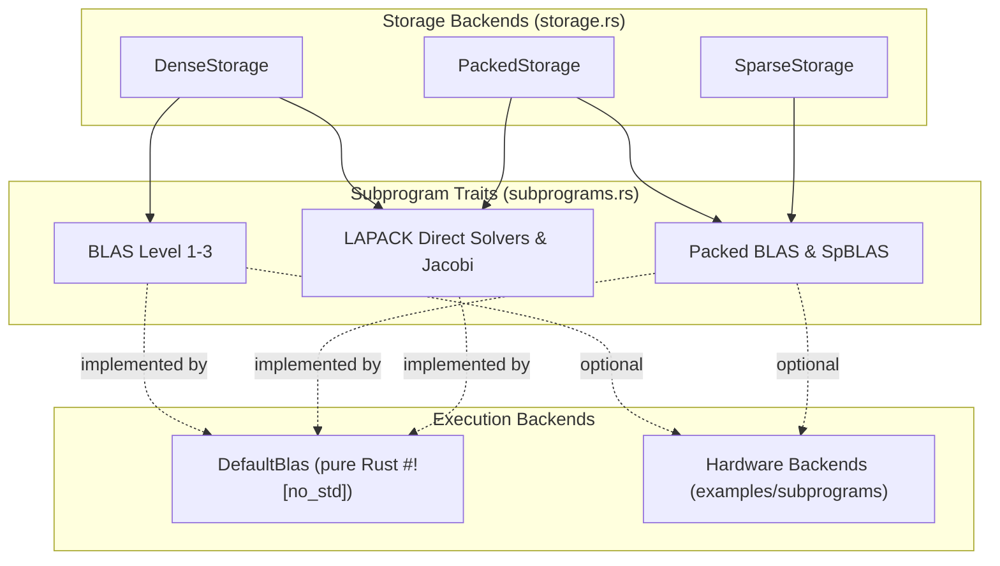

# Linear Algebra Subprograms (Design Document)


---

### 1. Introduction

Embedded control systems require deterministic, high-performance linear algebra
without dynamic heap allocation [1].
`src/math/subprograms.rs` defines canonical execution traits mirroring Level
1, 2, and 3 Basic Linear Algebra Subprograms (BLAS) [2]–[4], Sparse BLAS (
SpBLAS) [2],
[5]–[7], and LAPACK direct factorizations, solvers, and spectral
decompositions [8],
[9].

Subprograms support **primitive integers** (`u8`–`u64`, `i8`–`i64`),
**fixed-point numbers** (`fixed-num`), **floats** (`f32`, `f64`), and **complex
scalars** (`Complex<T>`). Dispatch occurs via associated functions on zero-sized
backend structs (`B::gemv(...)`), fixing the backend at compile time. `src/`
ships a single implementor, `DefaultBlas`. Accelerated backends attach from
outside the crate by implementing the same traits on a local marker type.
Reference implementors for ARM CMSIS-DSP, RISC-V NMSIS-DSP and host SIMD
libraries are provided under `examples/subprograms/` for reuse or reference,
not linked into `src/` (§4.5) [10]–[12].

Subprogram traits are implemented by a backend for the scalar types and layouts
that the backend natively supports. `DefaultBlas` implements ring kernels for
`T: Scalar` (integers, floats, `Complex<T>` with `T: Neg`, and `Quantized`)
and field kernels for `T: Scalar + Div` with `T::Real: Radical` / `Trig` as
required. `T: Float` denotes `f32` / `f64` and does not accept `Complex<T>`
(`num-traits-design.md` FR-5). Invoking unsupported types fails at compile time
(`error[E0277]`).

---

### 2. Requirements

#### 2.1 Functional Requirements

- **FR-1 — Vector state combination and reduction**: Linear control loops
  require scaling vectors, computing linear combinations, inner products, norms,
  and Givens plane rotations without dynamic memory allocation [2], [14].
  Allocating intermediate vectors in inner loops introduces unbounded latency
  and heap fragmentation on bare metal.
- **FR-2 — Matrix-vector state propagation**: State-space updates and observer
  corrections require multiplying state vectors by system and gain matrices,
  alongside rank-1 and rank-2 covariance updates in place over dense storage [3],
  [14]. Out-of-place evaluation would require temporary vectors exceeding
  microcontroller stack budgets.
- **FR-3 — Packed structured matrix-vector evaluation**: Kalman filtering and
  covariance processing require matrix-vector products, triangular substitution,
  and rank updates directly over packed symmetric, Hermitian, and triangular
  layouts [3], [8], [14]. Unpacking into dense buffers wastes scarce MCU RAM on
  redundant zeros.
- **FR-4 — Composed matrix transformation**: Controller synthesis, discrete-time
  propagation, and multi-input state transforms require dense matrix-matrix
  multiplication, symmetric rank updates, and triangular multi-right-hand-side
  solves in destination buffers [4], [14]. In-place evaluation prevents
  redundant allocations during stage compositions.
- **FR-5 — Compressed sparse state evaluation**: Sparsely coupled dynamics
  require evaluating matrix-vector products, sparse-dense matrix products, and
  sparse inner products directly from compressed formats (CSR and CSC) [2],
  [5]–[7]. Converting sparse models to dense matrices before multiplication would
  exhaust available memory on target.
- **FR-6 — In-place matrix decomposition with error isolation**: System
  inversion, square-root filtering, and orthogonal transformations require
  decomposing matrices into Cholesky, Householder QR, and pivoted LU factors
  directly within caller stack storage [8], [9]. Failing factorizations (such
  as non-positive-definite pivots, singular systems, or short workspaces) must
  report explicit typed `LinAlgError` variants rather than panicking.
- **FR-7 — Direct linear system solution**: Estimators and regulators require
  solving linear systems ($A x = b$) and applying orthogonal reflectors using
  precomputed factorizations without computing explicit matrix inverses [8].
  Matrix inversion degrades numerical stability and inflates operation counts.
- **FR-8 — Bounded spectral decomposition**: Modal analysis and principal axis
  transforms require computing eigenvalues and eigenvectors of symmetric and
  Hermitian matrices with deterministic iteration limits on the stack [1], [8].
  Unbounded iterations risk infinite loops violating hard real-time deadlines.
- **FR-9 — Pure-Rust fallback execution**: Target platforms without hardware
  vector engines or vendor libraries require a pure-Rust, `#![no_std]` reference
  backend covering all defined subprograms. Reliance on external C or Fortran
  libraries would prevent bare-metal compilation.

Each functional requirement maps directly to verification methods in §6.2 and
acceptance oracles in §6.3.

#### 2.2 Non-Functional Requirements

- **NFR-1 — State determinism**: Kernels maintain zero mutable global state. No
  `static mut` and no interior-mutable static types (`AtomicUsize`, `Cell`,
  `thread_local!`) are reachable from kernel code; execution is a pure function
  of inputs alone.
- **NFR-2 — Uniform public API**: The public API surface is strictly invariant
  across host and bare-metal compilation targets, prohibiting `cfg`-conditional
  public API symbols.
- **NFR-3 — Compile-time verification**: High-level matrix containers and
  subprograms enforce operand shapes and dimension constraints statically at
  compile time.
- **NFR-4 — Zero-branch codegen**: Monomorphized kernels over `ArrayStorage`
  compile to zero branch instructions and zero panic paths at `opt-level=3`,
  with subprogram methods marked `#[inline(always)]` [13].

#### 2.3 Constraints

- **C-1 — Precondition boundary**: Kernels assume valid operand dimensions
  proven by caller [14].
- **C-2 — Parameterized operation flags**: Transposition and
  conjugate-transposition dispatch conforms to the CBLAS parameter convention (
  `trans` / `uplo` / `diag` / `side`) [8], [14].
- **C-3 — NaN-safe beta scaling**: When $\beta = 0$, destination memory is
  safely overwritten without reading uninitialized $y$ / $C$ [3], [4], [14]. The
  zeroing loop covers every dest entry the kernel writes (matrix row count for
  `Csrmv`/`Cscmv`/`Gemv`), not `y.rows()` alone when $y$ is a row vector.
- **C-4 — No external library under `src/`**: `src/` declares the trait surface
  and `DefaultBlas` only. No C or Fortran library is vendored, linked, or
  feature-gated inside the crate, and no backend marker is admitted under a
  `cfg` (NFR-2). Accelerated backends attach from outside the crate (§4.5).
- **C-5 — Linkage isolation**: Core library subprograms compile and execute
  under `#![no_std]` with zero dynamic memory allocation and no
  `extern crate std` on any configuration, including tests [1].

---

### 3. Technical Overview

The linear algebra subprogram framework is organized into three decoupled
execution subsystems:

1. **Dense BLAS (Levels 1, 2, and 3)**: Vector operations (`Axpy`, `Dotu`,
   `Dotc`, `Scal`, `Rot`, `Nrm2`, `Asum`, `Iamax`), matrix-vector products and
   rank updates (`Gemv`, `Geru`, `Gerc`, `Symv`, `Hemv`), and matrix-matrix
   products and triangular solves (`Gemm`, `Symm`, `Hemm`, `Syrk`, `Herk`,
   `Trsm`).
2. **Packed Structured BLAS & Sparse BLAS (SpBLAS)**: Efficient operations over
   compact packed symmetric, Hermitian, and triangular formats (`Spmv`, `Hpmv`,
   `Spr`, `Hpr`, `Tpmv`, `Tpsv`), alongside compressed sparse matrix-vector
   products and sparse vector operations (`Csrmv`, `Cscmv`, `Csrmm`, `SpDotu`,
   `SpDotc`, `SpAxpy`).
3. **Direct LAPACK Solvers, Factorizations & Eigendecompositions**: In-place
   Cholesky (`Potrf`, `Pptrf`), Householder QR (`Geqrf`, `Ormqr`, `Unmqr`), LU
   with partial pivoting (`Getrf`, `Getrs`), and cyclic Jacobi spectral
   decompositions (`Syev`, `Heev`) executing within caller-supplied stack
   workspaces.



_Figure 0: Subprogram architectural layers. Storage backends feed into decoupled
trait definitions, implemented by the pure-Rust `#![no_std]` reference
backend `DefaultBlas` and optional target-accelerated backends._

#### 3.1 Dense BLAS 1, 2, and 3 Subprogram Hierarchy & Backends

```mermaid
classDiagram
    direction TB

    class Axpy~T X Y~ {
        <<trait>>
        +axpy(alpha: T, x: &X, y: &mut Y)
    }

    class Scal~T X~ {
        <<trait>>
        +scal(alpha: T, x: &mut X)
    }

    class RealScal~T X~ {
        <<trait>>
        +real_scal(alpha: T:: Real, x: &mut X)
    }

    class Dotu~T X Y~ {
        <<trait>>
        +dotu(x: &X, y: &Y) T
    }

    class Dotc~T X Y~ {
        <<trait>>
        +dotc(x: &X, y: &Y) T
    }

    class Nrm2~T X~ {
        <<trait>>
        +nrm2(x: &X) T:: Real
    }

    class Asum~T X~ {
        <<trait>>
        +asum(x: &X) T:: Real
    }

    class Iamax~T X~ {
        <<trait>>
        +iamax(x: &X) usize
    }

    class Swap~T X Y~ {
        <<trait>>
        +swap(x: &mut X, y: &mut Y)
    }

    class Rot~T X Y~ {
        <<trait>>
        +rot(x: &mut X, y: &mut Y, c: T:: Real, s: T)
    }

    class Gemv~T A X Y~ {
        <<trait>>
        +gemv(trans: Trans, alpha: T, a: &A, x: &X, beta: T, y: &mut Y)
    }

    class Geru~T A X Y~ {
        <<trait>>
        +geru(alpha: T, x: &X, y: &Y, a: &mut A)
    }

    class Gerc~T A X Y~ {
        <<trait>>
        +gerc(alpha: T, x: &X, y: &Y, a: &mut A)
    }

    class Symv~T A X Y~ {
        <<trait>>
        +symv(uplo: UpLo, alpha: T, a: &A, x: &X, beta: T, y: &mut Y)
    }

    class Hemv~T A X Y~ {
        <<trait>>
        +hemv(uplo: UpLo, alpha: T, a: &A, x: &X, beta: T, y: &mut Y)
    }

    class Syr~T A X~ {
        <<trait>>
        +syr(uplo: UpLo, alpha: T, x: &X, a: &mut A)
    }

    class Her~T A X~ {
        <<trait>>
        +her(uplo: UpLo, alpha: T:: Real, x: &X, a: &mut A)
    }

    class Syr2~T A X Y~ {
        <<trait>>
        +syr2(uplo: UpLo, alpha: T, x: &X, y: &Y, a: &mut A)
    }

    class Her2~T A X Y~ {
        <<trait>>
        +her2(uplo: UpLo, alpha: T, x: &X, y: &Y, a: &mut A)
    }

    class Trmv~T A X~ {
        <<trait>>
        +trmv(uplo: UpLo, trans: Trans, diag: Diag, a: &A, x: &mut X)
    }

    class Trsv~T A X~ {
        <<trait>>
        +trsv(uplo: UpLo, trans: Trans, diag: Diag, a: &A, x: &mut X)
    }

    class Gemm~T A B C~ {
        <<trait>>
        +gemm(ta: Trans, tb: Trans, alpha: T, a: &A, b: &B, beta: T, c: &mut C)
    }

    class Symm~T A B C~ {
        <<trait>>
        +symm(side: Side, uplo: UpLo, alpha: T, a: &A, b: &B, beta: T, c: &mut C)
    }

    class Hemm~T A B C~ {
        <<trait>>
        +hemm(side: Side, uplo: UpLo, alpha: T, a: &A, b: &B, beta: T, c: &mut C)
    }

    class Syrk~T A C~ {
        <<trait>>
        +syrk(uplo: UpLo, trans: Trans, alpha: T, a: &A, beta: T, c: &mut C)
    }

    class Herk~T A C~ {
        <<trait>>
        +herk(uplo: UpLo, trans: Trans, alpha: T:: Real, a: &A, beta: T:: Real, c: &mut C)
    }

    class Syr2k~T A B C~ {
        <<trait>>
        +syr2k(uplo: UpLo, trans: Trans, alpha: T, a: &A, b: &B, beta: T, c: &mut C)
    }

    class Her2k~T A B C~ {
        <<trait>>
        +her2k(uplo: UpLo, trans: Trans, alpha: T, a: &A, b: &B, beta: T:: Real, c: &mut C)
    }

    class Trmm~T A B~ {
        <<trait>>
        +trmm(side: Side, uplo: UpLo, trans: Trans, diag: Diag, alpha: T, a: &A, b: &mut B)
    }

    class Trsm~T A B~ {
        <<trait>>
        +trsm(side: Side, uplo: UpLo, trans: Trans, diag: Diag, alpha: T, a: &A, b: &mut B)
    }

    class DefaultBlas {
        <<struct>>
    }

    class ExampleBlas {
        <<struct>>
    }

    class Trans {
        <<enumeration>>
        NoTrans
        Trans
        ConjTrans
    }

    class UpLo {
        <<enumeration>>
        Upper
        Lower
    }

    class Diag {
        <<enumeration>>
        NonUnit
        Unit
    }

    class Side {
        <<enumeration>>
        Left
        Right
    }

%% Realizations
    Axpy~T X Y~ <|.. DefaultBlas
    Gemv~T A X Y~ <|.. DefaultBlas
    Gemm~T A B C~ <|.. DefaultBlas
    Dotc~T X Y~ <|.. DefaultBlas
    Hemv~T A X Y~ <|.. DefaultBlas
    Trsv~T A X~ <|.. DefaultBlas
    Trsm~T A B~ <|.. DefaultBlas
    Axpy~T X Y~ <|.. ExampleBlas
    Gemv~T A X Y~ <|.. ExampleBlas
    Gemm~T A B C~ <|.. ExampleBlas
```



*Figure 1: UML hierarchy for dense Level 1, Level 2, and Level 3 BLAS execution
traits, backend dispatchers, and configuration enums. `DefaultBlas` is the only
implementor in `src/`. `ExampleBlas` stands for any backend declared outside the
crate, including the implementors under `examples/subprograms/` (§4.5).*

#### 3.2 Packed BLAS & Sparse BLAS (SpBLAS) Hierarchy


*Figure 2: UML hierarchy for packed structured BLAS routines (symmetric,
Hermitian, triangular) and compressed sparse BLAS operations.*

#### 3.3 LAPACK Direct Solvers, Factorizations & Eigendecompositions


*Figure 3: UML hierarchy for direct LAPACK factorizations (Cholesky, QR, LU),
system solvers, Jacobi spectral decompositions, and structured linear algebra
error enums. `syev` / `heev` are the public entry points and carry no budget
argument; each forwards to a crate-private `_impl` (shown `-`) that takes the
Jacobi budget explicitly, defaulting to $50 n^2$ (§4.3). `ExampleBlas` carries
the same meaning as in Figure 1: a backend declared outside `src/`, covering
only the factorizations its library exposes (§4.5).*

---

### 4. Architecture

#### 4.1 Trait Parameterization & Core Subprogram Interfaces

All linear algebra routines are abstracted as zero-sized associated function
traits parameterized over scalar types $T$ and storage generic arguments
[15], [16]. Dense operands are
`DenseStorage<T>` / `DenseStorageMut<T>`
(`storage-design.md` FR-1, FR-2). Packed and sparse kernels bind
`PackedStorage<T>` / `SparseStorage<T>` instead. Numeric scalars implement
`Scalar` from `crate::math::num_traits`; `Conjugate` and `type Real` are
`Scalar` supertrait / associated type (`num-traits-design.md` FR-3, FR-4).
Ring kernels require `T: Scalar`. Field kernels (`Nrm2`, `Trsv`, `Potrf`,
`Geqrf`, `Syev`, `Heev`) require `T: Scalar + Div` with
`T::Real: Radical` / `Trig` as the operation needs. `T: Float` is not a
bound that accepts `Complex<T>` (`num-traits-design.md` FR-5).

Trait dispatch is organized as static associated function calls on backend
marker types:

```
// Generic dispatch example:
B::gemv(Trans::NoTrans, T::ONE, & a, & x, T::ZERO, & mut y);
```

`Trans` (`NoTrans`, `Trans`, `ConjTrans`), `UpLo`, `Diag`, and `Side` are the
CBLAS parameter types (C-2). They are defined with the storage operational
enums (`storage-design.md` §4.6).

Parameterizing storage types directly on subprogram traits allows zero-cost
monomorphization
over stack arrays (`ArrayStorage`), strided views (`StorageView`), packed
matrices
(`SymmetricPackedStorage`), and compressed sparse matrices (`CsrStorage`)
without dynamic
dispatch overhead [13].

#### 4.2 Subprogram Catalog (BLAS 1, 2, 3 & SpBLAS)

| Category        | Traits                                                                               | Key Mathematical Operations                                                                                                                                                       |                        Bounds                        | Standard Citations |
|:----------------|:-------------------------------------------------------------------------------------|:----------------------------------------------------------------------------------------------------------------------------------------------------------------------------------|:----------------------------------------------------:|:-------------------|
| **BLAS 1**      | `Axpy`, `Scal`, `RealScal`, `Dotu`, `Dotc`, `Swap`, `Asum`, `Iamax`<br>`Nrm2`, `Rot` | $y \leftarrow \alpha x + y$, $x \leftarrow \alpha_{\mathbb{R}} x$, $x^T y$, $x^H y$, $\arg\max$<br>$\|x\|_2 = \sqrt{\sum \|x_i\|^2}$, Givens rotation                             | `T: Scalar`; `Nrm2`/`Rot`: `T::Real: Radical`/`Trig` | [2], [14]          |
| **BLAS 2**      | `Gemv`, `Geru`, `Gerc`, `Symv`, `Hemv`, `Syr`/`Syr2`, `Her`/`Her2`<br>`Trmv`, `Trsv` | $y \leftarrow \alpha \text{op}(A) x + \beta y$, rank updates, Hermitian updates<br>Triangular matrix-vector and solve ($A_{\text{tri}}^{-1} x$)                                   |        `T: Scalar`; `Trsv`: `T: Scalar + Div`        | [3], [14]          |
| **Packed BLAS** | `Spmv`, `Hpmv`, `Spr`/`Spr2`, `Hpr`/`Hpr2`<br>`Tpmv`, `Tpsv`                         | Packed symmetric / Hermitian matvec and rank updates<br>Packed triangular matvec and solve                                                                                        |        `T: Scalar`; `Tpsv`: `T: Scalar + Div`        | [3], [8], [14]     |
| **BLAS 3**      | `Gemm`, `Symm`, `Hemm`, `Syrk`/`Syr2k`, `Herk`/`Her2k`<br>`Trmm`, `Trsm`             | Matrix multiply $C \leftarrow \alpha \text{op}(A)\text{op}(B) + \beta C$, Hermitian updates<br>Triangular matrix multiply and solve ($B \leftarrow \alpha A_{\text{tri}}^{-1} B$) |        `T: Scalar`; `Trsm`: `T: Scalar + Div`        | [4], [14]          |
| **SpBLAS**      | `Csrmv`, `Cscmv`, `Csrmm`, `SpDotu`, `SpDotc`, `SpAxpy`                              | Sparse matrix-vector ($A_{\text{csr}} x$), sparse matrix-matrix, sparse dot                                                                                                       |                     `T: Scalar`                      | [2], [5]–[7]       |

#### 4.3 LAPACK Direct Solvers & Factorizations

Direct LAPACK routines operate in-place with stack-allocated workspace buffers
[8], [9]:

- **Cholesky Factorization (`Potrf`, `Pptrf`)**: Computes $A = L L^T$ (real SPD)
  or
  $A = L L^H$ (complex HPD). Evaluates positive definiteness by
  verifying $L_{k,k} > 0$
  prior to square-root division; returns `Err(LinAlgError::NotPositiveDefinite)`
  if
  a non-positive pivot occurs [8], [9].
  `Pptrf` writes the physical triangle selected by `uplo`. `set` of an
  unstored half is not discarded: Upper packed updates \(i \le j\); Lower
  packed updates \(i \ge j\).
- **Cholesky Solver (`Potrs`, `Pptrs`)**: Solves $A X = B$ via forward/back
  substitution
  $L Y = B$ followed by $L^T X = Y$ (or $L^H X = Y$) using Level-3 `Trsm`
  kernels
  [8]. `uplo` selects the same triangle `Pptrf` wrote.
- **Householder QR Factorization (`Geqrf`)**: Computes $A = Q R$ where $Q$ is
  represented
  as a product of elementary Householder
  reflectors $H_i = I - \tau_i v_i v_i^H$.
  Reflector scalar factors are stored in `tau: &mut [T]` and temporary
  operations execute
  in `work: &mut [T]` [8].
- **Orthogonal / Unitary Multiplication (`Ormqr`, `Unmqr`)**: Applies $Q$
  or $Q^H$ directly
  to a target matrix $C \leftarrow \text{op}(Q) C$ without forming the
  full $N \times N$
  orthogonal matrix $Q$ explicitly [8].
  \(H = I - \tau v v^H\) and \(H^H = I - \overline{\tau} v v^H\): both
  paths conjugate \(v\) in the inner product \(v^H C\) and apply \(v\) in
  the rank-1 update. `Side::Right` is required, not a no-op.
- **LU Factorization with Partial Pivoting (`Getrf`)**: Computes $P A = L U$
  using row
  swaps recorded in an integer permutation slice `ipiv: &mut [usize]`. Returns
  `Err(LinAlgError::SingularMatrix)` if an exact zero pivot is encountered [8].
- **LU Solver (`Getrs`)**: Applies permutations $P$ followed by triangular
  forward/back
  solves $L Y = P B$ and $U X = Y$ [8]. `ipiv.len()`
  below `min(m, n)` returns `Err(LinAlgError::WorkspaceTooSmall)`, matching
  `Getrf`.
- **Jacobi Spectral Eigendecomposition (`Syev`, `Heev`)**: Computes
  eigenvalues $\Lambda$
  and eigenvectors ($A = V \Lambda V^T$ / $A = U \Lambda U^H$) using cyclic
  Jacobi 2D plane
  rotations on the MCU stack [8]. Converges monotonically
  for symmetric
  and Hermitian matrices without requiring dynamic memory allocations [1].
  Off-diagonal search and plane updates read only the `uplo` triangle and
  reflect (conjugate, for `Heev`) the unstored half, matching LAPACK
  `DSYEV` / `ZHEEV` [8].
- **Workspaces**: `tau`, `work`, and `ipiv` are caller stack slices
  [1], [8]. Kernels do not allocate a
  hidden `[T; N]` scratch that silently drops tail entries or panics when
  \(n\) exceeds a fixed cap. Insufficient length returns
  `WorkspaceTooSmall`.
- **Jacobi Sweep Budget**: Convergence is asymptotic, so both routines carry a
  finite iteration budget and return `Err(LinAlgError::MaxIterationsReached)`
  when it is exhausted, matching LAPACK's convention of reporting
  non-convergence
  through the info status rather than looping [8]. The
  default is $50 n^2$ for an $n \times n$ operand.

  The budget is a parameter of the computation, not ambient state. Public
  `syev` / `heev` take no budget argument and forward to crate-private
  `syev_impl` / `heev_impl` carrying `max_iter: usize` (Figure 3). This is the
  only supported way to select a budget, and it satisfies NFR-2: the value
  travels on the call stack, so no `static` participates in a kernel result.

  The seam is crate-private on purpose. Exposing `max_iter` publicly would
  commit the trait signature to a tuning parameter before the worst-case
  execution time analysis that would justify one exists (§8). Callers needing a
  bound today constrain it through operand dimension, which fixes $50 n^2$
  statically.

#### 4.4 Pure-Rust Reference Implementation (`DefaultBlas`)

All subprograms dispatch via associated functions on `DefaultBlas`, supporting
dense, packed, and sparse operands with NaN-safe $\beta=0$ handling and
branchless inner loops [3], [13]:

```rust
pub struct DefaultBlas;

impl<T, A, X, Y> Gemv<T, A, X, Y> for DefaultBlas
where
    T: Scalar,
    A: DenseStorage<T>,
    X: DenseStorage<T>,
    Y: DenseStorageMut<T>,
{
    #[inline(always)]
    fn gemv(trans: Trans, alpha: T, a: &A, x: &X, beta: T, y: &mut Y) {
        let (m, n) = match trans {
            Trans::NoTrans => (a.rows(), a.cols()),
            Trans::Trans | Trans::ConjTrans => (a.cols(), a.rows()),
        };
        debug_assert_eq!(n, x.rows());
        debug_assert_eq!(m, y.rows());

        unsafe { /* ... */ }
    }
}

impl<T: Scalar, X: DenseStorage<T>, Y: DenseStorage<T>> Dotc<T, X, Y> for DefaultBlas {
    #[inline(always)]
    fn dotc(x: &X, y: &Y) -> T {
        let n = x.rows();
        debug_assert_eq!(n, y.rows());
        let mut acc = T::ZERO;
        unsafe { /* ... **/ }
        acc
    }
}

impl<T: Scalar, A: DenseStorage<T>, X: DenseStorage<T>, Y: DenseStorageMut<T>>
Hemv<T, A, X, Y> for DefaultBlas
{
    #[inline(always)]
    fn hemv(uplo: UpLo, alpha: T, a: &A, x: &X, beta: T, y: &mut Y) {
        let n = a.rows();
        debug_assert_eq!(n, a.cols());
        debug_assert_eq!(n, x.rows());
        debug_assert_eq!(n, y.rows());

        unsafe { /* ... **/ }
    }
}
```

#### 4.5 Backend Extension Point

`src/` ships a single implementor, `DefaultBlas` (§4.4). The subprogram traits
are the extension point: a downstream crate, or an example in this repository,
declares its own zero-sized marker and implements the traits on it. A local
self type satisfies Rust's orphan rule, so attaching an accelerated backend
requires no edit under `src/`, no crate feature and no addition to this crate's
dependency graph.

External C libraries are not vendored, linked or feature-gated under `src/`
(C-4). Three properties make that placement unworkable.

- **Toolchain.** Building OpenBLAS requires GNU Make or CMake, a C compiler
  and, for LAPACK, a Fortran compiler [17]. BLASFEO supplies its
  performance-optimized routines only for Linux, Windows and macOS builds,
  falling back to a target-unspecific reference variant elsewhere [18]. Neither
  is a dependency a `no_std` crate can carry.
- **Target coupling.** CMSIS-DSP addresses Cortex-M and Cortex-A devices [10].
  NMSIS-DSP addresses Nuclei RISC-V cores and its optimized
  paths assume P-ext or V-ext [12], while
  `riscv32imac-unknown-none-elf` declares `+m,+a,+c` only [19]. A backend
  bundled in `src/` is dead weight on every target it does
  not serve, and on `riscv32imac` NMSIS-DSP would bind correctly without
  accelerating anything.
- **NFR-3.** A marker admitted under one `cfg` and absent under another is a
  `cfg`-conditional public symbol, which §2.2 rejects. Keeping backends
  outside `src/` removes the conflict instead of granting it an exception.

##### 4.5.1 Provided implementors

Reference implementors live under `examples/subprograms/` and exist to be read,
copied or referenced by integrators rather than depended on. Each declares its
own marker and implements the traits directly, which is evidence that the
extension point works from the position an external user occupies.
`subprograms-examples-proposal.md` specifies the set, the feature gating and
the equivalence harness; the evidence for each binding is collected there.

| Implementor      | Environment                     | Attaches via                                                         |
|:-----------------|:--------------------------------|:---------------------------------------------------------------------|
| `AccelerateBlas` | macOS on Apple silicon          | vecLib `cblas.h`, `-framework Accelerate` [20]                       |
| `CblasBlas`      | any host with a Netlib-ABI BLAS | `-lcblas -lblas`; OpenBLAS and BLIS are link-time substitutions [17] |
| `NeonBlas`       | `aarch64`                       | `core::arch::aarch64` intrinsics, no external library                |
| `Avx2Blas`       | `x86_64`                        | `core::arch::x86_64` intrinsics, no external library                 |
| `CmsisDspBlas`   | Cortex-M                        | CMSIS-DSP static library, Apache-2.0 [10]                            |
| `NmsisDspBlas`   | Nuclei RISC-V                   | NMSIS-DSP static library, Apache-2.0 [12]                            |

An implementor attaches without a feature gate, because the marker is local to
the crate that declares it:

```rust
// In an example or a downstream crate, not in src/.
struct CmsisDspBlas;

impl Gemm<f32, ArrayStorage<f32, 4, 4>, ArrayStorage<f32, 4, 4>, ArrayStorage<f32, 4, 4>>
for CmsisDspBlas
{
    #[inline(always)]
    fn gemm(ta: Trans, tb: Trans, alpha: f32, a: &..., b: &..., beta: f32, c: &mut ...) {
        if ta == Trans::NoTrans && tb == Trans::NoTrans && alpha == 1.0 && beta == 0.0 {
            // arm_mat_mult_f32 fast path
        } else {
            DefaultBlas::gemm(ta, tb, alpha, a, b, beta, c);
        }
    }
}
```

The guard is the load-bearing part. CMSIS-DSP and NMSIS-DSP are not BLAS: the
matrix argument is `arm_matrix_instance_f32 { numRows, numCols, pData }` with
`pData[i*numCols + j]`, contiguous row-major only, and there is no `alpha`,
`beta`, `trans` or `lda` [11]. NMSIS-DSP mirrors that shape,
being a port of CMSIS [21]. Every DSP-backed method is
therefore a guarded fast path over a `DefaultBlas` delegate, and the delegate
is what makes partial backend coverage legal.

##### 4.5.2 Closest DSP analogues

The mapping below records the closest entry point each DSP library offers for a
given trait. It is guidance for an implementor, not a claim of equivalence.
Rows marked † are not one-to-one substitutions and need composition or a
`DefaultBlas` delegate rather than a direct call;
`subprograms-examples-proposal.md` §6 records each discrepancy against the same
evidence.

| Subprogram Trait  | ARM CMSIS-DSP (`CmsisDspBlas`)                 | RISC-V NMSIS-DSP (`NmsisDspBlas`)                  | Supported Scalar Types | Hardware Citations |
|:------------------|:-----------------------------------------------|:---------------------------------------------------|:----------------------:|:-------------------|
| `Axpy`† / `Scal`  | `arm_scale_f32`, `arm_scale_q31`               | `riscv_scale_f32`, `riscv_scale_q31`               |  `f32`, `q31`, `q15`   | [11], [12]         |
| `Dotu` / `Dotc`   | `arm_dot_prod_f32`, `arm_cmplx_dot_prod_f32`   | `riscv_dot_prod_f32`, `riscv_cmplx_dot_prod_f32`   |   `f32`, `Complex32`   | [11], [12]         |
| `Gemv` / `Symv`   | `arm_mat_vec_mult_f32`, `arm_mat_vec_mult_q31` | `riscv_mat_vec_mult_f32`, `riscv_mat_vec_mult_q31` |  `f32`, `q31`, `q15`   | [11], [12]         |
| `Gemm` / `Hemm`   | `arm_mat_mult_f32`, `arm_cmplx_mat_mult_f32`   | `riscv_mat_mult_f32`, `riscv_cmplx_mat_mult_f32`   |   `f32`, `Complex32`   | [11], [12]         |
| `Nrm2`†           | `arm_cmplx_mag_f32`                            | `riscv_cmplx_mag_f32`                              |   `f32`, `Complex32`   | [11], [12]         |
| `Potrf`           | `arm_mat_cholesky_f32`                         | `riscv_mat_cholesky_f32`                           |         `f32`          | [11], [12]         |
| `Trsm`† / `Trsv`† | `arm_mat_solve_upper_triangular_f32`           | `riscv_mat_solve_upper_triangular_f32`             |         `f32`          | [11], [12]         |

*(Packed operations `Hemv`/`Hpmv`/`Spmv` have no DSP entry point and delegate
to `DefaultBlas`.)*

---

### 5. Alternatives

| Alternative                                                                                                         | Rejected Because                                                                                                                                                                                                                                                                                                                                                                                                                                                         | Reference                     |
|:--------------------------------------------------------------------------------------------------------------------|:-------------------------------------------------------------------------------------------------------------------------------------------------------------------------------------------------------------------------------------------------------------------------------------------------------------------------------------------------------------------------------------------------------------------------------------------------------------------------|:------------------------------|
| **Float-only BLAS scope**                                                                                           | Prevents bare-metal integer control loops, discrete state observers, and fixed-point DSP filtering from reusing linear algebra infrastructure.                                                                                                                                                                                                                                                                                                                           | §1, §4.1 [2], [11]            |
| **Omitting Complex / Hermitian BLAS**                                                                               | Prevents multi-input multi-output (MIMO) frequency domain analysis ($G(j\omega)$), $\mathcal{H}_\infty$ control, and quantum state estimation.                                                                                                                                                                                                                                                                                                                           | §1, §4.3, §4.6 [3], [4], [14] |
| **String-based LAPACK errors (`&'static str`)**                                                                     | Disables structured programmatic error recovery in embedded control loops. `LinAlgError` provides typed enum matching.                                                                                                                                                                                                                                                                                                                                                   | §4.3 [8]                      |
| **Heap-allocated LAPACK workspace (`Vec<T>`)**                                                                      | Violates `#![no_std]` real-time constraints (C-5). Explicit stack slice arguments guarantee zero allocation.                                                                                                                                                                                                                                                                                                                                                           | §4.3 [1]                      |
| **Separate `_trans` / `_conj` function variants**                                                                   | Duplicates the entire BLAS API surface. Zero-cost `Trans` enum plus `Trans::ConjTrans` (scalar `.conj()` in the kernel) resolves transposition and conjugation without an `AdjointView` storage type.                                                                                                                                                                                                                                                                    | §4.1, §4.4 [8], [14]          |
| **Hardcoding one backend now (e.g. CMSIS-DSP)**                                                                     | The interface's purpose is to remain library-agnostic and CMSIS-DSP does not target RISC-V32IMAC.                                                                                                                                                                                                                                                                                                                                                                        | §1, §4.5 [10]                 |
| **Runtime backend dispatch**                                                                                        | Target triple fixes the backend at compile time, so runtime dispatch tests a statically known condition and adds execution overhead.                                                                                                                                                                                                                                                                                                                                     | §5.2 [22]                     |
| **Any backend feature flag under `src/` (single cross-target, or one per target triple)**                           | Superseded by C-4. With no backend inside the crate there is no ARM-only or RISC-V-only binding to gate, and a marker admitted under one `cfg` and absent under another violates NFR-2. The gate moves to the example's own manifest.                                                                                                                                                                                                                                    | §2.3, §4.5 [1]                |
| **Vendoring CMSIS-DSP or NMSIS-DSP under `src/` behind `feature = "cmsis-dsp"` / `"nmsis-dsp"`**                    | Puts a C static library and its build script inside a `no_std` crate's graph, serves one ISA family per flag, and publishes a `cfg`-conditional marker against NFR-2. Neither library accelerates `riscv32imac-unknown-none-elf`, which declares `+m,+a,+c` only. The same binding as an example costs the integrator one file to copy and the crate nothing.                                                                                                            | §2.3, §4.5 [10], [12], [19]   |
| **CONTIGUOUS-only slices, with `matrix` keeping loops for strided access**                                          | Roughly half of `matrix`'s inner loops read a fixed row of column-major storage (strided); leaving them outside the interface limits optimization.                                                                                                                                                                                                                                                                                                                       | §5.2 [14]                     |
| **A gather/scatter view type instead of stride parameters**                                                         | Copying a strided row into a contiguous scratch buffer costs an $O(D)$ copy and stack allocation, violating the stack-only footprint.                                                                                                                                                                                                                                                                                                                                    | §5.2 [1]                      |
| **Adopted: `INC_X`/`INC_Y`/`LDA`/`LDB`/`LDC` as compile-time const generics, not runtime parameters**               | Runtime parameters introduce branching and panic paths (evaluated in the experiment). Const generics read from the operand's type are branchless.                                                                                                                                                                                                                                                                                                                        | §4.2.1, §4.2.2 [14]           |
| **Reinterpreting `order: MatrixLayout` as a transpose flag, or a `transpose_view` storage type**                    | Exposes no transposed storage view or `StridedView`. In-place transposition and copying remain `Matrix` operations.                                                                                                                                                                                                                                                                                                                                                      | §4.2.1, §4.2.3 [8]            |
| **Leaving `GER`/`TRSV` to caller loops**                                                                            | They are precisely the operations accelerated by hardware; excluding them concedes performance on standard $O(D^2)$ loops.                                                                                                                                                                                                                                                                                                                                               | §5.2 [2], [14]                |
| **Hand-computing `lda`/`inc_x` at each call site**                                                                  | Pushes computation to call sites with no compiler checking that `lda` matches the layout/shape.                                                                                                                                                                                                                                                                                                                                                                          | §4.2.2 [14]                   |
| **Two storage traits, one contiguous and one strided, bridged by a blanket impl**                                   | Violates Rust coherence rules (E0119) and lacks standard strided BLAS/LAPACK models.                                                                                                                                                                                                                                                                                                                                                                                     | §5.1, §5.2 [15]               |
| **A generic wrapper type (e.g. `Operand<S>`) rather than a trait**                                                  | Forces wrapper construction per operand, whereas traits keep the abstraction at the bound where `Matrix` already names `S`.                                                                                                                                                                                                                                                                                                                                              | §5.2 [15]                     |
| **A single shared `ld` parameter across `GEMM`'s three matrix operands**                                            | Operand leading dimensions are independent of shape and origin (e.g. submatrix views), so different operands require different strides.                                                                                                                                                                                                                                                                                                                                  | §5.2 [4]                      |
| **A `std`-gated test hook for the Jacobi budget (`thread_local!` override, `AtomicUsize` fallback under `no_std`)** | Violates C-5 (`extern crate std` under `src/`), NFR-1 (interior-mutable `static` read per kernel entry), and NFR-2 (one public name with two `cfg`-selected implementations). The host build exercises the `thread_local` path and the ETS build the atomic path, so the verified binary is not the deployed binary, which voids the §6.3 oracle it was introduced to satisfy. It also publishes a safe setter that forces every subsequent `syev` / `heev` to fail. | §2.2, §2.3, §4.3, §6.3 [1]    |
| **A public `max_iter` argument on the `Syev` / `Heev` trait methods**                                               | Satisfies §6.3 and C-5 equally well, but commits the public signature to a tuning parameter that no worst-case execution time requirement yet motivates, and diverges from LAPACK's `ssyev` / `cheev` argument lists [8]. Deferred to §8, not rejected on principle.                                                                                                                                                                                                      | §4.3, §8 [8]                  |

---

### 6. Verification & Validation Plan

#### 6.1 Approach

The implementation must produce evidence that Level 1, 2, 3 BLAS, SpBLAS, and
LAPACK factorizations, solvers, and eigensolvers converge with analytical
backward error stability; that integer and fixed-point kernels execute
bit-exact; that workspace slices are strictly validated; that no dynamic heap
allocations occur on target; and that unchecked release builds Lower to
branchless instructions.

| Method                    | Mechanism                                                                                                                             |
|:--------------------------|:--------------------------------------------------------------------------------------------------------------------------------------|
| Requirements-based test   | `#[test]` unit tests over Level 1/2/3 BLAS, SpBLAS, factorizations, solves, NaN-safe beta scaling, and failure variants               |
| Property-based test       | `proptest` over algebraic properties (transposition, distributivity, conjugate symmetries)                                            |
| Back-to-back comparison   | Host oracle harness comparison against SciPy and Reference LAPACK scaled residuals                                                    |
| Compile-time shape check  | Static dispatch via associated functions, CBLAS parameter enums, and const generic dimension/stride verification                      |
| Static analysis           | `cargo clippy-ci`, `cargo tree`, source inspection for absence of heap symbols, external C/Fortran linkages, and global mutable state |
| Resource usage evaluation | Stack analysis and disassembly instruction/branch audit under `cargo ci`                                                              |
| On-target execution       | ETS suites under QEMU and Teensy 4.1 executing core BLAS/LAPACK routines                                                              |

Target: 90% statement coverage of `src/math/subprograms.rs`, measured via
`cargo coverage`.
Excluded: Hardware-specific accelerated assembly paths in external example
crates, and debug-only assertion messages.

1. **Val-1: Square-Root Kalman Filter**: 6-DOF IMU attitude and position state
   estimation with covariance time-propagation ($P = \Phi P \Phi^T + Q$) and
   measurement update (`Syrk`, `Spmv`, `Trsv`, `Potrf`). Zero heap allocations;
   covariance remains strictly positive-definite over 10,000 steps.
2. **Val-2: Real-Time Sparse MPC QP**: Condensed 10-step horizon state-space
   trajectory optimizer with state/input constraints (`Csrmv`, `Csrmm`, `Axpy`,
   `SpDotu`). Solves within < 1.0 ms cycle time on Cortex-M7; matches dense QP
   solver trajectory.
3. **Val-3: Complex MIMO Frequency Response**: Frequency-domain evaluation and
   singular value extraction $\sigma_{\max}(G(j\omega))$
   via $G(j\omega)^H G(j\omega)$
   Hermitian factorization (`Gemm`, `Herk`, `Potrf`, `Heev`). Exact spectral
   matches
   against MATLAB/SciPy without heap allocation.
4. **Val-4: Decoupled Modal State Simulation**: Modal decoupled structural
   vibration simulator ($\dot{x} = D x + B u$) with 32 modes (`Axpy`, `Dotu`,
   `Scal`).
   Linear $O(N)$ CPU scaling demonstrated; bit-identical to dense integration.
5. **Val-5: Mixed-Layout State Observer**: Luenberger observer combining
   row-major sensor gains $L$ with column-major dynamics $A$ (`Gemv`,
   `transpose_view`).
   Correct mixed-layout propagation without intermediate allocation or data
   reordering.

#### 6.2 Acceptance

| Claim                                            | Oracle                            | Measure                                                                              | Bound                                                                   |
|:-------------------------------------------------|:----------------------------------|:-------------------------------------------------------------------------------------|:------------------------------------------------------------------------|
| QR factorization (`Geqrf`)                       | Reference LAPACK residual         | Scaled residual $\|A - QR\|_\infty / (N \cdot \|A\|_\infty \cdot \text{EPS})$        | $\tau < 20.0$ per `design-template.md` §6.2                                |
| QR orthogonality                                 | Unitary identity $Q^H Q = I$      | Residual $\|Q^H Q - I\|_\infty / (N \cdot \text{EPS})$                               | $\tau < 20.0$ per `design-template.md` §6.2                                |
| LU factorization (`Getrf`)                       | Reference LAPACK residual         | Scaled residual $\|PA - LU\|_\infty / (N \cdot \|A\|_\infty \cdot \text{EPS})$       | $\tau < 20.0$ per `design-template.md` §6.2                                |
| Cholesky factorization (`Potrf`, `Pptrf`)        | Reference LAPACK residual         | Scaled residual $\|A - LL^T\|_\infty / (N \cdot \|A\|_\infty \cdot \text{EPS})$      | $\tau < 20.0$ per `design-template.md` §6.2                                |
| Eigendecomposition (`Syev`, `Heev`)              | Spectral identity $AV = V\Lambda$ | Scaled residual $\|AV - V\Lambda\|_\infty / (N \cdot \|A\|_\infty \cdot \text{EPS})$ | $\tau < 20.0$ per `design-template.md` §6.2                                |
| Eigenvector orthogonality                        | Unitary identity $V^H V = I$      | Residual $\|V^H V - I\|_\infty / (N \cdot \text{EPS})$                               | $\tau < 20.0$ per `design-template.md` §6.2                                |
| Linear solves (`Trsv`, `Trsm`, `Potrs`, `Getrs`) | Higham forward error bound        | $\|x - \hat{x}\|_\infty / \|x\|_\infty$                                              | $\le \kappa(A) \cdot N \cdot \text{EPS}$                                |
| Integer & fixed-point BLAS                       | Analytical closed-form            | Exact equality                                                                       | $0$, bit-identical                                                      |
| Packed-dense equivalence                         | Dense BLAS on unpacked matrix     | Absolute difference (`Spmv` vs `Symv`, `Hpmv` vs `Hemv`)                             | $0$, bit-identical                                                      |
| Sparse-dense equivalence                         | Dense BLAS on uncompressed matrix | Absolute difference (`Csrmv` vs `Gemv`, `SpDotc` vs `Dotc`)                          | $0$, bit-identical                                                      |
| NaN-safe $\beta = 0$                             | Overwrite contract                | Dest check on $y$ containing NaNs with $\beta = 0$                                   | Valid numerical output; zero NaNs                                       |
| Workspace bounds checking                        | Minimum length formula            | Call with buffer $1$ element short                                                   | Returns `Err(LinAlgError::WorkspaceTooSmall)`                           |
| Factorization error reporting                    | Defective matrices                | Cholesky non-SPD, LU singular, Jacobi budget $0$                                     | Returns `NotPositiveDefinite`, `SingularMatrix`, `MaxIterationsReached` |

#### 6.3 Limits

- **Hardware-accelerated external backends**: `CmsisDspBlas` and `NmsisDspBlas`
  under `examples/subprograms/` are standalone reference implementations run on
  demand, not verified in automated crate CI.
- **Cross-target floating-point ULP divergence**: Single-rounding FMA
  instructions on Cortex-M7 versus separated multiply-accumulate on soft-float
  RISC-V32 can produce 1–2 ULP divergence across targets; cross-target exact
  equality is therefore not asserted for floating-point values.
- **General non-symmetric eigenvalue decomposition**: Only real symmetric
  (`Syev`) and complex Hermitian (`Heev`) Jacobi eigensolvers are provided;
  non-symmetric Schur/QR spectral decompositions are not implemented.
- **Automated CI branch-count gating**: Zero-branch disassembly metrics are
  measured via periodic disassembly inspection in §7, not gated on every CI
  commit.

---

### 7. Performance & Resource Considerations

Disassembly under `opt-level=3` (LLVM 22.1.6) on `x86_64-apple-darwin`,
`thumbv7em-none-eabihf`, and `riscv32imac-unknown-none-elf` [13]:

| Variant                 | Strategy                       | Storage Target | Instructions | Branches + Calls | Panic Paths | Reference  |
|:------------------------|:-------------------------------|:---------------|:------------:|:----------------:|:-----------:|:-----------|
| **A** (`gemv_dyn`)      | Runtime fields, slice indexing | Dynamic slice  |     123      |        23        |      7      | [13]       |
| **B** (`gemv_const_4`)  | Assoc consts, slice indexing   | Slice view     |     166      |        35        |     21      | [13]       |
| **C** (`gemv_arr_4`)    | Nested array indexing          | `ArrayStorage` |    **28**    |      **0**       |    **0**    | [13], [15] |
| **D** (`gemv_ptr_4`)    | Raw pointer `.add()`           | `StorageView`  |      59      |        0         |      0      | [13], [15] |
| **E** (`gemv_ptr_ab_4`) | Raw pointer, full matvec       | `StorageView`  |      73      |        0         |      0      | [13], [15] |

---

### 8. Risks & Open Questions

- **Precondition Contract Boundary**: Subprogram traits assume valid bounds.
  `Matrix` constructors and callers maintain shape guarantees to avoid UB [14].
- **Complex Arithmetic Overhead**: Complex scalar multiplication involves 4 real
  multiplications and 2 additions ($(a+bi)(c+di) = (ac-bd) + (ad+bc)i$). An
  external backend may utilize SIMD (`arm_cmplx_*`) on hardware where
  available; `DefaultBlas` does not [11].
- **Pivot Scratch Storage & Workspace Policies (frozen)**: In-place LU factorization (
  `Getrf`) and solve (`Getrs`) require an integer permutation slice
  `ipiv: &mut [usize]`.
  `Geqrf` requires `tau: &mut [T]` and `work: &mut [T]`. Workspaces are
  allocated on the caller's stack as slices and bounds-checked at kernel
  entry, returning `Err(LinAlgError::WorkspaceTooSmall)` on underflow [1], [8].
  Fixed-capacity typed arrays `[T; N]` are rejected.
- **Floating-Point ULP Tolerances Across ETS Targets**: Hardware FMA
  instructions
  on Cortex-M7 evaluate single-rounding fused
  multiply-accumulates ($a \cdot b + c$),
  which can produce 1-ULP differences per operation relative to separate
  non-fused
  multiply and add instructions on soft-float RISC-V32 targets [23].
  Verification suites accommodate this by validating floating-point outputs
  against bounded
  $O(N \cdot \text{EPS})$ tolerance thresholds while requiring exact bit-for-bit
  equality on integer and fixed-point paths [11], [12].
- **Jacobi Budget Seam (frozen)**: $50 n^2$ is the fixed internal default (§4.3).
  Iterative eigensolver execution routes through the crate-private
  `syev_impl`/`heev_impl` seam with no public associated constant or public
  parameter exposed in this wave. This guarantees MCU stack safety and bounded
  deterministic execution without committing the public trait signature to tuning parameters.
- **Example backends are not continuously verified**: the implementors under
  `examples/subprograms/` are outside `cargo ci`, so nothing detects a trait
  signature change breaking them until someone builds them. A trait-surface
  change is therefore a manual sweep over the examples, and the alternative,
  compiling them in CI, reintroduces the system dependencies C-4 exists to
  keep out.
- **Enforcement of C-5 / NFR-1 / NFR-2 (tracked)**: The linkage and
  non-functional constraints (
  C-5 no `std` linkage under `src/`, NFR-1 no mutable global state, NFR-2 no
  `cfg`-conditional public API) are verified across 4 bare-metal virtual ETS
  (QEMU) targets (`thumbv7em`, `thumbv7m`, `riscv32imc`, `riscv64gc`). Static
  AST-level lint checks are tracked in Phase 7.

---

### 9. Development Plan

| Phase                                 | Description                                                                                                                                                                                                                                                                                                                     |    Effort     |
|:--------------------------------------|:--------------------------------------------------------------------------------------------------------------------------------------------------------------------------------------------------------------------------------------------------------------------------------------------------------------------------------|:-------------:|
| **Phase 1: Dense BLAS 1/2/3**         | Implement Level 1 (`Axpy`, `Dotu`, `Dotc`, `Scal`, `RealScal`), Level 2 (`Gemv`, `Geru`, `Gerc`, `Symv`, `Hemv`, `Trsv`), Level 3 (`Gemm`, `Symm`, `Hemm`, `Syrk`, `Herk`, `Trsm`) on `DefaultBlas` over `T: Scalar` (ring) and `T: Scalar + Div` with `T::Real: Radical`/`Trig` (field). Dense operands are `DenseStorage<T>`. |   Complete    |
| **Phase 2: Packed BLAS**              | Implement `Spmv`, `Hpmv`, `Tpmv`, `Tpsv`, `Spr`/`Hpr`, `Pptrf` on `DefaultBlas`.                                                                                                                                                                                                                                                |   Complete    |
| **Phase 3: Sparse BLAS (SpBLAS)**     | Implement `Csrmv`, `Cscmv`, `Csrmm`, `SpDotu`, `SpDotc`, `SpAxpy` on `DefaultBlas`.                                                                                                                                                                                                                                             |   Complete    |
| **Phase 4: LAPACK Solvers**           | Implement `Potrf`/`Potrs` (SPD & HPD), `Geqrf`/`Ormqr`/`Unmqr`, `Getrf`/`Getrs`, `Syev`/`Heev` (Jacobi) on `DefaultBlas` with typed workspaces and `LinAlgError`. `Syev`/`Heev` route through the crate-private `syev_impl`/`heev_impl` budget seam (§4.3).                                                                     | Trait surface |
| **Phase 5: Numerical Oracle Closure** | Implement oracles for right-side `Trsm`/`Ormqr`/`Unmqr`, upper `Pptrf`, `Unmqr` ($Q^H$) conjugation, `Getrs` `ipiv` validation, C-3 on `Cscmv` row destination, caller-provided workspaces, and Level 2/3 numerical test harnesses defined in §6.                                                                               |       M       |
| **Phase 6: Example Implementors**     | Reference backend implementors under `examples/subprograms/`, each with an equivalence harness against `DefaultBlas` (§4.5.1). `src/` is unchanged by this phase. Specified in `subprograms-examples-proposal.md`.                                                                                                              |       S       |
| **Phase 7: NFR Verification**         | Add source-level checks rejecting `extern crate std`, `thread_local`, `static mut`, and interior-mutable `static` under `src/` (C-5, NFR-1), along with host-vs-bare-metal public API symbol verification for NFR-2 (§8).                                                                                                     |       S       |

---

### 10. Revision History

| Revision | Date              | Author          | Description                                                                                                                                            |
|:---------|:------------------|:----------------|:-------------------------------------------------------------------------------------------------------------------------------------------------------|
| 1.0      | August 21, 2026   | @MitchellDScott | Extracted BLAS/LAPACK subprogram specifications into dedicated modular document.                                                                       |
| 1.1      | August 24, 2026   | @MitchellDScott | Subprogram trait definitions: standardized Level 1-3 BLAS and LAPACK factorizations (`Getrf`, `Potrf`, `Geqrf`, `Syev`/`Heev`).                        |
| 1.2      | August 25, 2026   | @MitchellDScott | Verification closure: defined test oracles, caller-workspace conventions, and packed matrix solver coverage.                                           |
| 1.3      | August 26, 2026   | @MitchellDScott | Backend scope: C-4 excludes external libraries from `src/`; §4.5 recast as an extension point served by example implementors.                          |
| 1.4      | September 9, 2026 | @MitchellDScott | Hardening: rebalance §3/§4, flatten NFR-1 to NFR-1..3, sentence-case requirements, add ndarray reference [22], and convert to IEEE citations [1]–[23]. |
| 1.5      | September 9, 2026 | @MitchellDScott | Hardening: renumber FR-11 to FR-9, convert verification to 6.1–6.7 structure with acceptance criteria and traceability tables.                         |
| 1.6      | September 10, 2026 | @MitchellDScott | Review-closure hardening: rewrite FR-1..8 into need-named claims, reclassify linkage isolation to C-5, freeze workspace and Jacobi decisions in §8, and ground §6.4 verification with real test locators. |
| 1.7      | September 10, 2026 | @MitchellDScott | Label hygiene: remap §5 / §8 / Phase 7 no_std and API constraints to C-5 / NFR-1 / NFR-2 after linkage reclassification. |
| 1.8      | September 15, 2026 | @MitchellDScott | Citations and type names removed from FR-9. |
| 1.9      | September 16, 2026 | @MitchellDScott | Retired `vv-standards.md`: §6 authoring rules and the $\tau < 20.0$ residual bound now cite `design-template.md` §6.2. |

---

## References

[1] rust-embedded, *heapless: `static` friendly data structures*, Version 0.9.3,
2026. [Online]. Available: https://docs.rs/heapless/latest/heapless/. Accessed:
Aug. 6, 2026.

[2] C. L. Lawson, R. J. Hanson, D. R. Kincaid, and F. T. Krogh, "Basic Linear
Algebra Subprograms for Fortran Usage," *ACM Trans. Math. Softw.*, vol. 5, no.
3, pp. 308–323, Sep. 1979, doi: 10.1145/355841.355847.

[3] J. J. Dongarra, J. Du Croz, S. Hammarling, and R. J. Hanson, "An Extended
Set of FORTRAN Basic Linear Algebra Subprograms," *ACM Trans. Math. Softw.*,
vol. 14, no. 1, pp. 1–17, Mar. 1988, doi: 10.1145/42288.42291.

[4] J. J. Dongarra, J. Du Croz, I. S. Duff, and S. Hammarling, "A Set of Level 3
Basic Linear Algebra Subprograms," *ACM Trans. Math. Softw.*, vol. 16, no. 1,
pp. 1–17, Mar. 1990, doi: 10.1145/77626.79170.

[5] sparsemat, "sprs/src/sparse/csmat.rs," in *sparsemat/sprs*, 2026. [Online].
Available: https://raw.githubusercontent.com/sparsemat/sprs/master/sprs/src/sparse/csmat.rs.
Accessed: Aug. 21, 2026.

[6] sparsemat, "sprs/src/sparse.rs," in *sparsemat/sprs*, 2026. [Online].
Available: https://raw.githubusercontent.com/sparsemat/sprs/master/sprs/src/sparse.rs.
Accessed: Aug. 21, 2026.

[7] SciPy Developers, "scipy.sparse.csr_array," in *SciPy v1.18.0 Manual*,
2026. [Online].
Available: https://docs.scipy.org/doc/scipy/reference/generated/scipy.sparse.csr_array.html.
Accessed: Aug. 21, 2026.

[8] E. Anderson, Z. Bai, C. Bischof, S. Blackford, J. Demmel, J. Dongarra, J. Du
Croz, A. Greenbaum, S. Hammarling, A. McKenney, and D. Sorensen, *LAPACK Users'
Guide*, 3rd ed., Philadelphia, PA: SIAM, 1999. [Online].
Available: https://www.netlib.org/lapack/lug/. Accessed: Aug. 21, 2026.

[9] Reference LAPACK, "SRC/dpotrf2.f," in *Reference-LAPACK/lapack*,
2026. [Online].
Available: https://raw.githubusercontent.com/Reference-LAPACK/lapack/master/SRC/dpotrf2.f.
Accessed: Aug. 11, 2026.

[10] Arm Software, "CMSIS-DSP: Overview," *arm-software.github.io*,
2026. [Online]. Available: https://arm-software.github.io/CMSIS-DSP/main/.
Accessed: Aug. 11, 2026.

[11] Arm Limited, "Include/dsp/matrix_functions.h," in *ARM-software/CMSIS-DSP*,
Version V1.10.1, 2022. [Online].
Available: https://raw.githubusercontent.com/ARM-software/CMSIS-DSP/main/Include/dsp/matrix_functions.h.
Accessed: Aug. 6, 2026.

[12] Nuclei Software, "Nuclei MCU Software Interface Standard (NMSIS),"
*nuclei-software.github.io*, Version 1.6.0, 2026. [Online].
Available: https://nuclei-software.github.io/NMSIS/introduction/introduction.html.
Accessed: Aug. 11, 2026.

[13] sarah-quinones, "paper.md," in *sarah-quinones/faer-rs*, 2026. [Online].
Available: https://raw.githubusercontent.com/sarah-quinones/faer-rs/main/paper.md.
Accessed: Aug. 18, 2026.

[14] Netlib, "cblas.h," *Netlib*, 2026. [Online].
Available: https://www.netlib.org/blas/cblas.h. Accessed: Aug. 11, 2026.

[15] dimforge, "src/base/storage.rs," in *dimforge/nalgebra*, 2026. [Online].
Available: https://raw.githubusercontent.com/dimforge/nalgebra/main/src/base/storage.rs.
Accessed: Aug. 6, 2026.

[16] sarah-quinones, "src/faer/mat/matref.rs," in *faer*, 2026. [Online].
Available: https://docs.rs/faer/latest/src/faer/mat/matref.rs.html. Accessed:
Aug. 18, 2026.

[17] OpenMathLib, "README.md," in *OpenMathLib/OpenBLAS*, 2026. [Online].
Available: https://raw.githubusercontent.com/OpenMathLib/OpenBLAS/develop/README.md.
Accessed: Aug. 24, 2026.

[18] G. Frison, "README.md," in *giaf/blasfeo*, 2026. [Online].
Available: https://raw.githubusercontent.com/giaf/blasfeo/master/README.md.
Accessed: Aug. 24, 2026.

[19] Rust Project, "riscv32imac_unknown_none_elf.rs," in *rust-lang/rust*,
2026. [Online].
Available: https://doc.rust-lang.org/nightly/nightly-rustc/src/rustc_target/spec/targets/riscv32imac_unknown_none_elf.rs.html.
Accessed: Aug. 24, 2026.

[20] Apple Inc., "BLAS," *Apple Developer Documentation (Accelerate Framework)*,
2026. [Online].
Available: https://developer.apple.com/documentation/accelerate/blas-library.
Accessed: Aug. 26, 2026.

[21] Nuclei Software, "README.md," in *Nuclei-Software/NMSIS*, 2026. [Online].
Available: https://raw.githubusercontent.com/Nuclei-Software/NMSIS/master/README.md.
Accessed: Aug. 11, 2026.

[22] bluss and ndarray developers, "src/linalg/impl_linalg.rs," in
*rust-ndarray/ndarray*, 2026. [Online].
Available: https://raw.githubusercontent.com/rust-ndarray/ndarray/master/src/linalg/impl_linalg.rs.
Accessed: Aug. 24, 2026.

[23] N. J. Higham and T. Mary, "Mixed precision algorithms in numerical linear
algebra," *Acta Numerica*, vol. 31, pp. 347–414, 2022, doi:
10.1017/S0962492922000022.
