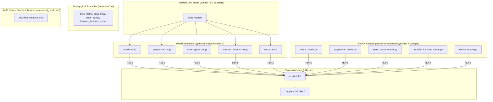

# Numerical Models Integration & Examples (Design Document)


---

### 1. Introduction

This document specifies three nested-crate host surfaces for the five approved
numerical-model types: Matrix, Polynomial, State-Space, Transfer Function, and
Tensor. None of the three trees are root workspace members.

Primary usage scenarios:

1. **Validation (fail-closed CI gates)**: Workspace member
   `control-rs-validation` builds each model's payload in `src/<model>.rs` from
   deliberately ill-conditioned inputs, emits it through
   `src/bin/<model>.rs` to `results/<model>.rust.h5`, and leaves comparison to
   `control-rs-ci`. Python companion oracles (`python3/<model>_oracle.py`;
   NumPy/SciPy, python-flint, harold, TFLite) write
   `results/<model>.<variant>.h5` and the runner 1:1-compares peers against the
   true oracle. Suites are declared once in the repository-root `validate.toml`
   and run one model at a time, so globs do not mix subjects. Validators carry
   no timing.
2. **Pedagogical host examples**: `examples/<model>.rs`, cargo examples of the
   root package, run with `cargo run --example <model>`. Each prints a readable
   narrative plus numeric results on well-conditioned inputs. No HDF5, no
   oracle subprocesses, no true-oracle compare.
3. **Host latency benches**: `benches/numerical_models.rs`, a criterion bench
   of the root package, run with `cargo bench`. Not a CI fail gate. Criterion's
   sample distribution replaces the hand-rolled jitter and scaling arrays the
   validators used to emit.

---

### 2. Requirements

#### 2.1 Functional Requirements

* **FR-1 — Per-model host numerical gate**: Each numerical model has a
  fail-closed host suite that emits results for independent-oracle comparison.
  Latency measurement is not this gate (FR-6).
* **FR-2 — In-process suite orchestration**: A unified host entrypoint
  orchestrates model validations in one cargo execution without external
  shell driver scripts.
* **FR-3 — Fail-closed oracle comparison**: Rust model outputs are compared
  back-to-back against independent reference oracles with explicit error
  bounds, failing closed on a tolerance excursion.
* **FR-5 — Pedagogical host examples**: A reader can run nested example binaries
  that demonstrate each model’s public API with printed results and no oracle/HDF5
  gate. Bound: examples are not a numerical pass/fail gate.
* **FR-6 — Host latency benches**: Dedicated `benches/numerical_models.rs` measures
  kernel latency with `std::time::Instant` and no third-party harness. Bound:
  benches are measurements, not fail-closed numerical claims; no `criterion`
  dependency.

#### 2.2 Non-Functional Requirements

* **NFR-1 — Predictable Execution Footprint**: Core model computations execute
  strictly within stack buffers and fixed-capacity `ArrayStorage`, maintaining
  constant memory residency during kernel execution.
* **NFR-2 — High-Precision Backward Stability**: Linear solves and numerical
  transformations maintain machine-epsilon precision and adhere to strict
  relative and absolute error bounds.
* **NFR-3 — Cross-Platform Determinism**: Numerical algorithms execute
  deterministically across host platforms and bare-metal embedded targets.

#### 2.3 Constraints

* **C-1 — Host Workspace Environment**: Host validation harness executes
  within the dedicated `control-rs-validation` workspace member using a
  crate-root Python 3.12 virtualenv (`.venv`). Install Python packages from
  `control-rs-validation/python3/requirements.txt`.
* **C-2 — Oracle Process Isolation**: Reference oracles execute as isolated
  child subprocesses that write `results/<model>.<variant>.h5`
  (`../vv/oracle-harness-design.md`). Exit code 0 and a flushed HDF5 file
  are the communication contract; JSON on `stdout` is not.
* **C-3 — `#![no_std]` and Zero Dynamic Allocation**: Model algorithms under
  test must compile and execute under `#![no_std]` without dynamic heap
  allocation or host-only standard library features.

---

### 3. Technical Overview

Three host surfaces sit beside the library: `examples/*.rs` and
`benches/*.rs` are targets of the root package, and `control-rs-validation` is
a workspace member depending on `control-rs = { path = ".." }`. Shared Python:
the oracle HDF5 writer is `control-rs-validation/python3/h5_write.py`; the plot
theme is `control-rs-validation/python3/control_rs_plot/`.

Validation uses a **Self-Contained Model Validator Pattern** under
`control-rs-validation/`:

* **Rust Validators**: Located at `src/<model>.rs`. Each exposes `payload()`
  for tests and `run()` for emission; `src/bin/<model>.rs` is the target the
  runner invokes (`cargo run --bin <model>`).
* **Python Oracles**: Located at `python3/<model>_oracle.py`. Suite `commands`
  spawn them; each writes `results/<model>.<variant>.h5`.
* **Cross-Validation**: `control-rs-ci` globs `results/<model>.*.h5` and
  1:1-compares each peer against the suite true oracle using dataset attributes.
* **Results Storage**: One HDF5 file per variant at `results/<model>.<variant>.h5`.

Pedagogical examples live in `examples/<model>.rs` (printed narrative and
numeric results; no HDF5 or oracle gate). Host latency benches live in
`benches/numerical_models.rs` (criterion; not a CI fail gate).

---

### 4. Architecture



---

### 5. Alternatives Considered

1. **External Process Orchestrator vs. Direct In-Process Execution**: An external test harness (such as a pytest or bash driver) could execute each validator binary sequentially. Suite declaration in `validate.toml`, executed by `control-rs-ci`, was chosen instead: one runner builds each emitter, runs its oracle, and compares the containers under a unified Cargo workflow with zero external shell dependencies.
2. **Unified Oracle Monolith vs. Per-Model Companion Scripts**: A single monolithic Python script could compute reference values for all models. Dedicated scripts (`python3/<model>_oracle.py`) were chosen to isolate library dependencies (e.g., JAX for Matrix, python-flint for Polynomial, harold for State-Space and Transfer Function) and allow independent per-model execution.

---

### 6. Verification & Validation

#### 6.1 Approach

- Verify numerical outputs of Matrix, Polynomial, State-Space, Transfer Function, and Tensor against independent reference oracles.
- Enforce fail-closed cross-validation gates across all five numerical models.
- Demonstrate backward stability and zero dynamic heap allocation in execution kernels.

All cross-validation suites declare conformance to the host oracle harness contract ([`oracle-harness-design.md`](../vv/oracle-harness-design.md)):

| Method | Mechanism |
|:---|:---|
| Back-to-back comparison | Host oracle harness (`oracle-harness-design.md`); `control-rs-validation/python3/<model>_oracle.py` via suite `commands` and true-oracle 1:1 compare |
| Requirements-based test | `#[test]` in `control-rs-ci/src/validate/comparator.rs` and `control-rs-ci/src/validate/h5.rs` |
| Resource usage evaluation | `no_alloc` review and static buffer verification |
| On-target execution | ETS suites under QEMU and Teensy |
| Inspection | Host workspace and harness configuration review |

Target: 100% statement coverage of HDF5 comparison logic in
`control-rs-ci/src/validate/comparator.rs` and per-variant I/O in
`control-rs-ci/src/validate/h5.rs`, verified with workspace `cargo ci`.

Excluded from the target:

- The companion Python oracles. They are reference implementations, not code under verification.
- Error paths reachable only from a missing or misconfigured Python environment.
- The model crates themselves. Their coverage targets are stated in their own designs; this document covers the orchestrator only.

Validation is established by running the unified suite orchestrator:
```bash
(cd control-rs-validation && cargo run)
```
Each suite runs `cargo run --release --bin <model>` plus the model's Python
oracle commands, then globs `results/<model>.*.h5` and 1:1-compares peers
against the true oracle using dataset attributes. Host back-to-back numerical
claims are ill-conditioned by construction: Hilbert $n=10$ solve with its
backward residual, monomial Vandermonde on equispaced nodes, explicit inverse
residual, Cholesky across a $10^{10}$ eigenvalue spread, QR orthogonality loss,
Wilkinson residuals in `f64` and `f32`, Horner and Euclidean division on a
16-fold root at $1.01$, convolution across $10^{16}$ of coefficient scale,
companion construction, a 2000-step pendulum trajectory, $5 \times 10^{3}$
stiffness through ZOH, similarity at $\kappa(T) \approx 10^{8}$, rank-deficient
controllability and observability, Tustin and ZOH Bode of a $\zeta = 0.01$
notch, Nyquist margins, and clustered-pole Bode
$H(s)=1/[(s+1)^4(s+1.01)^4]$. Validators record no timing; latency is
`cargo bench`.

Pedagogical examples (not a numerical pass/fail gate):
```bash
cargo run --example matrix
```

Host latency benches (measurements, not fail-closed numerical claims):
```bash
cargo bench --bench numerical_models
```

#### 6.2 Acceptance

This table defines the write-time tolerance keys for `numerical_models` validation, matching `control-rs-validation/tolerances/numerical_models.toml`. Gate verdicts come from HDF5 attributes, not this table:

| Key | Model | Operation | Oracle Library | Measure | Tolerance Bound |
|:---|:---|:---|:---|:---|:---|
| `nmv.matrix.hilbert_solve.scipy` | **Matrix** | Hilbert Solve Forward Error (n=10, kappa ~ 1.6e13) | SciPy | Relative $L_2$ error | $\le 5 \times 10^{-3}$ |
| `nmv.matrix.hilbert_residual.scipy` | **Matrix** | Hilbert Solve Backward Residual | SciPy | Absolute error | $\le 10^{-12}$ |
| `nmv.matrix.vandermonde_solve.scipy` | **Matrix** | Vandermonde Runge Coefficients (n=8, equispaced) | SciPy | Relative $L_2$ error | $\le 10^{-6}$ |
| `nmv.matrix.inverse_residual.scipy` | **Matrix** | Explicit Hilbert Inverse Residual (n=8) | SciPy | Absolute error | $\le 10^{-4}$ |
| `nmv.matrix.cholesky_spread.scipy` | **Matrix** | Cholesky Solve, 1e10 Eigenvalue Spread | SciPy | Relative $L_2$ error | $\le 10^{-6}$ |
| `nmv.matrix.qr_orthogonality.scipy` | **Matrix** | QR Orthogonality Loss, Frobenius | SciPy | Absolute error | $\le 10^{-12}$ |
| `nmv.polynomial.wilkinson.residual_f64` | **Polynomial** | Wilkinson Residual at Roots (f64), Same Order of Magnitude | NumPy | Relative $L_2$ error | $\le 2 \times 10^{0}$ |
| `nmv.polynomial.wilkinson.residual_f32` | **Polynomial** | Wilkinson Residual at Roots (f32) | NumPy | Relative $L_2$ error | $\le 10^{-2}$ |
| `nmv.polynomial.wilkinson.residual_f64_flint` | **Polynomial** | Wilkinson Residual at Roots (256-bit ball) | python-flint `arb_poly` (256-bit) | Relative $L_2$ error | $\le 2 \times 10^{0}$ |
| `nmv.polynomial.clustered_horner.values` | **Polynomial** | Horner on a 16-fold Root at 1.01 | NumPy | Relative $L_2$ error | $\le 10^{-7}$ |
| `nmv.polynomial.clustered_division.quot` | **Polynomial** | Quotient by a Near-Exact Linear Factor | NumPy | Relative $L_2$ error | $\le 10^{-9}$ |
| `nmv.polynomial.clustered_division.rem` | **Polynomial** | Remainder by a Near-Exact Linear Factor | NumPy | Absolute error | $\le 10^{-6}$ |
| `nmv.polynomial.scaled_product.coeffs` | **Polynomial** | Convolution Across 1e16 of Coefficient Scale | NumPy | Relative $L_2$ error | $\le 10^{-14}$ |
| `nmv.polynomial.companion.matrix` | **Polynomial** | Companion Matrix Construction | NumPy | Absolute error | $\le 10^{-12}$ |
| `nmv.state_space.phase_portrait.theta.scipy` | **State-Space** | 2000-step Trajectory, Position | SciPy | Relative $L_2$ error | $\le 10^{-9}$ |
| `nmv.state_space.phase_portrait.theta_dot.scipy` | **State-Space** | 2000-step Trajectory, Rate | SciPy | Relative $L_2$ error | $\le 10^{-9}$ |
| `nmv.state_space.stiff_zoh.ad` | **State-Space** | ZOH Discrete A, 5e3 Stiffness Ratio | SciPy | Relative $L_2$ error | $\le 10^{-7}$ |
| `nmv.state_space.stiff_zoh.ad_harold` | **State-Space** | ZOH Discrete A, 5e3 Stiffness Ratio | harold | Relative $L_2$ error | $\le 10^{-7}$ |
| `nmv.state_space.stiff_zoh.bd` | **State-Space** | ZOH Discrete B, 5e3 Stiffness Ratio | SciPy | Relative $L_2$ error | $\le 10^{-4}$ |
| `nmv.state_space.stiff_step.y` | **State-Space** | Stiff Step Response, 500 Samples | SciPy | Relative $L_2$ error | $\le 10^{-4}$ |
| `nmv.state_space.similarity.a_tilde` | **State-Space** | Similarity Transform, kappa(T) ~ 1e8 | SciPy | Relative $L_2$ error | $\le 10^{-9}$ |
| `nmv.state_space.ctrb.matrix` | **State-Space** | Controllability Matrix, Graded Modes | SciPy | Relative $L_2$ error | $\le 10^{-9}$ |
| `nmv.state_space.obsv.matrix` | **State-Space** | Observability Matrix, Graded Modes | SciPy | Relative $L_2$ error | $\le 10^{-9}$ |
| `nmv.transfer_function.discretization.cont_mag_db` | **Transfer Function** | Continuous Bode Magnitude | SciPy `signal.freqs` | Absolute error | $\le 10^{-3}\text{ dB}$ |
| `nmv.transfer_function.discretization.cont_phase_deg` | **Transfer Function** | Continuous Bode Phase | SciPy `signal.freqs` | Absolute error | $\le 10^{-2\circ}$ |
| `nmv.transfer_function.discretization.tustin_mag_db` | **Transfer Function** | Tustin Discretized Magnitude | SciPy `signal.cont2discrete` | Absolute error | $\le 10^{-3}\text{ dB}$ |
| `nmv.transfer_function.discretization.tustin_phase_deg` | **Transfer Function** | Tustin Discretized Phase | SciPy `signal.cont2discrete` | Absolute error | $\le 10^{-2\circ}$ |
| `nmv.transfer_function.discretization.zoh_mag_db` | **Transfer Function** | ZOH Discretized Magnitude | SciPy `signal.cont2discrete` | Absolute error | $\le 10^{-3}\text{ dB}$ |
| `nmv.transfer_function.discretization.zoh_phase_deg` | **Transfer Function** | ZOH Discretized Phase | SciPy `signal.cont2discrete` | Absolute error | $\le 10^{-2\circ}$ |
| `nmv.transfer_function.nyquist.h_re` | **Transfer Function** | Nyquist Locus Real | SciPy `signal.freqs` | Absolute error | $\le 10^{-3}$ |
| `nmv.transfer_function.nyquist.h_im` | **Transfer Function** | Nyquist Locus Imag | SciPy `signal.freqs` | Absolute error | $\le 10^{-3}$ |
| `nmv.transfer_function.nyquist.phase_margin_deg` | **Transfer Function** | Nyquist Phase Margin | SciPy | Absolute error | $\le 0.5^\circ$ |
| `nmv.transfer_function.nyquist.gain_margin_db` | **Transfer Function** | Nyquist Gain Margin | SciPy | Absolute error | $\le 0.5\text{ dB}$ |
| `nmv.transfer_function.harold.cont_mag_db` | **Transfer Function** | Continuous Bode Magnitude | harold `Transfer` | Absolute error | $\le 10^{-3}\text{ dB}$ |
| `nmv.transfer_function.harold.cont_phase_deg` | **Transfer Function** | Continuous Bode Phase | harold `Transfer` | Absolute error | $\le 10^{-2\circ}$ |
| `nmv.transfer_function.harold.tustin_mag_db` | **Transfer Function** | Tustin Discretized Magnitude | harold `discretize` | Absolute error | $\le 10^{-3}\text{ dB}$ |
| `nmv.transfer_function.harold.tustin_phase_deg` | **Transfer Function** | Tustin Discretized Phase | harold `discretize` | Absolute error | $\le 10^{-2\circ}$ |
| `nmv.transfer_function.harold.zoh_mag_db` | **Transfer Function** | ZOH Discretized Magnitude | harold `discretize` | Absolute error | $\le 10^{-3}\text{ dB}$ |
| `nmv.transfer_function.harold.zoh_phase_deg` | **Transfer Function** | ZOH Discretized Phase | harold `discretize` | Absolute error | $\le 10^{-2\circ}$ |
| `nmv.transfer_function.harold.h_re` | **Transfer Function** | Nyquist Locus Real | harold `frequency_response` | Absolute error | $\le 10^{-3}$ |
| `nmv.transfer_function.harold.h_im` | **Transfer Function** | Nyquist Locus Imag | harold `frequency_response` | Absolute error | $\le 10^{-3}$ |
| `nmv.transfer_function.harold.phase_margin_deg` | **Transfer Function** | Nyquist Phase Margin | harold | Absolute error | $\le 0.5^\circ$ |
| `nmv.transfer_function.harold.gain_margin_db` | **Transfer Function** | Nyquist Gain Margin | harold | Absolute error | $\le 0.5\text{ dB}$ |
| `nmv.transfer_function.clustered_pole.mag_db` | **Transfer Function** | Clustered-Pole Bode Magnitude | SciPy `signal.freqs` | Absolute error | $\le 10^{-3}\text{ dB}$ |
| `nmv.transfer_function.clustered_pole.phase_deg` | **Transfer Function** | Clustered-Pole Bode Phase | SciPy `signal.freqs` | Absolute error | $\le 10^{-2\circ}$ |
| `nmv.tensor.manifold.interp_mesh` | **Tensor** | Manifold Interpolation Mesh | SciPy `RegularGridInterpolator` | Absolute error | $\le 10^{-4}$ |
| `nmv.tensor.contraction.mat_c` | **Tensor** | Tensor Contraction Matrix C | SciPy / ONNX Runtime | Relative error | $\le 10^{-4}$ |
| `nmv.tensor.boundaries.q_raw` | **Tensor** | Q7 Raw Byte Exactness | NumPy bit-exact | Exact equality | $0$ element mismatches |
| `nmv.tensor.boundaries.act_outputs` | **Tensor** | Table Activation Outputs | SciPy `tanh` | Absolute error | $\le 10^{-3}$ |
| `nmv.tensor.boundaries.tflite_dequant` | **Tensor** | TFLite Dequantized Closeness | TensorFlow Lite int8 | Absolute error | $\le 0.05$ |

#### 6.3 Limits

- GPU-accelerated JAX backends (CUDA/ROCm) are not evaluated; JAX runs on the CPU backend in x64 mode.
- Non-x86_64/AArch64 host platforms are unverified for python-flint (arb) and JAX.
- On-target execution in firmware binaries is limited to `math` and `matrix` test suites due to flash-footprint constraints on embedded targets. NFR-3 is therefore discharged for those two suites only; on-target behaviour of the remaining models is not established by this plan.
- Higham $\gamma$ Wilkinson residual bounds and the f32≻f64 residual hierarchy previously encoded in the polynomial JSON comparator are not datasets in the live HDF5 gate. They remain literature-backed numerical claims, not container keys. The live Wilkinson key uses measure `lt` (flint residual strictly below the Rust residual, with magnitude $\le 10^{-6}$). Independent NumPy and Rust Wilkinson *coefficient constructions* disagree at the outer roots by construction; that residual pair is not a B2B key.
- Adaptive root-locus *intermediate* gain meshes that SciPy cannot reproduce remain a unit-test claim (`classical-tools-design.md` FR-3). Uniform-gain buck locus poles are gated.
- **Withdrawn FR-4 (high-resolution operation timing)**: validators do not record timing. Latency is FR-6 benches, not this gate.

---

### 8. Risks & Open Questions

- **Subprocess Spawn Latency**: Spawning Python subprocesses per validator incurs process creation latency. Acceptable for offline V&V, but prohibits integration into continuous hard real-time test loops.
- **Python Environment Isolation**: Host validation requires Python 3.12 with SciPy, JAX, python-flint, and harold installed in `.venv` at crate root (`pip install` from `control-rs-validation/python3/requirements.txt`). Missing packages cause fail-closed test execution.
- **Hardware FPU Discrepancies**: Trans-architecture floating-point bitwise parity between host x86_64/AArch64 (FMA) and embedded Cortex-M4/M7 FPUs is not claimed; tolerances are bounded via interval/residual norms rather than bitwise equivalence.

---

### 9. Development Plan

| Task / Feature | Description | Estimated Effort |
|:---|:---|:---|
| **Phase 1: Validator Infrastructure** | Standardize HDF5 schema and subprocess orchestration harness via `control-rs-ci`. | 2.0 Days |
| **Phase 2: Individual Validators** | Implement standalone Rust validation binaries for Matrix, Polynomial, State-Space, Transfer Function, and Tensor. | 3.5 Days |
| **Phase 3: Python Companion Oracles** | Implement reference scripts in NumPy, SciPy, JAX x64, python-flint, and harold. | 3.0 Days |
| **Phase 4: In-Process Suite Orchestrator** | Construct central `src/main.rs` executing all validators in-process with summary envelope emission. | 1.5 Days |
| **Phase 5: Automated Verification** | Enforce 100% statement coverage of gate logic and verify error-bound handling. | 2.0 Days |
| **Phase 6: Pedagogical Examples & Host Benches** | Cargo examples `examples/<model>.rs` and criterion bench `benches/numerical_models.rs` on the root package. Examples print narrative plus numeric results with no oracle/HDF5 gate. Benches measure kernel latency. Validation moves to the `control-rs-validation` workspace member and drops its timing and example-mirroring payloads. | 2.0 Days |

---

### 10. Revision History

| Revision | Date              | Author          | Description                                                                                                                                                                                                                                                         |
|:---------|:------------------|:----------------|:---------------------------------------------------------------------------------------------------------------------------------------------------------------------------------------------------------------------------------------------------------------------|
| 1.15     | August 28, 2026   | @MitchellDScott | Multi-source validators (`rust-row`, Apple `rust-accelerate`).                                                                                                                                                                                                      |
| 1.16     | August 29, 2026   | @MitchellDScott | Overhauled validation architecture to use Universal Orchestrator (`validate.rs`).                                                                                                                                                                                   |
| 1.17     | August 29, 2026   | @MitchellDScott | Migrated to self-contained model validators (`src/<model>_validation.rs` & `python3/<model>_validation.py`), added central in-process `src/main.rs` orchestrator, integrated strict `cross_validation()` checking, and added tight nanosecond operation timers. |
| 1.18     | August 31, 2026   | @MitchellDScott | Added alternative-library oracles (JAX x64, python-flint 256-bit arb ball arithmetic, and harold LTI toolbox) across cross-validation suites, reconciled covariance heatmap vs direct inversion tolerances, and updated validation paths.                      |
| 1.19     | September 8, 2026 | @MitchellDScott | Restructured into conformant §6 (6.1–6.7) with bidirectional traceability and declared conformance to host oracle harness contract.                                                                                                                            |
| 1.20     | September 9, 2026 | @MitchellDScott | Structural hardening: restored §2.3 Constraints, §8 Risks, §9 Dev Plan, §10 RevHist, and References; renamed FRs to need-named statements.                                                                                                                         |
| 1.21     | September 12, 2026 | @MitchellDScott | Migrated numerical-models suite to pure HDF5 single-container persistence (`results/<model>.h5`) via pure-Rust `rust-hdf5` with embedded `/manifest/directory.toml`, updated diagnostic `plot_models.py` to read directly from HDF5 via `h5py`, and integrated gate-side verdict re-derivation in `control-rs-ci`. |
| 1.23     | September 12, 2026 | @MitchellDScott | Host B2B keys for Hilbert/LU/GEMM/inverse, clustered-root Horner, companion/division, similarity/ctrb/obsv, stiff ZOH, and clustered-pole Bode. |
| 1.24     | September 15, 2026 | @MitchellDScott | Split host surfaces into validation/, examples/, and bench/; relocate numerical-model oracles to control-rs-validation. |
| 1.25     | September 15, 2026 | @MitchellDScott | Split the numerical-model host surfaces into the standard cargo layout: pedagogical demos became `examples/*.rs` on the root package, timing moved to the criterion benches in `benches/`, and validation became the `control-rs-validation` workspace member. Validator payloads were rebuilt around ill-conditioned kernels (Hilbert $n=10$, monomial Vandermonde, graded Cholesky, QR orthogonality loss, Wilkinson, a 16-fold root, $5 \times 10^{3}$ stiffness) and no longer restate the examples or record timing. 6.3 regenerated from `tolerances/numerical_models.toml`. |
| 1.26     | September 15, 2026 | @MitchellDScott | FR-1 named from the gate need; FR-4 timing withdrawn (FR-6 owns benches). |
| 1.27     | September 16, 2026 | @MitchellDScott | Retired `vv-standards.md`: dropped the §9 pointer; `design-template.md` §6 is the V&V contract. |

---

## References
 
[1] N. J. Higham, *Accuracy and Stability of Numerical Algorithms*, 2nd ed. Philadelphia, PA, USA: SIAM, 2002.

[2] E. Anderson et al., *LAPACK Users' Guide*, 3rd ed. Philadelphia, PA, USA: SIAM, 1999.

[3] C. F. Van Loan, "Computing integrals involving the matrix exponential," *IEEE Trans. Autom. Control*, vol. 23, no. 3, pp. 395–404, Jun. 1978.

[4] F. Johansson, "Arb: Efficient arbitrary-precision midpoint-radius interval arithmetic," *IEEE Trans. Comput.*, vol. 66, no. 8, pp. 1281–1292, Aug. 2017.

[5] J. Bradbury et al., "JAX: composable transformations of Python+NumPy programs," version 0.4, 2018. [Online]. Available: http://github.com/google/jax.

[6] P. Virtanen et al., "SciPy 1.0: Fundamental Algorithms for Scientific Computing in Python," *Nat. Methods*, vol. 17, pp. 261–272, 2020.