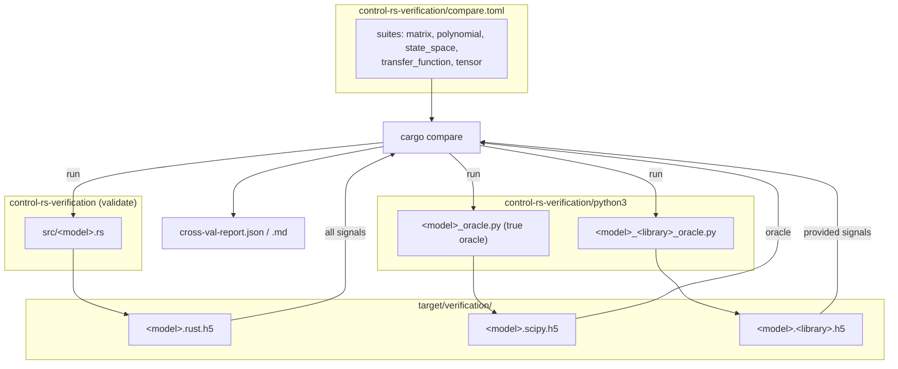

# Numerical Models Integration & Examples (Design Document)

---

### 1. Introduction

This document specifies host-side cross-validation of the five numerical-model
types (Matrix, Polynomial, State-Space, Transfer Function and Tensor) against
independent reference libraries.

Primary usage scenarios:

1. **Rust Emitters**: `control-rs-verification` computes each model's test
   cases with `control-rs` and writes `target/verification/<model>.rust.h5`.
2. **Reference Oracles**: Python scripts in `control-rs-verification/python3/`
   compute the same cases and write one container per library:
   `<model>_oracle.py` (NumPy/SciPy, the true oracle) and
   `<model>_<library>_oracle.py` (JAX, python-flint, ONNX Runtime, TFLite).
3. **Comparison**: `cargo compare` runs every variant declared in
   `control-rs-verification/compare.toml` and compares each container against
   the SciPy oracle under the dataset tolerances.

---

### 2. Requirements

#### 2.1 Functional Requirements

* **FR-1 — Per-Model Emission**: `validate <model>` (or `validate` for all
  five) writes `target/verification/<model>.rust.h5` containing every signal in §5.1 for
  that model.
* **FR-2 — Independent Reference Oracles**: Each model has a SciPy/NumPy
  oracle; alternative-library oracles are listed in §4. Each oracle is a
  separate `python_script` variant writing
  `target/verification/<model>.<library>.h5`.
* **FR-3 — Tolerance Metadata**: The SciPy oracle attaches `measure` and
  `bound` to every dataset, and `bound.<library>` where an alternative oracle
  is held to a different bound.
* **FR-4 — Signal Coverage**: The Rust container provides every SciPy signal.
  An alternative oracle may omit a signal only where the SciPy dataset carries
  `missing_ok.<library>`.

#### 2.2 Non-Functional Requirements

* **NFR-1 — Zero Dynamic Heap Allocation**: Model computations under test use
  `ArrayStorage` or static buffers; the emitter allocates only for container
  serialization.
* **NFR-2 — High-Precision Backward Stability**: Linear solves and numerical
  transformations meet the bounds in §5.1.
* **NFR-3 — Bare-Metal Portability**: The algorithms under test are the same
  `no_std` implementations that run on target.

#### 2.3 Constraints

* **C-1 — Harness Boundary**: `control-rs-verification` depends on
  `control-rs` only for the models under test. Execution and comparison
  belong to `control-rs-compare` ([cross-compare-design](../vv/cross-compare-design.md)).
* **C-2 — Timing Out of Scope**: Performance and jitter are measured by the
  criterion benches (`benches/`) and the `regression` gate, not by this suite.

---

### 3. Technical Overview

* **Rust Emitters**: `control-rs-verification/src/<model>.rs`, dispatched by
  `src/main.rs` (`validate [<model>|all]`). `H5Writer` writes nested groups
  (`<case>/<signal>`) with tolerance attributes.
* **SciPy Oracle**: `python3/<model>_oracle.py`, the `true_oracle` of each
  suite. It carries the tolerance metadata for every peer.
* **Alternative Oracles**: `python3/<model>_<library>_oracle.py`, each an
  additional variant of the model's suite.
* **Comparison**: `control-rs-compare` compares every peer container against
  the SciPy container per signal and writes `cross-val-report.{json,md}`.
  The `cross-compare` gate runs it in CI.

---

### 4. Architecture

| Suite | Rust signals | Alternative oracles |
|:--|:--|:--|
| `matrix` | `covariance_heatmap`, `hilbert_solve`, `vandermonde_solve`, `cholesky_spread`, `qr_orthogonality` | `jax` (all signals) |
| `polynomial` | `tutorial`, `root_convergence`, `wilkinson_residual` | `flint` (`tutorial`; others `missing_ok`) |
| `state_space` | `discretization`, `phase_portrait`, `transient` | none |
| `transfer_function` | `realization`, `bode`, `nyquist` | none |
| `tensor` | `manifold`, `contraction`, `boundaries`, `activation` | `onnx` (`contraction`), `tflite` (`activation`); others `missing_ok` |

---

### 5. Verification & Validation

#### 5.1 Tolerance & Acceptance Criteria

Bounds are absolute unless marked relative. An alternative oracle uses the
SciPy bound unless a separate bound is listed.

| Model | Signal | Case | Oracle | Bound |
|:--|:--|:--|:--|:--|
| **Matrix** | `covariance_heatmap/matrix` | 100-step 8×8 EKF covariance recursion | SciPy / NumPy | $10^{-4}$ |
| | | | JAX x64 | $10^{-6}$ |
| **Matrix** | `hilbert_solve/x`, `/residual` | $10 \times 10$ Hilbert LU solve | SciPy, JAX | $5 \times 10^{-2}$, $10^{-12}$ |
| **Matrix** | `vandermonde_solve/x` | 8-node Runge Vandermonde solve | SciPy, JAX | $10^{-3}$ |
| **Matrix** | `cholesky_spread/x` | Cholesky, eigenvalue spread $10^{10}$ | SciPy, JAX | $10^{-3}$ |
| **Matrix** | `qr_orthogonality/residual` | $\lVert Q^\top Q - I \rVert_F$, near-rank-deficient $6 \times 6$ | SciPy, JAX | $10^{-6}$ |
| **Polynomial** | `tutorial/p_real`, `p_c_re`, `p_c_im` | $(x-2)(x-3)(x-5)$ at $2.5$ and $1+2i$ | NumPy | $10^{-6}$ |
| | | | python-flint `arb_poly` / `acb_poly` (256-bit) | $10^{-9}$ |
| **Polynomial** | `root_convergence/iterations` | Newton iterations from 11 start distances | NumPy | 2 iterations |
| **Polynomial** | `wilkinson_residual/residual_f64`, `residual_f32` | Wilkinson $W_{20}$ residual at its roots | NumPy | relative $0.05$, $10$ |
| **State-Space** | `discretization/a_d`, `b_d` | ZOH, $T_s = 0.05$ s | SciPy `cont2discrete` | $10^{-4}$ |
| **State-Space** | `phase_portrait/theta`, `theta_dot` | 200-step free response | SciPy | $10^{-4}$ |
| **State-Space** | `transient/step_data` | 100-step unit step | SciPy | $10^{-4}$ |
| **Transfer Function** | `realization/ccf_a`, `ccf_b`, `ccf_c` | CCF of $(2s+3)/(s^2+5s+4)$ | SciPy `tf2ss` (state order reversed) | $10^{-12}$ |
| **Transfer Function** | `bode/*_mag_db`, `bode/*_phase_deg` | Notch-lowpass, continuous, Tustin and ZOH at $T_s = 5$ ms | SciPy `freqs` / `dfreqresp` | $0.1$ dB, $0.5°$ (ZOH $0.2$ dB, $1°$) |
| **Transfer Function** | `nyquist/h_re`, `h_im` | Open-loop $(50s+100)/(s^3+2s^2+25s)$ locus | SciPy | $0.05$ |
| **Transfer Function** | `nyquist/gain_margin_db`, `phase_margin_deg` | Same loop | SciPy | $1$ dB, $1°$ |
| **Tensor** | `manifold/interp_mesh` | $16 \times 16$ saddle table, $20 \times 20$ evaluation | SciPy `RegularGridInterpolator` | $0.05$ |
| **Tensor** | `contraction/mat_c` | $16 \times 16$ `f32` contraction | NumPy, ONNX Runtime `MatMul` | $2 \times 10^{-4}$ |
| **Tensor** | `boundaries/q_raw` | `Quantized<i8, 7>` raw value of 14 boundary inputs | Python bit-exact Q7 | exact |
| **Tensor** | `boundaries/act_outputs` | Q7 round trip of LUT tanh at the boundary inputs | Python Q7 | $0.02$ |
| **Tensor** | `activation/act_outputs` | 61-breakpoint `TableActivation` tanh, 121 points on $[-3, 3]$ | NumPy `tanh` | $10^{-3}$ |
| | | | TFLite int8 tanh | $0.05$ |

#### 5.2 Not Yet Covered

Acceptance items specified in the model designs with no signal in the suite:

| Model | Item |
|:--|:--|
| Matrix | Inversion identity check $\lVert A A^{-1} - I \rVert_\infty \le 10^{-12}$; backward-stability ratio $\lVert Ax-b\rVert_\infty / (\lVert A\rVert_\infty \lVert x\rVert_\infty \varepsilon) < 20$ |
| Polynomial | Calculus (`polyder` / `polyint`), Euclidean division, companion realization, clustered-root sweep $(x-1)^8(x-1.01)^8$, python-flint Wilkinson ground-truth residual |
| State-Space | Continuous derivative, similarity transforms, stiff plant $A=\mathrm{diag}(-200,-0.5)$ |
| Transfer Function | Clustered-pole response $1/[(s+1)^4(s+1.01)^4]$ |
| Tensor | 3×3 affine table interpolation, `Relu` on quantized inputs |

---

### 6. Revision History

| Revision | Date                | Author              | Description                                                                                                                                                                                                                                                         |
|----------|---------------------|---------------------|---------------------------------------------------------------------------------------------------------------------------------------------------------------------------------------------------------------------------------------------------------------------|
| 1.15     | August 28, 2026     | @MitchellDScott     | Multi-source validators (`rust-row`, Apple `rust-accelerate`).                                                                                                                                                                                                      |
| 1.16     | August 29, 2026     | @MitchellDScott     | Overhauled validation architecture to use Universal Orchestrator (`validate.rs`).                                                                                                                                                                                   |
| 1.17     | August 29, 2026     | @MitchellDScott     | Migrated to self-contained model validators (`src/<model>_validation.rs` & `python3/<model>_validation.py`), added central in-process `src/main.rs` orchestrator, integrated strict `cross_validation()` checking, and added tight nanosecond operation timers. |
| **1.18** | **August 31, 2026** | **@MitchellDScott** | **Added alternative-library oracles (JAX x64, python-flint 256-bit arb ball arithmetic, and harold LTI toolbox) across cross-validation suites, reconciled covariance heatmap vs direct inversion tolerances, and updated validation paths.**                      |
| 1.19     | September 22, 2026  | @MitchellDScott     | Restated for the `control-rs-verification` / `cargo compare` architecture: per-model HDF5 emitters writing to `target/verification/`, SciPy true oracle, alternative-library oracles (JAX, python-flint, ONNX Runtime, TFLite) as suite variants with per-peer bounds and `missing_ok.<library>` omissions, restored CCF realization, Q7 raw and `TableActivation` sweep signals; timing moved to criterion benches. |
