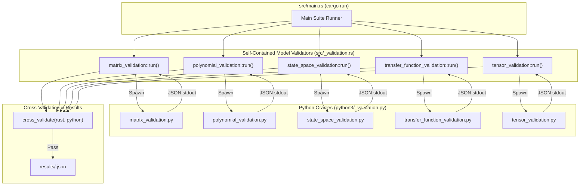

# Numerical Models Integration & Examples (Design Document)

---

### 1. Introduction

This document specifies standalone examples and host-side numerical oracles for
the five approved numerical-model types: Matrix, Polynomial, State-Space,
Transfer Function, and Tensor.

Primary usage scenarios:

1. **Standalone Model Validators**: Self-contained Rust validator binaries in
   `examples/numerical-models-validation/src/<model>_validation.rs` that execute
   computations natively, measure tight nanosecond timing, spawn their Python
   companion oracle, and run embedded cross-validation tolerance checks.
2. **Host-Side Oracles**: Standalone Python (NumPy/SciPy) companion scripts in
   `examples/numerical-models-validation/python3/<model>_validation.py` that calculate
   equivalent oracle outputs with nanosecond performance timing and return JSON on `stdout`.
3. **In-Process Main Orchestrator**: A central entrypoint in `src/main.rs` (`cargo run`
   or `cargo run --bin validate`) that invokes each model's `run()` function directly
   in-process, executing all cross-language validations and saving combined payloads to
   `results/<model>.json`.

---

### 2. Requirements

#### 2.1 Functional Requirements

* **FR-1 — Comprehensive Exemplary Applications**: The system shall provide
  standalone executable example binaries (`matrix`, `polynomial`, `state_space`,
  `transfer_function`, `tensor`) demonstrating end-to-end numerical computation.
* **FR-2 — Direct In-Process Orchestration**: `src/main.rs` shall execute each model's
  validation pipeline directly in-process without relying on external file-based suite
  configs or external runner harnesses.
* **FR-3 — Embedded Cross-Validation**: Each validator shall include a `cross_validate()`
  function that cross-references Rust and Python outputs against strict mathematical error bounds.
* **FR-4 — Tight Nanosecond Timing**: All computation kernels in both Rust and Python
  shall record high-precision nanosecond timings (`_time_ns`) tight to the operation.

#### 2.2 Non-Functional Requirements

* **NFR-1 — Zero Dynamic Heap Allocation**: Core model computations shall operate
  strictly within `ArrayStorage` or static buffers without dynamic heap allocation during kernel execution.
* **NFR-2 — High-Precision Backward Stability**: Linear solves and numerical transformations
  shall maintain machine-epsilon precision and adhere to strict relative/absolute error bounds.
* **NFR-3 — Bare-Metal Portability**: All numerical algorithms shall execute
  deterministically across host platforms and `no_std` bare-metal embedded targets.

---

### 3. Technical Overview

The architecture uses a **Self-Contained Model Validator Pattern**:

* **Rust Validator Binaries**: Located at `src/<model>_validation.rs`. Exposes both `run()` for in-process execution and `main()` for standalone target execution (`cargo run --bin <model>`).
* **Python Oracles**: Located at `python3/<model>_validation.py`. Invoked directly by the Rust validator as a subprocess, returning NumPy/SciPy reference values with tight nanosecond timing via `stdout`.
* **Cross-Validation**: Performed by `cross_validate(&rust, &python)` in each Rust module, verifying that Rust results match Python oracle calculations within prescribed tolerances.
* **Results Storage**: Saves combined Rust and Python payloads to `results/<model>.json`.

---

### 4. Architecture

---

### 5. Verification & Validation

#### 5.1 Tolerance & Acceptance Criteria

| Model | Operation | Oracle | Tolerance Bound |
|---|---|---|---|
| **Matrix** | Backward Stability Solve | SciPy `lu_solve` | $\lVert Ax-b\rVert_\infty / (\lVert A\rVert_\infty \lVert x\rVert_\infty \varepsilon) < 20$ |
| **Matrix** | Matrix Inversion | SciPy `inv` | Absolute error $\le 10^{-12}$, $\lVert AA^{-1} - I\rVert_\infty \le 10^{-12}$ |
| **Polynomial** | Real / Complex Horner & Calculus | NumPy `polyval` / `polyder` / `polyint` | Absolute error $\le 10^{-12}$ |
| **Polynomial** | Clustered-root Sweep | NumPy `polyval` | Relative error $\le 10^{-6}$ |
| **State-Space** | Derivative & ZOH ($A_d, B_d$) | SciPy `signal.cont2discrete` | Absolute error $\le 10^{-12}$ |
| **State-Space** | Trajectories (`step_y`, `free_x`) | SciPy `signal.dlsim` | Absolute error $\le 10^{-6}$ |
| **Transfer Function** | Bode Frequency Response | SciPy `signal.freqs` | Absolute error $\le 10^{-6}$ |
| **Transfer Function** | CCF Realization | SciPy `signal.tf2ss` | Absolute error $\le 10^{-12}$ |
| **Tensor** | 2D Affine & Saddle Grid Interp | SciPy `RegularGridInterpolator` | Absolute error $\le 10^{-6}$ (Affine), $\le 10^{-4}$ (Saddle) |
| **Tensor** | Fixed-Point Q7 Quantization | Python bit-exact oracle | Exact raw representation; dequantization error $\le 1/256$ |

---

### 6. Revision History

| Revision | Date | Author | Description |
|---|---|---|---|
| 1.15 | August 28, 2026 | @MitchellDScott | Multi-source validators (`rust-row`, Apple `rust-accelerate`). |
| 1.16 | August 29, 2026 | @MitchellDScott | Overhauled validation architecture to use Universal Orchestrator (`validate.rs`). |
| **1.17** | **August 29, 2026** | **@MitchellDScott** | **Migrated to self-contained model validators (`src/<model>_validation.rs` & `python3/<model>_validation.py`), added central in-process `src/main.rs` orchestrator, integrated strict `cross_validation()` checking, and added tight nanosecond operation timers.** |