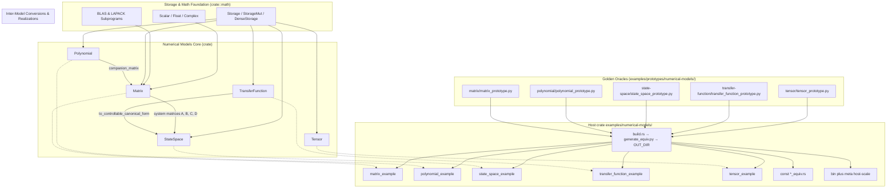

# Numerical Models Integration & Examples (Design Document)

---

### 1. Introduction

This document specifies standalone examples and host-side numerical oracles
for the five Approved numerical-model types. Matrix, polynomial, state-space,
transfer-function, and tensor behavior is specified in those designs; this
document does not restate it (C-4).

Primary usage scenarios:

1. **Standalone examples**: A nested host crate in `examples/numerical-models/`
   whose example binaries demonstrate idiomatic use of each Approved sibling
   type. Small crate tests assert agreement with SciPy const tables generated
   at build time.
2. **Host-side oracles**: Python (NumPy/SciPy) prototypes under
   `examples/prototypes/numerical-models/<slug>/` that emit Rust const tables
   and host-scale binary goldens into `OUT_DIR` during the example-crate
   build. MATLAB companions are optional and unused.
3. **Host-scale verification**: The same nested crate, with `std` available,
   runs cache-stressing and ill-conditioned cases on `ArrayStorage` (no
   heap). Tutorial binaries stay small. These cases do not discharge sibling
   MCU stack caps or ETS.

---

### 2. Requirements

#### 2.1 Functional Requirements

- **FR-1 — Comprehensive Exemplary Applications**: The system shall provide
  standalone executable example binaries in `examples/numerical-models/`
  demonstrating end-to-end execution of matrix linear solving, polynomial
  evaluation, state-space simulation, transfer function frequency response,
  and tensor grid interpolation.
- **FR-2 — Numerical Prototype Equivalence**: The system shall provide
  companion NumPy/SciPy prototype scripts under
  `examples/prototypes/numerical-models/<slug>/` that compute identical
  mathematical scenarios. The nested example crate's `build.rs` runs those
  scripts so generated Rust sources are present whenever that crate's tests
  compile.
- **FR-3 — Host-Scale Oracle Stress Cases**: Host crate tests shall execute
  cache-stressing and ill-conditioned cases against SciPy goldens.
  Ill-conditioned
  operands expose forward-error growth with $\kappa\varepsilon$ (Higham, 2002).
  Tutorial binaries and ETS suites are not required to run those sizes.
  Host-scale storage is `ArrayStorage` (`Const<1024>: Dim`); it does not
  use a heap buffer and does not discharge sibling MCU stack caps.

#### 2.2 Non-Functional Requirements

- **NFR-1 — Zero Dynamic Heap Allocation**: Library operations, ETS suites,
  tutorial example binaries, and FR-3 host-scale tests shall operate strictly
  within `ArrayStorage` or borrowed views over that storage, without runtime
  heap allocators.
- **NFR-2 — Numerical Backward Stability & Precision**: Numerical calculations
  shall maintain machine-epsilon precision and adhere to standard backward
  error tolerances for floating-point and fixed-point computations (Higham,
  2002). Host-scale comparison to SciPy uses the condition-scaled forward
  error of §6.3, not a static absolute constant.
- **NFR-3 — Bare-Metal Portability**: All numerical algorithms shall execute
  deterministically across both host systems and bare-metal embedded targets
  (`no_std`) including ARM Cortex-M and RISC-V architectures (Soro, 2021).
- **NFR-4 — Complexity-Scaled Timing Measurement**: Host-scale operations
  shall report wall time against the FLOP-count model in §7. Timing is a
  measurement, not a `cargo ci` gate.

#### 2.3 Constraints

- **C-1 — Compile-Time Dimension Verification**: Matrix, polynomial,
  state-space, and transfer function dimensions shall be verified at compile
  time using constant generics and dimension type traits to prevent runtime
  dimension mismatch panics.
- **C-2 — Native Rust Implementation**: All algorithms and numerical models
  shall be native Rust implementations without relying on C foreign function
  interfaces (FFI), host-to-target code generation pipelines, or external
  linear algebra libraries.
- **C-3 — Deterministic Execution & Fallibility**: Library functions shall not
  invoke `unwrap()`, `expect()`, or `panic!()`, returning explicit crate-local
  `Result<T, Error>` types for ill-conditioned or singular system operations.
- **C-4 — Sibling Capabilities Out of Scope**: Matrix, polynomial,
  state-space, transfer-function and tensor functional behavior is specified
  in their own Approved design docs (`matrix-design.md`,
  `polynomial-design.md`, `state-space-design.md`,
  `transfer-function-design.md`, `tensor-design.md`); this document does not
  restate it.

---

### 3. Technical Overview

The `numerical-models` ecosystem within `control-rs` encompasses five primary
core models:

1. `Matrix<T, R, C, S>` in `src/matrix/`: Statically dimensioned 2D matrix
   engine backed by the decoupled storage abstraction (`crate::math::storage`).
2. `Polynomial<T, N, S>` in `src/polynomial/`: Single-variable polynomial
   arithmetic engine with Horner evaluation, differentiation, integration, and
   companion matrix construction.
3. `StateSpaceCore<T, NX, NU, NY, Sa, Sb, Sc, Sd>` in `src/state_space/`:
   Continuous and discrete linear time-invariant (LTI) state-space simulator and
   coordinate transformer.
4. `TransferFunction<T, N, D, Sn, Sd>` in `src/transfer_function/`: Rational
   SISO transfer function engine with Bode analysis, cascade interconnections,
   and controllable canonical realization.
5. `Tensor<T, L, B>` in `src/tensor/`: Multidimensional array container
   supporting fast multilinear grid interpolation and fixed-point quantized
   scalar inference.

To facilitate developer onboarding, verification, and regression tracking,
dedicated example applications located under `examples/numerical-models/` paired
with host-side verification prototype scripts located under
`examples/prototypes/numerical-models/` will showcase practical,
production-grade workflows for each model.

---

### 4. Architecture

#### 4.1 Standalone Example Architecture

The example suite is a nested host crate (`control-rs-numerical-model-examples`)
under `examples/numerical-models/` with its own `[workspace]`, matching
`examples/qemu/` and `examples/subprograms/`. It is not a root workspace
member, so `cargo test -p control-rs` and `cargo lint` do not require Python.
Python oracles live in `examples/numerical-models/python/src/` and write
`results/<slug>/python.json`. Rust examples (`matrix`, `polynomial`, …) write
`results/<slug>/native.json`. Crate tests read those files and compare to
umbrella §6.3 bounds; missing artifacts fail with a run hint. Tutorial binaries
(`*_example`) print a transcript and run simple self-checks; they do not emit
JSON. Independent of CI: emit artifacts per `examples/README.md`, then
`cd examples/numerical-models && cargo test` or `cargo run --example <name>`.
Dedicated example binaries:

1. **`matrix_example.rs`**:
    - Demonstrates matrix creation (`from_array`, `identity`, `from_fn`).
    - Performs basic matrix arithmetic (`+`, `-`, `*`) and transposition.
    - Executes $LU$ decomposition and matrix inversion.
    - Solves a regularized linear system $Ax = b$ and verifies
      identity $A \cdot A^{-1} = I$.

2. **`polynomial_example.rs`**:
    - Instantiates degree-bounded polynomials.
    - Performs real and complex Horner evaluation ($p(x)$ and $p(j\omega)$).
    - Computes exact analytical derivative $p'(x)$ and integral $\int p(x) dx$.
    - Performs polynomial multiplication and Euclidean division.
    - Formulates the controllable Frobenius companion matrix $C(p)$.

3. **`state_space_example.rs`**:
    - Constructs a 2nd-order continuous-time spring-mass-damper
      system ($\ddot{x} + 2\zeta\omega_n \dot{x} + \omega_n^2 x = u$).
    - Discretizes the system using Zero-Order Hold (ZOH) with sampling
      period $\Delta t$.
    - Runs an open-loop unit step trajectory simulation tracking state
      trajectory $x[k]$ and output $y[k]$.
    - Applies an invertible similarity transformation $z = T x$ to obtain modal
      coordinates.

4. **`transfer_function_example.rs`**:
    - Defines a continuous 2nd-order lowpass Butterworth transfer
      function $H(s) = \frac{\omega_c^2}{s^2 + \sqrt{2}\omega_c s + \omega_c^2}$.
    - Evaluates frequency response $H(j\omega)$ across frequency decades.
    - Computes Bode magnitude $|H(j\omega)|_{\text{dB}}$ and
      phase $\angle H(j\omega)$.
    - Chains two transfer functions in
      series ($H_{\text{series}} = H_1 \cdot H_2$).
    - Converts the transfer function into Controllable Canonical State-Space
      form.

5. **`tensor_example.rs`**:
    - Constructs a 2D aerodynamic lift coefficient lookup
      table $C_L(\alpha, \beta)$ as a
      `Tensor<f32, Shape2D<R, C>, ArrayStorage>`.
    - Evaluates continuous multilinear interpolation for off-grid
      angle-of-attack coordinates.
    - Implements a fixed-point quantized inference layer using
      `Quantized<i8, 7>` and `Relu` activation.

#### 4.2 Numerical Prototype Oracles Architecture

Companion NumPy/SciPy prototypes reside in
`examples/prototypes/numerical-models/<slug>/`. They are independent of the
Rust source. `generate_equiv.py --out-dir` writes `*_equiv.rs` into Cargo
`OUT_DIR` (not committed). Pinned versions live in `requirements.txt`. CI
installs that file; the example crate does not run `pip`.

1. **`matrix/matrix_prototype.py`**: NumPy arithmetic and `scipy.linalg.solve` /
   `inv`. Equivalence tables are the solution $x$, $A^{-1}$, and arithmetic
   results, not
   $L$/$U$ factors.
2. **`polynomial/polynomial_prototype.py`**: `numpy.polynomial.polynomial` and
   `numpy.polynomial.polynomial.polycompanion` (mapped to crate last-column
   companion layout).
3. **`state-space/state_space_prototype.py`**: `scipy.signal.cont2discrete`
   with `'zoh'` and `dlsim`.
4. **`transfer-function/transfer_function_prototype.py`**:
   `scipy.signal.TransferFunction` / `freqs` for $H(j\omega)$ real/imag;
   polynomial `series`; `tf2ss` remapped to crate controllable canonical form.
5. **`tensor/tensor_prototype.py`**: `scipy.interpolate.RegularGridInterpolator`
   on the crate's `[dim0, dim1]` grid; Q7 quantization with ReLU on the
   integer raw value.

#### 4.3 Host-Scale Golden Harness

Host-scale cases share the nested example crate and `generate_equiv.py`. They
are crate tests, not the five tutorial binaries. Small goldens remain Rust
const tables (`*_equiv.rs`) in `OUT_DIR`. Large goldens are little-endian
binary blobs plus a tiny metadata file (shape, `κ`, `ε`, operation name) in
`OUT_DIR`, not committed. The Rust harness reads those files with `std::fs`
and `f64::from_le_bytes`. It does not take `serde`, HDF5, or `criterion`.

Ill-conditioning uses in-cap sizes: Hilbert matrices at $n$ where
$\kappa(A)\varepsilon$ crosses 1 (typically $12$–$16$) and at the matrix
MCU cap $128$; clustered-root polynomials of degree $N > 50$ (polynomial
and transfer-function C-1 allow $N \le 1024$); stiff LTI plants with high
$\kappa(A)$ and widely separated eigenvalues inside state-space C-2
($N_x \le 32$). Cache and throughput use $1024 \times 1024$ `f64`
`ArrayStorage` (`Const<1024>: Dim`; `num-types-design.md` C-1). No heap
buffer and no `StorageView` over `Vec`. That size is 8 MiB and exceeds
matrix C-2 ($R, C \le 128$); it is host-only and does not discharge the
MCU stack cap. Hilbert $n \approx 12$ already has $\kappa(A)$ past `f64`,
so ill-conditioning does not require $N = 1024$ (Higham, 2002).

Each host-scale test computes the native result, asserts the §6.3
condition-scaled bound, then times $\ge 10{,}000$ iterations with
`std::time::Instant` and reports $T_{\mathrm{measured}} / T_{\mathrm{expected}}$
per §7. Wall time does not fail `cargo ci`.

Tutorial binaries keep a simple absolute self-check (`ABS_F64` / `ABS_F32`)
for copy-paste readability. That constant is not the formal acceptance
model.

---

### 5. Alternatives

- **Monolithic Single Binary vs. Dedicated Per-Model Binaries**: Combining all
  five examples into a single giant binary was considered. However, modular
  per-model binaries (`matrix_example.rs`, `polynomial_example.rs`, etc.)
  provide targeted, readable tutorials that downstream users can directly
  inspect and copy without extraneous dependencies.
- **`criterion` vs `std::time::Instant`**: `criterion` is rejected. The crate
  does not take that dependency for host examples (same choice as
  `subprograms-examples-proposal.md` §5). Host-scale timing uses
  `std::time::Instant`.
- **HDF5 / JSON+`serde` vs binary blobs**: HDF5 would pull a C library and
  violate C-2. `serde` on the example crate is not adopted. Large goldens are
  raw little-endian blobs plus a hand-parsed metadata file.

---

### 6. Verification & Validation

#### 6.1 Objectives

- Demonstrate that each sibling model tutorial example and FR-3 host-scale
  test compiles and executes without heap allocation.
- Demonstrate agreement between small Rust crate tests and host prototype
  oracles to the bounds in §6.3.
- Demonstrate host-scale cache-stress and ill-conditioned agreement with
  SciPy goldens under the condition-scaled bound in §6.3.
- Demonstrate `no_std` ETS execution of the five model test suites.
- Report host-scale wall time against the §7 FLOP model. Timing is not a
  correctness gate.

#### 6.2 Methods

| Method                    | Mechanism                                                                                            | Requirements discharged  |
|:--------------------------|:-----------------------------------------------------------------------------------------------------|:-------------------------|
| Back-to-back comparison   | Crate tests read `results/<slug>/python.json` and `native.json`                                      | FR-2, FR-3, NFR-2        |
| Doctest                   | Runnable rustdoc examples                                                                            | FR-1                     |
| On-target execution       | ETS suites under QEMU                                                                                | NFR-3                    |
| Resource usage evaluation | Host `Instant` loop vs §7 $T_{\mathrm{expected}}$; `no_alloc` on tutorial, ETS, and host-scale paths | NFR-1, NFR-4             |
| Static analysis           | `cargo lint`, `cargo clippy-ci`                                                                      | C-2, C-3                 |
| Coverage measurement      | `cargo coverage`                                                                                     | FR-1..FR-3, NFR-1..NFR-4 |
| Compile-time shape check  | Const-generic dimensions; `compile_fail` doctests                                                    | C-1                      |

#### 6.3 Acceptance Criteria

Tutorial binaries may use a static absolute self-check (`ABS_F64` /
`ABS_F32`). Formal crate-test claims use the rows below.

**Small equivalence** (const tables):

| Claim                                   | Oracle                       | Measure             | Bound                                                                                           | Justification                                                       |
|:----------------------------------------|:-----------------------------|:--------------------|:------------------------------------------------------------------------------------------------|:--------------------------------------------------------------------|
| Linear solve residual                   | Manufactured $Ax=b$          | Residual test ratio | $\frac{\lVert Ax-b\rVert_\infty}{\lVert A\rVert_\infty \lVert x\rVert_\infty \varepsilon} < 20$ | Higham (2002); residual-ratio convention in `matrix-design.md` §6.3 |
| Horner / Bode / interpolation           | Prototype scripts            | Relative error      | Sibling §6.3 bounds (`polynomial-design.md`, `transfer-function-design.md`, `tensor-design.md`) | Higham (2002); interpolation bound in `tensor-design.md` §6.3       |
| ZOH $A_d$ vs SciPy $e^{A T_s}$          | `scipy.signal.cont2discrete` | Residual ratio      | $< 20$                                                                                          | Van Loan (1978); Higham (2005)                                      |
| Zero-allocation tutorial/ETS/host-scale | Host allocator interception  | Exact equality      | 0 heap allocations                                                                              | NFR-1                                                               |

**Host-scale** (binary goldens; FR-3). Forward error versus SciPy (Higham,
2002):

$$\frac{\lVert x - \hat{x}\rVert}{\lVert x\rVert} \le \tau\,\kappa(A)\,\varepsilon$$

$\kappa$ and $\varepsilon$ travel with the golden (`numpy.linalg.cond`,
`f64` machine epsilon). Two backward-stable solvers (Rust vs SciPy) may
differ by $O(\kappa\varepsilon)$; the assert uses that bound, not
$10^{-12}$. Residual-ratio claims for factorizations stay
at $\tau_{\mathrm{res}} = 20$
and do not grow with $\kappa$. **Proposal (not in evidence)**: the
forward-error multiplier $\tau$ defaults to $10$. LAPACK $\tau = 20$
applies to residual ratios, not this check.

| Claim                                | Oracle                           | Measure                                             | Bound                                                         | Justification                                                                                                                                                 |
|:-------------------------------------|:---------------------------------|:----------------------------------------------------|:--------------------------------------------------------------|:--------------------------------------------------------------------------------------------------------------------------------------------------------------|
| Hilbert LU residual                  | SciPy `lu` / manufactured $Ax=b$ | Residual test ratio                                 | $< 20$                                                        | Higham (2002); `matrix-design.md` §6.3                                                                                                                        |
| Hilbert solve vs SciPy               | SciPy `solve` / `inv`            | Relative error                                      | $\le \tau\,\kappa(A)\,\varepsilon$                            | Higham (2002). When $\kappa\varepsilon \gtrsim 1$, inversion is expected to **fail** this bound; that failure is the acceptance case, not a relaxed tolerance |
| $1024\times 1024$ GEMM/LU vs SciPy   | SciPy `solve` / `matmul`         | Relative error                                      | $\le \tau\,\kappa(A)\,\varepsilon$                            | Higham (2002). Host `ArrayStorage<_, 1024, 1024>` only; not matrix C-2                                                                                        |
| Clustered-root Horner / $H(j\omega)$ | SciPy polynomial / `freqs`       | Relative error                                      | $\le \tau\,\kappa\,\varepsilon$ with $\kappa$ from the golden | Higham (2002) coefficient sensitivity. Degree $N>50$ in-cap. Clustered-root fixture is a Proposal (§8)                                                        |
| Stiff LTI ZOH / similarity           | SciPy `cont2discrete`            | Residual ratio                                      | $< 20$                                                        | Van Loan (1978); Higham (2005). $N_x \le 32$                                                                                                                  |
| Large-grid interpolation             | SciPy `RegularGridInterpolator`  | Absolute error                                      | tensor sibling Weiser bound                                   | Interpolation bound in `tensor-design.md` §6.3                                                                                                                |
| Host-scale wall time                 | §7 $T_{\mathrm{expected}}$       | Ratio $T_{\mathrm{measured}}/T_{\mathrm{expected}}$ | Reported, not gated                                           | NFR-4                                                                                                                                                         |

**Host-scale CI gates** (FR-3):

| Claim                                                               | `cargo test` behavior                                                         |
|:--------------------------------------------------------------------|:------------------------------------------------------------------------------|
| Hilbert LU residual ($N \in \{12, 16\}$, $\kappa\varepsilon < 1$)   | Assert residual ratio $< 20$                                                  |
| Hilbert forward error ($N \in \{12, 16\}$, $\kappa\varepsilon < 1$) | Assert $\le \tau\,\kappa\varepsilon$                                          |
| Hilbert $N = 128$ ($\kappa\varepsilon \gtrsim 1$)                   | Report only; breakdown is the acceptance case                                 |
| Degree-52 Horner / $H(j\omega)$                                     | Assert when $\kappa\varepsilon < 1$                                           |
| $1024 \times 1024$ tensor interpolation                             | Assert absolute error; test is `#[ignore]` (slow)                             |
| $1024 \times 1024$ GEMM / LU vs SciPy                               | **Report only** (forward error and LU residual); tests are `#[ignore]` (slow) |
| Stiff LTI ZOH $A_d$ residual ratio                                  | **Report only**                                                               |
| Host-scale wall time                                                | Report only                                                                   |

Default `cargo test` runs small-equivalence and gated host-scale rows. Slow
$1024 \times 1024$ cases opt in with `cargo test -- --ignored`.

#### 6.4 Traceability

| Requirement                                      | Method                    | Artifact                                                                 |
|:-------------------------------------------------|:--------------------------|:-------------------------------------------------------------------------|
| FR-1 — Comprehensive Exemplary Applications      | Inspection                | `examples/numerical-models/examples/*_example.rs`                        |
| FR-2 — Numerical Prototype Equivalence           | Back-to-back comparison   | `cd examples/numerical-models && cargo test` (const tables)              |
| FR-3 — Host-Scale Oracle Stress Cases            | Back-to-back comparison   | Host-scale crate tests; `OUT_DIR` bin plus meta                          |
| NFR-1 — Zero Dynamic Heap Allocation             | Resource usage evaluation | `#![no_std]` ETS suites; tutorial binaries; host-scale `ArrayStorage`    |
| NFR-2 — Numerical Backward Stability & Precision | Back-to-back comparison   | §6.3 bounds in crate tests                                               |
| NFR-3 — Bare-Metal Portability                   | On-target execution       | QEMU ARM/RISC-V ETS                                                      |
| NFR-4 — Complexity-Scaled Timing Measurement     | Resource usage evaluation | Host `Instant` loop; not a `cargo ci` fail                               |
| C-1 — Compile-Time Dimension Verification        | Compile-time shape check  | Const-generic APIs                                                       |
| C-2 — Native Rust Implementation                 | Static analysis           | No FFI in `src/{matrix,polynomial,state_space,transfer_function,tensor}` |
| C-3 — Deterministic Execution & Fallibility      | Requirements-based test   | `Result` error paths; no library panics                                  |
| C-4 — Sibling Capabilities Out of Scope          | N/A                       | See each sibling design doc's own §6.4                                   |

#### 6.5 Coverage

- **Target**: $\ge 90\%$ statement coverage, $\ge 85\%$ branch coverage via
  `cargo coverage`.
- **Excluded**: Example `println!` formatting, prototype Python scripts,
  generated `OUT_DIR` `*_equiv.rs` tables, and host-scale binary goldens.
  Structural coverage is not an acceptance criterion for a numerical claim
  ([`vv-standards.md`](../vv-standards.md) §7).

#### 6.6 Validation

- **Executable Model Blueprints**: Run the five example binaries in the nested
  crate `examples/numerical-models/` (simple self-checks). Small crate tests
  assert §6.3 small-equivalence rows against SciPy const tables. Gated
  host-scale
  crate tests assert §6.3 rows listed above; report-only rows print bound misses
  without failing CI. Slow $1024 \times 1024$ host-scale tests are `#[ignore]`.
- **Prototype Oracles**: `build.rs` runs NumPy/SciPy scripts and writes const
  tables and host-scale binaries to `OUT_DIR`. `cargo ci` runs `cargo test`
  and the example binaries in that crate (Python is not invoked by xtask
  except through that crate's build). Library `cargo test` and ETS suites do
  not execute Python. Host-scale wall time is reported and is not a CI fail.
  Full host-scale coverage (including ignored tests):
  `cd examples/numerical-models && cargo test -- --ignored`.

#### 6.7 Not Verified

- Automated stdout diff of example transcripts against live Python is not
  established; comparison is typed const tables or binary goldens, not text.
- MATLAB and `python-control` companion scripts are optional and not required.
- Trans-architecture floating-point bitwise equivalence of SciPy tables vs
  on-target ETS is not claimed.
- Host-scale $1024 \times 1024$ cases are not a matrix C-2 MCU stack-cap
  claim and are not ETS. They remain a no-heap (NFR-1) claim.
- Transfer-function realization at denominator degree $> 32$ is not verified
  against state-space C-2 ($N_x \le 32$).
- `criterion` and HDF5 are not used.
- Wall-clock $T_{\mathrm{measured}} / T_{\mathrm{expected}}$ is not a
  correctness or CI gate.
- Host-scale $1024 \times 1024$ GEMM/LU forward-error and stiff ZOH residual
  rows are report-only in CI (printed when bounds are exceeded).

---

### 7. Performance & Resource Considerations

- **Stack Allocation Limits**: Tutorial examples and ETS use fixed-size stack
  arrays inside sibling caps (e.g., $4\times 4$ matrices or degree-8
  polynomials occupy less than 256 bytes) (Soro, 2021). Matrix C-2 remains
  $R, C \le 128$ for MCU. Host-scale $1024 \times 1024$ uses
  `ArrayStorage` (`Const<1024>: Dim`), not a heap buffer.
- **Computational Complexity**: Horner evaluation operates in $2(N-1)$
  floating-point operations; $LU$ is $\frac{2}{3}N^3$ flops (Golub and Van
  Loan, 2013); GEMM is $2N^3$ for square operands; multilinear tensor
  interpolation requires $O(2^K)$ corner evaluations where $K$ is the tensor
  rank (Higham, 2002; Kolda and Bader, 2009).
- **Expected-Time Model** **[Proposal (not in evidence)]**: Host-scale tests
  map flop count to wall time as
  $T_{\mathrm{expected}} = \mathrm{FLOPs}/(\eta \cdot f_{\mathrm{Hz}})$.
  $\eta$ and $f_{\mathrm{Hz}}$ are not read from the OS. A host calibration
  GEMM or LU of known size supplies both (avoids turbo-frequency fiction).
  Tests report $T_{\mathrm{measured}} / T_{\mathrm{expected}}$. The ratio is
  not a `cargo ci` gate.
- **Iteration Protocol** **[Proposal (not in evidence)]**: Each timed
  operation runs $\ge 10{,}000$ iterations inside `std::time::Instant`
  elapsed time to reduce scheduler noise. `criterion` is not used.

---

### 8. Risks & Open Questions

- **[Proposal (not in evidence)] Example Runner Structure**: Nested host crate
  under `examples/numerical-models/` with `cargo run --example <name>` from that
  directory. GitHub Actions installs `requirements.txt`; xtask does not run
  `pip`.
- **[Proposal (not in evidence)] Prototype Tooling Environment**: NumPy/SciPy
  oracles with pinned `requirements.txt`. MATLAB and `python-control` remain
  optional and unused.
- **[Proposal (not in evidence)] Host $1024 \times 1024$ `ArrayStorage`**:
  Cache-stress matrices and tensors use `ArrayStorage` at
  `Const<1024>: Dim` (`num-types-design.md` C-1). No heap. Library matrix
  C-2 ($R, C \le 128$) for MCU is unchanged.
- **[Proposal (not in evidence)] Binary golden format**: Large cases are
  little-endian blobs plus a hand-parsed metadata file in `OUT_DIR`. No HDF5,
  no `serde` on the example crate.
- **[Proposal (not in evidence)] Forward-error multiplier $\tau$**: Default
  $10$ on $\kappa\varepsilon$. Distinct from LAPACK residual-ratio
  $\tau = 20$.
- **[Proposal (not in evidence)] $T_{\mathrm{expected}}$ with calibrated
  $\eta, f_{\mathrm{Hz}}$**: Efficiency and frequency come from a host
  calibration kernel, not `/proc` or `sysctl`.
- **[Proposal (not in evidence)] $10{,}000$-iteration `Instant` loop**:
  Iteration count is a host measurement protocol, not a cited standard.
- **[Proposal (not in evidence)] Clustered-root polynomial fixture**: Degree
  $N > 50$ polynomials with closely clustered roots (Wilkinson-style) stress
  coefficient representation. Higham (2002) supports coefficient sensitivity;
  the named fixture itself is not a cited method.
- **Fixed-Point Scaling Invariants**: Scaling fixed-point tensors requires
  careful selection of fractional bit shift parameters ($Q_7$, $Q_{15}$) to
  prevent overflow during intermediate accumulator products (ARM, 2025).

---

### 9. Development Plan

| Task / Feature                                                     | Description                                                                                                                                                                                                                            | Estimated Effort (1-10) |
|:-------------------------------------------------------------------|:---------------------------------------------------------------------------------------------------------------------------------------------------------------------------------------------------------------------------------------|:------------------------|
| Step 1: Host Prototype Oracles                                     | Implement Python reference prototype oracles (`matrix_prototype.py`, `polynomial_prototype.py`, `state_space_prototype.py`, `transfer_function_prototype.py`, `tensor_prototype.py`) under `examples/prototypes/numerical-models/`.    | 3                       |
| Step 2: Matrix Example (`matrix_example.rs`)                       | Implement standalone matrix linear solver, decomposition, transposition, and arithmetic example matching prototype output.                                                                                                             | 3                       |
| Step 3: Polynomial Example (`polynomial_example.rs`)               | Implement Horner evaluation, polynomial calculus, and companion matrix root-finding example matching prototype output.                                                                                                                 | 3                       |
| Step 4: State-Space Example (`state_space_example.rs`)             | Implement 2nd-order dynamical system simulation, ZOH discretization, and similarity transform example matching prototype output.                                                                                                       | 4                       |
| Step 5: Transfer Function Example (`transfer_function_example.rs`) | Implement frequency response, Bode analysis, series cascade, and controllable canonical realization example matching prototype output.                                                                                                 | 4                       |
| Step 6: Tensor Example (`tensor_example.rs`)                       | Implement 2D multilinear grid lookup table interpolation and quantized fixed-point inference example matching prototype output.                                                                                                        | 3                       |
| Step 7: Workspace Integration & CI Validation                      | Nested example crate `build.rs` generates SciPy `*_equiv.rs`; GitHub Actions installs `requirements.txt`; `cargo ci` runs `cargo test` and the five example binaries. Independent check: `cd examples/numerical-models && cargo test`. | 2                       |
| Step 8: Host-Scale Goldens                                         | Extend prototypes and `generate_equiv.py` to emit binary blobs plus metadata (Hilbert, clustered-root, stiff LTI, $1024\times 1024$, large grids) into `OUT_DIR`.                                                                      | 4                       |
| Step 9: Host-Scale Harness                                         | Crate tests deserialize goldens without `serde`/`hdf5`, use `ArrayStorage` at `Const<1024>` (no heap), assert $\tau\kappa\varepsilon$, and report `Instant` timing vs $T_{\mathrm{expected}}$. Not a CI fail.                          | 4                       |

---

### 10. Revision History

| Revision | Date            | Author          | Description                                                                                                                         |
|:---------|:----------------|:----------------|:------------------------------------------------------------------------------------------------------------------------------------|
| 1.0      | August 25, 2026 | @MitchellDScott | Initial draft: numerical models integration, end-to-end examples, and validation framework.                                         |
| 1.1      | August 25, 2026 | @MitchellDScott | Verification oracles: added host-side prototype oracles (Python/MATLAB) under `examples/prototypes/numerical-models/`.              |
| 1.2      | August 26, 2026 | @MitchellDScott | Scoped examples strictly to numerical model layer operations (removed higher-level control toolbox artifacts and migration plan).   |
| 1.3      | August 26, 2026 | @MitchellDScott | Scoped §1 to examples/oracles; sibling capabilities are C-4. Dropped unused bibliography.                                           |
| 1.4      | August 27, 2026 | @MitchellDScott | Nested example crate; SciPy goldens generated into `OUT_DIR` at build; `cargo ci` runs example binaries.                            |
| 1.5      | August 27, 2026 | @MitchellDScott | Split example binaries (copy-paste Store/Blas) from crate tests (`*_equiv.rs`); `cargo ci` runs both.                               |
| 1.6      | August 28, 2026 | @MitchellDScott | Host-scale verification: condition-scaled $\tau\kappa\varepsilon$ bounds, Instant timing model, Hilbert/clustered-root/stiff cases. |
| 1.7      | August 28, 2026 | @MitchellDScott | Host-scale uses `ArrayStorage` at `Const<1024>` (no heap); MCU C-2 unchanged.                                                       |

---

## References

Crate-wide V&V and safety standards live in
[`documentation/vv-standards.md`](../vv-standards.md); they are not restated
here.

[1] N. J. Higham, *Accuracy and Stability of Numerical Algorithms*, 2nd ed.
Philadelphia, PA, USA: Society for Industrial and Applied Mathematics, 2002,
doi: 10.1137/1.9780898718027.

[2] S. Soro, "TinyML for Ubiquitous Edge AI," MITRE Corporation, McLean, VA,
USA, Rep. no. MTR200519, Feb. 2021. [Online].
Available: https://arxiv.org/abs/2102.01255. Accessed: Aug. 25, 2026.

[3] C. F. Van Loan, "Computing integrals involving the matrix exponential,"
*IEEE Transactions on Automatic Control*, vol. AC-23, no. 3, pp. 395–404,

1978.

[4] N. J. Higham, "The Scaling and Squaring Method for the Matrix Exponential
Revisited," *SIAM Journal on Matrix Analysis and Applications*, vol. 26,
no. 4, pp. 1179–1193, 2005.

[5] G. H. Golub and C. F. Van Loan, *Matrix Computations*, 4th ed. Johns
Hopkins University Press, 2013.

[6] T. G. Kolda and B. W. Bader, "Tensor Decompositions and Applications,"
*SIAM Review*, vol. 51, no. 3, pp. 455–500, Aug. 2009, doi: 10.1137/07070111X.

[7] ARM Ltd., "Matrix Multiplication," CMSIS-DSP Documentation, 2025. [Online].
Available: https://arm-software.github.io/CMSIS-DSP/main/group__MatrixMult.html.
Accessed: Aug. 25, 2026.

