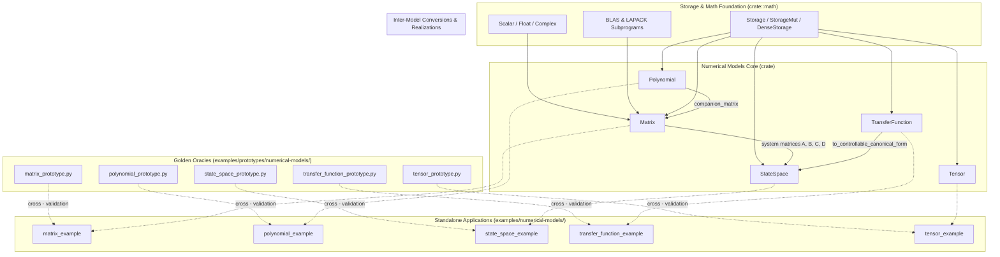

# Numerical Models Integration & Examples (Design Document)

---

### 1. Introduction

Real-time embedded control, robotics, and flight software require
high-performance, statically verifiable numerical representations for linear
algebra, polynomials, dynamical systems, transfer functions, and
multidimensional arrays (IEEE, 2024; NASA, 2016). The `control-rs` numerical
models suite provides native-authored, zero-allocation (`no_std` / `no_alloc`)
representations that bridge mathematical control abstractions directly to
embedded microcontrollers (control-rs, 2026c).

Primary usage scenarios:

1. **State Estimation & Linear Algebra**: Executing recursive linear algebra
   operations such as Kalman covariance updates, matrix
   factorizations ($LU$, $LDL^T$, Cholesky, $QR$), and triangular linear solves
   in deterministic execution time without heap allocation (Golub and Van Loan,
   2013; Higham, 2002).
2. **Polynomial Filter Design & Kinematics**: Evaluating single-variable
   polynomials via numerically stable Horner schemes, computing analytical
   derivatives/integrals for trajectory planning, and formulating companion
   matrices for root determination (Edelman and Murakami, 1995; Higham, 2002).
3. **Continuous & Discrete State-Space Simulation**: Simulating multi-input
   multi-output (MIMO) physical dynamics ($s$-domain and $z$-domain),
   discretizing continuous systems via matrix exponential Zero-Order Hold (ZOH)
   expansion, and applying similarity coordinate transformations (Van Loan,
   1978; Moler and Van Loan, 2003; Ogata, 2010).
4. **Frequency-Domain Transfer Function Analysis**: Computing exact rational
   frequency responses ($H(j\omega)$, $H(e^{j\omega T_s})$), generating Bode
   magnitude/phase points, chaining cascade interconnections, and realizing
   proper transfer functions into canonical state-space forms (Franklin et al.,
   1998; Ogata, 2010).
5. **Lookup Tables & Quantized Neural Control**: Performing continuous
   multilinear interpolation over hypercube grids for non-linear calibration
   tables and evaluating fixed-point quantized activations for edge inference (
   Kolda and Bader, 2009; Soro, 2021; ARM, 2025).
6. **Self-Contained Verification & Educational Examples**: Providing standalone
   executable applications in `examples/numerical-models/` that demonstrate
   idiomatic usage, validate numerical accuracy, and serve as reference
   blueprints for downstream firmware development (ISO, 2018; control-rs,
   2026a).
7. **Host-Side Numerical Oracles & Prototypes**: Providing equivalent reference
   prototypes in Python (NumPy/SciPy/python-control) and MATLAB under
   `examples/prototypes/numerical-models/` that establish golden analytical
   truths and cross-validate embedded Rust execution trajectories (IEEE, 2024;
   NASA, 2016; control-rs, 2026a).

---

### 2. Requirements

#### 2.1 Functional Requirements

- **FR-1 — Matrix Operations and Factorizations**: The system shall provide
  statically dimensioned matrix representations with zero-cost arithmetic,
  transposition, and factorizations ($LU$, Cholesky, $LDL^T$, $QR$) capable of
  solving linear systems $Ax = b$ with backward error bounds (Golub and Van
  Loan, 2013; Higham, 2002).
- **FR-2 — Polynomial Evaluation and Calculus**: The system shall evaluate
  polynomials in real and complex domains via Horner's method, compute
  analytical derivatives and integrals, and generate controllable companion
  matrices (Higham, 2002; Edelman and Murakami, 1995).
- **FR-3 — State-Space Dynamics and Discretization**: The system shall evaluate
  continuous-time derivative equations $\dot{x} = Ax + Bu, y = Cx + Du$, advance
  discrete-time state updates $x[k+1] = Ax[k] + Bu[k]$, perform exact Zero-Order
  Hold (ZOH) discretization via matrix series expansion, and apply coordinate
  similarity transformations (Van Loan, 1978; Ogata, 2010).
- **FR-4 — Transfer Function Frequency Analysis and Realization**: The system
  shall evaluate rational transfer function frequency responses $H(j\omega)$
  and $H(e^{j\omega T_s})$, evaluate Bode magnitude/phase points, perform
  degree-bounded series cascade algebra, and realize proper transfer functions
  into state-space canonical form (Franklin et al., 1998; Kenney and Laub,
  1988).
- **FR-5 — Multilinear Tensor Interpolation and Quantization**: The system shall
  execute continuous multilinear grid interpolation across $N$-dimensional
  tensors and provide fixed-point arithmetic representations with saturation for
  low-cost embedded inference (Kolda and Bader, 2009; Soro, 2021).
- **FR-6 — Comprehensive Exemplary Applications**: The system shall provide
  standalone executable example binaries in `examples/numerical-models/`
  demonstrating end-to-end execution of matrix linear solving, polynomial
  evaluation, state-space simulation, transfer function frequency response, and
  tensor grid interpolation (control-rs, 2026a; NASA, 2016).
- **FR-7 — Golden Model Numerical Prototypes**: The system shall provide
  companion Python/MATLAB prototype scripts under
  `examples/prototypes/numerical-models/` that compute identical mathematical
  scenarios to generate golden verification outputs and cross-validate Rust
  implementation accuracy (IEEE, 2024; NASA, 2016).

#### 2.2 Non-Functional Requirements

- **NFR-1 — Zero Dynamic Heap Allocation**: All model operations,
  factorizations, evaluations, and example executions shall operate strictly
  within stack-allocated storage without relying on runtime heap allocators (
  control-rs, 2026c; ISO, 2018).
- **NFR-2 — Numerical Backward Stability & Precision**: Numerical calculations
  shall maintain machine-epsilon precision and adhere to standard backward error
  tolerances for floating-point and fixed-point computations (Higham, 2002;
  control-rs, 2026e).
- **NFR-3 — Bare-Metal Portability**: All numerical algorithms shall execute
  deterministically across both host systems and bare-metal embedded targets (
  `no_std`) including ARM Cortex-M and RISC-V architectures (control-rs, 2026c;
  Soro, 2021).

#### 2.3 Constraints

- **C-1 — Compile-Time Dimension Verification**: Matrix, polynomial,
  state-space, and transfer function dimensions shall be verified at compile
  time using constant generics and dimension type traits to prevent runtime
  dimension mismatch panics (control-rs, 2026c).
- **C-2 — Native Rust Implementation**: All algorithms and numerical models
  shall be native Rust implementations without relying on C foreign function
  interfaces (FFI), host-to-target code generation pipelines, or external linear
  algebra libraries (control-rs, 2026c).
- **C-3 — Deterministic Execution & Fallibility**: Library functions shall not
  invoke `unwrap()`, `expect()`, or `panic!()`, returning explicit crate-local
  `Result<T, Error>` types for ill-conditioned or singular system operations (
  control-rs, 2026c; ISO, 2018).

---

### 3. Technical Overview

The `numerical-models` ecosystem within `control-rs` encompasses five primary
core models:

1. `Matrix<T, R, C, S>` in `src/matrix/`: Statically dimensioned 2D matrix
   engine backed by the decoupled storage abstraction (`crate::math::storage`).
2. `Polynomial<T, N, S>` in `src/polynomial/`: Single-variable polynomial
   arithmetic engine with Horner evaluation, differentiation, integration, and
   companion matrix construction.
3. `StateSpaceCore<T, NX, NU, NY, Sa, Sb, Sc, Sd>` in `src/state_space/`:
   Continuous and discrete linear time-invariant (LTI) state-space simulator and
   coordinate transformer.
4. `TransferFunction<T, N, D, Sn, Sd>` in `src/transfer_function/`: Rational
   SISO transfer function engine with Bode analysis, cascade interconnections,
   and controllable canonical realization.
5. `Tensor<T, L, B>` in `src/tensor/`: Multidimensional array container
   supporting fast multilinear grid interpolation and fixed-point quantized
   scalar inference.

To facilitate developer onboarding, verification, and regression tracking,
dedicated example applications located under `examples/numerical-models/` paired
with host-side verification prototype scripts located under
`examples/prototypes/numerical-models/` will showcase practical,
production-grade workflows for each model (NASA, 2016; control-rs, 2026a).

---

### 4. Architecture

#### 4.1 Standalone Example Architecture **[Proposal (not in evidence)]**

The example suite is structured under `examples/numerical-models/` as an
organized sub-workspace or module collection with dedicated example binaries:

1. **`matrix_example.rs`**:
    - Demonstrates matrix creation (`from_array`, `identity`, `from_fn`).
    - Executes $LU$ decomposition and matrix inversion.
    - Solves a regularized linear system $Ax = b$.
    - Computes a discrete Kalman filter measurement covariance update
      step $P_{k|k} = (I - K H) P_{k|k-1}$.

2. **`polynomial_example.rs`**:
    - Instantiates degree-bounded polynomials.
    - Performs real and complex Horner evaluation ($p(x)$ and $p(j\omega)$).
    - Computes exact analytical derivative $p'(x)$ and integral $\int p(x) dx$.
    - Formulates the controllable Frobenius companion matrix $C(p)$ to find
      polynomial roots.

3. **`state_space_example.rs`**:
    - Constructs a 2nd-order continuous-time spring-mass-damper
      system ($\ddot{x} + 2\zeta\omega_n \dot{x} + \omega_n^2 x = u$).
    - Discretizes the system using Zero-Order Hold (ZOH) with sampling
      period $\Delta t$.
    - Runs a 50-step closed-loop time simulation tracking state
      trajectory $x[k]$ and output $y[k]$.
    - Applies an invertible similarity transformation $z = T x$ to obtain modal
      coordinates.

4. **`transfer_function_example.rs`**:
    - Defines a continuous 2nd-order lowpass Butterworth transfer
      function $H(s) = \frac{\omega_c^2}{s^2 + \sqrt{2}\omega_c s + \omega_c^2}$.
    - Evaluates frequency response $H(j\omega)$ across frequency decades.
    - Computes Bode magnitude $|H(j\omega)|_{\text{dB}}$ and
      phase $\angle H(j\omega)$.
    - Chains two transfer functions in
      series ($H_{\text{series}} = H_1 \cdot H_2$).
    - Converts the transfer function into Controllable Canonical State-Space
      form.

5. **`tensor_example.rs`**:
    - Constructs a 2D aerodynamic lift coefficient lookup
      table $C_L(\alpha, \beta)$ as a
      `Tensor<f32, Shape2D<R, C>, ArrayStorage>`.
    - Evaluates continuous multilinear interpolation for off-grid
      angle-of-attack coordinates.
    - Implements a fixed-point quantized inference layer using
      `Quantized<i8, 7>` and `Relu` activation.

#### 4.2 Numerical Prototype Oracles Architecture **[Proposal (not in evidence)]
**

To ensure mathematical correctness against established numerical standards,
companion Python/MATLAB prototypes reside in
`examples/prototypes/numerical-models/`:

1. **`matrix_prototype.py`**: Uses NumPy and SciPy `scipy.linalg` (`lu_factor`,
   `solve`, `inv`) to compute analytical matrix solutions and print step-by-step
   matrix invariants.
2. **`polynomial_prototype.py`**: Uses NumPy `numpy.polynomial` and
   `scipy.linalg.companion` to compute reference Horner evaluations,
   derivatives, integrals, and roots.
3. **`state_space_prototype.py`**: Uses `scipy.signal` (`StateSpace`,
   `cont2discrete` with `'zoh'`, `dlsim`) to compute baseline step response
   trajectories and modal state transformations.
4. **`transfer_function_prototype.py`**: Uses `scipy.signal` (
   `TransferFunction`, `bode`, `series`, `tf2ss`) to produce exact Bode points
   and canonical state-space realizations.
5. **`tensor_prototype.py`**: Uses `scipy.interpolate.RegularGridInterpolator`
   and fixed-point integer simulation to produce reference 2D table
   interpolations and quantized activations.

#### 4.3 Data-Driven Model Factories [Proposal (not in evidence)]

Across the `numerical-models` ecosystem, empirical data-driven **Object
Factories** provide decoupled, reusable producer interfaces for transforming
measured trajectory sequences, frequency responses, impulse responses, and
multidimensional calibration tables into verified numerical model
representations without dynamic heap allocation:

1. **Matrix Factories**: `HankelMatrixFactory` for signal Hankel matrices
   $H_L(w)$ (Willems et al., 2004), `BlockHankelDataFactory` for subspace
   past/future data blocks (De Cock & De Moor, 2003), `ToeplitzMarkovFactory` for
   Markov parameter block-Toeplitz convolution matrices (Juang & Pappa, 1985),
   and `SampleCovarianceFactory` for packed covariance matrices (Gevers, 2006).
2. **Polynomial Factories**: `VandermondePolynomialFactory` for exact point-pair
   interpolation (Higham, 2021), `PolynomialLeastSquaresFitter` for
   overdetermined least-squares polynomial regression (JuliaMath, 2026), and
   `PronyPolynomialFactory` for characteristic polynomial estimation from free
   decay responses (Almunif et al., 2020).
3. **State-Space Factories**: `EraStateSpaceFactory` for minimal state-space
   realizations from Markov parameter impulse sequences (Juang & Pappa, 1985; De
   Schutter, 2000), and `MoespStateSpaceEstimator` / `N4sidStateSpaceEstimator`
   for subspace state-space identification from I/O time series (Verhaegen &
   Dewilde, 1992; Van Overschee & De Moor, 1994; Qin, 2006).
4. **Transfer Function Factories**: `ArxTransferFunctionEstimator` for
   time-domain rational equation-error estimation (Ljung & Chen, 2013),
   `LevyTransferFunctionFitter` for frequency-domain complex curve fitting (Levy,
   1959), and `SanathananKoernerFitter` for iterative frequency refinement
   (Sanathanan & Koerner, 1963; Drmač et al., 2015).
5. **Tensor Factories**: `GridTensorFactory` for multidimensional aerodynamic
   lookup grids (Weiser & Zarantonello, 1988), `HankelTensorFactory` for
   higher-order block-Hankel data tensors (Van Eeghem et al., 2017), and
   `MatrixSeriesTensorFactory` for temporal observation stacking in Multilinear
   Dynamical Systems (Rogers et al., 2013).
6. **Cross-Model Factory Architectures**:
   - **Loewner Framework**: Tangential interpolation of multi-point frequency
     responses directly constructing descriptor state-space realizations
     $(E, A, B, C, D)$ via generalized Loewner and shifted Loewner matrices
     (Mayo & Antoulas, 2007; Antoulas et al., 2017).
   - **Dynamic Mode Decomposition (DMD)**: Estimates linear state-transition
     matrices $A \approx X' X^\dagger$ from snapshot trajectory matrices $X, X'$
     via truncated SVD (Schmid, 2010; Tu et al., 2014).
   - **Workspace Encapsulation & Regularization**: Object factories encapsulate
     pre-allocated scratchpad buffers, iteration tolerances, and Truncated SVD
     (TSVD) parameters to guarantee robust `#![no_std]` execution without heap
     allocation (Hansen, 1998; Higham, 2002).

_Standalone, detailed mathematical definitions, solver engines, and API
signatures for all system identification estimators and realization factories
reside in `documentation/control-toolboxes/sysid-design.md`._

---

### 5. Alternatives

- **Monolithic Single Binary vs. Dedicated Per-Model Binaries**: Combining all
  five examples into a single giant binary was considered. However, modular
  per-model binaries (`matrix_example.rs`, `polynomial_example.rs`, etc.)
  provide targeted, readable tutorials that downstream users can directly
  inspect and copy without extraneous dependencies (control-rs, 2026a).
- **Dynamic Array Backends vs. Decoupled Compile-Time Generic Storage**: Using
  heap-allocated vectors (`Vec<T>`) for dynamic model resizing was considered.
  This was rejected in accordance with C-1 and NFR-1, ensuring hard real-time
  safety, zero allocation overhead, and bare-metal execution on microcontrollers
  without an allocator (control-rs, 2026c; ISO, 2018).
- **Embedded Assertions vs. Host-Side Prototype Oracles**: Relying purely on
  embedded unit tests was considered. Introducing explicit host-side numerical
  prototypes in Python/MATLAB provides an independent, traceable oracle that
  protects against self-referential test biases (IEEE, 2024; NASA, 2016).

---

### 6. Verification & Validation

#### 6.1 Verification Plan (Automated Testing)

- **Unit & Property Tests**: Verify algebraic invariants, associativity,
  commutativity, and error bounds using `proptest` and deterministic unit test
  suites across all five models (Claessen and Hughes, 2000; control-rs, 2026d).
- **Target ETS Execution**: Execute all test suites on simulated ARM Cortex-M7 (
  hard-float & soft-float) and RISC-V (32-bit & 64-bit) microcontrollers via
  QEMU (control-rs, 2026b; control-rs, 2026c).
- **Continuous Integration Pipeline**: Enforce zero Clippy warnings (
  `cargo clippy-ci`), standard formatting (`cargo fmt-check`), and full
  workspace test coverage via `cargo ci` (control-rs, 2026c).

#### 6.2 Validation Plan (User & System Workflows)

- **Cross-Validation with Prototype Oracles**: Execute the Python/MATLAB
  prototype scripts to generate golden reference vectors, then run the Rust
  example binaries in `examples/numerical-models/` and verify that calculated
  outputs match within machine epsilon ($\le 10^{-12}$ for `f64`, $\le 10^{-6}$
  for `f32`) (NASA, 2016; control-rs, 2026e).
- **Executable Model Blueprints**: Run all example binaries in
  `examples/numerical-models/` to validate output trajectories against known
  analytical solutions (e.g. step response of second-order harmonic oscillator,
  Bode cutoff attenuation at $-3\text{ dB}$, Kalman covariance
  positive-definiteness) (NASA, 2016).

---

### 7. Performance & Resource Considerations

- **Stack Allocation Limits**: All model storage backends use fixed-size stack
  arrays. Typical models (e.g., $4\times 4$ matrices or degree-8 polynomials)
  occupy less than 256 bytes of stack memory, well within embedded MCU limits (
  Soro, 2021).
- **Computational Complexity**: Horner evaluation operates in $O(N)$
  operations; $LU$ and matrix operations operate in $O(N^3)$ operations;
  multilinear tensor interpolation requires $O(2^K)$ corner evaluations
  where $K$ is the tensor rank (Higham, 2002; Kolda and Bader, 2009).

---

### 8. Risks & Open Questions

- **[Proposal (not in evidence)] Example Runner Structure**: The layout of
  `examples/numerical-models/` as individual standalone binaries runnable via
  `cargo run --example <name>` provides maximum clarity and minimal build
  friction.
- **[Proposal (not in evidence)] Prototype Tooling Environment**: Providing
  Python prototypes by default using NumPy/SciPy/Control, with optional MATLAB
  companion scripts for control systems workflows.
- **Fixed-Point Scaling Invariants**: Scaling fixed-point tensors requires
  careful selection of fractional bit shift parameters ($Q_7$, $Q_{15}$) to
  prevent overflow during intermediate accumulator products (ARM, 2025).

---

### 9. Development Plan

| Task / Feature                                                     | Description                                                                                                                                                                                                                         | Estimated Effort (1-10) |
|:-------------------------------------------------------------------|:------------------------------------------------------------------------------------------------------------------------------------------------------------------------------------------------------------------------------------|:------------------------|
| Step 1: Host Prototype Oracles                                     | Implement Python reference prototype oracles (`matrix_prototype.py`, `polynomial_prototype.py`, `state_space_prototype.py`, `transfer_function_prototype.py`, `tensor_prototype.py`) under `examples/prototypes/numerical-models/`. | 3                       |
| Step 2: Matrix Example (`matrix_example.rs`)                       | Implement standalone matrix linear solver, decomposition, and Kalman covariance update example matching prototype output.                                                                                                           | 3                       |
| Step 3: Polynomial Example (`polynomial_example.rs`)               | Implement Horner evaluation, polynomial calculus, and companion matrix root-finding example matching prototype output.                                                                                                              | 3                       |
| Step 4: State-Space Example (`state_space_example.rs`)             | Implement 2nd-order dynamical system simulation, ZOH discretization, and similarity transform example matching prototype output.                                                                                                    | 4                       |
| Step 5: Transfer Function Example (`transfer_function_example.rs`) | Implement frequency response, Bode analysis, series cascade, and controllable canonical realization example matching prototype output.                                                                                              | 4                       |
| Step 6: Tensor Example (`tensor_example.rs`)                       | Implement 2D multilinear grid lookup table interpolation and quantized fixed-point inference example matching prototype output.                                                                                                     | 3                       |
| Step 7: Workspace Integration & CI Validation                      | Wire example targets into workspace manifests and cross-verify execution against prototype outputs in `cargo ci`.                                                                                                                   | 2                       |

---

### 10. Revision History

| Revision | Date            | Author          | Description                                                                                                                           |
|:---------|:----------------|:----------------|:--------------------------------------------------------------------------------------------------------------------------------------|
| 1.0      | August 25, 2026 | @MitchellDScott | Initial draft: numerical models integration, end-to-end examples, and validation framework.                                            |
| 1.1      | August 25, 2026 | @MitchellDScott | Verification oracles: added host-side prototype oracles (Python/MATLAB) under `examples/prototypes/numerical-models/`.              |

---

## References

[1] IEEE, "IEEE Standard for Software Verification and Validation Plans," IEEE,
New York, NY, USA, Rep. no. IEEE Std 1012-1986, Nov. 1986. [Online].
Available: https://nvlpubs.nist.gov/nistpubs/Legacy/FIPS/fipspub132.pdf.
Accessed: Aug. 25, 2026.

[2] IEEE, "IEEE Standard for System, Software, and Hardware Verification and
Validation," IEEE Standards Association, 2024. [Online].
Available: https://standards.ieee.org/ieee/1012/7324/. Accessed: Aug. 25, 2026.

[3] ISO, "Road vehicles --- Functional safety --- Part 6: Product development at
the software level," International Organization for Standardization, Geneva,
Switzerland, Rep. no. ISO 26262-6:2018, Dec. 2018. [Online].
Available: https://www.iso.org/standard/68388.html. Accessed: Aug. 25, 2026.

[4] C. M. Holloway, "Understanding DO-178C / ED-12C: Software Considerations in
Airborne Systems and Equipment Certification," NASA Langley Research Center,
Hampton, VA, USA, Rep. no. NASA/TM-2012-217804, Dec. 2012. [Online].
Available: https://ntrs.nasa.gov/citations/20130000570. Accessed: Aug. 25, 2026.

[5] NASA, "NASA Systems Engineering Handbook," National Aeronautics and Space
Administration, Washington, DC, USA, Rep. no. NASA/SP-2016-6105 Rev 2,
2016. [Online].
Available: https://www.nasa.gov/wp-content/uploads/2015/01/nasa_systems_engineering_handbook_0.pdf.
Accessed: Aug. 25, 2026.

[6] NASA, "SWE-028 --- Software Verification Planning," NASA Software
Engineering Handbook, NASA-HDBK-2203, 2023. [Online].
Available: https://swehb.nasa.gov/display/7150/SWE-028+-+Software+Verification+Planning.
Accessed: Aug. 25, 2026.

[7] K. Claessen and J. Hughes, "QuickCheck: a lightweight tool for random
testing of Haskell programs," in *Proceedings of the fifth ACM SIGPLAN
international conference on Functional programming*, Montreal, QC, Canada, 2000,
pp. 268–279, doi: 10.1145/351240.351266.

[8] G. H. Golub and C. F. Van Loan, *Matrix Computations*, 4th ed. Baltimore,
MD, USA: Johns Hopkins University Press, 2013.

[9] N. J. Higham, *Accuracy and Stability of Numerical Algorithms*, 2nd ed.
Philadelphia, PA, USA: Society for Industrial and Applied Mathematics, 2002,
doi: 10.1137/1.9780898718027.

[10] E. Anderson, Z. Bai, C. Bischof, L. S. Blackford, J. Demmel, J. Dongarra,
J. Du Croz, A. Greenbaum, S. Hammarling, A. McKenney, and D. Sorensen, *LAPACK
Users' Guide*, 3rd ed. Philadelphia, PA, USA: Society for Industrial and Applied
Mathematics, 1999, doi: 10.1137/1.9780898719604.

[11] A. Edelman and H. Murakami, "Polynomial roots from companion matrix
eigenvalues," *Mathematics of Computation*, vol. 64, no. 210, pp. 763–776, Apr.
1995, doi: 10.1090/S0025-5718-1995-1262279-2.

[12] J. L. Aurentz, T. Mach, R. Vandebril, and D. S. Watkins, "Fast and Backward
Stable Computation of Roots of Polynomials, Part II: Backward Error Analysis,"
*SIAM Journal on Matrix Analysis and Applications*, vol. 39, no. 3, pp.
1245–1269, Aug. 2018, doi: 10.1137/17M1143896.

[13] S. Graillat, P. Langlois, and N. Louvet, "Faithful Polynomial Evaluation
with Compensated Horner Algorithm," in *Proceedings of the 17th IEEE Symposium
on Computer Arithmetic (ARITH-17)*, Cape Cod, MA, USA, 2006, pp. 141–148, doi:
10.1109/ARITH.2005.15.

[14] C. F. Van Loan, "Computing integrals involving the matrix exponential,"
*IEEE Transactions on Automatic Control*, vol. 23, no. 3, pp. 395–404, Jun.
1978, doi: 10.1109/TAC.1978.1101743.

[15] C. Moler and C. F. Van Loan, "Nineteen Dubious Ways to Compute the
Exponential of a Matrix, Twenty-Five Years Later," *SIAM Review*, vol. 45, no.
1, pp. 3–49, Mar. 2003, doi: 10.1137/S00361445024180.

[16] A. H. Al-Mohy and N. J. Higham, "A New Scaling and Squaring Algorithm for
the Matrix Exponential," *SIAM Journal on Matrix Analysis and Applications*,
vol. 31, no. 3, pp. 970–989, Oct. 2009, doi: 10.1137/09074721X.

[17] C. T. Mullis and R. A. Roberts, "Synthesis of minimum roundoff noise fixed
point digital filters," *IEEE Transactions on Circuits and Systems*, vol. 23,
no. 9, pp. 551–562, Sep. 1976, doi: 10.1109/TCS.1976.1084254.

[18] S. Y. Hwang, "Minimum Uncorrelated Unit Noise in State-Space Digital
Filtering," *IEEE Transactions on Acoustics, Speech, and Signal Processing*,
vol. 25, no. 4, pp. 273–281, Aug. 1977, doi: 10.1109/TASSP.1977.1162967.

[19] K. Ogata, *Modern Control Engineering*, 5th ed. Boston, MA, USA: Prentice
Hall, 2010.

[20] G. F. Franklin, J. D. Powell, and M. L. Workman, *Digital Control of
Dynamic Systems*, 3rd ed. Menlo Park, CA, USA: Addison-Wesley, 1998.

[21] C. S. Kenney and A. J. Laub, "Controllability and stability radii for
companion form systems," *Mathematics of Control, Signals, and Systems*, vol. 1,
no. 3, pp. 239–256, Sep. 1988, doi: 10.1007/BF02551221.

[22] T. G. Kolda and B. W. Bader, "Tensor Decompositions and Applications,"
*SIAM Review*, vol. 51, no. 3, pp. 455–500, Aug. 2009, doi: 10.1137/07070111X.

[23] S. Soro, "TinyML for Ubiquitous Edge AI," MITRE Corporation, McLean, VA,
USA, Rep. no. MTR200519, Feb. 2021. [Online].
Available: https://arxiv.org/abs/2102.01255. Accessed: Aug. 25, 2026.

[24] ARM Ltd., "Matrix Multiplication," CMSIS-DSP Documentation, 2025. [Online].
Available: https://arm-software.github.io/CMSIS-DSP/main/group__MatrixMult.html.
Accessed: Aug. 25, 2026.

[25] control-rs developers, "documentation/design-template.md," control-rs
repository, 2026. [Online].
Available: https://github.com/Dyse-Industries/control-rs/blob/main/documentation/design-template.md.
Accessed: Aug. 25, 2026.

[26] control-rs developers, "documentation/doc-standards.md," control-rs
repository, 2026. [Online].
Available: https://github.com/Dyse-Industries/control-rs/blob/main/documentation/doc-standards.md.
Accessed: Aug. 25, 2026.

[27] control-rs developers, "documentation/development-guide.md," control-rs
repository, 2026. [Online].
Available: https://github.com/Dyse-Industries/control-rs/blob/main/documentation/development-guide.md.
Accessed: Aug. 25, 2026.

[28] control-rs developers, "Cargo.toml," control-rs repository, 2026. [Online].
Available: https://github.com/Dyse-Industries/control-rs/blob/main/Cargo.toml.
Accessed: Aug. 25, 2026.

[29] control-rs developers, "src/math/assert.rs," control-rs repository,
2026. [Online].
Available: https://github.com/Dyse-Industries/control-rs/blob/main/src/math/assert.rs.
Accessed: Aug. 25, 2026.

[30] J. C. Willems, P. Rapisarda, I. Markovsky, and B. De Moor, "A note on
persistency of excitation," in *Proceedings of the 43rd IEEE Conference on
Decision and Control*, Atlantis, Paradise Island, Bahamas, 2004, pp. 2650–2653.

[31] K. De Cock and B. De Moor, "Subspace identification," in *Control Systems,
Robotics and Automation*, Encyclopedia of Life Support Systems (EOLSS), Eolss
Publishers, 2003.

[32] J.-N. Juang and R. S. Pappa, "An eigensystem realization algorithm for
modal parameter identification and model reduction," *Journal of Guidance,
Control, and Dynamics*, vol. 8, no. 5, pp. 620–627, Sep. 1985, doi:
10.2514/3.20031.

[33] M. Gevers, "A personal view of the development of system identification,"
in *SYSID 2006: 14th IFAC Symposium on System Identification*, Newcastle,
Australia, 2006.

[34] L. Ljung, "Linear system identification as a curve fitting problem," in
*Model-based Identification and Control*, Lecture Notes in Control and
Information Sciences, Springer, 2003.

[35] A. Almunif, L. Fan, and Z. Miao, "A tutorial on data-driven eigenvalue
identification: Prony analysis, matrix pencil, and ERA," in *2020 IEEE Power &
Energy Society General Meeting (PESGM)*, 2020.

[36] N. J. Higham, "What Is a Vandermonde Matrix?", *Nick Higham Blog*, 2021.
[Online]. Available: https://nhigham.com/2021/06/15/what-is-a-vandermonde-matrix/.
Accessed: Aug. 25, 2026.

[37] J.-N. Juang, M. Phan, L. G. Horta, and R. W. Longman, "Identification of
observer/Kalman filter Markov parameters - Theory and experiments," *Journal of
Guidance, Control, and Dynamics*, vol. 16, no. 2, pp. 320–329, 1993.

[38] B. De Schutter, "Minimal state-space realization in linear system theory:
an overview," *Journal of Computational and Applied Mathematics*, vol. 121, no.
1–2, pp. 331–354, 2000.

[39] M. Verhaegen and P. Dewilde, "Subspace Model Identification Part 1. The
output-error state-space model identification class of algorithms,"
*International Journal of Control*, vol. 56, no. 5, pp. 1187–1210, 1992.

[40] P. Van Overschee and B. De Moor, "N4SID: Subspace Algorithms for the
Identification of Combined Deterministic-Stochastic Systems," *Automatica*,
vol. 30, no. 1, pp. 75–93, 1994.

[41] S. J. Qin, "An overview of subspace identification," *Computers & Chemical
Engineering*, vol. 30, no. 10–12, pp. 1502–1513, 2006.

[42] L. Ljung and T. Chen, "System identification - a frequency domain
approach, or is it a time domain approach?", in *2013 9th Asian Control
Conference (ASCC)*, Istanbul, Turkey, 2013.

[43] K. Steiglitz and L. E. McBride, "A technique for the identification of
linear systems," *IEEE Transactions on Automatic Control*, vol. 10, no. 4, pp.
461–464, 1965.

[44] E. C. Levy, "Complex-curve fitting," *IRE Transactions on Automatic
Control*, vol. AC-4, no. 1, pp. 37–43, 1959.

[45] C. K. Sanathanan and J. Koerner, "Transfer function synthesis as a ratio of
two complex polynomials," *IEEE Transactions on Automatic Control*, vol. 8, no.
1, pp. 56–58, 1963.

[46] Z. Drmač, S. Gugercin, and C. Beattie, "Quadrature-Based Vector Fitting for
Discretized $\mathcal{H}_2$ Approximation," *SIAM Journal on Scientific
Computing*, vol. 37, no. 2, pp. A625–A652, 2015.

[47] I. Markovsky and H. R. Ossareh, "Direct data-driven frequency response
estimation and its application to transfer function fitting," *Automatica*,
vol. 159, p. 111351, 2024.

[48] A. Weiser and S. E. Zarantonello, "A Note on Piecewise Linear and
Multilinear Table Interpolation in Many Dimensions," *Mathematics of
Computation*, vol. 50, no. 181, pp. 189–196, 1988.

[49] J. Van Eeghem, M. Sørensen, and L. De Lathauwer, "Tensor tools for blind
system identification," in *2017 25th European Signal Processing Conference
(EUSIPCO)*, Kos, Greece, 2017.

[50] K. Batselier, Z. Chen, and N. Wong, "A Tensor Network Alternative for
ODE/PDE-based System Identification," *IFAC-PapersOnLine*, vol. 50, no. 1, pp.
11429–11434, 2017.

[51] G. Favier and A. Kibangou, "Overview of Tensor-Based Models for Nonlinear
System Identification," *Signals*, vol. 4, no. 4, pp. 664–698, 2023.

[52] P. Baranyi, *TP-Model Transformation-Based-Control Design Frameworks*.
Cham, Switzerland: Springer, 2014.

[53] M. Rogers, L. Li, and S. Russell, "Multilinear Dynamical Systems for Tensor
Time Series," in *Advances in Neural Information Processing Systems (NeurIPS
2013)*, Lake Tahoe, NV, USA, 2013.

[54] A. J. Mayo and A. C. Antoulas, "A framework for the solution of the
generalized realization problem," *Linear Algebra and its Applications*, vol.
425, no. 2–3, pp. 634–662, 2007.

[55] A. C. Antoulas, S. Lefteriu, and A. C. Ionita, "A Tutorial Introduction to
the Loewner Framework for Model Reduction," in *Model Reduction and
Approximation: Theory and Algorithms*, P. Benner et al., Eds. Philadelphia, PA,
USA: SIAM, 2017, pp. 49–118.

[56] P. J. Schmid, "Dynamic mode decomposition of numerical and experimental
data," *Journal of Fluid Mechanics*, vol. 656, pp. 5–28, 2010.

[57] J. H. Tu, C. W. Rowley, D. M. Luchtenburg, S. L. Brunton, and J. N. Kutz,
"On dynamic mode decomposition: Theory and applications," *Journal of
Computational Dynamics*, vol. 1, no. 2, pp. 391–421, 2014.

[58] P. C. Hansen, *Rank-Deficient and Discrete Ill-Posed Problems: Numerical
Aspects of Linear Inversion*. Philadelphia, PA, USA: SIAM, 1998.
