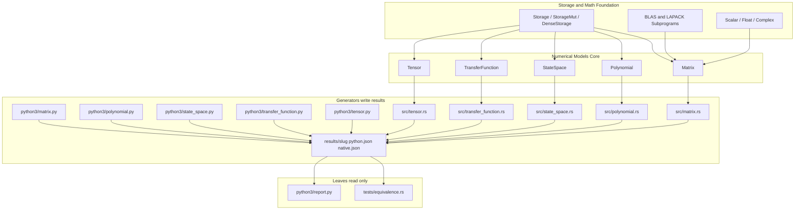

# Numerical Models Integration & Examples (Design Document)


---

### 1. Introduction

This document specifies standalone examples and host-side numerical oracles
for the five Approved numerical-model types. Matrix, polynomial, state-space,
transfer-function, and tensor behavior is specified in those designs; this
document does not restate it (C-4).

Primary usage scenarios:

1. **Standalone examples**: A nested host crate in `examples/numerical-models/`
   whose example binaries demonstrate idiomatic use of each Approved sibling
   type and write native JSON results. One binary per model.
2. **Host-side oracles**: Python (NumPy/SciPy) generators under
   `examples/numerical-models/python3/` that compute the same scenarios and
   write Python JSON results. A single `report.py` plots those files.
3. **File-based equivalence**: Crate tests and `report.py` are read-only
   leaves. They compare or plot `results/<slug>/{python,native}.json` after
   the generators have run. They do not recompute the models and do not
   spawn subprocesses.

Host generators include a copy-paste tutorial and a discriminating
ill-conditioned case (Hilbert, clustered-root Horner, stiff ZOH, clustered-pole
Bode, curved-grid interpolation). Kernel wall-times go in JSON `timings`.
MCU sibling caps are unchanged; these binaries run on the host.

---

### 2. Requirements

#### 2.1 Functional Requirements

- **FR-1 — Comprehensive Exemplary Applications**: The system shall provide
  standalone executable example binaries in `examples/numerical-models/`
  demonstrating end-to-end execution of matrix linear solving, polynomial
  evaluation, state-space simulation, transfer function frequency response,
  and tensor grid interpolation.
- **FR-2 — Numerical Prototype Equivalence**: Python and Rust generators
  shall write `results/<slug>/python.json` and `results/<slug>/native.json`
  for identical mathematical scenarios. Crate tests shall compare those
  files to the bounds in §6.3. `report.py` shall read the same files for
  plots. Missing artifacts fail with a run hint. Tests and `report.py` do
  not recompute the scenario and do not invoke generators.
- **FR-3 — Discriminating Host Cases**: Each generator shall include an
  ill-conditioned or algorithmically independent case (Hilbert $n=8$,
  clustered-root Horner of degree 16, stiff ZOH plant, clustered-pole Bode,
  $16\times 16$ curved interpolation grid) so Python and native results are
  not bitwise identical on every key. Compact stress payloads and `metrics`
  are emitted; $64\times 64$ GEMM products are not dumped into JSON.

#### 2.2 Non-Functional Requirements

- **NFR-1 — Zero Dynamic Heap Allocation**: Library operations, ETS suites,
  and tutorial example binaries shall operate strictly within `ArrayStorage`
  or borrowed views over that storage, without runtime heap allocators.
- **NFR-2 — Numerical Backward Stability & Precision**: Numerical
  calculations shall maintain machine-epsilon precision and adhere to
  standard backward error tolerances for floating-point and fixed-point
  computations (Higham, 2002). Ill-conditioned host cases use residual ratios
  and condition-scaled $\tau\kappa\varepsilon$ bounds, not a blanket absolute
  $10^{-12}$ compare of all JSON keys.
- **NFR-3 — Bare-Metal Portability**: All numerical algorithms shall execute
  deterministically across both host systems and bare-metal embedded targets
  (`no_std`) including ARM Cortex-M and RISC-V architectures (Soro, 2021).
- **NFR-4 — Kernel Wall-Time**: Generators shall record kernel-only
  `std::time::Instant` / `time.perf_counter_ns` samples (warmup, then
  minimum of a fixed iteration count) under JSON `timings`. Times are
  informational for `report.py`; crate tests do not fail on wall-clock.

#### 2.3 Constraints

- **C-1 — Compile-Time Dimension Verification**: Matrix, polynomial,
  state-space, and transfer function dimensions shall be verified at compile
  time using constant generics and dimension type traits to prevent runtime
  dimension mismatch panics.
- **C-2 — Native Rust Implementation**: All algorithms and numerical models
  shall be native Rust implementations without relying on C foreign function
  interfaces (FFI), host-to-target code generation pipelines, or external
  linear algebra libraries.
- **C-3 — Deterministic Execution & Fallibility**: Library functions shall not
  invoke `unwrap()`, `expect()`, or `panic!()`, returning explicit crate-local
  `Result<T, Error>` types for ill-conditioned or singular system operations.
- **C-4 — Sibling Capabilities Out of Scope**: Matrix, polynomial,
  state-space, transfer-function and tensor functional behavior is specified
  in their own Approved design docs (`matrix-design.md`,
  `polynomial-design.md`, `state-space-design.md`,
  `transfer-function-design.md`, `tensor-design.md`); this document does not
  restate it.

---

### 3. Technical Overview

The `numerical-models` ecosystem within `control-rs` encompasses five primary
core models:

1. `Matrix<T, R, C, S>` in `src/matrix/`: Statically dimensioned 2D matrix
   engine backed by the decoupled storage abstraction (`crate::math::storage`).
2. `Polynomial<T, N, S>` in `src/polynomial/`: Single-variable polynomial
   arithmetic engine with Horner evaluation, differentiation, integration, and
   companion matrix construction.
3. `StateSpaceCore<T, NX, NU, NY, Sa, Sb, Sc, Sd>` in `src/state_space/`:
   Continuous and discrete linear time-invariant (LTI) state-space simulator and
   coordinate transformer.
4. `TransferFunction<T, N, D, Sn, Sd>` in `src/transfer_function/`: Rational
   SISO transfer function engine with Bode analysis, cascade interconnections,
   and controllable canonical realization.
5. `Tensor<T, L, B>` in `src/tensor/`: Multidimensional array container
   supporting fast multilinear grid interpolation and fixed-point quantized
   scalar inference.

The nested host crate `examples/numerical-models/` holds one generator binary
per model and matching Python generators under `python3/`. Crate tests and
`python3/report.py` consume the JSON those generators write.

---

### 4. Architecture



#### 4.1 Standalone Example Architecture

The example suite is a nested host crate (`control-rs-numerical-model-examples`)
under `examples/numerical-models/` with its own `[workspace]`, matching
`examples/qemu/` and `examples/subprograms/`. It is not a root workspace
member, so `cargo test -p control-rs` and `cargo lint` do not require Python.

Each model has one `src/<slug>.rs` module with `pub fn main()`.
`src/bin/<slug>.rs` is the per-model binary (`cargo run --bin <slug>`).
`src/main.rs` calls every slug `main` (`cargo run`). Each generator prints a
transcript and writes `results/<slug>/native.json`. **Proposal (not in
evidence)**: JSON via `serde_json` is the interchange format between
generators and leaves.

Independent of CI:

```bash
cd examples/numerical-models
python3 python3/<slug>.py
cargo run --bin <slug>
cargo test
python3 python3/report.py          # plots existing JSON
python3 python3/report.py --force  # regenerate all generators, then plot
```

Dedicated example binaries:

1. **`matrix.rs`**:
    - Demonstrates matrix creation (`from_array`, `identity`, `from_fn`).
    - Performs basic matrix arithmetic (`+`, `-`, `*`) and transposition.
    - Executes $LU$ decomposition and matrix inversion.
    - Solves a regularized linear system $Ax = b$ and verifies
      identity $A \cdot A^{-1} = I$.
    - Solves Hilbert $n=8$ $Hx=b$ (manufactured $x=1$) and times GEMM $n=64$.
    - Composes a compact $4\times 4$ $\mathrm{SE}(3)$ rigid chain $T^{k}$
      ($k=0..39$) via GEMM for the geometric plot payload.

2. **`polynomial.rs`**:
    - Instantiates degree-bounded polynomials.
    - Performs real and complex Horner evaluation ($p(x)$ and $p(j\omega)$).
    - Computes exact analytical derivative $p'(x)$ and integral $\int p(x) dx$.
    - Performs polynomial multiplication and Euclidean division.
    - Formulates the controllable Frobenius companion matrix $C(p)$.
    - Evaluates clustered-root $p(x)=(x-1)^8(x-1.01)^8$ on a 128-point sweep.

3. **`state_space.rs`**:
    - Constructs a 2nd-order continuous-time spring-mass-damper
      system ($\ddot{x} + 2\zeta\omega_n \dot{x} + \omega_n^2 x = u$).
    - Discretizes the system using Zero-Order Hold (ZOH) with sampling
      period $\Delta t$.
    - Runs an open-loop unit step trajectory (200 samples) tracking $x[k]$
      and $y[k]$, and a free response from $x_0=[1,0.5]$ with $u=0$ for the
      phase-portrait payload.
    - Applies an invertible similarity transformation $z = T x$ to obtain modal
      coordinates.
    - Discretizes a stiff diagonal plant $A=\mathrm{diag}(-200,-0.5)$ at
      $T_s=0.01$.

4. **`transfer_function.rs`**:
    - Defines a continuous 2nd-order lowpass Butterworth transfer
      function $H(s) = \frac{\omega_c^2}{s^2 + \sqrt{2}\omega_c s + \omega_c^2}$.
    - Evaluates frequency response $H(j\omega)$ on $\mathrm{logspace}(-2,3,128)$.
    - Computes Bode magnitude $|H(j\omega)|_{\text{dB}}$ and
      phase $\angle H(j\omega)$.
    - Chains two transfer functions in
      series ($H_{\text{series}} = H_1 \cdot H_2$).
    - Converts the transfer function into Controllable Canonical State-Space
      form.
    - Sweeps clustered-pole $H(s)=1/[(s+1)^4(s+1.01)^4]$ on the same frequency grid.

5. **`tensor.rs`**:
    - Constructs a 2D aerodynamic lift coefficient lookup
      table $C_L(\alpha, \beta)$ as a
      `Tensor<f32, Shape2D<R, C>, ArrayStorage>`.
    - Evaluates continuous multilinear interpolation for off-grid
      angle-of-attack coordinates.
    - Interpolates a $16\times 16$ curved table
      $\sin(\pi i/15)\cos(\pi j/15)$ on a 64-point diagonal cut and emits the
      $16\times 16$ node table for the surface plot.
    - Implements a fixed-point quantized inference layer using
      `Quantized<i8, 7>` and `Relu` activation, including non-dyadic inputs.

#### 4.2 Numerical Prototype Oracles Architecture

NumPy/SciPy generators reside in `examples/numerical-models/python3/`. Each
`<slug>.py` writes `results/<slug>/python.json`. Pinned versions live in
`python3/requirements.txt`. The V&V workflow installs that file; `cargo ci`
does not run `pip` and does not invoke these scripts.

`python3/report.py` reads the Python and native JSON pair and writes
slug-specific diagnostic plots (Hilbert relative-error heatmap and
matplotlib 3D $\mathrm{SE}(3)$ chain; Horner overlay with Higham band;
free-response phase portrait; Butterworth and clustered Nyquist contours;
$16\times 16$ table surface and relative-error heatmap; kernel-time bars).
It is a leaf, not a generator. ``--force`` / ``-f`` is an operator shortcut
that runs every `python3/<slug>.py` and `cargo run` first, then plots.

1. **`matrix.py`**: NumPy arithmetic and `scipy.linalg.solve` / `inv` /
   `hilbert`. Equivalence tables are tutorial $x$, $A^{-1}$, Hilbert $x$,
   and GEMM scalars, not $L$/$U$ factors or the $64\times 64$ product.
   Compact $\mathrm{SE}(3)$ chain $T^{k}$ translations and rotation blocks
   are visualization keys (skipped by the blanket absolute compare).
2. **`polynomial.py`**: `numpy.polynomial.polynomial` and
   `numpy.polynomial.polynomial.polycompanion` (mapped to crate last-column
   companion layout); `polyfromroots` for the clustered-root sweep.
3. **`state_space.py`**: `scipy.signal.cont2discrete` with `'zoh'` and
   `dlsim` for the tutorial plant (unit step and free response) and the
   stiff plant.
4. **`transfer_function.py`**: `scipy.signal.freqs` for
   $H(j\omega)$ real/imag on 128 log-spaced points; polynomial `series`;
   `tf2ss` remapped to crate controllable canonical form; clustered-pole sweep.
   `report.py` plots Nyquist contours from those real/imag values.
5. **`tensor.py`**: `scipy.interpolate.RegularGridInterpolator` on the
   crate's `[dim0, dim1]` grid (3×3 affine and $16\times 16$ curved); Q7
   quantization with ReLU on the integer raw value. The $16\times 16$ node
   table is a visualization key.

JSON shape: `slug`, `source` (`"python"` or `"rust"`), `values` (tutorial
keys plus compact stress payloads), `series` (plot data), `metrics`
(residual / relative / $\kappa$), `timings` (`iters`, `ns` per kernel).

Tutorial binaries may keep a simple absolute self-check (`ABS_F64` /
`ABS_F32`) for copy-paste readability. That constant is not the formal
acceptance model. Stress keys are gated by the residual/relative rows below.

---

### 5. Alternatives

- **Monolithic Single Binary vs. Dedicated Per-Model Binaries**: Combining all
  five examples into a single giant binary was considered. Per-model binaries
  (`matrix.rs`, `polynomial.rs`, etc.) provide targeted, readable tutorials
  that downstream users can inspect and copy.
- **`build.rs` codegen vs file interchange**: Generating `*_equiv.rs` into
  `OUT_DIR` at compile time couples tests to Python and a `build.rs`. File
  interchange keeps generators as runnables and tests as readers.
- **HDF5 vs JSON**: HDF5 would pull a C library and violate C-2. JSON via
  `serde_json` on the example crate is the interchange. Binary blobs and
  committed goldens are not used.
- **`criterion`**: Rejected. The crate does not take that dependency for host
  examples. Kernel times use `std::time::Instant` / `time.perf_counter_ns`.

---

### 6. Verification & Validation

#### 6.1 Objectives

- Demonstrate that each sibling model tutorial example compiles and executes
  without heap allocation.
- Demonstrate agreement between native JSON and Python JSON to the bounds in
  §6.3 after generators run.
- Demonstrate residual / relative / $\tau\kappa\varepsilon$ claims on the
  discriminating host cases, and that `timings` are present.
- Demonstrate `no_std` ETS execution of the five model test suites.

#### 6.2 Methods

| Method                    | Mechanism                                                                                    | Requirements discharged |
|:--------------------------|:---------------------------------------------------------------------------------------------|:------------------------|
| Back-to-back comparison   | Crate tests read `results/<slug>/python.json` and `native.json` after generators write them  | FR-2, FR-3, NFR-2       |
| Kernel wall-time         | Generators write `timings`; `report.py` plots them; tests do not gate on `ns`             | NFR-4                   |
| Doctest                   | Runnable rustdoc examples                                                                    | FR-1                    |
| On-target execution       | ETS suites under QEMU                                                                        | NFR-3                   |
| Resource usage evaluation | `no_alloc` on tutorial and ETS paths                                                         | NFR-1                   |
| Static analysis           | `cargo lint`, `cargo clippy-ci`                                                              | C-2, C-3                |
| Coverage measurement      | `cargo coverage`                                                                             | FR-1, FR-2, NFR-1..NFR-3 |
| Compile-time shape check  | Const-generic dimensions; `compile_fail` doctests                                            | C-1                     |

#### 6.3 Acceptance Criteria

Tutorial binaries may use a static absolute self-check (`ABS_F64` /
`ABS_F32`). Formal crate-test claims use the rows below. Tutorial JSON keys
may be compared at `ABS_*`; stress keys are not.

| Claim                          | Oracle                       | Measure             | Bound                                                                                           | Justification                                                       |
|:-------------------------------|:-----------------------------|:--------------------|:------------------------------------------------------------------------------------------------|:--------------------------------------------------------------------|
| Linear solve residual          | Manufactured $Ax=b$          | Residual test ratio | $\frac{\lVert Ax-b\rVert_\infty}{\lVert A\rVert_\infty \lVert x\rVert_\infty \varepsilon} < 20$ | Higham (2002); residual-ratio convention in `matrix-design.md` §6.3 |
| Hilbert forward error         | Manufactured $x=1$          | $\tau\kappa\varepsilon$ | $\lVert\hat{x}-x\rVert_\infty / \lVert x\rVert_\infty < 20\,\kappa_\infty(H)\,\varepsilon$     | Higham (2002); condition-scaled forward error                       |
| Horner / Bode / interpolation  | Prototype scripts            | Relative error      | Sibling §6.3 bounds (`polynomial-design.md`, `transfer-function-design.md`, `tensor-design.md`) | Higham (2002); interpolation bound in `tensor-design.md` §6.3       |
| ZOH $A_d$ vs SciPy $e^{A T_s}$ | `scipy.signal.cont2discrete` | Residual ratio      | $< 20$                                                                                          | Van Loan (1978); Higham (2005)                                      |
| Kernel wall-time              | `Instant` / `perf_counter_ns` | Informational     | Recorded in `timings`; not a pass/fail gate                                                      | NFR-4                                                               |
| Zero-allocation tutorial/ETS   | Host allocator interception  | Exact equality      | 0 heap allocations                                                                              | NFR-1                                                               |

#### 6.4 Traceability

| Requirement                                      | Method                    | Artifact                                                                 |
|:-------------------------------------------------|:--------------------------|:-------------------------------------------------------------------------|
| FR-1 — Comprehensive Exemplary Applications      | Inspection                | `examples/numerical-models/src/<slug>.rs`                                |
| FR-2 — Numerical Prototype Equivalence           | Back-to-back comparison   | `results/<slug>/{python,native}.json`; `tests/equivalence.rs`            |
| FR-3 — Discriminating Host Cases                | Back-to-back comparison   | Stress keys and `metrics` in the same JSON pair                         |
| NFR-1 — Zero Dynamic Heap Allocation             | Resource usage evaluation | `#![no_std]` ETS suites; tutorial binaries                               |
| NFR-2 — Numerical Backward Stability & Precision | Back-to-back comparison   | §6.3 bounds in crate tests                                               |
| NFR-3 — Bare-Metal Portability                   | On-target execution       | QEMU ARM/RISC-V ETS                                                      |
| NFR-4 — Kernel Wall-Time                       | Inspection                | `timings` in JSON; `python3/report.py`                                 |
| C-1 — Compile-Time Dimension Verification        | Compile-time shape check  | Const-generic APIs                                                       |
| C-2 — Native Rust Implementation                 | Static analysis           | No FFI in `src/{matrix,polynomial,state_space,transfer_function,tensor}` |
| C-3 — Deterministic Execution & Fallibility      | Requirements-based test   | `Result` error paths; no library panics                                  |
| C-4 — Sibling Capabilities Out of Scope          | N/A                       | See each sibling design doc's own §6.4                                   |

#### 6.5 Coverage

- **Target**: $\ge 90\%$ statement coverage, $\ge 85\%$ branch coverage via
  `cargo coverage`.
- **Excluded**: Example `println!` formatting, Python generators, `report.py`,
  and gitignored `results/` JSON. Structural coverage is not an acceptance
  criterion for a numerical claim
  ([`vv-standards.md`](../vv-standards.md) §7).

#### 6.6 Validation

- **Executable Model Blueprints**: Run the five example binaries in
  `examples/numerical-models/` (transcript plus native JSON). Run the five
  Python generators. Then `cargo test` compares files. Optional
  `python3/report.py` plots Hilbert relative-error heatmaps, $\mathrm{SE}(3)$
  trajectories, phase portraits, Nyquist contours, tensor surfaces, and
  kernel times.
- **Prototype Oracles**: The `numerical-models-vv` GitHub Actions workflow
  installs `python3/requirements.txt`, runs the generators, then `cargo test`.
  That workflow is not part of `cargo ci`. Library `cargo test` and ETS
  suites do not execute Python.
- **Discriminating cases**: Hilbert $n=8$ LU/solve/inverse; GEMM $n=64$
  (timed, not dumped); clustered-root Horner (128-point sweep); 200-step
  tutorial trajectory plus stiff ZOH; 128-point Bode plus clustered-pole
  $H(s)=1/[(s+1)^4(s+1.01)^4]$; $16\times 16$ curved grid and non-dyadic Q7. Tutorial
  ZOH $A_d$ uses residual ratio $< 20$. Stiff $A=\mathrm{diag}(-200,-0.5)$
  at $T_s=0.01$ ($\|A T_s\|_\infty=2$, Padé without scaling) is checked at
  relative error $< 10^{-8}$.

#### 6.7 Not Verified

- Automated stdout diff of example transcripts against live Python is not
  established; comparison is JSON `values` / `metrics`, not text.
- MATLAB and `python-control` companion scripts are optional and not required.
- Trans-architecture floating-point bitwise equivalence of SciPy tables vs
  on-target ETS is not claimed.
- Transfer-function realization at denominator degree $> 32$ is not verified
  against state-space C-2 ($N_x \le 32$).
- `criterion`, HDF5, `build.rs` codegen, and committed goldens are not used.
- Wall-clock `timings.ns` is not a CI pass/fail gate.
- $1024\times 1024$ GEMM/LU cache-stress is not part of this revision; host
  GEMM uses $n=64$ inside matrix C-2 ($R,C\le 128$).

---

### 7. Performance & Resource Considerations

- **Stack Allocation Limits**: Tutorial examples and ETS use fixed-size stack
  arrays inside sibling caps (e.g., $4\times 4$ matrices or degree-8
  polynomials occupy less than 256 bytes) (Soro, 2021). Matrix C-2 remains
  $R, C \le 128$ for MCU. Host generators may use sizes up to those caps
  (Hilbert $n=8$, GEMM $n=64$, tensor $16\times 16$).
- **Computational Complexity**: Horner evaluation operates in $2(N-1)$
  floating-point operations; $LU$ is $\frac{2}{3}N^3$ flops (Golub and Van
  Loan, 2013); GEMM is $2N^3$ for square operands; multilinear tensor
  interpolation requires $O(2^K)$ corner evaluations where $K$ is the tensor
  rank (Higham, 2002; Kolda and Bader, 2009).
- **Kernel timings**: `timings` records minimum nanoseconds after one warmup
  call. They compare Python and native implementations on the same host;
  they are not WCET claims for MCU.

---

### 8. Risks & Open Questions

- **[Proposal (not in evidence)] Example Runner Structure**: Nested host crate
  under `examples/numerical-models/` with `cargo run --bin <slug>` from
  that directory. GitHub Actions installs `python3/requirements.txt`; xtask
  does not run `pip`.
- **[Proposal (not in evidence)] Prototype Tooling Environment**: NumPy/SciPy
  oracles with pinned `requirements.txt`. MATLAB and `python-control` remain
  optional and unused.
- **[Proposal (not in evidence)] JSON interchange**: Generators write
  `results/<slug>/{python,native}.json` via `serde_json`. Leaves only read.
- **Fixed-Point Scaling Invariants**: Scaling fixed-point tensors requires
  careful selection of fractional bit shift parameters ($Q_7$, $Q_{15}$) to
  prevent overflow during intermediate accumulator products (ARM, 2025).
- **Host stack for GEMM $n=64$**: Three $64\times 64$ `f64` arrays occupy
  $96\,\mathrm{KiB}$. That is inside GitHub Actions' default stack; it is not
  an MCU allocation.

---

### 9. Development Plan

| Task / Feature                             | Description                                                                                          | Estimated Effort (1-10) |
|:-------------------------------------------|:-----------------------------------------------------------------------------------------------------|:------------------------|
| Step 1: Python generators                  | `python3/<slug>.py` write `results/<slug>/python.json`.                                              | 3                       |
| Step 2: Matrix example (`matrix.rs`)       | Transcript plus native JSON for arithmetic, LU, Hilbert $n=8$, timed GEMM $n=64$.            | 4                       |
| Step 3: Polynomial example                 | Horner, calculus, companion; clustered-root 128-point sweep.                                  | 3                       |
| Step 4: State-space example                | ZOH, 200-step trajectory, similarity, stiff plant.                                              | 4                       |
| Step 5: Transfer-function example          | 128-point Bode, series, CCF, clustered-pole sweep.                                             | 4                       |
| Step 6: Tensor example                     | Affine 3×3, $16\times 16$ curved grid, non-dyadic Q7.                                           | 3                       |
| Step 7: Equivalence tests and report       | `tests/equivalence.rs` (§6.3 bounds) and `python3/report.py` (slug-specific diagnostic plots). | 3                       |
| Step 8: V&V workflow                       | `numerical-models-vv.yml` runs generators then `cargo test`. Not `cargo ci`.                         | 2                       |

---

### 10. Revision History

| Revision | Date            | Author          | Description                                                                                                                         |
|:---------|:----------------|:----------------|:------------------------------------------------------------------------------------------------------------------------------------|
| 1.0      | August 25, 2026 | @MitchellDScott | Initial draft: numerical models integration, end-to-end examples, and validation framework.                                         |
| 1.1      | August 25, 2026 | @MitchellDScott | Verification oracles: added host-side prototype oracles (Python/MATLAB) under `examples/prototypes/numerical-models/`.              |
| 1.2      | August 26, 2026 | @MitchellDScott | Scoped examples strictly to numerical model layer operations (removed higher-level control toolbox artifacts and migration plan).   |
| 1.3      | August 26, 2026 | @MitchellDScott | Scoped §1 to examples/oracles; sibling capabilities are C-4. Dropped unused bibliography.                                           |
| 1.4      | August 27, 2026 | @MitchellDScott | Nested example crate; SciPy goldens generated into `OUT_DIR` at build; `cargo ci` runs example binaries.                            |
| 1.5      | August 27, 2026 | @MitchellDScott | Split example binaries (copy-paste Store/Blas) from crate tests (`*_equiv.rs`); `cargo ci` runs both.                               |
| 1.6      | August 28, 2026 | @MitchellDScott | Host-scale verification: condition-scaled $\tau\kappa\varepsilon$ bounds, Instant timing model, Hilbert/clustered-root/stiff cases. |
| 1.7      | August 28, 2026 | @MitchellDScott | Host-scale uses `ArrayStorage` at `Const<1024>` (no heap); MCU C-2 unchanged.                                                       |
| 1.8      | August 28, 2026 | @MitchellDScott | Generators write JSON; tests and `report.py` read only. Host-scale FR-3/NFR-4 deferred. Dropped `build.rs`/`OUT_DIR`.               |
| 1.9      | August 28, 2026 | @MitchellDScott | Restored discriminating host cases, $\tau\kappa\varepsilon$, Instant `timings`. Hilbert $n=8$, GEMM $n=64$; $1024\times 1024$ still out. |
| 1.10     | August 28, 2026 | @MitchellDScott | Diagnostic plots: Hilbert heatmap, SE(3) 3D chain, phase portrait, Nyquist, tensor surface. Numeric gates unchanged. |

---

## References

Crate-wide V&V and safety standards live in
[`documentation/vv-standards.md`](../vv-standards.md); they are not restated
here.

[1] N. J. Higham, *Accuracy and Stability of Numerical Algorithms*, 2nd ed.
Philadelphia, PA, USA: Society for Industrial and Applied Mathematics, 2002,
doi: 10.1137/1.9780898718027.

[2] S. Soro, "TinyML for Ubiquitous Edge AI," MITRE Corporation, McLean, VA,
USA, Rep. no. MTR200519, Feb. 2021. [Online].
Available: https://arxiv.org/abs/2102.01255. Accessed: Aug. 25, 2026.

[3] C. F. Van Loan, "Computing integrals involving the matrix exponential,"
*IEEE Transactions on Automatic Control*, vol. AC-23, no. 3, pp. 395–404,
1978.

[4] N. J. Higham, "The Scaling and Squaring Method for the Matrix Exponential
Revisited," *SIAM Journal on Matrix Analysis and Applications*, vol. 26,
no. 4, pp. 1179–1193, 2005.

[5] G. H. Golub and C. F. Van Loan, *Matrix Computations*, 4th ed. Johns
Hopkins University Press, 2013.

[6] T. G. Kolda and B. W. Bader, "Tensor Decompositions and Applications,"
*SIAM Review*, vol. 51, no. 3, pp. 455–500, Aug. 2009, doi: 10.1137/07070111X.

[7] ARM Ltd., "Matrix Multiplication," CMSIS-DSP Documentation, 2025. [Online].
Available: https://arm-software.github.io/CMSIS-DSP/main/group__MatrixMult.html.
Accessed: Aug. 25, 2026.
