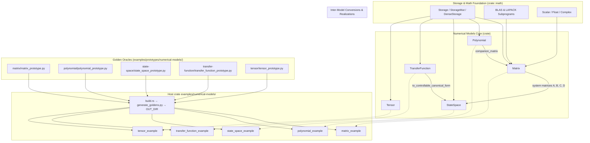

# Numerical Models Integration & Examples (Design Document)

---

### 1. Introduction

This document specifies standalone examples and host-side numerical oracles
for the five Approved numerical-model types. Matrix, polynomial, state-space,
transfer-function, and tensor behavior is specified in those designs; this
document does not restate it (C-4).

Primary usage scenarios:

1. **Standalone examples**: A nested host crate in `examples/numerical-models/`
   whose example binaries demonstrate idiomatic use of each Approved sibling
   type and assert agreement with SciPy goldens generated at build time.
2. **Host-side oracles**: Python (NumPy/SciPy) prototypes under
   `examples/prototypes/numerical-models/<slug>/` that emit Rust const tables
   into `OUT_DIR` during the example-crate build. MATLAB companions are
   optional and unused.

---

### 2. Requirements

#### 2.1 Functional Requirements

- **FR-1 — Comprehensive Exemplary Applications**: The system shall provide
  standalone executable example binaries in `examples/numerical-models/`
  demonstrating end-to-end execution of matrix linear solving, polynomial
  evaluation, state-space simulation, transfer function frequency response,
  and tensor grid interpolation.
- **FR-2 — Golden Model Numerical Prototypes**: The system shall provide
  companion NumPy/SciPy prototype scripts under
  `examples/prototypes/numerical-models/<slug>/` that compute identical
  mathematical scenarios. The nested example crate's `build.rs` runs those
  scripts so generated Rust sources are present whenever the examples or
  that crate's tests compile.

#### 2.2 Non-Functional Requirements

- **NFR-1 — Zero Dynamic Heap Allocation**: All model operations,
  factorizations, evaluations, and example executions shall operate strictly
  within stack-allocated storage without relying on runtime heap allocators.
- **NFR-2 — Numerical Backward Stability & Precision**: Numerical calculations
  shall maintain machine-epsilon precision and adhere to standard backward
  error tolerances for floating-point and fixed-point computations (Higham,
  2002).
- **NFR-3 — Bare-Metal Portability**: All numerical algorithms shall execute
  deterministically across both host systems and bare-metal embedded targets
  (`no_std`) including ARM Cortex-M and RISC-V architectures (Soro, 2021).

#### 2.3 Constraints

- **C-1 — Compile-Time Dimension Verification**: Matrix, polynomial,
  state-space, and transfer function dimensions shall be verified at compile
  time using constant generics and dimension type traits to prevent runtime
  dimension mismatch panics.
- **C-2 — Native Rust Implementation**: All algorithms and numerical models
  shall be native Rust implementations without relying on C foreign function
  interfaces (FFI), host-to-target code generation pipelines, or external
  linear algebra libraries.
- **C-3 — Deterministic Execution & Fallibility**: Library functions shall not
  invoke `unwrap()`, `expect()`, or `panic!()`, returning explicit crate-local
  `Result<T, Error>` types for ill-conditioned or singular system operations.
- **C-4 — Sibling Capabilities Out of Scope**: Matrix, polynomial,
  state-space, transfer-function and tensor functional behavior is specified
  in their own Approved design docs (`matrix-design.md`,
  `polynomial-design.md`, `state-space-design.md`,
  `transfer-function-design.md`, `tensor-design.md`); this document does not
  restate it.

---

### 3. Technical Overview

The `numerical-models` ecosystem within `control-rs` encompasses five primary
core models:

1. `Matrix<T, R, C, S>` in `src/matrix/`: Statically dimensioned 2D matrix
   engine backed by the decoupled storage abstraction (`crate::math::storage`).
2. `Polynomial<T, N, S>` in `src/polynomial/`: Single-variable polynomial
   arithmetic engine with Horner evaluation, differentiation, integration, and
   companion matrix construction.
3. `StateSpaceCore<T, NX, NU, NY, Sa, Sb, Sc, Sd>` in `src/state_space/`:
   Continuous and discrete linear time-invariant (LTI) state-space simulator and
   coordinate transformer.
4. `TransferFunction<T, N, D, Sn, Sd>` in `src/transfer_function/`: Rational
   SISO transfer function engine with Bode analysis, cascade interconnections,
   and controllable canonical realization.
5. `Tensor<T, L, B>` in `src/tensor/`: Multidimensional array container
   supporting fast multilinear grid interpolation and fixed-point quantized
   scalar inference.

To facilitate developer onboarding, verification, and regression tracking,
dedicated example applications located under `examples/numerical-models/` paired
with host-side verification prototype scripts located under
`examples/prototypes/numerical-models/` will showcase practical,
production-grade workflows for each model.

---

### 4. Architecture

#### 4.1 Standalone Example Architecture **[Proposal (not in evidence)]**

The example suite is a nested host crate (`control-rs-numerical-model-examples`)
under `examples/numerical-models/` with its own `[workspace]`, matching
`examples/qemu/` and `examples/subprograms/`. It is not a root workspace
member, so `cargo test -p control-rs` and `cargo lint` do not require Python.
`build.rs` invokes `generate_goldens.py --out-dir $OUT_DIR`. Example binaries
`include!` the generated tables, print a transcript, and assert §6.3 bounds.
Independent of CI: `cd examples/numerical-models && cargo test` or
`cargo run --example <name>`. Dedicated example binaries:

1. **`matrix_example.rs`**:
    - Demonstrates matrix creation (`from_array`, `identity`, `from_fn`).
    - Performs basic matrix arithmetic (`+`, `-`, `*`) and transposition.
    - Executes $LU$ decomposition and matrix inversion.
    - Solves a regularized linear system $Ax = b$ and verifies identity $A \cdot A^{-1} = I$.

2. **`polynomial_example.rs`**:
    - Instantiates degree-bounded polynomials.
    - Performs real and complex Horner evaluation ($p(x)$ and $p(j\omega)$).
    - Computes exact analytical derivative $p'(x)$ and integral $\int p(x) dx$.
    - Performs polynomial multiplication and Euclidean division.
    - Formulates the controllable Frobenius companion matrix $C(p)$.

3. **`state_space_example.rs`**:
    - Constructs a 2nd-order continuous-time spring-mass-damper
      system ($\ddot{x} + 2\zeta\omega_n \dot{x} + \omega_n^2 x = u$).
    - Discretizes the system using Zero-Order Hold (ZOH) with sampling
      period $\Delta t$.
    - Runs an open-loop unit step trajectory simulation tracking state
      trajectory $x[k]$ and output $y[k]$.
    - Applies an invertible similarity transformation $z = T x$ to obtain modal
      coordinates.

4. **`transfer_function_example.rs`**:
    - Defines a continuous 2nd-order lowpass Butterworth transfer
      function $H(s) = \frac{\omega_c^2}{s^2 + \sqrt{2}\omega_c s + \omega_c^2}$.
    - Evaluates frequency response $H(j\omega)$ across frequency decades.
    - Computes Bode magnitude $|H(j\omega)|_{\text{dB}}$ and
      phase $\angle H(j\omega)$.
    - Chains two transfer functions in
      series ($H_{\text{series}} = H_1 \cdot H_2$).
    - Converts the transfer function into Controllable Canonical State-Space
      form.

5. **`tensor_example.rs`**:
    - Constructs a 2D aerodynamic lift coefficient lookup
      table $C_L(\alpha, \beta)$ as a
      `Tensor<f32, Shape2D<R, C>, ArrayStorage>`.
    - Evaluates continuous multilinear interpolation for off-grid
      angle-of-attack coordinates.
    - Implements a fixed-point quantized inference layer using
      `Quantized<i8, 7>` and `Relu` activation.

#### 4.2 Numerical Prototype Oracles Architecture **[Proposal (not in evidence)]**

Companion NumPy/SciPy prototypes reside in
`examples/prototypes/numerical-models/<slug>/`. They are independent of the
Rust source. `generate_goldens.py --out-dir` writes `*_goldens.rs` into Cargo
`OUT_DIR` (not committed). Pinned versions live in `requirements.txt`. CI
installs that file; the example crate does not run `pip`.

1. **`matrix/matrix_prototype.py`**: NumPy arithmetic and `scipy.linalg.solve` /
   `inv`. Goldens are the solution $x$, $A^{-1}$, and arithmetic results, not
   $L$/$U$ factors.
2. **`polynomial/polynomial_prototype.py`**: `numpy.polynomial.polynomial` and
   `numpy.polynomial.polynomial.polycompanion` (mapped to crate last-column
   companion layout).
3. **`state-space/state_space_prototype.py`**: `scipy.signal.cont2discrete`
   with `'zoh'` and `dlsim`.
4. **`transfer-function/transfer_function_prototype.py`**:
   `scipy.signal.TransferFunction` / `freqs` for $H(j\omega)$ real/imag;
   polynomial `series`; `tf2ss` remapped to crate controllable canonical form.
5. **`tensor/tensor_prototype.py`**: `scipy.interpolate.RegularGridInterpolator`
   on the crate's `[dim0, dim1]` grid; Q7 quantization with ReLU on the
   integer raw value.

---

### 5. Alternatives

- **Monolithic Single Binary vs. Dedicated Per-Model Binaries**: Combining all
  five examples into a single giant binary was considered. However, modular
  per-model binaries (`matrix_example.rs`, `polynomial_example.rs`, etc.)
  provide targeted, readable tutorials that downstream users can directly
  inspect and copy without extraneous dependencies.

---

### 6. Verification & Validation

#### 6.1 Objectives

- Demonstrate that each sibling model example compiles and executes without
  heap allocation.
- Demonstrate agreement between Rust examples and host prototype oracles to
  the bounds in §6.3.
- Demonstrate `no_std` ETS execution of the five model test suites.

#### 6.2 Methods

| Method                    | Mechanism                                              | Requirements discharged      |
|:--------------------------|:---------------------------------------------------------|:-----------------------------|
| Back-to-back comparison   | Example binaries assert SciPy goldens from `OUT_DIR`   | FR-2, NFR-2                  |
| Doctest                   | Runnable rustdoc examples                              | FR-1                         |
| On-target execution       | ETS suites under QEMU                                  | NFR-3                        |
| Static analysis           | `cargo lint`, `cargo clippy-ci`                        | C-2, C-3                     |
| Coverage measurement      | `cargo coverage`                                       | FR-1, FR-2, NFR-1..NFR-3     |
| Compile-time shape check  | Const-generic dimensions; `compile_fail` doctests      | C-1                          |

#### 6.3 Acceptance Criteria

| Claim                         | Oracle                         | Measure        | Bound                                      | Justification                    |
|:------------------------------|:-------------------------------|:---------------|:-------------------------------------------|:---------------------------------|
| Linear solve residual         | Manufactured $Ax=b$            | Residual norm  | $\le 10^{-14}$ for `f64`                   | Higham (2002)                    |
| Horner / Bode / interpolation | Prototype scripts              | Absolute error | $\le 10^{-12}$ (`f64`), $\le 10^{-6}$ (`f32`) | Higham (2002)                |
| ZOH $A_d$ vs SciPy $e^{A T_s}$ | `scipy.signal.cont2discrete` | Residual ratio | $< 20$                                     | Van Loan (1978); Higham (2005)   |
| Zero-allocation examples      | Host allocator interception    | Exact equality | 0 heap allocations                         | NFR-1                            |

#### 6.4 Traceability

| Requirement                                      | Method                     | Artifact |
|:--------------------------------------------------|:----------------------------|:---------|
| FR-1 — Comprehensive Exemplary Applications       | Inspection                  | `examples/numerical-models/examples/*_example.rs` |
| FR-2 — Golden Model Numerical Prototypes          | Back-to-back comparison     | example binaries; `cd examples/numerical-models && cargo test` |
| NFR-1 — Zero Dynamic Heap Allocation              | Resource usage evaluation   | `#![no_std]` ETS suites |
| NFR-2 — Numerical Backward Stability & Precision  | Back-to-back comparison     | §6.3 bounds in example asserts |
| NFR-3 — Bare-Metal Portability                    | On-target execution         | QEMU ARM/RISC-V ETS |
| C-1 — Compile-Time Dimension Verification         | Compile-time shape check    | Const-generic APIs |
| C-2 — Native Rust Implementation                  | Static analysis             | No FFI in `src/{matrix,polynomial,state_space,transfer_function,tensor}` |
| C-3 — Deterministic Execution & Fallibility       | Requirements-based test     | `Result` error paths; no library panics |
| C-4 — Sibling Capabilities Out of Scope           | N/A                          | See each sibling design doc's own §6.4 |

#### 6.5 Coverage

- **Target**: $\ge 90\%$ statement coverage, $\ge 85\%$ branch coverage via
  `cargo coverage`.
- **Excluded**: Example `println!` formatting, prototype Python scripts, and
  generated `OUT_DIR` `*_goldens.rs` tables.

#### 6.6 Validation

- **Executable Model Blueprints**: Run the five example binaries in the nested
  crate `examples/numerical-models/` against the analytical claims in §6.3.
- **Prototype Oracles**: `build.rs` runs NumPy/SciPy scripts and writes const
  tables to `OUT_DIR`. `cargo ci` runs those example binaries (Python is not
  invoked by xtask except through that crate's build). Library `cargo test`
  and ETS suites do not execute Python.

#### 6.7 Not Verified

- Automated stdout diff of example transcripts against live Python is not
  established; comparison is typed const tables, not text.
- MATLAB and `python-control` companion scripts are optional and not required.
- Trans-architecture floating-point bitwise equivalence of SciPy goldens vs
  on-target ETS is not claimed.

---

### 7. Performance & Resource Considerations

- **Stack Allocation Limits**: All model storage backends use fixed-size stack
  arrays. Typical models (e.g., $4\times 4$ matrices or degree-8 polynomials)
  occupy less than 256 bytes of stack memory, well within embedded MCU limits (
  Soro, 2021).
- **Computational Complexity**: Horner evaluation operates in $O(N)$
  operations; $LU$ and matrix operations operate in $O(N^3)$ operations;
  multilinear tensor interpolation requires $O(2^K)$ corner evaluations
  where $K$ is the tensor rank (Higham, 2002; Kolda and Bader, 2009).

---

### 8. Risks & Open Questions

- **[Proposal (not in evidence)] Example Runner Structure**: Nested host crate
  under `examples/numerical-models/` with `cargo run --example <name>` from that
  directory. GitHub Actions installs `requirements.txt`; xtask does not run
  `pip`.
- **[Proposal (not in evidence)] Prototype Tooling Environment**: NumPy/SciPy
  oracles with pinned `requirements.txt`. MATLAB and `python-control` remain
  optional and unused.
- **Fixed-Point Scaling Invariants**: Scaling fixed-point tensors requires
  careful selection of fractional bit shift parameters ($Q_7$, $Q_{15}$) to
  prevent overflow during intermediate accumulator products (ARM, 2025).

---

### 9. Development Plan

| Task / Feature                                                     | Description                                                                                                                                                                                                                         | Estimated Effort (1-10) |
|:-------------------------------------------------------------------|:------------------------------------------------------------------------------------------------------------------------------------------------------------------------------------------------------------------------------------|:------------------------|
| Step 1: Host Prototype Oracles                                     | Implement Python reference prototype oracles (`matrix_prototype.py`, `polynomial_prototype.py`, `state_space_prototype.py`, `transfer_function_prototype.py`, `tensor_prototype.py`) under `examples/prototypes/numerical-models/`. | 3                       |
| Step 2: Matrix Example (`matrix_example.rs`)                       | Implement standalone matrix linear solver, decomposition, transposition, and arithmetic example matching prototype output.                                                                                                           | 3                       |
| Step 3: Polynomial Example (`polynomial_example.rs`)               | Implement Horner evaluation, polynomial calculus, and companion matrix root-finding example matching prototype output.                                                                                                              | 3                       |
| Step 4: State-Space Example (`state_space_example.rs`)             | Implement 2nd-order dynamical system simulation, ZOH discretization, and similarity transform example matching prototype output.                                                                                                    | 4                       |
| Step 5: Transfer Function Example (`transfer_function_example.rs`) | Implement frequency response, Bode analysis, series cascade, and controllable canonical realization example matching prototype output.                                                                                              | 4                       |
| Step 6: Tensor Example (`tensor_example.rs`)                       | Implement 2D multilinear grid lookup table interpolation and quantized fixed-point inference example matching prototype output.                                                                                                     | 3                       |
| Step 7: Workspace Integration & CI Validation                      | Nested example crate `build.rs` generates SciPy goldens; GitHub Actions installs `requirements.txt`; `cargo ci` runs the five example binaries. Independent check: `cd examples/numerical-models && cargo test`. | 2                       |

---

### 10. Revision History

| Revision | Date            | Author          | Description                                                                                                                           |
|:---------|:----------------|:----------------|:--------------------------------------------------------------------------------------------------------------------------------------|
| 1.0      | August 25, 2026 | @MitchellDScott | Initial draft: numerical models integration, end-to-end examples, and validation framework.                                            |
| 1.1      | August 25, 2026 | @MitchellDScott | Verification oracles: added host-side prototype oracles (Python/MATLAB) under `examples/prototypes/numerical-models/`.              |
| 1.2      | August 26, 2026 | @MitchellDScott | Scoped examples strictly to numerical model layer operations (removed higher-level control toolbox artifacts and migration plan).    |
| 1.3      | August 26, 2026 | @MitchellDScott | Scoped §1 to examples/oracles; sibling capabilities are C-4. Dropped unused bibliography.                                         |
| 1.4      | August 27, 2026 | @MitchellDScott | Nested example crate; SciPy goldens generated into `OUT_DIR` at build; `cargo ci` runs example binaries.                          |

---

## References

Crate-wide V&V and safety standards live in
[`documentation/vv-standards.md`](../vv-standards.md); they are not restated
here.

[1] N. J. Higham, *Accuracy and Stability of Numerical Algorithms*, 2nd ed.
Philadelphia, PA, USA: Society for Industrial and Applied Mathematics, 2002,
doi: 10.1137/1.9780898718027.

[2] T. G. Kolda and B. W. Bader, "Tensor Decompositions and Applications,"
*SIAM Review*, vol. 51, no. 3, pp. 455–500, Aug. 2009, doi: 10.1137/07070111X.

[3] S. Soro, "TinyML for Ubiquitous Edge AI," MITRE Corporation, McLean, VA,
USA, Rep. no. MTR200519, Feb. 2021. [Online].
Available: https://arxiv.org/abs/2102.01255. Accessed: Aug. 25, 2026.

[4] ARM Ltd., "Matrix Multiplication," CMSIS-DSP Documentation, 2025. [Online].
Available: https://arm-software.github.io/CMSIS-DSP/main/group__MatrixMult.html.
Accessed: Aug. 25, 2026.

