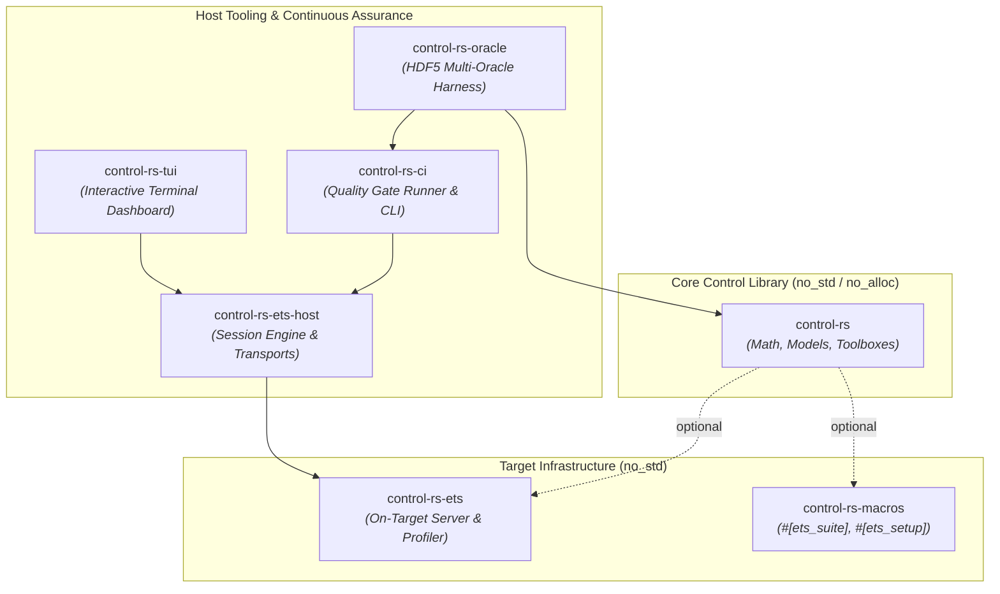
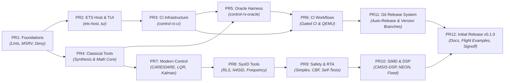
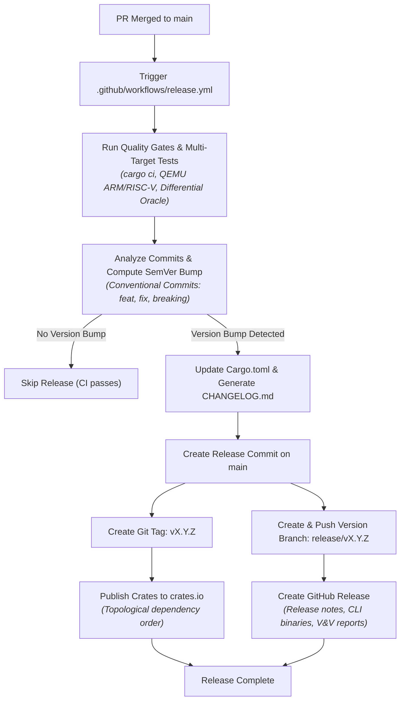
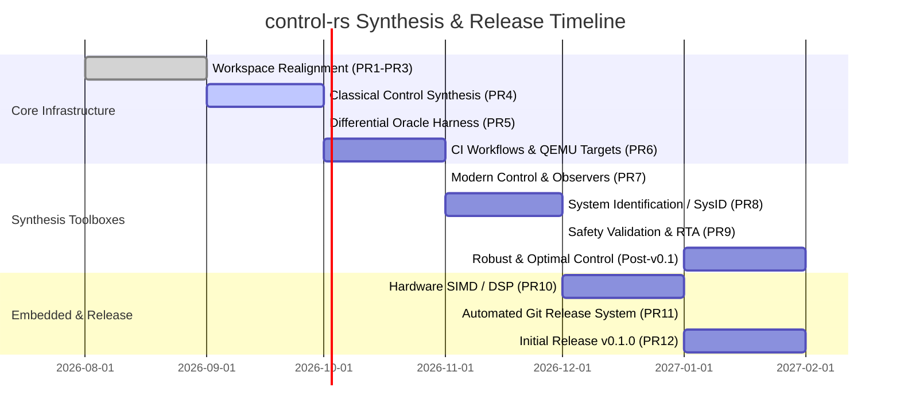

# `control-rs` Product Roadmap

`control-rs` provides high-assurance, native `#![no_std]` / `#![no_alloc]` numerical models, control synthesis algorithms, simulation tools, estimators, and Embedded Test Server (ETS) infrastructure for safety-critical autonomous systems, robotics, and bare-metal flight computers.

---

## 1. Vision & Core Objectives

The project delivers three simultaneous capabilities without relying on MATLAB-to-C codegen pipelines or dynamic host-side allocation:

1. **High-Assurance Numerical Core & Synthesis**: Compile-time shape checks, zero dynamic allocation, continuous/discrete LTI models, and control synthesis toolboxes running natively on host and bare-metal targets.
2. **On-Target Execution & Profiling (ETS)**: Embedded Test Server with deterministic cycle timing, stack watermarking, target-agnostic serial/TCP framing, crash isolation, and interactive TUI inspection.
3. **Continuous Verification & Multi-Oracle V&V**: Rigorous cross-validation against high-precision reference oracles (SciPy, JAX, Python-Flint, Harold, TensorFlow Lite) enforced by automated quality gates.

---

## 2. Workspace Architecture

### Crate Descriptions

| Crate | Target / Allocation | Role & Key Responsibilities |
|:------|:-------------------|:----------------------------|
| **[`control-rs`](../src/)** | `#![no_std]` / no-alloc | Core numerical models (`Matrix`, `Polynomial`, `Tensor`, `TransferFunction`, `StateSpace`), BLAS/LAPACK subprograms, classical control synthesis, modern state-space algorithms, sysid, and safety validation toolboxes. |
| **[`control-rs-ets`](../control-rs-ets/)** | `#![no_std]` / no-alloc | Bare-metal test server runtime, ARM DWT / RISC-V cycle profiling, stack painting, postcard telemetry serialization, and panic containment. |
| **[`control-rs-macros`](../control-rs-macros/)** | Host proc-macro | Procedural macros (`#[ets_suite]`, `#[ets_setup]`) generating linker section descriptors and test table discovery. |
| **[`control-rs-ets-host`](../control-rs-ets-host/)** | Host (std) | Headless session state machine, COBS framing, serial/TCP transport abstractions, target reset management, and automated test orchestration. |
| **[`control-rs-tui`](../control-rs-tui/)** | Host (std) | Real-time terminal interface (Ratatui) for monitoring target telemetry, hardware cycle counts, stack peaks, and interactive test triggering. |
| **[`control-rs-ci`](../control-rs-ci/)** | Host (std) | Configurable quality gate runner (`gate.toml`), report generator (`ci-report.md`), trace analyzer, and cargo toolchain orchestration. |
| **[`control-rs-oracle`](../control-rs-oracle/)** | Host (std) | Multi-oracle differential test harness, HDF5 reference dataset loading, non-linear plant models (DC motor, buck converter, inverted pendulum), and residual tolerance evaluation. |

---

## 3. Dependency & Execution Sequence (Path to Initial Release)

The path to the initial release (`v0.1.0`) is organized into twelve focused, productive PR stages based on compilation boundaries, real crate dependencies, and domain verification gates.

### Stage Breakdown

#### PR1: Workspace Foundations & Strict Lint Baseline
- **Status**: Completed (Merged)
- **Scope**: Establish baseline workspace hygiene, licensing, and strict compiler constraints.
- **Key Deliverables**:
  - Unified workspace lint table (`clippy::all`, `clippy::pedantic`, `panic = "deny"`, `unwrap_used = "deny"`, `arithmetic_side_effects = "deny"`).
  - Minimum Supported Rust Version (MSRV) pinned to `1.88.0` with Edition 2024.
  - Dual license configuration (`MIT OR Apache-2.0`), `deny.toml` supply chain policy, and `tarpaulin.toml` baseline.
  - Pre-commit verification scripts and `publish = false` on internal workspace crates.
- **Invariants & Exit Criteria**: `cargo check --workspace --all-targets` passes with zero warnings under MSRV.

#### PR2: ETS Host Extraction & Terminal Dashboard
- **Status**: In Progress (Current Branch)
- **Scope**: Retire legacy `control-rs-xtask` and establish standalone host communication and interactive terminal UI crates.
- **Key Deliverables**:
  - Extract `control-rs-ets-host`: target-agnostic serial/TCP framing, COBS packet codec, session state machine, and panic restart handling.
  - Extract `control-rs-tui`: Ratatui-based dashboard displaying live test discovery, execution metrics, hardware cycles, elapsed time, and scrollable logs.
  - Establish clear host-target interface boundaries without monolithic task runners.
- **Invariants & Exit Criteria**: Standalone `control-rs-ets-host` and `control-rs-tui` crates compile cleanly; `control-rs-xtask` references removed from root workspace.

#### PR3: CI Quality Gate Infrastructure (`control-rs-ci`)
- **Status**: Pending
- **Scope**: Build dedicated CI quality gate orchestration and reporting tooling.
- **Key Deliverables**:
  - Implement `QualityGate` trait abstraction and `CargoArgvGate` execution dispatch.
  - Add `gate.toml` configuration for selective gate execution (`fmt`, `clippy`, `test`, `coverage`, `qemu`).
  - Implement CLI subcommands (`ci`, `gate`, `report`, `trace`, `validate`) and unified `ci-report.md` generation.
- **Invariants & Exit Criteria**: `cargo run -p control-rs-ci -- ci` executes all configured workspace checks and outputs structured `ci-report.md`.

#### PR4: Classical Control Synthesis & Math Core
- **Status**: Pending
- **Scope**: Native `#![no_std]` classical control synthesis and companion mathematical extensions.
- **Key Deliverables**:
  - Add `src/classical_tools/`:
    - Routh-Hurwitz stability criterion and array formulation.
    - Root Locus calculation and Evans grid generation.
    - Gain and Phase margin computation with Nichols / Nyquist helpers.
    - Continuous and discrete PID controllers with anti-windup, derivative filtering, and bumpless transfer.
    - Canonical state-space realizations (Controllable, Observable, Modal/Diagonal).
    - Step response time-domain characteristics (rise time, settling time, overshoot, peak time).
  - Core mathematical extensions across `Matrix`, `Polynomial`, and `TransferFunction` (stabilized polynomial root finders, frequency response algorithms).
  - Benchmark suite (`benches/classical_tools.rs`) integrated into workspace benchmarks.
- **Invariants & Exit Criteria**: Zero heap allocation across all classical synthesis operations; exact closed-loop stability verification on known test polynomials.

#### PR5: Multi-Oracle Differential Test Harness (`control-rs-oracle`)
- **Status**: Pending
- **Scope**: Transition host reference cross-validation from a nested example directory to a first-class workspace member (`control-rs-oracle`), preventing namespace collision with the future library `validation` toolbox.
- **Key Deliverables**:
  - New `control-rs-oracle` crate providing HDF5 oracle data loading and streaming differential testing.
  - Realistic non-linear dynamic plants: permanent magnet DC motor, synchronous buck converter, inverted pendulum.
  - Numerical tolerance tables evaluating absolute/relative residual thresholds against SciPy, JAX, Python-Flint, and Harold.
  - Deprecation and removal of the legacy `examples/numerical-models-validation/` nested crate.
- **Invariants & Exit Criteria**: Differential test harness validates all core models against HDF5 golden datasets within IEEE 754 tolerance limits.

#### PR6: CI Workflow Hardening & Multi-Target QEMU Emulation
- **Status**: Pending
- **Scope**: Integrate the unified gate runner with GitHub Actions workflow automation.
- **Key Deliverables**:
  - Refactor `.github/workflows/CI.yml` and `.github/workflows/examples.yml` to call `control-rs-ci`.
  - Virtual ETS multi-architecture test matrix running QEMU for ARM Cortex-M (`thumbv7em-none-eabihf`) and RISC-V (`riscv32imac-unknown-none-elf`).
  - Automated publishing of coverage metrics, gate verdicts, and numerical residual artifacts to PR step summaries.
- **Invariants & Exit Criteria**: CI runs execute under QEMU on both ARM and RISC-V targets and post unified verdicts on every PR.

#### PR7: Modern Control Toolbox & State Observers (`src/modern_control`)
- **Status**: Pending
- **Scope**: Optimal state-space control, Riccati equation solvers, and linear state estimation.
- **Key Deliverables**:
  - Continuous (CARE) and Discrete (DARE) Algebraic Riccati Equation solvers via real Schur decomposition and matrix sign function.
  - Linear Quadratic Regulator (LQR) with state and input weighting matrices ($Q \ge 0, R > 0$).
  - Linear Quadratic Estimator (LQE / Kalman Filter) for discrete/continuous process and measurement noise covariances.
  - Linear Quadratic Gaussian (LQG) combined regulator-observer synthesis.
  - State Observers: Luenberger full-order and reduced-order observers with pole placement via Ackermann's formula and robust eigenstructure assignment.
- **Invariants & Exit Criteria**: Algebraic Riccati solvers converge to symmetric positive-semidefinite solutions; zero dynamic allocation during observer updates.

#### PR8: System Identification (SysID) & Frequency Estimation (`src/sysid`)
- **Status**: Pending
- **Scope**: Real-time parameter estimation, state-space subspace identification, and empirical transfer function fitting.
- **Key Deliverables**:
  - Time-Domain Recursive Estimation: Recursive Least Squares (RLS) with exponential forgetting factors and covariance resetting; Extended RLS (ERLS) for colored noise environments.
  - State-Space Subspace Identification: Deterministic and stochastic subspace identification (N4SID, MOESP, PO-MOESP) using QR factorization and singular value decomposition.
  - Frequency-Domain Parameter Estimation: Transfer function parameter estimation from measured frequency response data (FRD) via Sanathanan-Koerner iterative weighting.
- **Invariants & Exit Criteria**: Recursive estimators execute in deterministic cycle bounds on embedded targets; subspace identification recovers plant state dimension accurately from noisy signals.

#### PR9: Safety Validation & Run-Time Assurance (`src/validation`)
- **Status**: Pending
- **Scope**: Safety certification infrastructure, switching logic, invariance monitoring, and hardware self-tests.
- **Key Deliverables**:
  - Run-Time Assurance (RTA) / Simplex Architecture: ASTM F3269 compliant switching logic, primary complex controller monitoring, and deterministic fallback recovery controller engagement.
  - Control Barrier Functions (CBF) and forward invariance verification over bounded operational envelopes.
  - SLICOT CAREX benchmark suite and certified numerical reference problems.
  - Embedded Hardware Self-Tests: IEC 60730 Class B compliant startup and periodic runtime self-tests (CPU register checks, RAM march tests, flash CRC verification).
- **Invariants & Exit Criteria**: Simplex architecture guarantees fallback engagement within 1 control cycle upon barrier violation; IEC 60730 routines verify memory without modifying system state.

#### PR10: Hardware Acceleration & Architecture Subprograms
- **Status**: Pending
- **Scope**: Expand SIMD and hardware DSP backends to maximize numerical throughput on flight microcontrollers and host simulators.
- **Key Deliverables**:
  - Architecture-specific subprograms in `control-rs::math::subprograms`:
    - ARM Cortex-M4/M7: ARM CMSIS-DSP SIMD assembly subprograms (`thumbv7em-none-eabihf`).
    - ARM Cortex-A / Apple Silicon: ARM NEON and Apple Accelerate framework integration.
    - RISC-V (32-bit / 64-bit): NMSIS-DSP and RISC-V Vector Extension subprograms.
    - x86_64: AVX2 + FMA subprograms.
  - Fixed-point (`FixedNum`) and quantized arithmetic support for integer-only MCUs without FPUs.
- **Invariants & Exit Criteria**: Accelerated subprograms produce bit-exact or IEEE-compliant results matching the pure Rust fallback implementation.

#### PR11: Automated Git Release System & CI/CD Pipeline
- **Status**: Pending
- **Scope**: Production release automation triggered on `main` merges, generating semantic releases, publishing packages, and preserving immutable version branches in Git.
- **Key Deliverables**:
  - Release workflow `.github/workflows/release.yml` triggered on push to `main`.
  - Automatic semantic version calculation from Conventional Commits and workspace dependency graphs.
  - Atomic workspace version bumps and automated `CHANGELOG.md` generation.
  - Automated Git tagging (`vX.Y.Z`) and **persistent version branch creation (`release/vX.Y.Z`)** for every release.
  - Topological publishing of workspace crates to crates.io with dry-run verification gates.
  - GitHub Release generation with pre-compiled CLI tools (`control-rs-ci`, `control-rs-tui`), SHA-256 checksums, and validation summary artifacts.
- **Invariants & Exit Criteria**: Every merge to `main` with releasable changes automatically creates both a tag `vX.Y.Z` and a dedicated `release/vX.Y.Z` branch in Git, passing all verification gates before publishing.

#### PR12: Documentation Consolidation, End-to-End Flight Examples & Initial Release (`v0.1.0`)
- **Status**: Pending
- **Scope**: Final documentation polish, end-to-end multi-target examples, workspace coverage validation, and cutting the official `v0.1.0` release.
- **Key Deliverables**:
  - Comprehensive end-to-end flight control and robotics examples running on host, QEMU ARM/RISC-V, and bare-metal targets.
  - Consolidated architecture documentation, user manuals, and crate-level API documentation.
  - Workspace code coverage audit achieving $\ge 90\%$ line coverage baseline.
  - Official signoff, triggering the automated release pipeline to produce `v0.1.0` and preserve the `release/v0.1.0` branch.
- **Invariants & Exit Criteria**: `cargo ci` passes on all targets; documentation builds with zero warnings (`RUSTDOCFLAGS="-D warnings"`); `v0.1.0` published successfully.

---

## 4. Automated Git Release System & Version Branch Preservation

The release infrastructure automates package distribution, version tracking, and audit trail preservation on every push to `main`.

### 4.1. Core Principles & Capabilities

1. **Continuous Release on `main`**: Merging a feature or fix PR into `main` automatically evaluates whether a release is warranted based on Conventional Commits (`feat:`, `fix:`, `perf:`, `refactor:`, `BREAKING CHANGE:`).
2. **Branch-per-Version Preservation (`release/vX.Y.Z`)**:
   - For every release cut (`vX.Y.Z`), the release workflow automatically creates and pushes a dedicated Git branch: `release/vX.Y.Z` (for example, `release/v0.1.0`).
   - **Safety & Compliance Rationale**: Safety-critical aerospace and robotics systems (DO-178C, ISO 26262) require fixed, auditable branch references for qualification baselines.
   - **Patch & Backport Support**: Enables targeted maintenance and security cherry-picks to historical releases without disrupting ongoing trunk development on `main`.
3. **Topological Crates.io Distribution**:
   - Automatically resolves internal workspace dependencies and publishes crates in strict topological order:
     1. `control-rs-macros`
     2. `control-rs-ets`
     3. `control-rs`
     4. `control-rs-ets-host`
     5. `control-rs-tui`
     6. `control-rs-ci`
     7. `control-rs-oracle`
4. **Comprehensive Artifact Bundling**:
   - GitHub Releases are automatically populated with:
     - Formatted release notes and changelog entries.
     - Multi-platform host binaries (`control-rs-ci`, `control-rs-tui`) for Linux, macOS, and Windows.
     - SHA-256 checksums (`SHA256SUMS.txt`).
     - Validation reports (`ci-report.md`, `tarpaulin-report.html`, differential oracle residual summaries).

### 4.2. Release Workflow Lifecycle (`.github/workflows/release.yml`)

| Step | Operation | Description |
|:-----|:----------|:------------|
| **1. Verification** | `cargo ci` + QEMU + Oracle | Validates format, clippy, unit tests, coverage ($\ge 90\%$), target emulation, and oracle residuals before allowing release actions. |
| **2. Version Detection** | Semantic version analysis | Inspects commit history since previous tag to calculate patch, minor, or major version increment. |
| **3. Changelog & Bump** | Atomic workspace commit | Updates workspace crate versions and prepends changelog entries to `CHANGELOG.md`. |
| **4. Tagging** | `git tag vX.Y.Z` | Tags the release commit with annotated semantic version. |
| **5. Branch Preservation** | `git branch release/vX.Y.Z` | Creates and pushes `release/vX.Y.Z` to origin, establishing an immutable version branch. |
| **6. Crates.io Publish** | `cargo publish` | Publishes public workspace crates to crates.io with retry logic and index propagation delays. |
| **7. GitHub Release** | `gh release create` | Creates official GitHub release with notes, attached assets, and verification reports. |

---

## 5. Control Synthesis Toolboxes Roadmap

Following core infrastructure stabilization, domain-specific synthesis toolboxes are implemented natively under `#![no_std]` / `#![no_alloc]` constraints.

### 5.1. Classical Control Toolbox (`src/classical_tools`)
- **PID Control**: Continuous and discrete PID with derivative low-pass filtering, anti-windup clamping/back-calculation, and bumpless parameter transfer.
- **Root Locus & Stability**: Routh-Hurwitz stability criterion, Evans grid evaluation, and stabilized polynomial root finding.
- **Frequency Response**: Gain/phase margins, Nichols chart metrics, and Nyquist encirclement evaluation.
- **Time-Domain Analysis**: Automated step response characteristic extraction (rise time, peak overshoot, settling time, steady-state error).
- **Canonical Forms**: Realizations for Controllable, Observable, and Modal canonical state-space representations.

### 5.2. Modern Control Toolbox (`src/modern_control`)
- **Riccati Solvers**: Continuous (CARE) and Discrete (DARE) Algebraic Riccati Equation solvers using real Schur decomposition and matrix sign function.
- **Optimal Regulators**: Linear Quadratic Regulator (LQR) with state weighting $Q \ge 0$ and input weighting $R > 0$.
- **Linear Estimation**: Linear Quadratic Estimator (LQE / Kalman Filter) for discrete and continuous noise models.
- **Combined Synthesis**: Linear Quadratic Gaussian (LQG) controller-observer closed-loop synthesis.
- **State Observers**: Full-order and reduced-order Luenberger observers with Ackermann pole assignment.

### 5.3. System Identification (`src/sysid`)
- **Recursive Estimation**: Recursive Least Squares (RLS) with exponential forgetting factors and covariance resetting; Extended RLS (ERLS).
- **Subspace Identification**: Deterministic and stochastic subspace state-space identification (N4SID, MOESP, PO-MOESP) using QR decomposition and SVD.
- **Frequency-Domain Estimation**: Transfer function parameter fitting from measured frequency response data (FRD) via Sanathanan-Koerner weighting.

### 5.4. Safety Validation & Run-Time Assurance (`src/validation`)
- **Run-Time Assurance (RTA) / Simplex Architecture**: ASTM F3269-compliant switching logic for primary advanced controllers with deterministic fallback engagement.
- **Control Barrier Functions (CBF)**: Forward invariance verification and safe control filtering.
- **Embedded Hardware Self-Tests**: IEC 60730 Class B compliant startup and runtime self-tests (CPU register patterns, March C- RAM tests, flash CRC32).
- **Benchmark Problems**: SLICOT CAREX test suite for certifying numerical Riccati precision.

### 5.5. Robust & Optimal Control (`src/robust_control` — Post v0.1.0)
- **Norm Computations**: Exact $H_2$ and $H_\infty$ norm calculations for continuous/discrete state-space systems via Hamiltonian matrix pencils.
- **Uncertainty & Robust Stability**: Small gain theorem bounds, multiplicative/additive uncertainty modeling, and structured singular value ($\mu$) bounds.
- **Loop Shaping**: Mixed-sensitivity $S/T/KS$ synthesis for disturbance rejection.
- **Gain Scheduling**: Multilinear grid-based gain scheduling using the `Tensor` engine with continuous hypercube interpolation.

---

## 6. Hardware Acceleration & Embedded Targets

### Architecture-Specific Subprograms

To maximize throughput on resource-constrained embedded microcontrollers and high-rate host simulators, `control-rs::math::subprograms` will expand hardware backends:

| Architecture | Target Triple | Acceleration Backend | Target Application |
|:-------------|:--------------|:---------------------|:-------------------|
| **ARM Cortex-M4/M7** | `thumbv7em-none-eabihf` | ARM CMSIS-DSP (SIMD assembly) | Flight stabilization, fast inner loop control (1–10 kHz) |
| **ARM Cortex-A / Apple Silicon** | `aarch64-unknown-linux-gnu` / `aarch64-apple-darwin` | ARM NEON / Apple Accelerate | High-DOF robotics, vision-in-the-loop navigation |
| **RISC-V (32-bit/64-bit)** | `riscv32imac-unknown-none-elf` / `riscv64` | NMSIS-DSP / RISC-V Vector Extension | Radiation-hardened spacecraft avionics, open-silicon MCUs |
| **x86_64** | `x86_64-unknown-linux-gnu` / `x86_64-pc-windows-msvc` | AVX2 + FMA / OpenBLAS | Hardware-in-the-Loop (HIL) simulators, multi-oracle oracles |

### Fixed-Point & Quantized Arithmetic
- Expand `FixedNum` and `Quantized` primitives across full state-space and transfer function evaluations.
- Provide compile-time scaling and overflow protection guarantees for integer-only MCUs without FPUs.

---

## 7. Continuous Assurance & Verification Strategy

| Metric | Target / Standard | Verification Mechanism |
|:-------|:------------------|:-----------------------|
| **Code Coverage** | $\ge 90\%$ workspace line coverage | `cargo tarpaulin` via `control-rs-ci` |
| **Zero Dynamic Allocation** | 0 heap allocations in core synthesis | `#![no_std]` crate level enforcement + BSS/data section checks |
| **Zero Panics in Library Code** | No `unwrap()`, `expect()`, or `panic!()` | Clippy `-D clippy::panic -D clippy::unwrap_used` |
| **Target Execution Fidelity** | Identical numeric results on host and target | ETS runners under QEMU ARM/RISC-V and physical hardware |
| **Mathematical Precision** | Residual errors within IEEE 754 epsilon bounds | `control-rs-oracle` against SciPy / JAX reference datasets |
| **Supply Chain Integrity** | Zero unapproved licenses / vulnerabilities | `cargo deny check` in CI quality gates |
| **Release Branch Preservation** | Dedicated `release/vX.Y.Z` branch for each release | Automated Git release pipeline in `.github/workflows/release.yml` |
