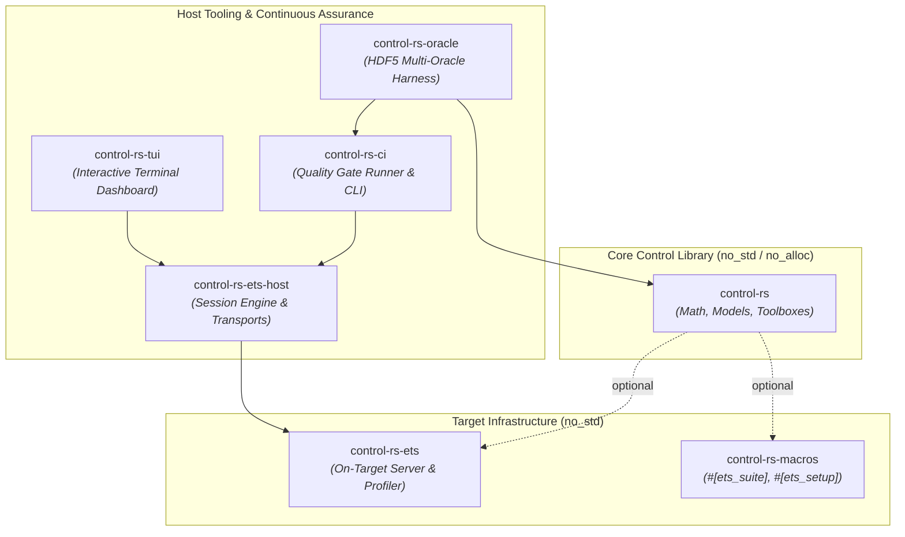
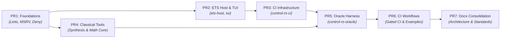
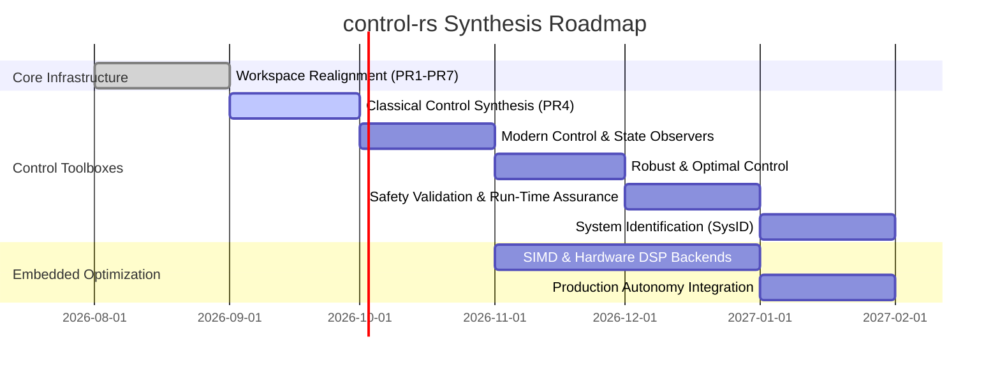

# `control-rs` Product Roadmap

`control-rs` provides high-assurance, native `#![no_std]` / `#![no_alloc]` numerical models, control synthesis algorithms, simulation tools, estimators, and Embedded Test Server (ETS) infrastructure for safety-critical autonomous systems, robotics, and bare-metal flight computers.

---

## 1. Vision & Core Objectives

The project delivers three simultaneous capabilities without relying on MATLAB-to-C codegen pipelines or dynamic host-side allocation:

1. **High-Assurance Numerical Core & Synthesis**: Compile-time shape checks, zero dynamic allocation, continuous/discrete LTI models, and control synthesis toolboxes running natively on host and bare-metal targets.
2. **On-Target Execution & Profiling (ETS)**: Embedded Test Server with deterministic cycle timing, stack watermarking, target-agnostic serial/TCP framing, crash isolation, and interactive TUI inspection.
3. **Continuous Verification & Multi-Oracle V&V**: Rigorous cross-validation against high-precision reference oracles (SciPy, JAX, Python-Flint, Harold, TensorFlow Lite) enforced by automated quality gates.

---

## 2. Workspace Architecture

### Crate Descriptions

| Crate | Target / Allocation | Role & Key Responsibilities |
|:------|:-------------------|:----------------------------|
| **[`control-rs`](../src/)** | `#![no_std]` / no-alloc | Core numerical models (`Matrix`, `Polynomial`, `Tensor`, `TransferFunction`, `StateSpace`), BLAS/LAPACK subprograms, classical control synthesis, modern state-space algorithms, and safety validation toolboxes. |
| **[`control-rs-ets`](../control-rs-ets/)** | `#![no_std]` / no-alloc | Bare-metal test server runtime, ARM DWT / RISC-V cycle profiling, stack painting, postcard telemetry serialization, and panic containment. |
| **[`control-rs-macros`](../control-rs-macros/)** | Host proc-macro | Procedural macros (`#[ets_suite]`, `#[ets_setup]`) generating linker section descriptors and test table discovery. |
| **[`control-rs-ets-host`](../control-rs-ets-host/)** | Host (std) | Headless session state machine, COBS framing, serial/TCP transport abstractions, target reset management, and automated test orchestration. |
| **[`control-rs-tui`](../control-rs-tui/)** | Host (std) | Real-time terminal interface (Ratatui) for monitoring target telemetry, hardware cycle counts, stack peaks, and interactive test triggering. |
| **[`control-rs-ci`](../control-rs-ci/)** | Host (std) | Configurable quality gate runner (`gate.toml`), report generator (`ci-report.md`), trace analyzer, and cargo toolchain orchestration. |
| **[`control-rs-oracle`](../control-rs-oracle/)** | Host (std) | Multi-oracle differential test harness, HDF5 reference dataset loading, non-linear plant models (DC motor, buck converter), and residual tolerance evaluation. |

---

## 3. Dependency & Execution Sequence

The migration to the modular multi-crate architecture is organized into seven sequential stages based on real crate dependencies and compilation boundaries.

### Stage Breakdown

#### PR1: Workspace Foundations
- **Scope**: Establish baseline workspace hygiene and strict compiler constraints.
- **Key Deliverables**:
  - Unified workspace lint table (`clippy::all`, `clippy::pedantic`, `panic = "deny"`, `unwrap_used = "deny"`).
  - Minimum Supported Rust Version (MSRV) pinned to `1.88.0` with Edition 2024.
  - License clarification (`MIT OR Apache-2.0`), `deny.toml` supply chain policy, and `tarpaulin.toml` configuration.
  - Pre-commit verification scripts and `publish = false` on internal crates.

#### PR2: ETS Host Extraction & TUI
- **Scope**: Retire legacy `control-rs-xtask` and establish standalone host communication and UI crates.
- **Key Deliverables**:
  - Extract `control-rs-ets-host`: target-agnostic serial/TCP framing, COBS packet codec, session state machine, and panic restart handling.
  - Extract `control-rs-tui`: Ratatui-based dashboard displaying live test discovery, execution metrics, cycles, time, and scrollable logs.
  - Establish clear host-target interface boundaries without monolithic task runners.

#### PR3: CI Quality Gate Infrastructure (`control-rs-ci`)
- **Scope**: Build dedicated CI quality gate orchestration and reporting tooling.
- **Key Deliverables**:
  - Implement `QualityGate` trait abstraction and `CargoArgvGate` execution dispatch.
  - Add `gate.toml` configuration for selective gate execution (`fmt`, `clippy`, `test`, `coverage`, `qemu`).
  - Implement CLI subcommands (`ci`, `gate`, `report`, `trace`, `validate`) and unified `ci-report.md` generation.

#### PR4: Classical Control Toolbox & Math Extensions
- **Scope**: Native `#![no_std]` classical control synthesis and companion mathematical extensions.
- **Key Deliverables**:
  - Add `src/classical_tools/`:
    - Routh-Hurwitz stability criterion and array formulation.
    - Root Locus calculation and Evans grid generation.
    - Gain and Phase margin computation with Nichols / Nyquist helpers.
    - Continuous and discrete PID controllers with anti-windup, derivative filtering, and bumpless transfer.
    - Canonical state-space realizations (Controllable, Observable, Modal/Diagonal).
    - Step response time-domain characteristics (rise time, settling time, overshoot, peak time).
  - Core mathematical extensions across `Matrix`, `Polynomial`, and `TransferFunction` (stabilized root finders, frequency response algorithms).
  - Benchmark suite (`benches/classical_tools.rs`) integrated into workspace benchmarks.

#### PR5: Multi-Oracle Differential Test Harness (`control-rs-oracle`)
- **Scope**: Transition host reference cross-validation from a nested example directory to a first-class workspace member (`control-rs-oracle`), preventing namespace collision with the future library `validation` toolbox.
- **Key Deliverables**:
  - New `control-rs-oracle` crate providing HDF5 oracle data loading and streaming differential testing.
  - Realistic non-linear dynamic plants: permanent magnet DC motor, synchronous buck converter, inverted pendulum.
  - Numerical tolerance tables evaluating absolute/relative residual thresholds against SciPy, JAX, Python-Flint, and Harold.
  - Deprecation and removal of the legacy `examples/numerical-models-validation/` nested crate.

#### PR6: CI Workflow Integration
- **Scope**: Integrate the unified gate runner with GitHub Actions workflow automation.
- **Key Deliverables**:
  - Refactor `.github/workflows/CI.yml` and `.github/workflows/examples.yml` to call `control-rs-ci`.
  - Virtual ETS multi-architecture test matrix running QEMU for ARM Cortex-M (`thumbv7em-none-eabihf`) and RISC-V (`riscv32imac-unknown-none-elf`).
  - Automated publishing of coverage metrics, gate verdicts, and numerical residual artifacts.

#### PR7: Documentation & Architecture Consolidation
- **Scope**: Restructure repository documentation to reflect current crate topology and standards.
- **Key Deliverables**:
  - Restructure `documentation/` subdirectories: `ci/`, `ets/`, `ets-host/`, `tui/`, `control-toolboxes/`, `vv/`.
  - Merge verification standards (`vv-standards.md`) into authoritative design templates (`design-template.md`).
  - Update top-level `README.md`, `documentation/development-guide.md`, and crate-level docstrings.

---

## 4. Control Synthesis Toolboxes Roadmap

Following workspace realignment, functional toolboxes will be introduced under the `no_std` / `no_alloc` core library.

### 4.1. Modern Control Toolbox (`src/modern_control`)
- **Algebraic Riccati Equation Solvers**: Continuous (CARE) and Discrete (DARE) Riccati solvers via real Schur decomposition and matrix sign function.
- **Optimal Regulators & Estimators**:
  - Linear Quadratic Regulator (LQR) with state and input weighting matrices ($Q \ge 0, R > 0$).
  - Linear Quadratic Estimator (LQE / Kalman Filter) for discrete/continuous process and measurement noise covariances.
  - Linear Quadratic Gaussian (LQG) combined regulator-observer synthesis.
- **State Observers**: Luenberger full-order and reduced-order observers with pole placement via Ackermann's formula and robust eigenstructure assignment.

### 4.2. Robust & Optimal Control (`src/robust_control`)
- **Norm Computations**: Exact $H_2$ and $H_\infty$ norm calculations for continuous and discrete state-space systems via Hamiltonian matrix pencils.
- **Uncertainty & Robust Stability**: Small gain theorem bounds, multiplicative/additive input uncertainty modeling, and structured singular value ($\mu$) upper/lower bounds.
- **Loop Shaping & $H_\infty$ Synthesis**: Mixed-sensitivity $S/T/KS$ synthesis for performance tracking and disturbance rejection.
- **Gain Scheduling**: Multilinear grid-based gain scheduling utilizing the `Tensor` engine with continuous hypercube interpolation.

### 4.3. Safety Validation & Run-Time Assurance Toolbox (`src/validation`)
- **Run-Time Assurance (RTA) / Simplex Architecture**: ASTM F3269 compliant switching logic, primary complex controller monitoring, and deterministic fallback recovery controller engagement.
- **Black-Box Safety Validation & Falsification**: Adaptive Stress Testing (AST), boundary search algorithms, and Monte Carlo scenario falsification for cyber-physical systems.
- **Barrier Certificates & Reachability**: Control Barrier Functions (CBF) and safety invariant checking over state-space operating regions.
- **Embedded Hardware Self-Tests**: IEC 60730 Class B compliant startup and periodic runtime self-tests (CPU register checks, RAM march tests, flash CRC verification).
- **Empirical Reference Benchmarks**: SLICOT CAREX benchmark suite and certified numerical reference problems.

### 4.4. System Identification (`src/sysid`)
- **Time-Domain Recursive Methods**:
  - Recursive Least Squares (RLS) with exponential forgetting factors and covariance resetting.
  - Extended Recursive Least Squares (ERLS) for colored noise environments.
- **State-Space Subspace Identification**:
  - Deterministic and stochastic subspace identification (N4SID, MOESP, PO-MOESP) using QR factorization and singular value decomposition.
- **Frequency-Domain Estimation**: Transfer function parameter estimation from measured frequency response data (FRD) via Sanathanan-Koerner iterative weighting.

---

## 5. Hardware Acceleration & Embedded Targets

### Architecture-Specific Subprograms

To maximize throughput on resource-constrained embedded microcontrollers and high-rate host simulators, `control-rs::math::subprograms` will expand hardware backends:

| Architecture | Target Triple | Acceleration Backend | Target Application |
|:-------------|:--------------|:---------------------|:-------------------|
| **ARM Cortex-M4/M7** | `thumbv7em-none-eabihf` | ARM CMSIS-DSP (SIMD assembly) | Flight stabilization, fast inner loop control (1–10 kHz) |
| **ARM Cortex-A / Apple Silicon** | `aarch64-unknown-linux-gnu` / `aarch64-apple-darwin` | ARM NEON / Apple Accelerate | High-DOF robotics, vision-in-the-loop navigation |
| **RISC-V (32-bit/64-bit)** | `riscv32imac-unknown-none-elf` / `riscv64` | NMSIS-DSP / RISC-V Vector Extension | Radiation-hardened spacecraft avionics, open-silicon MCUs |
| **x86_64** | `x86_64-unknown-linux-gnu` / `x86_64-pc-windows-msvc` | AVX2 + FMA / OpenBLAS | Hardware-in-the-Loop (HIL) simulators, multi-oracle oracles |

### Fixed-Point & Quantized Arithmetic
- Expand `FixedNum` and `Quantized` primitives across full state-space and transfer function evaluations.
- Provide compile-time scaling and overflow protection guarantees for integer-only MCUs without FPUs.

---

## 6. Continuous Assurance & Verification Strategy

| Metric | Target / Standard | Verification Mechanism |
|:-------|:------------------|:-----------------------|
| **Code Coverage** | $\ge 90\%$ workspace line coverage | `cargo tarpaulin` via `control-rs-ci` |
| **Zero Dynamic Allocation** | 0 heap allocations in core synthesis | `#![no_std]` crate level enforcement + BSS/data section checks |
| **Zero Panics in Library Code** | No `unwrap()`, `expect()`, or `panic!()` | Clippy `-D clippy::panic -D clippy::unwrap_used` |
| **Target Execution Fidelity** | Identical numeric results on host and target | ETS runners under QEMU ARM/RISC-V and physical hardware |
| **Mathematical Precision** | Residual errors within IEEE 754 epsilon bounds | `control-rs-oracle` against SciPy / JAX reference datasets |
