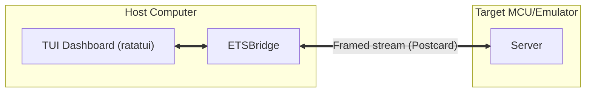

# Terminal User Interface (Design Document)


---

### 1. Introduction

This design document establishes the architecture for `control-rs-tui`, a
standalone Terminal User Interface (TUI) binary designed to control and
monitor on-target Embedded Test Server (ETS) execution. The TUI provides
developers with a dynamic, real-time dashboard displaying system metadata, test
suite namespaces, cycle-level execution statistics and target logs,
facilitating rapid on-target iteration.

---

### 2. Requirements

#### 2.1 Functional Requirements

- **FR-1 — Target Metadata Display**: The TUI must query and display target
  board details, core clock frequency, FPU status and debug link parameters,
  consuming `Telemetry::TargetInfo` from the host bridge.
- **FR-2 — Hierarchical Test Tree**: The interface must present test suites and
  cases in a tree layout mapping the Rust module namespace.
- **FR-3 — Hierarchical Telemetry Table**: For each test, the TUI must display
  cycle count (CYCCNT), duration (µs) and peak stack memory usage.
- **FR-4 — Persistent Log Terminal**: An integrated console window must display
  real-time debug and system logs streaming from the target.
- **FR-5 — Keystroke Controls**: Users must control target execution via
  single-key shortcuts (`f` filter, `r` run all, `s` stop, `q` quit).

- **FR-6 — Session liveness**: The dashboard retries discovery until the host
  session reports it complete, and it surfaces target process exit. A QEMU
  boot race or a dead subprocess must not look like an idle empty tree.

- **FR-7 — Suite setting inspection and edit**: The operator can read a
  setting's description and write a live `SetSetting` without leaving the
  dashboard. Discovery without that path is not a complete interactive session.

#### 2.2 Non-Functional Requirements

- **NFR-1 — Diff-only repaint**: An unchanged frame writes nothing to the
  terminal; the write is the buffer diff, and repaint happens only when the
  application asks. A 16 ms / 60 FPS budget is not required.
- **NFR-2 — Metrics Caching**: Test suite results are stored on the host to
  maintain state across target restarts or reconnections.
- **NFR-3 — Non-Intrusive Polling**: The communication driver must poll
  telemetry buffers asynchronously without halting the target CPU.

#### 2.3 Constraints

- **C-1 — Presentation Only Scope**: `control-rs-tui` is strictly a presentation
  frontend; it does not own physical transport, session state machines, framing
  algorithms, or CRC checks, which are wholly delegated to
  `control-rs-ets-host::ETSBridge`.
- **C-2 — Single-Session Lifetime**: The binary manages exactly one active
  `ETSBridge` session at any time.
- **C-3 — Host Environment Constraints**: The crate requires standard terminal
  input/output and ANSI/VT escape sequences, operating under `std`.

---

### 3. Technical Overview

The TUI is implemented as the standalone binary crate `control-rs-tui`. It
runs on the developer's host machine and interfaces with physical
microcontrollers through the `ETSBridge` abstraction provided by
`control-rs-ets-host`.

Rendering is immediate mode: "In `ratatui`, every frame draws the UI anew"
[1], in contrast to a retained-mode toolkit where widgets are
created once and mutated [1]. The repaint cost this implies is
bounded by diffing rather than by redraw: changes accumulate in a current
buffer, and "at the end of each draw pass, the two buffers are compared, and
only the changes between these buffers are written to the terminal, avoiding
any redundant operations" [2]. A full-screen redraw of an
unchanged frame therefore writes nothing. Repaint is also on demand, since
`ratatui` "only updates when you tell it to" [1], which is what
makes the event-driven loop of §7 possible.

The terminal backend is `crossterm`, "a pure-rust, terminal manipulation
library that makes it possible to write cross-platform text-based interfaces"
[3].



---

### 4. Architecture

#### 4.1. User Interface Layout

The TUI layout is partitioned into three main panels designed to maximize
developer situational awareness:

```text
===============================================================================
 TARGET: Teensy 4.0 (Cortex-M7) | LINK: USB CDC (/dev/ttyACM0)
===============================================================================
 [ RUNNING ] control_rs::math
-------------------------------------------------------------------------------
 NAME                                     CYCLES      TIME       STACK
 ▼ math::storage
   ├─ contiguous_storage_alloc            1,204       2.00µs     32
   └─ noncontiguous_storage_dma           3,410       5.68µs     64

 ▼ math::subprograms::level3
   ├─ gemm_10x10_f32 (soft-float)         84,500      140.8µs    128
   ├─ gemm_10x10_f32 (hard-float)        [ RUN... ]   ---        ---
   └─ gemm_50x50_f32 (hard-float)         PENDING     ---        ---
-------------------------------------------------------------------------------
 [ TARGET LOGS ] (Autoscroll: ON)
 > [INFO] Host connected.
 > [INFO] Discovered 24 tests via procedural macro test registry.
 > [PASS] storage::contiguous_storage_alloc
 ===============================================================================
 (f)ilter | (r)un all | (s)top | (q)uit
```

1. **Header Dashboard**: Displays the link, and from `SessionState::target_info`
   the protocol revision, board ID, core clock (MHz) and FPU class (FR-1).
   A rejected session shows `PROTOCOL MISMATCH` with both revisions. Debug
   link parameters beyond the configured port are not shown.
2. **Hierarchical Metrics Table**: A collapsible tree table showing test
   namespaces, cycle metrics, temporal duration (the target-reported `time_us`,
   passed through unmodified by `control-rs-ets-host`) and peak stack memory usage in
   bytes.
3. **Logs Panel**: A live log terminal streaming output from the target.
4. **Footer Action Bar**: Displays available key shortcuts.

#### 4.2. Host-Target ETSBridge Integration

The TUI communicates with target environments via the `ETSBridge`
abstraction provided by the `control-rs-ets-host` library crate. That crate is
the sole transport dependency; `ratatui` and `crossterm` stop at this binary
and never enter a headless dependency closure. Two execution targets are
supported:

* **QEMU Emulator (stdio pipe)**: Spawn a local QEMU virtual machine in a
  background child process by running `cargo run --bin ...` inside
  `examples/qemu`, piping stdin, stdout and stderr. (Semihosting is not used
  for data transport; see §5.)
* **Physical Serial Device**: Opens a connection to hardware (such as the Teensy
  4.0 board) over a USB CDC virtual serial port at a configured baud rate (
  defaulting to 115200) using the `serial2` crate.

#### 4.3. Delegated Transport, Framing and Recovery

Frame construction, CRC verification, telemetry deserialization, panic
detection and the reset/reconnect sequence are owned by `control-rs-ets-host`
and specified in `documentation/ets-host/ets-host-design.md`.
The TUI consumes their results only:

* `BridgeMessage::Telemetry` updates the metrics tree.
* `BridgeMessage::RawConsole` appends to the logs panel.
* A session reported as reset clears the local command queue and re-renders
  the tree from the re-issued discovery response, without tearing down
  terminal state.

The TUI holds no framing constants, no CRC parameters and no serial
configuration beyond the flags it forwards to the bridge constructor.

The loop follows the centralized catching, message passing pattern: events are
polled in one place and dispatched onward [4]. The event loop merges incoming
`ETSBridge` telemetry messages and terminal keystrokes into a single event
processing queue.

---

### 5. Alternatives

* **ARM Semihosting**: Rejected. Semihosting relies on triggering target
  software interrupts that halt the CPU core. This introduces millisecond-level
  latencies that violate real-time constraints and mask control-loop timing
  jitter. Additionally, probe-rs has documented register decoding and caching
  bugs during rapid semihosting trap polling.
* **Standard UART Logging**: Rejected. While it operates asynchronously,
  standard serial output lacks structured data capability, rendering
  hierarchical tables, dynamic status overlays and bidirectional control
  vectors impossible without complex custom parsers.
* **ETSBridge Logging**: The bridge parses all traffic between the server
  and the TUI, so it is the natural place to record a session transcript. That
  capability belongs to `control-rs-ets-host`, not to this binary.
* **Process-per-case result model**: Rejected for this dashboard, and noted
  because it is the dominant model elsewhere. `cargo-nextest` isolates each
  test in its own process so that "memory corruption in one test doesn't cause
  others to behave erratically" and "one test segfaulting does not take down a
  bunch of other tests" [5], and reads that process's standard
  output and error directly [5]. ETS keeps one persistent target
  process across a suite, so isolation comes from the reset sequence rather
  than from process boundaries, and the console stream is shared. The dashboard
  therefore attributes log lines to the running case by ordering, not by
  stream ownership.

---

### 6. Verification & Validation

#### 6.1 Approach

The implementation must produce evidence that the dashboard renders the target
state it is given, that keystrokes map to the intended commands, that the view
survives a target reset without losing history, and that the binary carries no
transport logic of its own.

| Method | Mechanism |
|:-------|:----------|
| Requirements-based test | `#[test]` feeding a scripted `BridgeMessage` stream into the application state and asserting the resulting tree, telemetry table and log buffer |
| Requirements-based test | `#[test]` mapping each bound key to the command it emits |
| Metamorphic relation | `#[test]` asserting that a reset followed by re-discovery leaves cached per-case metrics unchanged |
| Static analysis | `cargo tree -p control-rs-tui -e normal`; source inspection for framing or serial code in this crate |
| Inspection | Layout review against §4.1 on the smallest supported terminal size; structural buffer diffing inspection |
| On-target execution | Interactive session against a QEMU target and a physical board |
| Coverage measurement | `cargo coverage` |

Target: 70% line coverage of `control-rs-tui`, measured with `cargo coverage`.

Excluded: widget draw calls, which are verified by inspection against §4.1
rather than by assertion; and terminal setup and teardown, which require a
real terminal.

* **Hardware integration run**: Flash a benchmark binary containing the
  mathematical subprograms onto physical target hardware and drive a full
  session interactively, including a deliberate panic and recovery.
* **Emulated session**: Drive the same session against a QEMU target and
  confirm the dashboard is indistinguishable apart from the link description.

#### 6.2 Acceptance

| Claim | Oracle | Measure | Bound |
|:------|:-------|:--------|:------|
| Tree reflects discovery | Scripted discovery response | Suites and cases rendered against those sent | Exact match |
| Telemetry table values | Scripted `MetricReport` frames | Cycles, duration and stack rendered against those sent | Exact, no rounding of raw counts |
| Duration derivation | Cycle delta divided by core frequency | Rendered microseconds against the computed value | Within display precision |
| Key bindings | Each bound key | Command emitted | The command named in FR-5 |
| Cache survives reset | Reset injected mid-session | Per-case metrics after re-discovery | Unchanged for completed cases |
| Transport isolation | Source and dependency tree | Framing, CRC or serial code in this crate | None |
| Discovery retry | First `ListSuites` dropped | Suites eventually rendered | Discovery completes |
| Target process exit | Spawned QEMU exits | Dashboard state | Exit surfaced; session not left looking connected |
| Setting description | Key bound to description | Setting text shown | Matches the suite registry |

No frame-rate bound is asserted. See §6.3.

#### 6.3 Limits

- **A 16 ms / 60 FPS frame budget is not a requirement of this plan and is
  not measured.** NFR-1 is the diff-only write, discharged by inspection of
  §3. The former 16 ms figure has no source and no measurement method here.
- Terminal emulator compatibility. `crossterm` is cross-platform
  [3], but only the emulators developers happen to use are
  exercised.
- Behaviour at large suite counts. No bound is stated on how many cases
  the tree can render before layout or scrolling degrades.
- Accessibility. Screen-reader behaviour of a full-screen TUI is not
  considered.
- Log attribution under concurrency. Because ETS shares one console stream
  across a suite, a line emitted by a case that has already ended may render
  under its successor; nothing detects or corrects this.

### 7. Performance & Resource Considerations

* **Host CPU Loading**: The TUI repaints only when new telemetry arrives or
  when the user presses a key, rather than polling in a hot loop. This is
  possible because `ratatui` "only updates when you tell it to"
  [1], and cheap because a repaint writes only the buffer diff
  [2]. An idle session with a quiet target therefore costs no host
  CPU.

---

### 8. Risks & Open Questions

* **Maintenance surface**: The dashboard is the largest host-side component by
  line count and the least covered by automated tests, since rendering is
  verified by inspection rather than assertion. The mitigation is to keep the
  binary thin: state and protocol handling belong to `control-rs-ets-host`, and
  this crate holds layout and input handling only.

---

### 9. Development Plan

| Task / Feature                         | Description                                                                                 | Estimated Effort |
|:---------------------------------------|:--------------------------------------------------------------------------------------------|:-----------------|
| **Step 1: Ratatui Interface Skeleton** | Build the terminal UI layout panels using `ratatui` (Header, Tree Table, Logs, Footer).     | 1.0 day          |
| **Step 2: ETSBridge Connection**       | Integrate `ETSBridge` polling channels (QEMU stdio / `serial2`) into the TUI event loop.    | 1.0 day          |
| **Step 3: Bidirectional Controls**     | Implement keystroke handlers and write command packets to the target down-buffer.           | 0.5 day          |
| **Step 4: Session liveness and settings** | Repair: retry `ListSuites` on the same interval as the headless runner; observe process exit; wait the host reset delay before re-open; restore setting description and `SetSetting`. Tests: 6.2 discovery-retry, process-exit, and setting-description rows. | 1.0 day          |

---

### 10. Revision History

| Revision | Date           | Author          | Description                                                                                                                 |
|:---------|:---------------|:----------------|:----------------------------------------------------------------------------------------------------------------------------|
| 1.0      | May 24, 2026   | @MitchellDScott | Initial specification for interactive terminal user interface (TUI) test dashboard.                                         |
| 1.1      | July 18, 2026  | @MitchellDScott | Architecture & transport: added Ratatui layout, `ServerBridge` async polling channels, and Teensy 4.1 hardware integration. |
| 1.2      | August 6, 2026 | @MitchellDScott | Protocol alignment: synchronized interactive command schemas with shipped postcard framing and reconnection lifecycles.     |
| 1.3      | September 9, 2026 | @MitchellDScott | Packaging split: promoted TUI to standalone `control-rs-tui` binary crate consuming `control-rs-ets-host::ServerBridge`.   |
| 1.4      | September 9, 2026 | @MitchellDScott | Crate split: relocated to `documentation/tui/`; framing, panic detection and reconnection delegated to `control-rs-ets-host`. |
| 1.5      | September 9, 2026 | @MitchellDScott | Evidence pass: added the research pair and citation layer, grounded the rendering and repaint claims, added the process-per-case alternative, restructured §6 per `vv-standards.md`, and moved the unverified 16 ms budget to 6.7. |
| 1.6      | September 9, 2026 | @MitchellDScott | Hardening pass: numbered §2.1–§2.3 and added §2.3 Constraints (C-1..C-3), mapped TargetInfo in FR-1, corrected bridge diagram link, completed 6.4 traceability, and standardized References. |
| 1.7      | September 15, 2026 | @MitchellDScott | NFR-1 is diff-only repaint; 16 ms budget is not a requirement and is not traced. |
| 1.8      | September 16, 2026 | @MitchellDScott | FR-6 session liveness, FR-7 suite setting inspection and edit; 6.2 discovery/exit/setting rows; §9 Step 4. |
| 1.9      | September 18, 2026 | @MitchellDScott | Packaging alignment: updated host bridge references to `control-rs-ets-host::ETSBridge`. |
| 1.10      | September 24, 2026 | @MitchellDScott | Duration column shows the target-reported `time_us`; §6.3 reference corrected. |
| 1.11     | September 24, 2026 | @MitchellDScott | FR-1 header shows `TargetInfo` protocol, board, clock and FPU, or the protocol mismatch. |

---

## References

[1] Ratatui contributors, "Rendering," *Ratatui documentation, Concepts*.
[Online]. Available: https://ratatui.rs/concepts/rendering/. Accessed:
Sep. 9, 2026.

[2] Ratatui contributors, *ratatui*: terminal user interface library.
[Online]. Available:
https://docs.rs/ratatui/latest/ratatui/terminal/struct.Terminal.html. Accessed:
Sep. 9, 2026.

[3] crossterm contributors, *crossterm*: pure-Rust cross-platform terminal
manipulation library. [Online]. Available: https://docs.rs/crossterm.
Accessed: Sep. 9, 2026.

[4] Ratatui contributors, "Event handling," *Ratatui documentation, Concepts*.
[Online]. Available: https://ratatui.rs/concepts/event-handling/. Accessed:
Sep. 9, 2026.

[5] nextest contributors, "Why process-per-test," *cargo-nextest
documentation*. [Online]. Available:
https://nexte.st/docs/design/why-process-per-test/. Accessed: Sep. 9, 2026.