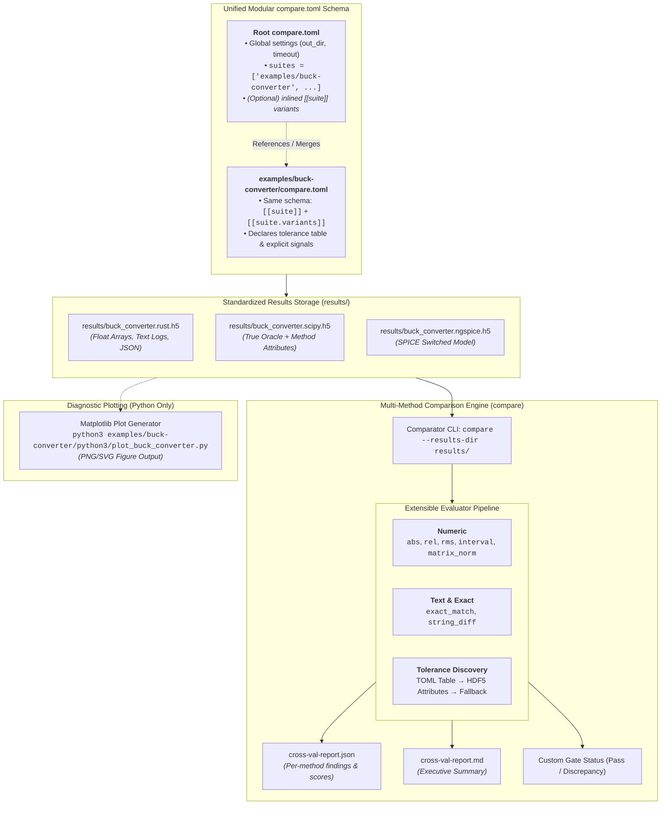

# Cross-Compare Harness & HDF5 Comparison System (Design Document)


---

### 1. Introduction

`control-rs` implements `no_std` and `no_alloc` control algorithms. Verifying
numerical correctness, model fidelity, and algorithmic behavior in safety-critical
autonomous systems requires empirical validation against certified reference
oracles and multi-language implementations on ill-conditioned kernels where
floating-point error accumulation is observable (SLICOT, 2026; Kochenderfer
et al., 2026).

This document establishes the architecture and normative contract for
`control-rs-compare`, a standalone host verification tool that executes
multi-language model variants and validates emitted HDF5 datasets against
numerical tolerance bounds.

---

### 2. Requirements

#### 2.1 Functional Requirements

- **FR-1 — Typed HDF5 Variant Container**: Each execution variant (for example,
  `rust`, `scipy`, `jax`, `ngspice`) emits its results to an independent HDF5 file
  formatted as `results/<suite>.<variant>.h5`. Datasets carry typed floating-point
  arrays (`f64`, 1D/2D) and string logs.
- **FR-2 — Unified Standalone Runner & Comparator CLI (`compare`)**: `control-rs-compare`
  publishes a standalone binary `compare` (`cargo compare`) that parses `compare.toml`,
  resolves Python virtual environments, executes variants with timeouts, and performs
  typed HDF5 dataset comparisons.
- **FR-3 — Flexible Subsystem Filtering**: `compare` supports `--run <suites>`,
  `--skip-run`, `--compare <suites>`, and `--skip-compare` to allow running or
  comparing in isolation or combined.
- **FR-4 — Unified Modular Configuration Schema**: `compare` parses an identical,
  unified `compare.toml` configuration schema at all directory levels, supporting both
  `suites = [...]` references and inlined `[[suite]]` definitions.
- **FR-5 — Typed Numerical Comparison Engine**: Evaluates datasets using standard
  numerical methods: `abs`, `rel`, `rms`, `interval`, `matrix_norm`, `envelope`,
  and `exact_match`.
- **FR-6 — Composite Evaluation Policies**: Allows declaring multiple comparison methods
  per dataset with configurable satisfaction policies (`policy = "all_of"` or `"any_of"`).
- **FR-7 — CI Custom Gate Integration**: Adheres to the custom quality gate protocol
  expected by `control-rs-ci` (`gate.toml`), emitting `cross-val-report.json`,
  `cross-val-report.md`, and deterministic process exit codes.
- **FR-8 — Zero Cargo Dependency for Examples**: Example suites in `examples/` do not
  declare `control-rs-compare` or `control-rs-ci` in their dependencies; they interact
  solely through `.rust.h5` output and `compare.toml`.
- **FR-9 — Isolated Suite Emitters**: Running an example suite directly computes only
  native Rust math and emits `results/<suite>.rust.h5`.
- **FR-10 — Fail-Closed Discrepancy Accumulation**: Missing datasets, dimension
  mismatches, NaNs/infinities, and tolerance breaches are accumulated and terminate
  with non-zero exit code.
- **FR-11 — Decoupled Diagnostic Plot Generation**: Companion plotting scripts
  (`python3/plot_<suite>.py`) ingest persisted `.h5` files and generate static figures.
- **FR-12 — Pure Rust HDF5 Compatibility**: Reading and writing `.h5` containers
  operates via pure-Rust implementations to eliminate host C-library compiler and
  version drift.
- **FR-13 — Parallel Chunked Dataset Evaluation**: `compare` must support evaluating
  massive numerical datasets ($N \ge 65,536$) by partitioning arrays into cache-aligned
  contiguous chunks processed concurrently across a pool of worker threads (`std::thread::scope`).
- **FR-14 — Associative Map-Reduce Reduction**: Chunk workers must compute partial
  statistics (`max_abs`, `max_rel`, `sum_sq`, `has_invalid`) in parallel with deterministic
  reduction to maintain numerical stability and reproducibility (Higham, 2002; Demmel and Nguyen, 2013).
- **FR-15 — Configurable Concurrency**: Concurrency must be configurable via CLI `--threads <N>` /
  `-j <N>` and `compare.toml` (`threads = N`), defaulting to `std::thread::available_parallelism()`.
- **FR-16 — Annotated Signal Omission**: A suite may carry more than one variant, one
  container each. Every peer must provide every true-oracle signal unless the oracle
  dataset carries a non-zero `missing_ok.<peer>` attribute; an unannotated omission
  fails (FR-10). A peer that provides no oracle signal fails. Per-peer bounds use the
  `bound.<peer>` attribute (C-2).

#### 2.2 Non-Functional Requirements

- **NFR-1 — Publishable Crate Standards**: Both `control-rs-compare` and
  `control-rs-ci` must meet crates.io publication standards (Rust API Guidelines
  C-METADATA, SemVer adherence, permissive MIT/Apache-2.0 licensing, and complete
  documentation) (Rust API Guidelines, 2026; The Cargo Book, 2026).
- **NFR-2 — Strict Isolation from Embedded Toolbox**: Zero host-runner,
  HDF5, or Python dependencies may leak into the core `control-rs` library
  crates (`#![no_std]`).
- **NFR-3 — Deterministic Verification**: Numerical comparisons must be
  deterministic across runs on host platforms (`x86_64`, `aarch64`), depending
  strictly on IEEE 754 floating-point bounds (IEEE, 2019).
- **NFR-4 — Memory-Efficient Dataset Traversal**: HDF5 reading and traversal
  must operate dataset-by-dataset to avoid loading multi-gigabyte simulation
  trajectories simultaneously into host memory.

#### 2.3 Constraints

- **C-1 — Python Runtime Resolution Hierarchy**: Process execution must
  resolve Python interpreters in strict priority order: `PYTHON` environment
  variable, active `VIRTUAL_ENV` path, crate-root `.venv`
  (`../../.venv/bin/python3`), local `.venv`, and system `PATH`.
- **C-2 — Multi-Tier Tolerance Discovery**: Numerical tolerance bounds
  are resolved hierarchically: (1) external TOML tables (`examples/<suite>/tolerances/*.toml`),
  (2) oracle dataset HDF5 attributes (`methods`, `measure`/`method`, `bound`, `bound.<peer>`),
  or (3) fallback default (`abs` $\le 10^{-4}$, `policy = "all_of"`).
- **C-3 — Decoupled Non-Rust Visualization**: Diagnostic plot generators
  must read exclusively from persisted `results/*.h5` files using Python
  (`matplotlib` with headless `agg` backend). Visualizations must not be
  implemented in Rust and must not affect gate pass/fail status.
- **C-4 — Published Binary Naming**: The unified runner and comparator
  binary is named `compare` (`cargo compare`), provided by `control-rs-compare`.
- **C-5 — Dynamic HDF5 Dataset Discovery & Explicit Overrides**: Dataset inspection
  recursively traverses the HDF5 group hierarchy (`ls`-style) from the root group,
  excluding metadata groups (`_meta`). When explicit signals are specified in `compare.toml`
  (`signals = [...]`) or via CLI (`--signals <s1,s2>`), explicit signals override
  dynamic discovery.

---

### 3. Technical Overview

The comparison architecture decouples configuration, execution orchestration,
multi-method evaluation, and diagnostic visualization:



---

### 4. Architecture

#### 4.1 Crate & Binary Distribution Model

`control-rs-compare` is published to crates.io with the standalone binary `compare`:

```toml
# control-rs-compare/Cargo.toml (Published Crate)
[package]
name = "control-rs-compare"
version = "0.1.0"
edition = "2024"
license = "MIT OR Apache-2.0"
description = "HDF5 cross-validation comparison engine and multi-language oracle runner"
repository = "https://github.com/Dyse-Industries/control-rs"
readme = "README.md"
keywords = ["control", "validation", "hdf5", "oracle", "testing"]
categories = ["development-tools::testing"]

[dependencies]
hdf5-pure = "0.46"
serde = { version = "1.0", features = ["derive"] }
serde_json = "1.0"
toml = "0.8"
chrono = "0.4"
thiserror = "2.0"

[[bin]]
name = "compare"
path = "src/bin/compare.rs"
```

#### 4.2 Typed Numerical Comparison Architecture

The comparison engine evaluates datasets loaded directly from HDF5 containers:

```rust
pub enum DatasetValue {
    Float1D(Vec<f64>),
    Float2D { rows: usize, cols: usize, data: Vec<f64> },
    Text(String),
}

pub struct MethodResult {
    pub passed: bool,
    pub measure: String,
    pub observed_score: f64,
    pub threshold: f64,
    pub details: Option<String>,
}
```

#### 4.3 Catalogue of Numerical Comparison Methods

| Method | Mathematical Definition / Measure | Pass Condition |
|:---|:---|:---|
| **`abs`** | $\|D_{\text{oracle}} - D_{\text{peer}}\|_\infty = \max_i |D_{\text{oracle}}[i] - D_{\text{peer}}[i]|$ | $\text{score} \le \text{bound}$ |
| **`rel`** | $\max_i \frac{|D_{\text{oracle}}[i] - D_{\text{peer}}[i]|}{|D_{\text{oracle}}[i]| + \epsilon_{\text{mach}}}$ | $\text{score} \le \text{bound}$ |
| **`rms`** | $\sqrt{\frac{1}{N}\sum_{i=1}^N (D_{\text{oracle}}[i] - D_{\text{peer}}[i])^2}$ | $\text{score} \le \text{bound}$ |
| **`interval`** | Range check: $D_{\text{peer}}[i] \in [\min, \max]$ for all $i$ | All elements in interval |
| **`matrix_norm`** | Matrix Frobenius norm: $\|A - B\|_F = \sqrt{\sum_{i,j} (a_{ij} - b_{ij})^2}$ | $\|A - B\|_F \le \text{bound}$ |
| **`envelope`** | Dynamic envelope check: $y_{\min}[k] \le y_{\text{peer}}[k] \le y_{\max}[k]$ | Trajectory inside bounds |
| **`exact_match`** | Exact string or token identity: $\text{peer} == \text{oracle}$ | Equality match |

#### 4.4 Composite Multi-Method Evaluation Policies

When multiple comparison methods are configured for a dataset, the comparator
evaluates all methods and resolves the aggregate verdict:

- **`policy = "all_of"` (Default)**: Every declared method must pass. If any
  method fails, the dataset is marked as a discrepancy.
- **`policy = "any_of"`**: At least one declared method must pass.

```toml
[tolerances."buck.transient.verification"]
subject = "buck_converter"
signal = "transient/v_out"
policy = "all_of"
methods = [
    { type = "abs", bound = 1e-3 },
    { type = "rms", bound = 5e-4 },
    { type = "envelope", lower = "transient/v_min", upper = "transient/v_max" },
]
```

#### 4.5 Unified Modular Configuration Schema (`compare.toml`)

The configuration format is unified across root and suite levels:

##### Rust Configuration Data Structures

```rust
#[derive(Debug, Clone, Default, serde::Serialize, serde::Deserialize)]
pub struct CompareConfigFile {
    #[serde(default)]
    pub compare: CompareGeneralConfig,
    /// Optional child suite directories to merge (for modularity).
    #[serde(default)]
    pub suites: Vec<String>,
    /// Inline suite declarations (can define suites and variants from anywhere).
    #[serde(default, rename = "suite")]
    pub inlined_suites: Vec<SuiteConfig>,
}

#[derive(Debug, Clone, serde::Serialize, serde::Deserialize)]
pub struct CompareGeneralConfig {
    #[serde(default = "default_title")]
    pub title: String,
    #[serde(default = "default_out_dir")]
    pub out_dir: String,
    #[serde(default = "default_timeout")]
    pub timeout_secs: u64,
    #[serde(default = "default_true")]
    pub strict: bool,
}

#[derive(Debug, Clone, serde::Serialize, serde::Deserialize)]
pub struct SuiteConfig {
    pub name: String,
    #[serde(default = "default_oracle")]
    pub true_oracle: String,
    #[serde(default)]
    pub tolerance_table: Option<String>,
    #[serde(default)]
    pub signals: Option<Vec<String>>,
    #[serde(default)]
    pub variants: Vec<VariantConfig>,
}

#[derive(Debug, Clone, serde::Serialize, serde::Deserialize)]
pub struct VariantConfig {
    pub name: String,
    pub r#type: String, // "rust_bin" | "python_script" | "command"
    #[serde(default)]
    pub manifest_path: Option<String>,
    #[serde(default)]
    pub bin: Option<String>,
    #[serde(default)]
    pub script: Option<String>,
    #[serde(default)]
    pub command: Option<String>,
    pub output_file: String,
    #[serde(default)]
    pub optional: bool,
}
```

##### 1. Workspace Root Example (`compare.toml`)

```toml
# compare.toml (workspace root)
[compare]
title = "control-rs Cross-Validation Suite"
out_dir = "target/verification"
timeout_secs = 120
strict = true

# Referenced suite directories (each contains its own compare.toml)
suites = [
    "control-rs-verification",
]

# (Optional) Inlined suite defined from outside the suite folder
[[suite]]
name = "ad_hoc_experiment"
true_oracle = "scipy"
tolerance_table = "examples/support/tolerances/experiment.toml"

[[suite.variants]]
name = "rust"
type = "rust_bin"
manifest_path = "examples/experiment/Cargo.toml"
bin = "experiment_bin"
output_file = "results/experiment.rust.h5"

[[suite.variants]]
name = "scipy"
type = "python_script"
script = "examples/experiment/python3/experiment_oracle.py"
output_file = "results/experiment.scipy.h5"
```

##### 2. Per-Suite Example (`examples/buck-converter/compare.toml`)

```toml
# examples/buck-converter/compare.toml
[compare]
out_dir = "results"
timeout_secs = 90

[[suite]]
name = "buck_converter"
true_oracle = "scipy"
tolerance_table = "tolerances/buck_converter.toml"

[[suite.variants]]
name = "rust"
type = "rust_bin"
manifest_path = "Cargo.toml"
bin = "buck_converter"
output_file = "results/buck_converter.rust.h5"

[[suite.variants]]
name = "scipy"
type = "python_script"
script = "python3/buck_converter_oracle.py"
output_file = "results/buck_converter.scipy.h5"

[[suite.variants]]
name = "ngspice"
type = "command"
command = "ngspice -b spice/buck_switched.cir"
output_file = "results/buck_converter.ngspice.h5"
optional = true
```

#### 4.6 Recursive Config Resolution & Path Normalization

When `compare` loads a config:
1. It parses the target TOML file into `CompareConfigFile`.
2. For every entry in `suites`:
   - Resolves the child directory path relative to the parent TOML.
   - Loads `<suite_dir>/compare.toml`.
   - Normalizes all relative script, manifest, and tolerance paths to be relative
     to the current working directory / workspace root.
   - Appends all discovered `[[suite]]` entries into the master plan.
3. Inlined `[[suite]]` blocks are appended directly.
4. If a suite is defined both in a child TOML and overridden in the root TOML,
   the root definition takes precedence.

#### 4.7 CI Custom Gate Integration (`control-rs-ci`)

`control-rs-ci` registers the comparison system as a standard custom gate
in `gate.toml`:

```toml
# gate.toml
[[gates]]
name = "cross-val"
description = "Host-side oracle cross-validation and HDF5 numerical tolerance gate"
command = "compare --config compare.toml"
report_json = "results/cross-val-report.json"
report_md = "results/cross-val-report.md"
blocking = true
```

#### 4.8 Standalone Result Comparison Engine (`compare`)

The published `compare` binary operates on `--config` or `--results-dir`:

```bash
compare [OPTIONS]
cargo compare [OPTIONS]
```

##### CLI Options
- `-c, --config <FILE>`: Path to `compare.toml` (default: `compare.toml`).
- `-o, --results-dir <DIR>`: Directory containing `.h5` files (default: `results`).
- `--run <SUITES>`: Suites to execute (`all`, `none`, or `s1,s2`).
- `--skip-run`: Suites to not execute.
- `--compare <SUITES>`: Suites to compare (`all`, `none`, or `s1,s2`).
- `--skip-compare`: Suites to skip.
- `--signals <SIGNALS>`: Explicit comma-separated signals to evaluate (overrides discovery).
- `--oracle <VARIANT>`: Override true oracle variant (default: `scipy` or `rust`).
- `--strict`: Terminate non-zero on any tolerance breach (default: `true`).
- `--no-fail`: Generate reports without returning non-zero exit code.
- `-q, --quiet`: Suppress streaming output.

#### 4.9 HDF5 Multi-Modal Container Schema & Attributes

Each test variant writes an independent HDF5 container:

$$\text{results/}<\text{suite}>.<\text{variant}>.\text{h5}$$

##### Multi-Modal Dataset Layout
```
/
├── state_space/
│   ├── time_series/
│   │   ├── time              [N] float64
│   │   ├── state_trajectory  [N x n] float64
│   │   └── output_trajectory [N x m] float64
│   └── matrices/
│       ├── gramian_w_c       [n x n] float64
│       └── similarity_t      [n x n] float64
├── diagnostics/
│   ├── convergence_log       [1] string (UTF-8)
│   └── solver_summary        [1] string (JSON serialized AST)
└── _meta/                    (Skipped during gate comparison)
    └── plot_annotations     [K] string
```

True-oracle datasets carry write-time attributes:
- Single method: `measure = "abs"`, `bound = 1e-4`
- Multi-method: `methods = '[{"type":"abs","bound":1e-4},{"type":"rms","bound":1e-5}]'`
- Policy: `policy = "all_of"` | `"any_of"`
- `independent`: `u8` (1 or 0)
- `bound.<peer>`: `f64` (optional peer override)

#### 4.10 Parallel Chunked Comparison Engine & Comparator Pool

For massive datasets ($N > 10^5$ to $10^8$ floating-point elements), single-threaded
sequential comparison becomes constrained by CPU and memory bandwidth. The comparison engine
deploys a zero-dependency, cache-aligned parallel reduction architecture:

##### Mathematical Map-Reduce Reduction Model

Given oracle and peer arrays $D_{\text{oracle}}, D_{\text{peer}} \in \mathbb{R}^N$ partitioned
into $P$ contiguous chunks $\mathcal{C}_k = [s_k, e_k)$ for $k \in \{1, \dots, P\}$:

1. **Map Phase (Per Chunk Worker)**:
   $$\text{max_abs}_k = \max_{i \in \mathcal{C}_k} |D_{\text{oracle}}[i] - D_{\text{peer}}[i]|$$
   $$\text{max_rel}_k = \max_{i \in \mathcal{C}_k} \frac{|D_{\text{oracle}}[i] - D_{\text{peer}}[i]|}{|D_{\text{oracle}}[i]| + \epsilon_{\text{mach}}}$$
   $$\text{sum_sq}_k = \sum_{i \in \mathcal{C}_k} (D_{\text{oracle}}[i] - D_{\text{peer}}[i])^2$$

2. **Reduce Phase (Associative Aggregation)**:
   $$\text{max\_abs} = \max_{k=1}^P \text{max\_abs}_k, \quad \text{max\_rel} = \max_{k=1}^P \text{max\_rel}_k, \quad \text{sum\_sq} = \sum_{k=1}^P \text{sum\_sq}_k$$
   $$\text{rms} = \sqrt{\frac{1}{N}\text{sum\_sq}}, \quad \|D_{\text{oracle}} - D_{\text{peer}}\|_F = \sqrt{\text{sum\_sq}}$$

##### Numerical Stability & Error Bounds

Floating-point summation is inherently non-associative due to rounding error (Demmel and
Nguyen, 2013). While sequential accumulation exhibits an error bound that grows
linearly with element count $\mathcal{O}(N\mathbf{u})$, pairwise and chunked tree summation
bounds error accumulation to $\mathcal{O}((\log_2 P + \frac{N}{P})\mathbf{u})$, where $\mathbf{u}$
is unit roundoff (Higham, 2002). Chunking thus provides superior numerical stability in addition
to execution speedup.

##### Chunk Size & Cache Alignment

To balance thread dispatch latency against SIMD memory throughput:
- **Adaptive Execution Threshold**: Datasets with $N < 65,536$ elements ($512\text{ KiB}$) execute
  sequentially on the caller thread, avoiding thread scheduling overhead.
- **Cache-Conscious Partitioning**: For $N \ge 65,536$, data is partitioned into $P = \min(\text{threads}, \lceil N / 65536 \rceil)$
  disjoint contiguous chunks that fit comfortably into L2/L3 CPU cache lines.
- **HDF5 Storage Alignment**: When datasets utilize HDF5 chunked storage layouts (Folk et al., 2011),
  chunk sizes naturally align with container boundaries to maximize sequential I/O throughput.

##### Zero-Dependency Concurrency via `std::thread::scope`

The engine uses Rust's standard library `std::thread::scope` and `std::thread::available_parallelism()`:

```rust
pub struct PartialChunkStats {
    pub max_abs: f64,
    pub max_rel: f64,
    pub sum_sq: f64,
    pub has_invalid: bool,
}

pub fn compare_float_arrays_parallel(
    oracle: &[f64],
    peer: &[f64],
    tol: &ToleranceSpec,
    num_threads: usize,
) -> MethodFinding {
    if oracle.len() < 65_536 || num_threads <= 1 {
        return compare_float_arrays(oracle, peer, tol);
    }

    let chunk_size = (oracle.len() + num_threads - 1) / num_threads;
    let mut partials = vec![PartialChunkStats::default(); num_threads];

    std::thread::scope(|s| {
        for (k, out_stat) in partials.iter_mut().enumerate() {
            let start = k * chunk_size;
            let end = (start + chunk_size).min(oracle.len());
            if start < end {
                let o_slice = &oracle[start..end];
                let p_slice = &peer[start..end];
                s.spawn(move || {
                    *out_stat = compute_chunk_stats(o_slice, p_slice);
                });
            }
        }
    });

    reduce_and_evaluate(oracle.len(), &partials, tol)
}
```

#### 4.11 Diagnostic Plotting Pipeline (Python Matplotlib)

Companion plotting scripts (`examples/<suite>/python3/plot_<suite>.py`) load
`.h5` containers from `results/` and emit publication-grade static figures:

```
results/
├── buck_converter_plot.png
├── dc_motor_plot.png
└── numerical_models_plot.png
```

- **Non-Rust Implementation**: Authoring in Python using `matplotlib` (with headless
  `agg` backend) and `control_rs_plot` provides flexible visual styling without
  introducing GUI or graphical C dependencies into the Rust workspace.
- **Decoupled Failure Boundary**: Plot script invocation occurs downstream of
  `compare` comparison. Script absence or plotting errors do not alter gate exit
  codes.

#### 4.12 Structured Report Schemas

##### `cross-val-report.json`

```json
{
  "summary": {
    "total_suites": 7,
    "passed_suites": 7,
    "failed_suites": 0,
    "total_duration_secs": 8.42,
    "verdict": "Pass"
  },
  "suites": [
    {
      "name": "buck_converter",
      "status": "Pass",
      "duration_secs": 2.10,
      "comparisons": [
        {
          "key": "buck.transient.v_out",
          "pair": ["scipy", "rust"],
          "signal": "transient/v_out",
          "policy": "all_of",
          "verdict": "pass",
          "methods": [
            {
              "type": "abs",
              "bound": 1.0e-3,
              "observed": 4.12e-5,
              "verdict": "pass"
            },
            {
              "type": "rms",
              "bound": 5.0e-4,
              "observed": 1.84e-5,
              "verdict": "pass"
            }
          ]
        },
        {
          "key": "buck.simulation.status",
          "pair": ["scipy", "rust"],
          "signal": "diagnostics/convergence_log",
          "policy": "all_of",
          "verdict": "pass",
          "methods": [
            {
              "type": "regex_match",
              "pattern": "converged in \\d+ iterations",
              "verdict": "pass"
            }
          ]
        }
      ]
    }
  ]
}
```

##### `cross-val-report.md` (Executive Summary)

```markdown
### Cross-Comparison & Oracle Validation Brief

| Metric | Value |
| :--- | :--- |
| **Status** | Pass |
| **Suites Verified** | 7 / 7 passed (8.42s total) |
| **Authoritative Table** | examples/buck-converter/tolerances/buck_converter.toml (12 bounds) |
| **Regression Artifacts** | `cross-val-report.json`, `cross-val-report.md` |
| **Diagnostic Plots** | `results/buck_converter_plot.png`, `results/dc_motor_plot.png` |

| Suite | Status | Duration | Comparisons | Methods Evaluated |
| :--- | :--- | :--- | :--- | :--- |
| `matrix` | Pass | 1.12s | 14 signal(s) | `abs`, `rel`, `matrix_norm` |
| `state_space` | Pass | 1.45s | 18 signal(s) | `abs`, `rms`, `spectral_radius` |
| `buck_converter` | Pass | 2.10s | 12 signal(s) | `abs`, `rms`, `regex_match`, `envelope` |
```

---

### 5. Alternatives

| Alternative | Technical Tradeoffs & Reason for Rejection | Reference |
|:---|:---|:---|
| **Hardcoded Float-Only Evaluators** | Restricts comparison strictly to double-precision numbers; fails to support text logs, regular expression status checks, JSON AST equivalence, or semantic contextual embeddings. | [7], [8] |
| **Separate Incompatible Config Schemas for Root vs Suites** | Forces runner to implement multiple parser paths; unified modular schema allows identical data structures to parse root configs, suite configs, or inlined experiments. | [6] |
| **Unpublished In-Tree Harness / xtask** | Prevents other control projects and external users from adopting `control-rs-compare` as a reusable numerical verification tool for their own Rust and C control algorithms. Publishing establishes a standardized ecosystem tool. | [6], [9] |
| **Examples Depending on Harness as a Rust Library** | Couples simple pedagogical examples to heavy host-only I/O dependencies (`hdf5`, `serde_json`, `toml`); violates the principle that examples should remain minimal, clean, and focused purely on toolbox API demonstration. | [9] |
| **Dynamic Filesystem Searching / Crawling** | Dynamic directory walking is non-deterministic, brittle in complex workspace hierarchies, and hides missing suite targets behind silent discovery omissions. Statically declaring suites in config guarantees exhaustive execution. | [6] |
| **Rust-Native Plotting (plotters / `egui`)** | Adds significant compilation overhead and graphics driver dependencies to CI pipelines for diagnostic figures that are only inspected off-line. | [6] |
| **External Heavy Thread Pool (`rayon` / `tokio`)** | Introducing third-party thread pools pulls in dozens of transitive dependencies (`crossbeam`, `rayon-core`); `std::thread::scope` provides zero-dependency, safe, scoped borrowing with bounded lifetime guarantees. | [6], [9], [10] |

---

### 6. Verification & Validation

#### 6.1 Plan

| Kind | Step | Establishes |
|:---|:---|:---|
| `test` | Extensible Evaluator Unit Tests | Validates `abs`, `rel`, `rms`, `interval`, and `matrix_norm` across clean and breach inputs. |
| `test` | Composite Policy Evaluation Tests | Asserts correct resolution of `all_of` and `any_of` policies across multi-method datasets. |
| `test` | Dynamic Recursive Dataset Discovery Tests | Parameterized validation of recursive `ls`-style group hierarchy traversal across complex synthetic HDF5 trees. |
| `test` | Multi-Tier Tolerance Discovery Tests | Asserts correct resolution order: external TOML table &rarr; HDF5 dataset attributes &rarr; fallback defaults. |
| `test` | Parallel Chunked Evaluation Equivalence Tests | Verifies mathematical identity between sequential and chunked parallel evaluations across varying thread counts and array sizes. |
| `test` | Unified configuration schema parser tests | Verifies loading child `suites`, inlined `[[suite]]` definitions, path normalizations, and overrides. |
| `test` | Multi-Modal HDF5 container tests | Verifies reading and writing numeric arrays, UTF-8 string datasets, and JSON attributes. |
| `test` | Fail-closed discrepancy tests | Asserts that missing datasets, shape mismatches, NaNs, and stale timestamps trigger non-zero exit. |
| `cross-check` | Custom gate integration test in `control-rs-ci` | Executes `cargo ci` with `cross-val` custom gate registered, confirming end-to-end report generation. |

#### 6.2 Acceptance

| Claim | Oracle | Measure | Bound |
|:---|:---|:---|:---|
| **Multi-Method Detection** | Synthetic injected error fixtures | Exact method detection | Any method failure triggers non-zero exit under `all_of` |
| **Text Pattern Matching** | String fixtures | Regex engine | Exact regex match / mismatch detection |
| **Unified Config Parsing** | Single/multi-suite TOML fixtures | AST validation | Identical parsing across root and suite files |
| **Missing Key Rejection** | Synthetic partial HDF5 container | Error accumulator | Flags missing dataset with non-zero exit |
| **Deterministic Evaluation** | Repeated host execution | Binary reproducibility | Exactly identical floating-point residuals |
| **Parallel Equivalence** | Single vs Multi-Thread Execution | Max residual difference | $\|R_{\text{seq}} - R_{\text{par}}\| \le \epsilon_{\text{mach}}$ |
| **Freshness Enforcement** | Pre-dated container fixture | `mtime` / timestamp check | Flags stale container with non-zero exit |

#### 6.3 Limits

- Verification operates on host developer workstations and CI runners (`x86_64`, `aarch64`); target embedded MCU architectures (`thumbv7em`, `riscv32`) are validated through ETS rather than HDF5 oracle harnesses.
- Semantic embedding evaluation requires external embedding provider or offline local ONNX model runtime when activated.
- Requires Python 3.12 with required scientific libraries (`numpy`, `scipy`, `matplotlib`) for external oracle generation and diagnostic visualization.

---

### 7. Performance & Resource Considerations

- **Streaming Dataset Evaluation**: Reading HDF5 datasets sequentially bounds
  host RAM consumption below 128 MB even during multi-suite trajectory audits.
- **Parallel Multi-Core Scalability**: For massive arrays ($N \ge 65,536$), chunked
  parallel evaluation scales near-linearly across available host CPU cores, reducing
  gating latency from seconds to milliseconds on multi-million element trajectories.
- **Zero Embedded Footprint**: All HDF5 and comparison dependencies (`hdf5`,
  `serde_json`, `toml`, `regex`, `strsim`) are quarantined to the published host tool
  crates, ensuring zero impact on the embedded `control-rs` library footprint (`#![no_std]`).
- **Rapid Gating Latency**: `compare` executes in under 200 ms for complete model
  suites when reading pre-generated containers.

---

### 8. Risks & Open Questions

- **External Library Version Drift**: Minor numerical discrepancies in reference
  libraries (for example, SciPy eigenvalue algorithm updates) can shift machine-precision
  residuals. Documenting exact reference versions in C-8 envelopes and TOML
  provenance headers mitigates this risk.
- **Embedding Model Weight Distribution**: For `semantic_similarity` evaluations,
  relying on lightweight local token models ensures offline
  reproducibility in CI without requiring live API keys or cloud connections.
- **HDF5 C Library Dependency on crates.io**: `control-rs-compare` relies on
  pure-Rust `hdf5-pure` reader and writer crates to eliminate C-library header
  and shared object dependencies across host targets.

---

### 9. Development Plan

| Phase / Task | Description | Status |
|:---|:---|:---|
| **Phase 1: `control-rs-compare` Engine & Evaluators (`compare`)** | Implement numerical evaluators (`abs`, `rel`, `rms`, `matrix_norm`), composite policies (`all_of`/`any_of`), and standalone `compare` binary. | Complete |
| **Phase 2: Unified Config Loader & Variant Runner** | Implement unified modular `compare.toml` parser (supporting child `suites` and inlined `[[suite]]`), Python runtime resolution, timeout management, and `--signals` filtering. | Complete |
| **Phase 3: `control-rs-ci` Custom Gate Integration** | Register `cross-val` custom gate in `gate.toml` and wire report ingestion into `ci-report.md`. | Complete |
| **Phase 4: Dynamic HDF5 Discovery & Multi-Tier Tolerances** | Implement recursive group hierarchy dataset discovery (`ls`-style), external TOML tolerance tables, and HDF5 dataset attribute resolution. | Complete |
| **Phase 5: Parallel Chunked Evaluation & Worker Pool** | Implement `compare_float_arrays_parallel` using `std::thread::scope`, map-reduce partial statistics reduction, and `--threads` CLI/config concurrency options. | Active |

---

### 10. Revision History

| Revision | Date | Author | Description |
|:---|:---|:---|:---|
| 1.0 | September 19, 2026 | @MitchellDScott | Initial draft establishing the decoupled Host Oracle and HDF5 Comparison System design. |
| 1.1 | September 19, 2026 | @MitchellDScott | Renamed comparison tool to `control-rs-h5` (`cargo h5`) and standardized validation suite location within `examples/`. |
| 1.2 | September 19, 2026 | @MitchellDScott | Upgraded plotting to interactive Plotly/HTML dashboards; added explicit per-suite binary structure and config-driven runner (prohibiting dynamic searching). |
| 1.3 | September 19, 2026 | @MitchellDScott | Established two-tier configuration (root `oracle.toml` without variants, per-suite `oracle.toml` with variants), single root orchestrator example (`examples/oracle`), and isolated single-emitter execution. |
| 1.4 | September 19, 2026 | @MitchellDScott | Specified published crate architecture for `oracle-harness` (emitting `oracle` and `h5` binaries) and `control-rs-ci` (custom gate integration), with zero-dependency example decoupling. |
| 1.5 | September 19, 2026 | @MitchellDScott | Unified `oracle.toml` into a single modular configuration schema used identically across root and suite levels, allowing variant definitions from inside or outside suites. |
| 1.6 | September 19, 2026 | @MitchellDScott | Standardized diagnostic plotting on headless Python Matplotlib (`control_rs_plot`), dropping interactive HTML for static publication-grade figures. |
| 1.7 | September 19, 2026 | @MitchellDScott | Formalized extensible multi-method comparison engine (`ComparisonEvaluator` trait) covering numeric, text/regex, contextual embedding, and control-domain evaluators with composite satisfaction policies (`all_of`/`any_of`). |
| 1.8 | September 20, 2026 | @MitchellDScott | Unified crate name to `control-rs-compare` with standalone `compare` binary (`cargo compare`), `compare.toml`, recursive `ls`-style dataset discovery, and multi-tier tolerance resolution (TOML table + HDF5 attributes). |
| 1.9 | September 20, 2026 | @MitchellDScott | Integrated background research on parallel numerical reductions, pairwise tree error bounds (Higham, 2002), reproducible summation (Demmel and Nguyen, 2013), and chunked array I/O (Folk et al., 2011); formulated parallel chunked comparison architecture and comparator worker pool. |
| 1.10 | September 22, 2026 | @MitchellDScott | Added FR-16 annotated signal omission (`missing_ok.<peer>`) for multi-oracle suites; workspace example references `control-rs-verification`. |

---

## References

[1] SLICOT Working Group on Software Validation, "Validation of Control Software and Benchmarking," *WGS Technical Report*, 2026. [Online]. Available: http://slicot.org/validation-benchmark.

[2] J. Abels and P. Benner, "CAREX -- A Collection of Benchmark Examples for Continuous-Time Algebraic Riccati Equations," *ZeTeM, Universität Bremen*, Report 99-03, pp. 1–42, 1999.

[3] National Institute of Standards and Technology, "Statistical Reference Datasets (StRD) -- Background and Certified Values," *U.S. Department of Commerce*, 2026. [Online]. Available: https://www.itl.nist.gov/div898/strd/.

[4] M. J. Kochenderfer, T. A. Wheeler, and K. H. Wray, *Algorithms for Validation*, MIT Press, pp. 1–350, 2026.

[5] IEEE Standards Association, "IEEE Standard for Floating-Point Arithmetic," *IEEE Std 754-2019*, pp. 1–84, 2019.

[6] The Cargo Developers, *The Cargo Book*, Rust Project Developers, 2026. [Online]. Available: https://doc.rust-lang.org/cargo/.

[7] A. Ronacher, "insta: A snapshot testing library for Rust," 2026. [Online]. Available: https://docs.rs/insta.

[8] Google Project Wycheproof Developers, "Project Wycheproof: Test vectors for cryptographic software," 2026. [Online]. Available: https://github.com/google/wycheproof.

[9] Rust Library Team, "Rust API Guidelines," *Rust Documentation*, 2026. [Online]. Available: https://rust-lang.github.io/api-guidelines/.

[10] N. J. Higham, *Accuracy and Stability of Numerical Algorithms*, 2nd ed., Philadelphia, PA: SIAM, 2002.

[11] J. Demmel and H. D. Nguyen, "Fast Reproducible Floating-Point Summation," in *21st IEEE Symposium on Computer Arithmetic (ARITH-21)*, 2013, pp. 163–172.

[12] M. Folk et al., "An Overview of the HDF5 Technology Suite and Its Applications," in *Proceedings of the EDBT/ICDT 2011 Workshop on Array Databases*, 2011, pp. 36–47.

