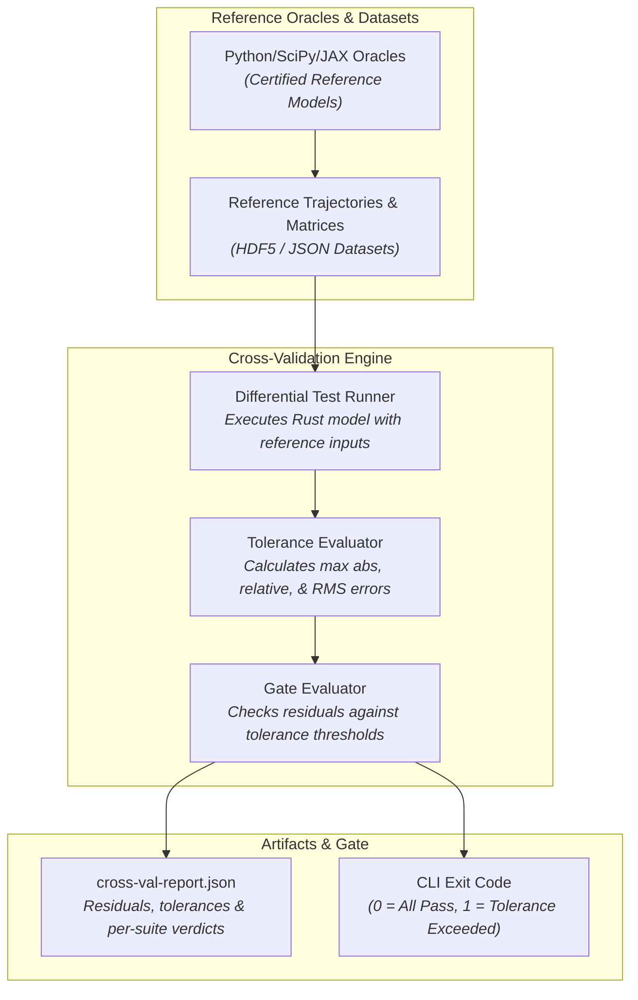

# Multi-Suite Differential Cross-Validation Infrastructure (Design Document)


---

### 1. Introduction

Autonomous control software and mathematical numerical libraries require rigorous
validation against independent reference implementations before deployment.
Differential cross-validation compares the output trajectories, state
transitions, and matrix computations of `control-rs` native Rust algorithms
against certified reference oracles (such as SciPy, JAX, SLICOT benchmarks, and
NIST datasets).

This document specifies the differential cross-validation harness operating as a
custom quality gate. It executes reference comparison suites, measures numerical
residuals, evaluates tolerance thresholds ($\epsilon_{\text{abs}},
\epsilon_{\text{rel}}$), and serializes verification metrics into
`cross-val-report.json`.

---

### 2. Requirements

#### 2.1 Functional Requirements

- **FR-1 — Reference Dataset & Oracle Ingestion**: The validation harness must
  ingest reference simulation trajectories, state arrays, and certified matrix
  benchmarks from standardized binary (HDF5) or structured (JSON) datasets
  with verified provenance (NIST, 2026; Abels and Benner, 1999).
- **FR-2 — Differential Trajectory Execution**: The harness must execute Rust
  numerical implementations across identical initial conditions, inputs, and time
  horizons as the reference oracle, computing state-by-state trajectory
  comparisons (SLICOT, 2026; Kochenderfer et al., 2026).
- **FR-3 — Multi-Metric Floating-Point Comparison**: The comparison engine must
  evaluate maximum absolute error ($\|x_{\text{rust}} - x_{\text{ref}}\|_\infty$),
  maximum relative error, and root-mean-square (RMS) residual against declared
  tolerance bounds per state variable (IEEE, 2019).
- **FR-4 — Structured Cross-Validation Artifact (`cross-val-report.json`)**: The
  harness must serialize verification outcomes into `cross-val-report.json`,
  reporting per-model suites, measured error metrics, tolerance thresholds, and
  verdicts (Insta, 2026; Wycheproof, 2026).
- **FR-5 — Fail-Closed Gate Exit Status**: The harness executable must exit with
  status `0` when all model suites pass within declared tolerances and non-zero
  upon any tolerance violation, missing dataset, or NaN/Inf divergence (The
  Cargo Book, 2026).
- **FR-6 — Headless CI & Local Execution**: The validation runner must execute
  headlessly on local developer machines (`cargo validate` / `cargo compare`)
  and in automated CI pipelines without interactive or graphical display
  dependencies.

#### 2.2 Non-Functional Requirements

- **NFR-1 — Precision Sensitivity**: The comparison engine must support
  verifications ranging from coarse hardware tolerances down to floating-point
  machine precision ($\approx 10^{-15}$ for `f64`) without false positives.
- **NFR-2 — Memory-Efficient Ingestion**: Large reference trajectories must be
  streamed or loaded per-suite to prevent memory exhaustion during full-matrix
  evaluations.

#### 2.3 Constraints

- **C-1 — Host-Side Execution Scope**: Differential cross-validation operates on
  host developer and CI architectures (`x86_64`, `aarch64`) where reference
  interpreters (Python 3.12 venv) and dataset tooling are available.
- **C-2 — Custom Gate Modular Decoupling**: The validation harness is decoupled
  from the core CI runner crate, running as a self-contained custom gate.

---

### 3. Technical Overview

The differential cross-validation harness feeds reference inputs to the Rust
implementation, compares the resulting output against reference oracle outputs,
evaluates numerical tolerances, and outputs a structured validation report:



---

### 4. Architecture

#### 4.1 Tolerance Bounds & Error Metrics

For a computed Rust trajectory $y_{\text{rust}}[k]$ and reference trajectory
$y_{\text{ref}}[k]$ over $N$ sample steps:

1. **Absolute Error**:
   $$\epsilon_{\text{abs}} = \max_{k \in [0, N)} |y_{\text{rust}}[k] - y_{\text{ref}}[k]|$$
2. **Relative Error**:
   $$\epsilon_{\text{rel}} = \max_{k \in [0, N)} \frac{|y_{\text{rust}}[k] - y_{\text{ref}}[k]|}{|y_{\text{ref}}[k]| + \delta}$$
3. **RMS Residual**:
   $$\text{RMS} = \sqrt{\frac{1}{N} \sum_{k=0}^{N-1} (y_{\text{rust}}[k] - y_{\text{ref}}[k])^2}$$

A test suite passes if $\epsilon_{\text{abs}} \le \text{tol}_{\text{abs}}$ and
$\epsilon_{\text{rel}} \le \text{tol}_{\text{rel}}$.

#### 4.2 Data Structures

```rust
pub struct ModelValidationResult {
    pub suite_name: String,
    pub model_name: String,
    pub samples_evaluated: usize,
    pub max_absolute_error: f64,
    pub max_relative_error: f64,
    pub rms_error: f64,
    pub tol_abs: f64,
    pub tol_rel: f64,
    pub passed: bool,
}
```

#### 4.3 Validation Report Schema (`cross-val-report.json`)

```json
{
  "summary": {
    "total_suites": 12,
    "passed_suites": 12,
    "failed_suites": 0,
    "max_observed_error": 1.42e-14,
    "verdict": "Passed"
  },
  "suites": [
    {
      "suite_name": "state_space_continuous",
      "model": "aircraft_pitch_dynamics",
      "samples": 10000,
      "max_abs_error": 8.88e-16,
      "max_rel_error": 1.12e-15,
      "rms_error": 3.45e-16,
      "tol_abs": 1.0e-12,
      "tol_rel": 1.0e-12,
      "verdict": "Passed"
    }
  ]
}
```

---

### 5. Alternatives

| Alternative | Rejected Because | Reference |
|:------------|:-----------------|:----------|
| **Live Subprocess Python Invocations on Every Test** | Live interpreter spawning introduces severe test latency ($\sim 100\times$ slower) and brittle environment coupling in CI. | [6] |
| **Static Hardcoded Float Literals in Test Assertions** | Inflexible for multi-step trajectories with thousands of points; lacks provenance metadata and traceability to scientific benchmark standards. | [1], [3] |
| **Pure Norm-Wise Assertions ($L_2$ only)** | An acceptable overall $L_2$ norm can conceal localized transient spikes or single-step numerical instability. | [4], [5] |

---

### 6. Verification & Validation

#### 6.1 Plan

| Kind | Step | Establishes |
|:-----|:-----|:------------|
| `test` | Tolerance Evaluation Unit Tests | Validates computation of absolute, relative, and RMS error metrics across known edge cases (zeros, subnormals, infinities). |
| `test` | HDF5 / JSON Deserializer Tests | Ingests reference trajectory files and validates dimension matching. |
| `test` | Intentional Deviation Failure Tests | Injects known offsets to verify that the harness fails closed and identifies diverging state dimensions. |
| `cross-check` | Canonical Benchmark Cross-Validation | Verifies linear state-space, polynomial, and transfer-function responses against SciPy reference runs. |

#### 6.2 Acceptance

| Claim | Oracle | Measure | Bound |
|:------|:-------|:--------|:------|
| **Deviation Detection** | Synthetic Injected Error Fixture | Exact Detection | Any deviation $> \text{tol}$ triggers test failure |
| **Numerical Consistency** | SciPy / NumPy Reference Datasets | Max Error | $\epsilon_{\text{abs}} \le 1.0 \times 10^{-12}$ for standard ODE solvers |
| **Fail-Closed Exit Status** | Error Scenarios | Exit Status | Non-zero exit code on tolerance violation or corrupt dataset |

#### 6.3 Limits

- Cross-validation establishes consistency with the reference oracle implementation; it does not eliminate systemic mathematical model errors shared between both formulations.

---

### 7. Performance & Resource Considerations

- **Buffered Binary I/O**: Reference dataset streaming avoids loading large
  multi-gigabyte simulation matrices simultaneously.
- **Fast SIMD-Optimized Comparisons**: Computes trajectory residuals using
  vectorized subtraction and reduction loops.

---

### 8. Risks & Open Questions

- **Python Virtualenv Portability**: Host oracles require Python 3.12 `.venv` at
  the workspace root; CI runner workflows must provision the Python environment
  consistently.

---

### 9. Development Plan

| Phase / Task | Description | Estimated Effort |
|:-------------|:------------|:-----------------|
| **Phase 1: Metric Comparator & Tolerance Engine** | Implement error metric calculation (abs, rel, RMS) and tolerance assertion helpers. | 2 |
| **Phase 2: Dataset Ingestion & Trajectory Runner** | Implement HDF5/JSON dataset loaders and differential runner orchestration. | 3 |
| **Phase 3: CLI Binary & JSON Report Emitter** | Implement standalone `validate`/`compare` CLI and `cross-val-report.json` generator. | 2 |
| **Phase 4: CI Custom Gate Integration** | Register cross-validation harness in `gate.toml` as a custom quality gate. | 1 |

---

### 10. Revision History

| Revision | Date               | Author          | Description                                                    |
|:---------|:-------------------|:----------------|:---------------------------------------------------------------|
| 1.0      | September 19, 2026 | @MitchellDScott | Initial standalone design doc for differential cross-validation gate. |

---

## References

[1] SLICOT Working Group on Software Validation, "Validation of Control Software and Benchmarking," *WGS Technical Report*, 2026. [Online]. Available: http://slicot.org/validation-benchmark.

[2] J. Abels and P. Benner, "CAREX -- A Collection of Benchmark Examples for Continuous-Time Algebraic Riccati Equations," *ZeTeM, Universität Bremen*, Report 99-03, pp. 1–42, 1999.

[3] National Institute of Standards and Technology, "Statistical Reference Datasets (StRD) -- Background and Certified Values," *U.S. Department of Commerce*, 2026. [Online]. Available: https://www.itl.nist.gov/div898/strd/.

[4] M. J. Kochenderfer, T. A. Wheeler, and K. H. Wray, *Algorithms for Validation*, MIT Press, pp. 1–350, 2026.

[5] IEEE Standards Association, "IEEE Standard for Floating-Point Arithmetic," *IEEE Std 754-2019*, pp. 1–84, 2019.

[6] The Cargo Developers, *The Cargo Book*, Rust Project Developers, 2026. [Online]. Available: https://doc.rust-lang.org/cargo/.

[7] A. Ronacher, "insta: A snapshot testing library for Rust," 2026. [Online]. Available: https://docs.rs/insta.

[8] Google Project Wycheproof Developers, "Project Wycheproof: Test vectors for cryptographic software," 2026. [Online]. Available: https://github.com/google/wycheproof.
