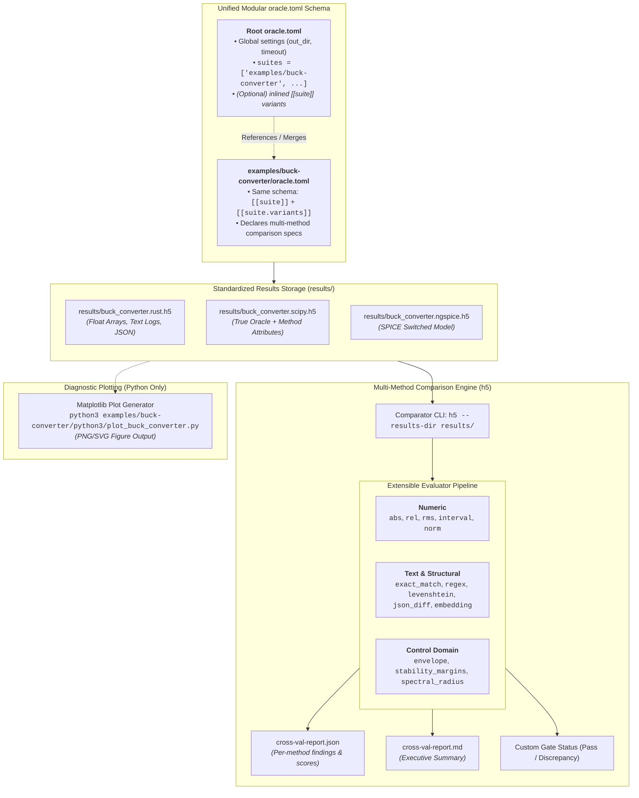

# Host Oracle & HDF5 Comparison System (Design Document)


---

### 1. Introduction

`control-rs` implements `no_std` and `no_alloc` control algorithms. Verifying
numerical correctness, model fidelity, and algorithmic behavior in safety-critical
autonomous systems requires empirical validation against certified reference
oracles and multi-language implementations (such as NumPy, SciPy, JAX,
python-flint, harold, and ngspice) on ill-conditioned kernels where
floating-point error accumulation is observable (SLICOT, 2026; Kochenderfer
et al., 2026).

This document establishes the architecture and normative contract for the
published **Oracle Harness & HDF5 Comparison System**. Both `control-rs-ci` and
`oracle-harness` are designed as standalone, publishable crates on crates.io,
emitting distinct CLI binaries while providing an extensible, multi-method
evaluation pipeline:

1. **Published Crate Distribution**:
   - **`oracle-harness`**: A published crate providing the core comparison engine,
     multi-modal HDF5 verification library, and two standalone CLI binaries:
     - **`oracle` (`control-rs-oracle` / `cargo oracle`)**: The variant runner and orchestrator.
     - **`h5` (`control-rs-h5` / `cargo h5`)**: The independent result comparison engine.
   - **`control-rs-ci`**: The published workspace CI gate orchestrator that invokes
     the `oracle` and `h5` tools as a registered **custom quality gate**.
2. **Extensible Multi-Method Evaluation Pipeline**:
   - Supports extensible evaluators spanning **numerical arrays** (absolute error,
     relative error, RMS, matrix norms, interval containment), **text and structured
     outputs** (exact string match, regular expressions, `Levenshtein` edit distance,
     JSON structural diffs, semantic contextual embeddings), and **control-domain
     invariants** (time-domain bounding envelopes, stability margins, spectral radii).
   - Allows declaring **multiple comparison methods per dataset** with composite
     satisfaction policies (`all_of` vs `any_of`).
3. **Unified Modular Configuration Schema (`oracle.toml`)**:
   - The same `oracle.toml` schema and data structures are parsed identically at
     every directory level by the same program (`oracle`).
   - A root `oracle.toml` can reference child suite directories via `suites = [...]`
     for modular cleanliness, or define/override suites and variants directly
     at the root level.
   - A suite-level `oracle.toml` uses the identical schema, allowing developers to
     run a single suite in isolation (`oracle --config examples/<suite>/oracle.toml`)
     or compose multiple suites globally.
4. **Zero-Dependency Example Suite Decoupling**:
   - Validation suites in `examples/` (for example, `examples/numerical-models-validation`,
     `examples/buck-converter`, `examples/dc-motor`) are standard, pure Rust
     examples that have **zero Cargo dependencies** on `oracle-harness` or `control-rs-ci`.
   - Executing an example emitter via `cargo run --example <suite>` (or `cargo run -p <suite>`)
     only computes native Rust routines and writes `results/<suite>.rust.h5`.
   - The example interacts with the harness strictly through declarative file
     contracts: emitting `.rust.h5` and providing an `oracle.toml` file.
5. **Diagnostic Plotting Scripts (`python3/plot_*.py`)**:
   - Downstream Python scripts that ingest `.h5` files from `results/` to
     generate publication-grade figures (PNG/SVG) using Matplotlib (`control_rs_plot`).
     Plotting is not implemented in Rust and cannot affect gate verdicts.

---

### 2. Requirements

#### 2.1 Functional Requirements

- **FR-1 — Multi-Modal HDF5 Variant Container**: Each execution variant
  (for example, `rust`, `scipy`, `jax`, `ngspice`) must emit its results to an
  independent HDF5 file formatted as `results/<suite>.<variant>.h5`. The container
  must support numeric datasets (`f64` scalar, 1D/2D arrays), UTF-8 text string
  datasets, and compound/JSON structures at `/<signal_path>`.
- **FR-2 — Published Standalone Comparator CLI (`h5`)**: `oracle-harness` must
  publish a standalone binary `h5` (aliased as `control-rs-h5` / `cargo h5`) that
  operates independently on a specified results directory (`--results-dir`),
  without requiring compilation or knowledge of how variants were executed.
- **FR-3 — Published Standalone Variant Runner CLI (`oracle`)**: `oracle-harness`
  must publish a standalone binary `oracle` (aliased as `control-rs-oracle` /
  `cargo oracle`) that parses `oracle.toml` files, resolves Python virtual
  environments, executes declared variants with timeouts, and deposits `.h5`
  containers into the results directory.
- **FR-4 — Unified Modular Configuration Schema**: `oracle` must parse an
  identical, unified `oracle.toml` configuration schema at all directory levels.
  The schema must support both referencing external suite directories (`suites = [...]`)
  and inlining suite/variant definitions directly (`[[suite]]`), allowing users
  to define variants from outside or inside a suite.
- **FR-5 — Extensible Multi-Method Comparison Engine**: The comparison engine
  must evaluate datasets using extensible evaluators declared per signal:
  1. *Numeric*: `abs`, `rel`, `rms`, `interval`, `matrix_norm`.
  2. *Text & Structured*: `exact_match`, `regex_match`, `levenshtein`, `json_diff`, `semantic_similarity` (contextual embeddings).
  3. *Control Domain*: `envelope` (dynamic time-domain bounds), `spectral_radius`, `stability_margins`.
- **FR-6 — Composite Evaluation Policies**: The comparator must allow declaring
  multiple comparison methods on a single dataset with configurable satisfaction
  policies (`policy = "all_of"` where all declared methods must pass, or
  `policy = "any_of"` where at least one must pass).
- **FR-7 — CI Custom Gate Integration**: `oracle-harness` must adhere to the
  custom quality gate protocol expected by `control-rs-ci` (`gate.toml`),
  emitting machine-readable `cross-val-report.json`, human-readable
  `cross-val-report.md`, and deterministic process exit codes (The Cargo Book, 2026).
- **FR-8 — Zero Cargo Dependency for Examples**: Example suites in `examples/`
  must not declare `oracle-harness` or `control-rs-ci` in their `[dependencies]`
  or `[dev-dependencies]`. They interact with the harness solely by writing `.rust.h5`
  and declaring `oracle.toml` (Rust API Guidelines, 2026).
- **FR-9 — Isolated Suite Emitters**: Running an example suite directly with
  `cargo run --example <suite>` or `cargo run -p <suite>` must compute only native
  Rust math and emit `results/<suite>.rust.h5`, without triggering oracles or
  comparisons.
- **FR-10 — Fail-Closed Discrepancy Accumulation**: The comparison engine must
  treat missing datasets, shape/dimension mismatches, non-numeric entries,
  `NaN` or infinite values, and method tolerance breaches as discrepancies, terminating
  with a non-zero exit code.
- **FR-11 — Decoupled Diagnostic Plot Generation**: Companion plotting
  scripts (`python3/plot_<suite>.py`) must ingest persisted `.h5` containers
  from `results/` and emit publication-grade static figures (PNG/SVG) using
  Python (`matplotlib`).
- **FR-12 — Evidence Freshness & Provenance Verification**: The comparator must
  validate that result containers were produced during the current test session
  and capture git commit SHA, host target triple, and oracle library versions
  (NIST, 2026; Abels and Benner, 1999).

#### 2.2 Non-Functional Requirements

- **NFR-1 — Publishable Crate Standards**: Both `oracle-harness` and
  `control-rs-ci` must meet crates.io publication standards (Rust API Guidelines
  C-METADATA, SemVer adherence, permissive MIT/Apache-2.0 licensing, and complete
  documentation) (Rust API Guidelines, 2026; The Cargo Book, 2026).
- **NFR-2 — Strict Isolation from Embedded Toolbox**: Zero host-runner,
  HDF5, or Python dependencies may leak into the core `control-rs` library
  crates (`#![no_std]`).
- **NFR-3 — Deterministic Verification**: Numerical comparisons must be
  deterministic across runs on host platforms (`x86_64`, `aarch64`), depending
  strictly on IEEE 754 floating-point bounds (IEEE, 2019).
- **NFR-4 — Memory-Efficient Dataset Traversal**: HDF5 reading and traversal
  must operate dataset-by-dataset to avoid loading multi-gigabyte simulation
  trajectories simultaneously into host memory.

#### 2.3 Constraints

- **C-1 — Python Runtime Resolution Hierarchy**: Process execution must
  resolve Python interpreters in strict priority order: `PYTHON` environment
  variable, active `VIRTUAL_ENV` path, crate-root `.venv`
  (`../../.venv/bin/python3`), local `.venv`, and system `PATH`.
- **C-2 — Single-Source Tolerance Attribution**: Numerical tolerance bounds
  must be declared in single-source TOML tables (`examples/<suite>/tolerances/*.toml`)
  or inscribed directly onto true-oracle HDF5 attributes. Module specifications
  cite these rows without duplicating numeric literals.
- **C-3 — Decoupled Non-Rust Visualization**: Diagnostic plot generators
  must read exclusively from persisted `results/*.h5` files using Python
  (`matplotlib` with headless `agg` backend). Visualizations must not be
  implemented in Rust and must not affect gate pass/fail status.
- **C-4 — Published Binary Naming**: The runner binary is named `oracle`. The
  comparator binary is named `h5`.
- **C-5 — Zero Filesystem Searching**: Execution paths must be statically
  declared in configuration files; runtime wildcard matching or directory crawling to
  discover suites or variants is prohibited.

---

### 3. Technical Overview

The comparison architecture decouples configuration, execution orchestration,
multi-method evaluation, and diagnostic visualization:



---

### 4. Architecture

#### 4.1 Crate & Binary Distribution Model

`oracle-harness` is published to crates.io with two standalone binaries:

```toml
# oracle-harness/Cargo.toml (Published Crate)
[package]
name = "oracle-harness"
version = "0.1.0"
edition = "2024"
license = "MIT OR Apache-2.0"
description = "HDF5 cross-validation comparison engine and multi-language oracle runner"
repository = "https://github.com/Dyse-Industries/control-rs"
readme = "README.md"
keywords = ["control", "validation", "hdf5", "oracle", "testing"]
categories = ["development-tools::testing"]

[dependencies]
hdf5 = "0.8"
serde = { version = "1.0", features = ["derive"] }
serde_json = "1.0"
toml = "0.8"
chrono = "0.4"
regex = "1.10"
strsim = "0.11"

[[bin]]
name = "oracle"
path = "src/bin/oracle.rs"

[[bin]]
name = "h5"
path = "src/bin/h5.rs"
```

#### 4.2 Modular Comparison Engine & Evaluator Trait Architecture

The comparison engine decouples dataset representation from verification logic
via the `ComparisonEvaluator` trait:

```rust
pub enum DatasetValue<'a> {
    Float1D(&'a [f64]),
    Float2D { rows: usize, cols: usize, data: &'a [f64] },
    Text(&'a str),
    TextList(&'a [&'a str]),
    StructuredJson(&'a serde_json::Value),
}

pub struct MethodResult {
    pub passed: bool,
    pub measure: String,
    pub observed_score: f64,
    pub threshold: f64,
    pub details: Option<String>,
}

pub trait ComparisonEvaluator: Send + Sync {
    /// Canonical method identifier (e.g. "abs", "regex_match", "semantic_similarity").
    fn method_name(&self) -> &str;

    /// Evaluates the peer dataset value against the reference oracle.
    fn evaluate(
        &self,
        oracle: &DatasetValue,
        peer: &DatasetValue,
        context: &EvaluationContext,
    ) -> MethodResult;
}
```

#### 4.3 Catalogue of Built-In Comparison Methods

##### 1. Numeric Methods

| Method | Mathematical Definition / Measure | Pass Condition |
|:---|:---|:---|
| **`abs`** | $\|D_{\text{oracle}} - D_{\text{peer}}\|_\infty = \max_i |D_{\text{oracle}}[i] - D_{\text{peer}}[i]|$ | $\text{score} \le \text{bound}$ |
| **`rel`** | $\max_i \frac{|D_{\text{oracle}}[i] - D_{\text{peer}}[i]|}{|D_{\text{oracle}}[i]| + \epsilon_{\text{mach}}}$ | $\text{score} \le \text{bound}$ |
| **`rms`** | $\sqrt{\frac{1}{N}\sum_{i=1}^N (D_{\text{oracle}}[i] - D_{\text{peer}}[i])^2}$ | $\text{score} \le \text{bound}$ |
| **`interval`** | Range check: $D_{\text{peer}}[i] \in [\min, \max]$ for all $i$ | All elements in interval |
| **`matrix_norm`** | Matrix Frobenius norm: $\|A - B\|_F = \sqrt{\sum_{i,j} (a_{ij} - b_{ij})^2}$ | $\|A - B\|_F \le \text{bound}$ |

##### 2. Text & Structural Methods

| Method | Measure / Algorithm | Pass Condition |
|:---|:---|:---|
| **`exact_match`** | String byte-for-byte or normalized whitespace equality. | $\text{peer} == \text{oracle}$ |
| **`regex_match`** | Evaluates regular expression pattern over peer text/logs. | Pattern matches peer output |
| **`levenshtein`** | Normalized `Levenshtein` similarity: $1 - \frac{d(s_1, s_2)}{\max(|s_1|, |s_2|)}$. | $\text{similarity} \ge \text{threshold}$ |
| **`json_diff`** | Structural JSON AST comparison ignoring key ordering. | Semantic JSON identity |
| **`semantic_similarity`** | Cosine similarity of contextual text embeddings: $\frac{\mathbf{u} \cdot \mathbf{v}}{\|\mathbf{u}\|_2 \|\mathbf{v}\|_2}$. | $\cos(\theta) \ge \text{threshold}$ |

##### 3. Domain-Specific & Control Methods

| Method | Domain Measure | Pass Condition |
|:---|:---|:---|
| **`envelope`** | Time-series bounded by dynamic bounds: $y_{\min}[k] \le y_{\text{peer}}[k] \le y_{\max}[k]$. | Trajectory inside envelope |
| **`spectral_radius`** | Maximum eigenvalue magnitude: $\rho(A) = \max_i |\lambda_i(A)|$. | $\rho(A) < 1.0$ (discrete) / $\text{Re}(\lambda) < 0$ (continuous) |
| **`stability_margins`** | Evaluates gain margin $\Delta G$ (dB) and phase margin $\Delta \Phi$ (deg) tolerance. | $|\Delta G_{\text{peer}} - \Delta G_{\text{oracle}}| \le \text{tol}$ |

#### 4.4 Composite Multi-Method Evaluation Policies

When multiple comparison methods are configured for a dataset, the comparator
evaluates all methods and resolves the aggregate verdict:

- **`policy = "all_of"` (Default)**: Every declared method must pass. If any
  method fails, the dataset is marked as a discrepancy.
- **`policy = "any_of"`**: At least one declared method must pass.

```toml
[tolerances."buck.transient.verification"]
subject = "buck_converter"
signal = "transient/v_out"
policy = "all_of"
methods = [
    { type = "abs", bound = 1e-3 },
    { type = "rms", bound = 5e-4 },
    { type = "envelope", lower = "transient/v_min", upper = "transient/v_max" },
]
```

#### 4.5 Unified Modular Configuration Schema (`oracle.toml`)

The configuration format is unified across root and suite levels:

##### Rust Configuration Data Structures

```rust
#[derive(Debug, Clone, Default, serde::Serialize, serde::Deserialize)]
pub struct OracleConfigFile {
    #[serde(default)]
    pub oracle: OracleGeneralConfig,
    /// Optional child suite directories to merge (for modularity).
    #[serde(default)]
    pub suites: Vec<String>,
    /// Inline suite declarations (can define suites and variants from anywhere).
    #[serde(default, rename = "suite")]
    pub inlined_suites: Vec<SuiteConfig>,
}

#[derive(Debug, Clone, serde::Serialize, serde::Deserialize)]
pub struct OracleGeneralConfig {
    #[serde(default = "default_title")]
    pub title: String,
    #[serde(default = "default_out_dir")]
    pub out_dir: String,
    #[serde(default = "default_timeout")]
    pub timeout_secs: u64,
    #[serde(default = "default_true")]
    pub strict: bool,
}

#[derive(Debug, Clone, serde::Serialize, serde::Deserialize)]
pub struct SuiteConfig {
    pub name: String,
    #[serde(default = "default_oracle")]
    pub true_oracle: String,
    #[serde(default)]
    pub tolerance_table: Option<String>,
    #[serde(default)]
    pub variants: Vec<VariantConfig>,
}

#[derive(Debug, Clone, serde::Serialize, serde::Deserialize)]
pub struct VariantConfig {
    pub name: String,
    pub r#type: String, // "rust_bin" | "python_script" | "command"
    #[serde(default)]
    pub manifest_path: Option<String>,
    #[serde(default)]
    pub bin: Option<String>,
    #[serde(default)]
    pub script: Option<String>,
    #[serde(default)]
    pub command: Option<String>,
    pub output_file: String,
    #[serde(default)]
    pub optional: bool,
}
```

##### 1. Workspace Root Example (`oracle.toml`)

```toml
# oracle.toml (workspace root)
[oracle]
title = "control-rs Cross-Validation Suite"
out_dir = "results"
timeout_secs = 120
strict = true

# Referenced suite directories (each contains its own oracle.toml)
suites = [
    "examples/numerical-models-validation",
    "examples/buck-converter",
    "examples/dc-motor",
]

# (Optional) Inlined suite defined from outside the suite folder
[[suite]]
name = "ad_hoc_experiment"
true_oracle = "scipy"
tolerance_table = "examples/support/tolerances/experiment.toml"

[[suite.variants]]
name = "rust"
type = "rust_bin"
manifest_path = "examples/experiment/Cargo.toml"
bin = "experiment_bin"
output_file = "results/experiment.rust.h5"

[[suite.variants]]
name = "scipy"
type = "python_script"
script = "examples/experiment/python3/experiment_oracle.py"
output_file = "results/experiment.scipy.h5"
```

##### 2. Per-Suite Example (`examples/buck-converter/oracle.toml`)

```toml
# examples/buck-converter/oracle.toml
[oracle]
out_dir = "results"
timeout_secs = 90

[[suite]]
name = "buck_converter"
true_oracle = "scipy"
tolerance_table = "tolerances/buck_converter.toml"

[[suite.variants]]
name = "rust"
type = "rust_bin"
manifest_path = "Cargo.toml"
bin = "buck_converter"
output_file = "results/buck_converter.rust.h5"

[[suite.variants]]
name = "scipy"
type = "python_script"
script = "python3/buck_converter_oracle.py"
output_file = "results/buck_converter.scipy.h5"

[[suite.variants]]
name = "ngspice"
type = "command"
command = "ngspice -b spice/buck_switched.cir"
output_file = "results/buck_converter.ngspice.h5"
optional = true
```

#### 4.6 Recursive Config Resolution & Path Normalization

When `oracle` loads a config:
1. It parses the target TOML file into `OracleConfigFile`.
2. For every entry in `suites`:
   - Resolves the child directory path relative to the parent TOML.
   - Loads `<suite_dir>/oracle.toml`.
   - Normalizes all relative script, manifest, and tolerance paths to be relative
     to the current working directory / workspace root.
   - Appends all discovered `[[suite]]` entries into the master plan.
3. Inlined `[[suite]]` blocks are appended directly.
4. If a suite is defined both in a child TOML and overridden in the root TOML,
   the root definition takes precedence.

#### 4.7 CI Custom Gate Integration (`control-rs-ci`)

`control-rs-ci` registers the oracle comparison system as a standard custom gate
in `gate.toml`:

```toml
# gate.toml
[[gates]]
name = "cross-val"
description = "Host-side oracle cross-validation and HDF5 numerical tolerance gate"
command = "oracle --config oracle.toml"
verify_command = "h5 --results-dir results/"
report_json = "results/cross-val-report.json"
report_md = "results/cross-val-report.md"
blocking = true
```

#### 4.8 Standalone Result Comparison Engine (`h5`)

The published `h5` binary operates independently on `--results-dir`:

```bash
h5 [OPTIONS]
cargo h5 [OPTIONS]
```

##### CLI Options
- `--results-dir <DIR>` / `--out-dir <DIR>`: Directory containing `.h5` files (default: `results` or `.`).
- `--suite <NAME>`: Evaluate only the named suite (for example, `buck_converter`).
- `--oracle <VARIANT>`: Override true oracle variant (default: `scipy` or `rust`).
- `--strict`: Terminate non-zero on any tolerance breach (default: `true`).
- `--bypass-gate`: Generate reports without returning non-zero exit code.
- `--quiet`: Suppress streaming messages, emitting only reports.

#### 4.9 HDF5 Multi-Modal Container Schema & Attributes

Each test variant writes an independent HDF5 container:

$$\text{results/}<\text{suite}>.<\text{variant}>.\text{h5}$$

##### Multi-Modal Dataset Layout
```
/
├── state_space/
│   ├── time_series/
│   │   ├── time              [N] float64
│   │   ├── state_trajectory  [N x n] float64
│   │   └── output_trajectory [N x m] float64
│   └── matrices/
│       ├── gramian_w_c       [n x n] float64
│       └── similarity_t      [n x n] float64
├── diagnostics/
│   ├── convergence_log       [1] string (UTF-8)
│   └── solver_summary        [1] string (JSON serialized AST)
└── _meta/                    (Skipped during gate comparison)
    └── plot_annotations     [K] string
```

True-oracle datasets carry write-time attributes:
- Single method: `measure = "abs"`, `bound = 1e-4`
- Multi-method: `methods = '[{"type":"abs","bound":1e-4},{"type":"rms","bound":1e-5}]'`
- Policy: `policy = "all_of"` | `"any_of"`
- `independent`: `u8` (1 or 0)
- `bound.<peer>`: `f64` (optional peer override)

#### 4.10 Diagnostic Plotting Pipeline (Python Matplotlib)

Companion plotting scripts (`examples/<suite>/python3/plot_<suite>.py`) load
`.h5` containers from `results/` and emit publication-grade static figures:

```
results/
├── buck_converter_plot.png
├── dc_motor_plot.png
└── numerical_models_plot.png
```

- **Non-Rust Implementation**: Authoring in Python using `matplotlib` (with headless
  `agg` backend) and `control_rs_plot` provides flexible visual styling without
  introducing GUI or graphical C dependencies into the Rust workspace.
- **Decoupled Failure Boundary**: Plot script invocation occurs downstream of
  `h5` comparison. Script absence or plotting errors do not alter gate exit
  codes.

#### 4.11 Structured Report Schemas

##### `cross-val-report.json`

```json
{
  "summary": {
    "total_suites": 7,
    "passed_suites": 7,
    "failed_suites": 0,
    "total_duration_secs": 8.42,
    "verdict": "Pass"
  },
  "suites": [
    {
      "name": "buck_converter",
      "status": "Pass",
      "duration_secs": 2.10,
      "comparisons": [
        {
          "key": "buck.transient.v_out",
          "pair": ["scipy", "rust"],
          "signal": "transient/v_out",
          "policy": "all_of",
          "verdict": "pass",
          "methods": [
            {
              "type": "abs",
              "bound": 1.0e-3,
              "observed": 4.12e-5,
              "verdict": "pass"
            },
            {
              "type": "rms",
              "bound": 5.0e-4,
              "observed": 1.84e-5,
              "verdict": "pass"
            }
          ]
        },
        {
          "key": "buck.simulation.status",
          "pair": ["scipy", "rust"],
          "signal": "diagnostics/convergence_log",
          "policy": "all_of",
          "verdict": "pass",
          "methods": [
            {
              "type": "regex_match",
              "pattern": "converged in \\d+ iterations",
              "verdict": "pass"
            }
          ]
        }
      ]
    }
  ]
}
```

##### `cross-val-report.md` (Executive Summary)

```markdown
### Cross-Comparison & Oracle Validation Brief

| Metric | Value |
| :--- | :--- |
| **Status** | Pass |
| **Suites Verified** | 7 / 7 passed (8.42s total) |
| **Authoritative Table** | examples/buck-converter/tolerances/buck_converter.toml (12 bounds) |
| **Regression Artifacts** | `cross-val-report.json`, `cross-val-report.md` |
| **Diagnostic Plots** | `results/buck_converter_plot.png`, `results/dc_motor_plot.png` |

| Suite | Status | Duration | Comparisons | Methods Evaluated |
| :--- | :--- | :--- | :--- | :--- |
| `matrix` | Pass | 1.12s | 14 signal(s) | `abs`, `rel`, `matrix_norm` |
| `state_space` | Pass | 1.45s | 18 signal(s) | `abs`, `rms`, `spectral_radius` |
| `buck_converter` | Pass | 2.10s | 12 signal(s) | `abs`, `rms`, `regex_match`, `envelope` |
```

---

### 5. Alternatives

| Alternative | Technical Tradeoffs & Reason for Rejection | Reference |
|:---|:---|:---|
| **Hardcoded Float-Only Evaluators** | Restricts comparison strictly to double-precision numbers; fails to support text logs, regular expression status checks, JSON AST equivalence, or semantic contextual embeddings. | [7], [8] |
| **Separate Incompatible Config Schemas for Root vs Suites** | Forces runner to implement multiple parser paths; unified modular schema allows identical data structures to parse root configs, suite configs, or inlined experiments. | [6] |
| **Unpublished In-Tree Harness / xtask** | Prevents other control projects and external users from adopting `oracle-harness` as a reusable numerical verification tool for their own Rust and C control algorithms. Publishing establishes a standardized ecosystem tool. | [6], [9] |
| **Examples Depending on Harness as a Rust Library** | Couples simple pedagogical examples to heavy host-only I/O dependencies (`hdf5`, `serde_json`, `toml`); violates the principle that examples should remain minimal, clean, and focused purely on toolbox API demonstration. | [9] |
| **Dynamic Filesystem Searching / Crawling** | Dynamic directory walking is non-deterministic, brittle in complex workspace hierarchies, and hides missing suite targets behind silent discovery omissions. Statically declaring suites in config guarantees exhaustive execution. | [6] |
| **Rust-Native Plotting (plotters / `egui`)** | Adds significant compilation overhead and graphics driver dependencies to CI pipelines for diagnostic figures that are only inspected off-line. | [6] |

---

### 6. Verification & Validation

#### 6.1 Plan

| Kind | Step | Establishes |
|:---|:---|:---|
| `test` | Extensible Evaluator Unit Tests | Validates `abs`, `rel`, `rms`, `interval`, `exact_match`, `regex_match`, `levenshtein`, and `json_diff` across clean and breach inputs. |
| `test` | Composite Policy Evaluation Tests | Asserts correct resolution of `all_of` and `any_of` policies across multi-method datasets. |
| `test` | Unified configuration schema parser tests | Verifies loading child `suites`, inlined `[[suite]]` definitions, path normalizations, and overrides. |
| `test` | Multi-Modal HDF5 container tests | Verifies reading and writing numeric arrays, UTF-8 string datasets, and JSON attributes. |
| `test` | Fail-closed discrepancy tests | Asserts that missing datasets, shape mismatches, NaNs, and stale timestamps trigger non-zero exit. |
| `cross-check` | Custom gate integration test in `control-rs-ci` | Executes `cargo ci` with `cross-val` custom gate registered, confirming end-to-end report generation. |

#### 6.2 Acceptance

| Claim | Oracle | Measure | Bound |
|:---|:---|:---|:---|
| **Multi-Method Detection** | Synthetic injected error fixtures | Exact method detection | Any method failure triggers non-zero exit under `all_of` |
| **Text Pattern Matching** | String fixtures | Regex engine | Exact regex match / mismatch detection |
| **Unified Config Parsing** | Single/multi-suite TOML fixtures | AST validation | Identical parsing across root and suite files |
| **Missing Key Rejection** | Synthetic partial HDF5 container | Error accumulator | Flags missing dataset with non-zero exit |
| **Deterministic Evaluation** | Repeated host execution | Binary reproducibility | Exactly identical floating-point residuals |
| **Freshness Enforcement** | Pre-dated container fixture | `mtime` / timestamp check | Flags stale container with non-zero exit |

#### 6.3 Limits

- Verification operates on host developer workstations and CI runners (`x86_64`, `aarch64`); target embedded MCU architectures (`thumbv7em`, `riscv32`) are validated through ETS rather than HDF5 oracle harnesses.
- Semantic embedding evaluation requires external embedding provider or offline local ONNX model runtime when activated.
- Requires Python 3.12 with required scientific libraries (`numpy`, `scipy`, `matplotlib`) for external oracle generation and diagnostic visualization.

---

### 7. Performance & Resource Considerations

- **Streaming Dataset Evaluation**: Reading HDF5 datasets sequentially bounds
  host RAM consumption below 128 MB even during multi-suite trajectory audits.
- **Zero Embedded Footprint**: All HDF5 and comparison dependencies (`hdf5`,
  `serde_json`, `toml`, `regex`, `strsim`) are quarantined to the published host tool
  crates, ensuring zero impact on the embedded `control-rs` library footprint (`#![no_std]`).
- **Rapid Gating Latency**: `h5` executes in under 200 ms for complete model
  suites when reading pre-generated containers.

---

### 8. Risks & Open Questions

- **External Library Version Drift**: Minor numerical discrepancies in reference
  libraries (for example, SciPy eigenvalue algorithm updates) can shift machine-precision
  residuals. Documenting exact reference versions in C-8 envelopes and TOML
  provenance headers mitigates this risk.
- **Embedding Model Weight Distribution**: For `semantic_similarity` evaluations,
  relying on lightweight local token models ensures offline
  reproducibility in CI without requiring live API keys or cloud connections.
- **HDF5 C Library Dependency on crates.io**: Published `oracle-harness` binary
  releases may provide pre-compiled standalone binaries (via GitHub Releases / cargo-binstall)
  to allow developers on systems without local `libhdf5-dev` headers to use `h5`
  and `oracle` seamlessly.

---

### 9. Development Plan

| Phase / Task | Description | Status |
|:---|:---|:---|
| **Phase 1: `oracle-harness` Crate & Extensible Evaluator Engine (`h5`)** | Implement `ComparisonEvaluator` trait, numeric evaluators (`abs`, `rel`, `rms`, `interval`, `norm`), text evaluators (`exact_match`, `regex_match`, `levenshtein`), composite policies (`all_of`/`any_of`), and standalone `h5` binary. | Active |
| **Phase 2: Unified Config Loader & Variant Runner (`oracle`)** | Implement unified modular `oracle.toml` parser (supporting child `suites` and inlined `[[suite]]`), Python runtime resolution, timeout management, and standalone `oracle` binary. | Active |
| **Phase 3: `control-rs-ci` Custom Gate Integration** | Register `cross-val` custom gate in `gate.toml` and wire report ingestion into `ci-report.md`. | Active |
| **Phase 4: Suite Migration & Diagnostic Matplotlib Figures** | Ensure `examples/` suites emit `.rust.h5` without harness dependencies, declare per-suite `oracle.toml`, and maintain companion Matplotlib plotting scripts. | Active |

---

### 10. Revision History

| Revision | Date | Author | Description |
|:---|:---|:---|:---|
| 1.0 | September 19, 2026 | @MitchellDScott | Initial draft establishing the decoupled Host Oracle and HDF5 Comparison System design. |
| 1.1 | September 19, 2026 | @MitchellDScott | Renamed comparison tool to `control-rs-h5` (`cargo h5`) and standardized validation suite location within `examples/`. |
| 1.2 | September 19, 2026 | @MitchellDScott | Upgraded plotting to interactive Plotly/HTML dashboards; added explicit per-suite binary structure and config-driven runner (prohibiting dynamic searching). |
| 1.3 | September 19, 2026 | @MitchellDScott | Established two-tier configuration (root `oracle.toml` without variants, per-suite `oracle.toml` with variants), single root orchestrator example (`examples/oracle`), and isolated single-emitter execution. |
| 1.4 | September 19, 2026 | @MitchellDScott | Specified published crate architecture for `oracle-harness` (emitting `oracle` and `h5` binaries) and `control-rs-ci` (custom gate integration), with zero-dependency example decoupling. |
| 1.5 | September 19, 2026 | @MitchellDScott | Unified `oracle.toml` into a single modular configuration schema used identically across root and suite levels, allowing variant definitions from inside or outside suites. |
| 1.6 | September 19, 2026 | @MitchellDScott | Standardized diagnostic plotting on headless Python Matplotlib (`control_rs_plot`), dropping interactive HTML for static publication-grade figures. |
| 1.7 | September 19, 2026 | @MitchellDScott | Formalized extensible multi-method comparison engine (`ComparisonEvaluator` trait) covering numeric, text/regex, contextual embedding, and control-domain evaluators with composite satisfaction policies (`all_of`/`any_of`). |

---

## References

[1] SLICOT Working Group on Software Validation, "Validation of Control Software and Benchmarking," *WGS Technical Report*, 2026. [Online]. Available: http://slicot.org/validation-benchmark.

[2] J. Abels and P. Benner, "CAREX -- A Collection of Benchmark Examples for Continuous-Time Algebraic Riccati Equations," *ZeTeM, Universität Bremen*, Report 99-03, pp. 1–42, 1999.

[3] National Institute of Standards and Technology, "Statistical Reference Datasets (StRD) -- Background and Certified Values," *U.S. Department of Commerce*, 2026. [Online]. Available: https://www.itl.nist.gov/div898/strd/.

[4] M. J. Kochenderfer, T. A. Wheeler, and K. H. Wray, *Algorithms for Validation*, MIT Press, pp. 1–350, 2026.

[5] IEEE Standards Association, "IEEE Standard for Floating-Point Arithmetic," *IEEE Std 754-2019*, pp. 1–84, 2019.

[6] The Cargo Developers, *The Cargo Book*, Rust Project Developers, 2026. [Online]. Available: https://doc.rust-lang.org/cargo/.

[7] A. Ronacher, "insta: A snapshot testing library for Rust," 2026. [Online]. Available: https://docs.rs/insta.

[8] Google Project Wycheproof Developers, "Project Wycheproof: Test vectors for cryptographic software," 2026. [Online]. Available: https://github.com/google/wycheproof.

[9] Rust Library Team, "Rust API Guidelines," *Rust Documentation*, 2026. [Online]. Available: https://rust-lang.github.io/api-guidelines/.
