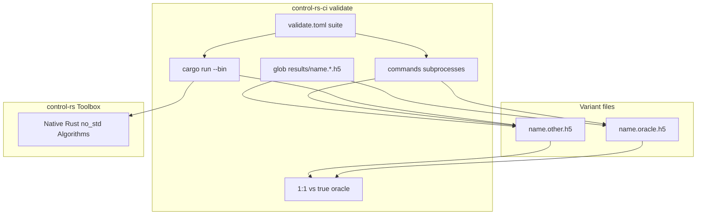

# Host Oracle Harness Contract (Design Document)


---

### 1. Introduction

This document establishes the normative contract for host-side numerical
validation in `control-rs`. The crate implements `no_std` and `no_alloc` control
algorithms, while host-side validation verifies numerical correctness against
independent reference software (such as SciPy, JAX, python-flint, harold, and
ngspice), establishing an evidence-based foundation for control algorithm
verification (Kochenderfer et al., 2026).

The harness standardizes:

1. **Suite configuration**: each suite names a cargo binary, a true-oracle
   variant, and a list of external subprocess commands.
2. **One HDF5 file per variant**: producers write `results/<name>.<variant>.h5`
   independently. There is no shared append-only container.
3. **Glob discovery**: the gate finds files by suite name; it does not take a
   comparison file list.
4. **True-oracle 1:1 comparison**: every other matching file must have the same
   dataset path set as the true oracle. Bounds live on true-oracle dataset
   attributes (IEEE, 2019).
5. **Decoupled plots**: plot scripts read the globbed files after the gate and
   cannot change pass/fail.
6. **Native CI orchestration**: `control-rs-ci` runs the cargo bin, then each
   external command, then the comparator against files written through
   `control-rs-h5`, a small format crate shared with the producers
   (`rust-hdf5`, physwkim).

This contract governs the `control-rs-validation` workspace member and the
`control-rs-h5` format crate it and `control-rs-ci` both depend on.
Pedagogical `examples/` targets are outside this contract.

---

### 2. Requirements

#### 2.1 Functional Requirements

- **FR-1 — External variant commands**: Companion oracles run as argv lists in
  the suite `commands` field. Each entry is one subprocess. The runner does not
  search for a Python interpreter or any other toolchain. A command that writes
  `results/<name>.<variant>.h5` and exits 0 has fulfilled its contract.
- **FR-2 — Local implementation via cargo**: The suite `bin` and
  `manifest_path` select `cargo run --release --bin <bin>` in that crate. Cargo
  is not listed in `commands`.
- **FR-3 — Fail-closed cross-validation**: Shape mismatches, missing true-oracle
  file, unequal path sets, missing dataset attributes, and tolerance breaches
  are errors. Zero comparison records fails closed.
- **FR-4 — One file per variant**: Each variant is a standalone HDF5 file at
  `results/<name>.<variant>.h5`. Datasets sit at `/<signal_path>`. `/_meta` is
  reserved and excluded from pairing. The suite `name` and `variant` contain no
  `.` characters.
- **FR-5 — Complete discrepancy reporting**: The runner reports every identified
  discrepancy and exits non-zero when any fail.
- **FR-6 — True-oracle 1:1 comparison**: After commands finish, the gate globs
  `results/<name>.*.h5`. The true oracle is `results/<name>.<oracle>.h5`. Every
  other matched file is a peer. Path sets must be equal. Each path is evaluated
  against attributes on the true-oracle dataset.
- **FR-7 — Gate-side verdicts from attributes**: The gate reads `measure`,
  `bound`, optional `interval`, optional `bound.<peer>`, and optional
  `independent` from the true-oracle dataset. Peer-file attributes are ignored.
  Freshness is each globbed file's mtime versus invocation time.

#### 2.2 Non-Functional Requirements

- **NFR-1 — Isolation from the embedded toolbox**: HDF5 container I/O and the
  tolerance-bound schema live in `control-rs-h5`, depended on by
  `control-rs-ci` (comparison policy) and `control-rs-validation` (producers).
  Neither crate re-implements the container format. The core `control-rs`
  library does not link HDF5.
- **NFR-2 — Deterministic reproducibility**: Comparisons depend only on IEEE 754
  tolerances (IEEE, 2019) and fixed test inputs.

#### 2.3 Constraints

- **C-1 — No interpreter discovery**: External commands are user argv. The
  environment that puts `python3` (or ngspice, or any other program) on `PATH`
  is outside this crate.
- **C-2 — Attribute-owned bounds**: Numeric bounds for a compared dataset are
  declared on that true-oracle dataset. Design-document §6.3 tables remain
  human documentation; they are not a second machine SSOT.
- **C-3 — Oracle provenance**: The true-oracle variant name is the suite
  `oracle` field. Optional `independent` on the dataset records whether the
  peer is a transcription check (NIST, 2026; SLICOT, 2026; Abels and Benner,
  1999).
- **C-4 — Decoupled visualization**: Plot scripts glob `results/<name>.*.h5`
  after gating. Plot failure does not change gate status.
- **C-5 — File freshness**: A globbed `.h5` whose mtime predates the suite
  invocation (one-second slack) is stale and fails the gate.
- **C-6 — Required suite fields**: `name`, `bin`, and `oracle` are required.
  Missing any of them, a missing true-oracle file, or fewer than two matching
  `.h5` files fails closed.

---

### 3. Technical Overview

`control-rs-ci` loads `validate.toml` suites. For each suite it:

1. Runs `cargo run --release --bin <bin>` in `manifest_path`.
2. Runs each `commands` argv as a new subprocess.
3. Globs `results/<name>.*.h5` and parses `<variant>` from the suffix.
4. Compares each peer file to `results/<name>.<oracle>.h5` by opening both
   through `control-rs-h5::H5Container`.

Producers in `control-rs-validation` write datasets at `/<signal>` with no
variant group prefix through the same `control-rs-h5::H5Container` write API.
The true-oracle producer attaches tolerance attributes with
`write_dataset_tolerance`. Downstream plot scripts read the same glob.

---

### 4. Architecture

#### 4.1 System Structure



#### 4.2 Suite configuration

```toml
[[suites]]
name = "buck-converter"
manifest_path = "control-rs-validation"
bin = "validate"
oracle = "scipy"
commands = [
  ["python3", "python3/buck_converter_oracle.py"],
]
```

Root `validate.toml` `manifest_path` values are `control-rs-validation`,
`control-rs-validation`, and `control-rs-validation`. Shared HDF5 write helper:
`control-rs-validation/python3/h5_write.py`. Numerical-models uses one suite per model
(`matrix`, `polynomial`, …) so each glob stays on one subject.

#### 4.3 Filename and dataset layout

`results/<name>.<variant>.h5`. Files that do not match this prefix are ignored.

Inside a file:

- `/<signal_path>` — compared numerical datasets
- `/_meta/...` — diagnostics, excluded from pairing

True-oracle dataset attributes:

| Attribute | Role |
|:----------|:-----|
| `measure` | `abs` / `rel` / `rel_l2` / `residual` / `exact` / `interval` / `lt` |
| `bound` | scalar bound (default for every peer) |
| `interval` | `[lo, hi]` when `measure = interval` |
| `bound.<variant>` | optional override for a named peer |
| `independent` | optional bool, report-only |

Missing `measure` and `bound` (or `interval` when required) on a compared
true-oracle dataset fails closed.

#### 4.4 Comparison rules

1. Glob `results/<name>.*.h5`. Fail if the true-oracle file is absent or if
   fewer than two files match.
2. Traverse each file, skipping `/_meta`.
3. For each peer, the path set must equal the true-oracle path set.
4. For each path, evaluate peer data against true-oracle data using the
   true-oracle attributes (`bound.<peer>` if present).
5. Fail if zero comparison records.

#### 4.5 `CrossValidation` evaluation policy

| Condition | Verdict | Diagnostic |
|:---|:---|:---|
| Paired signals, error within bound | PASS | None |
| Paired signals, error above bound | FAIL | path, pair, observed, bound |
| `exact` measure, any bit inequality | FAIL | bit inequality |
| True-oracle file missing | FAIL | named missing file |
| Peer path set differs | FAIL | missing or extra path |
| Missing measure/bound attributes | FAIL | named dataset |
| Zero comparison records | FAIL | empty comparison set |
| Shape mismatch | FAIL | named shapes |
| Non-numeric element (NaN / Inf) | FAIL | named index |
| Stale mtime | FAIL | predates this run |

---

### 5. Alternatives

1. **Single shared container with variant groups**: Rust truncated and oracles
   appended the same `results/<subject>.h5`. Concurrent writers contended, and
   pairing searched for matching `/<variant>/<signal>` paths. One file per
   variant removes the append lock and makes pairing a direct path-set equality.
2. **Explicit comparison file lists in TOML**: A list of paths duplicates the
   filename rule. Glob by suite name is the discovery mechanism.
3. **TOML tolerance tables as machine SSOT**: Bounds now travel with the
   true-oracle datasets. Design-doc §6.3 tables stay as human documentation.
4. **C HDF5 bindings vs `rust-hdf5`**: `rust-hdf5` (physwkim) remains the
   pure-Rust implementation that `h5py` can read.
5. **Halt on first discrepancy**: `CrossValidation` still accumulates every
   violation before exiting.

---

### 6. Verification & Validation

#### 6.1 Approach

- Demonstrate glob by suite name ignores unrelated `.h5` files.
- Demonstrate missing true-oracle file and unequal path sets fail closed.
- Demonstrate rust-as-oracle and scipy-as-oracle both work.
- Demonstrate missing attributes and `bound.<peer>` overrides.
- Demonstrate stale mtime rejection.

| Method | Mechanism |
|:---|:---|
| Requirements-based test | `#[test]` in `control-rs-ci/src/validate/comparator.rs` |
| Requirements-based test | `#[test]` in `control-rs-ci/src/validate/h5.rs` |
| Requirements-based test | `#[test]` in `control-rs-ci/src/runner.rs` |
| Static analysis | `cargo clippy-ci` |
| Coverage measurement | `cargo coverage` on comparison logic |

Target: comparison logic in `control-rs-ci/src/validate/comparator.rs`, verified
with `cargo coverage`. Excluded: OS error branches in process spawning.

Host suites:

- `(cd control-rs-validation && cargo ci --no-cov)`
- `(cd control-rs-validation && cargo ci --no-cov)`
- `(cd control-rs-validation && cargo ci --no-cov)`

Local `cargo run` in a validation crate writes `results/<name>.rust.h5` and may
spawn plot scripts. Plot failure is a warning, not a gate.

#### 6.2 Acceptance

| Claim | Oracle | Measure | Bound |
|:---|:---|:---|:---|
| Glob by suite name | Synthetic `results/` with extra `.h5` | File set | Only `name.*.h5` compared |
| Missing true oracle | Glob without `name.<oracle>.h5` | Fail-closed | Reports missing file |
| Path-set equality | Peer missing or extra dataset | Fail-closed | Reports missing or extra path |
| Attribute bounds | Offset payloads | abs/rel | Flags error above bound |
| Peer bound override | `bound.<peer>` on true oracle | Named peer | Uses override for that pair |
| Stale file rejection | mtime older than invocation floor | Freshness | Reports predates this run |

#### 6.3 Limits

- Hosts without a Python 3.12 installation when a suite command names `python3`.
- Non-x86_64/AArch64 host execution.
- Concurrent inter-process execution of multiple suites that share a `results/`
  directory.

---

### 7. Performance & Resource Considerations

Separate files remove HDF5 append contention. Process spawn latency remains on
the order of 50–200 ms per external command. This harness runs only on host
validation paths and does not affect target firmware timing.

---

### 8. Risks & Open Questions

- **Python dependency drift**: SciPy solver updates can move outputs near
  machine precision. Pin versions in each validation crate's
  `python3/requirements.txt`.

---

### 9. Development Plan

| Phase | Description | Status |
|:---|:---|:---|
| Phase 1: Support crate implementation | Comparator and Python process discovery in `examples/support`. | Retired |
| Phase 2: Harness contract | Author this document. | Shipped |
| Phase 3: Single-container HDF5 | Shared `results/<subject>.h5` with variant groups. | Retired |
| Phase 4: Classical examples HDF5 | Buck and DC-motor HDF5 producers. | Shipped |
| Phase 5: One file per variant | Glob by suite name, true-oracle 1:1, attribute bounds. | Active |

---

### 10. Revision History

| Revision | Date | Author | Description |
|:---------|:-----|:-------|:------------|
| 1.0 | September 8, 2026 | @MitchellDScott | Initial draft establishing the host oracle harness contract. |
| 1.7 | September 13, 2026 | @MitchellDScott | Standalone `compare` binary emitting `cross-val-report.json`. |
| 1.8 | September 14, 2026 | @MitchellDScott | One HDF5 file per variant; glob by suite name; true-oracle 1:1 path equality; bounds on true-oracle dataset attributes; cargo from `bin` + `manifest_path`; external `commands` only. |
| 1.9 | September 15, 2026 | @MitchellDScott | Relocate host oracle suites under `validation/`; pedagogical examples are out of contract. |
| 1.10 | September 15, 2026 | @MitchellDScott | Host oracle suites live in the `control-rs-validation` workspace member; pedagogical examples remain out of contract. |

---

## References

Inline citations are author–year and resolve to this list.

- [1] SLICOT, "Validation of Control Software and Benchmarking," 2026. [Online]. Available: https://www.slicot.org/106-validation-of-control-software-and-benchmarking
- [2] J. Abels and P. Benner, "CAREX - A Collection of Benchmark Examples for Continuous-Time Algebraic Riccati Equations (Version 2.0)," SLICOT Working Note 1999-14, 1999.
- [3] NIST, "Statistical Reference Datasets: Archives," 2026. [Online]. Available: https://itl.nist.gov/div898/strd/general/bkground.html
- [4] M. J. Kochenderfer, S. M. Katz, A. L. Corso, and R. J. Moss, *Algorithms for Validation*. Cambridge, MA, USA: MIT Press, 2026.
- [5] IEEE, "IEEE Standard for Floating-Point Arithmetic," IEEE Std 754-2019, 2019.
