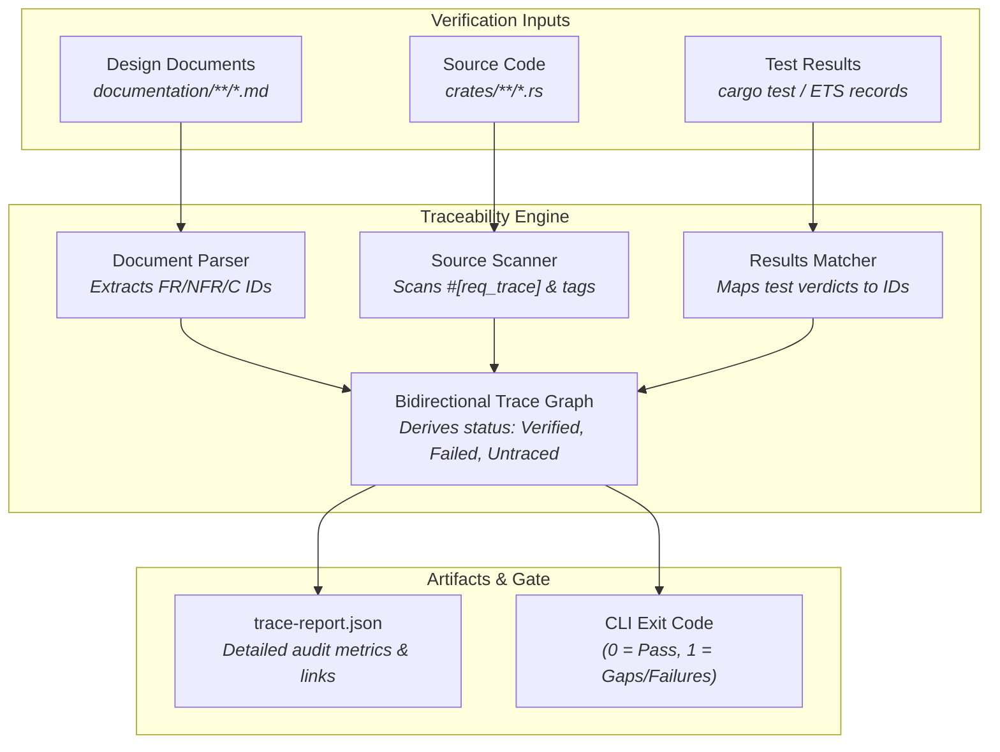

# Requirement Traceability Infrastructure (Design Document)


---

### 1. Introduction

Safety-critical control systems and high-assurance software require continuous,
verifiable traceability between written engineering specifications,
implementation source code, and automated test outcomes. The requirement
traceability infrastructure provides an automated auditor and custom quality gate
for `control-rs`. It extracts requirement definitions from Markdown design
documents, maps them to source code annotations and test cases, evaluates test
execution verdicts, and emits structured audit reports (`trace-report.json`).

Operating as a standalone tool and modular custom verification gate, it ensures
that no requirement is silently dropped, orphaned, or marked verified without
active, passing test evidence.

---

### 2. Requirements

#### 2.1 Functional Requirements

- **FR-1 — Plain-Text Specification Extraction**: The auditor must parse
  declared requirement identifiers (`FR-n`, `NFR-n`, `C-n`) and requirement
  titles directly from CommonMark Markdown design documents without requiring
  proprietary database formats (OpenFastTrace, 2026a; StrictDoc, 2026).
- **FR-2 — Source Code Annotation Linking**: The auditor must scan Rust source
  code for trace markers (such as `#[req_trace("FR-n")]` or comment tags
  `// [impl->FR-n]`), mapping code units directly to declared requirement IDs
  (Mantra, 2026a; StrictDoc, 2026).
- **FR-3 — Test Outcome Ingestion**: The auditor must ingest structured test
  results from test runners (such as `cargo test` JSON streams, JUnit XML, or
  ETS execution records) and correlate individual test verdicts with mapped
  requirement IDs (Sphinx-Needs, 2026; Mantra, 2026a).
- **FR-4 — Bidirectional Traceability Audit**: The auditor must identify both
  forward gaps (requirements lacking covering implementation or tests) and
  reverse defects (tests or code annotations referencing non-existent or
  renamed requirement IDs) (OpenFastTrace, 2026b; Doorstop, 2026).
- **FR-5 — Hierarchical Requirement State Derivation**: Requirements must
  evaluate to deterministic states (`Verified`, `Failed`, `Pending`,
  `Untraced`). A requirement is `Verified` only when all covering tests pass;
  any failing covering test marks the requirement `Failed` (Mantra, 2026a).
- **FR-6 — Structured Trace Artifact Generation**: The auditor must serialize
  audit outcomes into `trace-report.json`, detailing requirement tallies,
  per-requirement verification statuses, broken link locations, and coverage
  percentages.
- **FR-7 — Deterministic Gate Exit Status**: The auditor binary must return an
  exit code of `0` when all requirements meet policy (e.g. 100% verified, zero
  broken links) and non-zero on any unverified requirement, broken link, or test
  failure, enabling integration as a blocking CI gate (OpenFastTrace, 2026b;
  Doorstop, 2026a).

#### 2.2 Non-Functional Requirements

- **NFR-1 — Rapid Audit Execution**: Full repository scanning (parsing all
  design documents and workspace source crates) must complete in $< 1.0\,\text{s}$
  on standard developer workstations.
- **NFR-2 — Zero Production Runtime Intrusion**: Trace annotations must either
  be inert attributes, compile-time macros, or comments, introducing zero
  runtime performance penalty or code bloat into `#![no_std]` targets.
- **NFR-3 — Schema Stability**: `trace-report.json` must adhere to a stable,
  versioned JSON schema to allow seamless ingestion by downstream report
  aggregators and dashboards.

#### 2.3 Constraints

- **C-1 — Standard Markdown Compatibility**: Specification extraction must
  operate on standard CommonMark Markdown design documents adhering to
  `documentation/design-template.md`.
- **C-2 — Custom Gate Decoupling**: The auditor must function as an independent
  tool and custom gate without hardcoded runtime dependencies on CI runner
  internals.

---

### 3. Technical Overview

The requirement traceability tool scans documentation files for requirement
definitions and source code for trace markers, merging them with test outcome
records to construct a complete bidirectional traceability graph:



---

### 4. Architecture

#### 4.1 Requirement Extraction & Parsing

The parser scans Markdown files in `documentation/` using CommonMark AST
traversal. Requirements declared under section `2. Requirements` with standard
formatting (`- **FR-1 — Title**: Description`) are parsed into structured items:

```rust
pub struct RequirementItem {
    pub id: String,
    pub title: String,
    pub kind: RequirementKind, // Functional, NonFunctional, Constraint
    pub document_path: String,
    pub line_number: usize,
}
```

#### 4.2 Source Code Link Extraction

Source files across workspace crates are scanned for trace attributes and
doc-comment relation tags:

1. **Attribute Macros**: `#[req_trace("FR-1")]` placed on functions or tests.
2. **Comment Tags**: `// [impl->FR-1]` or `// [verifies->FR-1]` placed within
   method bodies.

#### 4.3 State Resolution & Verdicts

Each requirement's status is resolved from associated test outcomes:

- `Verified`: Associated with at least one covering test, and 100% of covering
  tests passed.
- `Failed`: Associated with at least one covering test, and $\ge 1$ covering test
  failed.
- `Pending`: Associated with implementation code, but no executed tests.
- `Untraced`: Declared in a design document with zero associated source code or
  test links.
- `BrokenLink`: A source marker points to a requirement ID that does not exist in
  any design document.

#### 4.4 Trace Report Schema (`trace-report.json`)

The output JSON report details the aggregate summary and per-requirement
evidence:

```json
{
  "summary": {
    "total_requirements": 42,
    "verified": 40,
    "failed": 0,
    "pending": 2,
    "untraced": 0,
    "broken_links": 0,
    "coverage_percentage": 95.24
  },
  "requirements": [
    {
      "id": "FR-1",
      "title": "Two-Tier Target Verification",
      "status": "Verified",
      "document": "documentation/ci/ci-design.md",
      "line": 26,
      "covering_tests": [
        { "name": "tests::test_qemu_execution", "verdict": "Passed" }
      ],
      "source_links": [
        { "file": "control-rs-ci/src/runner.rs", "line": 45 }
      ]
    }
  ]
}
```

---

### 5. Alternatives

| Alternative | Rejected Because | Reference |
|:------------|:-----------------|:----------|
| **OpenFastTrace (Java)** | Requires Java runtime environment in CI runner dependencies, increasing container image size and startup latency. | [1], [2] |
| **StrictDoc (Python)** | Heavy Python toolchain dependency; requires custom `.sdoc` grammar instead of standard CommonMark Markdown. | [4] |
| **Mantra (Rust)** | Relies on SQLite intermediate database and Cobertura line-coverage XML rather than direct test outcome matching and lightweight JSON artifacts. | [3] |
| **Manual Spreadsheet Audits** | Unversioned, error-prone, impossible to enforce as an automated blocking CI gate. | [1], [5] |

---

### 6. Verification & Validation

#### 6.1 Plan

| Kind | Step | Establishes |
|:-----|:-----|:------------|
| `test` | Markdown Requirement Parser Unit Tests | Correctly extracts requirement IDs, titles, and kinds across diverse Markdown heading formats. |
| `test` | Source Marker Extraction Tests | Parses `#[req_trace]` and comment markers across valid and malformed Rust source files. |
| `test` | Bidirectional Consistency & Broken Link Tests | Accurately flags orphaned requirements, orphaned code tags, and broken reference IDs. |
| `test` | State Derivation & Exit Code Tests | Confirms exit code 0 on fully verified suites and non-zero on failed tests or pending requirements. |
| `example` | Sample Design Doc & Crate Validation | End-to-end execution verifying a sample crate against its design doc. |

#### 6.2 Acceptance

| Claim | Oracle | Measure | Bound |
|:------|:-------|:--------|:------|
| **Broken Link Detection** | Synthetic Broken Link Fixture | Exact Detection | 100% of invalid requirement references identified |
| **Execution Performance** | Standard Repository Scan | Wall-Clock Time | $< 1.0\,\text{s}$ for 100+ documents and 50k LOC |
| **Gate Exit Code Accuracy** | Test Outcome Scenarios | Exit Status | 0 on complete verification; $\ne 0$ on broken links or failing tests |

#### 6.3 Limits

- The tracer verifies that tests matching a requirement ran and passed; it does
  not formally prove semantic completeness of the test assertions themselves.

---

### 7. Performance & Resource Considerations

- **Streaming AST Parsing**: Utilizes pulldown-cmark for zero-copy streaming
  Markdown parsing without building heavy in-memory DOM representations.
- **Fast Source Tokenization**: Uses regex/lexical scanning over source files for
  marker identification, avoiding full AST generation for non-macro files.

---

### 8. Risks & Open Questions

- **Macro Expansion Visibility**: Tracing markers generated inside complex
  declarative macros may require macro expansion (`cargo expand`) if lexical
  scanning is insufficient.

---

### 9. Development Plan

| Phase / Task | Description | Estimated Effort |
|:-------------|:------------|:-----------------|
| **Phase 1: AST Parser & Marker Scanner** | Implement CommonMark requirement extractor and Rust source code attribute scanner. | 3 |
| **Phase 2: Test Result Ingestion & Graph Builder** | Ingest `cargo test` JSON streams, construct trace graph, and compute verification states. | 3 |
| **Phase 3: CLI Runner & JSON Report Generator** | Implement standalone CLI binary, exit code policies, and `trace-report.json` emitter. | 2 |
| **Phase 4: CI Custom Gate Integration** | Integrate trace tool into `gate.toml` as a custom quality gate with report aggregator ingestion. | 2 |

---

### 10. Revision History

| Revision | Date               | Author          | Description                                                    |
|:---------|:-------------------|:----------------|:---------------------------------------------------------------|
| 1.0      | September 19, 2026 | @MitchellDScott | Initial standalone design doc for requirement traceability gate. |

---

## References

[1] OpenFastTrace Authors, "OpenFastTrace User Guide," *OpenFastTrace Documentation*, 2026. [Online]. Available: https://itsallcode.github.io/openfasttrace/user_guide.html.

[2] OpenFastTrace Authors, "OpenFastTrace System Requirements," *OpenFastTrace Specification*, 2026.

[3] M. Hatzl, "mantra: Tracing between requirements, implementation, and tests," *GitHub Repository*, 2026. [Online]. Available: https://github.com/mhatzl/mantra.

[4] StrictDoc Authors, "StrictDoc User Guide: Traceability between requirements and source code," *StrictDoc Documentation*, 2026. [Online]. Available: https://strictdoc.readthedocs.io.

[5] Doorstop Authors, "Doorstop: Requirements management using version control," *Doorstop Documentation*, 2026. [Online]. Available: https://doorstop.readthedocs.io.

[6] H. Femmer, D. Méndez Fernández, S. Wagner, and S. Eder, "Rapid quality assurance with requirements smells," *Journal of Systems and Software*, vol. 123, pp. 190–213, 2017.

[7] Sphinx-Needs Authors, "Sphinx-Needs: Automatically manage requirements and specifications," *Sphinx-Needs Documentation*, 2026. [Online]. Available: https://sphinx-needs.readthedocs.io.
