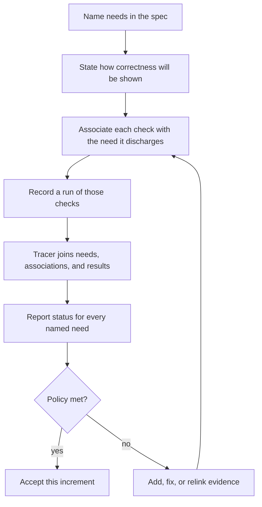
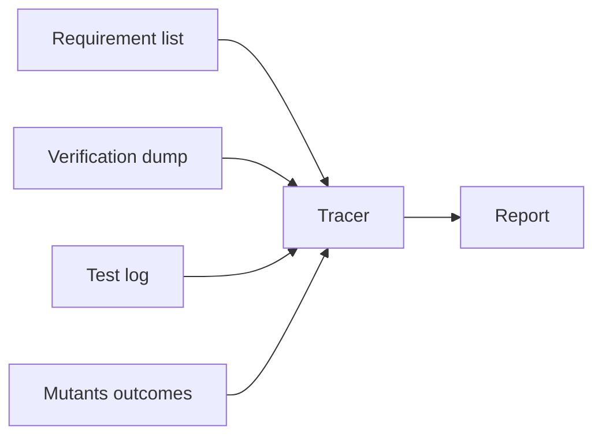

# Requirement Traceability (Design Document)


---

### 1. Introduction

A requirement tracer answers whether a named need is verified from the last
recorded evidence. The specification names what must be true. Associated checks
supply evidence. The tracer joins those stores and reports status. It does not
write that answer into the specification. Paths, pass/fail, and verified stamps
in markdown are a second, stale store of the same facts.

Verification asks whether the product was built to its stated requirements.
Validation asks whether it serves its intended purpose in its intended
environment. Tracing is strongest for verification. A demonstration, example,
or external-use check still has to be associated, run, and recorded if it
discharges a named need.

Primary usage scenarios:

- Review whether a named need is verified, and which fully qualified checks
  last ran against it.
- Add a need and see it stay unverified until a check is associated and a
  passing record exists.
- Rename or delete a check and see every need whose association still points
  at the old path.
- Find checks that discharge no named need.
- Treat a green run as unverified when attributed mutants survive or time out.
- Gate a merge on computed status and a stated exit policy, not on a table
  copied into a design document.

The checker consumes recorded artifacts. It executes no tests, builds nothing,
and writes nothing into a design document. In this repository the requirement
list is scanned from design-doc §2; another tree can feed the same records as
JSON.

---

### 2. Requirements

#### 2.1 Functional Requirements

- **FR-1 — The report names fully qualified paths**: Each verification dump
  record appears in the report with its fully qualified test path and whether
  that path occurred in the recorded log. A report that lists only function
  names cannot be matched against a test log after a rename.
- **FR-3 — Undeclared dump identifiers are reported**: A requirement ID or
  title in the dump that the requirement list does not declare is reported. A
  dump title that disagrees with the declared title is reported.
- **FR-4 — Tests that discharge no requirement are reported**: A `#[test]`
  function with no dump record is reported. An unassociated test is either an
  undocumented requirement or an unnecessary test.
- **FR-5 — Status is derived from recorded results**: The status of a
  requirement is computed from the dump, the test log, and mutation outcomes.
  Markdown does not supply status.
- **FR-7 — The record covers every scored requirement and every dump path**:
  Each run records an entry for every FR and NFR in the requirement list and
  for every dump path, carrying the global identifier, title, associated paths,
  last-run outcome per path, attributed missed mutants, and the resulting
  status. A record of defects alone answers what is broken but not what is
  verified.
- **FR-8 — Two renderings of one computation**: Each run emits the record
  twice, once in a machine-readable form for other tools and once in a
  human-readable form for review, both derived from a single pass so the two
  cannot disagree.
- **FR-9 — The result is expressed as an exit status under a stated policy**:
  The run reports an overall result, and a configured policy decides whether
  that result fails the invoking process.
- **FR-10 — Unverified status names a reason**: Every Unverified entry carries
  a reason from a closed set. A status with no reason cannot be acted on.
- **FR-11 — Withdrawn needs are not gate failures**: An identifier listed as
  withdrawn is reported as withdrawn. It is not scored Unverified and does not
  fail the invoking process.

#### 2.2 Non-Functional Requirements

- **NFR-1 — A full run fits the gate budget**: A run over this repository's
  design documents, dump directory, last test log, and mutation outcomes
  completes in seconds, not minutes. A check slower than the gates it joins
  will be skipped, and the existing gate sequence already runs for roughly
  ninety seconds.
- **NFR-2 — No dependence on an unstable result format**: The check reads
  result artifacts whose format is stable. Experimental machine-readable test
  output is not an input.
- **NFR-3 — The report is deterministic**: Two runs over identical inputs
  produce identical records. Determinism is a property of the record content,
  not of the path it is written to.

#### 2.3 Constraints

- **C-1 — Status is never authored in a design document**: No computed status
  is written into a design document, and no status value read from one is
  trusted.
- **C-2 — Mutation adequacy is in scope; coverage pairing is not**: A
  requirement whose associated tests passed is still Unverified with reason
  insufficient when an attributed mutant is missed or timed out. Line-coverage
  pairing is not adopted.
- **C-3 — The tool's grammar is its inputs, not a document schema**: The
  checker implements the dump schema, the requirement-record scan, the libtest
  log line, and the per-mutant outcomes object. It does not implement a
  design-document subsection layout or an evidence-locator grammar. Input
  paths and the requirement-scan pattern are configuration so another tree
  can reuse the binary.
- **C-4 — The check runs nothing**: It consumes recorded artifacts. It compiles
  no crate, executes no test, and spawns no target. A dump path that never
  appeared in the log is reported as not run rather than executed on demand.
- **C-5 — The report is an ephemeral CI artifact**: Both renderings go to
  standard output and to `target/`. They are not committed and are not written
  under `documentation/`. A copy checked into the tree would be a second store
  of status (C-1).
- **C-6 — The V&V plan is not an input**: Design-doc §6 states method, oracle,
  and bound. The tracer does not read those subsections. Intent is not a
  recorded result. The only §6 text consumed is withdrawn-ID lines in §6.3
  (FR-11).
- **C-7 — Named validation evidence is scored like any other check**: An
  example, demonstration, or external-use test that declares an association is
  folded the same way as a requirements-based test. The tracer does not
  classify verification versus validation.

---

### 3. Technical Overview

The checker is a host CLI (`cargo trace` in this workspace). It occupies the
join step of the V&V loop. Specify, plan, associate, and run happen outside
it. The V&V plan stays in the design document; the tracer never opens §6
(C-6).



Four recorded artifacts fold into one record:



**Requirement list.** Each record is a local ID (`FR-n`, `NFR-n`, `C-n`), a
title, a description, a slug, and an optional withdrawn flag. The global ID is
`<slug>-<local-id>` (`polynomial-FR-1`). This repository scans design-doc §2
bullets of the form `- **FR-n — Title**: description`. Slug is the topic in
`<slug>-design.md`. `C-n` records are parsed but not scored unless a dump
record names them. Withdrawn IDs are those listed in §6.3 of the same design
document; the scan of §6 is limited to withdrawn-ID lines so the rest of the
V&V plan is not an input (C-6). Another project may skip the scan and pass
the same records as JSON.

**Verification dump.** Each record associates a global req ID with a function
name and a fully qualified rustc test path. An optional title, if present,
must match the requirement list. The dump is produced at test-compile time by
`#[req_trace(req = "...")]` on a `#[test]` function. The attribute lives in
`control-rs-macros`; the macros design does not yet declare that FR.

**Test log.** Libtest lines `test <path> ... ok` and `test <path> ... FAILED`.
Experimental JSON test output is not used (NFR-2).

**Mutants.** Per-mutant objects in `cargo-mutants` `outcomes.json`: source
file, function, summary (`caught` / `missed` / `timeout` / `unviable`).

The report lists every scored requirement as Verified, Unverified, or
Withdrawn, the fully qualified paths from the dump, each path's last-run
outcome, unverified reasons, and orphans.

---

### 4. Architecture

An established tracer computes coverage from covering artifacts rather than
from an author-asserted stamp, and treats an item as covered when each
required covering type exists (OpenFastTrace, 2026a). A comparable Rust
tracer treats an annotation alone as insufficient for verified status
(Hatzl, 2026a). This checker follows that split: association is a dump
record; verified status additionally requires a passing log and mutation
adequacy. The processing pipeline is import, link, trace, report
(OpenFastTrace, 2026a). Comparable tools keep the computation off the
document build and import only the result (Sphinx-Test-Reports, 2026).

#### 4.1 Configuration

`trace.toml` names input locations. It is not a document schema. Clippy
discovers `clippy.toml` by walking parent directories from a starting path
(Clippy, 2026); this checker uses a single workspace-root file rather than a
walk.

```toml
[trace]
docs_dir = "documentation"          # markdown glob; omit if reqs_json is set
reqs_json = ""                      # optional explicit requirement list
dump_dir = "target/req-trace"
test_log = "target/ci/test.log"
mutants_json = "target/ci/mutants/outcomes.json"
out_dir = "target/ci"
strict = true                       # exit non-zero on Unverified FR/NFR
```

The requirement-scan regex is configuration with a default that matches
`**FR-n — Title**:`, `**NFR-n — Title**:`, and `**C-n — Title**:`. The
withdrawn-ID scan matches §6.3 lines that name an `FR-n` or `NFR-n` as
withdrawn. A caller that already has JSON omits `docs_dir`.

#### 4.2 Dump schema

One JSON object per annotated test, written by the proc-macro crate (host)
to `dump_dir/<span-hash>.json` so parallel rustc does not clobber files:

```json
{
  "req": "polynomial-FR-1",
  "title": "Horner evaluation",
  "function": "test_horner_backward_error",
  "test_path": "polynomial::tests::polynomial_tests::test_horner_backward_error"
}
```

`title` is optional. Emitted test code is a passthrough of `#[test]`. CI wipes
`dump_dir` before the test compile so deleted tests cannot linger. The tracer
only reads the directory.

`#[req_trace]` is specified here; implementing it is a follow-on to the
Approved macros design. Requirement traces in comparable Rust tooling are
created with an attribute macro on a function (Hatzl, 2026b).

#### 4.3 Matching

A dump `test_path` matches a log line when the log path equals `test_path` or
ends with `::` plus the dump `function`. Title is not part of the matcher.

Libtest JSON is experimental, opt-in, and may change to track upstream
(cargo-nextest, 2026); the existing JSON format is underspecified (Rust
Project Developers, 2026). The log parser reads the stable libtest text
lines.

#### 4.4 Status

Scored items are FR and NFR that are not withdrawn. Fold, never written into
a document (C-1). A comparable report includes status for each specification
item, not only for defects (OpenFastTrace, 2026b).

A need is Verified only when all of the following hold:

- It is on the requirement list and not withdrawn.
- At least one dump path is associated with it.
- Every associated path appeared in the last recorded log as `ok`.
- No attributed mutant is `missed` or `timeout`.

Otherwise the need is Unverified, with exactly one reason (FR-10):

| Reason | When |
|:-------|:-----|
| `no tests` | No dump record names the identifier. |
| `not run` | At least one associated path is absent from the log. |
| `failed` | At least one associated path is `FAILED` in the log. |
| `undeclared` | A dump record names an identifier or title the list does not declare (FR-3). Reported on the dump path, not as a scored-list Verified. |
| `insufficient` | Every associated path is `ok` and at least one missed or timeout mutant is attributed. |

If several reasons apply, the report uses this precedence: `undeclared`,
`failed`, `not run`, `no tests`, `insufficient`. A green run that would still
pass if the implementation were broken is not verification.

`insufficient` attribution: a mutant's source file belongs to the same Cargo
crate as a dump test associated with that requirement. Unviable mutants are
ignored. Mutation outcomes come from `outcomes.json` (cargo-mutants, 2026).
`C-n` appears in the report only when a dump record names it. Withdrawn IDs
are listed as Withdrawn and are omitted from the Unverified tally (FR-11).

Orphans (FR-4) are listed separately: `#[test]` functions under configured
scan directories with no dump record. An established tracer reports an
orphaned outgoing coverage link when there is no matching coverage requester
(OpenFastTrace, 2026b). Coverage percentage does not discharge a named need.

#### 4.5 Renderings

One pass builds the record. The machine rendering is JSON; the human
rendering is Markdown. Both contain the same per-requirement fields: global
ID, title, status, unverified reason or withdrawn flag, dump paths with log
outcome, attributed missed mutants. Both are written under `out_dir` and the
human rendering is also streamed to standard output. Neither is committed.

An established plain-text report summary carries overall result status and
defect counts beside per-item detail (OpenFastTrace, 2026b). A comparable
tool emits JSON used to generate the human report from the same collected
data (Hatzl, 2026a).

#### 4.6 Gate policy

`strict = true` exits non-zero when any scored FR or NFR is Unverified, when
any dump identifier is undeclared, or when the process cannot read a
configured input. `strict = false` always exits zero after a successful
fold (report-only). Orphans are listed in both modes; they do not fail the
process in this revision. The return value of an established tracer
executable reflects the overall tracing result (OpenFastTrace, 2026b). Vale
sets a non-zero exit only for errors, not for warnings or suggestions
(Vale, 2026); this check uses a single boolean policy rather than per-finding
severity.

#### 4.7 Packaging

The CLI remains a workspace binary invoked as `cargo trace`. Nothing in the
fold is specific to seven-part §6 tables, locator schemes, or this
repository's method catalogue.

---

### 5. Alternatives

- **Markdown locators as the association.** A specification-item Covers tag
  (OpenFastTrace, 2026a) or a §6.4 `test:path::fn` cell keeps paths in the
  document. Paths go stale on rename, and the document becomes the evidence
  store this check exists to replace.
- **`/// Trace:` comments as the association.** Doc comments are greppable
  but do not emit a fully qualified rustc path, so matching the test log
  requires a second source scan. An attribute on the test function records
  the path at compile time (Hatzl, 2026b).
- **Linker-section inventory (`linkme` / `inventory`).** Avoids a dump
  directory but adds a dependency and still needs a collector. Unique JSON
  files under `target/req-trace/` keep the tracer a pure reader.
- **Libtest JSON.** Ruled out by NFR-2 (cargo-nextest, 2026; Rust Project
  Developers, 2026).
- **Line-coverage pairing for adequacy.** Available in comparable tools
  (Hatzl, 2026a). Mutation outcomes reuse an existing gate artifact and do
  not require a coverage map per test.
- **Doorstop fingerprints for stale links.** A stored hash per link detects
  that a resolved artifact later changed (Doorstop, 2026). Not adopted; a
  rename is caught because the dump path disappears from the log.
- **Hierarchical state propagation.** A child failed or unverified state can
  be defined to affect its parent (Hatzl, 2026a). This crate's requirement
  lists are flat per design document; parent/child scoring is not adopted.
- **Document-structure linting.** Heading-structure rules and
  requirements-smell catalogues exist (markdownlint, 2026b; Femmer et al.,
  2016). Those jobs constrain prose and section layout. This checker joins
  recorded evidence; it is not a design-document linter (C-3).

---

### 6. Verification & Validation

#### 6.1 Approach

Requirements-based tests over a fixture corpus: one requirement list and dump
set per defect class (undeclared dump ID, title mismatch, missing dump
record, failed log line, missed mutant, orphan test, withdrawn ID, stacked
unverified reasons), with the expected findings stated in the fixture.
Property-based tests over generated requirement bullets, dump objects, and
log lines for parse totality and determinism. Recorded-result fixtures for
status assignment (passing, failing, absent, insufficient, withdrawn).
Back-to-back comparison against an independent checker over the live corpus.
Resource-usage measurement of a full-corpus run. Inspection of this document
against C-1, C-4, and C-6 (no write into `documentation/`, no subprocess
spawn, no read of §6 method or acceptance text). Coverage of the trace
module's content, not of `Display` layout or CLI argument parsing.

A live run lists every FR and NFR from the corpus with status, reason, and
fully qualified dump paths, without opening a design document's V&V plan.
Known-defect reproduction targets the September 10, 2026 `math/**` grounding
review as unverified requirements (no dump, or dump paths absent from the
log), not as unresolved locators.

#### 6.2 Acceptance

| Claim | Oracle | Measure | Bound |
|:------|:-------|:--------|:------|
| Defect detection on the fixture corpus | Expected finding set stated in each fixture | Set comparison of (global ID, finding) triples | Exact equality |
| Agreement with the independent implementation | Independent checker over the same inputs | Set comparison of findings and per-category counts | Exact equality |
| Status assignment | Recorded dump, log, and mutants fixtures | Status and unverified reason per requirement | Exact equality |
| Reason precedence | Fixtures that stack two or more applicable reasons | Reported reason | Exact equality with the §4.4 order |
| Parser totality | Generated bullets, dump objects, and log lines, including malformed ones | Process outcome | Zero panics; every rejected input yields a named finding |
| Record completeness | FR/NFR identifiers from the requirement list and every dump path | Set comparison against both renderings | Exact equality |
| Cross-rendering agreement | The machine-readable rendering of the same run | Per-requirement status, reason, and paths read back from the human rendering | Exact equality |
| Withdrawn scoring | Fixture list with a withdrawn FR that has no dump | Status and exit status under `strict` | Status `Withdrawn`; process exit 0 |
| Output location | Filesystem state after a run | Paths of both renderings | Under `target/` or stdout; nothing written under `documentation/` |
| Determinism | Two runs over unchanged inputs | Byte comparison of the machine-readable rendering, path excluded | Exact equality |
| Full-corpus run cost | Wall-clock, single-threaded, warm filesystem | Seconds | Under 5 s, against an existing gate sequence of roughly 90 s |
| Gate policy | Fixture corpus with a known defect, run under each policy | Exit status | Report-only exits 0; failing policy exits non-zero |

#### 6.3 Limits

- **Withdrawn FR-2**: Accounting by a §6.4 or §6.7 table is not a requirement.
  The dump and the report are the account.
- **Withdrawn FR-6**: Agreement between a catalogue method column and a
  locator cell is not a requirement.
- **Stale behavior behind a stable path**: a dump path that still appears in
  the log after the test body changes is reported from the log outcome. A
  fingerprint per link (Doorstop, 2026) is not part of this design.
- **On-target execution**: the checker is host tooling and is not linked into
  a target binary.
- **Requirement quality**: nothing here establishes that a requirement is
  well-formed, testable, or correctly classified. Automated smell detection
  is a different job and is imprecise (Femmer et al., 2016).
- **ETS tests**: `#[req_trace]` is specified for host `#[test]` functions.
  ETS suite association is not in this revision.
- **`#[req_trace]` itself**: the attribute contract is specified here; the
  macros crate does not yet declare or implement it. Dump-dependent findings
  stay unverified until that lands.
- **Line-coverage pairing**: not adopted (C-2).
- **Orphan gate**: orphans are reported (FR-4) and do not fail `strict`
  in this revision.
- **Mutants schema drift**: the mutants-out directory format is subject to
  change (cargo-mutants, 2026). The checker pins the fields it reads;
  a format break is a parse finding, not a silent skip.

---

### 7. Performance & Resource Considerations

A full-corpus run is a scan of markdown §2, a narrow withdrawn-ID scan of
§6.3, a directory of small JSON objects, a test log, and one `outcomes.json`.
It is I/O bound. The 5 s bound in 6.2 is a host wall-clock cap, not a
target-side budget. The checker allocates; it is not `no_std`.

---

### 8. Risks & Open Questions

- **Macros-design FR**: `#[req_trace]` is specified here and must be added to
  the Approved macros design before implementation.
- **Oracle placement**: the independent checker named in 6.2 is not a
  numerical oracle. Whether it lives under `examples/` per the host oracle
  harness contract is unset.
- **Crate mapping for mutants**: attributing a mutant to a requirement by
  Cargo crate is coarse when one crate holds many design slugs. A tighter
  file-level map is not specified.
- **Withdrawn-ID scan**: §6.3 wording is not a schema. A withdrawn ID that
  is only mentioned in running prose, or an FR still listed in §2 after
  withdrawal, can be mis-scored until `reqs_json` carries an explicit flag.
- **Femmer et al. (2016) journal pagination**: volume and page numbers of
  the Journal of Systems and Software version were not captured in the
  research bibliography; the cite uses the preprint URL.

---

### 9. Development Plan

| Task | Description | Effort (1-10) |
|:-----|:------------|:--------------|
| Dump attribute | `#[req_trace]` in `control-rs-macros`; unique JSON files under `target/req-trace/` | 4 |
| Fold | Join dump, §2 list, withdrawn-ID lines, log, and per-mutant outcomes; apply §4.4 status and reason precedence | 6 |
| Report | JSON and Markdown renderings under `target/ci`; stdout; Verified / Unverified / Withdrawn; exit policy | 3 |
| Fixtures | Defect-class fixtures for FR-1, FR-3, FR-4, FR-5, FR-7, FR-8, FR-9, FR-10, FR-11 | 5 |
| Corpus wiring | Wipe dump dir in CI; point `trace.toml` at the four inputs | 2 |

---

### 10. Revision History

| Revision | Date | Author | Description |
|:---------|:-----|:-------|:------------|
| 1.0 | September 11, 2026 | @MitchellDScott | Initial draft covering §1, §2 and §6 only. |
| 1.1 | September 11, 2026 | @MitchellDScott | Output specification: FR-7 record completeness, FR-8 two renderings, FR-9 exit status, C-5 temporary outputs. |
| 1.2 | September 13, 2026 | @MitchellDScott | Standalone `cargo trace` packaging. |
| 1.3 | September 15, 2026 | @MitchellDScott | Shortened FR-1..FR-5 to need plus bound. |
| 1.4 | September 16, 2026 | @MitchellDScott | Portable four-input checker; report owns status and fully qualified paths; withdrew FR-2 and FR-6; rewrote C-2, C-3, C-5; completed §3–§5, §7, §9. |
| 1.5 | September 16, 2026 | @MitchellDScott | V&V-loop framing; added FR-10, FR-11, C-6, C-7; closed unverified-reason set and withdrawn scoring; tracer does not read the V&V plan. |

---

## References

[1] OpenFastTrace, "doc/user_guide.md," in *itsallcode/openfasttrace
repository*. [Online]. Available:
https://github.com/itsallcode/openfasttrace/blob/main/doc/user_guide.md.
Accessed: Sep. 11, 2026.

[2] M. Hatzl, "README.md," in *mhatzl/mantra repository*. [Online]. Available:
https://github.com/mhatzl/mantra. Accessed: Sep. 11, 2026.

[3] Sphinx-Test-Reports, "Command line interface," *sphinx-test-reports
documentation*. [Online]. Available:
https://sphinx-test-reports.readthedocs.io/en/latest/cli.html. Accessed:
Sep. 16, 2026.

[4] Clippy, "Configuration," *The Clippy Book*. [Online]. Available:
https://doc.rust-lang.org/clippy/configuration.html. Accessed: Sep. 16, 2026.

[5] M. Hatzl, *mantra-rust-macros* (Version 0.7.8). [Online]. Available:
https://docs.rs/crate/mantra-rust-macros/latest. Accessed: Sep. 11, 2026.

[6] cargo-nextest, "Libtest JSON output," *cargo-nextest documentation*.
[Online]. Available: https://nexte.st/docs/machine-readable/libtest-json/.
Accessed: Sep. 11, 2026.

[7] The Rust Project Developers, "3558-libtest-json," *The Rust RFC Book*.
[Online]. Available:
https://rust-lang.github.io/rfcs/3558-libtest-json.html. Accessed:
Sep. 11, 2026.

[8] OpenFastTrace, "doc/spec/system_requirements.md," in
*itsallcode/openfasttrace repository*. [Online]. Available:
https://github.com/itsallcode/openfasttrace/blob/main/doc/spec/system_requirements.md.
Accessed: Sep. 11, 2026.

[9] cargo-mutants, "The mutants.out directory," *cargo-mutants documentation*.
[Online]. Available: https://mutants.rs/mutants-out.html. Accessed:
Sep. 16, 2026.

[10] Vale, "Styles," *Vale documentation*. [Online]. Available:
https://docs.vale.sh/topics/styles. Accessed: Sep. 16, 2026.

[11] Doorstop, "Validating Requirements," *Doorstop documentation*. [Online].
Available: https://doorstop.readthedocs.io/en/latest/cli/validation.html.
Accessed: Sep. 11, 2026.

[12] markdownlint, "doc/md043.md," in *DavidAnson/markdownlint repository*.
[Online]. Available:
https://github.com/DavidAnson/markdownlint/blob/main/doc/md043.md.
Accessed: Sep. 16, 2026.

[13] H. Femmer, D. Méndez Fernández, S. Wagner, and S. Eder, "Rapid quality
assurance with Requirements Smells," *Journal of Systems and Software*,
2016, doi: 10.1016/j.jss.2016.02.047. [Online]. Available:
https://arxiv.org/abs/1611.08847.
