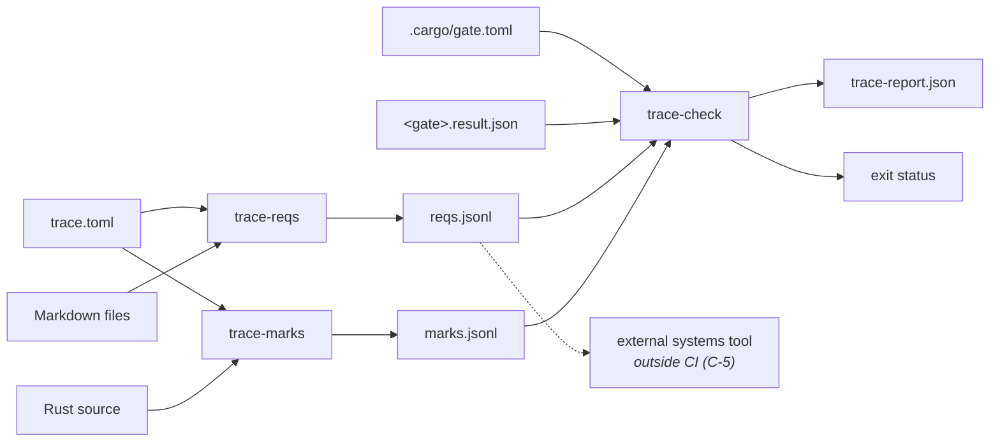

# Requirement Traceability Infrastructure (Design Document)


---

## Introduction

Requirements in `control-rs` are written first, in the Requirements section of
each design document, and the design follows from them. This document
specifies the tooling that checks every requirement is planned for verification
and has an acceptance criterion, and links it to the gate results that verify
it.

The tooling rests on two concepts. A **definition** is the one line where a
requirement ID is introduced. A **reference** is any other line that names the
ID for a stated purpose, such as a verification-plan row or an acceptance row.
Three small binaries in `control-rs-ci` handle one step each:

- `trace-reqs` finds definitions and references in Markdown, checks them and
  writes `reqs.jsonl`;
- `trace-marks` finds requirement markers in Rust source and writes
  `marks.jsonl`;
- `trace-check` joins both with gate results and writes `trace-report.json` and
  a gate verdict.

**Concept of operations**

| Actor                     | Action                                                                          | Touches                                           |
|:--------------------------|:--------------------------------------------------------------------------------|:--------------------------------------------------|
| Author                    | Writes requirements and their verification first, then the architecture         | One Markdown file, in any editor                  |
| Reviewer                  | Reads requirements and verification in a pull request                           | Rendered Markdown on GitHub                       |
| Linter (local or CI)      | Reports missing, duplicate or unresolved requirements with `path:line: message` | The same Markdown file                            |
| Tracer (CI)               | Links requirements to gate evidence and test markers                            | `reqs.jsonl`, `marks.jsonl`, `<gate>.result.json` |
| Systems engineer (future) | Builds hierarchies, allocations and verification matrices                       | External tools that read the `.jsonl` files       |

Three principles follow from the table:

1. **Plain text is the source of truth.** A requirement is readable and
   writable without any tool.
2. **The linter is the only tool an author needs.** Editor support comes from
   `path:line: message` diagnostics, which every editor already consumes from a
   terminal, a run configuration or a problem matcher. No plugin, schema,
   snippet or language server is part of the design.
3. **Everything beyond lint and trace is optional and external.** Systems-level
   features consume the generated `.jsonl` files and never enter the CI path of
   this workspace.

**Two audiences.** `control-rs` always follows
`documentation/design-template.md`, and its configuration encodes that
template. External users of `control-rs-ci` describe their own layout with the
same few patterns (see [Configuration](#configuration)).

**Scope.** In scope: definitions, references, markers, the checks over them,
status derivation and the three artifacts. Out of scope: test adequacy (the
tracer shows that linked evidence exists and passed, not that it is
sufficient); requirement hierarchies; citation, reference and general document
style, which an external, unpublished review tool owns; requirement editing
tools; and any systems-engineering view.

---

## Requirements

### Functional Requirements

- **FR-1 — Definitions**: `trace-reqs` shall record one definition for the
  first requirement ID on each line that matches the `definition` pattern,
  with the definition text formed per [Matching Rules](#matching-rules).
- **FR-2 — References**: `trace-reqs` shall record one reference of kind `K`
  for every requirement ID on each line that matches the reference pattern
  named `K`.
- **FR-3 — Qualified IDs**: `trace-reqs` shall qualify every recorded ID as
  `<doc>#<id>` per [Matching Rules](#matching-rules), so that equal IDs in
  different documents never collide.
- **FR-4 — Checks**: `trace-reqs` shall report as a defect each ID defined
  more than once, each reference to an undefined ID, each defined ID that lacks
  a reference of any configured kind and each retired ID that is defined or
  referenced.
- **FR-5 — Phrase Rules**: `trace-reqs` shall report as a defect definition
  text that matches an `exclude_phrases` pattern or matches none of the
  `require_phrases` patterns.
- **FR-6 — Requirement Rows**: `trace-reqs` shall write `reqs.jsonl` with one
  row per definition and per reference, in the row schema of
  [Artifacts](#artifacts).
- **FR-7 — Marker Rows**: `trace-marks` shall write `marks.jsonl` with one row
  of kind `marker` for every qualified ID on each marker line of
  [Source Markers](#source-markers).
- **FR-8 — Trace Verdict**: `trace-check` shall derive each requirement status
  per [Status Derivation](#status-derivation), write `trace-report.json` and
  exit 0 iff no requirement is `Failed` or `Unverified` and every marker
  resolves to a definition.
- **FR-9 — Diagnostic Format**: `trace-reqs` and `trace-check` shall report
  each defect as one `path:line: message` line and shall exit non-zero when any
  defect exists.

### Non-Functional Requirements

- **NFR-1 — Audit Latency**: Each of the three binaries shall complete on the
  `control-rs` workspace in under 1 s of wall-clock time, excluding compilation.
- **NFR-2 — Zero Runtime Intrusion**: Markers shall be comments, so that no
  marker changes compiled output for any target.
- **NFR-3 — Dependency Budget**: The three binaries shall add no dependency to
  `control-rs-ci` beyond its current set and the `regex` crate.
- **NFR-4 — Schema Versioning**: Every row and `trace-report.json` shall carry
  an integer `schema` field, incremented on every incompatible change.

### Constraints

- **C-1 — Plain-Text Source**: Requirements and their verification shall live in
  the Markdown files the configuration lists; no generated file shall be
  committed or required for reading or writing a requirement.
- **C-2 — No Editor Integration**: The design shall deliver diagnostics only; it
  shall ship no editor plugin, schema, snippet or language server.
- **C-3 — Paths from Configuration**: Every input and output path shall arrive
  from a command-line argument or the configuration file, in line with
  `ci-design.md` C-9.
- **C-4 — Read-Only Evidence**: The tracer shall run no test, build or gate; it
  shall read recorded artifacts only.
- **C-5 — External Systems Tooling**: Hierarchy views, allocation, verification
  matrices and model export shall consume the `.jsonl` files outside this
  workspace's CI path.
- **C-6 — Artifact Location**: All three binaries shall write under
  `target/ci-artifacts/` when run as gates.
- **C-7 — Document Style Exclusion**: `trace-reqs` shall check no citation,
  reference or general document style.

---

## Technical Overview

### Author Workflow

1. **Define the requirement** in the Requirements section:

   ```markdown
   - **FR-3 — Packed Storage**: Packed symmetric, Hermitian and triangular storage
     shall return `None` from `value(i, j)` when `i` or `j` is out of bounds.
   ```

2. **Plan its verification** with a row in the Plan table. The `Gate` cell names
   the gate whose result is the evidence:

   ```markdown
   | Requirements | Kind   | Gate   | Step                                   |
   |:-------------|:-------|:-------|:---------------------------------------|
   | FR-3         | `test` | `test` | Sweep (i, j) over [0, N]² for SP/HP/TP |
   ```

3. **State its acceptance** with a row in the Acceptance table:

   ```markdown
   | Requirements | Claim                 | Oracle      | Measure      | Bound              |
   |:-------------|:----------------------|:------------|:-------------|:-------------------|
   | FR-3         | Out-of-bounds is None | Index sweep | `None` count | iff i = N or j = N |
   ```

4. **Mark the test** that verifies it, optionally, so the link survives in
   code:

   ```rust
   // req: storage#FR-3
   #[test]
   fn packed_value_out_of_bounds_is_none() { /* ... */ }
   ```

5. **Run `cargo trace-reqs`.** Each problem prints as `path:line: message`,
   which the editor turns into a clickable link:

   ```text
   documentation/math/storage-design.md:42: storage#FR-3 has no acceptance reference
   ```

To withdraw a requirement, delete its definition and add its qualified ID to
`retired` in the configuration. The ID is never reused.

### Reading the Output

Every line of `reqs.jsonl` and `marks.jsonl` is one occurrence of one ID, with
the same six fields:

```json lines
{
  "schema": 1,
  "id": "storage#FR-3",
  "kind": "definition",
  "file": "documentation/math/storage-design.md",
  "line": 42,
  "text": "- **FR-3 — Packed Storage**: Packed symmetric ... out of bounds."
}
{
  "schema": 1,
  "id": "storage#FR-3",
  "kind": "plan",
  "file": "documentation/math/storage-design.md",
  "line": 210,
  "text": "| FR-3 | `test` | `test` | Sweep (i, j) over [0, N]² for SP/HP/TP |"
}
{
  "schema": 1,
  "id": "storage#FR-3",
  "kind": "acceptance",
  "file": "documentation/math/storage-design.md",
  "line": 218,
  "text": "| FR-3 | Out-of-bounds is None | Index sweep | `None` count | iff i = N or j = N |"
}
{
  "schema": 1,
  "id": "storage#FR-3",
  "kind": "marker",
  "file": "src/math/storage/tests.rs",
  "line": 118,
  "text": "// req: storage#FR-3"
}
```

Grouping rows by `id` gives everything known about a requirement; filtering by
`kind` gives every plan row, every acceptance row or every marker. No field
depends on configuration to be understood.

### Data Flow


```mermaid
flowchart LR
    Cfg["trace.toml"] --> TR
    Docs["Markdown files"] --> TR["trace-reqs"]
    TR --> RJ["reqs.jsonl"]
    Cfg --> TM
    Src["Rust source"] --> TM["trace-marks"]
    TM --> MJ["marks.jsonl"]
    Gates[".cargo/gate.toml"] --> TC
    Res["&lt;gate&gt;.result.json"] --> TC["trace-check"]
    RJ --> TC
    MJ --> TC
    TC --> Rep["trace-report.json"]
    TC --> Exit["exit status"]
    RJ -.-> Ext["external systems tool<br/><i>outside CI (C-5)</i>"]
```

**Where requirements live.** Requirements stay in the design documents.
Measured on 2026-09-26, the corpus holds 268 requirements in 23
`*-design.md` files, 244 of them in 20 Approved documents. Keeping them in place
needs no migration, keeps each requirement next to its rationale and renders on
GitHub. The `-design.md` suffix already serves as a file-type pattern for editor
rules (`files.associations` in VS Code, file-type patterns in JetBrains IDEs).

---

## Architecture

### Configuration

`trace-reqs` and `trace-marks` read one TOML file named by `--config`. The
`control-rs` configuration:

```toml
id = '(?:FR|NFR|C)-[0-9]+[a-z]?'
files = ["documentation/vv/requirement-traceability-design.md"]
doc_suffix = "-design"
definition = '^- \*\*(?:FR|NFR|C)-'
retired = []
require_phrases = []
exclude_phrases = []

[references]
plan = '^\|[^|]+\| `[a-z-]+` +\|'
acceptance = '^\|(?:[^|]*\|){5}$'
```

| Key               | Meaning                                                                                                        |
|:------------------|:---------------------------------------------------------------------------------------------------------------|
| `id`              | Regex for one requirement ID                                                                                   |
| `files`           | Globs of the Markdown files to read                                                                            |
| `doc_suffix`      | Text removed from the file stem to form the document name; optional                                            |
| `definition`      | Regex for a line that defines a requirement                                                                    |
| `references`      | Named regexes; each names one kind of reference, and every defined requirement needs at least one of each kind |
| `retired`         | Qualified IDs that must not be defined or referenced again                                                     |
| `require_phrases` | Regexes; definition text must match at least one; optional                                                     |
| `exclude_phrases` | Regexes; definition text must match none; optional                                                             |

In the template, a plan row has a backticked kind in its second cell and an
acceptance row has exactly five cells, which is all the two reference patterns
test. The Rust marker prefix is fixed (see [Source Markers](#source-markers)),
so `trace-marks` reads only `id` from the file.

### Matching Rules

The rules below are the whole parser:

1. Lines inside fenced code blocks, including indented fences, are skipped,
   so examples are inert.
2. An ID occurrence is a match of `id`, optionally preceded by `<doc>#`.
3. A line that matches `definition` defines the first ID on it. Its text is the
   line plus the indented lines that follow it.
4. A line that matches a reference pattern references every ID on it. A line
   may match several patterns and then yields one reference per pattern.
5. The document name is the file stem with `doc_suffix` removed:
   `storage-design.md` becomes `storage`. An ID written without `<doc>#` belongs
   to the document it appears in.
6. Phrase rules run on definition text with backtick spans removed, so
   identifiers never match.

### Checks

| Check            | Defect                                                                             |
|:-----------------|:-----------------------------------------------------------------------------------|
| `duplicate`      | An ID is defined more than once                                                    |
| `unresolved`     | A reference names an ID that is not defined                                        |
| `missing`        | A defined ID has no reference of a configured kind; the message names the kind     |
| `retired`        | A retired ID is defined or referenced                                              |
| `require-phrase` | Definition text matches no `require_phrases` pattern                               |
| `exclude-phrase` | Definition text matches an `exclude_phrases` pattern; the message quotes the match |

The phrase checks follow the lexical-smell approach of Femmer et al. [6] and the
requirement-statement guidance of ISO/IEC/IEEE 29148 [7]; the patterns are the
project's choice.

### Source Markers

A marker is a Rust line comment that begins `// req: ` and names qualified IDs:

```rust
// req: storage#FR-3, storage#FR-4
```

`trace-marks` writes one `marker` row per ID. `///` doc comments are not
markers, so rustdoc output is unaffected. Markers are optional. They are the
mechanism for tracing mutation-gate repairs: a test added to kill a mutant
carries the marker of the requirement it protects.

### Status Derivation

A requirement's **gates** are the gate names from `gate.toml` that appear in
backticks on any of its reference rows. Evidence is gate-level: a gate that
passes has passed every test it ran. `trace-check` reads each
`<gate>.result.json` `verdict` (`pass`, `warn`, `fail`, `skipped`) as defined in
`ci-design.md`.

| Condition (first match wins)                       | Status       | Fails gate |
|:---------------------------------------------------|:-------------|:-----------|
| Any gate verdict is `fail`                         | `Failed`     | yes        |
| Any gate has no result, or verdict `skipped`       | `Unverified` | yes        |
| At least one gate, and every gate `pass` or `warn` | `Verified`   | no         |
| No gate named                                      | `Unchecked`  | no         |

A `marker` row whose ID has no definition row fails the gate.
`trace-report.json` holds `schema`, a count per status, one entry per
requirement (ID, status, gate verdicts) and the unresolved markers.

### Artifacts

| Field    | Meaning                                                         |
|:---------|:----------------------------------------------------------------|
| `schema` | Row format version (NFR-4)                                      |
| `id`     | Qualified ID, `<doc>#<id>`                                      |
| `kind`   | `definition`, a reference kind from `[references]`, or `marker` |
| `file`   | Path relative to the working directory                          |
| `line`   | 1-based line number                                             |
| `text`   | The matched line; for a definition, its full text               |

Rows are sorted by `file`, then `line`. Examples are in
[Reading the Output](#reading-the-output).

### Invocation and Gate Wiring

| Binary        | Placement                            | Arguments                                                                                                               |
|:--------------|:-------------------------------------|:------------------------------------------------------------------------------------------------------------------------|
| `trace-reqs`  | `lint` group                         | `--config .cargo/trace/trace.toml --out target/ci-artifacts/reqs.jsonl`                                                 |
| `trace-marks` | `lint` group                         | `--config .cargo/trace/trace.toml --src <glob> --out target/ci-artifacts/marks.jsonl`                                   |
| `trace-check` | After all gates, like `cargo report` | `--reqs … --marks … --gates .cargo/gate.toml --results target/ci-artifacts --out target/ci-artifacts/trace-report.json` |

### Adoption

Existing plan and acceptance tables carry no Requirements column, so every
existing requirement would report two `missing` defects. `files` is therefore
the adoption mechanism: it lists documents one by one as each is migrated and
becomes a single glob when the last one is done. A document outside `files` is
not checked at all; a document inside it is checked in full.

---

## Alternatives

| Alternative                                                                       | Rejected Because                                                                                                                                                                                                         | Reference |
|:----------------------------------------------------------------------------------|:-------------------------------------------------------------------------------------------------------------------------------------------------------------------------------------------------------------------------|:----------|
| **Named captures, requirement blocks and link attachment** (rev 1.3, 1.4)         | Meaning hid in capture-group names and position-dependent parsing state; `reqs.jsonl` mirrored parser internals and could not be read without the configuration.                                                         | n/a       |
| **Fixed grammar with configured section, table and column names** (rev 1.2)       | Many keys with distinct semantics, still bound to headings and pipe tables.                                                                                                                                              | n/a       |
| **Adoption baseline file and previous-artifact ID check** (rev 1.1 to 1.4)        | Two baselines with different formats and a workflow restore step; listing migrated documents in `files` ratchets adoption with no new concept, and `retired` covers ID reuse.                                            | n/a       |
| **`Parent` and `Status` lines**                                                   | Hierarchy belongs to the external systems tool (C-5); retirement is covered by `retired`; draft requirements are expected to carry verification from the start.                                                          | n/a       |
| **Structured JSON requirement files with per-area schemas** (prototype `4f4b70b`) | Each step toward better editing (per-area schemas, snippets, IDE-specific workarounds) added machinery an author must understand before writing a requirement. Retained: never-reused IDs, a generated record for tools. | n/a       |
| **TOML requirement files**                                                        | Rejected on 2026-09-25 for the same editing cost, with worse multi-line text.                                                                                                                                            | n/a       |
| **Hand-written matcher instead of the `regex` crate**                             | Users would learn a bespoke pattern language; regular expressions are already known. The cost is one dependency (NFR-3).                                                                                                 | n/a       |
| **Requirement smells as a Vale style**                                            | Vale cannot scope rules to requirement text; the rules would fire on rationale prose. Vale remains the prose gate.                                                                                                       | n/a       |
| **Test-level verdicts from libtest JSON**                                         | The format is unstable and requires `-Z unstable-options`; gate-level verdicts are stable and already recorded.                                                                                                          | [8]       |
| **Editor plugins, schemas or a language server**                                  | Adds per-editor machinery; `path:line: message` works everywhere (C-2).                                                                                                                                                  | n/a       |
| **OpenFastTrace (Java)**                                                          | Adds a Java runtime to CI.                                                                                                                                                                                               | [1], [2]  |
| **StrictDoc (Python)**                                                            | Adds a Python toolchain and its own `.sdoc` grammar.                                                                                                                                                                     | [4]       |
| **mantra (Rust)**                                                                 | Relies on a database and line-coverage pairing rather than gate verdicts.                                                                                                                                                | [3]       |
| **Doorstop**                                                                      | One YAML file per requirement; loses requirements-beside-rationale.                                                                                                                                                      | [5]       |

---

## Verification & Validation

### Plan

| Requirements                                    | Kind         | Gate    | Step                                                                                                                                                                |
|:------------------------------------------------|:-------------|:--------|:--------------------------------------------------------------------------------------------------------------------------------------------------------------------|
| FR-1, FR-2, FR-3                                | `test`       | `test`  | Matching fixtures: fenced blocks, first-ID definitions, indented continuation, several IDs per reference line, lines matching two patterns, local and qualified IDs |
| FR-4, FR-9                                      | `test`       | `test`  | Check fixtures: one positive and one negative per check; diagnostic line format and exit status                                                                     |
| FR-5                                            | `test`       | `test`  | Phrase fixtures: backtick removal; empty lists disable each rule                                                                                                    |
| FR-6, FR-7, NFR-4                               | `test`       | `test`  | Row fixtures: field set, sort order, byte-identical reruns                                                                                                          |
| FR-8                                            | `test`       | `test`  | Status fixtures: one per Status Derivation row plus an unresolved marker                                                                                            |
| NFR-1                                           | `example`    | `trace` | Run all three binaries on the `control-rs` workspace                                                                                                                |
| NFR-2, NFR-3, C-1, C-2, C-3, C-4, C-5, C-6, C-7 | `inspection` |         | Review the implementation diff against each constraint                                                                                                              |

### Acceptance

| Requirements                                    | Claim                      | Oracle                          | Measure                             | Bound                                              |
|:------------------------------------------------|:---------------------------|:--------------------------------|:------------------------------------|:---------------------------------------------------|
| FR-1, FR-2, FR-3                                | **Matching exactness**     | Matching fixtures               | Rows vs expected                    | Exact match                                        |
| FR-4, FR-5                                      | **Check exactness**        | Check and phrase fixtures       | Defects vs expected                 | One defect per positive fixture, none per negative |
| FR-9                                            | **Diagnostic format**      | Fixtures                        | Lines matching `^[^:]+:[0-9]+: .+$` | 100 %; exit 0 iff no defect                        |
| FR-6, FR-7, NFR-4                               | **Row stability**          | Two runs on an unchanged corpus | Byte comparison; field set          | Identical; exactly the six Artifacts fields        |
| FR-8                                            | **Status derivation**      | Status fixtures                 | Status and exit status              | Exact match per row                                |
| NFR-1                                           | **Latency**                | Workspace run                   | Median wall-clock of 5 runs         | $< 1.0\,\text{s}$ per binary                       |
| NFR-2, NFR-3, C-1, C-2, C-3, C-4, C-5, C-6, C-7 | **Constraint conformance** | Review                          | Violations found                    | 0                                                  |

### Limits

- Evidence is gate-level. A marked test compiled out by `cfg` under the named
  gate still counts as passed; `trace-check` cannot observe it.
- Acceptance rows are not evaluated; their correctness is a review concern.
- A misspelled gate name is not a gate, so the requirement reads `Unchecked`
  rather than failing. The report lists `Unchecked` requirements for review.
- Every ID on a reference line counts, including one mentioned in the step
  text. Keeping IDs in the first cell avoids unintended references.
- A requirement deleted without being added to `retired` is not detected;
  review of the diff is the control.
- Phrase checks are lexical. They catch configured patterns, not ambiguity in
  general.

---

## Performance & Resource Considerations

- All three binaries are single-pass and line-oriented; each line is tested
  against a handful of compiled patterns. Cost is dominated by file I/O.
- Artifacts are small: roughly 800 rows once all 268 requirements carry a plan
  and an acceptance reference.

---

## Risks & Open Questions

- **Row-shape patterns.** The template's plan and acceptance rows are told
  apart by cell shape. A layout whose rows look alike needs distinguishing
  text; a line matching both yields a reference of each kind, which the
  `missing` check does not catch.
- **Migration effort.** Each of the 23 documents needs a Requirements column in
  its Plan and Acceptance tables before it joins `files`. Converting numbered
  headings (586) and `§n` cross-references (472) to the unnumbered template is
  separate editorial work that the tracer does not depend on.
- **Document renames.** Renaming a design document changes every qualified ID
  in it, which breaks markers and `retired` entries that name the old
  document. They are updated in the same pull request.

---

## Development Plan

| Phase / Task                  | Description                                                                                                                                                   | Estimated Effort |
|:------------------------------|:--------------------------------------------------------------------------------------------------------------------------------------------------------------|:-----------------|
| **Phase 1: `trace-reqs`**     | Configuration, matching rules, checks, `reqs.jsonl`. Remove the prototype's schema generation, `storage.req.json` and `.cargo/trace/requirement.schema.json`. | 2                |
| **Phase 2: `trace-marks`**    | Marker scan and `marks.jsonl`.                                                                                                                                | 1                |
| **Phase 3: `trace-check`**    | Gate lookup, status derivation and `trace-report.json`.                                                                                                       | 1                |
| **Phase 4: Gate wiring**      | `.cargo/trace/trace.toml`, `gate.toml` entries and Cargo aliases.                                                                                             | 1                |
| **Phase 5: Corpus migration** | Add the Requirements column to each document's verification tables and add the document to `files`. One pull request per area.                                | 3                |

---

## Revision History

| Revision | Date               | Author          | Description                                                                                                                                                                                                                                                                                                                                                                                                           |
|:---------|:-------------------|:----------------|:----------------------------------------------------------------------------------------------------------------------------------------------------------------------------------------------------------------------------------------------------------------------------------------------------------------------------------------------------------------------------------------------------------------------|
| 1.5      | September 26, 2026 | @MitchellDScott | Simplified to definitions and references: one `definition` pattern, named reference patterns, six-field rows shared by `reqs.jsonl` and `marks.jsonl`. Removed named captures, requirement blocks, link attachment, `Parent` and `Status`, `malformed`, the adoption baseline and the previous-artifact ID check; adoption through `files`, ID reuse through `retired`. Added Author Workflow and Reading the Output. |

---

## References

[1] OpenFastTrace Authors, "OpenFastTrace User Guide," *OpenFastTrace
Documentation*, 2026. [Online].
Available: https://itsallcode.github.io/openfasttrace/user_guide.html.

[2] OpenFastTrace Authors, "OpenFastTrace System Requirements," *OpenFastTrace
Specification*, 2026.

[3] M. Hatzl, "mantra: Tracing between requirements, implementation, and tests,"
*GitHub Repository*, 2026. [Online].
Available: https://github.com/mhatzl/mantra.

[4] StrictDoc Authors, "StrictDoc User Guide: Traceability between requirements
and source code," *StrictDoc Documentation*, 2026. [Online].
Available: https://strictdoc.readthedocs.io.

[5] Doorstop Authors, "Doorstop: Requirements management using version control,"
*Doorstop Documentation*, 2026. [Online].
Available: https://doorstop.readthedocs.io.

[6] H. Femmer, D. Méndez Fernández, S. Wagner, and S. Eder, "Rapid quality
assurance with requirements smells," *Journal of Systems and Software*, vol.
123, pp. 190–213, 2017.

[7] ISO/IEC/IEEE, "Systems and software engineering — Life cycle processes —
Requirements engineering," ISO/IEC/IEEE 29148:2018, 2018.

[8] Rust Project, "RFC 3558: Libtest JSON output," *Rust RFCs*. [Online].
Available: https://rust-lang.github.io/rfcs/3558-libtest-json.html.
