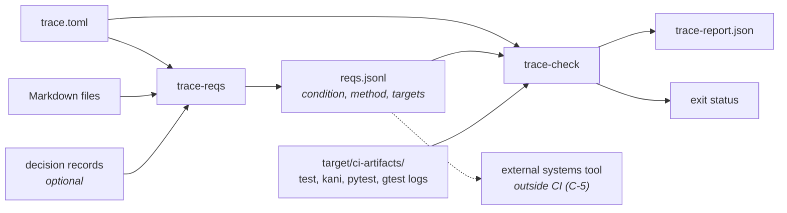
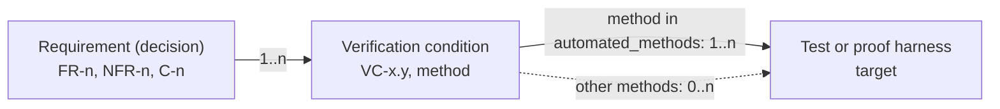

# Requirement Traceability Infrastructure (requirement-traceability)


---

## Introduction

Requirements in `control-rs` are written first, in the Requirements section of
each design document, and the design follows from them. This document
specifies the tooling that checks every requirement is decomposed into
verification conditions and that every condition verified by test or formal
proof names the test or proof harness that discharges it and that the harness
passed.

The decomposition follows the vocabulary of MC/DC: a decision is a Boolean
expression composed of conditions and Boolean operators, and a condition
contains no Boolean operator (Hayhurst et al., 2001). A requirement statement
is the decision; its verification conditions are the conditions. Coverage
criteria of this shape can be defined directly on requirements rather than on
code, which keeps the resulting verification traceable to the requirements they
exercise (Whalen et al., 2006). The weakest such criterion asks for at least
one test per requirement (Staats et al., 2010); this design asks for at least
one passing target per automated condition and leaves the stronger criteria open
(see
[Extension Path](#extension-path)).

The tooling rests on three concepts. A **definition** is the one line where a
requirement ID is introduced. A **condition** is a row of a Verification table
that introduces a condition ID, names its parent requirements, states how it is
verified and, for an automated method, names the fully qualified **targets**
(tests or proof harnesses) that discharge it. Two small binaries in
`control-rs-ci` handle one step each:

- `trace-reqs` finds definitions and conditions in Markdown, checks them and
  writes `reqs.jsonl`;
- `trace-check` reads `reqs.jsonl` and the result logs of the gates, and writes
  `trace-report.json` and a coverage verdict.

**Concept of operations**

| Actor                     | Action                                                                           | Touches                                        |
|:--------------------------|:---------------------------------------------------------------------------------|:-----------------------------------------------|
| Author                    | Writes requirements and their verification conditions first, then the design     | One Markdown file, in any editor               |
| Verification author       | Names each test or proof harness in the Target cell of the condition it verifies | The same Markdown file                         |
| Reviewer                  | Reads requirements, conditions and criteria in a pull request                    | Rendered Markdown on GitHub                    |
| Linter (local or CI)      | Reports missing, duplicate or unresolved IDs with `path:line: message`           | The same Markdown file                         |
| Tracer (CI)               | Reports per-target verification status of each condition                         | `reqs.jsonl`, result logs, `trace-report.json` |
| Systems engineer (future) | Builds hierarchies, allocations and verification matrices                        | External tools that read the `.jsonl` files    |

Three principles follow from the table:

1. **Plain text is the source of truth.** A requirement is readable and
   writable without any tool.
2. **The linter is the only tool an author needs.** Editor support comes from
   `path:line: message` diagnostics, which every editor already consumes from a
   terminal, a run configuration or a problem matcher. No plugin, schema,
   snippet or language server is part of the design.
3. **Everything beyond lint and trace is optional and external.** Systems-level
   features consume the generated `.jsonl` files and never enter the CI path of
   this workspace.

**Two audiences.** `control-rs` always follows
`documentation/design-template.md`, and its configuration encodes that
template. External users of `control-rs-ci` describe their own layout with the
same few patterns (see [Configuration](#configuration)).

**Scope.** In scope: definitions, conditions, targets, the checks over them,
the Requirement → Condition → Target hierarchy inside one design document,
target status derivation, decision references (FR-12), and the generated
artifacts. Out of scope:
test adequacy; condition, decision and MC/DC coverage of requirements (see
[Extension Path](#extension-path)); code-level structural coverage;
requirement-to-requirement hierarchies; citation, reference and general
document style, which an external, unpublished review tool owns; requirement
editing tools; and any systems-engineering view.

---

## Requirements

### Functional Requirements

- **FR-1 — Definitions**: `trace-reqs` shall record one definition for the
  first requirement ID on each line that matches the `definition` pattern,
  with the definition text formed per [Matching Rules](#matching-rules).
- **FR-2 — Conditions**: `trace-reqs` shall record one condition row for each
  line that matches the `verification` pattern, with the condition ID on the
  line as `id`, every requirement ID outside condition IDs as `parents`, the
  method named in a code span as `method` and the code spans of the `Target`
  cell as `targets`.
- **FR-3 — Qualified IDs**: `trace-reqs` shall qualify every recorded ID as
  `<doc>#<id>` per [Matching Rules](#matching-rules), with `<doc>` extracted by
  the `doc_id` pattern, so that equal IDs in different documents never collide,
  and shall recognize an ID only at word boundaries.
- **FR-4 — Checks**: `trace-reqs` shall report as a defect: a missing document
  ID
  declaration matching `doc_id`; a document, requirement or condition defined
  more than once; a condition with no parent or with an undefined parent; a
  verification row with no condition ID or with more than one; a condition row
  with no method, with more than one, or with one outside `methods`; a defined
  requirement with no condition; and a retired ID that is defined or referenced.
- **FR-6 — Requirement Rows**: `trace-reqs` shall write `reqs.jsonl` with one
  row per definition and per condition, in the row schema of
  [Artifacts](#artifacts).
- **FR-8 — Coverage Verdict**: `trace-check` shall derive condition and
  requirement status per [Status Derivation](#status-derivation), write
  `trace-report.json`, and exit 0 iff no condition is `Uncovered`, `Unrun` or
  `Fail`.
- **FR-9 — Diagnostic Format**: `trace-reqs` and `trace-check`
  shall report each defect as one `path:line: message` line and shall exit
  non-zero when any defect exists.
- **FR-10 — File Selection**: `trace-reqs` shall select its input files per
  [File Selection](#file-selection).
- **FR-11 — Targets**: `trace-check` shall resolve each target of a condition
  whose method is in `automated_methods` against the result log of that method,
  and shall report a target that is absent from the log or failed as a defect
  at the condition row.
- **FR-12 — Decision References**: When the configuration has a `[decisions]`
  table, `trace-reqs` shall record the ID and status of each decision record
  it selects, and shall report as a defect: a decision record with no status
  or defined more than once; and a decision ID cited in the text of a
  requirement definition that no decision record defines, or whose status is
  not in `accepted` (ADR-0001).

### Non-Functional Requirements

- **NFR-1 — Audit Latency**: Each of the two binaries shall complete on the
  `control-rs` workspace in under 1 s of wall-clock time, excluding compilation.
- **NFR-3 — Dependency Budget**: The two binaries shall add no dependency to
  `control-rs-ci` beyond its current set and the `regex` crate.
- **NFR-4 — Schema Versioning**: Every row and `trace-report.json` shall carry
  an integer `schema` field, incremented on every incompatible change.

### Constraints

- **C-1 — Plain-Text Source**: Requirements and their verification shall live in
  the Markdown files the configuration lists; no generated file shall be
  committed or required for reading or writing a requirement.
- **C-2 — No Editor Integration**: The design shall deliver diagnostics only; it
  shall ship no editor plugin, schema, snippet or language server.
- **C-3 — Paths from Configuration**: Every input and output path of the two
  binaries shall arrive from a command-line argument or the configuration file.
- **C-4 — Read-Only Inputs**: The tracer shall run no test, build or gate; it
  reads Markdown, the configuration, its own artifacts, and per-target test and
  proof result logs from `target/ci-artifacts/`.
- **C-5 — External Systems Tooling**: Hierarchy views, allocation, verification
  matrices and model export shall consume the `.jsonl` files outside this
  workspace's CI path.
- **C-6 — Artifact Location**: The two binaries shall write under
  `target/ci-artifacts/` when run as gates.
- **C-7 — Document Style Exclusion**: `trace-reqs` shall check no citation,
  reference or general document style.
- **C-8 — Per-Target Verification Status**: The tracer shall derive condition
  status from per-target test and proof results; it shall never infer condition
  status from aggregate gate verdicts.

---

## Technical Overview

### Author Workflow

1. **Define the requirement** in the Requirements section:

   ```markdown
   - **FR-3 — Packed Storage**: Packed symmetric, Hermitian and triangular storage
     shall return `None` from `value(i, j)` when `i` or `j` is out of bounds.
   ```

2. **Decompose it into conditions** in the Verification table. Each row
   introduces one condition, names its parent requirements, gives one method
   and names the target that discharges it. The Criterion of the first condition
   states how the conditions combine into the requirement:

   ```markdown
   | Condition | Requirement | Method    | Target                                                          | Criterion                                                      |
   |:----------|:------------|:----------|:----------------------------------------------------------------|:---------------------------------------------------------------|
   | VC-3.1    | FR-3        | `libtest` | `control_rs::math::storage::tests::packed_value_out_of_bounds_is_none` | Row index out of bounds gives `None`; FR-3 holds iff both hold |
   | VC-3.2    | FR-3        | `libtest` | `control_rs::math::storage::tests::packed_value_out_of_bounds_is_none` | Column index out of bounds gives `None`                        |
   | VC-3.3    | FR-3        | `kani`    | `control_rs::math::storage::proofs::prove_saturating_div_no_panic`     | Saturating division never panics over the valid input domain   |
   ```

3. **Name the targets.** The `Method` states the framework and the `Target`
   cell holds the fully qualified test or harness path in code spans, as the
   result log prints it. Conditions may share a target, and one
   condition may name multiple:

   | Method       | Target format                         | Result log (`target/ci-artifacts/`)              |
                  |:-------------|:--------------------------------------|:-------------------------------------------------|
   | `libtest`    | `crate::module::tests::test_name`     | `test.log` (`test <path> ... ok`)                |
   | `kani`       | `crate::module::proofs::harness_name` | `kani.log` (`Checking harness <path>...`)        |
   | `pytest`     | `path/to/test_file.py::test_name`     | `pytest.log` (`<file>::<test> PASSED`)           |
   | `gtest`      | `TestSuite.TestCase`                  | `gtest.log` (`[       OK ] TestSuite.TestCase`)  |
   | `analysis`   | `—`                                   | none; signed off in review                       |
   | `inspection` | `—`                                   | none; signed off in review                       |
   | `review`     | `—`                                   | none; signed off in review                       |

4. **Run `cargo trace-reqs` and `cargo trace-check`.** Each problem prints as
   `path:line: message`, which the editor turns into a clickable link:

   ```text
   documentation/math/storage-design.md:212: condition storage#VC-3.2 target 'control_rs::math::storage::tests::column_out_of_bounds' not found in test.log
   ```

To withdraw a requirement or condition, delete it and add its qualified ID to
`retired` in the configuration. The ID is never reused.

### Reading the Output

Every line of `reqs.jsonl` is one occurrence of one ID:

```json lines
{
  "schema": 4,
  "id": "storage#FR-3",
  "kind": "definition",
  "file": "documentation/math/storage-design.md",
  "line": 42,
  "text": "- **FR-3 — Packed Storage**: Packed symmetric ... out of bounds."
}
{
  "schema": 4,
  "id": "storage#VC-3.1",
  "kind": "condition",
  "parents": [
    "storage#FR-3"
  ],
  "method": "libtest",
  "targets": [
    "control_rs::math::storage::tests::packed_value_out_of_bounds_is_none"
  ],
  "file": "documentation/math/storage-design.md",
  "line": 211,
  "text": "| VC-3.1 | FR-3 | `libtest` | `control_rs::math::storage::tests::packed_value_out_of_bounds_is_none` | Row index out of bounds gives `None`; FR-3 holds iff both hold |"
}
```

Grouping rows by `id` gives everything known about a condition; following
`parents` gives its requirements. No field depends on configuration to be
understood.

### Data Flow


```mermaid
flowchart LR
    Cfg["trace.toml"] --> TR
    Cfg --> TC
    Docs["Markdown files"] --> TR["trace-reqs"]
    Dec["decision records<br/><i>optional</i>"] --> TR
    TR --> RJ["reqs.jsonl<br/><i>condition, method, targets</i>"]
    RJ --> TC["trace-check"]
    Logs["target/ci-artifacts/<br/>test, kani, pytest, gtest logs"] --> TC
    TC --> Rep["trace-report.json"]
    TC --> Exit["exit status"]
    RJ -.-> Ext["external systems tool<br/><i>outside CI (C-5)</i>"]
```

### Traceability Model


```mermaid
flowchart LR
    R["Requirement (decision)<br/>FR-n, NFR-n, C-n"] -->|" 1..n "| V["Verification condition<br/>VC-x.y, method"]
    V -->|" method in automated_methods: 1..n "| T["Test or proof harness<br/>target"]
    V -.->|" other methods: 0..n "| T
```

A condition may have more than one parent, such as one review condition covering
every constraint. Verification outcomes are derived from per-target results: a
target evaluates to a boolean pass or fail in its result log, and `trace-check`
aggregates target outcomes into condition statuses (C-8).

**Where requirements live.** Requirements stay in the design documents.
Measured on 2026-09-26, the corpus holds 268 requirements in 23
`*-design.md` files, 244 of them in 20 Approved documents. Keeping them in place
needs no migration, keeps each requirement next to its rationale and renders on
GitHub. The `-design.md` suffix already serves as a file-type pattern for editor
rules (`files.associations` in VS Code, file-type patterns in JetBrains IDEs).

---

## Architecture

### Configuration

Both binaries read one TOML file named by `--config`. The `control-rs`
configuration:

```toml
id = '(?:FR|NFR|C)-[0-9]+[a-z]?'
condition = 'VC-[0-9]+(?:\.[0-9]+[a-z]?)?'
doc = '[a-z0-9-]+'
files = ["documentation/vv/requirement-traceability-design.md"]
doc_id = '^#\s+.*\((?P<doc>[a-z0-9-]+)\)'
definition = '^- \*\*(?:FR|NFR|C)-'
verification = '^\| *(?:[a-z0-9-]+#)?VC-'
methods = ["libtest", "kani", "pytest", "gtest", "analysis", "inspection", "review"]
automated_methods = ["libtest", "kani", "pytest", "gtest"]
retired = [
    "requirement-traceability#FR-5",
    "requirement-traceability#VC-5.1",
    "requirement-traceability#FR-7",
    "requirement-traceability#VC-7.1",
    "requirement-traceability#VC-7.2",
    "requirement-traceability#NFR-2",
    "requirement-traceability#VC-12.1",
]

[method.libtest]
result_artifact = "target/ci-artifacts/test.log"

[method.kani]
result_artifact = "target/ci-artifacts/kani.log"

[method.pytest]
result_artifact = "target/ci-artifacts/pytest.log"

[method.gtest]
result_artifact = "target/ci-artifacts/gtest.log"

[decisions]
files = ["documentation/adr"]
id = 'ADR-[0-9]{4}'
definition = '^#\s+ADR-[0-9]{4}:'
status = 'ADR%20Status-(?P<status>[A-Za-z]+)-'
accepted = ["Accepted"]
```

| Key                    | Meaning                                                                                                                         |
|:-----------------------|:--------------------------------------------------------------------------------------------------------------------------------|
| `id`                   | Regex for one requirement ID                                                                                                    |
| `condition`            | Regex for one condition ID; optional (defaults to `VC-[0-9]+(?:\.[0-9]+[a-z]?)?`)                                               |
| `doc`                  | Regex for the document name in a qualified ID `<doc>#<id>`                                                                      |
| `files`                | Markdown files, and directories whose `.md` files are read (see [File Selection](#file-selection))                              |
| `doc_id`               | Regex for the document ID declaration; optional (defaults to `^#\s+.*\((?P<doc>[a-z0-9-]+)\)`)                                  |
| `definition`           | Regex for a line that defines a requirement                                                                                     |
| `verification`         | Regex for a line that defines a condition                                                                                       |
| `methods`              | Verification methods a condition may name                                                                                       |
| `automated_methods`    | The subset of `methods` whose conditions name targets that a result log must record as passed                                   |
| `method.<m>`           | Result artifact path for automated method `<m>`; required for every automated method                                            |
| `retired`              | Qualified IDs that must not be defined or referenced again                                                                      |
| `decisions.files`      | Roots of decision records, selected per [File Selection](#file-selection); the table is optional and its absence disables FR-12 |
| `decisions.id`         | Regex for one decision ID                                                                                                       |
| `decisions.definition` | Regex for the line that defines a decision record's ID                                                                          |
| `decisions.status`     | Regex whose `<status>` capture is a decision record's status                                                                    |
| `decisions.accepted`   | Decision statuses a requirement may cite                                                                                        |

### File Selection

`files` lists roots relative to the working directory.

- A root that is a file is selected.
- A root that is a directory selects every file below it whose name ends in a
  `.md` suffix.
- Symbolic links are never followed, so a walk cannot loop.
- A root that is missing, or is neither a file nor a directory, is an error.

### Matching Rules

The rules below are the whole parser:

1. Lines inside fenced code blocks, including indented fences, are skipped,
   so examples are inert.
2. An ID occurrence is a match of `id` or `condition` bounded by word
   boundaries, optionally preceded by a match of `doc` and `#`. A requirement
   ID inside a condition ID, or inside a longer token such as `IEC-61508`, is
   not an occurrence.
3. A line that matches `definition` defines the first requirement ID on it.
   Its text is the line plus the indented lines that follow it.
4. A line that matches `verification` defines the condition ID on it. Every
   requirement ID on the line is a parent, the one code span whose content
   is in `methods` is the method, and the code spans of the fourth cell of a row
   with five or more cells are the targets.
5. The document name is the `<doc>` captured by the `doc_id` pattern on the
   first matching line: `# Title (storage)` yields `storage`. An ID written
   without `<doc>#` belongs to the document it appears in. A document with no
   line matching `doc_id` is a defect.
6. A decision record is a file selected by `decisions.files` with a line
   matching `decisions.definition`; that line defines the decision ID on it,
   and the `<status>` of the first `decisions.status` match is its status. A
   selected file with no such line is not a decision record. Every
   occurrence of `decisions.id` in the text of a requirement definition (rule 3)
   is a citation; an occurrence anywhere else is not.

### Checks

| Check             | Defect                                                                                               |
|:------------------|:-----------------------------------------------------------------------------------------------------|
| `doc_id`          | A document contains no line matching `doc_id`, or multiple conflicting declarations                  |
| `duplicate`       | A requirement, condition, document or decision ID is defined more than once                          |
| `unresolved`      | A condition names a parent that is not defined                                                       |
| `orphan`          | A condition names no parent                                                                          |
| `row`             | A verification row names no condition ID, or more than one                                           |
| `method`          | A condition names no method, more than one, or one outside `methods`                                 |
| `missing`         | A defined requirement has no condition                                                               |
| `retired`         | A retired ID is defined or referenced                                                                |
| `decision`        | A requirement cites a decision ID that has no decision record                                        |
| `decision_status` | A decision record has no status, or a requirement cites a decision whose status is not in `accepted` |

### Status Derivation

Condition status is derived from the targets of the condition and the result
logs in `target/ci-artifacts/`:

| Condition                                                      | Status      | Fails gate |
|:---------------------------------------------------------------|:------------|:-----------|
| Method in `automated_methods`, every target recorded as passed | `Pass`      | no         |
| Method in `automated_methods`, any target recorded as failed   | `Fail`      | yes        |
| Method in `automated_methods`, any target absent from its log  | `Unrun`     | yes        |
| Method in `automated_methods`, no target named                 | `Uncovered` | yes        |
| Method outside `automated_methods`                             | `Review`    | no         |

`trace-check` reads per-target results using deterministic framework-specific
rules. A target matches a logged identifier exactly, or after its leading crate
segment is dropped:

- **`libtest` (`test.log`)**: A line `test <path> ... ok` maps to a passing
  target; `test <path> ... FAILED` maps to a failed target.
- **`kani` (`kani.log`)**: A harness `Checking harness <path>...` maps to a
  passing target iff Kani reports `VERIFICATION:- SUCCESSFUL` and all evaluated
  cover properties are `SATISFIED`. An assertion failure, unwinding failure, or
  unsatisfiable cover witness maps to a failed target.
- **`pytest` (`pytest.log`)**: A verbose line `<file>::<test> PASSED` maps to a
  passing target; `FAILED` or `ERROR` maps to a failed target.
- **`gtest` (`gtest.log`)**: A line `[       OK ] <Suite>.<Case>` maps to a
  passing target; `[  FAILED  ] <Suite>.<Case>` maps to a failed target.

**Interpreter warning.** Miri serves as a secondary interpreter for test
execution rather than a distinct verification method. `trace-check` emits the
non-fatal warning **W-2 (Unexecuted under Miri)** when a `libtest` target
recorded in `test.log` is absent from `miri.log`.

**Staleness warning.** `trace-check` emits the non-fatal warning **W-3 (Stale
result log)** when the result log of an automated method is older than the
most recently modified document that `reqs.jsonl` names. A document edited
after the run may name targets the log never ran. The warning points at that
document and names the log.

A requirement takes the worst status of its conditions, in the order
`Fail`, `Unrun`, `Uncovered`, `Review`, `Pass`. Each defect prints at the
condition row, as `condition <id> target '<target>' not found in <log>` or
`... failed in <log>`.

`trace-report.json` holds `schema` (4), summary counts per status, one entry
per requirement (ID, status, and child conditions with method, status and
target outcomes), the `Review` conditions awaiting sign-off, and interpreter
warnings.

### Artifacts

| Field     | Meaning                                                          |
|:----------|:-----------------------------------------------------------------|
| `schema`  | Row format version, `4` (NFR-4)                                  |
| `id`      | Qualified ID, `<doc>#<id>`                                       |
| `kind`    | `definition` or `condition`                                      |
| `parents` | Condition rows only: qualified parent requirement IDs            |
| `method`  | Condition rows only: the verification method                     |
| `targets` | Condition rows only: the code spans of the `Target` cell, if any |
| `file`    | Path relative to the working directory                           |
| `line`    | 1-based line number                                              |
| `text`    | The matched line; for a definition, its full text                |

In `text`, each run of whitespace, line breaks included, becomes one space, and
none remains at either end. A wrapped definition therefore reads as one line.

Rows are sorted by `file`, then `line`. Examples are in
[Reading the Output](#reading-the-output).

### Invocation and Gate Wiring

| Binary        | Gate and placement              | Arguments                                                                                                            |
|:--------------|:--------------------------------|:---------------------------------------------------------------------------------------------------------------------|
| `trace-reqs`  | `trace-reqs`, `lint` group      | `--config .cargo/trace/trace.toml --out target/ci-artifacts/reqs.jsonl`                                              |
| `trace-check` | `trace`, `post` exclusive stage | `--config .cargo/trace/trace.toml --reqs target/ci-artifacts/reqs.jsonl --out target/ci-artifacts/trace-report.json` |

`trace-reqs` runs early in the concurrent `lint` group to extract requirement
definitions and targets. `trace-check` runs in the `post` exclusive stage after
test execution and `kani` formal verification complete, ensuring all result logs
are present in `target/ci-artifacts/` before condition status derivation.

### Adoption

Existing verification tables carry no condition IDs or methods, so every
existing requirement would report a `missing` defect. `files` is therefore
the adoption mechanism: it lists documents one by one as each is migrated and
becomes the directory `documentation` when the last one is done. A document
outside `files` is not checked at all; a document inside it is checked in full.

### Extension Path

Coverage criteria defined on requirements form a ladder. Requirements coverage
asks for one test per requirement that causes it to be met (Staats et al.,
2010). Unique-first-cause coverage asks that every basic condition take all
outcomes and be shown to affect the outcome of its formula independently, and
is adapted from MC/DC (Staats et al., 2010). MC/DC over a decision with n
inputs needs, in general, at least n + 1 test cases (Hayhurst et al., 2001).

| Level              | Obligation                                   | This revision                      |
|:-------------------|:---------------------------------------------|:-----------------------------------|
| Linked             | One passing target per automated condition   | Enforced                           |
| Condition coverage | A target driving each condition each way     | Not representable in a Target cell |
| Decision coverage  | The requirement observed both true and false | Not representable in a Target cell |
| Unique cause       | Independence pairs per condition             | Review of the Criterion            |

Four choices keep the stronger levels additive:

1. A later per-target outcome tag is a schema increment (NFR-4) that leaves the
   `Target` cell grammar intact.
2. Condition IDs are never reused (`retired`), so later tags attach to stable
   IDs.
3. The `.jsonl` files stay the interface for external tools (C-5).
4. The Criterion states how the conditions combine into the requirement, so a
   reviewer can check independence pairs now.

---

## Alternatives

| Alternative                                                           | Rejected Because                                                                                                                                                                                                                                                                                                  | Reference                      |
|:----------------------------------------------------------------------|:------------------------------------------------------------------------------------------------------------------------------------------------------------------------------------------------------------------------------------------------------------------------------------------------------------------|:-------------------------------|
| **Requirement status from gate verdicts**                             | A gate verdict aggregates many tests; its failure says nothing about one requirement, and reading results ties the tracer to gate order and to which gates a trigger ran.                                                                                                                                         | n/a                            |
| **Direct requirement-to-test links**                                  | Skips the condition decomposition; one link on a requirement would satisfy every way the requirement can hold or fail.                                                                                                                                                                                            | Whalen et al. (2006)           |
| **Condition coverage through outcome-tagged targets**                 | Deferred: buys condition coverage but not independence, at least doubles the targets per condition during migration, and fixes a model before the corpus is decomposed.                                                                                                                                           | Staats et al. (2010)           |
| **Mechanical MC/DC over requirements**                                | Needs every condition's value in every test, from instrumentation or execution traces; a text tracer cannot observe it (C-4).                                                                                                                                                                                     | Hayhurst et al. (2001)         |
| **Code-level MC/DC in the tracer**                                    | Measures code structure, not requirements, and the unstable MC/DC instrumentation in `rustc` has been removed; code-level MC/DC belongs to a separate gate.                                                                                                                                                       | Rust Project Developers (2025) |
| **Test-level verdicts from libtest JSON**                             | The format is unstable and requires `-Z unstable-options`; test outcomes belong to the gates (C-8).                                                                                                                                                                                                               | Rust Project Developers (2026) |
| **Named captures, requirement blocks and link attachment**            | Meaning hid in capture-group names and position-dependent parsing state; the generated rows mirrored parser internals and could not be read without the configuration.                                                                                                                                            | n/a                            |
| **Fixed grammar with configured section, table and column names**     | Many keys with distinct semantics, still bound to headings and pipe tables.                                                                                                                                                                                                                                       | n/a                            |
| **Adoption baseline file and previous-artifact ID check**             | Two baselines with different formats and a workflow restore step; listing migrated documents in `files` ratchets adoption with no new concept, and `retired` covers ID reuse.                                                                                                                                     | n/a                            |
| **Structured JSON or TOML requirement files**                         | Each step toward better editing (per-area schemas, snippets, IDE-specific workarounds) added machinery an author must understand before writing a requirement; TOML adds worse multi-line text.                                                                                                                   | n/a                            |
| **Source markers (attribute or comment) linking tests to conditions** | A second copy of the link in source text, found by scanning, that the table does not show; it needs a scanner, an item-rule check and, for attributes, a proc-macro crate, and drifts from the Verification table. A qualified path in the table is read beside the condition and checked against the result log. | Hatzl (2026b)                  |
| **Globs with `!` exclusions and `depth`**                             | A glob engine and a symbolic-link rule table to select a handful of directories; roots plus a suffix select the same files.                                                                                                                                                                                       | n/a                            |
| **Hand-written matcher instead of the `regex` crate**                 | Users would learn a bespoke pattern language; regular expressions are already known. The cost is one dependency (NFR-3).                                                                                                                                                                                          | n/a                            |
| **Requirement prose and smell linting in the tracer**                 | Requirement prose quality belongs to Vale and compiler linting to Clippy; the tracer focuses strictly on traceability.                                                                                                                                                                                            | n/a                            |
| **Editor plugins, schemas or a language server**                      | Adds per-editor machinery; `path:line: message` works everywhere (C-2).                                                                                                                                                                                                                                           | n/a                            |
| **OpenFastTrace (Java)**                                              | Adds a Java runtime to CI.                                                                                                                                                                                                                                                                                        | OpenFastTrace (2026a, 2026b)   |
| **StrictDoc (Python)**                                                | Adds a Python toolchain and its own `.sdoc` grammar.                                                                                                                                                                                                                                                              | StrictDoc (2026)               |
| **mantra (Rust)**                                                     | Relies on a database and line-coverage pairing rather than conditions.                                                                                                                                                                                                                                            | Hatzl (2026a)                  |
| **Doorstop**                                                          | One YAML file per requirement; loses requirements-beside-rationale.                                                                                                                                                                                                                                               | Doorstop (2026)                |
| **Decision rows in `reqs.jsonl`**                                     | No consumer reads them; a row kind is a schema increment (NFR-4) that waits for one.                                                                                                                                                                                                                              | n/a                            |
| **Immutability of accepted decision records**                         | Needs the base branch as input, outside C-4; review of the diff is the control, as for retired IDs.                                                                                                                                                                                                               | n/a                            |
| **Requirement lists in decision records**                             | A second, hand-kept link in the other direction; citations in the documents already give it, and a search recovers it.                                                                                                                                                                                            | n/a                            |

---

## Verification & Validation

### Verification

| Condition | Requirement                            | Method    | Target                                                                                                                                                                                                                                                                                                                                                                                                                                                                                                                                                                                                                                                                              | Criterion                                                                                                                                                                           |
|:----------|:---------------------------------------|:----------|:------------------------------------------------------------------------------------------------------------------------------------------------------------------------------------------------------------------------------------------------------------------------------------------------------------------------------------------------------------------------------------------------------------------------------------------------------------------------------------------------------------------------------------------------------------------------------------------------------------------------------------------------------------------------------------|:------------------------------------------------------------------------------------------------------------------------------------------------------------------------------------|
| VC-1.1    | FR-1                                   | `libtest` | `control_rs_ci::trace::reqs::tests::definitions_take_the_first_id_and_indented_lines`, `control_rs_ci::trace::reqs::tests::rows_carry_normalized_text`                                                                                                                                                                                                                                                                                                                                                                                                                                                                                                                              | Definition fixtures yield exactly the expected rows, with normalized text and indented continuation lines; FR-1 holds iff both hold                                                 |
| VC-2.1    | FR-2                                   | `libtest` | `control_rs_ci::trace::reqs::tests::reference_lines_record_every_local_and_qualified_id`, `control_rs_ci::trace::reqs::tests::a_parent_named_twice_is_recorded_once`, `control_rs_ci::trace::reqs::tests::scan_condition_finds_parents`                                                                                                                                                                                                                                                                                                                                                                                                                                             | A condition row yields one row with every parent and its method; a row with more than one parent yields one row                                                                     |
| VC-3.1    | FR-3                                   | `libtest` | `control_rs_ci::trace::reqs::tests::doc_id_is_extracted_from_the_title_declaration`, `control_rs_ci::trace::reqs::tests::ids_inside_longer_tokens_or_condition_ids_are_not_parents`                                                                                                                                                                                                                                                                                                                                                                                                                                                                                                 | Local and qualified IDs resolve to `<doc>#<id>`; an ID inside a longer token or inside a condition ID is not recorded                                                               |
| VC-4.1    | FR-4                                   | `libtest` | `control_rs_ci::trace::reqs::tests::row_and_method_defects_are_reported`, `control_rs_ci::trace::reqs::tests::duplicate_definition_is_reported_once_at_the_second`, `control_rs_ci::trace::reqs::tests::reference_to_an_undefined_id_is_unresolved`, `control_rs_ci::trace::reqs::tests::definition_without_a_kind_of_reference_is_missing_it`, `control_rs_ci::trace::reqs::tests::retired_ids_are_reported_where_they_appear`, `control_rs_ci::trace::reqs::tests::missing_doc_id_declaration_is_reported_as_defect`, `control_rs_ci::trace::reqs::tests::duplicate_doc_id_across_files_is_reported`, `control_rs_ci::trace::reqs::tests::condition_without_parents_is_an_orphan` | One fixture per defect kind of the Checks table yields exactly that defect                                                                                                          |
| VC-6.1    | FR-6                                   | `libtest` | `trace_tests::cli::rows_have_the_schema_fields_and_reruns_are_identical`, `trace_tests::cli::a_clean_document_passes_and_writes_its_rows`                                                                                                                                                                                                                                                                                                                                                                                                                                                                                                                                           | Rows carry the schema fields and two runs on an unchanged corpus produce byte-identical `reqs.jsonl`                                                                                |
| VC-8.1    | FR-8                                   | `libtest` | `trace_tests::cli::passed_unrun_and_review_conditions_take_their_status`, `trace_tests::cli::every_automated_target_passed_passes_and_review_does_not_fail`, `control_rs_ci::trace::status::tests::automated_condition_without_targets_is_uncovered`, `control_rs_ci::trace::status::tests::review_condition_takes_review_status`, `control_rs_ci::trace::status::tests::missing_log_is_unrun`                                                                                                                                                                                                                                                                                      | A fixture of passed, unexecuted, uncovered and review conditions gives the specified statuses and exit code                                                                         |
| VC-9.1    | FR-9                                   | `libtest` | `trace_tests::cli::defects_print_as_path_line_message_and_fail_the_run`, `trace_tests::cli::usage_and_configuration_errors_exit_with_code_two`                                                                                                                                                                                                                                                                                                                                                                                                                                                                                                                                      | Every diagnostic line matches `^[^:]+:[0-9]+: .+$`; any defect gives a non-zero exit                                                                                                |
| VC-10.1   | FR-10                                  | `libtest` | `trace_tests::cli::roots_select_suffixed_files_below_directories_and_named_files`, `trace_tests::cli::a_missing_root_is_a_configuration_error`, `trace_tests::cli::symbolic_links_are_never_followed`                                                                                                                                                                                                                                                                                                                                                                                                                                                                               | Selection fixtures: file root, suffix filter, symbolic link and missing root                                                                                                        |
| VC-11.1   | NFR-1                                  | `review`  | —                                                                                                                                                                                                                                                                                                                                                                                                                                                                                                                                                                                                                                                                                   | Median of 5 runs under 1.0 s per binary on the workspace                                                                                                                            |
| VC-13.1   | NFR-3                                  | `review`  | —                                                                                                                                                                                                                                                                                                                                                                                                                                                                                                                                                                                                                                                                                   | `cargo tree` shows no dependency beyond the budget                                                                                                                                  |
| VC-14.1   | NFR-4                                  | `libtest` | `trace_tests::cli::every_row_and_the_report_carry_the_schema_version`, `trace_tests::cli::trace_check_rejects_rows_of_another_schema`                                                                                                                                                                                                                                                                                                                                                                                                                                                                                                                                               | Every row and the report carry `schema` 4; a row of another schema is rejected                                                                                                      |
| VC-15.1   | C-1, C-2, C-3, C-4, C-5, C-6, C-7, C-8 | `review`  | —                                                                                                                                                                                                                                                                                                                                                                                                                                                                                                                                                                                                                                                                                   | The diff adds no violation of any constraint                                                                                                                                        |
| VC-16.1   | C-4, C-8                               | `kani`    | `control_rs::math::fixed_num::proofs::prove_fixed_saturating_div`                                                                                                                                                                                                                                                                                                                                                                                                                                                                                                                                                                                                                   | Bounded model checking verifies that the linked proof harnesses satisfy safety and non-vacuity contracts without panic                                                              |
| VC-17.1   | FR-11                                  | `libtest` | `control_rs_ci::trace::reqs::tests::targets_are_the_code_spans_of_the_fourth_cell`, `control_rs_ci::trace::status::tests::libtest_target_passes_with_crate_qualified_or_bare_name`, `control_rs_ci::trace::status::tests::libtest_target_fails_when_the_log_reports_failed`, `control_rs_ci::trace::status::tests::target_absent_from_the_log_is_unrun`, `control_rs_ci::trace::status::tests::every_listed_target_must_pass`, `control_rs_ci::trace::status::tests::kani_target_passes_and_unsatisfied_cover_fails`, `control_rs_ci::trace::status::tests::pytest_and_gtest_logs_are_parsed`, `trace_tests::cli::a_failed_target_fails_the_trace_with_a_located_defect`            | Targets are recorded per condition; a target that passed, failed or is absent from its log yields `Pass`, `Fail` or `Unrun`, and every listed target must pass                      |
| VC-18.1   | FR-12                                  | `libtest` | `control_rs_ci::trace::reqs::tests::cited_decision_without_record_is_reported`, `control_rs_ci::trace::reqs::tests::decision_defined_twice_is_a_duplicate`                                                                                                                                                                                                                                                                                                                                                                                                                                                                                                                          | A citation with no decision record and a decision ID defined twice are each reported once at the citing or second defining line; FR-12 holds iff all four conditions hold           |
| VC-18.2   | FR-12                                  | `libtest` | `control_rs_ci::trace::reqs::tests::requirement_citing_unaccepted_decision_is_reported`, `control_rs_ci::trace::reqs::tests::citations_outside_requirement_text_are_ignored`, `control_rs_ci::trace::reqs::tests::decision_record_without_status_is_reported`                                                                                                                                                                                                                                                                                                                                                                                                                       | A requirement citing a Proposed and a Superseded decision gives two defects; decision IDs outside requirement text give none; a record with no status gives one                     |
| VC-18.3   | FR-12                                  | `libtest` | `control_rs_ci::trace::reqs::tests::absent_decisions_table_disables_decision_checks`                                                                                                                                                                                                                                                                                                                                                                                                                                                                                                                                                                                                | With no `[decisions]` table, a corpus citing undefined decision IDs gives no decision defect                                                                                        |
| VC-18.4   | FR-12                                  | `libtest` | `trace_negative_gates::test_negative_trace_reqs_gate_fails_on_unaccepted_and_missing_decisions`                                                                                                                                                                                                                                                                                                                                                                                                                                                                                                                                                                                     | Negative example: the `trace-reqs` gate fails on a fixture workspace whose requirement cites a Proposed decision and an unrecorded one, and its log reports both at the requirement |

### Limits

- The tracer shows that each automated condition names targets that passed in
  the result logs. It does not show that the targets drive the condition both
  ways or show its independent effect on the requirement; the Criterion states
  the combination and review checks it.
- A target's claim is not checked against what the test or proof harness does.
- A target that is compiled out or ignored is absent from its log and reports
  `Unrun`.
- Every requirement ID on a verification row is a parent, including one
  mentioned in the Criterion, and a second condition ID or a second method
  code span is a defect. Criteria therefore name neither.
- A requirement deleted without being added to `retired` is not detected;
  review of the diff is the control.
- W-3 compares file modification times with the traced documents only. A
  code or test edit after the run leaves the log stale without a warning.
- Decision checks read status badges and the decision IDs in requirement
  text. A mention elsewhere, or in a document outside `files`, is not
  checked, and whether a design follows the decisions it cites is left to
  review.

---

## Performance & Resource Considerations

- Both binaries are single-pass and line-oriented; each line is tested
  against a handful of compiled patterns. Cost is dominated by file I/O.
  Measured on 2026-09-27 against rev 1.11 of this document: `trace-reqs` 16 ms.
- Artifacts are small: one row per definition and condition.
- `regex` brings `aho-corasick`, `memchr`, `regex-automata` and
  `regex-syntax`, with no proc-macro crate. `control-rs-compare` already
  depends on it, so the lockfile gains no crate.

---

## Risks & Open Questions

- **Migration effort.** Each of the 23 documents needs condition IDs and
  methods in its Verification table before it joins `files`. Converting
  numbered headings (586) and `§n` cross-references (472) to the unnumbered
  template is separate editorial work that the tracer does not depend on.
- **Decomposition quality.** Coverage is only as good as the conditions an
  author writes; the tracer cannot tell whether a requirement is fully
  decomposed. Review of the Verification table carries that.
- **Deferred criteria.** Outcome tags are reconsidered after the first areas
  migrate, or when an adopter needs condition coverage evidence (see
  [Extension Path](#extension-path)).
- **Document renames.** Renaming a design document changes every qualified ID
  in it, which breaks `retired` entries that name the old document. They are
  updated in the same pull request.
- **Open: DO-178C wording.** The research record quotes the DO-178B MC/DC
  definition through Hayhurst et al. (2001); the DO-178C text of the
  requirements-based and structural coverage analyses has not been quoted.

---

## Development Plan

| Phase / Task                           | Description                                                                                                                                                                                                                              | Estimated Effort |
|:---------------------------------------|:-----------------------------------------------------------------------------------------------------------------------------------------------------------------------------------------------------------------------------------------|:-----------------|
| **Phase 1: `trace-reqs`**              | Word-bounded IDs, condition rows with `parents` and `method`, the Checks table, schema 2, configuration keys `verification`, `methods` and `marked_methods`.                                                                             | 2                |
| **Phase 2: Targets**                   | `Target` column with fully qualified test and harness paths in condition rows; `trace-marks`, source markers and `control-rs-trace-macros` removed.                                                                                      | 1                |
| **Phase 3: `trace-check`**             | Coverage derivation per Status Derivation, report schema 2, `--config` in place of gate inputs.                                                                                                                                          | 1                |
| **Phase 4: Gate wiring**               | `trace` joins the `lint` group; the report job's trace step and the runner's retention of other gates' results go (`ci-design.md`).                                                                                                      | 1                |
| **Phase 5: Corpus migration**          | Add condition IDs and methods to each document's Verification table and add the document to `files`. One pull request per area.                                                                                                          | 3                |
| **Phase 6: Framework Methods (PR3-6)** | Framework-qualified methods `libtest`, `kani`, `pytest` and `gtest`; per-target result evaluation in `trace-check` from `test.log`, `kani.log`, `pytest.log` and `gtest.log`; Miri warning W-2; schema 4; `trace` moved to `post` stage. | 2                |
| **Phase 7: Decision references**       | `[decisions]` table, decision records and citations per Matching Rules, the `decision` and `decision_status` checks and decision IDs in `duplicate`; `.cargo/trace/trace.toml` gains the table.                                          | 1                |

---

## Revision History

| Revision | Date               | Author          | Description                                                                                                                                                                                                                                                                                                                                                                                                                                                                                            |
|:---------|:-------------------|:----------------|:-------------------------------------------------------------------------------------------------------------------------------------------------------------------------------------------------------------------------------------------------------------------------------------------------------------------------------------------------------------------------------------------------------------------------------------------------------------------------------------------------------|
| 1.5      | September 26, 2026 | @MitchellDScott | Simplified to definitions and references: one `definition` pattern, named reference patterns, six-field rows shared by `reqs.jsonl` and `marks.jsonl`. Removed named captures, requirement blocks, link attachment, `Parent` and `Status`, `malformed`, the adoption baseline and the previous-artifact ID check; adoption through `files`, ID reuse through `retired`. Added Author Workflow and Reading the Output.                                                                                  |
| 1.6      | September 26, 2026 | @MitchellDScott | Globs with `!` exclusions and `depth`; `doc` pattern for qualified IDs; whitespace-normalized `text`; `#[req]` attribute markers in `control-rs-trace-macros` whose link records every build writes and `trace-marks` collects; `trace-check` runs as gate `trace` after every other gate and before the report; a gate run removes no other gate's artifacts; NFR-1 evidence from `trace-reqs` and `trace-marks`; C-3 citation and Phase 1 removals corrected.                                        |
| 1.7      | September 26, 2026 | @MitchellDScott | Stated symbolic-link handling for glob walks: links to directories are not entered during a walk, links to files are selected under their own path, dangling links are ignored and links named in a glob's leading components are resolved. Added the double-selection limit and symbolic-link fixtures to the Plan.                                                                                                                                                                                   |
| 1.8      | September 26, 2026 | @MitchellDScott | Dropped `require_phrases`; each match of an `exclude_phrases` pattern is a defect that quotes the match. The Acceptance bound for the checks counts every expected defect. Reference [6] follows the research record, and the ISO/IEC/IEEE 29148 citation is removed until a quoted source exists.                                                                                                                                                                                                     |
| 1.9      | September 26, 2026 | @MitchellDScott | Markers are found in source text: `trace-marks` reads `[markers]` (roots, suffixes, marker text) and works for any language; `#[req]` checks its IDs and writes nothing. Globs replaced by roots plus suffix, with symbolic links never followed; `depth` removed. Removed the link-record Limits and the compiler-path and editor-expansion Risks; the gate-name overlap joins the reference-line Limit.                                                                                              |
| 1.10     | September 26, 2026 | @MitchellDScott | Merged Plan and Acceptance into a single Verification table (`Requirements \| Gates \| Criterion`). One reference kind `verification` replaces `plan` and `acceptance`; the pattern matches a row whose first cell starts with a requirement ID. Removed the Kind column, the gate-name overlap Limit, the row-shape Risk, and the acceptance-not-evaluated Limit. Updated template, `trace.toml`, tracer tests.                                                                                       |
| 1.11     | September 26, 2026 | @MitchellDScott | Upgraded to 3-tier hierarchy (Requirement → Verification Conditions → Tests). Added condition extraction (`VC-x.y`), `parent` linking in row schema, multi-line marker look-ahead, and hierarchical condition status derivation requiring marker evidence for test gates.                                                                                                                                                                                                                              |
| 1.12     | September 27, 2026 | @MitchellDScott | Condition coverage replaces gate linkage: requirements are decisions decomposed into conditions, tests link to conditions only, and `trace-check` reads no gate result (C-4, C-8). `Method` replaces `Gates`; `[references]` and direct requirement rows removed; word-bounded IDs; `parents` and `method` on condition rows; parenthesis-balanced marker spans; reserved `=<tag>` marker grammar and Extension Path; File Selection requirement (FR-10); schema 2; `trace` moves to the `lint` group. |
| 1.13     | September 27, 2026 | @MitchellDScott | Removed the `test_gates` key and the `default = false` gate Limit left from rev 1.11; `condition` default written without doubled escapes. Implementation aligned: `methods` and `marked_methods` required, `row` and `method` checks, tagged-ID and unclosed-span defects, `#[req]` rejects tags.                                                                                                                                                                                                     |
| 1.14     | September 28, 2026 | @MitchellDScott | Upgraded for formal methods and per-item verification status (PR3-6): added `proof` method and `#[method.proof]` (`#[kani::proof]`); updated C-4 and C-8 to evaluate per-item test and proof result logs (`test.log`, `kani.log`); defined condition statuses `Pass`, `Fail`, `Unrun`, `Uncovered`, and `Review`; added Miri interpreter warnings W-1 and W-2; moved `trace` to `post` exclusive stage; bumped schema to 3. Added DO-333 and Kani references.                                          |
| 1.15     | September 28, 2026 | @MitchellDScott | Converted markers to comment-based `trace(...)` syntax; retired `#[req]` proc macro and `control-rs-trace-macros` crate to eliminate compiler and target friction across `no_std`, ETS bare-metal targets, Kani, and docs; added strict marker argument and near-miss validation in `trace-marks`.                                                                                                                                                                                                     |
| 1.16     | September 28, 2026 | @MitchellDScott | Replaced source markers with fully qualified `Target` cells in the Verification table: framework-qualified methods `libtest`, `kani`, `pytest` and `gtest`; `targets` on condition rows; `trace-check` resolves targets against the result logs; removed `trace-marks`, `marks.jsonl`, `item_rule`, `[markers]`, W-1, and requirements FR-7 and NFR-2; added FR-11; schema 4.                                                                                                                          |
| 2.0      | October 2, 2026    | @MitchellDScott | Added FR-12 Decision References: optional `[decisions]` table, Matching Rule 6, checks `decision` and `decision_status`, decision IDs in `duplicate`; Scope lists decision references. Citations count only in requirement text. Added VC-18.1 to VC-18.4, a decision Limit, three Alternatives and Phase 7. Staleness warning W-3. Row and report schema unchanged. Starts following ADR-0001.                                                                                                        |

---

## References

[1] K. J. Hayhurst, D. S. Veerhusen, J. J. Chilenski, and L. K. Rierson, "A
Practical Tutorial on Modified Condition/Decision Coverage," NASA Langley
Research Center, Hampton, VA, USA, Rep. no. NASA/TM-2001-210876, 2001.

[2] M. W. Whalen, A. Rajan, M. P. E. Heimdahl, and S. P. Miller, "Coverage
metrics for requirements-based testing," in *Proc. ACM/SIGSOFT Int. Symp.
Software Testing and Analysis (ISSTA 2006)*, Portland, ME, USA, 2006,
pp. 25–36, doi: 10.1145/1146238.1146242.

[3] M. Staats, M. W. Whalen, M. P. E. Heimdahl, and A. Rajan, "Coverage Metrics
for Requirements-Based Testing: Evaluation of Effectiveness," in *Proc. 2nd
NASA Formal Methods Symp. (NFM 2010)*, Washington, DC, USA, 2010.

[4] M. Hatzl, *mantra-rust-macros* (Version 0.7.8). [Online]. Available:
https://docs.rs/crate/mantra-rust-macros/latest. Accessed: Sep. 11, 2026.

[5] Rust Project Developers, "coverage: Remove all unstable support for MC/DC
instrumentation (#144999)," in *rust-lang/rust*. [Online]. Available:
https://github.com/rust-lang/rust/commit/562222b73765a326fa800a075814deaf627874df.
Accessed: Sep. 27, 2026.

[6] The Rust Project Developers, "3558-libtest-json," *The Rust RFC Book*.
[Online]. Available: https://rust-lang.github.io/rfcs/3558-libtest-json.html.
Accessed: Sep. 11, 2026.

[7] OpenFastTrace, "doc/user_guide.md," in *itsallcode/openfasttrace*.
[Online]. Available:
https://github.com/itsallcode/openfasttrace/blob/main/doc/user_guide.md.
Accessed: Sep. 11, 2026.

[8] OpenFastTrace, "doc/spec/system_requirements.md," in
*itsallcode/openfasttrace*. [Online]. Available:
https://github.com/itsallcode/openfasttrace/blob/main/doc/spec/system_requirements.md.
Accessed: Sep. 11, 2026.

[9] StrictDoc, "User Guide," *StrictDoc Documentation*. [Online]. Available:
https://strictdoc.readthedocs.io/en/stable/stable/docs/strictdoc_01_user_guide.html.
Accessed: Sep. 11, 2026.

[10] M. Hatzl, "README.md," in *mhatzl/mantra*. [Online]. Available:
https://github.com/mhatzl/mantra. Accessed: Sep. 11, 2026.

[11] Doorstop, "Validating Requirements," *Doorstop Documentation*. [Online].
Available: https://doorstop.readthedocs.io/en/latest/cli/validation.html.
Accessed: Sep. 11, 2026.

[12] Kani Rust Verifier Contributors, "The Kani Rust Verifier Documentation and
Source," *model-checking/kani GitHub repository*. [Online]. Available:
https://github.com/model-checking/kani. Accessed: Sep. 28, 2026.

[13] Y. Moy, E. Ledinot, H. Delseny, V. Wiels, and B. Monate, "Testing or
Formal Verification: DO-178C Alternatives and Industrial Experience," *IEEE
Software*, vol. 30, no. 3, pp. 50–57, 2013, doi: 10.1109/MS.2013.43.

[14] D. Cofer and S. P. Miller, "Formal Methods Case Studies for DO-333," NASA
Langley Research Center, Hampton, VA, USA, Rep. no. NASA/CR-2014-218244, 2014.
[Online]. Available:
https://shemesh.larc.nasa.gov/people/bld/ftp/NASA-CR-2014-218244.pdf. Accessed:
Sep. 28, 2026.
