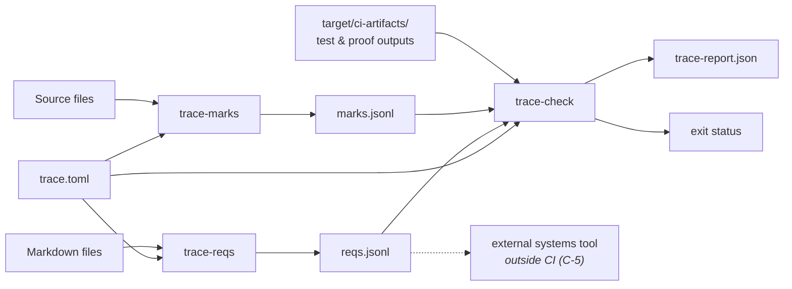
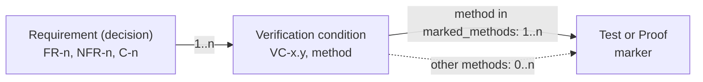

# Requirement Traceability Infrastructure (Design Document)


---

## Introduction

Requirements in `control-rs` are written first, in the Requirements section of
each design document, and the design follows from them. This document
specifies the tooling that checks every requirement is decomposed into
verification conditions and that every condition verified by test or formal
proof is linked to a test or proof harness.

The decomposition follows the vocabulary of MC/DC: a decision is a Boolean
expression composed of conditions and Boolean operators, and a condition
contains no Boolean operator (Hayhurst et al., 2001). A requirement statement
is the decision; its verification conditions are the conditions. Coverage
criteria of this shape can be defined directly on requirements rather than on
code, which keeps the resulting verification traceable to the requirements they
exercise (Whalen et al., 2006). The weakest such criterion asks for at least
one test per requirement (Staats et al., 2010); this design asks for at least
one linked verification item per condition and leaves the stronger criteria open (see
[Extension Path](#extension-path)).

The tooling rests on three concepts. A **definition** is the one line where a
requirement ID is introduced. A **condition** is a row of a Verification table
that introduces a condition ID, names its parent requirements and states how
it is verified. A **marker** is a line of source text that names the
conditions a test exercises. Three small binaries in `control-rs-ci` handle
one step each:

- `trace-reqs` finds definitions and conditions in Markdown, checks them and
  writes `reqs.jsonl`;
- `trace-marks` finds markers in source text, in any language, and writes
  `marks.jsonl`;
- `trace-check` joins both and writes `trace-report.json` and a coverage
  verdict.

**Concept of operations**

| Actor                     | Action                                                                          | Touches                                          |
|:--------------------------|:--------------------------------------------------------------------------------|:-------------------------------------------------|
| Author                    | Writes requirements and their verification conditions first, then the design   | One Markdown file, in any editor                 |
| Verification author       | Marks each test or proof harness with the conditions it exercises               | Source files                                     |
| Reviewer                  | Reads requirements, conditions and criteria in a pull request                   | Rendered Markdown on GitHub                      |
| Linter (local or CI)      | Reports missing, duplicate or unresolved IDs with `path:line: message`          | The same Markdown and source files               |
| Tracer (CI)               | Reports condition coverage and per-item verification status                     | `reqs.jsonl`, `marks.jsonl`, `trace-report.json` |
| Systems engineer (future) | Builds hierarchies, allocations and verification matrices                       | External tools that read the `.jsonl` files      |

Three principles follow from the table:

1. **Plain text is the source of truth.** A requirement is readable and
   writable without any tool.
2. **The linter is the only tool an author needs.** Editor support comes from
   `path:line: message` diagnostics, which every editor already consumes from a
   terminal, a run configuration or a problem matcher. No plugin, schema,
   snippet or language server is part of the design.
3. **Everything beyond lint and trace is optional and external.** Systems-level
   features consume the generated `.jsonl` files and never enter the CI path of
   this workspace.

**Two audiences.** `control-rs` always follows
`documentation/design-template.md`, and its configuration encodes that
template. External users of `control-rs-ci` describe their own layout with the
same few patterns (see [Configuration](#configuration)).

**Scope.** In scope: definitions, conditions, markers, the checks over them,
the Requirement → Condition → Verification Item hierarchy inside one design document,
coverage and item status derivation, and the generated artifacts. Out of scope:
test adequacy; condition, decision and MC/DC coverage of requirements (see
[Extension Path](#extension-path)); code-level structural coverage;
requirement-to-requirement hierarchies; citation, reference and general
document style, which an external, unpublished review tool owns; requirement
editing tools; and any systems-engineering view.

---

## Requirements

### Functional Requirements

- **FR-1 — Definitions**: `trace-reqs` shall record one definition for the
  first requirement ID on each line that matches the `definition` pattern,
  with the definition text formed per [Matching Rules](#matching-rules).
- **FR-2 — Conditions**: `trace-reqs` shall record one condition row for each
  line that matches the `verification` pattern, with the condition ID on the
  line as `id`, every requirement ID outside condition IDs as `parents`, and
  the method named in a code span as `method`.
- **FR-3 — Qualified IDs**: `trace-reqs` shall qualify every recorded ID as
  `<doc>#<id>` per [Matching Rules](#matching-rules), so that equal IDs in
  different documents never collide, and shall recognize an ID only at word
  boundaries.
- **FR-4 — Checks**: `trace-reqs` shall report as a defect: a requirement or
  condition defined more than once; a condition with no parent or with an
  undefined parent; a verification row with no condition ID or with more than
  one; a condition row with no method, with more than one, or with one outside
  `methods`; a defined requirement with no condition; and a retired ID that is
  defined or referenced.
- **FR-5 — Phrase Rules**: `trace-reqs` shall report as a defect each match of
  an `exclude_phrases` pattern in definition text.
- **FR-6 — Requirement Rows**: `trace-reqs` shall write `reqs.jsonl` with one
  row per definition and per condition, in the row schema of
  [Artifacts](#artifacts).
- **FR-7 — Marker Rows**: `trace-marks` shall write one `marker` row per
  qualified ID in each marker span, per [Source Markers](#source-markers), and
  shall report as a defect a span with no ID, an ID without `<doc>#`, an ID
  with a tag, and a span still unclosed at 16 lines.
- **FR-8 — Coverage Verdict**: `trace-check` shall derive condition and
  requirement status per [Status Derivation](#status-derivation), write
  `trace-report.json`, and exit 0 iff no condition is `Uncovered` or `Fail`, every
  marker names a defined condition, and no marker names a requirement.
- **FR-9 — Diagnostic Format**: `trace-reqs`, `trace-marks` and `trace-check`
  shall report each defect as one `path:line: message` line and shall exit
  non-zero when any defect exists.
- **FR-10 — File Selection**: `trace-reqs` and `trace-marks` shall select their
  input files per [File Selection](#file-selection).

### Non-Functional Requirements

- **NFR-1 — Audit Latency**: Each of the three binaries shall complete on the
  `control-rs` workspace in under 1 s of wall-clock time, excluding compilation.
- **NFR-2 — Zero Runtime Intrusion**: A marker shall expand to the item it
  marks unchanged, so that no marker changes compiled output for any target.
- **NFR-3 — Dependency Budget**: The three binaries shall add no dependency to
  `control-rs-ci` beyond its current set and the `regex` crate; the `#[req]`
  crate shall depend only on `syn` and `proc-macro2`.
- **NFR-4 — Schema Versioning**: Every row and `trace-report.json` shall carry
  an integer `schema` field, incremented on every incompatible change.

### Constraints

- **C-1 — Plain-Text Source**: Requirements and their verification shall live in
  the Markdown files the configuration lists; no generated file shall be
  committed or required for reading or writing a requirement.
- **C-2 — No Editor Integration**: The design shall deliver diagnostics only; it
  shall ship no editor plugin, schema, snippet or language server.
- **C-3 — Paths from Configuration**: Every input and output path of the three
  binaries shall arrive from a command-line argument or the configuration file.
- **C-4 — Read-Only Inputs**: The tracer shall run no test, build or gate; it
  reads Markdown, source text, the configuration, its own artifacts, and
  per-item test and proof verification artifacts from `target/ci-artifacts/`.
- **C-5 — External Systems Tooling**: Hierarchy views, allocation, verification
  matrices and model export shall consume the `.jsonl` files outside this
  workspace's CI path.
- **C-6 — Artifact Location**: The three binaries shall write under
  `target/ci-artifacts/` when run as gates; `#[req]` shall write nothing.
- **C-7 — Document Style Exclusion**: `trace-reqs` shall check no citation,
  reference or general document style.
- **C-8 — Per-Item Verification Status**: The tracer shall derive condition
  status from per-item test and proof results; it shall never infer condition
  status from aggregate gate verdicts.

---

## Technical Overview

### Author Workflow

1. **Define the requirement** in the Requirements section:

   ```markdown
   - **FR-3 — Packed Storage**: Packed symmetric, Hermitian and triangular storage
     shall return `None` from `value(i, j)` when `i` or `j` is out of bounds.
   ```

2. **Decompose it into conditions** in the Verification table. Each row
   introduces one condition, names its parent requirements, gives one method
   and states the pass condition. The Criterion of the first condition states
   how the conditions combine into the requirement:

   ```markdown
   | Condition | Requirement | Method   | Criterion                                                        |
   |:----------|:------------|:---------|:-----------------------------------------------------------------|
   | VC-3.1    | FR-3        | `test`   | Row index out of bounds gives `None`; FR-3 holds iff both hold   |
   | VC-3.2    | FR-3        | `test`   | Column index out of bounds gives `None`                          |
   ```

3. **Mark the tests and proof harnesses** that exercise each `test` or
   `proof` condition. Rust uses the `#[req]` attribute placed on `#[test]`
   functions or `#[kani::proof]` harnesses; any other language uses the marker
   text the configuration names, such as `// req: storage#VC-3.1`:

   ```rust
   #[req("storage#VC-3.1", "storage#VC-3.2")]
   #[test]
   fn packed_value_out_of_bounds_is_none() { /* ... */ }

   #[req("fixed#VC-3.1")]
   #[kani::proof]
   fn prove_saturating_div_no_panic() { /* ... */ }
   ```

4. **Run `cargo trace-reqs`, `cargo trace-marks` and `cargo trace-check`.**
   Each problem prints as `path:line: message`, which the editor turns into a
   clickable link:

   ```text
   documentation/math/storage-design.md:212: storage#VC-3.2 has no marked test
   ```

To withdraw a requirement or condition, delete it and add its qualified ID to
`retired` in the configuration. The ID is never reused.

### Reading the Output

Every line of `reqs.jsonl` and `marks.jsonl` is one occurrence of one ID:

```json lines
{
  "schema": 2,
  "id": "storage#FR-3",
  "kind": "definition",
  "file": "documentation/math/storage-design.md",
  "line": 42,
  "text": "- **FR-3 — Packed Storage**: Packed symmetric ... out of bounds."
}
{
  "schema": 2,
  "id": "storage#VC-3.1",
  "kind": "condition",
  "parents": ["storage#FR-3"],
  "method": "test",
  "file": "documentation/math/storage-design.md",
  "line": 211,
  "text": "| VC-3.1 | FR-3 | `test` | Row index out of bounds gives `None`; FR-3 holds iff both hold |"
}
{
  "schema": 2,
  "id": "storage#VC-3.1",
  "kind": "marker",
  "file": "src/math/storage/tests.rs",
  "line": 119,
  "text": "#[req(\"storage#VC-3.1\", \"storage#VC-3.2\")]"
}
```

Grouping rows by `id` gives everything known about a condition; following
`parents` gives its requirements. No field depends on configuration to be
understood.

### Data Flow


```mermaid
flowchart LR
    Cfg["trace.toml"] --> TR
    Cfg --> TM
    Cfg --> TC
    Docs["Markdown files"] --> TR["trace-reqs"]
    TR --> RJ["reqs.jsonl"]
    Src["Source files"] --> TM["trace-marks"]
    TM --> MJ["marks.jsonl"]
    RJ --> TC["trace-check"]
    MJ --> TC
    Res["target/ci-artifacts/<br/>test & proof outputs"] --> TC
    TC --> Rep["trace-report.json"]
    TC --> Exit["exit status"]
    RJ -.-> Ext["external systems tool<br/><i>outside CI (C-5)</i>"]
```

### Traceability Model


```mermaid
flowchart LR
    R["Requirement (decision)<br/>FR-n, NFR-n, C-n"] -->|"1..n"| V["Verification condition<br/>VC-x.y, method"]
    V -->|"method in marked_methods: 1..n"| T["Test or Proof<br/>marker"]
    V -.->|"other methods: 0..n"| T
```

A condition may have more than one parent, such as one review condition covering
every constraint. Verification outcomes are derived from per-item results: a
marked test or proof harness evaluates to a boolean pass or fail, and `trace-check`
aggregates item outcomes into condition statuses (C-8).

**Where requirements live.** Requirements stay in the design documents.
Measured on 2026-09-26, the corpus holds 268 requirements in 23
`*-design.md` files, 244 of them in 20 Approved documents. Keeping them in place
needs no migration, keeps each requirement next to its rationale and renders on
GitHub. The `-design.md` suffix already serves as a file-type pattern for editor
rules (`files.associations` in VS Code, file-type patterns in JetBrains IDEs).

---

## Architecture

### Configuration

All three binaries read one TOML file named by `--config`. The `control-rs`
configuration:

```toml
id = '(?:FR|NFR|C)-[0-9]+[a-z]?'
condition = 'VC-[0-9]+(?:\.[0-9]+[a-z]?)?'
doc = '[a-z0-9-]+'
files = ["documentation/vv/requirement-traceability-design.md"]
doc_suffix = "-design"
definition = '^- \*\*(?:FR|NFR|C)-'
verification = '^\| *(?:[a-z0-9-]+#)?VC-'
methods = ["test", "proof", "analysis", "inspection", "review"]
marked_methods = ["test", "proof"]
retired = []
exclude_phrases = []

[method.test]
item_rule = "#\\[test\\]|#\\[tokio::test\\]"
result_artifact = "target/ci-artifacts/test.log"

[method.proof]
item_rule = "#\\[kani::(?:proof|proof_for_contract)\\]"
result_artifact = "target/ci-artifacts/kani.log"

[markers]
files = ["src", "tests", "benches", "control-rs-trace-macros/tests", "control-rs-ci/src", "control-rs-ci/tests"]
suffixes = [".rs"]
marker = "#[req("
```

| Key                | Meaning                                                                                                        |
|:-------------------|:---------------------------------------------------------------------------------------------------------------|
| `id`               | Regex for one requirement ID                                                                                   |
| `condition`        | Regex for one condition ID; optional (defaults to `VC-[0-9]+(?:\.[0-9]+[a-z]?)?`)                              |
| `doc`              | Regex for the document name in a qualified ID `<doc>#<id>`                                                     |
| `files`            | Markdown files, and directories whose `<doc_suffix>.md` files are read (see [File Selection](#file-selection)) |
| `doc_suffix`       | Text removed from the file stem to form the document name; optional                                            |
| `definition`       | Regex for a line that defines a requirement                                                                    |
| `verification`     | Regex for a line that defines a condition                                                                      |
| `methods`          | Verification methods a condition may name                                                                      |
| `marked_methods`   | The subset of `methods` whose conditions need at least one marker                                              |
| `method.<m>`       | Item rule regex and result artifact path for marked method `<m>`                                               |
| `retired`          | Qualified IDs that must not be defined or referenced again                                                     |
| `exclude_phrases`  | Regexes; each match in definition text is a defect; optional                                                   |
| `markers.files`    | Source files, and directories whose files ending in a suffix are read; `[markers]` is optional                 |
| `markers.suffixes` | File-name endings of the source files to read, such as `.rs`                                                   |
| `markers.marker`   | Text that makes a source line a marker, such as `#[req(`                                                       |

Without `[markers]`, `trace-marks` writes an empty `marks.jsonl`.

### File Selection

`files` and `markers.files` list roots relative to the working directory.

- A root that is a file is selected.
- A root that is a directory selects every file below it whose name ends in a
  suffix: `<doc_suffix>.md` for `files`, each of `markers.suffixes` for
  `markers.files`.
- Symbolic links are never followed, so a walk cannot loop.
- A root that is missing, or is neither a file nor a directory, is an error.

### Matching Rules

The rules below are the whole parser:

1. Lines inside fenced code blocks, including indented fences, are skipped,
   so examples are inert.
2. An ID occurrence is a match of `id` or `condition` bounded by word
   boundaries, optionally preceded by a match of `doc` and `#`. A requirement
   ID inside a condition ID, or inside a longer token such as `IEC-61508`, is
   not an occurrence.
3. A line that matches `definition` defines the first requirement ID on it.
   Its text is the line plus the indented lines that follow it.
4. A line that matches `verification` defines the condition ID on it. Every
   requirement ID on the line is a parent, and the one code span whose content
   is in `methods` is the method.
5. The document name is the file stem with `doc_suffix` removed:
   `storage-design.md` becomes `storage`. An ID written without `<doc>#`
   belongs to the document it appears in.
6. The phrase rule runs on definition text with backtick spans removed, so
   identifiers never match.

### Checks

| Check            | Defect                                                                                   |
|:-----------------|:-----------------------------------------------------------------------------------------|
| `duplicate`      | A requirement or condition ID is defined more than once                                  |
| `unresolved`     | A condition names a parent that is not defined                                           |
| `orphan`         | A condition names no parent                                                              |
| `row`            | A verification row names no condition ID, or more than one                               |
| `method`         | A condition names no method, more than one, or one outside `methods`                     |
| `missing`        | A defined requirement has no condition                                                   |
| `retired`        | A retired ID is defined or referenced                                                    |
| `exclude-phrase` | A match of an `exclude_phrases` pattern in definition text; one defect per match, quoted |

The phrase check follows the lexical-smell approach of Femmer et al. (2016);
the patterns are the project's choice.

### Source Markers

A **marker line** is a source line that contains the `markers.marker` text,
such as `#[req(` in Rust, `# req:` in Python or `// req:` in C. A **marker
span** is the marker line, extended through the following lines only while a
parenthesis opened after the marker text is still unclosed, up to 16 lines. A
`rustfmt`-wrapped attribute is one span; a comment marker is one line.

A marker ID has the form `<doc>#<id>[=<tag>]`. Each qualified ID in a span
yields one `marker` row whose `text` is the span. The tag is reserved for the
[Extension Path](#extension-path) and is a defect in this revision, as are a
span with no ID, an ID without `<doc>#` and a span still unclosed at 16 lines.
`trace-marks` reads text only, so markers work in any language and do not
depend on what a build compiles.

In Rust the marker is the `#[req]` attribute, placed on the item it marks, with
qualified condition IDs as string arguments. It lives in its own proc-macro
crate, `control-rs-trace-macros`, apart from the ETS macros of
`control-rs-macros` (`macros-design.md`). The compiler attaches it to that
item, as mantra does with its `req` attribute macro (Hatzl, 2026b). The macro
returns the item unchanged and writes nothing; an argument that is not
`<doc>#<id>`, or that carries a tag, is a compile error.

Marked verification items must satisfy the configured `item_rule` for their
method:
- For `test`, the marked item must match `#[test]` or `#[tokio::test]`.
- For `proof`, the marked item must match `#[kani::proof]` or
  `#[kani::proof_for_contract]`.

`trace-marks` records each marker span, and `trace-check` validates that the
target item matches the expected item rule.

### Status Derivation

Condition status is derived from marked verification items and their execution
results in `target/ci-artifacts/`:

| Condition                                                  | Status      | Fails gate |
|:-----------------------------------------------------------|:------------|:-----------|
| Method in `marked_methods`, marked items exist, all passed | `Pass`      | no         |
| Method in `marked_methods`, any marked item failed         | `Fail`      | yes        |
| Method in `marked_methods`, no result recorded for item    | `Unrun`     | yes        |
| Method in `marked_methods`, no marker in source text       | `Uncovered` | yes        |
| Method outside `marked_methods`                            | `Review`    | no         |

`trace-check` reads per-item results using deterministic tool-specific rules:
- **Test results (`test.log`)**: Line-oriented libtest output. A test line
  `test <path> ... ok` maps to a passing item; `test <path> ... FAILED` maps to
  a failed item.
- **Proof results (`kani.log`)**: Bounded model checking output. A harness
  `Checking harness <path>...` maps to a passing item iff Kani reports
  `VERIFICATION:- SUCCESSFUL` and all evaluated cover properties are
  `SATISFIED`. An assertion failure, unwinding failure, or unsatisfiable cover
  witness maps to a failed item.

**Interpreter enforcement and warnings.** Miri serves as a secondary interpreter
for test execution rather than a distinct verification method. When processing
test items, `trace-check` emits two classes of non-fatal warnings:
- **W-1 (`cfg_attr(miri, ignore)` present)**: Emitted when a marked test item
  contains a Miri ignore attribute, signaling conditional omission under
  undefined behavior analysis.
- **W-2 (Unexecuted under Miri)**: Emitted when a marked test item recorded in
  `test.log` is absent from `miri.log`.

A requirement takes the worst status of its conditions, in the order
`Fail`, `Unrun`, `Uncovered`, `Review`, `Pass`. A marker counts toward every
condition it names. A marker that names a requirement, or an ID with no
definition or condition row, fails the gate.

`trace-report.json` holds `schema` (3), summary counts per status, one entry
per requirement (ID, status, and child conditions with method, status, marker
locations, and item outcomes), the `Review` conditions awaiting sign-off,
unresolved markers, and interpreter warnings (W-1 and W-2).

### Artifacts

| Field     | Meaning                                                                    |
|:----------|:---------------------------------------------------------------------------|
| `schema`  | Row format version, `3` (NFR-4)                                            |
| `id`      | Qualified ID, `<doc>#<id>`                                                 |
| `kind`    | `definition`, `condition` or `marker`                                      |
| `parents` | Condition rows only: qualified parent requirement IDs                      |
| `method`  | Condition rows only: the verification method                               |
| `file`    | Path relative to the working directory                                     |
| `line`    | 1-based line number                                                        |
| `text`    | The matched line; for a definition, its full text; for a marker, its span  |

In `text`, each run of whitespace, line breaks included, becomes one space, and
none remains at either end. A wrapped definition therefore reads as one line,
and a phrase pattern matches across the wrap.

Rows are sorted by `file`, then `line`. Examples are in
[Reading the Output](#reading-the-output).

### Invocation and Gate Wiring

| Binary        | Gate and placement                      | Arguments                                                                                                                                         |
|:--------------|:----------------------------------------|:--------------------------------------------------------------------------------------------------------------------------------------------------|
| `trace-reqs`  | `trace-reqs`, `lint` group              | `--config .cargo/trace/trace.toml --out target/ci-artifacts/reqs.jsonl`                                                                           |
| `trace-marks` | `trace-marks`, `lint` group             | `--config .cargo/trace/trace.toml --out target/ci-artifacts/marks.jsonl`                                                                          |
| `trace-check` | `trace`, `post` exclusive stage         | `--config .cargo/trace/trace.toml --reqs target/ci-artifacts/reqs.jsonl --marks target/ci-artifacts/marks.jsonl --out target/ci-artifacts/trace-report.json` |

`trace-reqs` and `trace-marks` run early in the concurrent `lint` group to
extract requirement definitions and source markers. `trace-check` runs in the
`post` exclusive stage after test execution and `kani` formal verification
complete, ensuring all per-item verification result logs are present in
`target/ci-artifacts/` before condition status derivation.

### Adoption

Existing verification tables carry no condition IDs or methods, so every
existing requirement would report a `missing` defect. `files` is therefore
the adoption mechanism: it lists documents one by one as each is migrated and
becomes the directory `documentation` when the last one is done. A document
outside `files` is not checked at all; a document inside it is checked in full.

### Extension Path

Coverage criteria defined on requirements form a ladder. Requirements coverage
asks for one test per requirement that causes it to be met (Staats et al.,
2010). Unique-first-cause coverage asks that every basic condition take all
outcomes and be shown to affect the outcome of its formula independently, and
is adapted from MC/DC (Staats et al., 2010). MC/DC over a decision with n
inputs needs, in general, at least n + 1 test cases (Hayhurst et al., 2001).

| Level              | Obligation                                        | This revision                                  |
|:-------------------|:--------------------------------------------------|:-----------------------------------------------|
| Linked             | One marked test per `test` condition              | Enforced                                       |
| Condition coverage | A marked test driving each condition each way     | Reserved: marker tag `=<tag>`                  |
| Decision coverage  | The requirement observed both true and false      | Not representable in markers                   |
| Unique cause       | Independence pairs per condition                  | Review of the Criterion                        |

Four choices keep the stronger levels additive:

1. The marker grammar reserves `=<tag>`, so enabling tags relaxes a check and
   changes the meaning of no existing marker.
2. Condition IDs are never reused (`retired`), so later tags attach to stable
   IDs.
3. A later `outcome` field on marker rows is a schema increment (NFR-4); the
   `.jsonl` files stay the interface for external tools (C-5).
4. The Criterion states how the conditions combine into the requirement, so a
   reviewer can check independence pairs now.

---

## Alternatives

| Alternative                                                                       | Rejected Because                                                                                                                                                                                                         | Reference              |
|:----------------------------------------------------------------------------------|:-------------------------------------------------------------------------------------------------------------------------------------------------------------------------------------------------------------------------|:-----------------------|
| **Requirement status from gate verdicts**                                         | A gate verdict aggregates many tests; its failure says nothing about one requirement, and reading results ties the tracer to gate order and to which gates a trigger ran.                                                 | n/a                    |
| **Direct requirement-to-test links**                                              | Skips the condition decomposition; one marker on a requirement would satisfy every way the requirement can hold or fail.                                                                                                 | Whalen et al. (2006)   |
| **Condition coverage through outcome-tagged markers**                             | Deferred: buys condition coverage but not independence, at least doubles the marked tests per condition during migration, and fixes a model before the corpus is decomposed. The tag grammar is reserved.                 | Staats et al. (2010)   |
| **Mechanical MC/DC over requirements**                                            | Needs every condition's value in every test, from instrumentation or execution traces; a text tracer cannot observe it (C-4).                                                                                            | Hayhurst et al. (2001) |
| **Code-level MC/DC in the tracer**                                                | Measures code structure, not requirements, and the unstable MC/DC instrumentation in `rustc` has been removed; code-level MC/DC belongs to a separate gate.                                                                     | Rust Project Developers (2025) |
| **Test-level verdicts from libtest JSON**                                         | The format is unstable and requires `-Z unstable-options`; test outcomes belong to the gates (C-8).                                                                                                                      | Rust Project Developers (2026) |
| **Named captures, requirement blocks and link attachment**                        | Meaning hid in capture-group names and position-dependent parsing state; the generated rows mirrored parser internals and could not be read without the configuration.                                                   | n/a                    |
| **Fixed grammar with configured section, table and column names**                 | Many keys with distinct semantics, still bound to headings and pipe tables.                                                                                                                                              | n/a                    |
| **Adoption baseline file and previous-artifact ID check**                         | Two baselines with different formats and a workflow restore step; listing migrated documents in `files` ratchets adoption with no new concept, and `retired` covers ID reuse.                                            | n/a                    |
| **Structured JSON or TOML requirement files**                                     | Each step toward better editing (per-area schemas, snippets, IDE-specific workarounds) added machinery an author must understand before writing a requirement; TOML adds worse multi-line text.                          | n/a                    |
| **`// req:` comment markers in Rust**                                             | Nothing ties a comment to the item below it and nothing checks its IDs at compile time; the compiler attaches an attribute to its item. Other languages use comment markers through `markers.marker`.                    | Hatzl (2026b)          |
| **Link records written by `#[req]` at compile time**                              | Records depended on what a build compiled and on the build cache, went stale until a clean build, and editors that expand macros wrote records for unsaved edits. Reading source text has none of these failure modes.   | n/a                    |
| **Globs with `!` exclusions and `depth`**                                         | A glob engine and a symbolic-link rule table to select a handful of directories; roots plus a suffix select the same files.                                                                                              | n/a                    |
| **Hand-written matcher instead of the `regex` crate**                             | Users would learn a bespoke pattern language; regular expressions are already known. The cost is one dependency (NFR-3).                                                                                                 | n/a                    |
| **Requirement smells as a Vale style**                                            | Vale cannot scope rules to requirement text; the rules would fire on rationale prose. Vale remains the prose gate.                                                                                                       | n/a                    |
| **Editor plugins, schemas or a language server**                                  | Adds per-editor machinery; `path:line: message` works everywhere (C-2).                                                                                                                                                  | n/a                    |
| **OpenFastTrace (Java)**                                                          | Adds a Java runtime to CI.                                                                                                                                                                                               | OpenFastTrace (2026a, 2026b) |
| **StrictDoc (Python)**                                                            | Adds a Python toolchain and its own `.sdoc` grammar.                                                                                                                                                                     | StrictDoc (2026)       |
| **mantra (Rust)**                                                                 | Relies on a database and line-coverage pairing rather than conditions.                                                                                                                                                   | Hatzl (2026a)          |
| **Doorstop**                                                                      | One YAML file per requirement; loses requirements-beside-rationale.                                                                                                                                                      | Doorstop (2026)        |

---

## Verification & Validation

### Verification

| Condition | Requirement                                     | Method   | Criterion                                                                                                                             |
|:----------|:------------------------------------------------|:---------|:--------------------------------------------------------------------------------------------------------------------------------------|
| VC-1.1    | FR-1                                            | `test`   | Definition fixtures yield exactly the expected rows, with normalized text and indented continuation lines                            |
| VC-2.1    | FR-2                                            | `test`   | A condition row yields one row with every parent and its method; a row with more than one parent yields one row                           |
| VC-3.1    | FR-3                                            | `test`   | Local and qualified IDs resolve to `<doc>#<id>`; an ID inside a longer token or inside a condition ID is not recorded                 |
| VC-4.1    | FR-4                                            | `test`   | One fixture per defect kind of the Checks table yields exactly that defect                                                            |
| VC-5.1    | FR-5                                            | `test`   | Every excluded-phrase match outside code spans is reported; an empty list disables the rule                                           |
| VC-6.1    | FR-6                                            | `test`   | Two runs on an unchanged corpus produce byte-identical `reqs.jsonl`                                                                   |
| VC-7.1    | FR-7                                            | `test`   | Python and C markers followed by code yield the marker line only; a wrapped Rust attribute spans to its closing parenthesis; both hold |
| VC-7.2    | FR-7                                            | `test`   | An unqualified ID, a tagged ID, an empty marker and a span unclosed at 16 lines are each one defect                                   |
| VC-8.1    | FR-8                                            | `test`   | A fixture of covered, uncovered and review conditions, a marker on a requirement and an unresolved marker gives the specified statuses and exit code |
| VC-9.1    | FR-9                                            | `test`   | Every diagnostic line matches `^[^:]+:[0-9]+: .+$`; any defect gives a non-zero exit                                                  |
| VC-10.1   | FR-10                                           | `test`   | Selection fixtures: file root, suffix filter, symbolic link and missing root                                                          |
| VC-11.1   | NFR-1                                           | `review` | Median of 5 runs under 1.0 s per binary on the workspace                                                                              |
| VC-12.1   | NFR-2                                           | `test`   | A marked struct, function and test behave as unmarked; a tagged or unqualified argument fails to compile                              |
| VC-13.1   | NFR-3                                           | `review` | `cargo tree` shows no dependency beyond the budget                                                                                    |
| VC-14.1   | NFR-4                                           | `test`   | Every row and the report carry `schema` 3; a row of another schema is rejected                                                        |
| VC-15.1   | C-1, C-2, C-3, C-4, C-5, C-6, C-7, C-8          | `review` | The diff adds no violation of any constraint                                                                                          |
| VC-16.1   | C-4, C-8                                        | `proof`  | Bounded model checking verifies that marked proof harnesses satisfy safety and non-vacuity contracts without panic                    |

### Limits

- The tracer shows that each `test` and `proof` condition has a marked
  verification item. It does not show that the test drives the condition both
  ways or shows its independent effect on the requirement; the Criterion states
  the combination and review checks it.
- A marker's claim is not checked against what the test or proof harness does.
- A marked test that is compiled out or ignored still counts; the log of the
  gate that runs it is the evidence that it ran.
- Markers are found by text. A marker line inside a comment or string literal
  counts like any other.
- Every requirement ID on a verification row is a parent, including one
  mentioned in the Criterion, and a second condition ID or a second method
  code span is a defect. Criteria therefore name neither.
- A requirement deleted without being added to `retired` is not detected;
  review of the diff is the control.
- Phrase checks are lexical. They catch configured patterns, not ambiguity in
  general.

---

## Performance & Resource Considerations

- All three binaries are single-pass and line-oriented; each line is tested
  against a handful of compiled patterns. Cost is dominated by file I/O.
  Measured on 2026-09-27 against rev 1.11 of this document: `trace-reqs` 16 ms,
  `trace-marks` 36 ms.
- Artifacts are small: one row per definition, condition and marker.
- `regex` brings `aho-corasick`, `memchr`, `regex-automata` and
  `regex-syntax`, with no proc-macro crate. `control-rs-compare` already
  depends on it, so the lockfile gains no crate.
- `control-rs-trace-macros` depends on `syn` and `proc-macro2`, which
  `control-rs-macros` already brings into the lockfile; a crate that carries
  markers takes it as a dev-dependency.

---

## Risks & Open Questions

- **Migration effort.** Each of the 23 documents needs condition IDs and
  methods in its Verification table before it joins `files`. Converting
  numbered headings (586) and `§n` cross-references (472) to the unnumbered
  template is separate editorial work that the tracer does not depend on.
- **Decomposition quality.** Coverage is only as good as the conditions an
  author writes; the tracer cannot tell whether a requirement is fully
  decomposed. Review of the Verification table carries that.
- **Deferred criteria.** Outcome tags are reconsidered after the first areas
  migrate, or when an adopter needs condition coverage evidence (see
  [Extension Path](#extension-path)).
- **Document renames.** Renaming a design document changes every qualified ID
  in it, which breaks markers and `retired` entries that name the old
  document. They are updated in the same pull request.
- **Open: DO-178C wording.** The research record quotes the DO-178B MC/DC
  definition through Hayhurst et al. (2001); the DO-178C text of the
  requirements-based and structural coverage analyses has not been quoted.

---

## Development Plan

| Phase / Task                              | Description                                                                                                                                                                    | Estimated Effort |
|:------------------------------------------|:-------------------------------------------------------------------------------------------------------------------------------------------------------------------------------|:-----------------|
| **Phase 1: `trace-reqs`**                 | Word-bounded IDs, condition rows with `parents` and `method`, the Checks table, schema 2, configuration keys `verification`, `methods` and `marked_methods`.                     | 2                |
| **Phase 2: `trace-marks` and `#[req]`**   | Parenthesis-balanced marker spans, reserved tag grammar in the scanner and the macro.                                                                                          | 1                |
| **Phase 3: `trace-check`**                | Coverage derivation per Status Derivation, report schema 2, `--config` in place of gate inputs.                                                                                | 1                |
| **Phase 4: Gate wiring**                  | `trace` joins the `lint` group; the report job's trace step and the runner's retention of other gates' results go (`ci-design.md`).                                            | 1                |
| **Phase 5: Corpus migration**             | Add condition IDs and methods to each document's Verification table and add the document to `files`. One pull request per area.                                                | 3                |
| **Phase 6: Proof & Item Status (PR3-6)**  | `proof` method and `#[kani::proof]` item rule; per-item result evaluation in `trace-check` from `test.log` and `kani.log`; Miri interpreter warnings W-1 and W-2; schema 3; `trace` moved to `post` stage. | 2                |

---

## Revision History

| Revision | Date               | Author          | Description                                                                                                                                                                                                                                                                                                                                                                                                                                                     |
|:---------|:-------------------|:----------------|:----------------------------------------------------------------------------------------------------------------------------------------------------------------------------------------------------------------------------------------------------------------------------------------------------------------------------------------------------------------------------------------------------------------------------------------------------------------|
| 1.5      | September 26, 2026 | @MitchellDScott | Simplified to definitions and references: one `definition` pattern, named reference patterns, six-field rows shared by `reqs.jsonl` and `marks.jsonl`. Removed named captures, requirement blocks, link attachment, `Parent` and `Status`, `malformed`, the adoption baseline and the previous-artifact ID check; adoption through `files`, ID reuse through `retired`. Added Author Workflow and Reading the Output.                                           |
| 1.6      | September 26, 2026 | @MitchellDScott | Globs with `!` exclusions and `depth`; `doc` pattern for qualified IDs; whitespace-normalized `text`; `#[req]` attribute markers in `control-rs-trace-macros` whose link records every build writes and `trace-marks` collects; `trace-check` runs as gate `trace` after every other gate and before the report; a gate run removes no other gate's artifacts; NFR-1 evidence from `trace-reqs` and `trace-marks`; C-3 citation and Phase 1 removals corrected. |
| 1.7      | September 26, 2026 | @MitchellDScott | Stated symbolic-link handling for glob walks: links to directories are not entered during a walk, links to files are selected under their own path, dangling links are ignored and links named in a glob's leading components are resolved. Added the double-selection limit and symbolic-link fixtures to the Plan.                                                                                                                                            |
| 1.8      | September 26, 2026 | @MitchellDScott | Dropped `require_phrases`; each match of an `exclude_phrases` pattern is a defect that quotes the match. The Acceptance bound for the checks counts every expected defect. Reference [6] follows the research record, and the ISO/IEC/IEEE 29148 citation is removed until a quoted source exists.                                                                                                                                                              |
| 1.9      | September 26, 2026 | @MitchellDScott | Markers are found in source text: `trace-marks` reads `[markers]` (roots, suffixes, marker text) and works for any language; `#[req]` checks its IDs and writes nothing. Globs replaced by roots plus suffix, with symbolic links never followed; `depth` removed. Removed the link-record Limits and the compiler-path and editor-expansion Risks; the gate-name overlap joins the reference-line Limit.                                                       |
| 1.10     | September 26, 2026 | @MitchellDScott | Merged Plan and Acceptance into a single Verification table (`Requirements \| Gates \| Criterion`). One reference kind `verification` replaces `plan` and `acceptance`; the pattern matches a row whose first cell starts with a requirement ID. Removed the Kind column, the gate-name overlap Limit, the row-shape Risk, and the acceptance-not-evaluated Limit. Updated template, `trace.toml`, tracer tests.                                                 |
| 1.11     | September 26, 2026 | @MitchellDScott | Upgraded to 3-tier hierarchy (Requirement → Verification Conditions → Tests). Added condition extraction (`VC-x.y`), `parent` linking in row schema, multi-line marker look-ahead, and hierarchical condition status derivation requiring marker evidence for test gates.                                                                                                                                                                                     |
| 1.12     | September 27, 2026 | @MitchellDScott | Condition coverage replaces gate linkage: requirements are decisions decomposed into conditions, tests link to conditions only, and `trace-check` reads no gate result (C-4, C-8). `Method` replaces `Gates`; `[references]` and direct requirement rows removed; word-bounded IDs; `parents` and `method` on condition rows; parenthesis-balanced marker spans; reserved `=<tag>` marker grammar and Extension Path; File Selection requirement (FR-10); schema 2; `trace` moves to the `lint` group. |
| 1.13     | September 27, 2026 | @MitchellDScott | Removed the `test_gates` key and the `default = false` gate Limit left from rev 1.11; `condition` default written without doubled escapes. Implementation aligned: `methods` and `marked_methods` required, `row` and `method` checks, tagged-ID and unclosed-span defects, `#[req]` rejects tags. |
| 1.14     | September 28, 2026 | @MitchellDScott | Upgraded for formal methods and per-item verification status (PR3-6): added `proof` method and `#[method.proof]` (`#[kani::proof]`); updated C-4 and C-8 to evaluate per-item test and proof result logs (`test.log`, `kani.log`); defined condition statuses `Pass`, `Fail`, `Unrun`, `Uncovered`, and `Review`; added Miri interpreter warnings W-1 and W-2; moved `trace` to `post` exclusive stage; bumped schema to 3. Added DO-333 and Kani references. |

---

## References

[1] K. J. Hayhurst, D. S. Veerhusen, J. J. Chilenski, and L. K. Rierson, "A
Practical Tutorial on Modified Condition/Decision Coverage," NASA Langley
Research Center, Hampton, VA, USA, Rep. no. NASA/TM-2001-210876, 2001.

[2] M. W. Whalen, A. Rajan, M. P. E. Heimdahl, and S. P. Miller, "Coverage
metrics for requirements-based testing," in *Proc. ACM/SIGSOFT Int. Symp.
Software Testing and Analysis (ISSTA 2006)*, Portland, ME, USA, 2006,
pp. 25–36, doi: 10.1145/1146238.1146242.

[3] M. Staats, M. W. Whalen, M. P. E. Heimdahl, and A. Rajan, "Coverage Metrics
for Requirements-Based Testing: Evaluation of Effectiveness," in *Proc. 2nd
NASA Formal Methods Symp. (NFM 2010)*, Washington, DC, USA, 2010.

[4] H. Femmer, D. Méndez Fernández, S. Wagner, and S. Eder, "Rapid quality
assurance with Requirements Smells," *Journal of Systems and Software*, 2016,
doi: 10.1016/j.jss.2016.02.047.

[5] M. Hatzl, *mantra-rust-macros* (Version 0.7.8). [Online]. Available:
https://docs.rs/crate/mantra-rust-macros/latest. Accessed: Sep. 11, 2026.

[6] Rust Project Developers, "coverage: Remove all unstable support for MC/DC
instrumentation (#144999)," in *rust-lang/rust*. [Online]. Available:
https://github.com/rust-lang/rust/commit/562222b73765a326fa800a075814deaf627874df.
Accessed: Sep. 27, 2026.

[7] The Rust Project Developers, "3558-libtest-json," *The Rust RFC Book*.
[Online]. Available: https://rust-lang.github.io/rfcs/3558-libtest-json.html.
Accessed: Sep. 11, 2026.

[8] OpenFastTrace, "doc/user_guide.md," in *itsallcode/openfasttrace*.
[Online]. Available:
https://github.com/itsallcode/openfasttrace/blob/main/doc/user_guide.md.
Accessed: Sep. 11, 2026.

[9] OpenFastTrace, "doc/spec/system_requirements.md," in
*itsallcode/openfasttrace*. [Online]. Available:
https://github.com/itsallcode/openfasttrace/blob/main/doc/spec/system_requirements.md.
Accessed: Sep. 11, 2026.

[10] StrictDoc, "User Guide," *StrictDoc Documentation*. [Online]. Available:
https://strictdoc.readthedocs.io/en/stable/stable/docs/strictdoc_01_user_guide.html.
Accessed: Sep. 11, 2026.

[11] M. Hatzl, "README.md," in *mhatzl/mantra*. [Online]. Available:
https://github.com/mhatzl/mantra. Accessed: Sep. 11, 2026.

[12] Doorstop, "Validating Requirements," *Doorstop Documentation*. [Online].
Available: https://doorstop.readthedocs.io/en/latest/cli/validation.html.
Accessed: Sep. 11, 2026.

[13] Kani Rust Verifier Contributors, "The Kani Rust Verifier Documentation and
Source," *model-checking/kani GitHub repository*. [Online]. Available:
https://github.com/model-checking/kani. Accessed: Sep. 28, 2026.

[14] Y. Moy, E. Ledinot, H. Delseny, V. Wiels, and B. Monate, "Testing or
Formal Verification: DO-178C Alternatives and Industrial Experience," *IEEE
Software*, vol. 30, no. 3, pp. 50–57, 2013, doi: 10.1109/MS.2013.43.

[15] D. Cofer and S. P. Miller, "Formal Methods Case Studies for DO-333," NASA
Langley Research Center, Hampton, VA, USA, Rep. no. NASA/CR-2014-218244, 2014.
[Online]. Available:
https://shemesh.larc.nasa.gov/people/bld/ftp/NASA-CR-2014-218244.pdf. Accessed:
Sep. 28, 2026.
