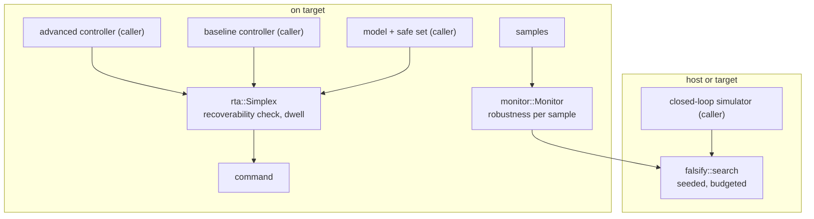

# Safety Validation & Run-Time Assurance (validation-tools)


---

### 1. Introduction

The `validation` module of `control-rs` ships validation as a library
capability: a Simplex-style run-time assurance switch that runs in firmware,
online monitors that compute a robustness margin for bounded temporal
properties, and a falsification search that looks for disturbances that
drive a simulated closed loop to violate a property. The first two run on
target; falsification runs wherever the simulated system runs.

Primary usage scenarios:

- **Run-time assurance**: Firmware runs an advanced, unassured controller and
  a baseline controller under a switch that keeps the plant recoverable.
  Failure is a switch decided too late for the baseline to recover, or a
  switch that oscillates.
- **Runtime monitoring**: Firmware evaluates a property such as "altitude
  stayed above 10 m over the last 2 s" each sample and acts on its margin.
  Failure is a margin that differs from the property's quantitative
  semantics, or memory that grows with run time.
- **Falsification**: An engineer searches a disturbance space for a
  property violation before flight. Failure is a search that is not
  reproducible, or a reported violation the simulator does not reproduce.

---

### 2. Requirements

#### 2.1 Functional Requirements

- **FR-1 — Recoverability switch**: Each step, given the advanced
  controller's command, a baseline controller, a discrete model, a safe-set
  predicate and a horizon $H$, outputs the advanced command only if the
  model's next state is safe and the baseline keeps every state safe for $H$
  further steps from it; otherwise outputs the baseline command.
- **FR-2 — Hysteretic switch-back**: After a switch to the baseline, returns
  to the advanced controller only after FR-1's check has passed for a caller
  dwell count of consecutive steps.
- **FR-3 — Bounded recovery output**: Saturates the baseline command to
  caller limits before output.
- **FR-4 — Monitor formulas**: Evaluates formulas built from predicates
  $g(x) \ge c$, negation, conjunction, disjunction, and past-time
  $\square_{[0,W]}$ (always) and $\lozenge_{[0,W]}$ (eventually) over the
  last $W$ samples, and returns the quantitative robustness value at each
  sample.
- **FR-5 — Online monitor update**: Updates the robustness of a formula from
  one new sample with memory fixed by the formula's windows.
- **FR-6 — Falsification search**: Given a simulator of the closed loop
  parameterized by a disturbance vector within box bounds, a monitor formula
  and an evaluation budget, returns the minimum trace robustness found, the
  parameter that produced it, and whether it is negative.
- **FR-7 — Reproducible search**: The falsification sequence is a
  deterministic function of a caller seed.

#### 2.2 Non-Functional Requirements

- **NFR-1 — Bounded step time**: FR-1 performs at most $H + 1$ model and
  baseline evaluations per step, and FR-5 a number of operations fixed by
  the formula.
- **NFR-2 — No allocation**: All monitor windows, switch state and search
  state are const-sized.

#### 2.3 Constraints

- **C-1 — Caller-assured components**: The baseline controller, model and
  safe-set predicate are the caller's assured functions; the module decides
  switching and does not establish their correctness.
- **C-2 — Root-crate module**: Ships as the new module `src/validation` of
  `control-rs` and adds no dependency.
- **C-3 — Error convention**: Conforms to `error-design.md` NFR-1.
- **C-4 — Excluded scope**: Microcontroller self-test libraries, benchmark
  data collections, reachability analysis, failure-probability estimation
  and future-time or unbounded temporal operators are out of scope.

---

### 3. Technical Overview

ASTM F3269 names the parts of a run-time assurance system: a complex
function performed by an unassured system [1], a safety monitor that
evaluates its behavior to discover misbehavior [1], and a recovery function
that generates bounded output to keep the system safe [1]. The Simplex
decision module switches from the advanced to the baseline controller if
the advanced one could cause a violation in the near future, and cannot
check only that the next state is safe, because inertia can make that too
late [2]. Safety validation by simulation treats the system as a black box
[3], and falsification searches for environment disturbances that cause
failure [3].



The three parts share the monitor: FR-1's safe set and FR-6's property can
both be monitor formulas.

---

### 4. Architecture

#### 4.1 Module Layout

```text
src/validation/
├── mod.rs        # ValidationError; re-exports
├── rta.rs        # Simplex, SwitchState
├── monitor.rs    # Formula, Monitor, robustness
├── falsify.rs    # search, SearchResult, SplitMix64
└── tests/
```

`src/lib.rs` gains `pub mod validation;`.

#### 4.2 Simplex Switch

`Simplex<T, NX, NU, H>` holds the active controller, a dwell counter and the
caller's limits. Each step:

1. Predict $x^+ = f(x, u_{AC})$ with the caller model.
2. Roll the baseline forward from $x^+$ for $H$ steps,
   $x_{k+1} = f(x_k, \operatorname{sat}(u_{BC}(x_k)))$, checking the safe set
   at every state.
3. If every state is safe, the advanced command is admissible; otherwise the
   switch selects the baseline.

Checking only $x^+$ is insufficient [2]; the $H$-step baseline rollout is the
look-ahead. The rollout is the caller-model form of the black-box Simplex
check, whose decision module monitors the state and switches when the
advanced controller could cause a near-future violation [2]. Switch-back
requires the check to pass for the dwell count (FR-2), which prevents
chattering between controllers. The baseline output is saturated to the
caller limits, matching the bounded output of a recovery function [1]
(FR-3).

#### 4.3 Monitors

A `Formula` is a fixed tree, built at compile time from const generics, of
predicates $g_i(x) - c_i$, $\neg$, $\wedge$, $\vee$, and past-time
$\square_{[0,W]}$ and $\lozenge_{[0,W]}$. Robustness follows the
quantitative semantics, a numerical margin by which a trace satisfies or
violates a property [4]: $\rho(g \ge c) = g(x_t) - c$,
$\rho(\neg\varphi) = -\rho(\varphi)$, $\wedge$ and $\vee$ take min and max,
and $\square_{[0,W]}$ and $\lozenge_{[0,W]}$ take min and max of the
subformula's robustness over the last $W$ samples. A positive value
satisfies the property with that margin.

Online monitoring evaluates a property as samples arrive rather than over a
complete trace [5], [6]. Restricting temporal operators to past windows
makes each sample's robustness final when it arrives, so no robust
satisfaction interval is carried. Each windowed operator keeps a ring buffer
of $W$ subformula values and a monotone wedge for its running min or max,
so an update is amortized $O(1)$ per operator and the memory is $W$ values
per operator (FR-5, NFR-2). Before $W$ samples exist, the window covers the
samples seen.

#### 4.4 Falsification

`search` treats the closed loop as a black box [3]. Each evaluation draws a
disturbance parameter uniformly in the box from a seeded SplitMix64
generator, runs the caller's simulator into a fixed trace buffer, runs a
monitor over it, and keeps the minimum final robustness. The search stops at
the budget or at the first negative robustness when the caller asks for
early exit. Random sampling is the Monte Carlo search S-TaLiRo uses to look
for minimal-robustness trajectories [7]. The result carries the seed and
evaluation index of the minimizer so a violation can be replayed exactly
(FR-7).

#### 4.5 Error Handling

```rust
#[derive(Debug, Clone, Copy, PartialEq, Eq)]
pub enum ValidationError {
    /// A model, baseline or simulator call returned a non-finite value.
    NonFiniteModel,
    /// Saturation limits or box bounds are inverted (FR-3, FR-6).
    InvalidBounds,
    /// The evaluation budget is zero (FR-6).
    EmptyBudget,
}
```

The enum has a hand-written `Display` and `impl core::error::Error` (C-3).
An unrecoverable state is not an error: FR-1 reports it through
`SwitchState`.

---

### 5. Alternatives

| Alternative | Rejected Because | Reference |
|:--|:--|:--|
| Next-state safety check | Too late under inertia [2]. | [2] |
| Reachability-based switching | Needs reachable-set computation [6, Chs. 8–10], which is out of scope (C-4); the caller-model rollout is bounded and allocation-free. | [6] |
| Future-time STL with robust satisfaction intervals | Requires intervals over partial traces [5]; past-time windows give final values at each sample and fixed memory. | [5] |
| Optimization, planning, reinforcement-learning or importance-sampling falsifiers | Surveyed families for black-box validation [3] with larger state; Monte Carlo search [7] ships first, the others later. | [3], [7] |
| Microcontroller self-test in this module | A vendor library tests hardware on application demand [8]; it is hardware-specific and excluded by C-4. | [8] |

---

### 6. Verification & Validation

#### 6.1 Verification

| Condition | Requirement | Method | Target | Criterion |
|:--|:--|:--|:--|:--|
| VC-1.1 | FR-1 | `libtest` | `control_rs::validation::rta::tests::double_integrator_stays_safe` | A double integrator with an aggressive advanced controller and a braking baseline never leaves the safe set over $10^4$ random initial states; FR-1 holds iff all conditions hold |
| VC-1.2 | FR-1 | `libtest` | `control_rs::validation::rta::tests::next_state_only_fails` | A configuration with $H = 0$ leaves the safe set on a case where $H = 20$ does not |
| VC-2.1 | FR-2 | `libtest` | `control_rs::validation::rta::tests::dwell_prevents_chatter` | With dwell $d$, consecutive switches are at least $d$ steps apart; FR-2 holds iff all conditions hold |
| VC-3.1 | FR-3 | `libtest` | `control_rs::validation::rta::tests::baseline_saturated` | Every baseline output lies within the limits; FR-3 holds iff all conditions hold |
| VC-4.1 | FR-4 | `libtest` | `control_rs::validation::monitor::tests::robustness_matches_offline` | Online robustness equals a direct offline evaluation of the semantics on 100 random traces exactly; FR-4 holds iff all conditions hold |
| VC-4.2 | FR-4 | `libtest` | `control_rs::validation::monitor::tests::sign_matches_boolean` | The robustness sign equals the Boolean satisfaction on traces away from zero margin |
| VC-5.1 | FR-5 | `libtest` | `control_rs::validation::monitor::tests::fixed_memory` | `size_of::<Monitor<..>>()` is independent of trace length, and an update after $10^6$ samples equals the offline value; FR-5 holds iff all conditions hold |
| VC-6.1 | FR-6 | `libtest` | `control_rs::validation::falsify::tests::finds_known_violation` | On a loop that fails for disturbances above a known threshold, a budget of 1000 finds negative robustness; FR-6 holds iff all conditions hold |
| VC-6.2 | FR-6 | `libtest` | `control_rs::validation::falsify::tests::replay_reproduces` | Re-simulating the reported parameter reproduces the reported robustness exactly |
| VC-7.1 | FR-7 | `libtest` | `control_rs::validation::falsify::tests::seed_determinism` | Two searches with the same seed return identical results; FR-7 holds iff all conditions hold |
| VC-8.1 | NFR-1 | `analysis` | — | Per-step evaluation counts are $H + 1$ for FR-1 and fixed by the formula for FR-5 |
| VC-9.1 | NFR-2 | `inspection` | — | No routine allocates; all storage is const-sized |
| VC-10.1 | C-1 | `review` | — | Documentation states that the baseline, model and safe set are caller-assured |
| VC-11.1 | C-2 | `inspection` | — | The change adds no entry to `[dependencies]` in the root `Cargo.toml` |
| VC-12.1 | C-3 | `inspection` | — | `ValidationError` derives the `error-design.md` NFR-1 traits and has hand-written `Display` |
| VC-13.1 | C-4 | `review` | — | The public API exposes no excluded item |

Coverage: 90% line coverage of `src/validation`, measured with
`cargo coverage`. Excluded: none.

#### 6.2 Acceptance

| Claim | Oracle | Measure | Bound |
|:--|:--|:--|:--|
| Online robustness (FR-4, FR-5) | Direct offline evaluation of the semantics | Exact equality | Equal |
| RTA safety (FR-1) | Invariant: safe-set membership over simulated runs | Count of unsafe states | 0 |
| Falsification replay (FR-6) | Re-simulation | Exact equality | Equal |

Online and offline robustness use the same min and max over the same
values, so equality is exact in floating point.

#### 6.3 Limits

- FR-1's safety claim holds only for the caller's model; model mismatch is
  not covered (C-1).
- Falsification failing to find a violation is not evidence of safety [3].
- On-target timing of FR-1 and FR-5 is measured by ETS only once suites are
  added.

---

### 7. Performance & Resource Considerations

**Allocation.** `Simplex` stores one state, counters and limits; the rollout
reuses one state buffer. A monitor stores $W$ values per windowed operator
plus its wedge. Falsification stores one trace buffer and the best result
(NFR-2).

**Execution time.** FR-1 costs $H + 1$ model and baseline evaluations and
$H + 1$ safe-set checks per step, so $H$ is chosen against the control
period. A monitor update is amortized $O(1)$ per operator. Falsification
costs the budget times one simulation and one monitor pass.

**Numeric types.** Generic over `T: Float`; the PRNG produces `u64` and maps
to `T` in $[0, 1)$.

---

### 8. Risks & Open Questions

- **Monitor languages on `no_std` (FR-4).** Whether published STL or MTL
  monitors exist small enough for `no_std` remains an open query; this
  design implements its own past-time fragment.
- **ASTM F3269 bounds (FR-3).** The standard's own wording on the safety
  monitor's bound is unsourced; the design follows the conference summary
  [1].
- **Index.** `documentation/README.md` lists no row for this document.

---

### 9. Development Plan

| Phase | Delivers | Requirements | Effort | Status |
|:--|:--|:--|:--|:--|
| 1. Module and monitors | `src/validation`, `ValidationError`, `monitor` | FR-4, FR-5, NFR-2, C-2, C-3 | 4 days | Planned |
| 2. Run-time assurance | `rta::Simplex` | FR-1, FR-2, FR-3, NFR-1, C-1 | 3 days | Planned |
| 3. Falsification | `falsify::search`, PRNG | FR-6, FR-7, C-4 | 3 days | Planned |

---

### 10. Revision History

| Revision | Date | Author | Description |
|:--|:--|:--|:--|
| 1.0 | October 4, 2026 | @MitchellDScott | Initial design document: FR-1 to FR-7, NFR-1 to NFR-2, C-1 to C-4. |

---

## References

[1] P. Nagarajan, S. K. Kannan, C. Torens, M. E. Vukas, and G. F. Wilber,
"ASTM F3269 - An industry standard on run time assurance for aircraft
systems," in *AIAA SciTech 2021 Forum*, 2021, doi: 10.2514/6.2021-0525.

[2] U. Mehmood, S. Sheikhi, S. Bak, S. A. Smolka, and S. D. Stoller, "The
black-box Simplex architecture for runtime assurance of autonomous CPS,"
arXiv, Rep. no. arXiv:2102.12981v3, 2022.

[3] A. Corso, R. J. Moss, M. Koren, R. Lee, and M. J. Kochenderfer, "A survey
of algorithms for black-box safety validation of cyber-physical systems,"
*J. Artif. Intell. Res.*, vol. 72, pp. 377–428, 2021,
doi: 10.1613/jair.1.12716.

[4] A. Donzé, "Robust satisfaction of signal temporal logics and
applications," *Talk, CHESS Seminar, UC Berkeley*. [Online]. Available:
https://ptolemy.berkeley.edu/projects/chess/pubs/855.html. Accessed: Oct. 4,
2026.

[5] J. Deshmukh, A. Donzé, S. Ghosh, X. Jin, G. Juniwal, and S. A. Seshia,
"Robust online monitoring of signal temporal logic," in *Proc. Int. Conf.
Runtime Verification*, 2015, pp. 55–70.

[6] M. J. Kochenderfer, S. M. Katz, A. L. Corso, and R. J. Moss,
*Algorithms for Validation*. 2026. [Online]. Available:
https://algorithmsbook.com/validation/. Accessed: Oct. 4, 2026.

[7] Y. Annapureddy, C. Liu, G. Fainekos, and S. Sankaranarayanan,
"S-TaLiRo: A tool for temporal logic falsification for hybrid systems," in
*Proc. TACAS*, 2011.

[8] STMicroelectronics, "STM32U5 Series IEC 60730 self-test library user
guide," STMicroelectronics, Rep. no. UM2986, 2022.
