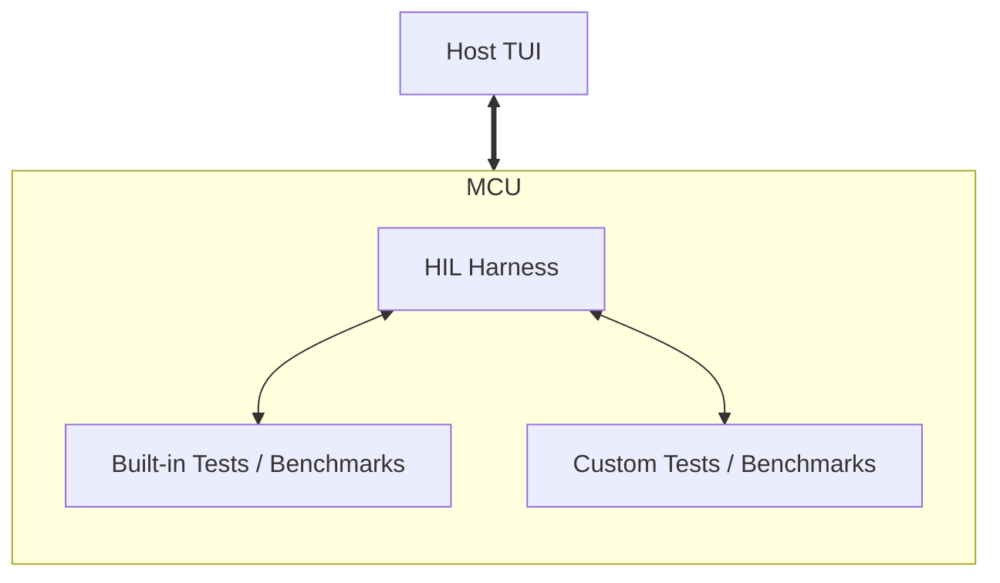

# Exportable Runtime Harness


## 1. Context & Objective

Traditionally, embedded hardware libraries treat benchmarks,
Hardware-in-the-Loop (HIL) tests, and Continuous Integration (CI) test matrices
as internal, closed-source chores.

The objective of this design is to provide testing and benchmarking
infrastructure as part of the `control-rs` development tools available to
end-users. This allows users to test `control-rs` against their specific
hardware and compare it side-by-side with their custom algorithms.

## 2. Architectural Overview

To provide a seamless experience, `control-rs` acts as an umbrella crate,
re-exporting the necessary tooling components so users only need a single
dependency.

* **`control-rs`**: Implementations of types, algorithms and sub-programs.
* **`control-rs-macros`**: Procedural macros (`#[benchmark]`, `#[hil_test]`,
  `#[hil_setup]`) for distributed test discovery. Because `control-rs` will use
  these macros, they are separated from the HIL and CI runners, but they remain
  closely related and are kept within the same workspace. Note that these are
  strictly *procedural* macros, and there should be no confusion about using
  declarative macros for this purpose.
* **`control-rs-xtask`**: Workspace tools and code generators.
    * **`ci`**: Tooling for automated, headless execution and metrics gathering
      for CI platforms.
    * **`hil`**: Interactive runner to execute tests and benchmarks on target
      hardware.



## 3. Core Mechanics

### 3.1. Distributed Test Discovery

Using custom linker sections in `no_std` embedded Rust allows tests and
benchmarks to be discovered automatically at compile/link time. By avoiding
standard desktop runtime registries, this pattern provides:

* **Zero Boilerplate:** Developers can tag tests across multiple files without
  maintaining a central registry.
* **Zero Runtime Overhead:** The test registry is built entirely during linking.
* **ROM Efficiency:** Test descriptors are stored directly in Flash memory.

#### 3.1.1. Build Script Injection and Linker Section Mechanics

To facilitate this process, a `build.rs` script is used to "inject" test and
benchmark descriptions into a known location in memory. This script parses
project files and generates the necessary linkable assets.

Crucially, the build script generates `memory.x` linker script fragments that
define the custom sections where the test registry is placed. These fragments
must be included in the end-user's build via `#[link_section = "..."]`
attributes (handled by the procedural macros) and the standard linker arguments.

To ensure the custom test registry sections aren't silently discarded by the
linker's garbage collection during a `--release` build, we must explicitly
retain them. This is typically achieved by adding `--gc-keep-exported` to the
linker flags or utilizing `KEEP()` directives in the generated linker scripts
for the sections containing the test metadata.

The tests and benchmarks will then be available to the firmware runner as a list
of descriptors.

Furthermore, the build script supports an environment variable overriding
feature, allowing users to dynamically modify the location in memory that
descriptors will be stored.

### 3.2. Execution Context

To ensure maximum compatibility across different development boards and
architectures, the `#[hil_setup]` function initializes and returns a `Context`
object. This manages test execution and communication:

* **Settings:** Reconfigurable parameters (e.g., test durations, verbosity) that
  allow dynamic adjustments without recompiling.
* **HostReporter:** A generic trait acting as a middleware layer for
  firmware-to-host communications. Users implement this for their preferred
  communication peripheral (e.g., UART, USB). **Critically, this integrates with
  RTT (Real-Time Transfer) backends via `probe-rs`.** Utilizing RTT is essential
  for providing high-speed, zero-overhead telemetry required to prevent MCU
  stalls during complex math benchmarks without monopolizing a hardware UART
  peripheral.
* **ClientClock:** A generic trait that allows users to configure different
  hardware timers for the runner. The context expects a timer or clock from the
  user's setup function to enable precise, hardware-specific performance metrics
  and benchmarking.

### 3.3. Host TUI

The final component of this stack is the host console menu, a dedicated
interactive tool to drive the HIL firmware with a rich GUI (like the TUI shown
above). This acts as a runner to upload the firmware, start execution, and
dynamically display the available options, tests, and real-time metrics,
providing a vast improvement in user experience for exploring and running
on-target tests.

```bash
===============================================================================
 TARGET: Teensy 4.1 (i.MX RT1062) | CLOCK: 600 MHz | FPU: HARD (eabihf)
 LINK:   probe-rs (RTT) via DAPLink                | SPEED: 2000 kHz
===============================================================================
 [ RUNNING ] control_rs::math
-------------------------------------------------------------------------------
 NAME                                     CYCLES      TIME       VARIANCE
 ▼ math::storage
   ├─ contiguous_storage_alloc            1,204       2.00µs     ± 0.1%
   └─ noncontiguous_storage_dma           3,410       5.68µs     ± 0.4%

 ▼ math::subprograms::level3
   ├─ gemm_10x10_f32 (soft-float)         84,500      140.8µs    [CACHED]
   ├─ gemm_10x10_f32 (hard-float)        [ RUN... ]   ---        ---
   └─ gemm_50x50_f32 (hard-float)         PENDING     ---        ---

 ▼ math::edge_cases
   ├─ underflow_vs_precision_loss         42          0.07µs     ± 0.0%
   └─ floating_point_epsilon_bounds       58          0.09µs     ± 0.0%
-------------------------------------------------------------------------------
 [ RTT LOGS ] (Autoscroll: ON)
 > [INFO] Host connected. Target halted.
 > [INFO] Discovered 24 targets via procedural macro test registry.
 > [PASS] math::storage::contiguous_storage_alloc
 > [PASS] math::storage::noncontiguous_storage_dma
 > [EXEC] math::subprograms::level3::gemm_10x10_f32 (hard-float)...
===============================================================================
 (f)ilter | (r)un all | (s)top | (c)lear cache | (q)uit
```

### 3.4. Communication Protocol & Transport Layer

The communication protocol used between the runner on the MCU and the host TUI
is a simple frame-based binary packet structure. Each message includes a header
detailing the message type (e.g., metric report, log, state change, or command),
payload length, and a checksum. This ensures the host TUI can parse continuous
telemetry streams from the target efficiently without stalling test execution.

While standard serial (UART/USB) is supported as a fallback, the primary
transport mechanism relies heavily on **RTT (Real-Time Transfer) integrated
with `probe-rs`**. RTT provides the necessary high-speed, zero-overhead
telemetry to offload data rapidly from the MCU, crucial for maintaining test
fidelity during intense computational benchmarks.

### 3.5. Panic Handling and Entrypoint Generation

The `#[hil_setup]` macro serves a dual purpose: it automatically creates the
standard `main()` entrypoint that calls the user's setup code and launches the
HIL server, and it also registers a custom panic handler. This ensures that any
test or benchmark failures resulting in a panic are caught gracefully. The panic
handler intercepts the error, serializes the panic message and location using
the `HostReporter`, and transmits it back to the host TUI, preventing the MCU
from silently locking up and allowing the host to retain the state across
restarts.

## 4. The End-User Integration Model

This is the primary user-facing benefit. Users can easily set up and run
benchmarks using their hardware's specific HAL. In this example, we continue
with the Teensy 4.1 (NXP i.MX RT1062) context.

### `Cargo.toml`

```toml
[dependencies]
control-rs = { version = "1.0", features = ["hil"] }
teensy4-bsp = "0.4" # User's specific hardware HAL (Teensy 4.1)

[[bin]]
path = 'src/bin/custom_drone_benchmarks.rs'
```

### `.cargo/config.toml`

```toml
[alias]
xtask = ["control-rs-xtask", "--"]
ci = ["xtask", "ci"]

[target.thumbv7em-none-eabihf]
runner = "cargo xtask hil --chip MIMXRT1062DVJ6A --"
```

### Application: `src/bin/custom_drone_benchmarks.rs`

```rust
use teensy4_bsp::hal::timer::Blocking;
use control_rs::macros::{benchmark, hil_setup};
use control_rs::hil::{Context, Settings, HostReporter, HostTimer};

// A custom algorithm the user wants to benchmark alongside control-rs
#[benchmark]
fn my_custom_drone_math() { /* ... */ }

// User implements the HostReporter for their specific UART/USB or RTT backend
struct MyReporter {
    /* ... */
}

impl HostReporter for MyReporter {
    fn write(&mut self, data: &[u8]) { /* ... */ }
    fn read(&mut self, buffer: &mut [u8]) -> usize { 0 }
}

// User implements the HostTimer for their specific hardware timer
struct MyTimer {
    /* ... */
}

impl HostTimer for MyTimer {
    fn now(&self) -> u64 { /* ... */ }
}

#[hil_setup]
fn setup() -> Context {
    let board = teensy4_bsp::board::t41();
    // ... custom clock config ...

    Context {
        reporter: MyReporter { /* ... */ },
        timer: MyTimer { /* ... */ },
        settings: Settings { iterations: 1000, verbose: true },
    }
}
```

Users can invoke the harness from the command line:

```bash
# Flash and run the benchmark harness for a specific MCU target
cargo run --release \
    --bin custom_drone_benchmarks \
    --target thumbv7em-none-eabihf
```