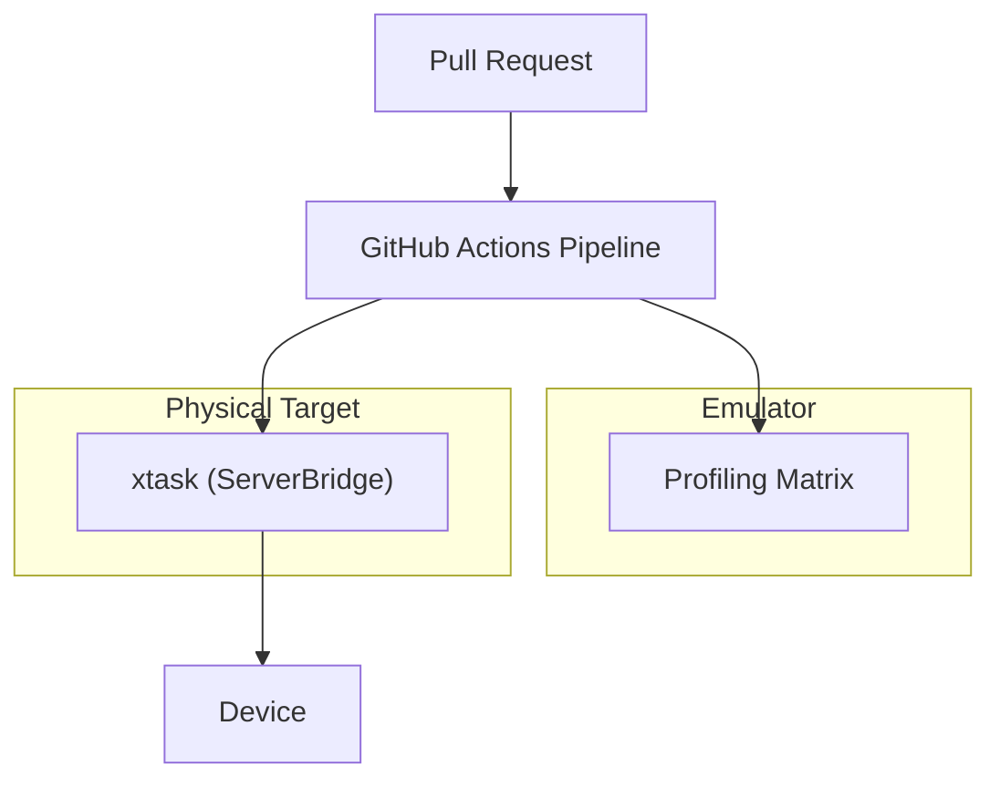

# Continuous Integration Design Document

---

### 1. Introduction

Traditionally, continuous integration (CI) and Hardware-in-the-Loop (HIL)
environments are treated as closed-source internal infrastructure. This design
aims to export the HIL testing framework directly to developers.

---

### 2. Requirements

#### Functional Requirements

- **FR-1 — Two-Tier Target Verification**: The pipeline must support both
  virtual simulated targets and physical hardware targets.
- **FR-2 — Firmware Flash & Run**: The system must automatically compile target
  firmware, flash it, execute the tests and retrieve execution logs.

#### Non-Functional Requirements

- **NFR-1 — Test Isolation**: Each test run must boot into a clean, uncorrupted
  hardware state.

#### Constraints

- **C-1 — Target Microcontroller Restrictions**: The pipeline must support
  Cortex-M* platforms (NXP i.MX RT1062 / Teensy 4.1) and RISC-V32/64.

---

### 3. Technical Overview

The verification pipeline is divided into two primary tiers:

---

### 4. Core Architecture

#### 4.1. Tier 1: Virtual Simulation (Renode)

To validate logical correctness on every pull request without exhausting
physical lab resources, the pipeline runs virtual simulations using **Renode**.

* **Why Renode**: QEMU, focus mostly on CPU-instruction emulation;
  Renode provides accurate hardware model specifications of peripheral busses,
  registers, UARTs, SPI controllers and DMA modules.
* **Orchestration**: Renode is run inside a Docker container on a GitHub Actions
  runner.
* **Assertions**: The pipeline scripts test runs using the **Robot Framework**.
  It boots the firmware ELF inside Renode, interacts with the simulated UART
  port and handles test failures similar to the hil-server (catch error,
  flush comms and restart).

#### 4.2. Tier 2: Physical HIL Lab

To validate true electrical timing, cache effects and analog interactions, the
pipeline runs against a single physical board connected directly to the CI
runner via `control-rs-xtask` (`ServerBridge`), the same host-side connection
manager used for local development.

* **Flashing and Control**: The CI runner uses `xtask`'s `ServerBridge` to
  flash the compiled ELF target binary and drive the HIL Server over serial,
  identically to a local `cargo control-rs-xtask tui` session.
* **Test Isolation**: Failed tests will cause a board reset and will fully
  reset the hardware state.
* **Runner Wiring**: Golioth's self-hosted-runner-with-hardware-labels pattern
  (`documentation/xtask/research/results/hil-server.json`) is the reference
  model for attaching the board to CI; the existing `teensy-ci` task is the
  starting point for wiring it in.

#### 4.3. Static Stack Analysis

The pipeline will additionally run compile-time stack-usage bounding
(`cargo-call-stack`) as a complement to the runtime stack painting performed
on-target, scoped per the blind spots documented in
`cpu-profile-utils-design-doc.md` §5 (hardware exceptions and inline assembly
are invisible to the static call graph).

---

### 5. Alternatives

* **Simulation-Only Pipeline**: Rejected. Simulation cannot replicate
  microarchitectural details like Cortex-M7 Branch Target Address Cache (BTAC)
  misprediction penalties, L1 cache conflict misses or analog electrical noise
  on ADC lines.
* **Manual Target Testing**: Rejected. Scaling the codebase requires automated
  tests; manual flashing does not scale and prevents pull request validation.
* **Proprietary HIL Systems (dSpace / Vector / National Instruments)**:
  Rejected. These are closed, expensive enterprise platforms that lack native
  integration with cargo toolchains, command lines and containerized cloud
  runners.

---

### 6. Verification & Validation

#### 6.1. Verification Plan

- **Renode Script Verification**: Execute simulation checks locally using
  `renode` scripts to verify that the simulated i.MX RT1062 model matches the
  register configurations of the library.

#### 6.2. Validation Plan

- **End-to-End Pipeline Execution**: Submit a test pull request containing a
  known failure and verify that the virtual Renode run catches the failure on
  GitHub Actions and that the physical HIL run (via `xtask`/`ServerBridge`)
  compiles, flashes and logs test results correctly.

---

### 7. Performance & Resource Considerations

* **Compiler Caching**: The CI environment uses `sccache` targeting a shared
  Amazon S3 or local minio bucket to avoid rebuilding compiler assets on every
  run.
* **Physical Target Duty Cycle**: Microcontrollers and flash memories have
  write-limit wear thresholds. The Server reduces wear by staying flashed
  persistently and utilizing RTT down-buffers to trigger tests dynamically,
  rather than flashing the target MCU for every single test block.

---

### 8. Risks & Open Questions

* **Hardware Wear-and-Tear**: Microcontroller boards can fail electrically or
  degrade over time. The pipeline must flag continuous failures on specific
  boards to alert lab operators to replace hardware.

---

### 9. Development Plan

| Task / Feature                        | Description                                                                                             | Estimated Effort |
|:--------------------------------------|:--------------------------------------------------------------------------------------------------------|:-----------------|
| **Step 1: Renode Board Profile**      | Define the i.MX RT1062 platform description file (`.resc`/`.repl`) for Renode simulation.               | 1.0 day          |
| **Step 2: Robot Framework Scripts**   | Script the virtual test execution and regex parsing checks.                                             | 0.5 day          |
| **Step 3: Physical CI Runner Wiring** | Attach a physical board to a CI runner and script `xtask`/`ServerBridge` invocation for flash-and-test. | 0.5 day          |

---

### 10. Revision History

| Revision | Date           | Author          | Description                                                                                                           |
|:---------|:---------------|:----------------|:----------------------------------------------------------------------------------------------------------------------|
| 1.0      | May 24, 2026   | @MitchellDScott | Initial skeletal outline of CI testing.                                                                               |
| 1.1      | July 18, 2026  | @MitchellDScott | Restructured to template; added two-tier verification architecture (Renode, Labgrid, pytest) and parallel scheduling. |
| 1.2      | July 18, 2026  | @MitchellDScott | Documented transition to Renode simulation and custom xtask-based device runners on Raspberry Pi.                     |
| 1.3      | August 4, 2026 | @MitchellDScott | Removed unimplemented Labgrid fleet architecture; reduced Tier 2 to a single board; clarified runner terminology.     |
| 1.4      | August 6, 2026 | @MitchellDScott | Fixed a cross-reference, aligned the Tier 1 diagram with Renode and documented shipped versus unimplemented tiers.    |