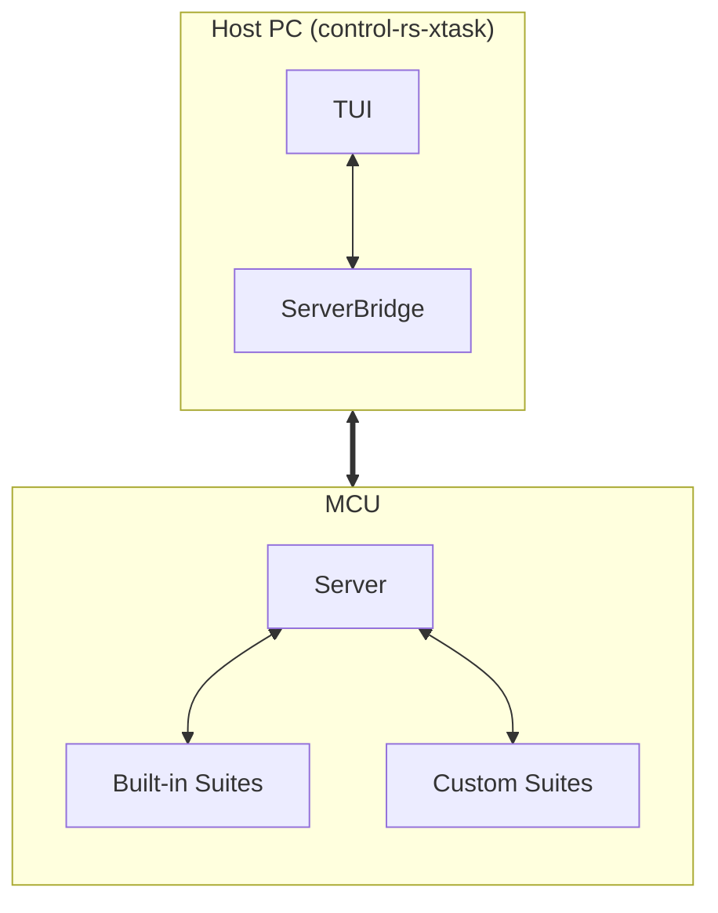

# HIL

## 1. Introduction

Traditionally, embedded hardware libraries treat benchmarks,
Hardware-in-the-Loop (HIL) tests and Continuous Integration (CI) test matrices
as internal, closed-source chores.

## 2. Requirements

The objective of this project is to provide testing and benchmarking
infrastructure as part of the published `control-rs` development tools. This
allows users to test provided implementations in `control-rs` against their
custom algorithms and compare them side-by-side on specific hardware.

1. The server must be `#![no_std]` and cannot use any heap allocations.
2. `CPUProfiler` must support cycle-accurate profiling.
3. The host TUI must parse and render incoming each frame in under 16
   ms (maintaining 60 FPS UI updates).
4. The server must intercept standard Rust panics, serialize and send the panic
   message via the `HostComms` transport layer.
5. The user should be able to start a test server in a Qemu emulator or
   connect to a real board.
6. `cargo run ...` from the workspace root should start the tui or emulator.

---

## 3. Technical Overview

The published crate `control-rs` acts as an umbrella crate, re-exporting the
necessary tooling components so users only need a single dependency.

**Workspace crates:**

* **`control-rs`**: Implementations of types, algorithms and sub-programs.
* **`control-rs-xtask`**: Workspace tools for building testing and running CI.
* **`control-rs-hil`**: Interactive server to execute tests and benchmarks.
* **`control-rs-macros`**: Helper macros to wrap tests and settings in test
  suites and setup function in a `main()`.



## 4. Architecture

### 4.1. Execution Context

To ensure maximum compatibility across different development boards and
architectures, the server will require the user to initialize a generic object.
This object provides the specific drivers for cpu profiling and communication:

* **HostComms:** A generic trait acting as a middleware for firmware-to-host
  communications. Users implement this for the available communication
  peripherals (e.g., UART, USB).
* **CPUProfiler:** A generic trait that allows users to configure CPU
  profiling utilities for the hil server. Users implement this trait to
  provide low-level access to CPU cycle counters, nanosecond system timers,
  stack pointers, stack painting/scanning and critical sections.

### 4.2. Communication & Transport Layer

The communication protocol used between the Server on the MCU and the host TUI
is a simple frame-based binary packet structure. This allows the host TUI to
parse continuous telemetry streams byte-by-byte instead of blocking until a
full message has arrived.

### 4.3 End-User Integration Model

This is the primary user-facing benefit. Users can easily set up and run
benchmarks using their hardware's specific HAL.

### `Cargo.toml`

```toml
[dependencies]
control-rs = { version = "1.0", features = ["hil"] }
teensy4-bsp = "0.4" # User's specific hardware HAL (Teensy 4.1)

[[bin]]
path = 'src/bin/custom_drone_benchmarks.rs'
```

### `.cargo/config.toml`

```toml
[target.thumbv7em-none-eabihf]
runner = [
    "bash",
    "-c",
    "rust-objcopy -O ihex \"$0\" \"${0}.hex\" && teensy_loader_cli -w -v --mcu=TEENSY40 \"${0}.hex\""
]
rustflags = [
    "-C", "link-arg=-Tt4link.x",
]
```

### Application: `src/bin/custom_board.rs`

Users can invoke the harness from the command line:

```bash
cargo run --release \
    --bin custom_board \
    --target thumbv7em-none-eabihf
```