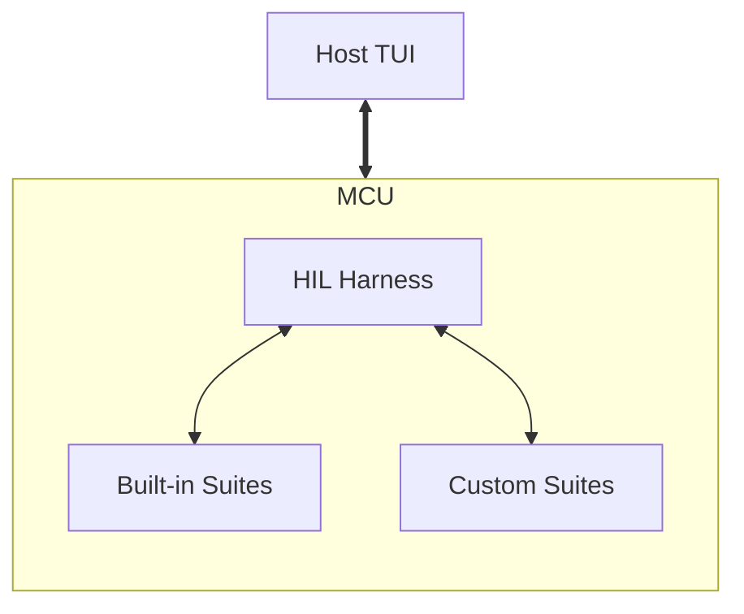

# HIL

## 1. Context & Objective

Traditionally, embedded hardware libraries treat benchmarks,
Hardware-in-the-Loop (HIL) tests, and Continuous Integration (CI) test matrices
as internal, closed-source chores.

The objective of this design is to provide testing and benchmarking
infrastructure as part of the `control-rs` development tools available to
end-users. This allows users to test `control-rs` against their specific
hardware and compare it side-by-side with their custom algorithms.

## 2. Architectural Overview

To provide a seamless experience, `control-rs` acts as an umbrella crate,
re-exporting the necessary tooling components so users only need a single
dependency.

* **`control-rs`**: Implementations of types, algorithms and sub-programs.
* **`control-rs-xtask`**: Workspace tools and code generators.
    * **`hil`**: Interactive runner to execute tests and benchmarks on target
      hardware.



## 3. Core Mechanics

### 3.1. Execution Context

To ensure maximum compatibility across different development boards and
architectures, the `#[hil_setup]` function initializes and returns a `Context`
object. This manages test execution and communication:

* **Settings:** Reconfigurable parameters (e.g., test durations, verbosity) that
  allow dynamic adjustments without recompiling.
* **HostComms:** A generic trait acting as a middleware layer for
  firmware-to-host communications. Users implement this for their preferred
  communication peripheral (e.g., UART, USB). **Critically, this integrates with
  RTT (Real-Time Transfer) backends via `probe-rs`.** Utilizing RTT is essential
  for providing high-speed, zero-overhead telemetry required to prevent MCU
  stalls during complex math benchmarks without monopolizing a hardware UART
  peripheral.
* **CPUProfileUtils:** A generic trait that allows users to configure CPU
  profiling utilities for the runner context. Users implement this trait to
  provide low-level access to CPU cycle counters, nanosecond system timers,
  stack pointers, stack painting/scanning, and critical sections. This enables
  precise, hardware-specific performance metrics and benchmarking.

### 3.2. Communication Protocol & Transport Layer

The communication protocol used between the runner on the MCU and the host TUI
is a simple frame-based binary packet structure. Each message includes a header
detailing the message type (e.g., metric report, log, state change, or command),
payload length, and a 16-bit CRC checksum. This ensures the host TUI can parse
continuous
telemetry streams from the target efficiently without stalling test execution.

## 4. Usage

### The End-User Integration Model

This is the primary user-facing benefit. Users can easily set up and run
benchmarks using their hardware's specific HAL.

### `Cargo.toml`

```toml
[dependencies]
control-rs = { version = "1.0", features = ["hil"] }
teensy4-bsp = "0.4" # User's specific hardware HAL (Teensy 4.1)

[[bin]]
path = 'src/bin/custom_drone_benchmarks.rs'
```

### `.cargo/config.toml`

The xtask binary will need to be published so users can install it through
`cargo install`.

```toml
[target.thumbv7em-none-eabihf]
runner = "cargo xtask hil --chip MIMXRT1062DVJ6A --"
```

### Application: `src/bin/custom_drone_benchmarks.rs`

Users can invoke the harness from the command line:

```bash
# Flash and run the benchmark harness for a specific MCU target
cargo run --release \
    --bin custom_drone_benchmarks \
    --target thumbv7em-none-eabihf
```