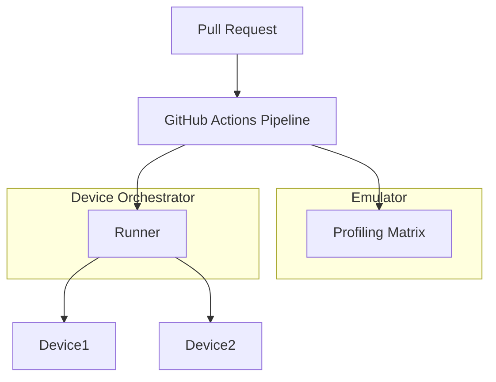

# Continuous Integration Design Document

---

### **1. Introduction**

In safety-critical control systems, standard software verification (such as unit
testing on host platforms) is necessary but insufficient. Code must be verified
on the target microcontroller architectures, and ideally under physical
conditions, to guarantee correct register-level interactions, memory safety, and
timing determinism.

Traditionally, continuous integration (CI) and Hardware-in-the-Loop (HIL)
environments are treated as closed-source internal infrastructure. This design
document establishes aims to export the HIL testing framework directly to
developers.

---

### **2. Requirements**

#### **Functional Requirements**

* **Two-Tier Target Verification**: The pipeline must support both virtual
  simulated targets and physical hardware targets.
* **Automated Device Recovery**: The physical runner must be able to hard reset
  the device under test (DUT) to clear deadlocks or memory corruption.
* **Firmware Flash & Run**: The system must automatically compile target
  firmware, flash it onto the target device, execute the tests, and retrieve
  execution logs.

#### **Non-Functional Requirements**

* **Test Isolation**: Each test run must boot into a clean, uncorrupted hardware
  state.

#### **Constraints**

* **Target Microcontroller Restrictions**: The pipeline must support Cortex-M7
  platforms (NXP i.MX RT1062 / Teensy 4.1) and RISC-V32/64.

---

### **3. Technical Overview**

The verification pipeline is divided into two primary tiers:

---

### **4. Core Architecture**

#### **4.1. Tier 1: Virtual Simulation (Renode)**

To validate logical correctness on every pull request without exhausting
physical lab resources, the pipeline runs virtual simulations using **Renode**.

* **Why Renode**: Unlike QEMU (which focus mostly on CPU-instruction emulation),
  Renode provides accurate hardware model specifications of peripheral busses,
  registers, UARTs, SPI controllers, and DMA modules.
* **Orchestration**: Renode is run inside a Docker container on a GitHub Actions
  runner.
* **Assertions**: The pipeline scripts test runs using the **Robot Framework**.
  It boots the firmware ELF inside Renode, interacts with the simulated UART
  port, and verifies test assertions using regular expressions matched against
  the serial output.

#### **4.2. Tier 2: Physical HIL Lab**

To validate true electrical timing, cache effects, and analog interactions, the
pipeline interfaces with a physical board lab managed by a custom
alternative to LabGrid.

* **Labgrid Topology**:
    - **Coordinator**: A central daemon running in the cloud or local server
      that manages board allocation.
    - **Exporter**: Runs on local Raspberry Pi "Edge Nodes" physically connected
      to the microcontrollers. It exports access to USB ports, serial ports,
      debug probes, and power relays.
    - **Client**: The CI runner requesting a target device allocation.
* **Hardware Isolation & Power Control**: To ensure tests do not inherit
  corrupted states from previous panics or crashed runs:
    - Labgrid controls USB-SD-Muxes or USB power relays (e.g. YKUSH).
    - The pipeline triggers a hard power cycle of the microcontroller before
      flashing.
* **Flashing and Control**: The exporter uses the **probe-rs** CLI utility to
  flash the compiled ELF target binary over SWD.

#### **4.3. Algorithmic Workload Parallelization**

When a large test matrix must run on physical boards (e.g., benchmarking 10
different control models with varying parameter settings), sequential HIL runs
introduce bottleneck issues.

To optimize execution speed, the Labgrid client scheduler uses a workload
scheduling model inspired by the **Cutting-Stock Problem algorithm**. The
scheduler dynamically analyzes the test suite dependencies and execution time
estimates, slicing the test matrix into balanced chunks. These chunks are run
concurrently across the pool of available target microcontrollers, reducing test
execution times from hours to minutes.

---

### **5. Alternatives**

* **Simulation-Only Pipeline**: Rejected. Simulation cannot replicate
  microarchitectural details like Cortex-M7 Branch Target Address Cache (BTAC)
  misprediction penalties, L1 cache conflict misses, or analog electrical noise
  on ADC lines.
* **Manual Target Testing**: Rejected. Scaling the codebase requires automated
  tests; manual flashing does not scale and prevents pull request validation.
* **Proprietary HIL Systems (dSpace / Vector / National Instruments)**:
  Rejected. These are closed, expensive enterprise platforms that lack native
  integration with cargo toolchains, command lines, and containerized cloud
  runners.

---

### **6. Verification & Validation**

#### **6.1. Verification Plan**

- **Renode Script Verification**: Execute simulation checks locally using
  `renode` scripts to verify that the simulated i.MX RT1062 model matches the
  register configurations of the library.
- **Labgrid Test Runner Checks**: Run `pytest` scripts locally on the HIL
  exporter setup to verify that the target allocating and power cycling
  mechanics work correctly.

#### **6.2. Validation Plan**

- **End-to-End Pipeline Execution**: Submit a test pull request containing a
  known failure and verify that the virtual Renode run catches the failure on
  GitHub Actions, and that the nightly physical HIL lab runs compile, flash, and
  log test results correctly.

---

### **7. Performance & Resource Considerations**

* **Compiler Caching**: The CI environment uses `sccache` targeting a shared
  Amazon S3 or local minio bucket to avoid rebuilding compiler assets on every
  run.
* **Physical Target Duty Cycle**: Microcontrollers and flash memories have
  write-limit wear thresholds. The target runner reduces wear by keeping the
  runner firmware flashed persistently and utilizing RTT down-buffers to trigger
  tests dynamically, rather than flashing the target MCU for every single test
  block.

---

### **8. Risks & Open Questions**

* **Edge Node Network Drops**: Exporter Raspberry Pis located in physical labs
  can disconnect due to network instability. Labgrid must handle node timeouts
  gracefully, rescheduling test chunks onto alternative online nodes.
* **Hardware Wear-and-Tear**: Microcontroller boards can fail electrically or
  degrade over time. The pipeline must flag continuous failures on specific
  boards to alert lab operators to replace hardware.

---

### **9. Development Plan**

| Task / Feature                      | Description                                                                                    | Estimated Effort |
|:------------------------------------|:-----------------------------------------------------------------------------------------------|:-----------------|
| **Step 1: Renode Board Profile**    | Define the i.MX RT1062 platform description file (`.resc`/`.repl`) for Renode simulation.      | 1.0 day          |
| **Step 2: Robot Framework Scripts** | Script the virtual test execution and regex parsing checks.                                    | 0.5 day          |
| **Step 3: Labgrid Exporter Config** | Configure the Raspberry Pi edge nodes, power control relays, and DAPLink debug probe bindings. | 1.0 day          |
| **Step 4: Pytest HIL Runner**       | Develop the python HIL tests using pytest-labgrid to flash and verify target behaviors.        | 1.0 day          |
| **Step 5: Parallel Scheduler**      | Integrate parallel test chunking and optimization scheduling within the Labgrid workflow.      | 1.0 day          |

---

### **10. Revision History**

| Revision | Date          | Description                                                                                                                                                | Author          |
|:---------|:--------------|:-----------------------------------------------------------------------------------------------------------------------------------------------------------|:----------------|
| 1.0      | May 24, 2026  | Initial skeletal outline of CI testing.                                                                                                                    | @MitchellDScott |
| 1.1      | July 18, 2026 | Restructured to design-template standard. Added two-tier verification architecture details (Renode, Labgrid, pytest) and parallel scheduling optimization. | @MitchellDScott |
| 1.2      | July 18, 2026 | Documented transition from QEMU to Renode simulation and the use of custom xtask-based device runners on Raspberry Pi for Git pipeline pushes.             | @MitchellDScott |

#### **Change Notes: QEMU to Renode Transition & Device Runners**

* **QEMU to Renode Transition**: QEMU was originally considered for target-side
  test simulation. However, QEMU only emulates CPU instruction sets and basic
  memory configurations. This does not catch bugs in peripheral register
  access (like DMA, SPI, or UART) which are critical for control loops. Renode
  was intentionally chosen because it simulates the entire SoC platform,
  including peripheral busses and timing models.
* **Custom Device Runner**: Rather than relying purely on generic CI agents, a
  custom device runner utility (built inside `control-rs-xtask`) will be
  installed on physical edge nodes (e.g., Raspberry Pi). Successful Git pipeline
  runs can automatically build and push binary artifacts directly to these
  device runners for on-target HIL verification.