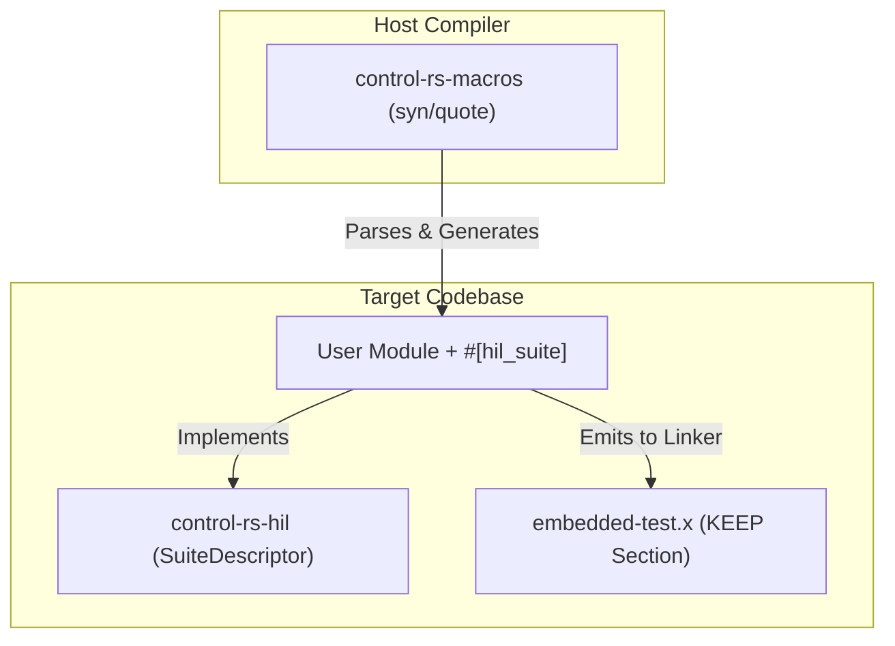

# Procedural Macros for Distributed Test Discovery (Design Document)


---

### **1. Introduction**

Bare-metal embedded systems lack traditional operating system loaders, making
dynamic test discovery and runtime test registration difficult. Procedural
macros provide a compile-time solution by automatically analyzing source code
and generating the underlying test registry metadata.

This design document establishes the architecture for `control-rs-macros`, a
procedural macro library containing `#[hil_suite]` and `#[hil_setup]`. These
macros enable developers to declare hardware-in-the-loop (HIL) tests and
benchmarks directly in their modules with zero boilerplate. The macro generates
all registration hooks and places them in custom linker sections, permitting
automated discovery without a centralized registry.

---

### **2. Requirements**

#### **Functional Requirements**

* **Distributed Module Annotation**: Developers must be able to declare a suite
  simply by tagging a module with `#[hil_suite]`.
* **Automatic Registration**: The macro must automatically identify all
  functions within the module, that do not begin with an underscore and generate test descriptors.
* **Type-Safe Settings Translation**: Any static variable declared inside the
  `#[hil_suite]` module must be translated into a thread-safe atomic setting
  structure.
* **Entrypoint & Setup Generation**: The `#[hil_setup]` macro must generate the
  standard `main()` entrypoint, call the user's hardware initialization code,
  and instantiate the execution context.
* **Custom Panic Redirection**: The macro-generated entrypoint must register a
  custom panic handler that intercepts test panics and routes them through the
  host communications layer.

#### **Non-Functional Requirements**

* **Zero Runtime Allocation**: All generated code, setup contexts, and panic
  handlers must operate strictly without a heap.
* **Linker Retention Safety**: Generated descriptors must survive aggressive
  linker garbage collection (`--gc-sections`) in release builds.
* **Rust 2024/2027 Compliance**: The generated structures must eliminate all
  deprecated `static mut` usage, using type-safe atomic wrappers and interior
  mutability instead.

#### **Constraints**

* **Strict `#![no_std]` Compatibility**: The code emitted by the macros must
  compile on bare-metal targets without standard library support.
* **Target Independency**: The macros must emit target-agnostic Rust code that
  that delegates hardware specifics to the user defined profiler.

---

### **3. Technical Overview**

The procedural macros are contained within the `control-rs-macros` library. This
library depends on standard compiler crates (`proc-macro`, `syn`, `quote`) and
operates as a compiler plugin. It interacts with other workspace crates to form
the test registry:



---

### **4. Core Architecture**

#### **4.1. `#[hil_suite]` Module Parsing and Code Generation**

When the compiler encounters `#[hil_suite]` on a module, the macro performs the
following transformations:

1. **Test Identification**: It traverses the module's items, locating all
   functions. For each function, it generates an `ExecDescriptor` containing the
   function's name, description, and function pointer.
2. **Settings Translation**: It traverses static variables. To eradicate
   `static mut` (deprecated in Rust 2024 and prohibited in 2027), the macro
   converts standard type declarations into atomic settings. For example:
   ```rust
   // User declaration
   pub static MAX_RETRIES: u32 = 3;
   ```
   Is parsed and translated into:
   ```rust
   // Generated code
   pub static MAX_RETRIES: AtomicU32Setting = AtomicU32Setting::new(
       "MAX_RETRIES",
       "User-defined test parameter",
       3
   );
   ```
3. **Registry Emission**: The macro emits a static `SuiteDescriptor` that
   references the array of `ExecDescriptor`s and the list of settings. This
   descriptor is annotated with the link section attribute to ensure it is
   placed in the test registry:
    ```rust
    #[unsafe(link_section = ".hil_test_suites")]
    #[used]
    pub static SUITE_DESCRIPTOR_PTR: &::control_rs_hil::SuiteDescriptor = &SUITE_DESCRIPTOR;
    ```

#### **4.2. Linker Garbage Collection Mitigation**

A critical issue in bare-metal Rust is that LLD linker passes the
`--gc-sections` flag by default. Because the application logic does not directly
call the static `SuiteDescriptor` variables, the linker views them as dead code
and strips them during compilation.

To prevent this, the workspace employs a multi-tiered retention architecture:

1. **`#[used(linker)]` or `#[used]`**: Generated static variables use attributes directing LLVM to keep the symbol in the object file.
2. **Linker Script KEEP Directive**: The `control-rs-hil` crate packages a custom linker script snippet (`hil_suites.x`) that includes a `KEEP` directive for the `.hil_test_suites` section:
   ```ld
   KEEP(*(.hil_test_suites))
   ```
3. **Build Script Linker Argument Injection**: Target binary examples (like QEMU and Teensy 4) include a `build.rs` or `.cargo/config.toml` that injects the script to the linker command line:
   ```rust
   println!("cargo:rustc-link-arg=-Thil_suites.x");
   ```
   This prevents end-users from needing to manually manage linker configuration
   files.

#### **4.3. `#[hil_setup]` Entrypoint and Panic Handling**

The `#[hil_setup]` macro is applied to the user's hardware initialization
function. It replaces the function with the primary entrypoint:

1. **`main` Function Wrapper**: The macro emits the standard
   `#[no_mangle] pub extern "C" fn main() -> !` entrypoint.
2. **Setup Call**: It calls the user's custom setup function to initialize clock
   registers, configure peripherals (UART, SPI, DMA), and return the execution
   `Context`.
3. **Panic Hook Registration**: It registers a custom panic handler. This
   handler intercepts any panics, serializes the panic message and location, and
   writes them directly to the `HostComms` interface:
    ```rust
    #[cfg(target_os = "none")]
    #[panic_handler]
    fn panic(info: &::core::panic::PanicInfo) -> ! {
        let mut msg_buf = [0u8; 128];
        let pos = {
            let mut writer = ::control_rs_hil::util::FailureBufWriter { buf: &mut msg_buf, pos: 0 };
            let _ = ::core::fmt::write(&mut writer, format_args!("{}", info.message()));
            writer.pos
        };
        let msg = ::core::str::from_utf8(&msg_buf[..pos]).unwrap_or("panic occurred");

        let file = info.location().map_or("unknown", |l| l.file());
        let line = info.location().map_or(0, |l| l.line());

        let server_ptr = HIL_SERVER.load(::core::sync::atomic::Ordering::Acquire);
        unsafe {
            if !server_ptr.is_null() {
                let server = &mut *server_ptr;
                let comms_ok = server.context.comms_lock.try_lock();
                ::control_rs_hil::util::handle_failure(
                    &mut server.context,
                    msg,
                    file,
                    line,
                    comms_ok,
                );
            } else {
                loop {
                    ::core::hint::spin_loop();
                }
            }
        }
    }
    ```
   This prevents the target from locking up silently and ensures the host TUI
   displays the failure.

---

### **5. Alternatives**

* **Manual Registration Array**: Developers could manually declare a global
  array of function pointers. This is rejected due to high maintenance overhead,
  boilerplate, and the risk of developer error when adding new tests.
* **Nightly `custom_test_frameworks`**: Rejected. This requires unstable
  compiler flags and nightly toolchains, which violates the strict reliability
  and safety-certification goals of `control-rs`.
* **Standard `#[test]` Harness (libtest)**: Rejected. It depends on `std`
  components like threads and dynamic memory, which are unavailable in
  bare-metal targets.
* **Global Compiler `-C link-dead-code` Flag**: Rejected. While it prevents test
  registry deletion, it also disables dead code elimination for the entire
  project, leading to bloated binaries that exceed the MCU's Flash capacity.

---

### **6. Verification & Validation**

#### **6.1. Verification Plan**

- **Procedural Macro Tests**: Implement compiler tests using `trybuild` to
  verify that the macro correctly handles valid code structures and rejects
  invalid constructs (e.g. non-static variable declarations inside a suite
  module) with clean error messages.

#### **6.2. Validation Plan**

- **Hardware Integration Test**: Compile the `teensy4` board tests using the
  macros and execute them using the host-side runner to validate that all tests
  are discovered and that settings can be modified dynamically at runtime.

---

### **7. Performance & Resource Considerations**

* **Static Flash Storage**: Since the macro places all descriptors in
  `.hil_test_suites` marked as read-only, they reside entirely in Flash (ROM)
  and consume zero RAM during idle state.
* **Compiler Timing**: To maintain fast build times, the macro relies on minimal
  syn features and avoids complex, recursive macro expansion paths.

---

### **8. Risks & Open Questions**

* **Linker Target Differences**: Different targets (e.g., MSP430 or custom
  architectures) might require variations of the linker script arguments. The
  build script must detect the target architecture and adapt the link flags
  accordingly.
* **Rust compiler updates**: Shifts in compiler syntax/AST structure in future
  Rust editions could disrupt the syn-based parser. Pinning dependencies in
  Cargo.toml mitigates this.

---

### **9. Development Plan**

| Task / Feature                        | Description                                                                                    | Estimated Effort |
|:--------------------------------------|:-----------------------------------------------------------------------------------------------|:-----------------|
| **Step 1: syn Parser Implementation** | Implement parsing logic for `#[hil_suite]` modules and `#[hil_setup]` functions.               | 1.0 day          |
| **Step 2: AST Code Generation**       | Develop codegen templates for `SuiteDescriptor` outputs and atomic settings translations.      | 1.0 day          |
| **Step 3: Linker Integration**        | Write the `build.rs` layout injection code and build the `embedded-test.x` linker script file. | 0.5 day          |
| **Step 4: Panic Handler Codegen**     | Implement code generation for the custom bare-metal panic handler in `#[hil_setup]`.           | 0.5 day          |

---

### **10. Revision History**

| Revision | Date          | Description                                                                                                                                                                                | Author          |
|:---------|:--------------|:-------------------------------------------------------------------------------------------------------------------------------------------------------------------------------------------|:----------------|
| 1.0      | May 24, 2026  | Initial design of procedural macros for test discovery.                                                                                                                                    | @MitchellDScott |
| 1.1      | July 18, 2026 | Restructured to design-template standard. Incorporated findings on linker GC mitigation (`KEEP` directives, build.rs injection), atomic settings conversion, and custom panic redirection. | @MitchellDScott |