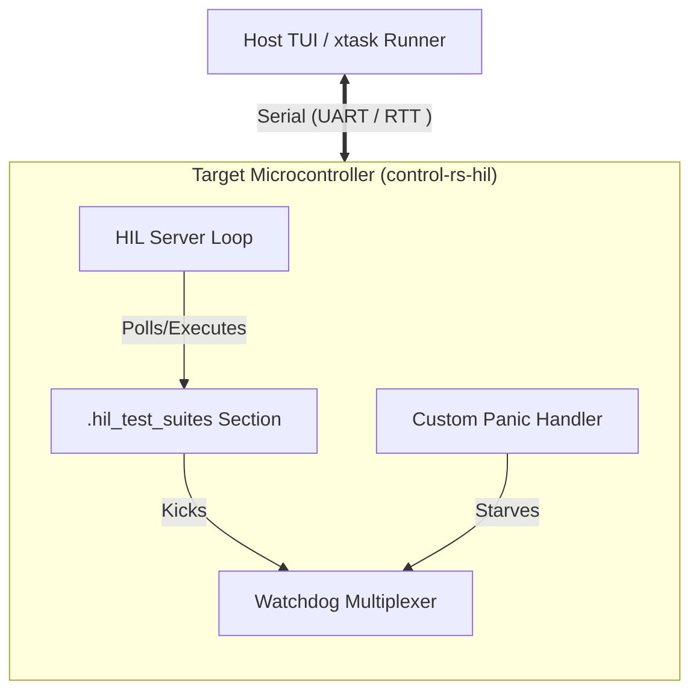
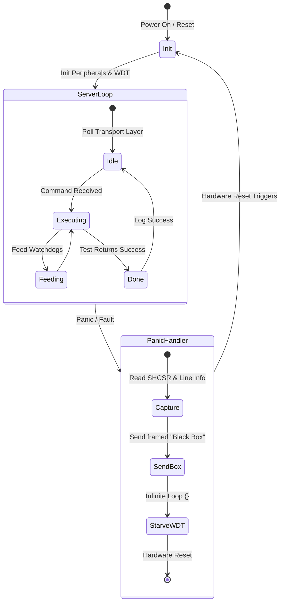

# HIL Runner (Design Document)


---

### **1. Introduction**

While host-based unit tests execute quickly, they cannot capture physical timing
constraints, register configurations, or real-time hardware behaviors. The HIL
Runner bridges this gap by executing compiled firmware directly on the target
Microcontroller Unit (MCU), operating as an interactive, persistent test server.
Rather than running a static, sequential test suite that requires flashing the
board every run, the runner remains idle on the device, waiting for
commands.

---

### **2. Requirements**

#### **Functional Requirements**

* **Interactive Server Execution**: The target runner must run persistently as
  an idle loop, listening for host commands and executing tests on command.
* **Distributed Test Discovery**: The system must automatically collect and
  register test cases across multiple modules without requiring a centralized
  registry.
* **Granular Telemetry Stream**: The target must transmit execution status,
  assertions, performance metrics, and debugging logs back to the host.
* **Robust Crash Recovery**: In the event of a test panic or a hardware
  exception (e.g., HardFault), the runner must capture diagnostic details (a "
  Firmware Black Box") and transmit them before performing a hardware reboot.

#### **Non-Functional Requirements**

* **Real-Time Determinism**: Telemetry and control operations must maintain
  microsecond-level timing budgets to avoid violating plant simulation
  intervals (e.g., 1000 Hz) or introducing control loop jitter.
* **Zero Dynamic Allocation**: The target runner must compile under `#![no_std]`
  and use zero heap allocation to avoid memory exhaustion and fragmentation.
* **Memory & Flash Efficiency**: The target runner harness (excluding individual
  tests) must consume less than 32 KB of Flash (ROM) and 8 KB of RAM. Test suite
  descriptors must reside in ROM.
* **Single-Threaded Serialization Access**: The host orchestrator must enforce
  sequential access (`--test-threads=1`) on the serial interface to prevent
  parallel port deadlocks.
* **Instant Resynchronization**: The communication link must recover immediately
  from byte corruption or dropped bytes caused by electrical noise.

#### **Constraints**

* **Cooperative Multitasking Lockups**: Because tests run in a non-preemptive
  environment without an RTOS, an infinite loop in a test can lock up the MCU. A
  watchdog mechanism must mitigate this.
* **Timing-Critical Logging**: The logging system must not block the CPU, as
  standard string formatting violates the microsecond-level timing budgets.

---

### **3. Technical Overview**

The HIL Runner framework is structured as a dual-targeted system across two
execution environments: the Host PC and the Target MCU.

1. **Host-Side (PC)**:
    - **`control-rs-xtask`**: Orchestrates firmware compilation, flashing, and
      automated execution. It parses the compiled ELF file to extract the list
      of available test suites prior to execution.
    - **TUI**: An interactive developer terminal interface that displays
      available test suites, starts execution, and displays telemetry logs.
2. **Target-Side (MCU)**:
    - **HIL Server Loop**: The main loop that receives commands, dispatches test
      functions, and manages the test state machine.
    - **HostComms Concrete Drivers**: Drivers implementing UART (with DMA) or
      SEGGER RTT for data transport.
    - **Distributed Test Sections**: Test functions compiled into a dedicated
      ELF memory section.
    - **Watchdog & Panic Handler**: Systems ensuring target safety, diagnostic
      capture, and system reset.



The system requires deep expertise in linker scripts, low-level ARM/RISC-V
assembly, binary serialization (framing and postcard), and task watchdogs.

---

### **4. Core Architecture**

#### **4.1. Workspace Structure & Cross-Compilation**

To prevent compilation friction, `control-rs` implements a dual-targeted nested
Cargo workspace structure. This separates platform-independent business logic (
which can be tested rapidly on the host) from target-specific peripheral
drivers:

```
control-rs (Root Workspace)
├── control-rs-hil/     # Target-side server event loop, settings registry, and profiling
├── control-rs-xtask/   # Host-side orchestration (TUI, headless CI, QEMU bridge)
├── control-rs-macros/  # Procedural macros for test suite setup and registry generation
├── examples/           # Target binary examples (qemu/teensy4) executing on-device
└── src/                # Standard host-side library algorithms and modules
```

Because serial ports and USB debug bridges are exclusive resources, parallel
host execution will deadlock. Host-side integration runners must claim exclusive
access and run in a single-threaded configuration using the `--test-threads=1`
flag in Cargo.

#### **4.2. Test Discovery via Linker Metaprogramming**

To avoid the overhead of runtime registration or unstable nightly custom test
harnesses, test discovery is implemented as a "distributed slice" inside a
dedicated linker section named `.hil_test_suites`.

Each test is declared using static structs:

```rust
pub struct ExecDescriptor {
    pub description: &'static str,
    pub name: &'static str,
    pub test_fn: fn(),
}

pub struct SuiteDescriptor {
    pub description: &'static str,
    pub executables: &'static [ExecDescriptor],
    pub name: &'static str,
    pub settings: &'static [&'static dyn Setting],
}
```

#### **4.3. Execution Model & Watchdog Multiplexing**

The HIL runner executes test suites in a non-preemptive cooperative multitasking
environment. Once a test function is invoked, it retains total control of the
MCU core.

##### **Vulnerability to Lockups**

If a test enters an infinite loop or blocks waiting for an interrupt that never
fires, the MCU will freeze. The host will register a timeout, but the target
will remain unresponsive, requiring physical intervention.

##### **Future Extension: Mitigation via Task Watchdogs**

While cooperative tests run in a non-preemptive environment and can theoretically lock up the target MCU, the current MVP executes without active watchdog timers to simplify initial deployment. 

To prevent target freezes in production, a future extension will introduce **Task Watchdog Multiplexing** (e.g., using a target-agnostic watchdog library):
1. The hardware Watchdog Timer (WDT) is initialized on boot.
2. Individual test sub-tasks dynamically register virtual watchdogs with a central multiplexer.
3. The hardware WDT is fed only if *all* registered virtual watchdogs check in within their individual timeouts.
4. Long-running tests feed their virtual watchdog periodically, preventing false-positive resets, while unexpected freezes starve the WDT and trigger a hard reset.

#### **4.4. Panic Handling, Firmware Black Box, and State Recovery**

When a test assertion fails, the custom `#[panic_handler]` takes over to capture
debugging forensic data and return the system to a clean state.

##### **Firmware Black Box**

Before rebooting, the panic handler constructs a diagnostic payload:

- Panic line number and file.
- Hardware interlock states.
- System Handler Control and State Register (SHCSR) (at `0xE000ED24usize` on ARM
  Cortex cores) to capture fault details. The handler clears bit 18 (
  `USGFAULTENA`) before forcing a HardFault via `asm::udf()` to guarantee clean
  exception capture.

##### **Programmatic Reset: SCB vs. WDT**

- **Soft Reset (SCB::sys_reset())**: Using the cortex-m crate, the runner can
  request a warm reset by writing to the AIRCR register. However, soft resets do
  not reset peripheral registers, external transceivers, or active DMA
  transfers. If a test panics during a DMA write, a soft reset will reboot the
  CPU but leave the DMA active, corrupting RAM after the reboot.
- **Hard Reset (WDT Starvation)**: The panic handler intentionally starves the
  WDT by entering an infinite loop `{}`. When the watchdog timer expires, a
  hardware-level reset is triggered. This forces the MCU to clear all internal
  peripherals, clocks, DMA channels, and CPU states, ensuring the runner
  restarts in a completely pristine environment.

If the system requires recovery from board-level power failures, external
supervisor ICs and bulk capacitors are integrated to allow the MCU to gracefully
shut down and prevent NVRAM corruption.

#### **4.6. Target-Side Execution Flow**



---

### **5. Alternatives**

#### **5.1. Test Discovery Alternatives**

* **Procedural Macros**: Parsing the AST to dynamically rewrite the main
  function entry point.
    - *Reason for Rejection*: Proc-macro execution is sandboxed, and sharing
      global state across crates during macro expansion is highly unreliable due
      to compiler caching, causing missing test suites.
* **Const Generics & Array Merging**: Using const functions to merge arrays of
  function pointers.
    - *Reason for Rejection*: Scaling to hundreds of tests results in
      exponential compile-time degradation and requires rigid, complex array
      registration.

#### **5.2. Debug-Probe-Driven execution (probe-rs + embedded-test)**

* Instead of UART communication, the host uses `probe-rs` to flash tests and
  direct execution using ARM semihosting (`SYS_GET_CMDLINE`).
    - *Reason for Rejection*: Semihosting halts the CPU pipeline during I/O
      operations. This introduces millisecond-level timing overhead, destroying
      the real-time determinism required to validate high-speed control loops.

#### **5.3. Soft Reset (SCB::sys_reset)**

* Using the CPU System Control Block to reboot.
    - *Reason for Rejection*: Leaves peripherals (like DMA) active, risking
      post-reboot memory corruption (Heisenbugs). Watchdog starvation is chosen
      for a guaranteed clean state.

---

### **6. Verification & Validation**

#### **6.1. Verification Plan**

* **Watchdog Recovery Test**: Execute a mock test that enters an infinite loop.
  Verify that the hardware watchdog reset is triggered, the MCU reboots, and the
  runner returns to the idle server loop.
* **Panic Black Box Test**: Execute a test designed to panic. Verify that the
  host receives a framed "Black Box" payload containing the correct panic
  location and register values, followed by a system reboot.

#### **6.2. Validation Plan**

* **Hardware-in-the-Loop Execution**: Run the HIL suite on a physical target (
  e.g., Teensy 4.0/4.1 or STM32 nucleo) using the `xtask` orchestrator. Verify
  that tests execute and report back in real-time.
* **Continuous Integration Integration**: Verify that the GitHub Actions CI
  pipeline can execute the HIL runner headlessly, capturing serial streams and
  failing the build if a test fails.

---

### **7. Performance & Resource Considerations**

* **Flash/RAM Footprint**: The target-side test runner must consume less than 32
  KB of Flash and 8 KB of RAM. Descriptors are stored strictly in ROM.
* **Real-Time Telemetry Jitter**: Telemetry transmission must not induce jitter
  in the 1000 Hz control loop. Offloading formatting via `defmt` ensures the
  print overhead is under 5 microseconds.
* **DMA vs. Polling**: UART communications must use DMA to free CPU cycles
  during test runs.
* **Resynchronization Latency**: COBS framing allows the receiver to
  resynchronize in under 1 frame duration (typically < 1ms at 115200 baud) upon
  channel noise recovery.

---

### **8. Risks & Open Questions**

* **RTT Buffer Overflow**: In non-blocking RTT mode, high-frequency logging can
  overflow the target buffer if the debug probe doesn't read it quickly enough,
  leading to lost logs.
* **ELF Version Mismatch**: Because `defmt` relies on host symbol resolution,
  running tests with a different ELF version than what is flashed will result in
  unreadable logs.

---

### **9. Development Plan**

| Task / Feature                             | Description                                                                                         | Estimated Effort |
|:-------------------------------------------|:----------------------------------------------------------------------------------------------------|:-----------------|
| **Step 1: Test Discovery (Linker)**        | Implement `.hil_test_suites` section discovery and custom `memory.x` scripts with `KEEP` directive. | 1 day            |
| **Step 2: Postcard/COBS Messaging**        | Define postcard message schemas in the shared `messages` crate; implement COBS framing.             | 2 days           |
| **Step 3: HIL Server & Drive Integration** | Implement target-side server loop with Embassy UART DMA / RTT drivers.                              | 3 days           |
| **Step 4: Watchdog & Panic Recovery**      | Integrate multiplexed virtual task watchdogs and custom HardFault panic handler.                    | 2 days           |
| **Step 5: Host Orchestrator (`xtask`)**    | Build host-side CLI parser, ELF discovery tool, and TUI console.                                    | 3 days           |

---

### **10. Revision History**

| Revision | Date          | Description                                                                                                                                                                                      | Author          |
|:---------|:--------------|:-------------------------------------------------------------------------------------------------------------------------------------------------------------------------------------------------|:----------------|
| 1.0      | May 23, 2026  | Initial design of the HIL runner harness.                                                                                                                                                        | @MitchellDScott |
| 1.1      | July 18, 2026 | Restructured to template; integrated research findings on linker KEEP directives, watchdog multiplexing, COBS/postcard telemetry, soft vs. hard reset trade-offs, and safety compliance details. | @MitchellDScott |