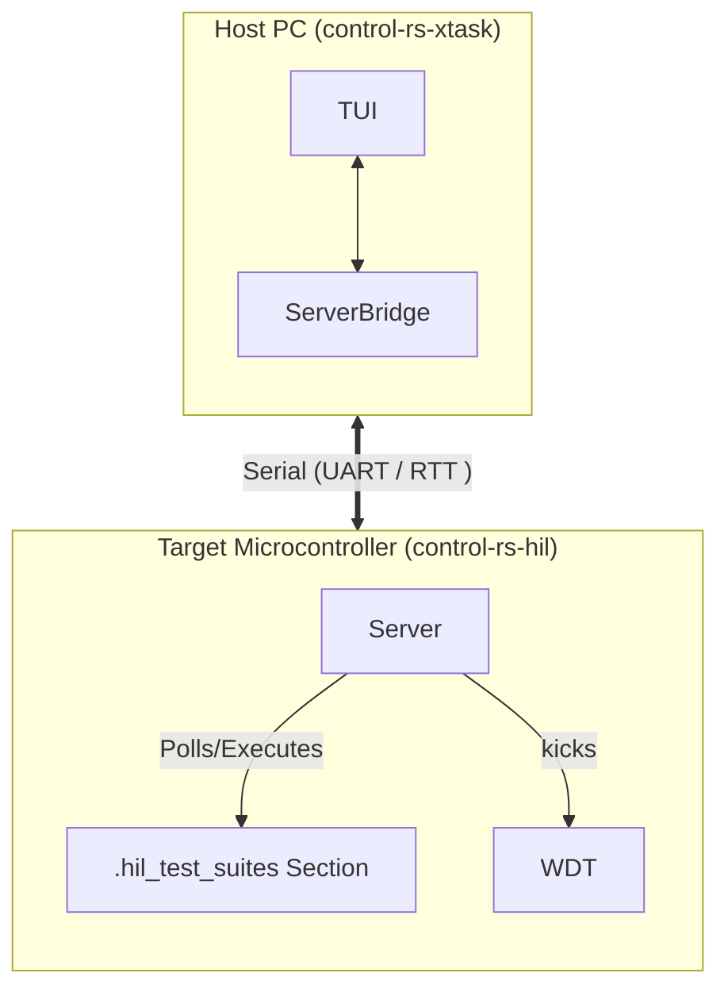
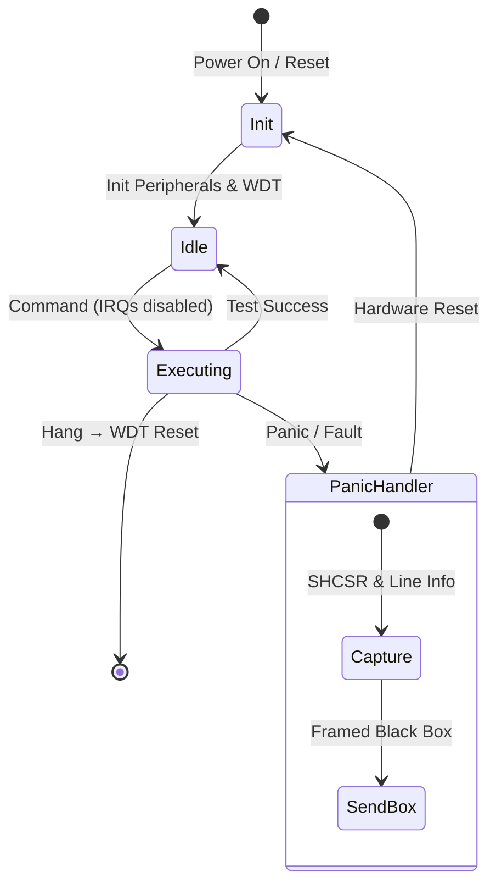

# HIL Server (Design Document)


---

### 1. Introduction

While host-based unit tests execute quickly, they cannot capture physical timing
constraints, register configurations, or real-time hardware behaviors. The HIL
Server bridges this gap by executing compiled firmware directly on the target
Microcontroller Unit (MCU), operating as an interactive, persistent test server.
Rather than running a static, sequential test suite that requires restarting the
board every run, the Server remains idle on the device, waiting for
commands.

---

### 2. Requirements

#### Functional Requirements

* **Interactive Server Execution**: The target Server must run persistently as
  an idle loop, listening for host commands and executing tests on command.
* **Distributed Test Discovery**: The system must automatically collect and
  register test cases across multiple modules without requiring a centralized
  registry.
* **Telemetry Stream**: The target must transmit execution status,
  assertions, performance metrics, and debugging logs back to the host.
* **Crash Recovery**: In the event of a test panic or a hardware
  exception (e.g., HardFault), the Server must capture diagnostic details (a "
  Firmware Black Box") and transmit them before performing a hardware reboot.
* **Lockup Recovery**: If a test hangs while interrupts are disabled, the
  only recovery path is a hardware watchdog timer.

#### Non-Functional Requirements

* **Real-Time Determinism**: Telemetry and control operations must maintain
  microsecond-level timing budgets to avoid violating plant simulation
  intervals (e.g., 1000 Hz) or introducing control loop jitter.
* **Timing-Critical Logging**: The logging system must not block the CPU
  during tests.

#### Constraints

* **Zero Dynamic Allocation**: The target Server must compile under `#![no_std]`
  and use zero heap allocation to avoid memory exhaustion and fragmentation.
* **Memory & Flash Efficiency**: The target Server (excluding individual
  tests) must consume less than 32 KB of Flash (ROM) and 8 KB of RAM. Test suite
  descriptors must reside in ROM.

---

### 3. Technical Overview

The HIL Server framework is structured as a dual-targeted system across two
execution environments: the Host PC and the Target MCU.

1. **Host-Side (PC)**:
    - **`control-rs-xtask`**: Orchestrates firmware compilation, flashing, and
      automated execution. It parses the compiled ELF file to extract the list
      of available test suites prior to execution.
    - **TUI**: An interactive developer terminal interface that displays
      available test suites, starts execution, and displays telemetry logs.
2. **Target-Side (MCU)**:
    - **HIL Server**: The main loop that receives commands, dispatches test
      functions, and manages the test state machine.
    - **HostComms Concrete Drivers**: Drivers implementing UART (with DMA) or
      SEGGER RTT for data transport.
    - **Distributed Test Sections**: Test functions compiled into a dedicated
      ELF memory section.
    - **Watchdog & Panic Handler**: Systems ensuring target safety, diagnostic
      capture, and system reset.



---

### 4. Core Architecture

#### 4.1. Workspace Structure & Cross-Compilation

To prevent compilation friction, `control-rs` implements a dual-targeted nested
Cargo workspace structure. This separates platform-independent business logic
from target-specific peripheral drivers:

```
control-rs (Root Workspace)
├── control-rs-hil/     # Target-side server event loop, settings registry, and profiling
├── control-rs-xtask/   # Host-side orchestration (TUI, headless CI, QEMU bridge)
├── control-rs-macros/  # Procedural macros for test suite setup and registry generation
├── examples/           # Target binary examples (qemu/teensy4) executing on-device
└── src/                # Standard host-side library algorithms and modules
```

Because serial ports and USB debug bridges are exclusive resources, parallel
host execution will deadlock. Host-side integration tests (via `cargo test`)
must claim exclusive access and run in a single-threaded configuration using
the `--test-threads=1` flag in Cargo.

#### 4.2. Test Discovery via Linker Metaprogramming

To avoid the overhead of runtime registration or unstable nightly custom test
harnesses, test discovery is implemented as a "distributed slice" inside a
dedicated linker section named `.hil_test_suites`.

This mechanism is implemented today: `control-rs-macros` emits
`#[unsafe(link_section = ".hil_test_suites")]` static descriptors, and
`control-rs-hil/build.rs` generates a linker script reserving the section with
`KEEP` and exposing `__hil_test_suites_start`/`__hil_test_suites_end` boundary
symbols.

Each test is declared using static structs:

```rust
pub struct ExecDescriptor {
    pub description: &'static str,
    pub name: &'static str,
    pub test_fn: fn(),
}

pub struct SuiteDescriptor {
    pub description: &'static str,
    pub executables: &'static [ExecDescriptor],
    pub name: &'static str,
    pub settings: &'static [&'static dyn Setting],
}
```

#### 4.3. Execution Model & Watchdog

The Server's runner executes test suites in a non-preemptive executive loop.
Once a test function is invoked, it retains total program control until
finished.

##### Vulnerability to Lockups

If a test enters an infinite loop or blocks waiting for an interrupt that never
fires, the MCU will freeze. The host will register a timeout, but the target
will remain unresponsive, requiring physical intervention.

##### Future Extension: Mitigation via Task Watchdogs

While cooperative tests run in a non-preemptive environment and can
theoretically lock up the target MCU, the current MVP executes without active
watchdog timers to simplify initial deployment.

To prevent target freezes in production, a future extension will introduce
**Task Watchdog**:

1. The hardware Watchdog Timer (WDT) is initialized on boot.
2. Individual test sub-tasks dynamically register virtual watchdogs with a
   central multiplexer.
3. The hardware WDT is fed only if *all* registered virtual watchdogs check in
   within their individual timeouts.

#### 4.4. Panic Handling, Firmware Black Box, and State Recovery

When a test assertion fails, the custom `#[panic_handler]` takes over to capture
debugging forensic data and return the system to a clean state.

##### Firmware Black Box

Before rebooting, the panic handler constructs a diagnostic payload:

- Panic line number and file.
- Hardware interlock states.
- System Handler Control and State Register to capture fault details.

##### Programmatic Reset: SCB vs. WDT

- **Hard Resets**: If a test panics during a DMA write, a soft reset will reboot
  the CPU but leave the DMA active, corrupting RAM after the reboot.

If the system requires recovery from board-level power failures, external
supervisor ICs and bulk capacitors are integrated to allow the MCU to gracefully
shut down and prevent NVRAM corruption.

#### 4.5. Target-Side Execution Flow



---

### 5. Alternatives

#### 5.1. Debug-Probe-Driven execution (probe-rs + embedded-test)

* Instead of UART communication, the host uses `probe-rs` to flash tests and
  direct execution using ARM semihosting (`SYS_GET_CMDLINE`).
    - *Reason for Rejection*: Semihosting halts the CPU pipeline during I/O
      operations [6]. This introduces millisecond-level timing overhead,
      destroying the real-time determinism.

#### 5.2. Soft Reset (SCB::sys_reset)

* Using the CPU System Control Block to reboot.
    - *Reason for Rejection*: Leaves peripherals (like DMA) active, risking
      post-reboot memory corruption (Heisenbugs). Watchdog starvation is chosen
      for a guaranteed clean state.

#### 5.3. Third-Party Distributed Slice (`linkme`)

* Adopting `linkme::DistributedSlice` [1] in place of the hand-rolled
  `.hil_test_suites` linker section.
    - *Reason Not Adopted*: The custom mechanism is already implemented,
      tested, and shipped (§4.2). Adopting `linkme` would trade that
      working code for reduced linker-script maintenance burden and
      `linkme`'s existing cross-platform linker-section portability; whether
      the migration is worth the churn remains open (§8).

#### 5.4. COBS Byte-Stuffed Framing

* Delimiting frames with COBS byte-stuffing (escaping the frame boundary byte
  out of the payload) instead of a length-prefixed header.
    - *Reason for Rejection*: The `HostComms` design
      (`documentation/xtask/design/host-comm-design-doc.md`, §4.4–§5) selected
      a sync-byte (`0xAA 0x55`) + big-endian length prefix + CRC-16-IBM-SDLC
      trailer to minimize target-side processing and framing overhead, and
      this is what `control-rs-hil/src/comms.rs` implements. The tradeoff is a
      weaker resynchronization guarantee than COBS provides (§7).

---

### 6. Verification & Validation

#### 6.1. Verification Plan

* **Watchdog Recovery Test**: Execute a mock test that enters an infinite loop.
  Verify that the hardware watchdog reset is triggered, the MCU reboots, and the
  Server returns to Idle.
* **Panic Black Box Test**: Execute a test designed to panic. Verify that the
  host receives a framed "Black Box" payload containing the correct panic
  location and register values, followed by a system reboot.

#### 6.2. Validation Plan

* **Hardware-in-the-Loop Execution**: Run the HIL suite on a physical target (
  e.g., Teensy 4.0/4.1 or STM32 nucleo) using the `xtask` orchestrator. Verify
  that tests execute and report back in real-time.
* **Continuous Integration**: Verify that the GitHub Actions CI
  pipeline can execute the HIL Server headlessly, capturing serial streams and
  failing the pipeline if a test fails.

---

### 7. Performance & Resource Considerations

* **Flash/RAM Footprint**: The target-side Server must consume less than 32
  KB of Flash and 8 KB of RAM. Descriptors are stored strictly in ROM.
* **Real-Time Telemetry Jitter**: Telemetry transmission must not induce jitter
  in the 1000 Hz control loop. Hot-path telemetry is serialized as postcard
  enums with no on-target string formatting; `core::fmt` is confined to the
  `SetSetting` error path. `defmt` is not currently a dependency; adopting its
  deferred host-side formatting (sub-5 µs print overhead) remains an option if
  formatted logging is ever needed on the hot path.
* **DMA vs. Polling**: UART communications must use DMA to free CPU cycles
  during test runs.
* **Resynchronization Latency**: The implemented framing (sync-byte
  `0xAA 0x55` + big-endian length prefix + CRC-16-IBM-SDLC trailer)
  resynchronizes by scanning for the next sync-byte pair with a matching
  length and checksum, typically within one frame duration (< 1ms at 115200
  baud) under isolated bit errors. This is a weaker guarantee than COBS's
  escape-based delimiter, which can never appear mid-payload: a corrupted
  length field can produce a false frame boundary that a sync-byte scan alone
  cannot detect.

---

### 8. Risks & Open Questions

* **RTT Buffer Overflow**: In non-blocking RTT mode, high-frequency logging can
  overflow the target buffer if the debug probe doesn't read it quickly enough,
  leading to lost logs.
* **Watchdog Library Adoption**: `task-watchdog` [2] and `mwdg` [3] already
  solve Task Watchdog Multiplexing (§4.3). Pulling one into MVP scope, versus
  continuing to defer it, is undecided; neither has been evaluated against
  this crate's Embassy-vs-blocking driver assumptions, and no `embassy`
  dependency currently appears in this repository's `Cargo.lock`.
* **Preemptive Scheduling Alternative**: RTIC's priority-based preemptive
  model [4] addresses the Cooperative Multitasking Lockups constraint (§2) at
  the scheduler level rather than via watchdog multiplexing. Adopting it would
  be a materially larger change to the entire target-side execution model and
  has not been evaluated against this design's scope.
* **Test Discovery Dependency Tradeoff**: Replacing the custom
  `.hil_test_suites` mechanism with `linkme` (§5.4) trades already-working
  code for reduced linker-script maintenance burden; not yet decided.
* **CI Orchestration Precedent**: Golioth's self-hosted-runner-with-
  hardware-labels pattern [5] is the closest surveyed prior art for CI
  integration with physically attached hardware, but has not yet been
  cross-checked against `control-rs-xtask`'s already-declared host
  dependencies (`serial2`, `ratatui`, `crossterm`, `serde_json`).

---

### 9. Development Plan

| Task / Feature                                                 | Description                                                                                                                                                                      | Estimated Effort |
|:---------------------------------------------------------------|:---------------------------------------------------------------------------------------------------------------------------------------------------------------------------------|:-----------------|
| **Step 1: Test Discovery (Linker)** — *Shipped*                | `.hil_test_suites` section discovery and linker `KEEP` directive, implemented in `control-rs-macros` and `control-rs-hil/build.rs`.                                              | Complete         |
| **Step 2: Postcard Messaging & Sync-Byte Framing** — *Shipped* | Postcard message schemas and sync-byte + length + CRC-16 framing, implemented per the `HostComms` design.                                                                        | Complete         |
| **Step 3: HIL Server & Driver Integration**                    | Implement target-side server loop with UART DMA / RTT drivers. Blocking-HAL vs. Embassy driver model undecided — no `embassy` dependency currently exists in the workspace (§8). | 3 days           |
| **Step 4: Watchdog & Panic Recovery**                          | Integrate multiplexed virtual task watchdogs (custom or adopted, §8) and custom HardFault panic handler.                                                                         | 2 days           |
| **Step 5: Host Orchestrator (`xtask`)**                        | Build host-side CLI parser, ELF discovery tool, and TUI console.                                                                                                                 | 3 days           |

---

### References

1. `linkme::DistributedSlice`,
   docs.rs — https://docs.rs/linkme/latest/linkme/struct.DistributedSlice.html
2. `task-watchdog`, crates.io — https://crates.io/crates/task-watchdog/0.1.1
3. `mwdg`, docs.rs — https://docs.rs/mwdg/latest/mwdg/
4. `rtic-rs/rtic`, GitHub — https://github.com/rtic-rs/rtic
5. "How Golioth uses Hardware-in-the-Loop (HIL) Testing: Part 2", Golioth
   Developer Blog — https://blog.golioth.io/golioth-hil-testing-part2/
6. `probe-rs/embedded-test`, GitHub — https://github.com/probe-rs/embedded-test

---

### 10. Revision History

| Revision | Date           | Description                                                                                                                                                                                                                                                                                                                                                   | Author          |
|:---------|:---------------|:--------------------------------------------------------------------------------------------------------------------------------------------------------------------------------------------------------------------------------------------------------------------------------------------------------------------------------------------------------------|:----------------|
| 1.0      | May 23, 2026   | Initial design of the HIL Server harness.                                                                                                                                                                                                                                                                                                                     | @MitchellDScott |
| 1.1      | July 18, 2026  | Restructured to template; integrated research findings on linker KEEP directives, watchdog multiplexing, COBS/postcard telemetry, soft vs. hard reset trade-offs, and safety compliance details.                                                                                                                                                              | @MitchellDScott |
| 1.2      | August 5, 2026 | Corrected framing description to match the shipped sync-byte + length + CRC-16 scheme (COBS was considered and rejected, not adopted); noted `.hil_test_suites` discovery and postcard/serde messaging as already implemented rather than open proposals; added `linkme`, `task-watchdog`/`mwdg`, and RTIC as evaluated alternatives; added inline citations. | @MitchellDScott |
| 1.3      | August 6, 2026 | Corrected §7 telemetry claim (`defmt` is not a dependency; hot-path telemetry is postcard enums); removed the Embassy assumption from Development Plan Step 3; aligned the watchdog constraint with its MVP deferral in §4.3.                                                                                                                                 | @MitchellDScott |
| 1.4      | August 9, 2026 | Review, diagram updates and corrections.                                                                                                                                                                                                                                                                                                                      | @MitchellDScott |
