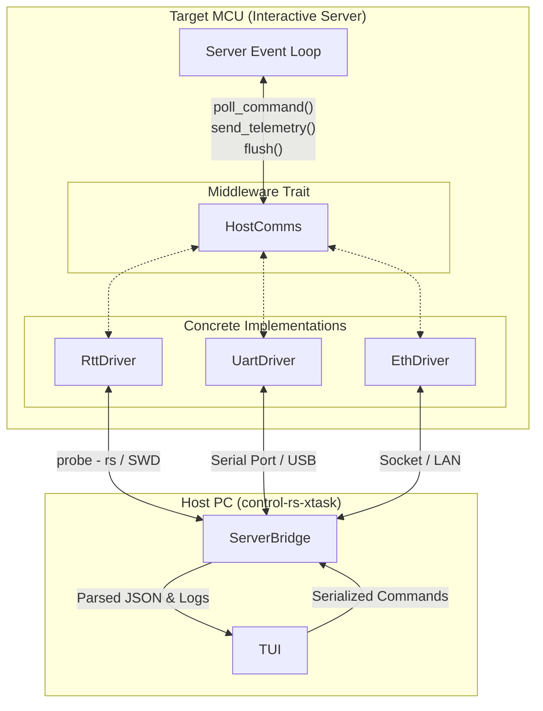

# HostComms (Design Document)


---

### 1. Introduction

The `HostComms` trait is designed to provide a unified, hardware-agnostic
communication abstraction for applications operating in resource-constrained
environments. This allows the Server to separate physical transport mechanics
(such as serial ports, network sockets, or hardware debug probes) from its
core logic.

---

### 2. Requirements

#### Functional Requirements

- **FR-1 — Unified Abstraction**: The target firmware must expose a hardware-agnostic API to poll commands, transmit telemetry, and flush data.
- **FR-2 — Bidirectional Telemetry**: The system must support host-to-target command packets and target-to-host telemetry packets.
- **FR-3 — Catastrophic Failure Capture**: The target must capture panics and hardware exceptions, format them with timestamps and backtraces, and transmit them as prioritized telemetry before halting or rebooting.

#### Non-Functional Requirements

- **NFR-1 — Low Latency & Determinism**: Telemetry and logging must execute within microsecond-level budgets to avoid violating real-time plant simulation intervals or inducing control loop jitter.
- **NFR-2 — Zero Dynamic Allocation**: The target-side library must compile under `#![no_std]` with strictly zero heap allocation.
- **NFR-3 — High Bandwidth Efficiency**: The protocol must minimize transport payload footprint, shifting formatting and UI state management onto the host.

#### Constraints

- **C-1 — Strict `#![no_std]` Target Execution**: The firmware environment has no standard library or heap allocator.
- **C-2 — Stack Footprint Restrictions**: Serialization must avoid massive stack allocations to prevent overflows on memory-limited microcontrollers.
- **C-3 — Physical Connectivity Limits**: Interfaces are restricted to standard peripherals (UART, Ethernet MAC/PHY) or hardware debug probes (SWD/JTAG).

---

### 3. Technical Overview

The `HostComms` trait spans two distinct execution environments:

1. **Target-side (microcontroller)**: A zero-cost abstraction trait and
   associated drivers that pack telemetry data, frame packets, and poll for
   inbound commands.
2. **Host-side (PC)**: A demultiplexing (DEMUX) state machine that reads raw
   target bytes, verifies framing, decodes compressed logs using ELF symbols,
   and interfaces with the user interface.

Implementing and deploying the system requires expertise in:

* Advanced embedded Rust development, including asynchronous executors (
  `embassy`) and direct hardware memory access (DMA).
* High-efficiency binary serialization format design and bitwise framing
  algorithms (`postcard`, sync-byte framing, CRC).
* Compiler-level instrumentation and string table mapping (deferred formatting
  with `defmt`).
* Core debugging protocol drivers and memory polling systems (SWD/JTAG,
  `probe-rs`).
* Network programming (WebSockets, RPC, TCP/IP stacks).



---

### 4. Core Architecture

#### 4.1. Middleware Trait

The core of the abstraction is the `HostComms` trait. Implementations of this
trait encapsulate the hardware-specific details of reading and writing bytes.

```rust
pub trait HostComms {
    /// The error type associated with transport failures.
    type Error;

    /// Closes the communication interface (e.g. signaling semihosting exit).
    fn close(&mut self) {}

    /// Closes the communication interface with a failure/error status.
    fn close_on_failure(&mut self) {}

    /// Flush any pending buffered data out to the physical interface.
    fn flush(&mut self) -> SendResult<Self::Error>;

    /// Read incoming bytes and try to parse a Command.
    ///
    /// This should be non-blocking.
    fn poll_command(&mut self) -> PollResult<Self::Error>;

    /// Send a telemetry message to the host.
    fn send_telemetry(
        &mut self,
        telemetry: &Telemetry<'_>,
    ) -> SendResult<Self::Error>;
}
```

The associated type `Error` allows concrete drivers to bubble up
hardware-specific failures (e.g., framing errors, overflow flags, socket
disconnects) to the calling Server loop.

#### 4.2. Command Schema & Binary Serialization

Commands originating from the host are defined by a strict, shared Rust schema
to ensure structural alignment:

```rust
#[derive(Debug, Clone, PartialEq, Eq)]
pub enum Command {
    /// Request the target to stream the list of all suites, tests, and settings.
    ListSuites,
    /// Request execution of a specific test.
    RunExecutable {
        /// The ID of the test suite to execute.
        suite_id: u16,
        /// The ID of the test within the suite.
        test_id: u16,
    },
    /// Update a setting's value.
    SetSetting {
        /// The ID of the setting to update.
        setting_id: u16,
        /// The ID of the suite containing the setting.
        suite_id: u16,
        /// The new value of the setting.
        value: SettingValue,
    },
    /// Request the target to reset.
    TryReset,
}
```

To minimize parsing overhead and memory usage in a `#![no_std]` environment, the
architecture uses the **`postcard`** crate.

Postcard achieves a minimal wire footprint through:

* **Varints**: Variable-length integer encoding that compresses smaller
  numbers (like enum variants and array bounds) into fewer bytes.
* **Endianness**: Explicit Little-Endian byte ordering, which matches the native
  architecture of common microcontrollers (ARM Cortex-M, RISC-V), avoiding
  CPU-intensive byte-swapping.
* **Zero Allocation**: Serialization is done directly into pre-allocated static
  buffers (such as `heapless::Vec`) or streaming writers to mitigate stack
  overflow risks on low-resource targets.

#### 4.3. Log Formatting & Compression (`defmt`)

Standard string formatting on a microcontroller is computationally and
space-expensive, bloating target flash memory with static templates and
consuming excessive CPU cycles to interpolate values. The HostComms architecture
plans deferred formatting via the **`defmt`** crate; this is not yet
implemented — shipped telemetry is postcard enums with no on-target string
formatting (see `hil-server-design-doc.md` §7):

```rust
#[derive(Debug, Clone)]
#[cfg_attr(feature = "serde", derive(serde::Serialize, serde::Deserialize))]
pub struct LogMessage<'a> {
    /// The log text payload.
    pub payload: &'a str,
    /// The ID of the test suite.
    pub suite_id: u16,
    /// The ID of the test executable.
    pub test_id: u16,
    /// Microseconds elapsed since boot / epoch.
    pub timestamp_us: u64,
}
```

#### 4.4. Packet Framing & Consistency

Serial channels like UART operate as continuous byte streams without packet
boundaries. To segment individual commands and telemetry logs, the system
utilizes a custom framed binary packet structure with Sync Headers and CRC-16
integrity validation:

* **Sync Header**: 2 bytes (`0xAA 0x55`) used to identify the beginning of a
  frame.
* **Payload Length**: 2 bytes (big-endian) defining the size of the serialized
  postcard payload.
* **Postcard Payload**: The serialized data block (limited to a maximum of 512
  bytes).
* **Integrity Check**: A 2-byte (big-endian) CRC-16 checksum (calculated using
  `CRC_16_IBM_SDLC`) appended at the end of the frame payload.
* **Single-Pass Decoding**: The host `FrameReader` processes incoming streams
  statefully byte-by-byte, checking for the sync header, validating lengths, and
  confirming the CRC-16 checksum before deserializing.

#### 4.5. Target-Side Driver Implementations

Users are responsible for implementing the `HostComms` trait for their target
board.

```rust
// Example skeleton for a target UART implementation
struct UartComms {
    uart: hardware::Uart,
    buffer: heapless::Vec<u8, 256>,
}

impl HostComms for UartComms {
    type Error = hardware::Error;

    fn poll_command(&mut self) -> Result<Option<Command>, Self::Error> {
        // Non-blocking read and framing parsing logic
        Ok(None)
    }

    fn send_telemetry(&mut self, log: &LogMessage) -> Result<(), Self::Error> {
        // Serialize via postcard, add sync headers and CRC-16 checksum, and write to UART DMA buffer
        Ok(())
    }

    fn flush(&mut self) -> Result<(), Self::Error> {
        // Wait for DMA write to complete
        Ok(())
    }
}
```

#### 4.6. Host-Side Tooling & Portability

On the host side, standard environments utilize the **`probe-rs`** debugging
library to flash binaries, control execution, and poll target RTT buffers over
SWD/JTAG.

##### Hardware Portability & Non-probe-rs Environments

> Because `probe-rs` does not support all microcontroller boards or
> architectures, the HostComms design enforces a strict separation between
> debug-probe dependency and the host demultiplexer.
>
> For boards lacking `probe-rs` compatibility, the host-side DEMUX can bypass
> debug probes entirely:
> * **Standard Serial Port Input**: The DEMUX engine can interface directly with
    standard serial (COM) ports using native host library utilities (the
    `serial2` crate, already a `control-rs-xtask` dependency).
> * **Standard Socket Input**: For networked targets, the DEMUX engine can
    connect to the target via standard TCP/UDP stream sockets.
> * This ensures the HIL test harness remains fully portable to any hardware
    target that can export framed binary payloads over UART or Ethernet.

---

### 5. Alternatives

* **Text-Based Serialization (JSON, XML)**: Considered for ease of debugging but
  rejected. Verbose text formats consume excessive bandwidth and require
  significant CPU cycles and allocation on the target to parse and format.
* **Protobuf & FlatBuffers**: Protobuf requires a memory-allocation-heavy
  deserialization step, which is unacceptable under strict `#![no_std]`.
  FlatBuffers avoids parsing overhead (zero-copy) but consumes a larger memory
  footprint due to strict alignment padding and has a less ergonomic API for
  bare-metal targets. Postcard was selected for its native Rust type mapping,
  zero-allocation design, and variable-length integer compression. Although COBS
  framing was considered for packet delimiting, the final implementation uses a
  sync-byte and length-based frame header with CRC-16 checksums to minimize
  target-side processing and framing overhead.
* **Standard Printing (`printf`, `core::fmt`)**: Rejected for primary logging
  because it stores massive static format string templates in target flash
  memory and formats them at runtime, causing significant execution delays.
  Deferred formatting (`defmt`) was chosen.

---

### 6. Verification & Validation

#### Automated Verification

* **Serialization Unit Tests**: Run unit tests on the host to verify that
  `Command` and `LogMessage` payloads are correctly serialized, framed,
  and reconstructed with 100% fidelity.
* **Timing Checks**: Implement regression tests in the HIL Server to measure
  target execution jitter and confirm that telemetry operations do not violate
  real-time solver timing budgets.
* **CI Integration**: Automated build verification testing to compile target
  code for all supported architectures (`thumbv7em-none-eabihf`, etc.) and
  compile the host TUI tool natively.

#### Manual Validation

* **Fault Injection Simulation**: Simulate on-target panics, hard faults, and
  brownouts to validate that `panic-probe` and `panic-persist` reliably transmit
  crash details to the host TUI.
* **Hardware Portability Test**: Deploy the exact same Server logic over
  UART DMA, SEGGER RTT, and Ethernet physical interfaces to confirm transport
  independence.
* **Remote WebSocket Demo**: Validate remote flashing, control, and telemetry
  streaming on a remote Raspberry Pi host node from a separate client machine.

---

### 7. Performance & Resource Considerations

* **Solver Timing Budget**: HIL solvers operate on strict millisecond steps. The
  entire target execution block—including controls, sensor reads, and telemetry
  serialization—must complete before the solver step expires. Late responses are
  flagged as timing failures.
* **Static Allocation Bounds**: All target buffer structures are statically
  allocated using `heapless` types. Storing large data blocks requires chunking
  to prevent stack overflows, as no heap is available.
* **Transport Comparison**:

| Transport Protocol  | Physical Interface  | CPU Overhead                                | Implementation Complexity                               | Primary Use Case in HIL Architectures                         |
|:--------------------|:--------------------|:--------------------------------------------|:--------------------------------------------------------|:--------------------------------------------------------------|
| **UART (with DMA)** | TX, RX, GND         | Low (DMA handles data movement)             | Medium (Requires async executor and DMA configuration)  | Standard serial telemetry, electrically isolated test setups. |
| **Ethernet**        | RJ45 / Twisted Pair | High (Requires full TCP/IP stack execution) | High (Requires network routing and MAC/PHY integration) | High-bandwidth, remote networked test rigs.                   |
| **SEGGER RTT**      | SWD / JTAG pins     | Minimal (In-memory copy only)               | Low (Utilizes existing debug hardware)                  | High-speed, low-overhead tracing and debug polling.           |

---

### 8. Risks & Open Questions

* **ELF Synchronization Risk**: Since `defmt` strips string templates from the
  binary, the host must use the exact matching ELF file to decode log indices.
  If the target firmware is updated and the host references an outdated ELF
  file, the telemetry log will decode as gibberish.
* **Non-Blocking RTT Overflow**: In non-blocking RTT mode, if telemetry is
  generated faster than the SWD probe polls target RAM, older packets will be
  overwritten. This data loss risk must be monitored via buffer occupancy
  metrics.
* **probe-rs Board Support Limits**: Some legacy or highly custom
  microcontrollers are not supported by the `probe-rs` CMSIS-Pack library.
  Developers on these platforms must fall back to standard serial/TCP inputs,
  losing SWD background RAM access but maintaining basic HostComms telemetry.

---

### 9. Development Plan

| Task / Feature                                       | Description                                                                                                                                | Estimated Effort |
|:-----------------------------------------------------|:-------------------------------------------------------------------------------------------------------------------------------------------|:-----------------|
| **Step 1: Core Serialization & Framing** — *Shipped* | Postcard schemas, sync-header framing/deframing, and CRC-16 verification, implemented in `control-rs-hil/src/comms.rs`.                    | Complete         |
| **Step 2: Target Trait & Drivers**                   | Implement the `HostComms` trait on the target, writing drivers for Embassy UART DMA, SEGGER RTT buffers, and smoltcp Ethernet.             | 2 weeks          |
| **Step 3: Target Crash Handlers**                    | Integrate `panic-probe` and `panic-persist` handlers to write backtrace logs to active buffers and persistent RAM regions.                 | 1 week           |
| **Step 4: Host-Side DEMUX & Decoder**                | Build the TUI state machine and integrate the `defmt-decoder` using ELF files, supporting direct inputs from serial ports and TCP sockets. | 2 weeks          |
| **Step 5: Remote HIL Infrastructure**                | Set up the WebSocket-based `probe-rs` remote server, implement `postcard-rpc` commands, and configure Docker cross-compilers.              | 2 weeks          |

---

### 10. Revision History

| Revision | Date | Author | Description |
|:---------|:-----|:-------|:-------------|
| 1.0 | May 23, 2026 | @MitchellDScott | Initial draft outlining HostComm middleware trait. |
| 1.1 | July 18, 2026 | @MitchellDScott | Restructured to template; incorporated HIL, serialization, framing, and remote-tooling research findings. |
| 1.2 | August 6, 2026 | @MitchellDScott | Consistency pass: removed COBS-as-chosen language, marked `defmt` planned, standardized on `serial2`, fixed numbering. |
| 1.3 | August 9, 2026 | @MitchellDScott | Review and corrections. |
