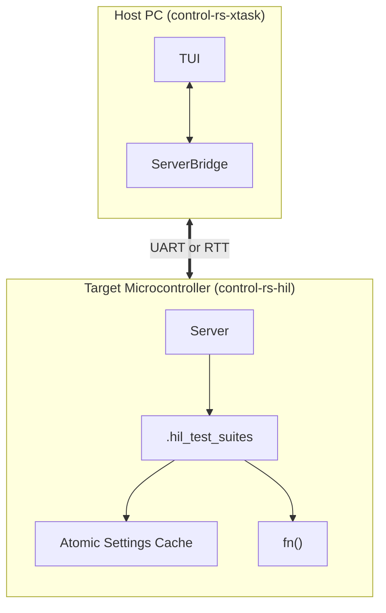

# Exportable Test Suites (Design Document)


---

### 1. Introduction

The standard Rust testing harness (`cargo test`) implicitly relies on the
standard library (`std`), which triggers compilation errors in bare-metal
environments. Attempting to bypass this by setting `harness = false` solves the
immediate compilation failure but leaves a functional void with no native
mechanism to automatically discover, execute, or report tests.

This design document establishes the architecture for "Exportable Test Suites"
designed natively for bare-metal embedded Rust. It enables developers to declare
test or benchmark suites across multiple files without maintaining a central
registry, requiring zero boilerplate and little runtime overhead.

---

### 2. Requirements

#### Functional Requirements

- **FR-1 — Suite Discovery**: The suites must be discoverable at runtime.
- **FR-2 — Dynamic Parameter Configuration**: Settings on the target must be adjustable from the host (`xtask`).
- **FR-3 — Embedded Metadata**: Test suites must include doc-strings.

#### Non-Functional Requirements

- **NFR-1 — Zero Runtime Registration Overhead**: The test registry must be constructed during the linking phase.
- **NFR-2 — High ROM/RAM Efficiency**: Test descriptors must reside directly in Flash memory (ROM) to conserve RAM.
- **NFR-3 — Low-Overhead Execution**: Running an empty test function must return immediately, costing only a few cycles.
- **NFR-4 — Real-Time Telemetry Updates**: Telemetry streams must support low-latency delivery to maintain smooth host-side rendering (under 16ms).

#### Constraints

- **C-1 — Strict `#![no_std]` Execution**: The target-side framework must compile under `#![no_std]` with zero dynamic heap allocation.
- **C-2 — Target Architecture Constraints**: ARM-V6/7/8 and RISC-V.
- **C-3 — Eradication of `static mut`**: All global state and configurable settings must use thread-safe interior mutability wrappers, not `static mut`.

---

### 3. Technical Overview

The Exportable Test Suites framework consists of three main components:

1. **Target-side Harness (`control-rs-hil`)**: The on-target interactive Server
   that manages target execution, dynamic settings configuration, and CPU
   profiling.
2. **Procedural Macros (`control-rs-macros`)**: Attributes (`#[hil_suite]` and
   `#[hil_setup]`) that abstract the boilerplate of creating descriptors and
   wrapping test main functions.
3. **Host-side Orchestrator (`control-rs-xtask`)**: Standard Rust automation
   scripts that cross-compile the firmware, parse ELF files to discover test
   suites, and control debugging hardware.



---

### 4. Core Architecture

#### 4.1. Linker-Based Distributed Test Discovery

Instead of building a dynamic test registry at runtime, the framework utilizes a
linker-based distributed slice mechanism. Procedural macros generate
`SuiteDescriptor` instances for each suite and place them in a custom ELF memory
section named `.hil_test_suites`.

During compilation, the `control-rs-hil` build script (`build.rs`) generates a
linker script fragment named `hil_suites.x` containing the following section
configuration:

```ld
SECTIONS
{
  .hil_test_suites :
  {
    . = ALIGN(4);
    PROVIDE_HIDDEN (__hil_test_suites_start = .);
    KEEP (*(.hil_test_suites));
    . = ALIGN(4);
    PROVIDE_HIDDEN (__hil_test_suites_end = .);
  } > FLASH
}
```

This forces the linker to aggregate all `SuiteDescriptor` static structures
contiguously inside Flash memory (ROM) bounded by the hidden start and end
symbols.

#### 4.2. Linker Garbage Collection Mitigation

Embedded compilers invoke the linker with optimization flags like
`--gc-sections` to perform dead code elimination. Since the target firmware does
not reference `SuiteDescriptor` statics directly (accessing them only via
pointer arithmetic over the bounding symbols), the linker would normally discard
them.

To prevent this, the crate implements a multi-tiered retention strategy:

1. **`#[used]` Attribute**: Annotating static descriptors tells the
   compiler and linker to retain the symbol. On ELF targets, this generates the
   `SHF_GNU_RETAIN` flag.
2. **`KEEP` Linker Directive**: Wrapping the section wildcard as
   `KEEP (*(.hil_test_suites))` forces the linker to preserve these blocks
   regardless of references.
3. **`--gc-keep-exported` Linker Flag**: Injected via `build.rs` to retain
   default visibility symbols in the ELF dynamic symbol table, enabling host
   tools to resolve them by name.
4. **Undefined Symbol Forcing (`-u`)**: Forces the linker to treat specific
   symbols as undefined, compelling their inclusion from library archives.

This multi-tiered strategy also hedges against
[rust-lang/rust#67209](https://github.com/rust-lang/rust/issues/67209), an
open compiler defect in which `#[used]` + `#[link_section]` statics defined in
dependency (non-root) crates are silently discarded even when a `KEEP`
directive is present.

#### 4.3. Concurrency & State Management (Eradicating `static mut`)

To comply with Rust 2024/2027 and prevent undefined behavior from unsynchronized
interrupt preemption, all global state variables are protected via thread-safe
interior mutability.

1. **Type-Safe Atomic Wrappers**: Configurable settings and execution indices
   use atomic structures (like `AtomicU32Setting` and `AtomicBoolSetting`)
   implementing the `Setting` trait.
2. **Memory Ordering**: Telemetry and configuration variables use
   `Ordering::Relaxed`. Since these variables do not synchronize access to other
   shared buffers, `Relaxed` ordering eliminates the need for expensive memory
   barrier instructions (`DMB`/`DSB`), saving clock cycles.
3. **`SyncUnsafeCell`**: For complex data structures where atomic operations are
   not suitable, `core::cell::SyncUnsafeCell` is used to manage raw pointers (
   `*mut T`), isolating unsafe blocks strictly to the points of dereference.

#### 4.4. Core Trait & Struct Definitions

The core implementation in `control-rs-hil` defines the `SuiteDescriptor` and
`ExecDescriptor` structures, along with the `Setting` trait:

```rust
pub struct ExecDescriptor {
    pub description: &'static str,
    pub name: &'static str,
    pub test_fn: fn(),
}

pub type SettingsSlice = &'static [&'static dyn Setting];

pub struct SuiteDescriptor {
    pub description: &'static str,
    pub executables: &'static [ExecDescriptor],
    pub name: &'static str,
    pub settings: SettingsSlice,
}
```

The settings trait and its atomic implementations are defined as:

```rust
pub type SetResult = Result<(), &'static str>;

pub trait Setting: Sync {
    fn description(&self) -> &'static str;
    fn expected_type(&self) -> SettingType;
    fn get(&self) -> SettingValue;
    fn name(&self) -> &'static str;
    fn set(&self, value: SettingValue) -> SetResult;
}

pub enum SettingType {
    Bool,
    F32,
    I32,
    I8,
    U16,
    U32,
    U64,
    U8,
}

pub enum SettingValue {
    Bool(bool),
    F32(f32),
    I32(i32),
    I8(i8),
    U16(u16),
    U32(u32),
    U64(u64),
    U8(u8),
}
```

```rust
// An atomic setting implementation example from control-rs-hil
pub struct AtomicU32Setting {
    description: &'static str,
    name: &'static str,
    value: core::sync::atomic::AtomicU32,
}

impl AtomicU32Setting {
    pub const fn new(name: &'static str, description: &'static str, initial_value: u32) -> Self {
        Self {
            description,
            name,
            value: core::sync::atomic::AtomicU32::new(initial_value),
        }
    }
}

impl Setting for AtomicU32Setting {
    fn description(&self) -> &'static str { self.description }
    fn expected_type(&self) -> SettingType { SettingType::U32 }
    fn get(&self) -> SettingValue { SettingValue::U32(self.value.load(Ordering::Relaxed)) }
    fn name(&self) -> &'static str { self.name }
    fn set(&self, value: SettingValue) -> SetResult {
        if let SettingValue::U32(v) = value {
            self.value.store(v, Ordering::Relaxed);
            Ok(())
        } else {
            Err("Type mismatch: expected U32")
        }
    }
}
```

#### 4.5. Telemetry & Execution Lifecycle

Interactive testing sessions follow a strict state-machine flow:

1. **Flashing & Reset**: The host-side `xtask`/`ServerBridge` flashes the
   firmware to the target and triggers a hardware reset to ensure execution
   isolation.
2. **State Tracking**: Test execution status is evaluated via start and end
   timestamps recorded on the target:
    - **Pending**: No start timestamp recorded.
    - **Running/Failed**: A start timestamp is recorded, but no end timestamp.
      If the test panics, execution halts immediately and the end timestamp is
      never written.
    - **Passed**: Both start and end timestamps are successfully recorded.
3. **Global Indicators**: Global trackers `CURRENT_SUITE` and `CURRENT_TEST` of
   type `TestIndexIndicator` store the running indices, allowing panic handlers
   to report precisely where a crash occurred.

---

### 5. Alternatives

* **Standard `cargo test` harness (libtest)**: Rejected. It implicitly requires
  standard OS allocations (heap, dynamic threads, standard input/output), which
  are fundamentally unavailable in `no_std` bare-metal environments.
* **Nightly `custom_test_frameworks` feature**: Rejected. While it allows
  collecting `#[test_case]` attributes, it relies on unstable nightly compiler
  features, which violates stability and certification requirements for
  production environments.
* **Constructor-Based Runtime Registries (e.g., `inventory` style)**: Rejected.
  These rely on `.init_array` or `.text.startup` compiler hooks to construct
  linked lists before `main()`. In embedded systems, executing code before
  board-specific hardware is initialized can result in undefined behavior or
  hardware crashes. Additionally, `inventory` documents an explicit OS-hosted
  platform allowlist and states that on any other platform submissions
  silently register nothing — silent, undetectable suite loss on exactly this
  design's target architectures. Its own README recommends `linkme` for use
  cases that must avoid life-before-main.
* **`linkme::DistributedSlice`**: Rejected for the container. It is a mature
  near-fit for flat, homogeneous slices; adopting it would force splitting
  `SuiteDescriptor` into two independently-registered slices (tests, settings)
  joined at consumption time. It also inherits the cross-crate discard risk of
  rust-lang/rust#67209
  ([linkme#36](https://github.com/dtolnay/linkme/issues/36)) with no in-crate
  workaround, whereas the hand-rolled section/`KEEP`/`-u` strategy is the
  explicit hedge against that defect.
* **Adopting an Existing Settings Registry**: Not possible. No surveyed
  `no_std` crate implements a type-erased, statically-declared,
  dynamically-mutable settings registry with typed get/set.
* **`static mut` for State Tracking**: Rejected. The use of `static mut`
  violates Rust's strict aliasing rules, making code highly susceptible to data
  races and compiler optimization bugs. Furthermore, it is deprecated in Rust
  2024 and will result in compilation errors in Rust 2027.
* **Semihosting-Only Telemetry**: Rejected. Heavily restricts the supported
  hardware.

---

### 6. Verification & Validation

#### 6.1. Verification Plan

- **Unit Tests**: Test the atomic wrappers (`AtomicU32Setting`,
  `AtomicU8Setting`, etc.) and ensure that get/set operations execute correctly.
- **Integration Tests**: Verify linker section aggregation by compiling a dummy
  target program with multiple test suites and verifying that the
  `.hil_test_suites` section is correctly populated (where len = #
  registered suites).
- **Toolchain Tests**: Build on both `thumbv6m-none-eabi` (using software CAS
  polyfills) and `thumbv7m-none-eabi` targets to verify compiling correctness
  without warnings or errors.
- **CI Verification**: Integrate the Server compilation and static ELF
  parsing checks into the workspace's GitHub Actions pipeline.

#### 6.2. Validation Plan

- **Hardware-in-the-Loop Validation**: Flash and execute the compiled test suite
  on a physical microcontroller board (e.g., Teensy 4.0/4.1) using the `xtask`
  runner.

---

### 7. Performance & Resource Considerations

* **ROM/RAM Overhead**: To operate within the 32 KB Flash and 8 KB RAM budget,
  the target Server utilizes zero heap allocations and avoids unnecessary string
  formatting on-device. All descriptors reside strictly in Flash.
* **Atomic Ordering**: Setting telemetry uses `Ordering::Relaxed` to completely
  bypass ARM memory barrier instructions (`DMB`/`DSB`), which can take multiple
  clock cycles.
* **Critical Sections**: On ARMv6-M architectures, software-emulated CAS
  operations disable interrupts. Developers must minimize the frequency of
  setting updates during time-critical control loops to avoid inducing interrupt
  latency jitter.

---

### 8. Risks & Open Questions

* **Linker Compatibility**: Older GNU ld or LLVM lld versions may not respect
  the `SHF_GNU_RETAIN` flag. Forcing symbol retention must rely heavily on the
  `KEEP` directive inside the generated `hil_suites.x` script as a fail-safe.
* **Cross-Crate Discovery (`rust-lang/rust#67209`)**: The open upstream defect
  drops `#[used]` + `#[link_section]` statics defined in dependency crates
  even with `KEEP`. Open question: must suites be declarable in separate
  crates, or only separate modules within one crate? Multi-module discovery is
  unaffected; multi-crate discovery requires the retention strategy in §4.2 as
  a hedge and must be validated per target.
* **`ExecDescriptor` Metadata Completeness**: The functional requirements list
  `#[should_panic]`, `#[ignore]`, and `#[timeout]`, but `ExecDescriptor` (§4.4)
  carries only `description`, `name`, and `test_fn`. Prior art does not supply
  a copyable struct shape — `embedded-test` encodes these attributes as
  macro-generated ELF metadata, not struct fields. Open question: plain fields
  (bitflags, `Option<Duration>`) versus macro-time metadata, chosen under the
  zero-heap, Flash-resident constraint.
* **Settings Registry Generalization**: The `Setting` registry fills a genuine
  ecosystem gap. Open question whether it should eventually be generalized
  into a small standalone crate rather than remaining internal to
  `control-rs-hil`.

---

### 9. Development Plan

| Task / Feature                              | Description                                                                                                       | Estimated Effort |
|:--------------------------------------------|:------------------------------------------------------------------------------------------------------------------|:-----------------|
| **Step 1: Core Structs & Traits**           | Define `SuiteDescriptor`, `Setting` trait, and type-safe atomic settings wrappers.                                | 0.5 days         |
| **Step 2: Linker Script & Injection**       | Develop the `build.rs` script to generate the custom `hil_suites.x` script fragment containing `KEEP` directives. | 0.5 days         |
| **Step 3: Target Server State Machine**     | Implement the on-target Server's state machine, timestamp-based lifecycle tracking, and panic handlers.           | 0.5 days         |
| **Step 4: Host-Side `xtask` ELF Discovery** | Implement ELF section parsing (using `goblin`/`elf`) inside the `xtask` tool to auto-discover suites.             | 0.5 days         |

---

### 10. Revision History

| Revision | Date | Author | Description |
|:---------|:-----|:-------|:-------------|
| 1.0 | May 23, 2026 | @MitchellDScott | Initial design of exportable test suites. |
| 1.1 | July 18, 2026 | @MitchellDScott | Updated to latest template; incorporated linker GC and ARMv6-M atomics research; verified alignment with `control-rs-hil`. |
| 1.2 | August 6, 2026 | @MitchellDScott | Added GC-mitigation and rejection citations; resolved metadata open question; unified linker script name. |
| 1.3 | August 9, 2026 | @MitchellDScott | Review and corrections. |
