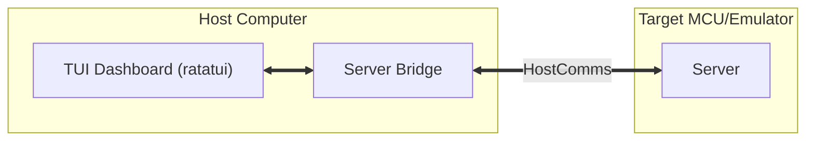

# Terminal User Interface (Design Document)


---

### **1. Introduction**

This design document establishes the architecture for the `control-rs-xtask`
Host Console Menu, a Terminal User Interface (TUI) designed to control and
monitor on-target Hardware-in-the-Loop (HIL) testing. The TUI provides
developers with a dynamic, real-time dashboard displaying system metadata, test
suite namespaces, cycle-level execution statistics, and target logs,
facilitating rapid hardware-in-the-loop iteration.

---

### **2. Requirements**

#### **Functional Requirements**

* **Target Metadata Display**: The TUI must query and display target board
  details, core clock frequency, Floating Point Unit (FPU) status, and debug
  link parameters.
* **Hierarchical Test Tree**: The interface must present test suites and test
  cases in a tree layout mapping the Rust module namespace.
* **Hierarchical Telemetry Table**: For each test, the TUI must display cycle
  count (CYCCNT), temporal duration (µs), and peak stack memory usage.
* **Persistent Log Terminal**: An integrated console window must display
  real-time debug and system logs streaming from the target.
* **Keystroke Controls**: Users must be able to control target execution using
  single-key shortcuts:
    - `f` (Filter suites)
    - `r` (Run all tests)
    - `s` (Stop execution)
    - `q` (Quit TUI)

#### **Non-Functional Requirements**

* **Low-Latency Rendering**: The screen rendering engine must repaint within
  16ms (60 FPS) to maintain a highly responsive feel.
* **Future Extension: Metrics Caching**: Storing results of test suites on the host
  to maintain the state across target restarts or re-connections.
* **Non-Intrusive Polling**: The communication driver must poll telemetry
  buffers asynchronously without halting the target CPU.

---

### **3. Technical Overview**

The TUI is implemented as a subcomponent of `control-rs-xtask`. It runs on the
developer's host machine and interfaces with physical microcontrollers
through a `ServerBridge`.



---

### **4. Core Architecture**

#### **4.1. User Interface Layout**

The TUI layout is partitioned into three main panels designed to maximize
developer situational awareness:

```text
===============================================================================
 TARGET: Teensy 4.0 (Cortex-M7) | LINK: USB CDC (/dev/ttyACM0)
===============================================================================
 [ RUNNING ] control_rs::math
-------------------------------------------------------------------------------
 NAME                                     CYCLES      TIME       STACK
 ▼ math::storage
   ├─ contiguous_storage_alloc            1,204       2.00µs     32
   └─ noncontiguous_storage_dma           3,410       5.68µs     64

 ▼ math::subprograms::level3
   ├─ gemm_10x10_f32 (soft-float)         84,500      140.8µs    128
   ├─ gemm_10x10_f32 (hard-float)        [ RUN... ]   ---        ---
   └─ gemm_50x50_f32 (hard-float)         PENDING     ---        ---
-------------------------------------------------------------------------------
 [ TARGET LOGS ] (Autoscroll: ON)
 > [INFO] Host connected.
 > [INFO] Discovered 24 tests via procedural macro test registry.
 > [PASS] storage::contiguous_storage_alloc
 ===============================================================================
 (f)ilter | (r)un all | (s)top | (q)uit
```

1. **Header Dashboard**: Displays target hardware configuration details and
   active communication link information.
2. **Hierarchical Metrics Table**: A collapsible tree table showing test
   namespaces, cycle metrics, temporal duration (calculated on the host by
   dividing target cycle delta by core frequency), and peak stack memory usage in bytes.
3. **Logs Panel**: A live log terminal streaming output from the target.
4. **Footer Action Bar**: Displays available key shortcuts.

#### **4.2. Host-Target ServerBridge Integration**

The host-side TUI communicates with target environments via the
`ServerBridge` abstraction (defined
in [bridge.rs](../../../control-rs-xtask/src/bridge.rs)). This isolative layer
decouples terminal UI
rendering from target-specific transport APIs, supporting two execution targets:

* **QEMU Semihosting Emulator**: Spawn a local QEMU virtual machine in a
  background child process by running `cargo run --bin ...` inside
  `examples/qemu`, piping stdin, stdout, and stderr.
* **Physical Serial Device**: Opens a connection to hardware (such as the Teensy
  4.0 board) over a USB CDC virtual serial port at a configured baud rate (
  defaulting to 115200) using the `serial2` crate.

#### **4.3. Bidirectional Serialization & Packet Framing**

To enforce data integrity over noisy virtual and physical communication links,
the bridge employs a custom binary framing protocol:

* **Downlink (Host to Target)**: High-level commands (e.g., `ListSuites`,
  `RunTest`, `UpdateSetting`) are serialized using the `postcard` crate. The
  bridge wraps the serialized bytes in a structured frame:
    - **Sync Header**: 2 bytes (`0xAA 0x55`)
    - **Payload Length**: 2 bytes (big-endian)
    - **Postcard Payload**: variable length
    - **CRC16 Checksum**: 2 bytes (big-endian, calculated using
      `CRC_16_IBM_SDLC`)
      The framed byte array is written and flushed directly to QEMU's stdin or
      the serial port.
* **Uplink (Target to Host)**: Background threads read the target's output
  stream:
    - A thread decodes incoming bytes using `FrameReader` to detect the sync
      header, verify the CRC, and deserialize the payload into
      `BridgeMessage::Telemetry`.
    - Another thread reads standard error or raw console lines, emitting them as
      `BridgeMessage::RawConsole` to be displayed in the TUI's logs panel.

#### **4.4. Target Panic Detection & Re-Connection Lifecycle**

In bare-metal control applications, a target crash or panic must not stall the
host-side developer flow. The TUI manages connection lifecycles dynamically:

1. **Panic Detection**: The target's panic handler intercepts crashes, formats a
   failure report, and sends it over the link. The host receives this as
   `Telemetry::TargetPanic`.
2. **Bridge Tear-Down**: The TUI stops generating new test runs, sends
   `Command::TryReset` to the target, and calls `bridge.kill()` to terminate
   QEMU or close the serial port interface.
3. **Cool-Down & Reset**: The TUI sleeps for 2 seconds to allow target
   bootloader sequences and hardware initialization to finish.
4. **Re-Establishment**: The TUI instantiates a new `ServerBridge` connection,
   clears the local command queue, and broadcasts `Command::ListSuites` to
   re-trigger suite/test discovery.

---

### **5. Alternatives**

* **ARM Semihosting**: Rejected. Semihosting relies on triggering target
  software interrupts that halt the CPU core. This introduces millisecond-level
  latencies that violate real-time constraints and mask control-loop timing
  jitter. Additionally, probe-rs has documented register decoding and caching
  bugs during rapid semihosting trap polling.
* **Standard UART Logging**: Rejected. While it operates asynchronously,
  standard serial output lacks structured data capability, rendering
  hierarchical tables, dynamic status overlays, and bidirectional control
  vectors impossible without complex custom parsers.
* **ServerBridge Logging**: The bridge handles parsing all data between the
  server and the tui. This would be an ideal location to record all traffic
  during a run.

---

### **6. Verification & Validation**

#### **6.1. Verification Plan**

- **Mock Stream Tests**: Implement a host-side test suite that feeds a mock
  stream generator into the TUI component, verifying that the tree
  rendering, auto-scrolling, and metrics calculation modules execute correctly
  under load.
- **Key Binding Validation**: Verify that keyboard event handlers translate
  keystrokes into correct command byte vectors.

#### **6.2. Validation Plan**

- **Hardware Integration Run**: Flash a benchmark binary containing the
  mathematical subprograms onto physical target hardware.

---

### **7. Performance & Resource Considerations**

* **Host CPU Loading**: The TUI repaints the screen only when new telemetry
  packets arrive or when user input occurs, rather than polling in a hot loop,
  keeping developer PC processor usage low.

---

### **8. Risks & Open Questions**

* **Scalability**: This TUI will be mostly written by AI and will likely be
  hard to maintain. The mitigation strategy is to keep the functionality as
  simple as possible. The TUI is not the crate's final product, it is a
  useful tool.

---

### **9. Development Plan**

| Task / Feature                         | Description                                                                             | Estimated Effort |
|:---------------------------------------|:----------------------------------------------------------------------------------------|:-----------------|
| **Step 1: Ratatui Interface Skeleton** | Build the terminal UI layout panels using `ratatui` (Header, Tree Table, Logs, Footer). | 1.0 day          |
| **Step 2: probe-rs RTT Connection**    | Integrate polling channels into the TUI event loop.                                     | 1.0 day          |
| **Step 3: Bidirectional Controls**     | Implement keystroke handlers and write command packets to the target down-buffer.       | 0.5 day          |

---

### **10. Revision History**

| Revision | Date          | Description                                                                                                                                                                             | Author          |
|:---------|:--------------|:----------------------------------------------------------------------------------------------------------------------------------------------------------------------------------------|:----------------|
| 1.0      | May 24, 2026  | Initial design outline of TUI host menu.                                                                                                                                                | @MitchellDScott |
| 1.1      | July 18, 2026 | Restructured to design-template standard. Replaced semihosting references with RTT details, integrated Teensy 4.1 bootloader debug workarounds, and defined metrics cache architecture. | @MitchellDScott |
| 1.2      | July 18, 2026 | Documented host-target ServerBridge architecture, postcard serialization/packet framing protocol, and target panic re-connection lifecycle based on `control-rs-xtask` source code.     | @MitchellDScott |