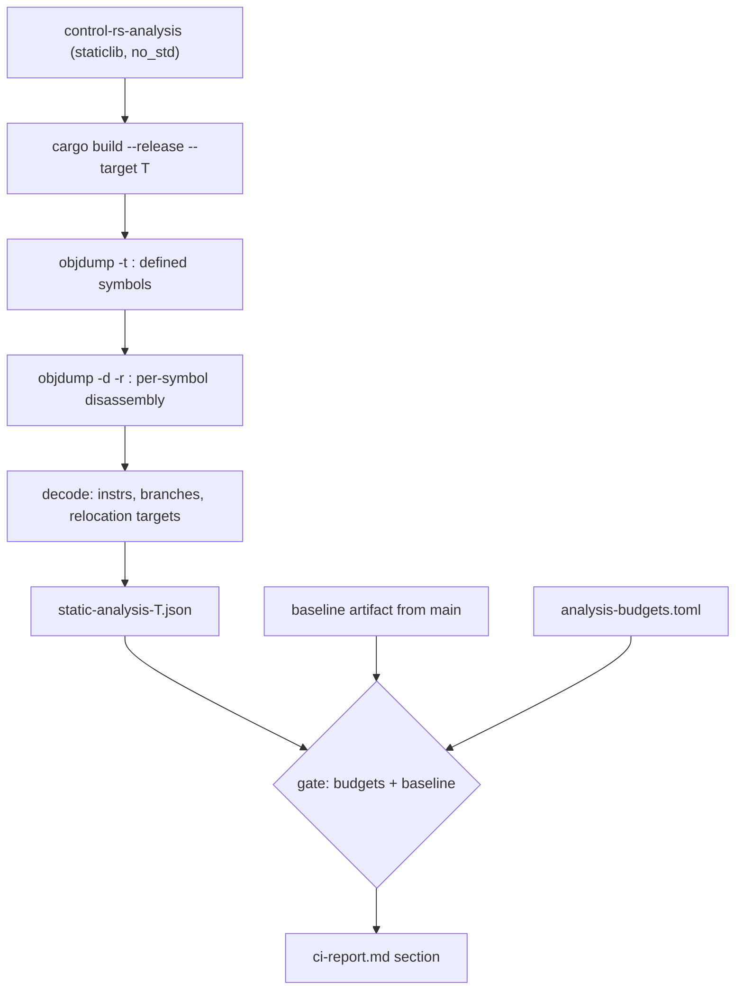

# Static Code Analysis Task (Proposal)


---

### 1. Introduction

`control-rs` targets bare-metal platforms where a reachable panic path is a
hard fault, an unbounded code-size cost, or both, and where the instruction
count of a control update sets the achievable loop rate. The workspace
currently verifies two levels of the stack:

- **Source level**: `clippy` denies `panic`, `unwrap_used`, `expect_used`,
  `indexing_slicing`, `arithmetic_side_effects` and the `pedantic`/`nursery`
  groups (workspace lints, `Cargo.toml`).
- **Runtime level**: `tarpaulin` coverage plus the headless SIL/HIL suites
  executed under QEMU by `cargo ci`.

Neither level observes the compiled artifact. Slice bounds checks,
`assert_eq!` inside generic helpers, `core::fmt` machinery pulled in by a
single formatting call, and the code-size cost of each monomorphization only
exist after codegen. A crate can pass every source lint and still link a
panic path into firmware.

This proposal adds a third verification axis: static analysis of the compiled
object, run as an `xtask` subcommand and gated in CI. A working reference
implementation exists as the `lib-measure` demo's `xtask analyze`, which
builds a crate as a `staticlib`, reads its symbol table with `objdump -t`,
disassembles each defined symbol, and reports per-symbol instruction counts,
branch counts, and panic call paths as a call tree or as JSON.

---

### 2. Requirements

#### Functional Requirements

- **FR-1 — Artifact analysis**: Build the library for a requested target
  triple and report, per exported symbol, its instruction count, branch count,
  `.text` size, and the call tree reachable from it, derived from the compiled
  object rather than from source.
- **FR-2 — Panic reachability**: Report every call whose relocation target
  resolves to a panic symbol, together with the path from the analyzed root
  that reaches it.
- **FR-3 — Budget enforcement**: Compare instruction count, branch count and
  `.text` size against a checked-in per-target budget file and exit non-zero
  on violation.
- **FR-4 — Baseline diff**: Compare per-symbol `.text` size against the
  artifact produced on `main` and report the deltas.
- **FR-5 — Report integration**: Emit a machine-readable JSON artifact and a
  Markdown section appended to `ci-report.md`, which the existing workflow
  already posts as a pull request comment and to the step summary.
- **FR-6 — Stable analysis roots**: Provide a fixture target that instantiates
  the concrete monomorphizations under analysis behind fixed, unmangled symbol
  names.

#### Non-Functional Requirements

- **NFR-1 — Determinism**: A given commit, toolchain and target triple produce
  byte-identical JSON. Symbol ordering, tree traversal and float formatting
  are stable.
- **NFR-2 — Toolchain-only dependencies**: Analysis uses `objdump` or its
  `llvm-objdump` equivalent (`rustup component add llvm-tools` plus
  `cargo-binutils`) and requires no network access at analysis time.
- **NFR-3 — Runtime budget**: One release build plus disassembly per target,
  bounded by `--max-nodes`, adding no more than ~2 minutes per target to the
  existing job.

#### Constraints

- **C-1 — Target matrix**: `thumbv7em-none-eabihf` and
  `riscv32imac-unknown-none-elf`, release profile. The existing
  `[profile.release]` already sets `lto = "fat"` and `codegen-units = 1`,
  which is the configuration static call-graph tooling requires.
- **C-2 — `no_std`**: Analysis fixtures build without `std` and without a host
  allocator, so the analyzed code is the code that ships.
- **C-3 — Host-side tooling**: The analyzer lives in `control-rs-xtask` and is
  never a dependency of the `control-rs` library.

Stack-depth bounding (`cargo-call-stack`, `control-rs-ci-design-doc.md` §4.3)
is out of scope here and remains a separate task.

---

### 3. Technical Overview

The deliverable is four pieces: an `analyze` subcommand in `control-rs-xtask`,
a fixture crate that pins the analyzed monomorphizations, a budget file, and
the CI wiring that gates on the result and publishes it. The work requires
familiarity with ELF symbol tables and relocations, per-ISA mnemonic
classification for Thumb-2 and RV32IMAC, and cargo build plumbing for
cross-compiled `staticlib` targets.

---

### 4. Architecture

#### 4.1. Analysis Pipeline



Each node of the emitted tree carries `depth` (static call-graph distance from
the root, not a runtime trace), `instrs` (decoded instruction lines in the
item's own disassembly), `branch` (control-transfer instructions classified per
ISA family) and `panics` (relocation targets whose symbol name resolves to a
panic entry point). A call target expands into a child only when it is itself
defined in the artifact; genuinely external symbols stay leaves.

#### 4.2. Analysis Roots and Monomorphization

A generic function produces no machine code until it is instantiated, and its
instantiated symbol name is a compiler-generated mangled hash. `control-rs` is
generic over both scalar type and type-level dimensions, so a symbol table
alone offers no stable analysis target.

The fixture crate resolves this: `control-rs-analysis` is a `no_std`
`staticlib` whose only content is `#[unsafe(no_mangle)] pub extern "C"`
wrappers that call one concrete instantiation each, under a predictable name
(`crs_matrix_mul_f32_3x3`, `crs_polynomial_eval_f64_8`, `crs_ss_discretize_...`).
Analysis roots default to every symbol matching `crs_*`.

This makes the analyzed surface an explicit, reviewable declaration: a
monomorphization absent from the fixture is not gated. The fixture is
therefore the primary maintenance obligation of this task, and must track the
instantiations the HIL suites and firmware actually use.

#### 4.3. Budgets

`control-rs-xtask/analysis-budgets.toml`, keyed by target triple then symbol:

```toml
[thumbv7em-none-eabihf."crs_matrix_mul_f32_3x3"]
allow_panic = false
max_instrs = 320
max_branch = 40
max_text_bytes = 1024
```

A symbol absent from the file is measured and reported but not gated, with an
opt-in `--fail-on-new` mode for tightening later. `allow_panic = false` is the
default for every root and is the check that clippy structurally cannot
perform.

#### 4.4. Baseline Diff

Reuses the pattern already in `CI.yml` for coverage: `main` uploads
`static-analysis-<target>.json` as an artifact, pull request runs pull it with
`gh run download --branch main` and fall back to a no-diff run when absent.
The diff reports per-symbol `Δinstrs`, `Δbranch` and `Δbytes`, and fails only
on a combined relative-plus-absolute threshold so that trivial codegen noise
does not block merges.

#### 4.5. `xtask` Integration

`main.rs` dispatches string subcommands directly, so `analyze` joins `ci`,
`tui` and `install-hooks`. The task follows the existing shape in `tasks.rs`,
returning a summary plus captured log, and `utils::build_report` gains one
section so the analysis lands in the same `ci-report.md` the workflow already
comments and summarizes.

| Alias              | Command                              | Purpose                                          |
|:-------------------|:-------------------------------------|:-------------------------------------------------|
| `cargo analyze`    | `xtask analyze`                      | Human-readable call tree for the default targets |
| `cargo analyze-ci` | `xtask analyze --json --strict`      | Gated run, JSON artifact plus report section     |

Proposed options, following the demo's surface: `--target`, `--item`,
`--list`, `--json`, `--depth`, `--max-nodes`, plus `--budgets`, `--baseline`
and `--strict`.

---

### 5. Alternatives

- **Source-level lints only**: Rejected. `clippy`'s `panic`/`indexing_slicing`
  denials operate on HIR and cannot observe compiler-inserted checks,
  post-monomorphization code size, or panic paths entering through a
  dependency.
- **`panic-never`-style link-time assertion**: A symbol that fails to link when
  any panic path survives gives a binary answer with no tooling. Rejected as
  the primary mechanism: it produces an opaque linker error with no per-symbol
  attribution, no counts and no diff, though it remains a cheap complementary
  check.
- **`cargo-bloat` / `twiggy`**: Size attribution only, no panic reachability
  and no call tree. `cargo-bloat`'s last release is 0.12.1 (2024) and `twiggy`
  is Wasm-oriented (0.8.0, 2025).
- **`capstone-rs` or `object` + `gimli` in-process**: Structured decoding
  without an `objdump` subprocess, at the cost of a C library binding
  (`capstone` 0.14.0) or a hand-written decoder layer. Deferred: the
  subprocess approach is already proven in the demo, and `object` (0.40.0) is
  the migration path if parse cost or portability becomes a constraint.
- **`cargo-show-asm`**: Developer-facing inspection of one function at a time,
  not a gateable whole-artifact report.

---

### 6. Verification & Validation

#### 6.1. Verification Plan

- **Fixture unit tests**: A deliberately panicking root (unchecked slice index)
  must be reported with a resolved panic path; a hand-verified panic-free root
  must report none.
- **Golden snapshots**: Per-target JSON snapshots for a pinned fixture and
  toolchain, asserting NFR-1 determinism.
- **Gate tests**: An injected regression (added branch, added instruction)
  fails `--strict` with a non-zero exit and names the violated budget.
- **Diff tests**: A synthetic baseline JSON exercises the delta table,
  including the missing-baseline fallback path.

#### 6.2. Validation Plan

- Open a pull request that introduces an `assert_eq!` into an analyzed root and
  confirm the panic path appears in the posted `ci-report.md` comment and that
  the job fails.
- Confirm a clean pull request reports deltas of zero against the `main`
  baseline.

---

### 7. Performance & Resource Considerations

Analysis adds one release build per target, which shares `target/` with the
existing build where the triple matches, plus disassembly cost linear in
`.text`. Tree expansion is bounded by `--depth` and `--max-nodes`; the JSON
artifact is bounded by the fixture's root count, which is fixed by review
rather than by codebase growth.

---

### 8. Risks & Open Questions

- **Indirect calls**: An edge is followed only when the call instruction
  carries a resolvable relocation. A call through a register loaded earlier
  (function pointer, `dyn` dispatch) is silently omitted, so a panic behind
  indirection is invisible. `control-rs` is predominantly static dispatch;
  the exposure needs an explicit audit.
- **Fixture drift**: Gates measure only what the fixture instantiates. If the
  fixture diverges from shipped instantiations, the gate is theater. Options
  are generating it from the HIL suite instantiations or asserting coverage of
  the firmware symbol table.
- **Panic classification heuristic**: Matching symbol names containing `panic`
  is a substring test, not a semantic one. It over-matches user symbols
  containing the word and under-matches a target whose panic entry is renamed.
- **Branch classification**: Mnemonic-family heuristics per ISA are
  best-effort and not exhaustive across every extension.
- **Budget calibration**: Initial budgets require a record-only cycle before
  gating, otherwise the first run blocks unrelated work.
- **Matrix scope**: Whether the gate runs on every `rust` matrix row or only
  the pinned `1.88.0` and `stable` rows, given codegen differences on `beta`
  and `nightly`.

---

### 9. Development Plan

| Task / Feature                     | Description                                                                                                            | Estimated Effort (1-10) |
|:-----------------------------------|:-----------------------------------------------------------------------------------------------------------------------|:------------------------|
| **Step 1: Analysis Fixture**       | `control-rs-analysis` `no_std` staticlib with `no_mangle` roots for the shipped monomorphizations; budget file schema. | 3                       |
| **Step 2: `analyze` Subcommand**   | Build driver, symbol table read, per-symbol disassembly, instruction/branch/panic decoding, call tree and JSON output. | 6                       |
| **Step 3: Gating and Diff**        | Budget evaluation, baseline diff, `--strict` exit semantics, `ci-report.md` section via `utils::build_report`.          | 4                       |
| **Step 4: CI Wiring**              | Cargo aliases, workflow steps, artifact upload/download, record-only calibration cycle, then enable gating.            | 3                       |

---

### 10. Revision History

| Revision | Date            | Author          | Description                                                            |
|:---------|:----------------|:----------------|:------------------------------------------------------------------------|
| 1.0      | August 24, 2026 | @MitchellDScott | Initial proposal derived from the `lib-measure` `xtask analyze` demo.  |
