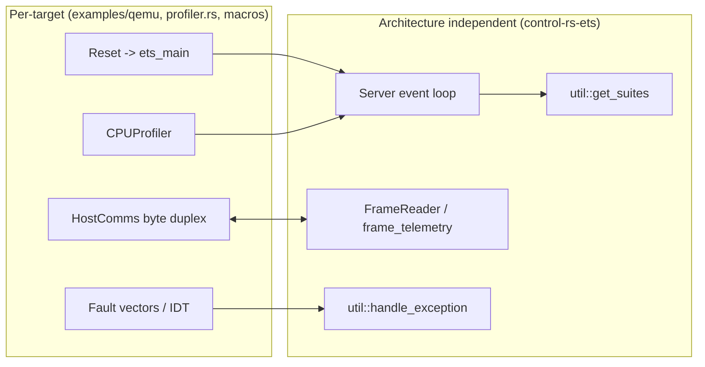

# 64-bit Application-Class Targets for the virtual ETS (Proposal)

**Date:** August 26, 2026
**Status:** Proposal. Not a pipeline artifact. Does not set `Reviewed` or `Approved`.
**Design:** `documentation/xtask/embedded-test-server-design.md`,
`documentation/xtask/control-rs-ets-overview.md` §2.5,
`documentation/xtask/cpu-profile-utils-design-doc.md`
**Scope:** `examples/qemu/`, `control-rs-ets/src/profiler.rs`,
`control-rs-xtask/src/{bridge,tasks,main}.rs`, `.github/workflows/`

---

### 1. Purpose

The virtual ETS currently covers four targets: `thumbv7em-none-eabi`,
`thumbv7em-none-eabihf`, `riscv32imac-unknown-none-elf` and
`riscv64gc-unknown-none-elf`. All four are microcontroller-class ISAs. No
target in the matrix is an application-class 64-bit core of the kind that
runs host tooling, flight computers or companion compute boards.

This document proposes two additional virtual ETS targets that close that
gap while keeping the bare-metal (`no_std`, `no_alloc`, no operating system)
execution model unchanged:

| Role | Triple | QEMU machine / CPU |
|:--|:--|:--|
| Apple-class (AArch64) | `aarch64-unknown-none` | `virt` / `cortex-a72` |
| Intel-class (x86-64) | `x86_64-unknown-none` | `q35` / `Skylake-Client` |

Both triples are Tier 2 with precompiled `core` distributed by rustup, so
neither requires `-Z build-std` (Rust Project, 2026a). The proposal adds no
new crate dependency to `control-rs-ets` and reuses the `semihosting` crate
already vendored by the RISC-V example.

#### 1.1 What "equivalent" means here

The equivalence claimed is at the **instruction set and data model** level,
not the microarchitectural level. QEMU TCG ships no Apple M-series or
Skylake pipeline model, so cycle counts from these targets are ordinal
regression signals, not vendor-accurate timings. That limitation already
holds for the Cortex-M and RISC-V entries in the matrix, so it introduces no
new class of error into ETS reporting. What the two targets do exercise is
the AArch64 and x86-64 code paths of the crate under LP64 pointers, 64-bit
`usize`, NEON-backed `f64` and the soft-float x86 ABI.

---

### 2. What the existing ETS already supplies

The proposal is small because four ETS surfaces are already architecture
independent and already proven at 64 bits by `riscv64gc-unknown-none-elf`:

1. **Suite discovery.** `#[ets_suite]` emits `SuiteDescriptor` pointers into
   `.ets_test_suites`; the entrypoint passes
   `__ets_test_suites_start .. __ets_test_suites_end` to
   `util::get_suites`, which rebuilds a
   `&'static [&'static SuiteDescriptor]`. The bounds are
   `*const &SuiteDescriptor`, so the walk is pointer-width generic and
   already runs at 64 bits.
2. **Framing.** `comms::FrameReader` and `frame_telemetry` are a CRC-16
   byte-stream protocol with no endian or width assumptions beyond postcard.
3. **Panic capture.** `#[ets_setup]` emits the `#[panic_handler]`, so a new
   example needs no `panic-*` crate.
4. **Host bridge.** `ServerBridge::new_qemu_inner` spawns `cargo run` and
   speaks the protocol over the child's stdin/stdout. Any QEMU invocation
   that binds the guest console to stdio satisfies it.

Two macro surfaces are not architecture independent. `ets_entrypoint!`
attaches the runtime entry attribute per architecture
(`cortex_m_rt::entry`, `riscv_rt::entry`) and `ets_exception!` emits fault
handlers written against `cortex_m_rt::ExceptionFrame` and
`riscv_rt::TrapFrame`. Neither has an arm for a target without an `-rt`
crate, so both need one. D-9 and D-10 cover them.

The per-target work is therefore four items: reaching Rust `main` from the
machine reset state, binding a byte-duplex console, implementing
`CPUProfiler` and reporting CPU faults through the existing
`util::handle_exception` path.



---

### 3. AArch64 target (`aarch64-unknown-none`)

#### D-1 Boot: ELF via `-kernel`, minimal `global_asm!` reset stub

QEMU's `virt` machine loads an ELF passed to `-kernel` at the addresses in
its program headers and jumps to its entry point with the MMU and caches
off. No `cortex-m-rt` equivalent is required. The stub is roughly 25
instructions: set `SP` from `_stack_start`, zero `.bss` between the
linker-provided bounds, then branch to the `#[ets_setup]` entry.

The stub reads `CurrentEL` rather than assuming an exception level, so the
same image works whether QEMU enters at EL1 (the `virt` default) or at EL2
(`-machine virtualization=on`).

#### D-2 Transport: ARM semihosting through the `semihosting` crate

The `semihosting` crate already in `examples/qemu/Cargo.toml` supports
AArch64 alongside RISC-V (taiki-e, 2026). `src/aarch64-unknown-none.rs` is
therefore a near copy of `src/riscv64gc-unknown-none-elf.rs`:
`SYS_READC` for `poll_command`, `semihosting::io::stdout` for
`send_telemetry`, `semihosting::process::exit` for `close`. The runner flags
match the existing entries verbatim except for the binary name:

```text
qemu-system-aarch64 -machine virt -cpu cortex-a72 -m 256M -nographic \
  -serial none -monitor none -chardev stdio,id=con0 \
  -semihosting-config enable=on,chardev=con0 -kernel
```

A PL011 MMIO driver at `0x0900_0000` is the alternative (A-1) and is not
chosen: it adds a device driver to an example whose purpose is exercising
numerics, and it diverges from the transport used by every other virtual
ETS target.

#### D-3 Profiler: `Aarch64Profiler`, no new dependency

| `CPUProfiler` method | Mechanism |
|:--|:--|
| `get_cycles` | `PMCCNTR_EL0`, after `PMCR_EL0.{E,C}` and `PMCNTENSET_EL0[31]` |
| `get_nanos` | `CNTVCT_EL0 * 1e9 / CNTFRQ_EL0`, both read at runtime |
| `get_sp` | `mov {}, sp` |
| `get_stack_end` | `_profiler_stack_start` from the linker script |
| `disable_interrupts` | `msr daifset, #2` / `msr daifclr, #2` |
| `exit` | semihosting `SYS_EXIT`, `ADP_Stopped_ApplicationExit` |

Every mechanism is a system-register access expressible with `core::arch::asm!`,
so `control-rs-ets` gains a `#[cfg(target_arch = "aarch64")]` block and no
new entry under `[target.'cfg(...)'.dependencies]`. `CNTFRQ_EL0` is read
rather than hardcoded, which removes any dependence on the QEMU timer rate.

`PMCCNTR_EL0` under TCG counts translated instructions rather than pipeline
cycles. When the PMU is absent or reads zero, the profiler falls back to
`CNTVCT_EL0` and reports the ratio through the existing telemetry, so a
degraded counter is visible instead of silent.

---

### 4. x86-64 target (`x86_64-unknown-none`)

x86-64 is the harder of the two. Three properties of the platform force
decisions the AArch64 target does not face.

#### D-4 Boot: Multiboot 1 a.out kludge over a flat image

QEMU's x86 `-kernel` path accepts a Multiboot 1 image or a Linux bzImage.
Its Multiboot ELF loader rejects 64-bit ELF outright with `Cannot load
x86-64 image, give a 32bit one` (QEMU, 2026a; QEMU issue 243, open). The
ELF produced by `x86_64-unknown-none` therefore cannot be handed to
`-kernel` directly.

The loader does provide a second path. When bit 16 of the Multiboot header
flags is set it ignores ELF structure entirely and uses the a.out kludge
fields (`header_addr`, `load_addr`, `load_end_addr`, `bss_end_addr`,
`entry_addr`), loading the file as a flat image and zeroing memory from
`load_end_addr` to `bss_end_addr` (QEMU, 2026a). The header must appear
4-byte aligned within the first 8192 bytes.

The proposed build therefore emits a flat image and declares its own load
geometry:

1. A `.multiboot` section, forced first by the linker script, holds magic
   `0x1BAD_B002`, flags `0x0001_0003` (align, meminfo, kludge), the
   checksum and the five address fields, all resolved from linker symbols.
2. `rust-objcopy -O binary` converts the ELF to the flat image inside the
   cargo runner, matching the pattern already used by the Teensy runner in
   `documentation/xtask/control-rs-ets-overview.md` §4.3.
3. A `global_asm!` stub entered in 32-bit protected mode builds a PML4 and
   a page directory identity-mapping the low 1 GiB with 2 MiB pages, sets
   `CR4.PAE`, `EFER.LME` and `CR0.PG`, loads a 64-bit GDT, far-jumps to
   long mode, sets `RSP`, then calls the `#[ets_setup]` entry. The stub also
   sets `CR4.OSFXSR`, `CR4.OSXMMEXCPT`, `CR0.MP` and clears `CR0.EM`, so the
   hard-float profile in §6 needs no boot change later.

`-C code-model=small -C relocation-model=static` replaces the target's
default `kernel` code model, because the image is loaded at 1 MiB rather
than in the top 2 GiB of the address space.

#### D-5 Memory map: one region, two aliases

The shared `ets_suites.x` generated by `examples/qemu/build.rs` places
`.ets_test_suites` in a region named `FLASH` and derives
`_profiler_stack_start` from `_stack_start` and `_hart_stack_size`. A flat
Multiboot image cannot tolerate two distant `MEMORY` regions, because the
gap between them is emitted as padding in the binary. Both new targets
therefore declare a single region and alias it:

```text
MEMORY { LOWMEM : ORIGIN = 0x00100000, LENGTH = 32M }
REGION_ALIAS("FLASH", LOWMEM);
REGION_ALIAS("RAM",   LOWMEM);
_hart_stack_size = 64K;
```

This keeps `ets_suites.x` unmodified and shared across all six targets.
`load_end_addr` then falls at the end of `.data` and `.bss` follows
contiguously, which is exactly the geometry the kludge expects. The AArch64
script uses the same shape at `ORIGIN = 0x4008_0000`.

#### D-6 Transport: 16550 UART at `0x3F8`

x86 has no semihosting in QEMU. The equivalent byte duplex is the 16550
UART at the conventional `0x3F8`, bound to the process stdio by
`-chardev stdio,id=con0 -serial chardev:con0`. `ServerBridge` reads the same
stdout it reads for every other target, so no host change is needed. The
driver is roughly 30 lines of `in`/`out` over `core::arch::asm!` covering
divisor latch setup, `THR` write and `LSR`-gated `RBR` read, and it adds no
dependency.

`-serial mon:stdio` is explicitly not used: monitor multiplexing injects
escape handling into a stream that carries binary CRC-16 frames.

#### D-7 Exit: ACPI S5 for success, `isa-debug-exit` for failure

`isa-debug-exit` returns process status `(value << 1) | 1`, which can never
be zero (phil-opp, 2026; QEMU, 2012). Using it for the success path makes
`cargo run` report failure on every clean run. On `q35` the ACPI PM1a
control block sits at `0x604`, and a word write of `0x2000` requests soft
off, which terminates QEMU with status 0. The mapping onto `HostComms` is
then direct:

| Path | Mechanism | Process status |
|:--|:--|:--|
| `close` | `outw(0x604, 0x2000)` | 0 |
| `close_on_failure` | `outl(0xF4, 0x10)` via `isa-debug-exit` | 33 |

If the ACPI write proves machine-version sensitive, the fallback is
`isa-debug-exit` for both paths plus a status-mapping shim in the runner
(`s=$?; [ "$s" = 33 ] && exit 0 || exit "$s"`). This is recorded as an open
question in §9, not as a blocking unknown.

#### D-8 Profiler: `X86Profiler`

| `CPUProfiler` method | Mechanism |
|:--|:--|
| `get_cycles` | `core::arch::x86_64::_rdtsc` |
| `get_nanos` | TSC scaled by CPUID leaf `0x15`, else PIT-calibrated at setup |
| `get_sp` | `mov {}, rsp` |
| `get_stack_end` | `_profiler_stack_start` from the linker script |
| `disable_interrupts` | `cli` / `sti` |
| `exit` | D-7 |

Leaf `0x15` may report a zero crystal frequency under TCG. The profiler
therefore calibrates the TSC against PIT channel 2 during `#[ets_setup]`
and stores the result, which keeps `get_nanos` a multiply-shift at call
time.

---

### 5. Entry point and fault reporting

#### D-9 Entry symbol for targets without an `-rt` crate

`ets_entrypoint!` expands to

```rust
#[cfg_attr(target_arch = "arm", ::cortex_m_rt::entry)]
#[cfg_attr(any(target_arch = "riscv32", target_arch = "riscv64"), ::riscv_rt::entry)]
fn main() -> ! { /* discover suites, build Server, run */ }
```

Neither `cfg_attr` matches the new triples, so `main` would be emitted as an
ordinary mangled item that no reset stub can call. Because neither target has
a runtime crate to supply the attribute, the macro gains one arm:

```rust
#[cfg_attr(any(target_arch = "aarch64", target_arch = "x86_64"), unsafe(no_mangle))]
```

with the item named `ets_main` under that cfg. The `global_asm!` stubs in
D-1 and D-4 then branch to a fixed, unmangled symbol. Both triples report
`target_os = "none"`, so the surrounding `#[cfg(target_os = "none")]` gates
and the `ets_panic!` handler already apply unchanged.

#### D-10 Fault reporting

`ets_exception!` currently emits a `cortex_m_rt` `HardFault` handler and a
`riscv_rt` `ExceptionHandler`, both funnelling into
`util::handle_exception` so a fault reaches the host as telemetry rather
than as a silent hang. Parity for the new targets means:

- **AArch64.** A 16-entry vector table, 2 KiB aligned, installed in
  `VBAR_EL1`. The synchronous-exception entries report `ESR_EL1`, `ELR_EL1`
  and `FAR_EL1` through the same `handle_exception` call.
- **x86-64.** An IDT with a shared stub covering `#UD`, `#GP`, `#PF` and
  `#DF`, reporting the vector number, the error code and `CR2`.

Without D-10 a faulting suite triple-faults and QEMU exits, which the host
reports as `QEMU process exited unexpectedly` with no attribution. That is
a usable Phase 1 state but not parity, so D-10 is scheduled as its own
phase rather than folded into the target work.

---

### 6. Floating point: the two targets are not symmetric

`aarch64-unknown-none` enables `neon` by default and uses the hard-float
AAPCS64 ABI. `x86_64-unknown-none` sets
`-mmx,-sse,-sse2,...,+soft-float` with `rustc_abi = Softfloat` and
documents that no vector or floating-point registers are used by default
(Rust Project, 2026b, 2026c). `-C target-feature=+sse,+sse2` does not undo
this: the float ABI is pinned in the target spec, and the precompiled
`core` shipped by rustup is built soft-float, so an SSE-enabled crate graph
would meet a soft-float `core` at every non-inlined `f64` boundary.

The consequence is a deliberate division of labor rather than a defect:

- **`aarch64-unknown-none` is the 64-bit performance target.** Hardware
  `f64` and NEON make its cycle and stack telemetry comparable, in kind,
  with the `thumbv7em-none-eabihf` entry.
- **`x86_64-unknown-none` is the 64-bit portability and correctness
  target.** It executes the whole numerical stack through the soft-float
  path on LP64, which is the configuration a kernel or hypervisor-resident
  controller actually runs in, and which no current ETS target covers.

A hard-float x86 profile is possible through a custom target JSON without
`+soft-float` plus `-Z build-std=core`. That is nightly-only, so it does not
belong in a matrix whose MSRV row is 1.88.0. It is proposed as an optional
phase in §10.

---

### 7. Integration surface

| File | Change | Kind |
|:--|:--|:--|
| `examples/qemu/src/aarch64-unknown-none.rs` | New example: reset stub, semihosting comms, `#[ets_setup]` | new |
| `examples/qemu/src/x86_64-unknown-none.rs` | New example: multiboot header, long-mode stub, 16550 comms, `#[ets_setup]` | new |
| `examples/qemu/build.rs` | Two `else if` arms emitting the D-5 scripts | edit |
| `examples/qemu/Cargo.toml` | Two `[[bin]]` entries; `semihosting` under `cfg(target_arch = "aarch64")` | edit |
| `examples/qemu/.cargo/config.toml` | Two `[target.*]` runner and rustflags blocks; two aliases | edit |
| `control-rs-ets/src/profiler.rs` | `Aarch64Profiler`, `X86Profiler` behind `#[cfg(target_arch)]` | edit |
| `control-rs-ets/src/lib.rs` | Two `pub use` re-exports behind the same cfgs | edit |
| `control-rs-macros/src/lib.rs` (`ets_entrypoint`) | Entry-symbol arm for targets without an `-rt` crate (D-9) | edit |
| `control-rs-macros/src/lib.rs` (`ets_exception`) | AArch64 vector table and x86-64 IDT fault reporting (D-10) | edit |
| `control-rs-xtask/src/bridge.rs` | Two `QemuArch` variants, `details()` arms, `parse()` aliases, constructors | edit |
| `control-rs-xtask/src/tasks.rs` | Two `build_qemu_elf` match arms | edit |
| `control-rs-xtask/src/main.rs` | `run_ci_all_qemu` table refactor (see below) | edit |
| `.github/workflows/CI.yml` | Add both triples to `rustup target add` | edit |

`run_ci_all_qemu` currently repeats a 26-line block per target, four times.
Adding two targets by copy makes it six blocks and 150 lines of duplicated
control flow. The proposal replaces the blocks with one loop over a
`&[(Target, &str)]` table, so the marginal cost of a seventh target becomes
one row. This is the only change proposed outside the two new targets, and
it is a prerequisite for them rather than opportunistic cleanup.

No change is required in `control-rs-ets/src/{comms,server,util}.rs` or
`control-rs/src`.

`qemu-system` (the apt meta-package already installed by CI) provides
`qemu-system-aarch64` and `qemu-system-x86_64`, so the workflow needs no new
package. The x86-64 runner does require `llvm-tools` and `cargo-binutils`
for `rust-objcopy`; A-5 in §8 records the alternative that removes that
requirement.

---

### 8. Alternatives considered

- **A-1 PL011 MMIO instead of AArch64 semihosting.** Rejected: adds a device
  driver and diverges from the transport used by the other four targets.
  Semihosting is already the ETS convention under QEMU.
- **A-2 `x86_64-unknown-uefi` on OVMF.** UEFI supplies console services, an
  exit path and a loader, removing D-4, D-6 and D-7 entirely. Rejected: it
  substitutes firmware services for bare metal, which is the property the
  ETS exists to test, and it adds an OVMF image to CI.
- **A-3 `bootloader` crate producing a bootable disk image.** Rejected on the
  `CLAUDE.md` dependency-minimization rule: it pulls a build-time crate
  graph and an extra artifact stage to replace roughly 80 lines of
  `global_asm!`.
- **A-4 32-bit multiboot stub crate linked beside a 64-bit payload.**
  Rejected: two crates and an embedded-payload build step, in exchange for
  avoiding a single `objcopy` invocation.
- **A-5 `-C link-arg=--oformat=binary` instead of `rust-objcopy`.** Viable
  and removes the `llvm-tools` requirement, but discards the ELF that the
  static analyzer and size reporting consume. Held as a fallback if the CI
  toolchain cost of `cargo-binutils` proves unacceptable.
- **A-6 `-cpu max` instead of `cortex-a72` and `Skylake-Client`.** `max`
  exposes newer architectural features under TCG, which widens ISA coverage
  but makes the emulated feature set vary with the QEMU version installed by
  CI. Pinned CPU models are preferred for a regression matrix; `max` remains
  available as a manual `cargo qemu <arch>` argument.

---

### 9. Verification and open questions

**Verification.** Each target is complete when the following pass:

1. `cargo check --package control-rs-ets --target <triple>` builds the
   profiler under its `cfg`.
2. `cargo run --bin control-rs-qemu-<triple> --release` from
   `examples/qemu/` reaches suite discovery and streams telemetry.
3. `cargo qemu <alias>` renders the target in the TUI with a non-empty
   `execution_env` string.
4. `cargo qemu-ci` includes the target in `ets-results.json` and
   `ci-report.md`, with every suite reporting `Passed`.
5. Suite results agree, value for value, with the `riscv64gc` run. This is
   the substantive check: a 64-bit reference already exists in the matrix,
   so any divergence is an AArch64 or x86-64 code-path defect rather than a
   width effect.

**Open questions.**

- **O-1** ACPI soft-off at port `0x604` on `q35` is the assumed clean-exit
  path (D-7). Confirm against the QEMU version CI installs before relying on
  it; the runner status shim is the fallback.
- **O-2** `PMCCNTR_EL0` availability depends on the QEMU `pmu` property for
  `cortex-a72`. The `CNTVCT_EL0` fallback covers absence, but the cycle
  column's meaning differs between the two sources and must be labeled in
  telemetry.
- **O-3** TSC frequency under TCG is not guaranteed to be reported by CPUID
  leaf `0x15`. PIT calibration covers it, at the cost of a fixed startup
  delay that must be bounded so CI runtime does not grow.
- **O-4** Adding two targets grows `cargo qemu-ci` wall time by roughly 50
  percent. If that exceeds the CI budget, the 64-bit targets can run on
  `main` and tags only, with the four existing targets on every pull
  request.
- **O-5** Stack painting on x86-64 assumes the stub's `RSP` lies inside the
  linker-declared region. The stub sets `RSP` from `_stack_start`, so this
  holds by construction, but `stack-paint` must be exercised explicitly
  before the feature is trusted on this target.

---

### 10. Development plan

| Task / Feature | Description | Estimated Effort (1-10) |
|:--|:--|:--|
| Phase 1: AArch64 target | Reset stub, linker script arm in `build.rs`, semihosting comms example, `Aarch64Profiler`, `[[bin]]` and runner entries | 4 |
| Phase 2: x86-64 boot and console | Multiboot header, long-mode stub, single-region linker script, 16550 driver, exit paths, `rust-objcopy` runner | 7 |
| Phase 3: x86-64 profiler | `X86Profiler` with RDTSC, PIT calibration, stack painting validation | 4 |
| Phase 4: Entry point and fault reporting | `ets_entrypoint` entry-symbol arm, AArch64 vector table, x86-64 IDT, both routed to `util::handle_exception` | 5 |
| Phase 5: Host and CI integration | `QemuArch` variants, `run_ci_all_qemu` table refactor, workflow target list, report labels | 3 |
| Phase 6 (optional): hard-float x86 profile | Custom target JSON without `+soft-float`, `-Z build-std=core`, nightly-only matrix row | 6 |

Phases 1 and 2 are independent and can proceed in either order. Phase 4
requires the entry-symbol arm before either target runs, so its first half
is a prerequisite of Phase 1 and its fault-reporting half is not. Phase 5
depends on Phases 1 through 3. Phase 6 depends on Phase 3 and is out of
scope for the stable MSRV row.

---

### 11. References

- QEMU, 2026a. `hw/i386/multiboot.c`, Multiboot loader: a.out kludge path,
  ELF64 rejection, BSS zeroing, 8192-byte header search window.
- QEMU issue 243, open. "Qemu refuses to multiboot Elf64 kernels".
- QEMU, 2012. `isa-debug-exit` device, `iobase=0xf4`, status `(value << 1) | 1`.
- Rust Project, 2026a. Platform Support: `aarch64-unknown-none` and
  `x86_64-unknown-none` are Tier 2 with host-distributed `rust-std`.
- Rust Project, 2026b. `x86_64-unknown-none` platform notes: no vector or
  floating-point registers by default, `kernel` code model, no red zone,
  ELF, `panic = "abort"`.
- Rust Project, 2026c. `compiler/rustc_target/src/spec/targets/x86_64_unknown_none.rs`:
  `features = "-mmx,-sse,-sse2,...,+soft-float"`, `rustc_abi = Softfloat`.
- taiki-e, 2026. `semihosting` crate: AArch64, ARM, RISC-V, LoongArch, MIPS
  and Xtensa.
- phil-opp, 2026. "Testing", `Writing an OS in Rust`: `isa-debug-exit`
  configuration, 16550 UART at `0x3F8`, serial-to-stdio binding.

---

### 12. Revision History

| Date | Author | Change |
|:--|:--|:--|
| August 26, 2026 | @mitchelldscott | Initial proposal |
